# 12.Vue3 实战项目启动篇

## 前言

经过上文的学习，同学们对 `Vue 3` 有了初步的认知，并且能上手编写一些简单代码。本章节主要的目的是为了让大家能顺利启动前端源码，边看代码边学习，事半功倍。

## 启动项目

#### Node 环境

首先你需要在本地安装 `Node` 环境，这个是现代前端开发必不可少的东西，我们很多插件都是需要 `npm` 包管理系统提供的。

有两种方式安装一种是直接去[官方网站](https://nodejs.org/zh-cn/)，手动下载 `Node` 安装包无脑安装。但是这样做有一个缺点，很多时候，我们需要在开发期间切换 `Node` 的版本，就比如后续我们需要修改 `Element-plus` 主题色的时候，就需要切换低版本的 `Node`，如果按照上述方法安装 `Node`，那将会十分不便。

我个人十分推荐 `nvm`，它的全称是 `Node Version Manager`。它可以让我们在电脑中安装多个不同版本的 `Node`，并且能实现自由切换.

> 仓库地址：https://github.com/nvm-sh/nvm ，要注意的是，nvm 没有 windows 版本，所以使用 windows 电脑的同学需要可以去 https://github.com/coreybutler/nvm-windows/releases 下载适配 window 的 nvm，并且安装前需要清空本地之前下载的 Node。

#### 克隆代码

我们的代码仓库是开源的，所以大家可以前往[vue3-admin开源仓库](https://github.com/newbee-ltd/vue3-admin)克隆代码，指令如下所示：

```bash
git clone https://github.com/newbee-ltd/vue3-admin
```

> 没有 git 的同学，请事先全局安装 git，你可以通过 npm 全局安装。或者前往[官网](https://git-scm.com/downloads)，下载安装。

下载完项目后，进入项目，安装 `npm` 包，如下所示：

```bash
cd xxx
npm install
```

下载完之后，启动项目，如下所示：

```bash
npm run dev
```

## 目录介绍

- config：存放环境变量相关的路径参数，以及一些配置选项，如图片上传接口等。
- public：存放公共资源静态文件。
- src
  - components：公用组件。
  - router：路由配置项。
  - utils：工具类文件夹，包括请求库的封装，以及一些工具函数的抽离。
  - views：所有的页面组件，都放于此文件夹中。
- theme：`Element-plus` 插件生成的主题文件夹，内置配置好的主题样式。
- element-variables.scss：`Element-plus` 插件自动生成的 `sass` 样式文件。
- index.html：入口模板页。
- vite.config.js：`Vite` 配置文件，内置各类配置项。

## 功能介绍

#### 首页

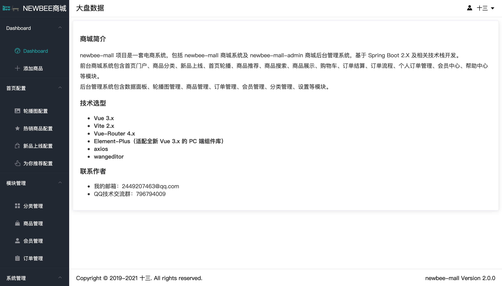

首页大盘数据，通过 `echart` 可视化图表插件，为大家展示订单的数量、状态等信息。以及用户的注册量、日活等信息。这块是一个后台管理系统必不可少的环节，有了它，分析用户的使用行为，可以更好的迭代项目。

#### 轮播图配置

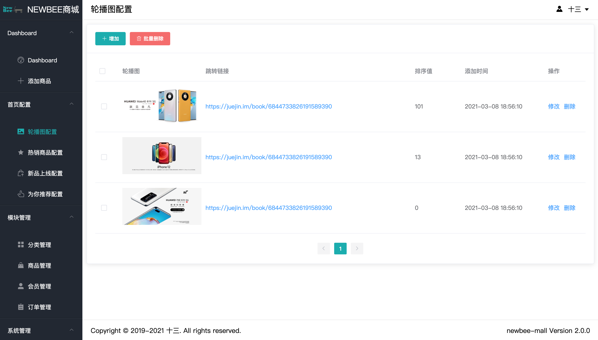

如上图所示，轮播图配置页面以 `Table` 列表为主，支持 `CheckBox` 多选批量删除操作。点击修改，可以单独修改当前轮播图的信息，如下图所示：

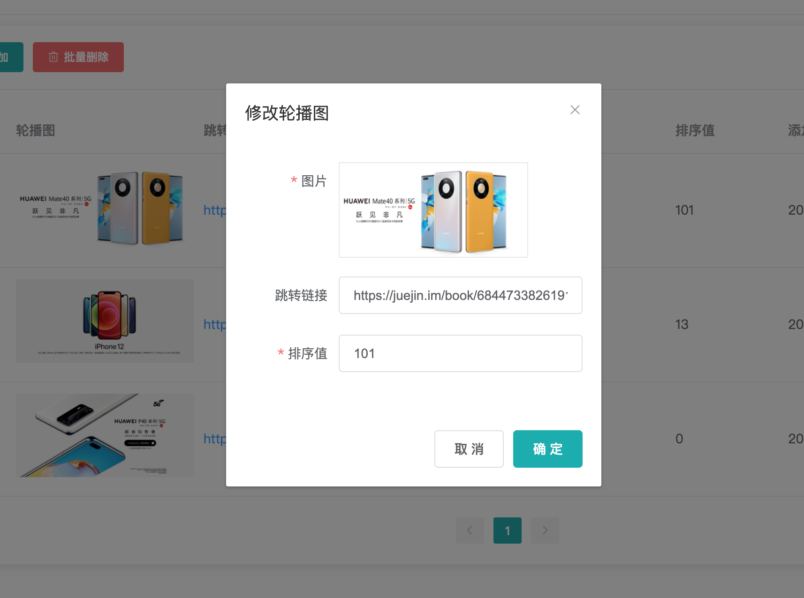

弹窗内的表单，使用 `el-form` 做表单验证，弹窗则使用了 `el-dialog` 组件。

#### 热销商品配置、新品上线配置、为你推荐配置

为什么将这三个功能一起介绍呢，因为他们的功能都是类似的，并且接口数据参数也几乎相同，所以这里就采用同一个页面组件进行数据渲染。也就是，一个页面，通过监听路由的变化，动态的改变接口地址，达到浏览器地址路径变化，视图能跟着变化。如下图所示：

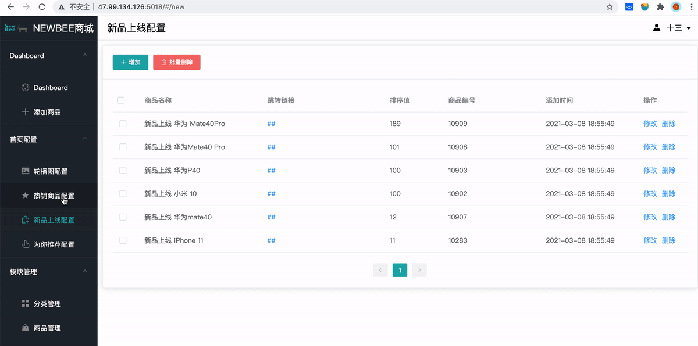

上图通过切换左边栏的目录来改变浏览器地址栏的路径，从而触发路由监听事件，改变视图的数据。

#### 分类管理

分类管理有三级，是用来配置添加商品时，需要设置的商品分类，涉及到三级联动的需求。所以这里分类有一级分类、二级分类、三级分类，并且这三级分类页面功能类似，我们也可以采取合并同类的形式。但是这次不改变历经，在路径后添加浏览器查询参数，通过参数来判断当前的分类级别，如下图所示：

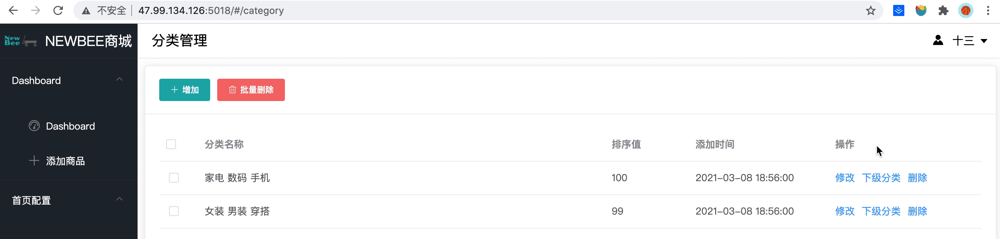

浏览器地址通过 `level` 参数的变化，来控制级别的变化。

#### 商品管理

这是整个后台管理系统里比较复杂的模块，涉及到商品的新增、修改、上下架。商品的新增和编辑用到了三级联动、表单验证、输入框、单选框、图片上传、富文本编辑等等知识点。展示如下所示：

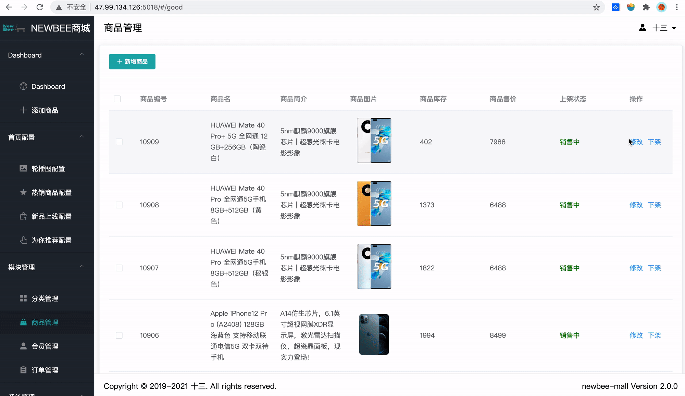

我们使用的富文本插件是 `WangEditor`，因为它率先支持了 `Vue 3`，就冲这份诚意，我们也要支持一波。

#### 会员管理

会员管理，也就是管理 C 端登录注册的用户，通过是否禁来限制用户。页面相对比较清爽，如下所示：

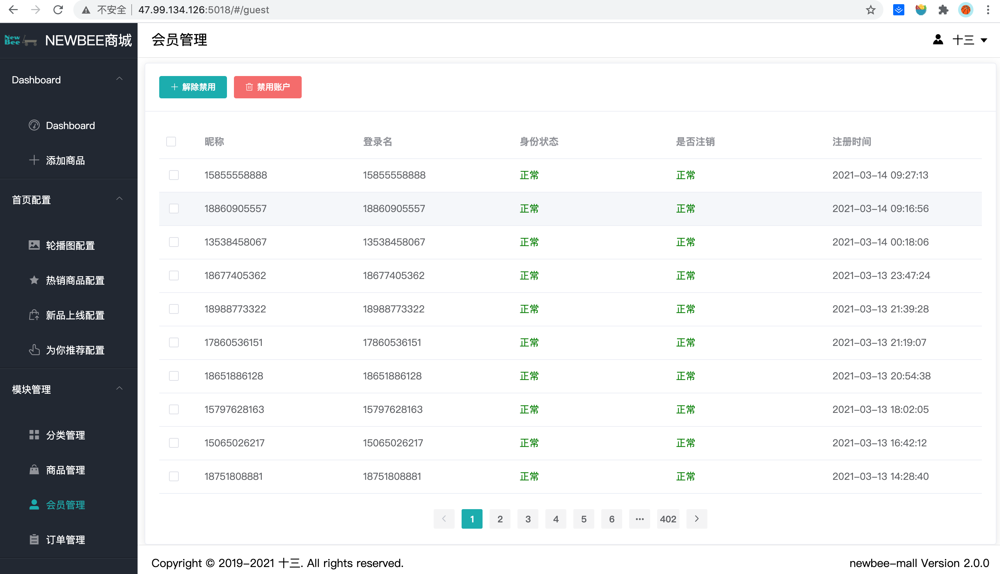

#### 订单管理

订单管理页面涉及到的知识点也比较多，涉及到配货、出库、订单状态的变更、关闭、详情等内容。并且配有条件筛选项，可通过订单号、订单状态，过滤出你想要的订单。

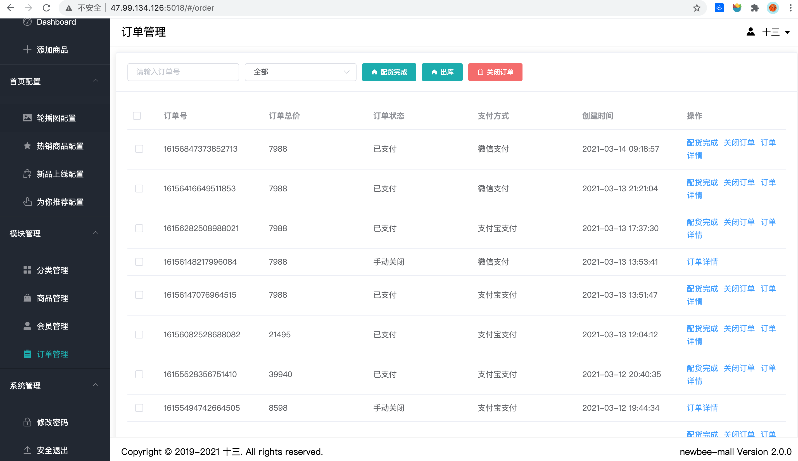

#### 修改密码

此功能涉及到管理员的个人昵称和密码以及登录名的修改。这块内容的操作须谨慎。展示图图下所示：

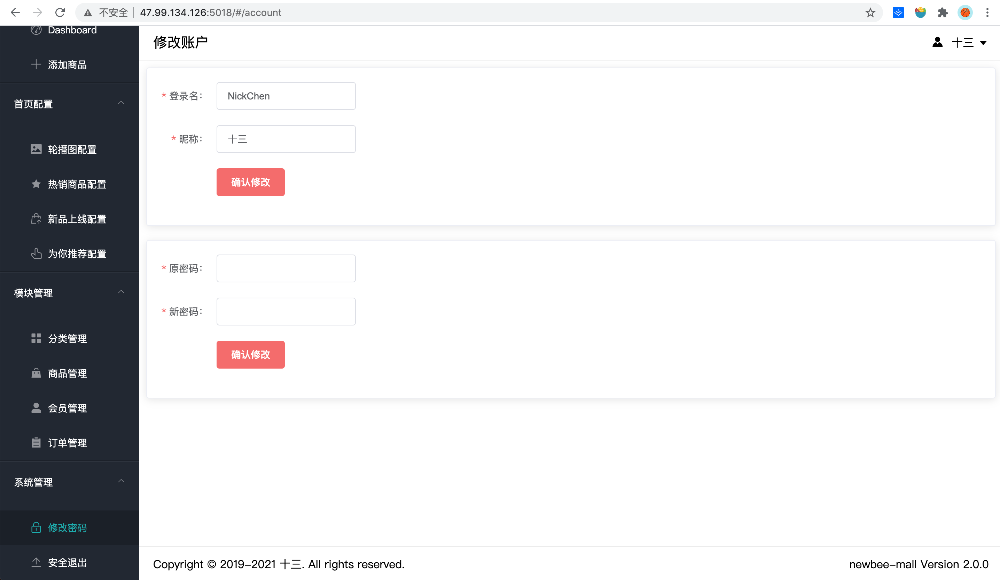

#### 个人信息

个人信息通过 `element-plus` 的 `el-popover` 组件实现，内部采用插槽的形式完成。

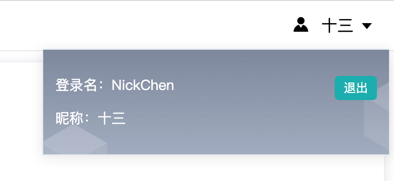

退出登录的操作，放置于此，避免误操作。

#### 其他

整个项目的布局采用如下形式：

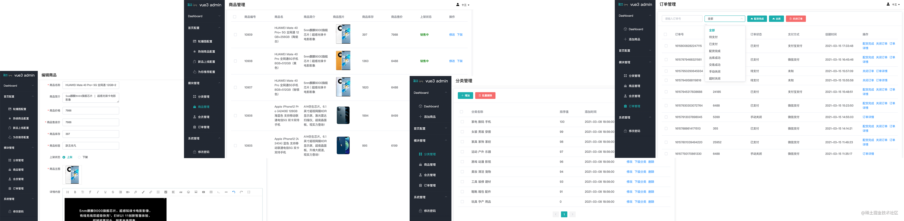

左边栏固定，右边栏自适应。右边栏上下头尾采用公共组件的形式，抽离在 `components` 中，中间的 `content` 部分设置最大高度，超过最大高度则自动出现滚动条。

## 总结

本章内容带你了解管理后台项目的前端部分，如何下载源码及部署项目。以及对项目页面的分析，有助于你更好的了解项目的构造，后续实战环节能更好的理解项目。

> 文档最近更新时间：2022 年 9 月 20 日。
