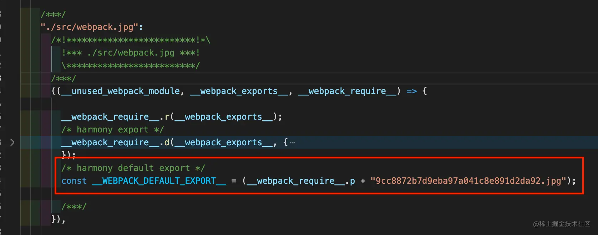
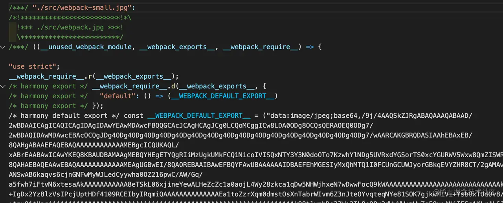
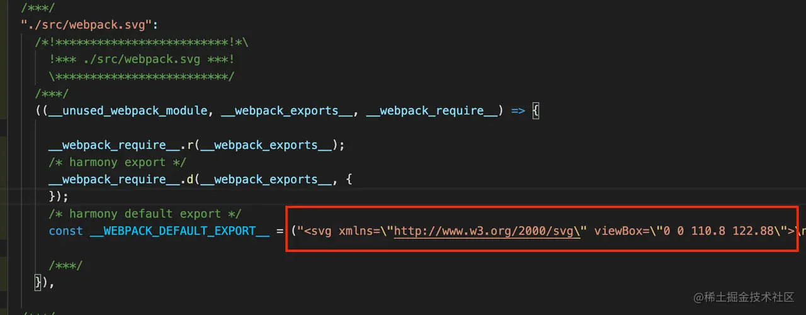
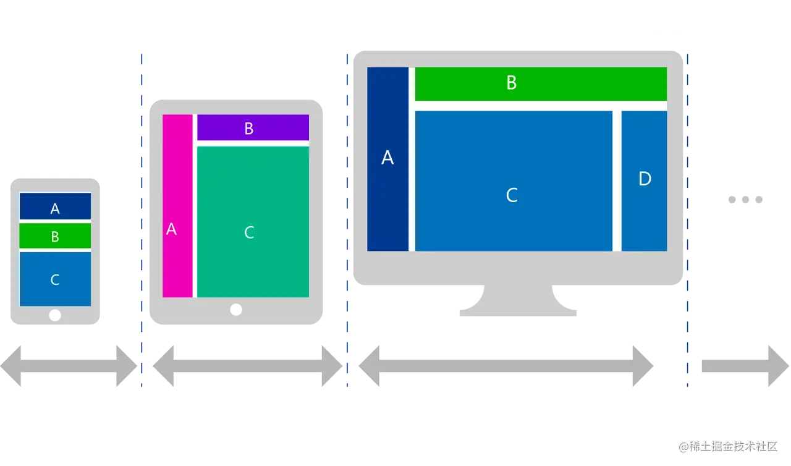

# 10.深入理解图像加载原理与最佳实践

图形图像资源是当代 Web 应用的最常用、实惠的内容、装饰元素之一，但在 Webpack 出现之前对图像资源的处理复杂度特别高，需要借助一系列工具\(甚至 Photoshop\)完成压缩、雪碧图、hash、部署等操作。

而在 Webpack 中，图像以及其它多媒体资源都被提升为一等公民 —— 能够像引用普通 JavaScript 模块一样通过 `import/require` 语句导入资源模块，这种开发模式允许我们将图像相关的处理合入统一的心智模型中，提升开发效率。

本文将集中介绍 Webpack 体系下处理图像资源的常见方法，包括：

- 如何使用适当的 Loader 处理图像资源；
- 如何借助 Loader 或插件实现图像优化，包括压缩、雪碧图、响应式图片。

## 在 Webpack 4 中导入图像

原生 Webpack 4 只能处理标准 JavaScript 模块，因此需要借助 Loader —— 例如 `file-loader`、`url-loader`、`raw-loader` 等完成图像加载操作，实践中我们通常需要按资源类型选择适当加载器，简单介绍：

- [file-loader](https://v4.webpack.js.org/loaders/file-loader/)：将图像引用转换为 url 语句并生成相应图片文件，例如使用如下配置：

```js
// webpack.config.js
module.exports = {
  // ...
  module: {
    rules: [{
      test: /\.(png|jpg)$/,
      use: ['file-loader']
    }],
  },
};
```

经过 `file-loader` 处理后，原始图片会被重命名并复制到产物文件夹，同时在代码中插入图片 URL 地址，形如：




- [url-loader](https://v4.webpack.js.org/loaders/url-loader/)：有两种表现，对于小于阈值 `limit` 的图像直接转化为 base64 编码；大于阈值的图像则调用 `file-loader` 进行加载，例如如下配置：

```js
module.exports = {
  // ...
  module: {
    rules: [{
      test: /\.(png|jpg)$/,
      use: [{
        loader: 'url-loader',
        options: {
          limit: 1024
        }
      }]
    }],
  },
};
```

经过 `url-loader` 处理后，小于 `limit` 参数即 1024B 的图片会被转译为 Base64 编码，如：




对于超过 `limit` 值的图片则直接调用 `file-loader` 完成加载。

`url-loader` 同样适用于大多数图片格式，且能将许多细小的图片直接内嵌进产物中，减少页面运行时需要发出的网络请求数，在 HTTP 1.1 及之前版本中能带来正向的性能收益。

- [raw-loader](https://v4.webpack.js.org/loaders/raw-loader)：不做任何转译，只是简单将文件内容复制到产物中，适用于 SVG 场景，例如如下配置：

```js
// webpack.config.js
module.exports = {
  // ...
  module: {
    rules: [
      {
        test: /\.svg$/i,
        use: ['raw-loader'],
      },
    ],
  },
};
```

经过 `raw-loader` 处理后，SVG 资源会被直接复制成字符串形式：



> 提示：除 `raw-loader` 外，我们还可以使用如下 Loader 加载 SVG 资源：
> - [svg-inline-loader](https://www.npmjs.com/package/svg-inline-loader)：能够自动删除 SVG 图片中与显式无关的各种原信息，达到压缩效果；
> - [svg-url-loader](https://www.npmjs.com/package/svg-url-loader)：以 [DataURL](https://developer.mozilla.org/zh-CN/docs/Web/HTTP/Basics_of_HTTP/Data_URIs) 方式导入 SVG 图片，相比于 Base64 更节省空间；
> - [react-svg-loader](https://www.npmjs.com/package/react-svg-loader)：导入 SVG 图片并自动转化为 React 组件形态，效果类似 [@svgr/webpack](https://www.npmjs.com/package/@svgr/webpack)；
> - [vue-svg-loader](https://www.npmjs.com/package/vue-svg-loader)：导入 SVG 图片并自动转化为 Vue 组件形态。

## 在 Webpack 5 中导入图像

上述 `file-loader`、`url-loader`、`raw-loader` 都并不局限于处理图片，它们还可以被用于加载任意类型的多媒体或文本文件，使用频率极高，几乎已经成为标配组件！所以 Webpack5 直接内置了这些能力，开箱即可使用。

用法上，原本需要安装、导入 Loader，Webpack5 之后只需要通过 `module.rules.type` 属性指定[资源类型](https://webpack.js.org/guides/asset-modules/)即可，对比来看：

- `file-loader` 对标到 `type = "asset/resource"'`：

```js
// webpack.config.js
module.exports = {
  // ...
  module: {
    rules: [{
      test: /\.(png|jpg)$/,
-     use: ['file-loader']
+     type: 'asset/resource'
    }],
  },
};
```

> 提示：默认情况下，`asset/resource` 生成的文件会以 `[hash][ext][query]` 方式重命名，可以通过 [output.assetModuleFilename](https://webpack.js.org/configuration/output/#outputassetmodulefilename) 属性控制。

- `url-loader` 对标到 `type = "asset"` 或 `type = "asset/inline"`：

```js
module.exports = {
  // ...
  module: {
    rules: [{
      test: /\.(png|jpg)$/,
-     use: [{
-       loader: 'url-loader',
-       options: {
-         limit: 1024
-       }
-     }]
+     type: "asset",
+     parser: {
+        dataUrlCondition: {
+          maxSize: 1024 // 1kb
+        }
+     }
    }],
  },
};
```

其中，[module.rules.parser.dataUrlCondition](https://webpack.js.org/configuration/module/#ruleparserdataurlcondition) 用于限定文件大小阈值，对标 `url-loader` 的 `limit` 属性。

- `raw-loader` 对标到 `type = "asset/source"`：

```js
module.exports = {
  // ...
  module: {
    rules: [
      {
        test: /\.svg$/i,
-       use: ['raw-loader']
+       type: "asset/source"
      },
    ],
  },
};
```

补充一下，引入 `module.rules.type` 并不只是为了取代 Loader 那么简单，更重要的目的是在 JavaScript Module 之外增加对其它资源 —— [Asset Module](https://webpack.js.org/guides/asset-modules/) 的原生支持，让 Webpack 有机会介入这些多媒体资源的解析、生成过程，从而有机会实现更标准、高效的资源处理模型。

目前 [`module.rules.type`](https://webpack.js.org/configuration/module/#ruletype) 已经支持 JSON、WebAssemsbly、二进制、文本等资源类型，相信在下一个 Webpack 版本中，必然会基于 Asset Module 实现更丰富的资源处理能力。

## 图像优化：压缩

前面介绍的 Loader 与 Asset Modules 都只是解决了图像资源加载 —— 也就是让 Webpack 能够理解、处理图像资源，现实中我们还需要为 Web 页面中的图片做各种优化，提升页面性能，常见的优化方法包括：

- **图像压缩**：减少网络上需要传输的流量；
- **雪碧图**：减少 HTTP 请求次数；
- **响应式图片**：根据客户端设备情况下发适当分辨率的图片，有助于减少网络流量；
- **CDN**：减少客户端到服务器之间的物理链路长度，提升传输效率；
- 等等。

这其中有不少可以在开发、构建阶段借助 Webpack 搭建自动优化工作流，例如：图像压缩。

在 Webpack 生态中有不少优秀的图像压缩组件，包括：[image-webpack-loader](https://github.com/tcoopman/image-webpack-loader)、[imagemin-webpack-plugin](https://www.npmjs.com/package/imagemin-webpack-plugin)、[image-minimizer-webpack-plugin](https://github.com/webpack-contrib/image-minimizer-webpack-plugin) 等，以我的使用经验来看，[image-webpack-loader](https://github.com/tcoopman/image-webpack-loader) 组件功能齐全且用法简单，更推荐使用。基本用法首先安装依赖：

```
yarn add -D image-webpack-loader
```

之后配置 Loader：

```js
module.exports = {
  // ...
  module: {
    rules: [{
      test: /\.(gif|png|jpe?g|svg)$/i,
      // type 属性适用于 Webpack5，旧版本可使用 file-loader
      type: "asset/resource",
      use: [{
        loader: 'image-webpack-loader',
        options: {
          // jpeg 压缩配置
          mozjpeg: {
            quality: 80
          },
        }
      }]
    }],
  },
};
```

[image-webpack-loader](https://github.com/tcoopman/image-webpack-loader) 底层依赖于 [imagemin](https://github.com/imagemin/imagemin) 及一系列的图像优化工具：

- [mozjpeg](https://github.com/imagemin/imagemin-mozjpeg)：用于压缩 JPG\(JPEG\) 图片；
- [optipng](https://github.com/kevva/imagemin-optipng)：用于压缩 PNG 图片；
- [pngquant](https://github.com/imagemin/imagemin-pngquant)：同样用于压缩 PNG 图片；
- [svgo](https://github.com/kevva/imagemin-svgo)：用于压缩 SVG 图片；
- [gifsicle](https://github.com/kevva/imagemin-gifsicle)：用于压缩 Gif 图；
- [webp](https://github.com/imagemin/imagemin-webp)：用于将 JPG/PNG 图压缩并转化为 WebP 图片格式。

基本上已经覆盖 Web 页面常用的图片格式，具体用法可点击上述链接查阅，此处不再赘述。最后补充一点，图像压缩是一种非常耗时的操作，建议只在生产环境下开启：

```js
module.exports = {
  // ...
  module: {
    rules: [{
      // ...
      use: [{
        loader: 'image-webpack-loader',
        options: {
+         disable: process.env.NODE_ENV === 'development'
          // ...
        }
      }]
    }],
  },
};
```

## 图像优化：雪碧图

在 HTTP 2 之前，HTTP 请求-响应是一种性能低下的通讯模型，即使是为了请求一个非常少的数据，也可能需要完整经历：建立 TCP 连接 => 发送 HTTP 请求 => 服务端处理 => 返回响应数据整个过程，加之 HTTP 协议的队首阻塞、浏览器并发请求数限制等原因，迫使我们必须尽量减少 HTTP 请求数以提升网络通讯效率。

例如，我们可以将许多细小的图片合并成一张大图 —— 从而将复数次请求合并为一次请求，之后配合 CSS 的 `background-position` 控制图片的可视区域，这种技术被称作“**雪碧图**”。在 Webpack 中，我们可以使用 [webpack-spritesmith](https://www.npmjs.com/package/webpack-spritesmith) 插件自动实现雪碧图效果，首先安装依赖：

```
yarn add -D webpack-spritesmith
```

之后添加配置：

```js
module.exports = {
  // ...
  resolve: {
    modules: ["node_modules", "assets"]
  },
  plugins: [
    new SpritesmithPlugin({
      // 需要
      src: {
        cwd: path.resolve(__dirname, 'src/icons'),
        glob: '*.png'
      },
      target: {
        image: path.resolve(__dirname, 'src/assets/sprite.png'),
        css: path.resolve(__dirname, 'src/assets/sprite.less')
      }
    })
  ]
};
```

关键在于，[webpack-spritesmith](https://www.npmjs.com/package/webpack-spritesmith) 插件会将 `src.cwd` 目录内所有匹配 `src.glob` 规则的图片合并成一张大图并保存到 `target.image` 指定的文件路径，同时生成兼容 SASS/LESS/Stylus 预处理器的 mixins 代码，例如对于下面文件结构：

```
load-img
├─ src
│  ├─ icons
│  │  ├─ grunt.png
│  │  ├─ gulp-js.png
│  │  └─ webpack.png
│  └─ index.js
├─ webpack.config.js
└─ package.json
```

按照上述配置运行后会生成如下产物：

<table class="ace-table author-6857319138482798593" data-ace-table-col-widths="356;378;"><colgroup><col width="356"><col width="378"></colgroup><tbody><tr><td style="border: 1px solid rgb(222, 224, 227);"><div data-zone-id="xr1obo3kftevq23n43j916486p8o8a7ghuqxc1749z6m918yf9ub5z0c1d1i5lhsrhzb1a" data-line-index="0" style="white-space: pre;"><code style="font-family: SourceCodeProMac;
      border: 1px solid #dee0e3;
      background-color: #f5f6f7;
      border-radius: 4px;
      margin-left: 2px;
      margin-right: 2px;">src/assets/sprite.png</code></div></td><td style="border: 1px solid rgb(222, 224, 227);"><div data-zone-id="xr1obo3kftevq23n43j916486p8o8a7ghuqxc1gllifhe08uhg2w43smaaunlu0a404von" data-line-index="0" style="white-space: pre;"><code style="font-family: SourceCodeProMac;
      border: 1px solid #dee0e3;
      background-color: #f5f6f7;
      border-radius: 4px;
      margin-left: 2px;
      margin-right: 2px;">src/assets/sprite.less</code></div></td></tr><tr><td style="border: 1px solid rgb(222, 224, 227);"><div data-zone-id="xr1qa8uecsn5olddnr0l7i2bkj7vz2acsdgxc1749z6m918yf9ub5z0c1d1i5lhsrhzb1a" data-line-index="0" style="white-space: pre;"><div class="image-uploaded gallery" data-ace-gallery-json="{&quot;items&quot;:[{&quot;uuid&quot;:&quot;ecba6788-ef2b-4377-b507-2977af29f183&quot;,&quot;height&quot;:&quot;512&quot;,&quot;width&quot;:&quot;1094&quot;,&quot;currHeight&quot;:&quot;512&quot;,&quot;currWidth&quot;:&quot;1094&quot;,&quot;natrualHeight&quot;:&quot;512&quot;,&quot;natrualWidth&quot;:&quot;1094&quot;,&quot;file_token&quot;:&quot;boxcnDLls215Flx0dl7Bp3iJEUe&quot;,&quot;src&quot;:&quot;https%3A%2F%2Finternal-api-drive-stream.feishu.cn%2Fspace%2Fapi%2Fbox%2Fstream%2Fdownload%2Fall%2FboxcnDLls215Flx0dl7Bp3iJEUe%2F%3Fmount_node_token%3DdoccnwuOfkkbHEW5pYEOEjkUkGb%26mount_point%3Ddoc_image&quot;,&quot;image_type&quot;:&quot;image/png&quot;,&quot;size&quot;:93107,&quot;comments&quot;:[],&quot;pluginName&quot;:&quot;imageUpload&quot;,&quot;scale&quot;:2.13671875}]}"></div></div><div data-zone-id="xr1qa8uecsn5olddnr0l7i2bkj7vz2acsdgxc1749z6m918yf9ub5z0c1d1i5lhsrhzb1a" data-line-index="1" style="white-space: pre;"></div></td><td style="border: 1px solid rgb(222, 224, 227);"><div data-zone-id="xr1qa8uecsn5olddnr0l7i2bkj7vz2acsdgxc1gllifhe08uhg2w43smaaunlu0a404von" data-line-index="0" style="white-space: pre;"><pre class="language-CSS" data-wrap="false"><code><div data-zone-id="2quqtogydn" data-line-index="0" style="white-space: pre;">/* ... */
</div><div data-zone-id="2quqtogydn" data-line-index="1" style="white-space: pre;">.sprite(@sprite) {
</div><div data-zone-id="2quqtogydn" data-line-index="2" style="white-space: pre;">  .sprite-image(@sprite);
</div><div data-zone-id="2quqtogydn" data-line-index="3" style="white-space: pre;">  .sprite-position(@sprite);
</div><div data-zone-id="2quqtogydn" data-line-index="4" style="white-space: pre;">  .sprite-width(@sprite);
</div><div data-zone-id="2quqtogydn" data-line-index="5" style="white-space: pre;">  .sprite-height(@sprite);
</div><div data-zone-id="2quqtogydn" data-line-index="6" style="white-space: pre;">}
</div><div data-zone-id="2quqtogydn" data-line-index="7" style="white-space: pre;">/* ... */
</div></code></pre></div></td></tr></tbody></table>

> 提示：示例代码已上传到[小册仓库](https://github1s.com/Tecvan-fe/webpack-book-samples/blob/HEAD/load-img/webpack.config.js)。

之后，我们就可以使用 `sprite.less` 提供的 `.sprite` mixin 添加背景图：

```
@import (less) "./assets/sprite.less";

#main {
    // 参数为原始图片文件名
    .sprite(@webpack);
}
```

> 提示：雪碧图曾经是一种使用广泛的性能优化技术，但 HTTP2 实现 TCP 多路复用之后，雪碧图的优化效果已经微乎其微 —— 甚至是反优化，可以预见随 HTTP2 普及率的提升，未来雪碧图的必要性会越来越低，因此建议读者们了解作用与基本原理即可，不必深究。

## 图像优化：响应式图片

移动互联网时代，我们需要面对的客户端设备越来越多样复杂，分辨率从 PC 到平板电脑再到移动终端跨度极大：




这会带来一个问题：同一张图片\(主要是位图\)在不同设备中，如果显示尺寸大于原始尺寸，最终效果会有明显颗粒感；而如果显示尺寸小于原始尺寸，又会造成带宽浪费。理想的解决方案是为不同设备提供不同的分辨率、不同尺寸的图片 —— 也就是所谓的[响应式图片](https://developer.mozilla.org/en-US/docs/Learn/HTML/Multimedia_and_embedding/Responsive_images)。

Webpack 中有不少能够自动生成响应式图片的组件，例如： [resize-image-loader](https://www.npmjs.com/package/resize-image-loader)、[html-loader-srcset](https://www.npmjs.com/package/html-loader-srcset)、[responsive-loader](https://www.npmjs.com/package/responsive-loader) 等，以 [responsive-loader](https://www.npmjs.com/package/responsive-loader) 为例，首先安装依赖：

```
yarn add -D responsive-loader sharp
```

之后，修改配置：

```js
module.exports = {
  // ...
  module: {
    rules: [{
      test: /\.(png|jpg)$/,
      oneOf: [{
        type: "javascript/auto",
        resourceQuery: /sizes?/,
        use: [{
          loader: "responsive-loader",
          options: {
            adapter: require("responsive-loader/sharp"),
          },
        }],
      }, {
        type: "asset/resource",
      }],
    }],
  }
};
```

注意，实践中我们通常没必要对项目里所有图片都施加响应式特性，因此这里使用 `resourceQuery` 过滤出带 `size/sizes` 参数的图片引用，使用方法：

```js
// 引用图片，并设置响应式参数
import responsiveImage from './webpack.jpg?sizes[]=300,sizes[]=600,sizes[]=1024';

const Picture = function () {
  return (
    
  );
};
```

上例的引用参数 `'./webpack.jpg?sizes[]=300,sizes[]=600,sizes[]=1024';` 最终将生成宽度分别为 300、600、1024 三张图片，之后设置 `img` 标签的 [srcset](https://www.w3schools.com/tags/att_source_srcset.asp) 属性即可实现图片响应式功能。

此外，我们还能简单地通过 `size` 参数精确控制不同条件下的图像尺寸：

```css
.foo {
    background: url("./webpack.jpg?size=1024");
}

@media (max-width: 480px) {
    .foo {
        background: url("./webpack.jpg?size=300");
    }
}
```

> 提示：除本文提及的基本功能外，[responsive-loader](https://www.npmjs.com/package/responsive-loader) 还提供了许多用于控制产物、压缩比等特性的配置项，有需要的同学可到 [官网](https://www.npmjs.com/package/responsive-loader) 展开阅读。

## 总结

在 Webpack 5 之前，我们需要使用 `file-loader`、`url-loader` 等 Loader 加载图片或其它多媒体资源文件，这些加载器各有侧重点，需要根据实际场景择优选用；而 Webpack 5 之后引入了 [Asset Module](https://webpack.js.org/guides/asset-modules/) 模型，自此我们只需要设置适当的 `module.rules.type` 配置即可，不需要为多媒体资源专门引入 Loader。

在加载之外，我们还可以借助 Webpack 生态一系列组件低成本实现图像压缩、雪碧图、响应式图片等优化措施，相关样例实现已汇总到 [小册仓库](https://github1s.com/Tecvan-fe/webpack-book-samples/blob/HEAD/load-img/webpack.config.js)，建议拉下来体验运行效果。

## 思考题

除了文章提及的各项优化措施外，我们还能借助 Webpack 实现哪些图像优化？