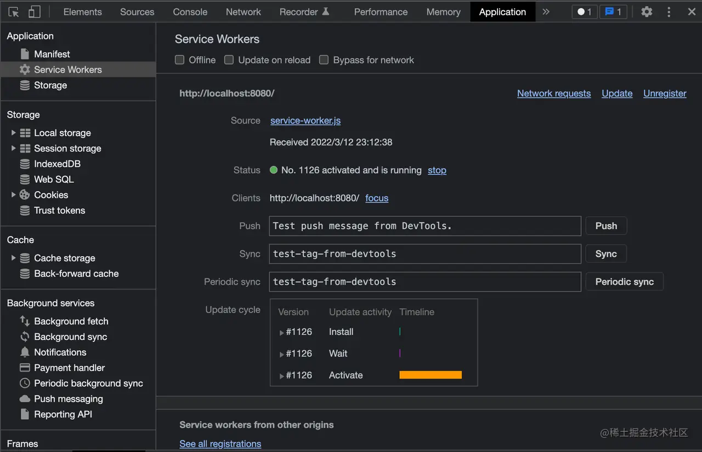
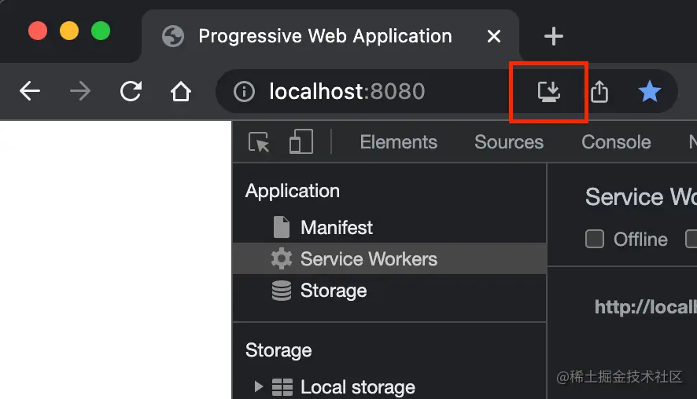
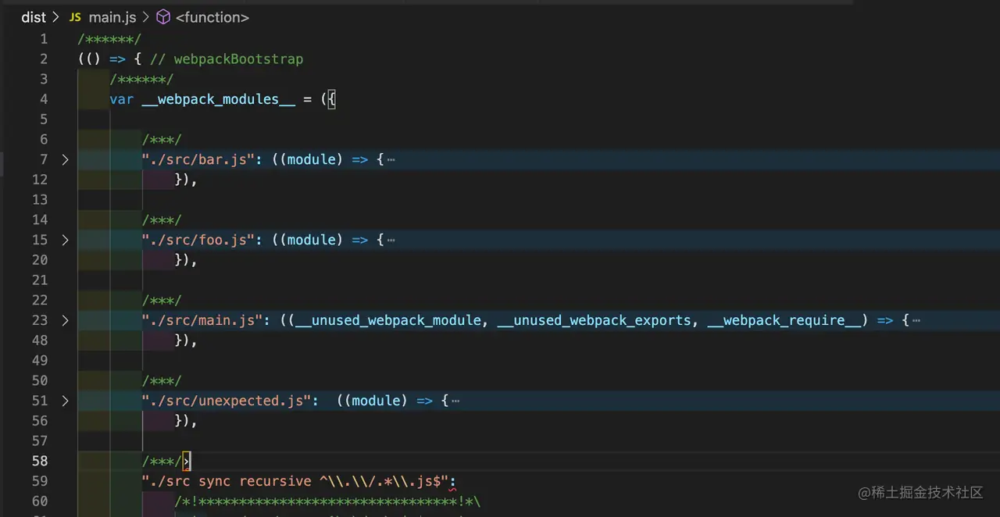

# 9.如何借助 Webpack 开发 PWA、Node、Electron 应用？

毋庸置疑，对前端开发者而言，当下正是一个日升月恒的美好时代！在久远的过去，Web 页面的开发技术链条非常原始而粗糙，那时候的 JavaScript 更多用来点缀 Web 页面交互而不是用来构建一个完整的应用。直到 2009年5月 [Ryan Dahl](https://en.wikipedia.org/wiki/Ryan_Dahl) 正式发布 NodeJS，JavaScript 终于有机会脱离 Web 浏览器独立运行，随之而来的是，基于 JavaScript 构建应用程序的能力被扩展到越来越多场景，我们得以用相同的语言、技术栈、工具独立开发桌面端、服务端、命令行、微前端、PWA 等应用形态。

相应地，我们需要更好的构建、模块化以及打包能力来应对不同形态的工程化需求，所幸 Webpack 提供的功能特性，能够充分支撑这些场景。

前面两个章节我们已经详细介绍了如何使用 Webpack 构建 NPM Library，以及如何基于 Module Federation 搭建微前端架构。本文将继续汇总这些特化场景需求，包括：

- 如何使用 Webpack 构建 Progressive Web Apps 应用；
- 如何使用 Webpack 构建 Node 应用；
- 如何使用 Webpack 构建 Electron 应用。

## 构建 PWA 应用

PWA 全称 Progressive Web Apps \(渐进式 Web 应用\)，原始定义很复杂，可以简单理解为 **一系列将网页如同独立 APP 般安装到本地的技术集合**，借此，我们即可以保留普通网页轻量级、可链接\(SEO 友好\)、低门槛（只要有浏览器就能访问）等优秀特点，又同时具备独立 APP 离线运行、可安装等优势。

实现上，PWA 与普通 Web 应用的开发方法大致相同，都是用 CSS、JS、HTML 定义应用的样式、逻辑、结构，两者主要区别在于，PWA 需要用一些新技术实现离线与安装功能：

- [ServiceWorker](https://developer.mozilla.org/en-US/docs/Web/API/Service_Worker_API)： 可以理解为一种介于网页与服务器之间的本地代理，主要实现 PWA 应用的离线运行功能。例如 `ServiceWorker` 可以将页面静态资源缓存到本地，用户再次运行页面访问这些资源时，`ServiceWorker` 可拦截这些请求并直接返回缓存副本，即使此时用户处于离线状态也能正常使用页面；


- [manifest](https://web.dev/add-manifest/?utm_source=devtools) 文件：描述 PWA 应用信息的 JSON 格式文件，用于实现本地安装功能，通常包含应用名、图标、URL 等内容，例如：

```json
// manifest.json
{
  "icons": [
    {
      "src": "/icon_120x120.0ce9b3dd087d6df6e196cacebf79eccf.png",
      "sizes": "120x120",
      "type": "image/png"
    }
  ],
  "name": "My Progressive Web App",
  "short_name": "MyPWA",
  "display": "standalone",
  "start_url": ".",
  "description": "My awesome Progressive Web App!"
}
```

我们可以选择自行开发、维护 `ServiceWorker` 及 `manifest` 文件 ，也可以简单点使用 Google 开源的 Workbox 套件自动生成 PWA 应用的壳，首先安装依赖：

```bash
yarn add -D workbox-webpack-plugin webpack-pwa-manifest
```

其中：

- `workbox-webpack-plugin`：用于自动生成 `ServiceWorker` 代码的 Webpack 插件；
- `webpack-pwa-mainifest`：根据 Webpack 编译结果，自动生成 PWA Manifest 文件的 Webpack 插件。

之后，在 `webpack.config.js` 配置文件中注册插件：

```js
const HtmlWebpackPlugin = require("html-webpack-plugin");
const { GenerateSW } = require("workbox-webpack-plugin");
const WebpackPwaManifest = require("webpack-pwa-manifest");

module.exports = {
  // ...
  plugins: [
    new HtmlWebpackPlugin({
      title: "Progressive Web Application",
    }),
    // 自动生成 Manifest 文件
    new WebpackPwaManifest({
      name: "My Progressive Web App",
      short_name: "MyPWA",
      description: "My awesome Progressive Web App!",
      publicPath: "/",
      icons: [
        {
          // 桌面图标，注意这里只支持 PNG、JPG、BMP 格式
          src: path.resolve("src/assets/logo.png"),
          sizes: [150],
        },
      ],
    }),
    // 自动生成 ServiceWorker 文件
    new GenerateSW({
      clientsClaim: true,
      skipWaiting: true,
    }),
  ],
};
```

> 提示：示例代码已上传到 [小册仓库](https://github1s.com/Tecvan-fe/webpack-book-samples/tree/main/8-1_pwa)。

之后，执行编译命令如 `npx webpack` 就可以生成如下资源：

```
├─ 8-1_pwa
│  ├─ src
│  │  ├─ xxx
│  ├─ dist
│  │  ├─ icon_150x150.119e95d3213ab9106b0f95100015a20a.png
│  │  ├─ index.html
│  │  ├─ main.js
│  │  ├─ manifest.22f4938627a3613bde0a011750caf9f4.json
│  │  ├─ service-worker.js
│  │  ├─ workbox-2afe96ff.js
│  └─ webpack.config.js
```

接下来，运行并使用 Chrome 打开页面，打开开发者工具，切换到 `Applicatios > Service Workers` 面板，可以看到：




这表明 Service Worker 已经正常安装到浏览器上。此外，地址栏右方还会出现一个下载图标：



点击该图标可将应用下载到本地，并在桌面创建应用图标 —— 效果如同安装独立 App 一样。

> 提示：PWA 是一种复杂度较高的技术，前文只是介绍了一种 Webpack 构建 PWA 的简单方法，感兴趣的同学可以扩展阅读：
>
> - https://developer.chrome.com/docs/workbox/modules/workbox-webpack-plugin/
> - https://developers.google.com/web/fundamentals/primers/service-workers

## 构建 Node 应用

注意，**在开发 Node 程序时使用 Webpack 的必要性并不大**，因为 Node 本身已经有完备的模块化系统，并不需要像 Web 页面那样把所有代码打包成一个（或几个）产物文件！即使是为了兼容低版本 Node 环境，也可以使用更简单的方式解决 —— 例如 Babel，引入 Webpack 反而增加了系统复杂度以及不少技术隐患。

不过，出于学习目的，我们还是可以了解一下使用 Webpack 构建 Node 程序的方法及注意事项，包括：

1.  需要 Webpack 的 [`target`](https://webpack.js.org/configuration/target/) 值设置为 `node` ，这能让 Webpack 忽略 `fs/path` 等原生 Node 模块；
2.  需要使用 [`externals`](https://webpack.js.org/configuration/externals/) 属性过滤 `node_modules` 模块，简单起见，也可以直接使用 `webpack-node-externals` 库；
3.  需要使用 [`node`](https://webpack.js.org/configuration/node/) 属性，正确处理 `__dirname`、`__filename` 值。

一个典型的 Node 构建配置如下：

```js
const nodeExternals = require("webpack-node-externals");

module.exports = merge(WebpackBaseConfig, {
  // 1. 设置 target 为 node
  target: "node",
  entry: ...,
  module: [...],
  // 2. 过滤 node_modules 模块
  externals: [nodeExternals()],
  // 3. 设置 __dirname, __filename 值
  node: {
    __filename: false,
    __dirname: false,
  },
});
```

在此基础上，我们可以复用大多数 Loader、Plugin 及 Webpack 基础能力实现各种构建功能。

不过，需要特别注意，在 Node 代码中请务必慎用动态 `require` 语句，你很可能会得到预期之外的效果！例如对于下面的示例目录：

```
├─ example
│  ├─ src
│  │  ├─ foo.js
│  │  ├─ bar.js
│  │  ├─ unused.js
│  │  └─ main.js
│  ├─ package.json
│  └─ webpack.config.js
```

其中 `main.js` 为入口文件，代码：

```js
const modules = ['foo', 'bar'].map(r => require(`./${r}.js`));
```

可以看到在 `main.js` 中并没有引用 `unused.js` ，但打包产物中却包含了 `src` 目录下所有文件：




这是因为 Webpack 遇到示例中的 `require` 语句时，仅仅依靠词法规则、静态语义、AST 等手段并不能推断出实际依赖情况，只能退而求其次粗暴地将所有可能用到的代码一股脑合并进来，这种处理手段很可能会带来许多意想不到的结果，很可能触发 BUG！

综上，建议尽量不要使用 Webpack 构建 Node 应用。

## 构建 Electron 应用

Electron 是一种使用 JavaScript、HTML、CSS 等技术构建跨平台桌面应用开发框架，这意味着我们能用我们熟悉的大部分 Web 技术 —— 例如 React、Vue、Webpack 等开发桌面级应用程序。实际上，许多大名鼎鼎的应用如 VSCode、Facebook Messenger、Twitch，以及国内诸多小程序 IDE 都是基于 Electron 实现的。

与 Web 页面不同，Electron 应用由一个 **主进程** 及若干 **渲染进程** 组成，进程之间以 IPC 方式通讯，其中：

- 主进程是一个 Node 程序，能够使用所有 Node 能力及 Electron 提供的 Native API，主要负责应用窗口的创建与销毁、事件注册分发、版本更新等；
- 渲染进程本质上是一个 Chromium 实例，负责加载我们编写的页面代码，渲染成 Electron 应用界面。


> 提示：Chromium 是一个非常简洁的开源浏览器，许多浏览器都基于 Chromium 二次开发而成，例如 Chrome、Microsoft Edge、Opera 等。

Electron 这种多进程机构，要求我们能在同一个项目中同时支持主进程与若干渲染进程的构建，两者打包需求各有侧重。接下来我们将通过一个简单示例，逐步讲解如何使用 Webpack 搭建一套完备的 Electron 应用构建环境，示例文件结构如下：

```
8-3_electron-wp
├─ package.json
├─ webpack.main.config.js       // 主进程构建配置
├─ webpack.renderer.config.js   // 渲染进程构建配置
├─ src
│  ├─ main.js
│  ├─ pages
│  │  ├─ home
│  │     ├─ index.js
│  │  ├─ login
│  │     ├─ index.js
```

> 提示：示例代码已上传到 [小册仓库](https://github1s.com/Tecvan-fe/webpack-book-samples/tree/main/8-3_electron-wp)。

其中：

- `src/main.js` 为主进程代码；
- `src/pages/${page name}/` 目录为渲染进程 —— 即桌面应用中每一个独立页面的代码；
- 由于主进程、渲染进程的打包差异较大，这里为方便演示，直接写成两个配置文件：`webpack.main.config.js` 与 `webpack.renderer.config.js`。

### Electron 主进程打包配置

主进程负责应用窗口的创建销毁，以及许多跨进程通讯逻辑，可以理解为 Electron 应用的控制中心，简单示例：

```js
// src/main.js
const { app, BrowserWindow } = require("electron");

// 应用启动后
app.whenReady().then(() => {
  // 创建渲染进程实例
  const win = new BrowserWindow({
    width: 800,
    height: 600
  });
  // 使用 BrowserWindow 实例打开页面
  win.loadFile("home.html");
});
```

代码核心逻辑是在应用启动后 （`app.whenReady` 钩子），创建 `BrowserWindow` 实例并打开页面。

> 提示：建议结合 Electron 官方提供的 [完整示例](https://www.electronjs.org/zh/docs/latest/tutorial/examples) 一起学习。

Electron 主进程本质上是一个 Node 程序，因此许多适用于 Node 的构建工具、方法也同样适用主进程，例如 Babel、TypeScript、ESLint 等。与普通 Node 工程相比，构建主进程时需要注意：

- 需要将 [`target`](https://webpack.js.org/configuration/target/) 设置为 `electron-main` ，Webpack 会自动帮我们过滤掉一些 Electron 组件，如 `clipboard`、`ipc`、`screen` 等；
- 需要使用 `externals` 属性排除 `node_modules` 模块，简单起见也可以直接使用 [webpack-node-externals](https://www.npmjs.com/package/webpack-node-externals) 包；
- 生产环境建议将 `devtools` 设置为 `false`，减少包体积。

对应的配置脚本：

```js
// webpack.main.config.js
const path = require("path");
const nodeExternals = require("webpack-node-externals");

module.exports = {
  // 主进程需要将 `target` 设置为 `electron-main`
  target: "electron-main",
  mode: process.env.NODE_ENV || "development",
  // 开发环境使用 `source-map`，保持高保真源码映射，方便调试
  devtool: process.env.NODE_ENV === "production"? false: "source-map",
  entry: {
    main: path.join(__dirname, "./src/main"),
  },
  output: {
    filename: "[name].js",
    path: path.join(__dirname, "./dist"),
  },
  externals: [nodeExternals()],
};
```

至此，一个非常简单的主进程脚本与构建环境示例就搭建完毕了，执行下述命令即可完成构建工作：

```bash
npx webpack -c webpack.main.config.js
```

另外，安装 Electron 过程中可能会遇到网络超时问题，这是因为资源域已经被墙了，可以使用阿里云镜像解决：

```bash
ELECTRON_MIRROR="https://cdn.npm.taobao.org/dist/electron/" npm i -D electron
```

### Electron 渲染进程打包配置

Electron 渲染进程本质上就一个运行在 Chromium 浏览器上的网页，开发方法基本等同于我们日常开发的普通 Web 页面，例如我们可以用 React 开发 Electron 渲染进程：

```js
// src/home/index.js
import React from "react";
import ReactDOM from "react-dom";

const root = document.createElement("div");

ReactDOM.render(<h1>Hello world!</h1>, root);

document.body.append(root);
```

> 提示：示例代码已上传到 [小册仓库](https://github1s.com/Tecvan-fe/webpack-book-samples/tree/main/8-3_electron-wp)。

相应的，我们可以复用大部分普通 Web 页面构建的方式方法，主要差异点：

1.  需要将 Webpack 的 `target` 配置设置为 `electron-renderer`；
2.  Electron 应用通常包含多个渲染进程，因此我们经常需要开启多页面构建配置；
3.  为实现渲染进程的 HMR 功能，需要对主进程代码稍作改造。

第一点很简单：

```js
// webpack.renderer.config.js
module.exports = {
  // 渲染进程需要将 `target` 设置为 `electron-renderer`
  target: "electron-renderer"
};
```

> 提示：Webpack 为 Electron 提供了三种特殊 `target` 值：`electron-main/electron-renderer/electron-preload`，分别用于主进程、Renderer 进程、Preload 脚本三种场景。

第二点可以用多 `entry` 配置实现，如：

```js
// webpack.renderer.config.js
// 入口文件列表
const entries = {
  home: path.join(__dirname, "./src/pages/home"),
  login: path.join(__dirname, "./src/pages/login"),
};

// 为每一个入口创建 HTMLWebpackPlugin 实例
const htmlPlugins = Object.keys(entries).map(
  (k) =>
    new HtmlWebpackPlugin({
      title: `[${k}] My Awesome Electron App`,
      filename: `${k}.html`,
      chunks: [k],
    })
);

module.exports = {
  mode: process.env.NODE_ENV || "development",
  entry: entries,
  target: "electron-renderer",
  plugins: [...htmlPlugins],
  // ...
};
```

第三点，由于 Webpack 的 HMR 功能强依赖于 WebSocket 实现通讯，但 Electron 主进程常用文件协议 `file://` 打开页面，该协议不支持 WebSocket 接口，为此我们需要改造主进程启动代码，以 HTTP 方式打开页面代码，如：

```js
function createWindow() {
  const win = new BrowserWindow({
    //...
  });

  if (process.env.NODE_ENV === "development") {
    // 开发环境下，加载 http 协议的页面，方便启动 HMR
    win.loadURL("http://localhost:8080/home");
  } else {
    // 生产环境下，依然使用 `file://` 协议
    win.loadFile(path.join(app.getAppPath(), "home.html"));
  }
}
```

> 提示：在生产环境中，出于性能考虑，Electron 主进程通常会以 [File URL Scheme](https://en.wikipedia.org/wiki/File_URI_scheme) 方式直接加载本地 HTML 文件，这样我们就不必为了提供 HTML 内容而专门启动一个 HTTP 服务进程。不过，同一份代码，用 File URL Scheme 和用 HTTP 方式打开，浏览器提供的接口差异较大，开发时注意区分测试接口兼容性。

至此，改造完毕，同学们可以 Clone [示例代码](https://github1s.com/Tecvan-fe/webpack-book-samples/blob/main/8-3_electron-wp/src/main.js)，本地运行测试效果。

## 总结

综上，Webpack 不仅能构建一般的 Web 应用，理论上还适用于一切以 JavaScript 为主要编程语言的场景，包括 PWA、Node 程序、Electron 等，只是不同场景下的具体构建需求略有差异：

- PWA：需要使用 `workbox-webpack-plugin` 自动生成 `ServiceWorker` 代码；使用 `webpack-pwa-mainifest` Manifest 文件；
- Node 程序：需要设置 Webpack 配置项 `target = "node"`；需要使用 [externals](https://webpack.js.org/configuration/externals/) 属性过滤 `node_modules` 模块；需要使用 [node](https://webpack.js.org/configuration/node/) 属性正确处理 Node 全局变量；
- Electron 桌面应用：需要为主进程、渲染进程分别设置不同的构建脚本；同时需要注意开发阶段使用 HMR 的注意事项。

这种强大、普适的构建能力正是 Webpack 的核心优势之一，同类工具无出其右者，虽然不能一招鲜吃天下，但也足够覆盖大多数前端应用场景。站在学习的角度，你可以将主要精力放在 Webpack 基础构建逻辑、配置规则、常用组件上，遇到特殊场景时再灵活查找相应 Loader、Plugin 以及其它生态工具，就可以搭建出适用的工程化环境。

## 思考题

作为对比，调研一下同类框架：Rollup、Parcel、Gulp 等，能否被用于构建 PWA、Node、Electron、微前端、小程序等应用？