我们在找工作的时候，都会用 boss 直聘、拉钩之类的 APP 投简历。

根据职位描述筛选出适合自己的来投。

此外，职位描述也是我们简历优化的方向，甚至是平时学习的方向。

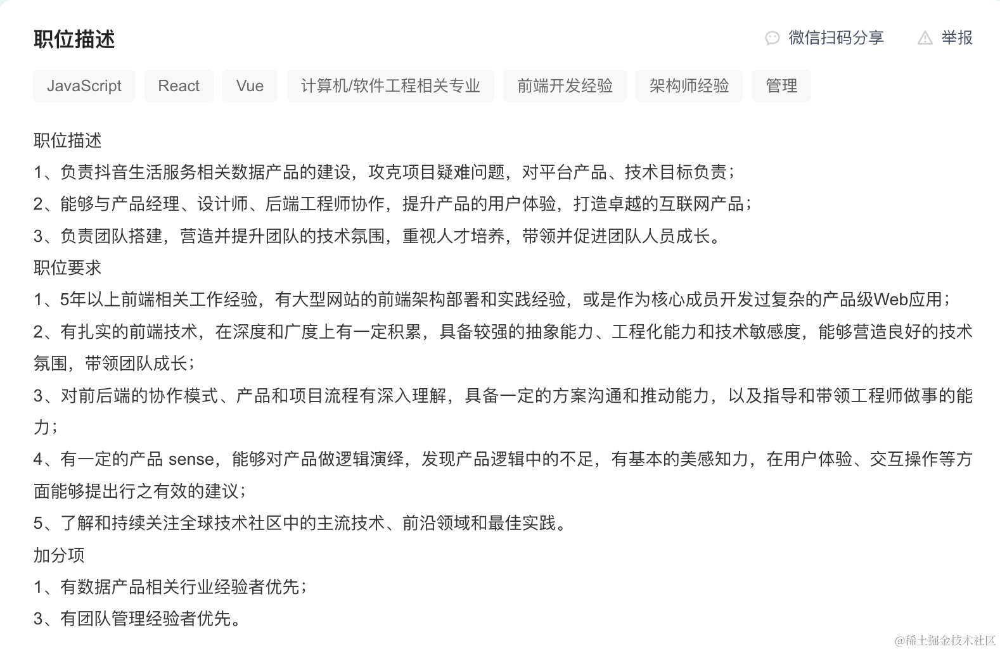

所以我觉得招聘网站的职位描述还是挺有价值的，就想把它们都爬取下来存到数据库里。

今天我们一起来实现下。

爬取数据我们使用 Puppeteer 来做，然后用 TypeORM 把爬到的数据存到 mysql 表里。

创建个项目：

```
mkdir jd-spider
cd jd-spider
npm init -y
```
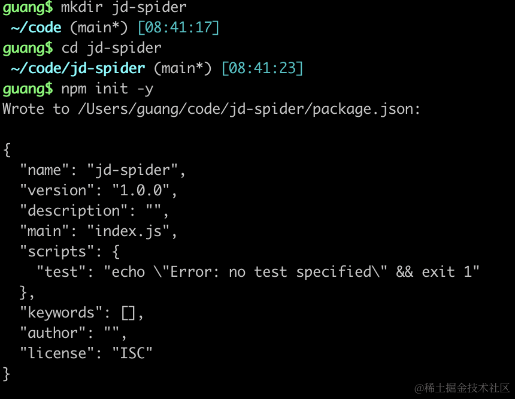

进入项目，安装 puppeteer：

```
npm install --save puppeteer
```

我们要爬取的是 boss 直聘的网站数据。

首先，进入[搜索页面](https://www.zhipin.com/web/geek/job?query=%E5%89%8D%E7%AB%AF&city=100010000)，选择全国范围，搜索前端：


然后职位列表的每个点进去查看描述，把这个岗位的信息和描述抓取下来：


创建 test.js

```javascript
import puppeteer from 'puppeteer';

const browser = await puppeteer.launch({
    headless: false,
    defaultViewport: {
        width: 0,
        height: 0
    }
});

const page = await browser.newPage();

await page.goto('https://www.zhipin.com/web/geek/job');

await page.waitForSelector('.job-list-box');

await page.click('.city-label', {
    delay: 500
});

await page.click('.city-list-hot li:first-child', {
    delay: 500
});

await page.focus('.search-input-box input');

await page.keyboard.type('前端', {
    delay: 200
});

await page.click('.search-btn', {
    delay: 1000
});
```
调用 launch 跑一个浏览器实例，指定 headless 为 false 也就是有界面。

defaultView 设置 width、height 为 0 是网页内容充满整个窗口。

然后就是自动化的流程了：

首先进入职位搜索页面，等 job-list-box 这个元素出现之后，也就是列表加载完成了。

就点击城市选择按钮，选择全国。

然后在输入框输入前端，点击搜索。

然后跑一下。

跑之前在 package.json 设置 type 为 module，也就是支持 es module 的 import：

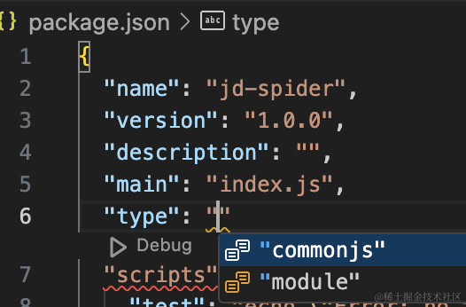

```
node ./test.js
```
它会自动打开一个浏览器窗口：


然后执行自动化脚本：


这样，下面的列表数据就是可以抓取的了。

不过这里其实没必要这么麻烦，因为只要你 url 里带了 city 和 query 的参数，会自动设置为搜索参数：

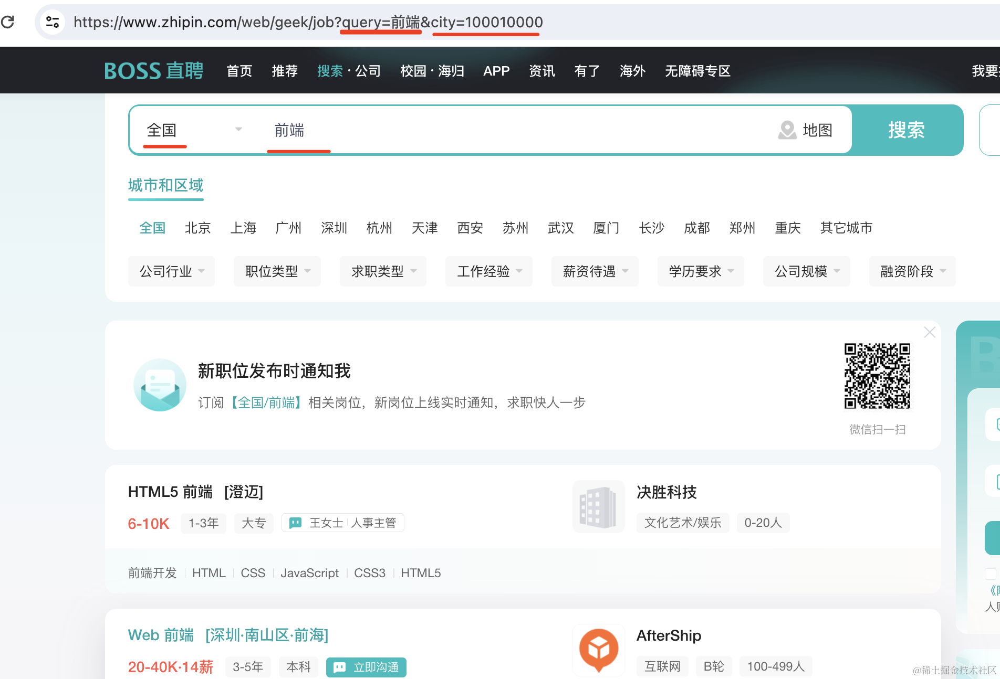

所以直接打开这个 url 就可以：

```javascript
import puppeteer from 'puppeteer';

const browser = await puppeteer.launch({
    headless: false,
    defaultViewport: {
        width: 0,
        height: 0
    }
});

const page = await browser.newPage();

await page.goto('https://www.zhipin.com/web/geek/job?query=前端&city=100010000');

await page.waitForSelector('.job-list-box');
```
然后我们要拿到页数，用来访问列表的每页数据。

怎么拿到页数呢？

其实就是拿 options-pages 的倒数第二个 a 标签的内容：

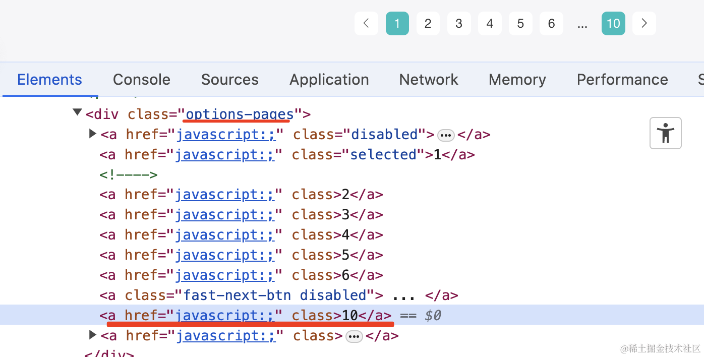

```javascript
import puppeteer from 'puppeteer';

const browser = await puppeteer.launch({
    headless: false,
    defaultViewport: {
        width: 0,
        height: 0
    }
});

const page = await browser.newPage();

await page.goto('https://www.zhipin.com/web/geek/job?query=前端&city=100010000');

await page.waitForSelector('.job-list-box');

const res = await page.$eval('.options-pages a:nth-last-child(2)', el => {
    return parseInt(el.textContent)
});

console.log(res);
```

$eval 第一个参数是选择器，第二个参数是对选择出的元素做一些处理后返回。

跑一下：

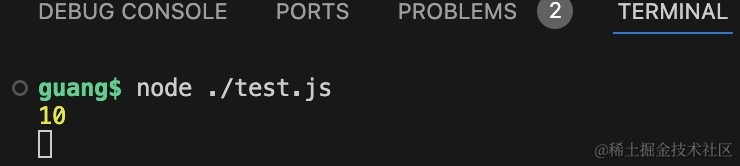

页数没问题。

然后接下来就是访问每页的列表数据了。

就是在 url 后再带一个 page 的参数：

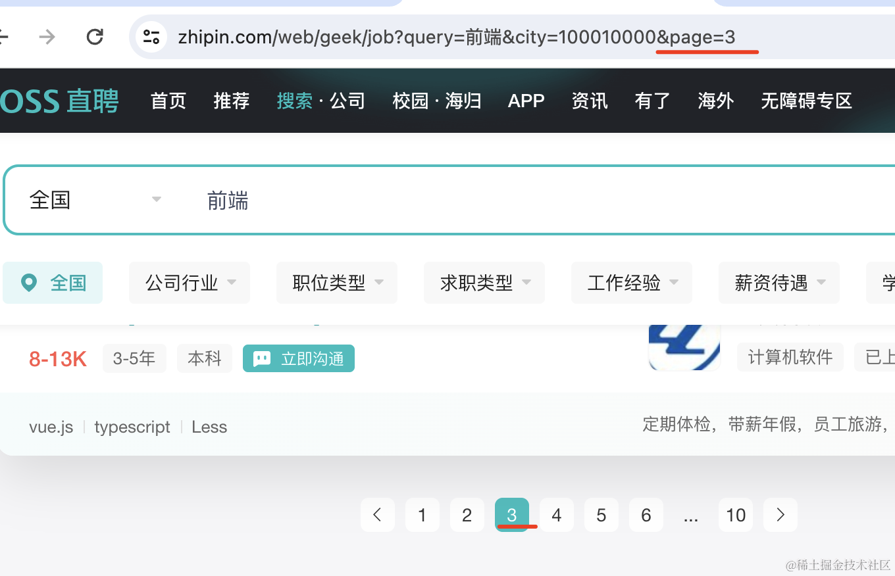

然后，我们遍历访问每页数据，拿到每个职位的信息：

```javascript
import puppeteer from 'puppeteer';

const browser = await puppeteer.launch({
    headless: false,
    defaultViewport: {
        width: 0,
        height: 0
    }
});

const page = await browser.newPage();

await page.goto('https://www.zhipin.com/web/geek/job?query=前端&city=100010000');

await page.waitForSelector('.job-list-box');

const totalPage = await page.$eval('.options-pages a:nth-last-child(2)', e => {
    return parseInt(e.textContent)
});

const allJobs = [];
for(let i = 1; i <= totalPage; i ++) {
    await page.goto('https://www.zhipin.com/web/geek/job?query=前端&city=100010000&page=' + i);

    await page.waitForSelector('.job-list-box');

    const jobs = await page.$eval('.job-list-box', el => {
        return [...el.querySelectorAll('.job-card-wrapper')].map(item => {
            return {
                job: {
                    name: item.querySelector('.job-name').textContent,
                    area: item.querySelector('.job-area').textContent,
                    salary: item.querySelector('.salary').textContent
                },
                link: item.querySelector('a').href,
                company: {
                    name: item.querySelector('.company-name').textContent,
                }
            }
        })
    });
    allJobs.push(...jobs);
}

console.log(allJobs);
```
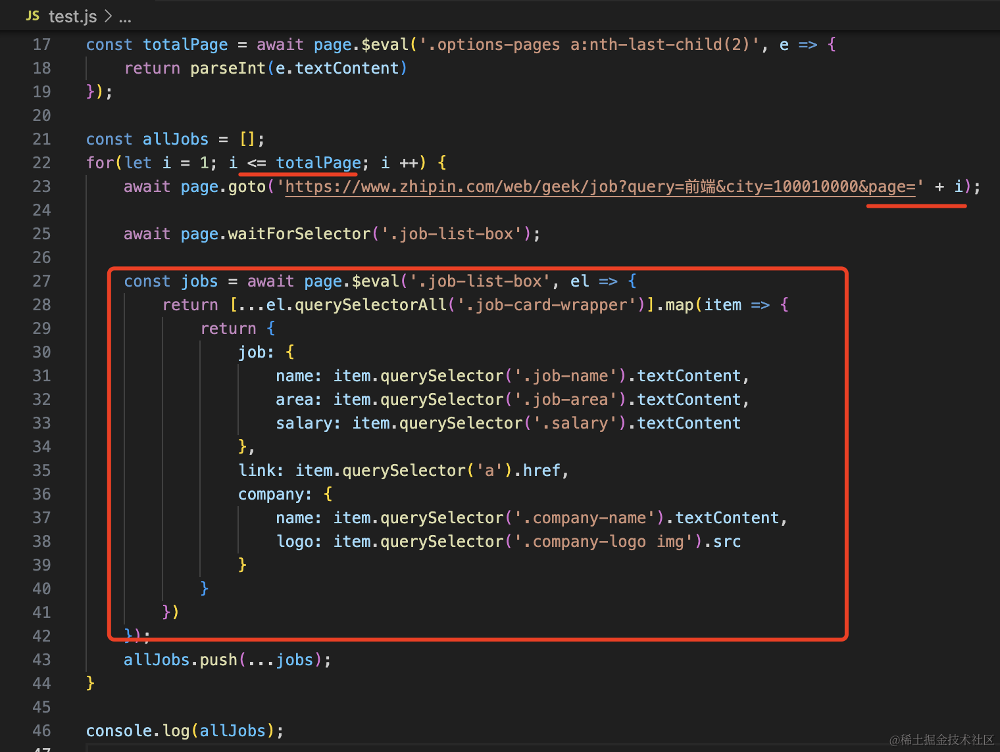

具体的信息都是从 dom 去拿的：

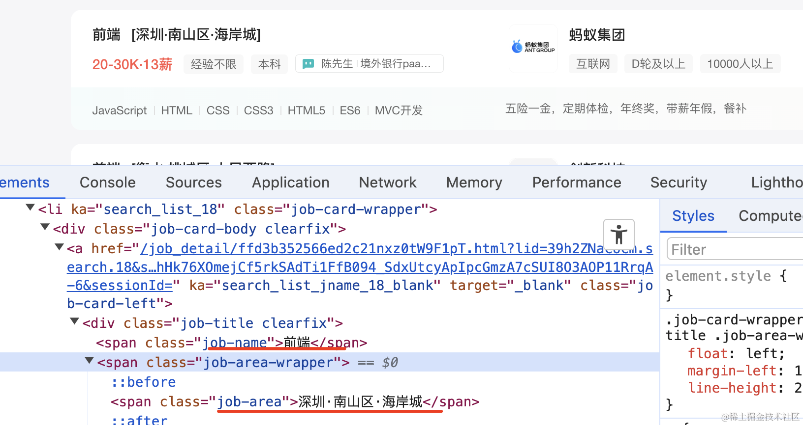

跑一下试试：


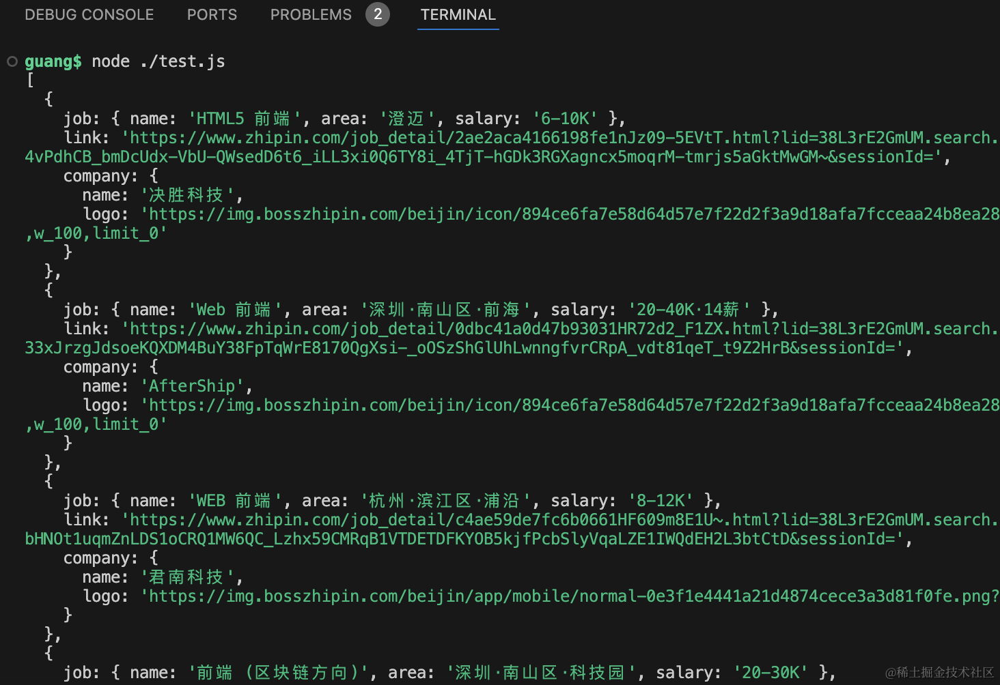

可以看到，它会依次打开每一页，然后把职位数据爬取下来。

做到这一步还不够，我们要点进去这个链接，拿到 jd 的描述。

[](https://p3-juejin.byteimg.com/tos-cn-i-k3u1fbpfcp/38c311e0bdcf4db6b8d15bf173ed058f~tplv-k3u1fbpfcp-jj-mark:0:0:0:0:q75.image#?w=1076&h=756&s=122606&e=png&b=1f1f1f)
```javascript
for(let i = 0; i< allJobs.length; i ++) {
    await page.goto(allJobs[i].link);

    try{
        await page.waitForSelector('.job-sec-text');

        const jd= await page.$eval('.job-sec-text', el => {
            return el.textContent
        });
        allJobs[i].desc = jd;

        console.log(allJobs[i]);
    } catch(e) {}
}

```
try catch 是因为有的页面可能打开会超时导致中止，这种就直接跳过好了。

跑一下：


它同样会自动打开每个岗位详情页，拿到职位描述的内容，并打印在控制台。


接下来只要把这些存入数据库就好了。

我们新建个 nest 项目：

```
npm install -g @nestjs/cli

nest new boss-jd-spider
```
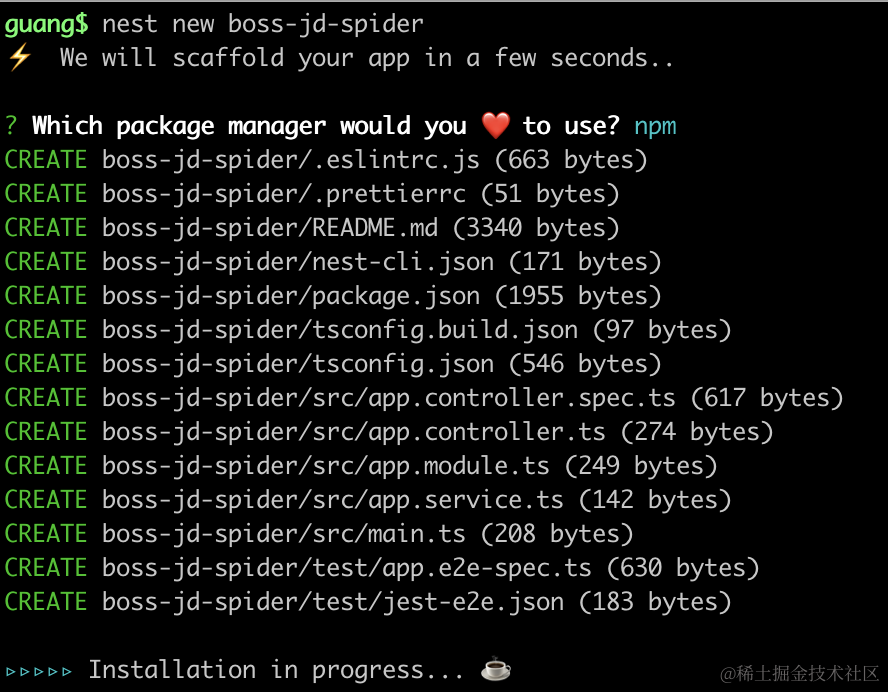

用 docker 把 mysql 跑起来：

从 [docker 官网](https://docker.com/)下载 docker desktop，这个是 docker 的桌面端：

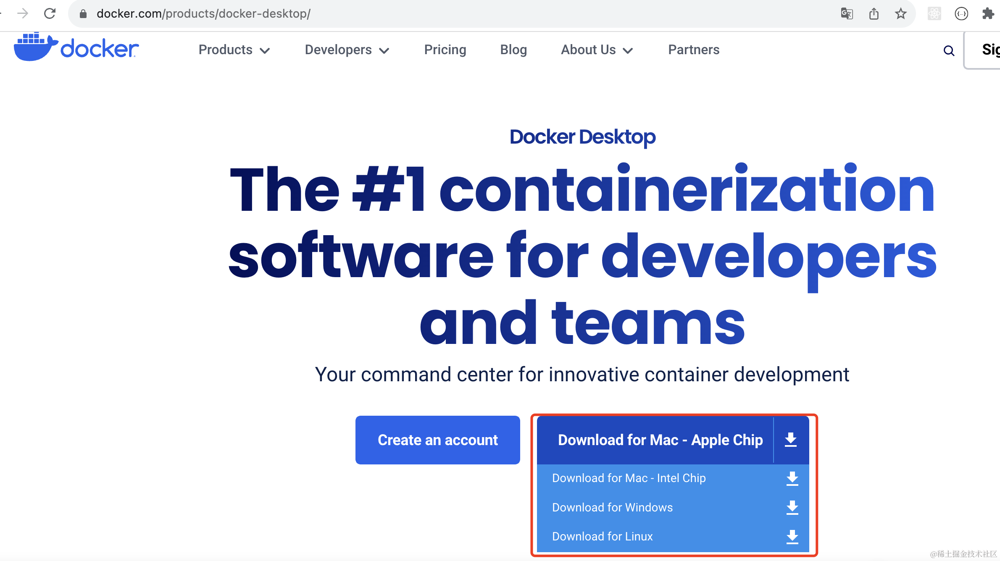

跑起来后，搜索 mysql 镜像（这步需要科学上网），点击 run：

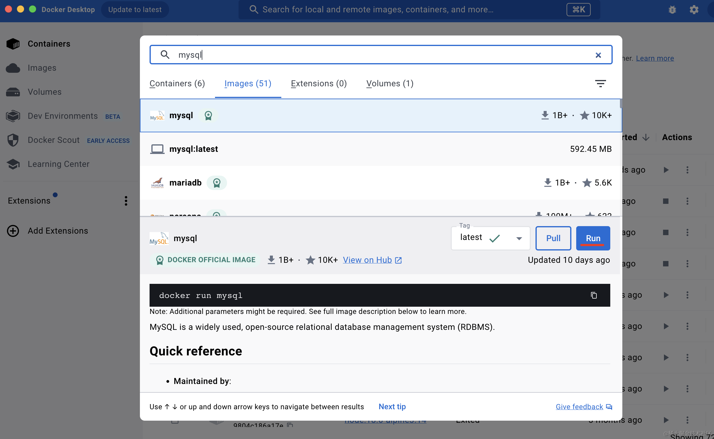

输入容器名、端口映射、以及挂载的数据卷，还要指定一个环境变量：

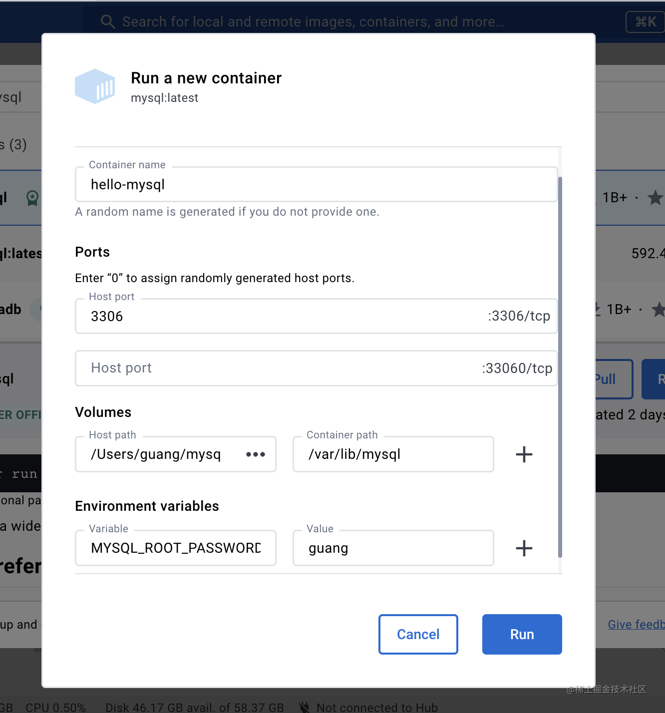

端口映射就是把宿主机的 3306 端口映射到容器里的 3306 端口，这样就可以在宿主机访问了。

数据卷挂载就是把宿主机的某个目录映射到容器里的 /var/lib/mysql 目录，这样数据是保存在本地的，不会丢失。

而 MYSQL\_ROOT\_PASSWORD 的密码则是 mysql 连接时候的密码。

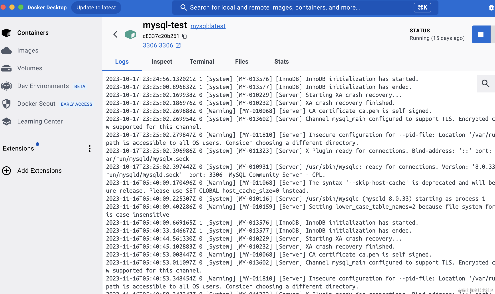

跑起来后，我们用 GUI 客户端连上，这里我们用的是 mysql workbench，这是 mysql 官方提供的免费客户端：

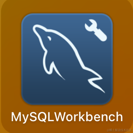

连接上之后，点击创建 database：

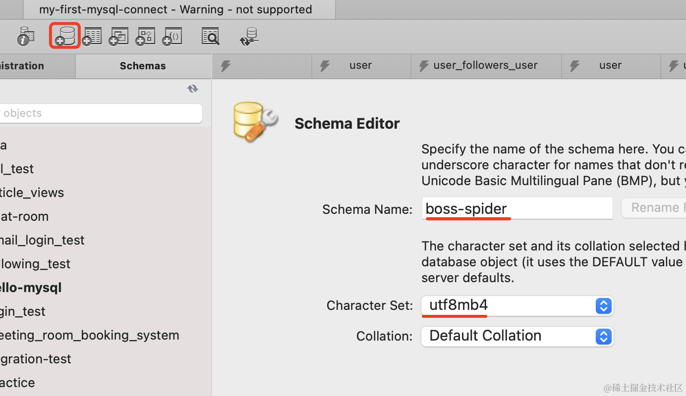

指定名字、字符集为 utf8mb4，然后点击右下角的 apply。

创建成功之后在左侧就可以看到这个 database 了：

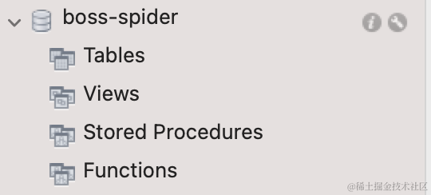

当然，现在还没有表。

我们在 Nest 里用 TypeORM 连接 mysql。

安装用到的包：
```
npm install --save @nestjs/typeorm typeorm mysql2
```
mysql2 是数据库驱动，typeorm 是我们用的 orm 框架，而 @nestjs/tyeporm 是 nest 集成 typeorm 用的。

在 AppModule 里引入 TypeORM，指定数据库连接配置：

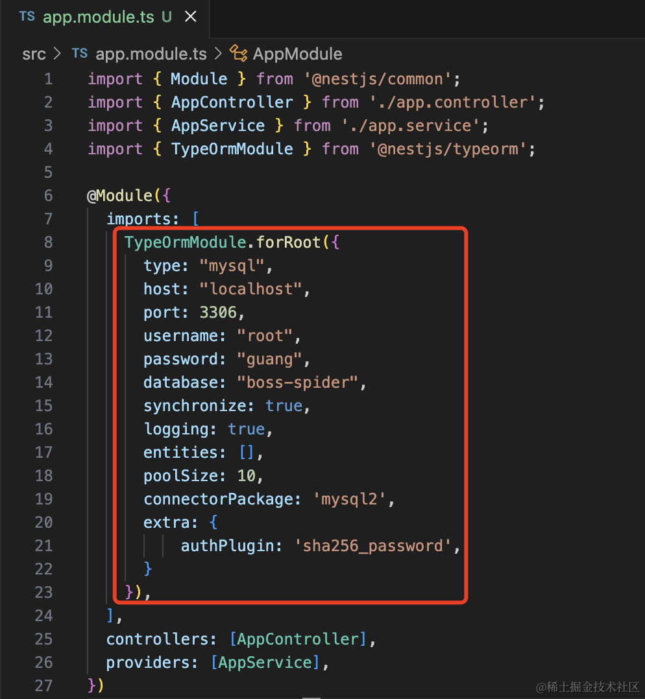

```javascript
TypeOrmModule.forRoot({
  type: "mysql",
  host: "localhost",
  port: 3306,
  username: "root",
  password: "guang",
  database: "boss-spider",
  synchronize: true,
  logging: true,
  entities: [],
  poolSize: 10,
  connectorPackage: 'mysql2',
  extra: {
      authPlugin: 'sha256_password',
  }
}),
```

然后创建个 entity：

src/entities/Job.ts

```javascript
import { Column, Entity, PrimaryGeneratedColumn } from "typeorm";

@Entity()
export class Job {
    
    @PrimaryGeneratedColumn()
    id: number;

    @Column({
        length: 30,
        comment: '职位名称'
    })
    name: string;

    @Column({
        length: 20,
        comment: '区域'
    })
    area: string;

    @Column({
        length: 10,
        comment: '薪资范围'
    })
    salary: string;

    @Column({
        length: 600,
        comment: '详情页链接'
    })    
    link: string;

    @Column({
        length: 30,
        comment: '公司名'
    })   
    company: string;

    @Column({
        type: 'text',
        comment: '职位描述'
    })
    desc: string;
}
```
链接可能很长，所以设置为 600，而职位描述就更长了，直接设置 text 就行，它可以存储大段文本。

在 AppModule 引入：

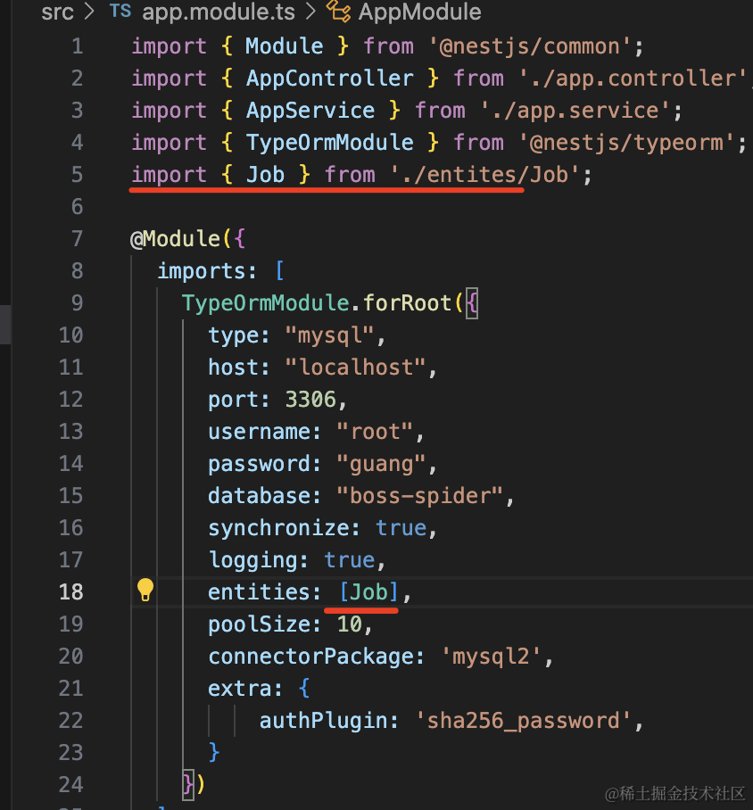

把服务跑起来：

```
npm run start:dev
```
TypeORM会自动建表:

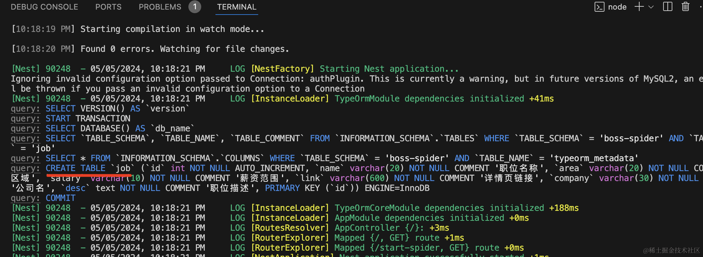

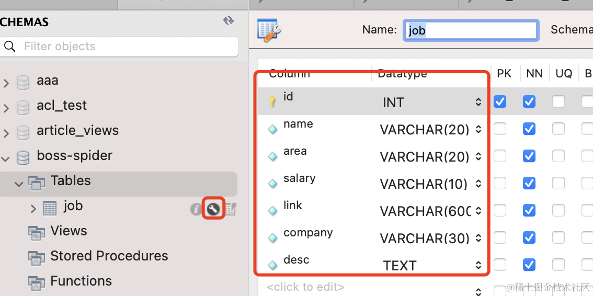

然后我们加个启动爬虫的接口：

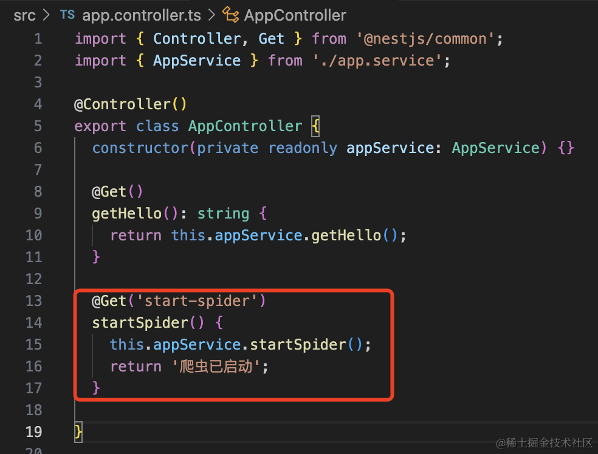

```javascript
@Get('start-spider')
startSpider() {
    this.appService.startSpider();
    return '爬虫已启动';
}
```
安装 puppeteer：

```
npm install --save puppeteer
```
在 AppService 里实现 startSpider：

```javascript
import { Injectable } from '@nestjs/common';
import puppeteer from 'puppeteer';

@Injectable()
export class AppService {
  getHello(): string {
    return 'Hello World!';
  }

  async startSpider() {
    const browser = await puppeteer.launch({
        headless: false
        ,
        defaultViewport: {
            width: 0,
            height: 0
        }
    });

    const page = await browser.newPage();

    await page.goto('https://www.zhipin.com/web/geek/job?query=前端&city=100010000');

    await page.waitForSelector('.job-list-box');

    const totalPage = await page.$eval('.options-pages a:nth-last-child(2)', e => {
        return parseInt(e.textContent)
    });

    const allJobs = [];
    for(let i = 1; i <= totalPage; i ++) {
        await page.goto('https://www.zhipin.com/web/geek/job?query=前端&city=100010000&page=' + i);

        await page.waitForSelector('.job-list-box');

        const jobs = await page.$eval('.job-list-box', el => {
            return [...el.querySelectorAll('.job-card-wrapper')].map(item => {
                return {
                    job: {
                        name: item.querySelector('.job-name').textContent,
                        area: item.querySelector('.job-area').textContent,
                        salary: item.querySelector('.salary').textContent
                    },
                    link: item.querySelector('a').href,
                    company: {
                        name: item.querySelector('.company-name').textContent
                    }
                }
            })
        });
        allJobs.push(...jobs);
    }

    // console.log(allJobs);

    for(let i = 0; i< allJobs.length; i ++) {
        await page.goto(allJobs[i].link);

        try{
            await page.waitForSelector('.job-sec-text');

            const jd= await page.$eval('.job-sec-text', el => {
                return el.textContent
            });
            allJobs[i].desc = jd;

            console.log(allJobs[i]);
        } catch(e) {}
    }
  }
  
}
```

这里原封不动的把之前的爬虫逻辑复制了过来，只是把 headless 设置为了 true，因为我们不需要界面。

浏览器访问下：


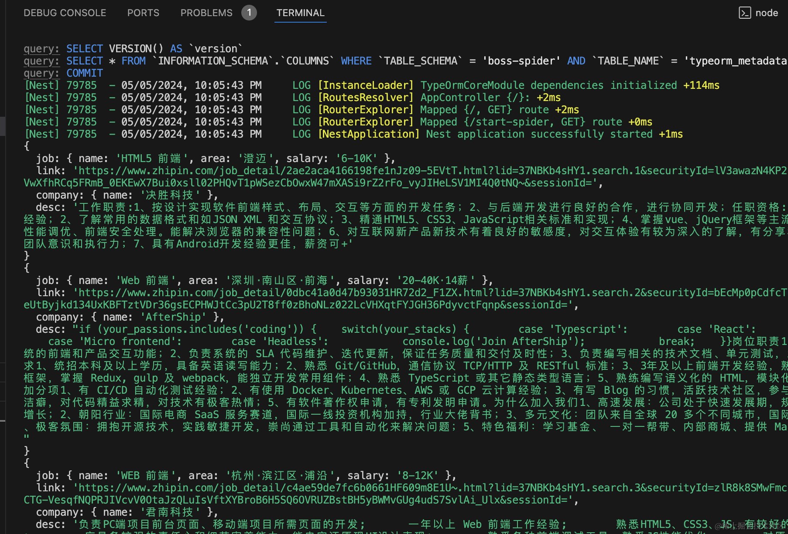

爬虫跑的没啥问题。

不过这个过程中 boss 可能会检测到你访问频率过高，会让你做下是不是真人的验证：

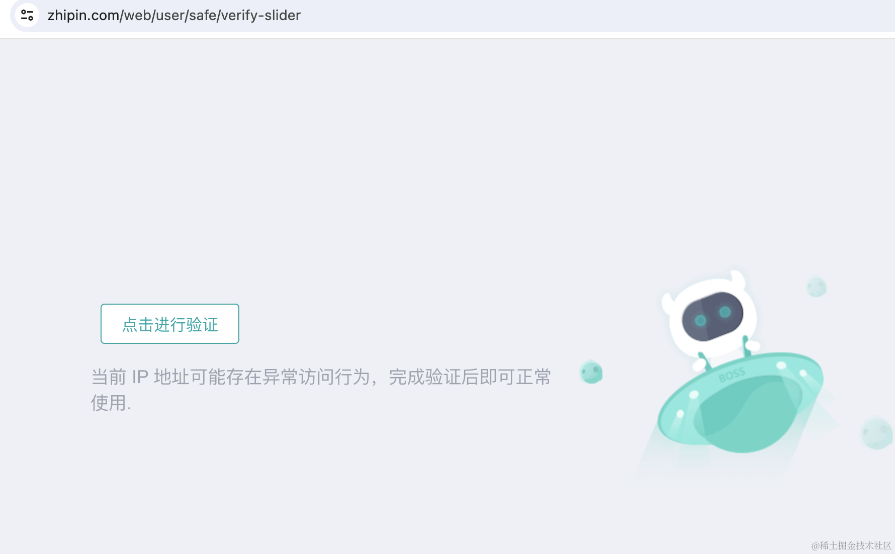

这个就是验证码点点就好了。

然后我们把数据存到数据库里：

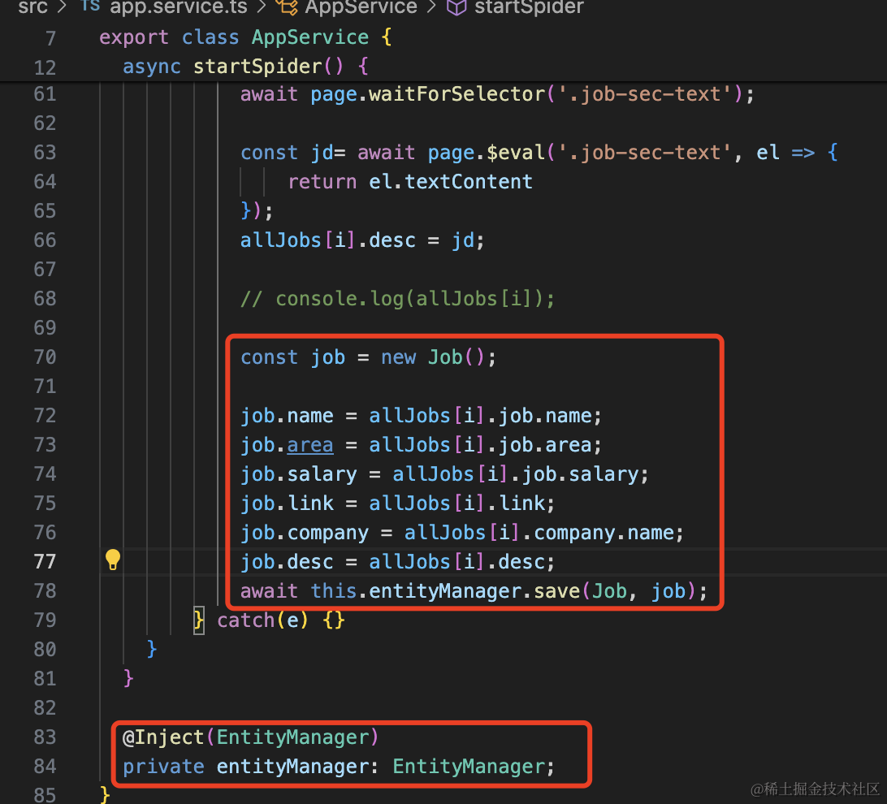

用 EntityManager 来 save 就好了：

```javascript
@Inject(EntityManager)
private entityManager: EntityManager;
```
```javascript
const job = new Job();

job.name = allJobs[i].job.name;
job.area = allJobs[i].job.area;
job.salary = allJobs[i].job.salary;
job.link = allJobs[i].link;
job.company = allJobs[i].company.name;
job.desc = allJobs[i].desc;

await this.entityManager.save(Job, job);
```
再跑下：

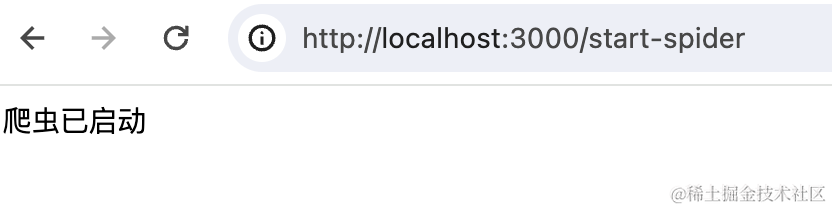


去数据库里看下：

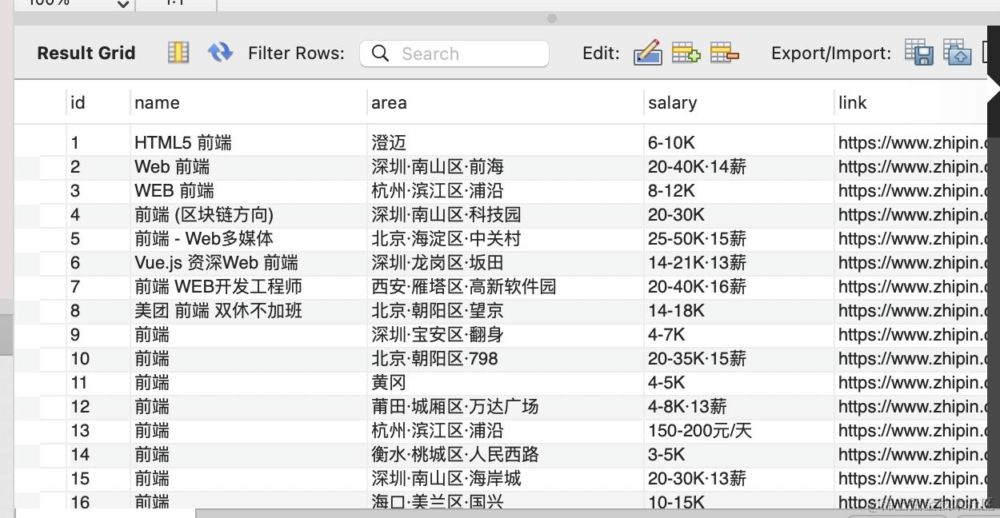

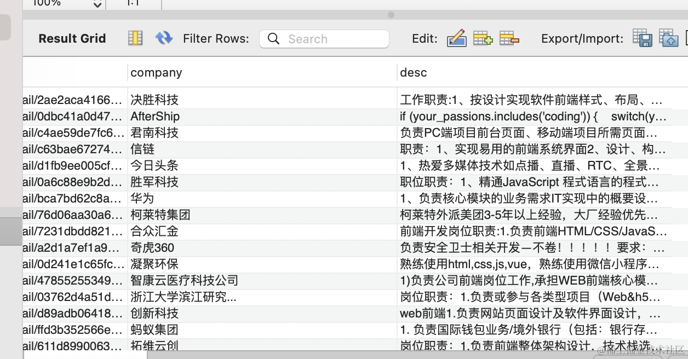

这样，你就可以对这些职位描述做一些搜索，分析之类的了。
 
比如搜索职位描述中包含 react 的岗位：

```sql
SELECT * FROM `boss-spider`.job where `desc` like "%React%";
```
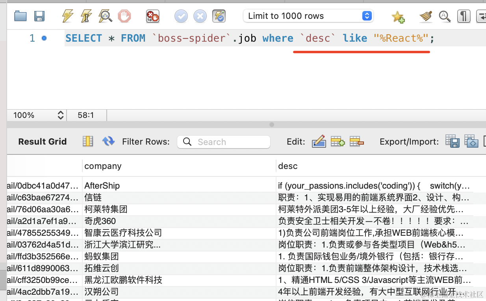

这样，爬虫就做完了。

如果想在前端实时看到爬取到的数据，可以通过 SSE 来实时返回：

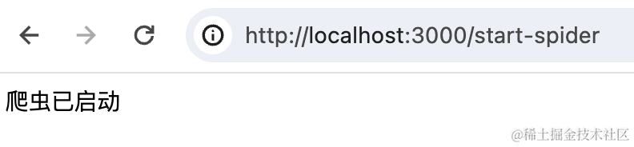

这样用：

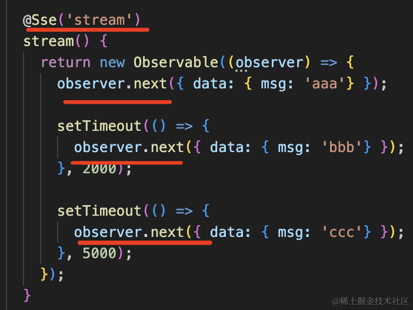

这里我们就不改了。

案例代码上传了 nest 小册仓库：https://github.com/QuarkGluonPlasma/nestjs-course-code/tree/main/boss-jd-spider

## 总结

我们通过 puppeteer 实现了对 BOSS 直聘网站的前端职位的爬取，并用 Nest + TypeORM 把数据保存到了数据库里。

这样就可以在本地对这些职位数据做一些处理或分析了。
