假设有一天，你需要整理一份中国所有大学信息的 ppt。

大学的信息是能搜到的，但是一份份整理到 ppt 里也太麻烦了。

能不能用代码自动生成 PPT呢？

自然是可以的。

这里大学的信息可以从[中国大学 MOOC](https://www.icourse163.org/university/view/all.htm#/)这里抓取：

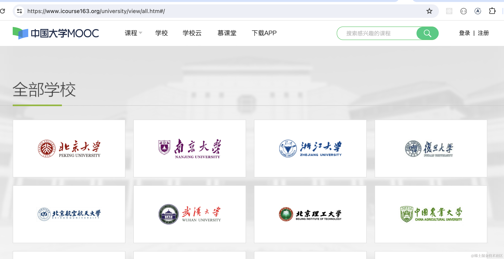

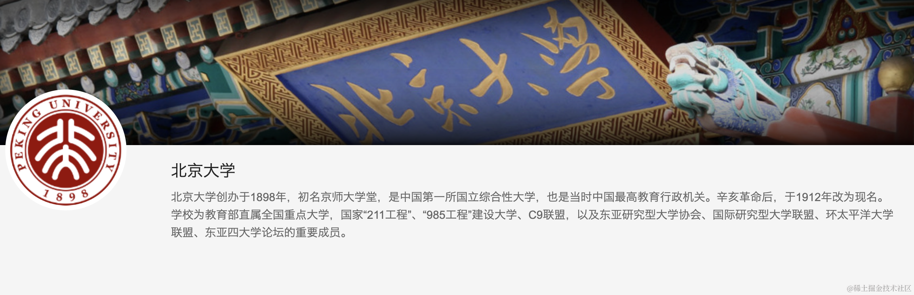

我们用 puppeteer 来爬取大学的校徽、名字、介绍，然后用这些信息来生成 pdf 等。

创建个 Nest 项目：

```
nest new ppt-generate
```
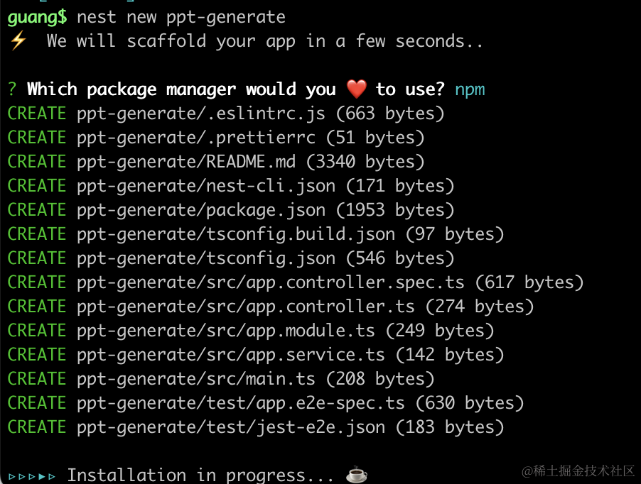
安装 puppeteer：

```
npm install --save puppeteer
```

然后在 AppService 里引入下：

```javascript
import { Injectable } from '@nestjs/common';
import puppeteer from 'puppeteer';

let cache = null;

@Injectable()
export class AppService {
  getHello(): string {
    return 'Hello World!';
  }

  async getUniversityData() {
    if(cache) {
      return cache;
    }
  
    const browser = await puppeteer.launch({
        headless: true,
        defaultViewport: {
            width: 0,
            height: 0
        }
    });
    
    const page = await browser.newPage();
    
    await page.goto('https://www.icourse163.org/university/view/all.htm');
    
    await page.waitForSelector('.u-usitys');
    
    const universityList = await page.$eval('.u-usitys', el => {
        return [...el.querySelectorAll('.u-usity')].map(item => {
          return {
            name: item.querySelector('img').alt,
            img: item.querySelector('img').src,
            link: item.getAttribute('href')
          }
      })
    });

    await browser.close();

    cache = universityList;

    return universityList;
  }
}
```
这里用 puppeteer 抓取中国大学 mooc 的学校列表的信息。

headless 指定 true，不用看界面了。

然后简单在内存做了下 cache，没用 redis。
 
在 AppController 里加个路由：

```javascript
@Get('list')
async universityList() {
    return this.appService.getUniversityData();
}
```
把服务跑起来：

```
npm run start:dev
```
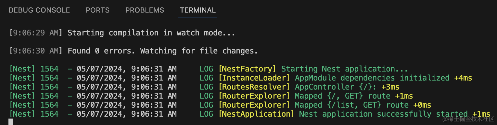

试一下：

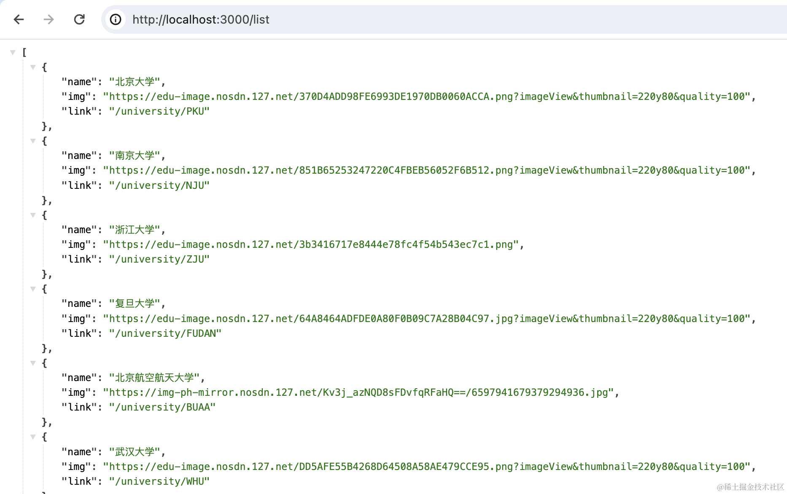

然后继续点进详情页，拿到学校的描述：


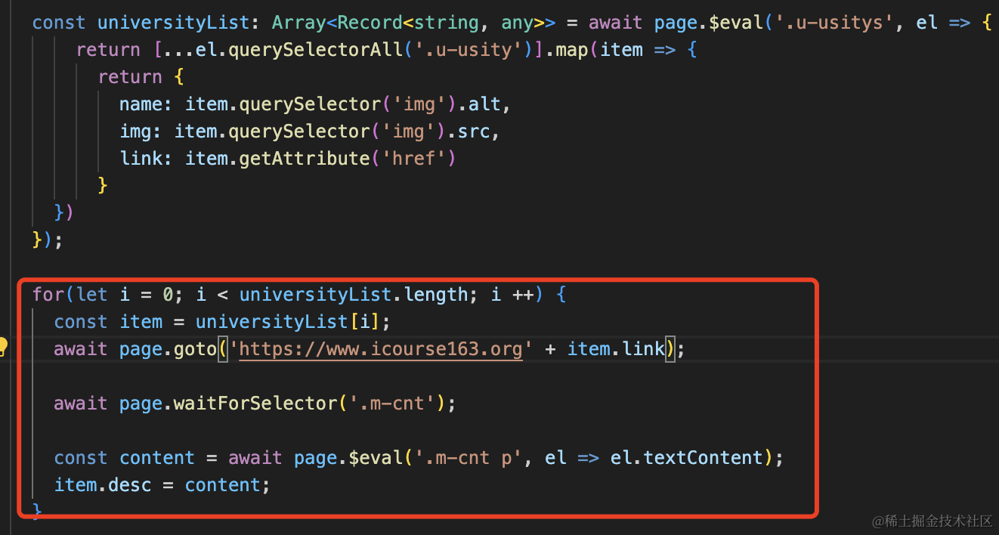

抓取每个学校数据的时间太长，我们用 SSE（server sent event） 的方式返回数据。

Sever Sent Event 就是服务端返回的 Content-Type 是 text/event-stream，这是一个流，可以多次返回内容，通过这种方式来随时推送数据。

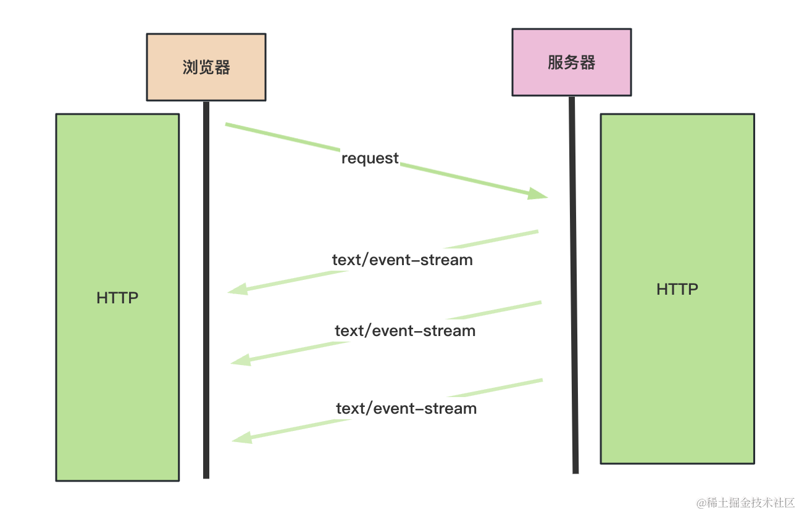

SSE 类似这样用：


改下 AppController

```javascript
@Sse('list')
async universityList() {
    return this.appService.getUniversityData();
}
```

还有 AppService

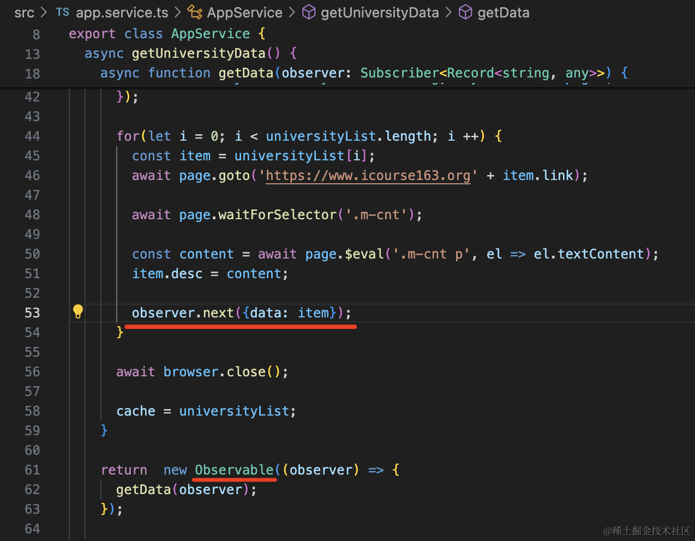

```javascript
import { Injectable } from '@nestjs/common';
import puppeteer from 'puppeteer';
import { Observable, Subscriber } from 'rxjs';

let cache = null;

@Injectable()
export class AppService {
  getHello(): string {
    return 'Hello World!';
  }

  async getUniversityData() {
    if(cache) {
      return cache;
    }

    async function getData(observer: Subscriber<Record<string, any>>) {
      
      const browser = await puppeteer.launch({
          headless: true,
          defaultViewport: {
              width: 0,
              height: 0
          }
      });
      
      const page = await browser.newPage();
      
      await page.goto('https://www.icourse163.org/university/view/all.htm');
      
      await page.waitForSelector('.u-usitys');

      const universityList: Array<Record<string, any>> = await page.$eval('.u-usitys', el => {
          return [...el.querySelectorAll('.u-usity')].map(item => {
            return {
              name: item.querySelector('img').alt,
              img: item.querySelector('img').src,
              link: item.getAttribute('href')
            }
        })
      });

      for(let i = 0; i < universityList.length; i ++) {
        const item = universityList[i];
        await page.goto('https://www.icourse163.org' + item.link);

        await page.waitForSelector('.m-cnt');

        const content = await page.$eval('.m-cnt p', el => el.textContent);
        item.desc = content;

        observer.next({data: item});

      }

      await browser.close();

      cache = universityList;
    }

    return  new Observable((observer) => {
      getData(observer);
    });

  }
}
```

主要是返回一个 rxjs 的 Observable 然后不断用 observer.next 返回数据。

试一下：


**SSE 和爬虫简直是绝配！**

接下来生成 ppt，用 [pptxgenjs](https://www.npmjs.com/package/pptxgenjs) 这个包。

用法很简单：

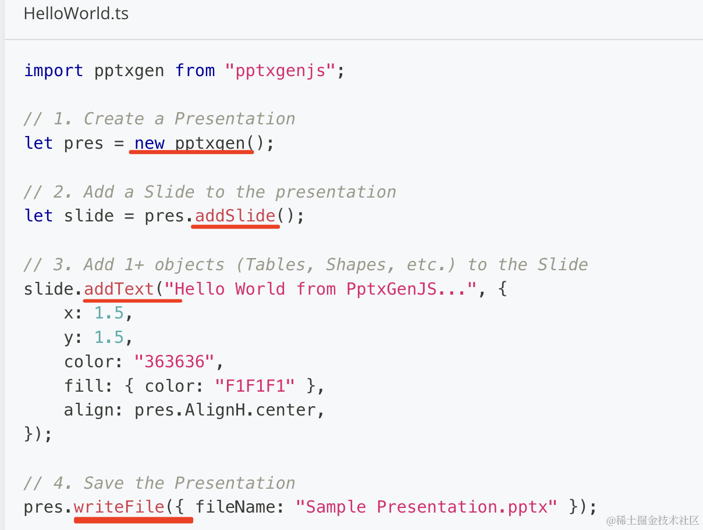

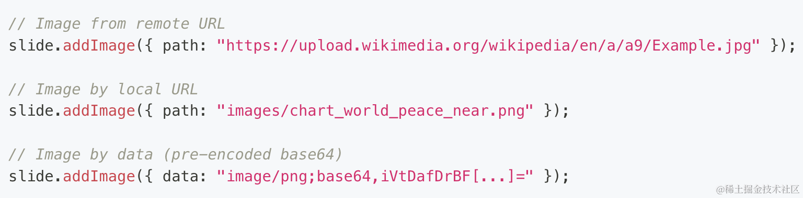

new 一个实例，添加一个 Slide，然后添加 text image 等内容，最后写入文件。

我们先测试下：

```
npm install --save pptxgenjs
```
新建 test.js

```javascript
const pptxgen = require('pptxgenjs');

const ppt = new pptxgen();

const slide  = ppt.addSlide();

slide.addText('北京大学', { x: '10%', y: '10%', color: '#ff0000', fontSize: 30,  align: ppt.AlignH.center,});

slide.addImage({ 
    path: "https://nos.netease.com/edu-image/F78C41FA9703708FB193137A688F7195.png?imageView&thumbnail=150y150&quality=100", 
    x: '42%',
    y: '25%',
});

slide.addText(`北京大学创办于1898年，初名京师大学堂，是中国第一所国立综合性大学，也是当时中国最高教育行政机关。辛亥革命后，于1912年改为现名。 学校为教育部直属全国重点大学，国家“211工程”、“985工程”建设大学、C9联盟，以及东亚研究型大学协会、国际研究型大学联盟、环太平洋大学联盟、东亚四大学论坛的重要成员。`, 
    { x: '10%', y: '60%', color: '#000000', fontSize: 14,}
);

ppt.writeFile({
    fileName: '中国所有大学.pptx'
})
```
分别指定文字和图片的 x、y，对齐方式 align。

跑一下：

```
node ./test.js
```

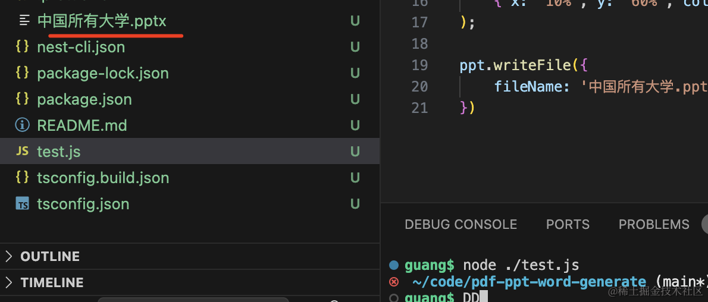

打开看一下：


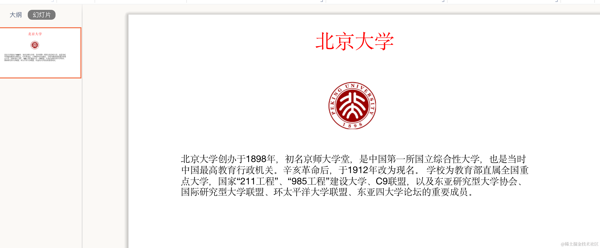

没问题。

然后我们在 list 接口里加一下这个：

顺便替换下校徽图片，之前取的这个：

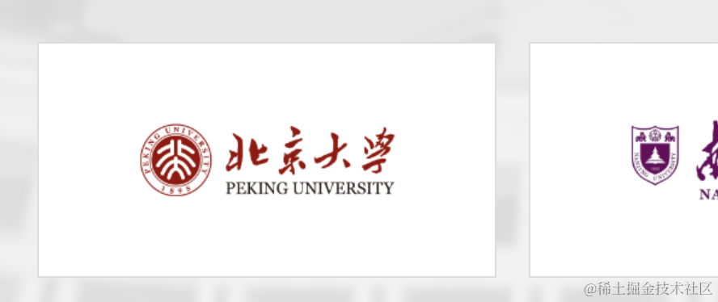

换成这里的：

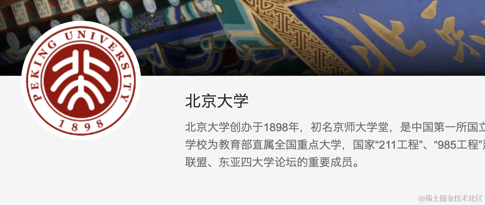

```javascript
import { Injectable } from '@nestjs/common';
import puppeteer from 'puppeteer';
import { Observable, Subscriber } from 'rxjs';
const pptxgen = require('pptxgenjs');

let cache = null;

@Injectable()
export class AppService {
  getHello(): string {
    return 'Hello World!';
  }

  async getUniversityData() {
    if(cache) {
      return cache;
    }

    async function getData(observer: Subscriber<Record<string, any>>) {
      
      const browser = await puppeteer.launch({
          headless: true,
          defaultViewport: {
              width: 0,
              height: 0
          }
      });
      
      const page = await browser.newPage();
      
      await page.goto('https://www.icourse163.org/university/view/all.htm');
      
      await page.waitForSelector('.u-usitys');

      const universityList: Array<Record<string, any>> = await page.$eval('.u-usitys', el => {
          return [...el.querySelectorAll('.u-usity')].map(item => {
            return {
              name: item.querySelector('img').alt,
              link: item.getAttribute('href')
            }
        })
      });

      const ppt = new pptxgen();

      for(let i = 0; i < universityList.length; i ++) {
        const item = universityList[i];
        await page.goto('https://www.icourse163.org' + item.link);

        await page.waitForSelector('.m-cnt');

        const content = await page.$eval('.m-cnt p', el => el.textContent);
        item.desc = content;

        item.img = await page.$eval('.g-doc img', el => el.getAttribute('src'));

        observer.next({data: item});

        const slide = ppt.addSlide();

        slide.addText(item.name, { x: '10%', y: '10%', color: '#ff0000', fontSize: 30,  align: ppt.AlignH.center,});

        slide.addImage({ 
            path: item.img, 
            x: '42%',
            y: '25%',
        });

        slide.addText(item.desc, 
            { x: '10%', y: '60%', color: '#000000', fontSize: 14,}
        );
      }

      await browser.close();

      await ppt.writeFile({
        fileName: '中国所有大学.pptx'
      })

      cache = universityList;
    }

    return  new Observable((observer) => {
      getData(observer);
    });
  }
}
```
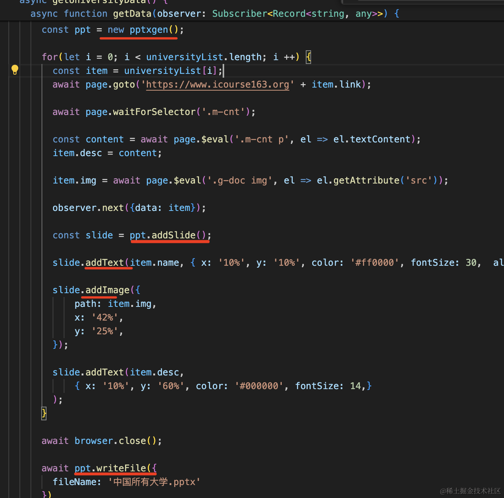

跑一下：

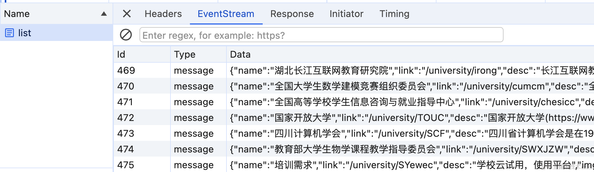

跑完之后可以看到，动态生成了 400 多张 ppt：


案例代码上传了 github：https://github.com/QuarkGluonPlasma/nestjs-course-code/tree/main/ppt-generate

## 总结

我们使用 puppeteer 抓取了大学的信息，用 SSE 的方式创建了接口，不断返回爬取到的数据。

然后用 pptxgenjs 来生成了 ppt。

这样，400 多张 PPT 瞬间就生成了，不用自己手动搞。
