这节，我们来写管理端的这两个页面：

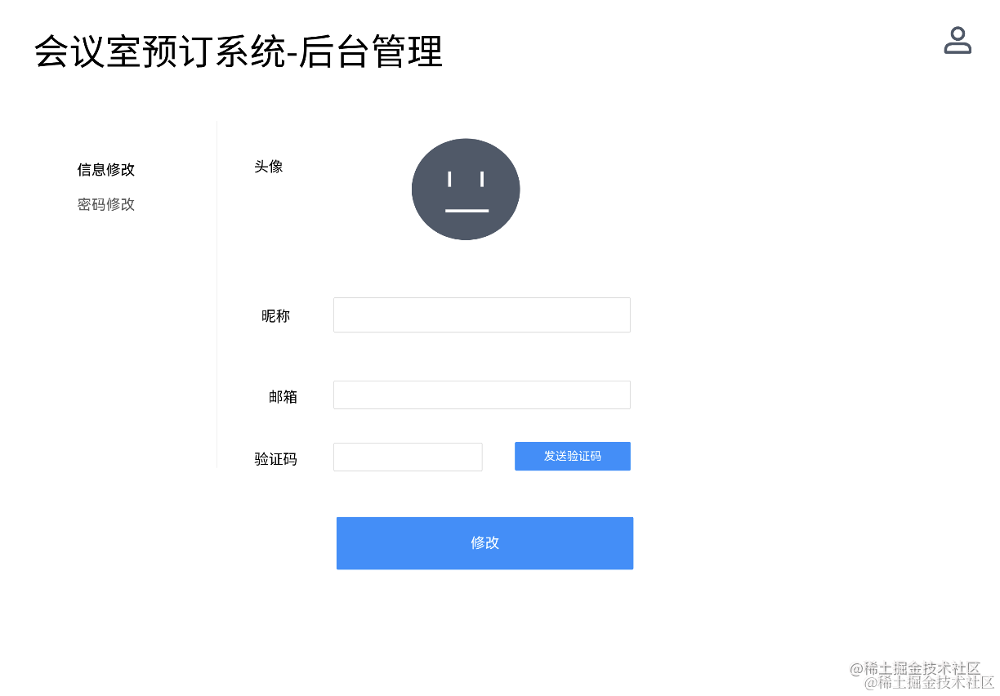

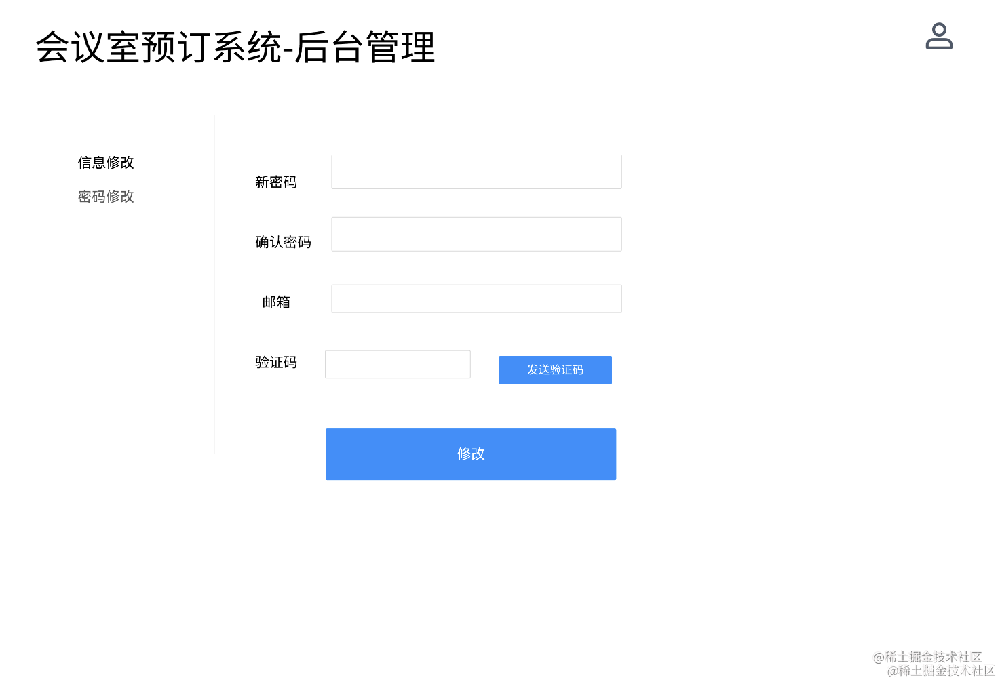

很明显，它们是和这几个管理页面平级的，点击用户图标的时候打开：

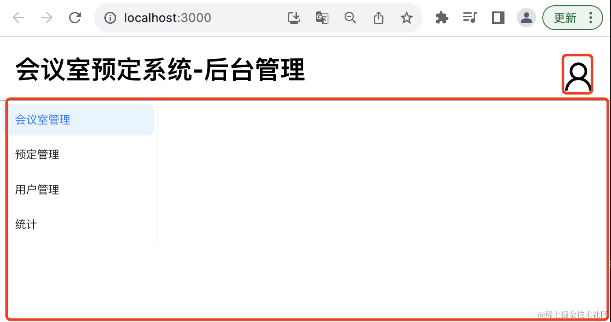

所以，我们在它平级添加个路由：

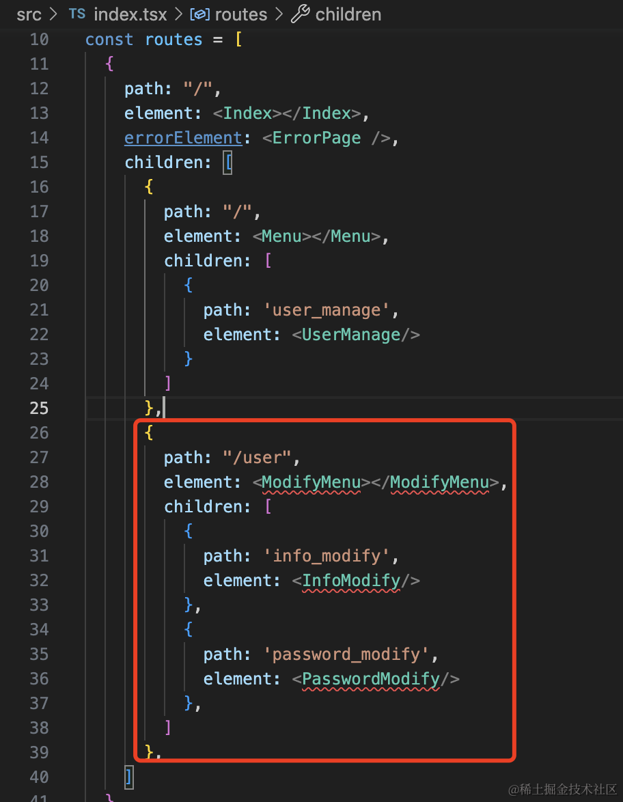

```javascript
{
    path: "/user",
    element: <ModifyMenu></ModifyMenu>,
    children: [
      {
        path: 'info_modify',
        element: <InfoModify/>
      },
      {
        path: 'password_modify',
        element: <PasswordModify/>
      },
    ]
},
```

然后创建这几个对应的组件：

src/pages/ModifyMenu/ModifyMenu.stx

```javascript
import { Outlet } from "react-router-dom";
import { Menu as AntdMenu, MenuProps } from 'antd';
import './menu.css';

const items: MenuProps['items'] = [
    {
        key: '1',
        label: "信息修改"
    },
    {
        key: '2',
        label: "密码修改"
    }
];

export function ModifyMenu() {
    return <div id="menu-container">
        <div className="menu-area">
            <AntdMenu
                defaultSelectedKeys={['1']}
                items={items}
            />
        </div>
        <div className="content-area">
            <Outlet></Outlet>
        </div>
    </div>
}
```
用到的 menu.css：

```css
#menu-container {
    display: flex;
    flex-direction: row;
}
#menu-container .menu-area {
    width: 200px;
}
```
然后是 

src/pages/InfoModify/InfoModify.tsx

```javascript
export function InfoModify() {
    return <div>InfoModify</div>
}
```
src/pages/PasswordModify/PasswordModify.tsx

```javascript
export function PasswordModify() {
    return <div>PasswordModify</div>
}
```

在 index.tsx 引入，然后跑一下：

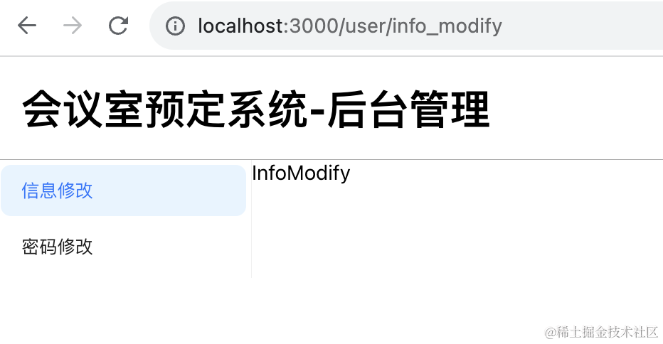

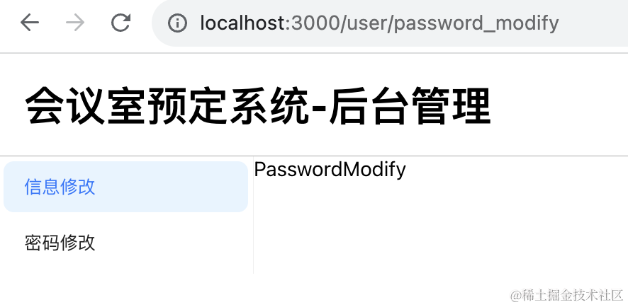

没啥问题。

但是现在点击菜单是没反应的，我们给它加上 click 事件。

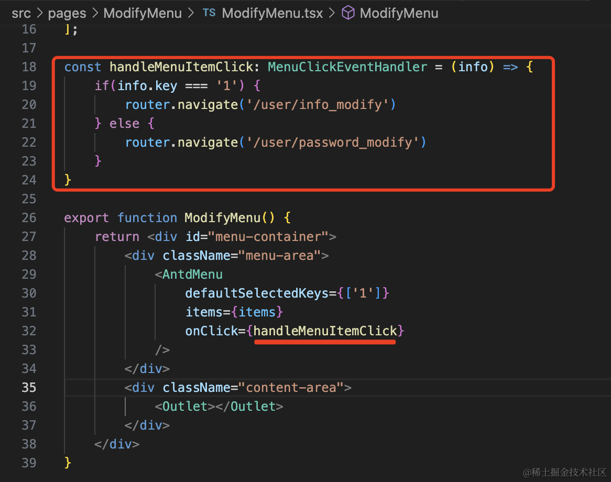

```javascript
const handleMenuItemClick: MenuClickEventHandler = (info) => {
    if(info.key === '1') {
        router.navigate('/user/info_modify')
    } else {
        router.navigate('/user/password_modify')
    }
}
```

这里用到的 router 要在 index.tsx 里导出：

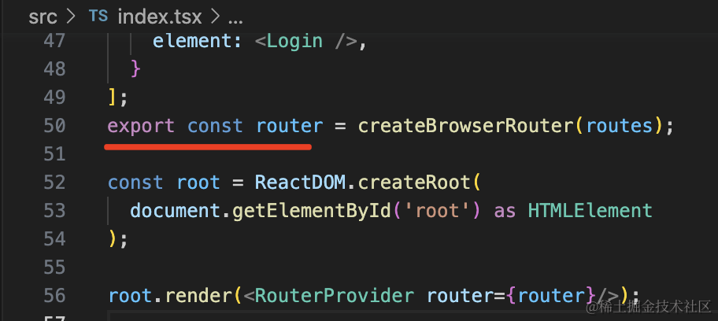

测试下：

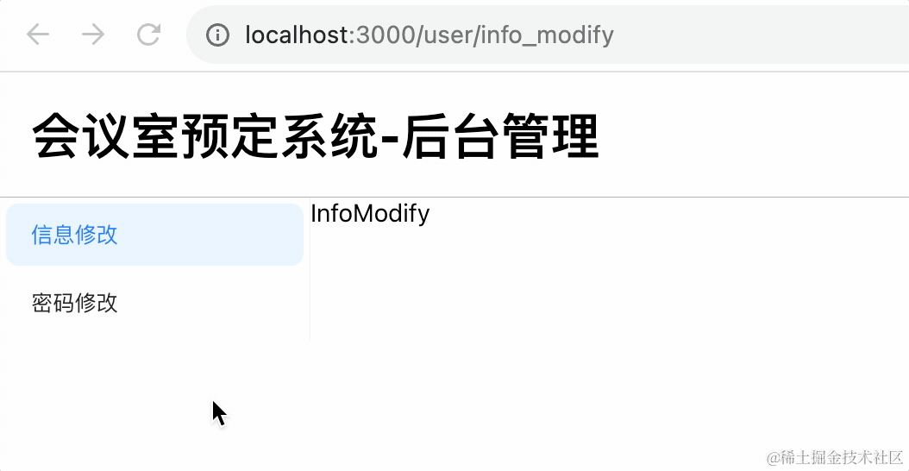

点击菜单可以切换路由了。

但现在有个问题，页面一刷新，选中的菜单项就变了：

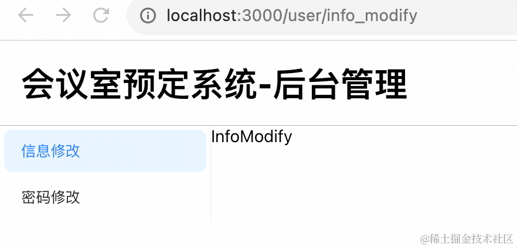

我们需要根据当前路由来决定选中哪个：

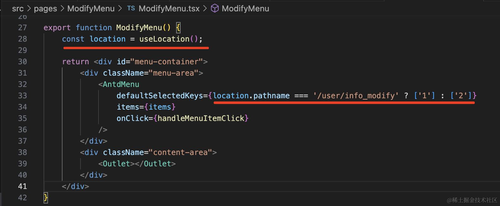

这里用到了 react-router 的 useLocation 的 hook 来拿到当前地址：

```javascript
location.pathname === '/user/info_modify' ? ['1'] : ['2']
```
这样，刷新之后选中的菜单项也是对的：

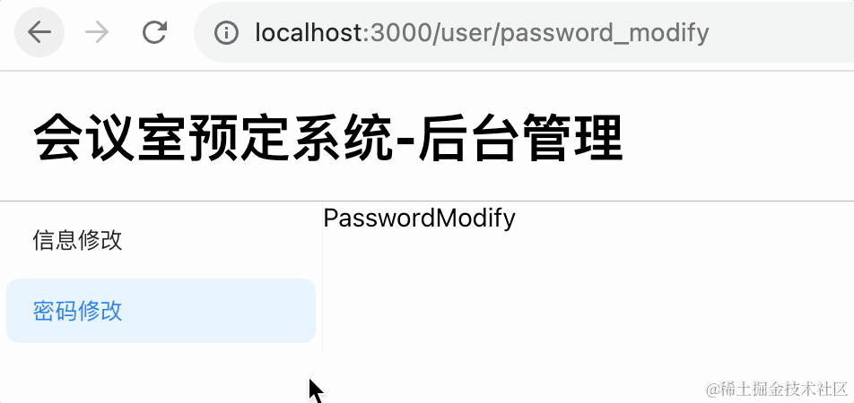

改下 Index 组件，添加两个链接：

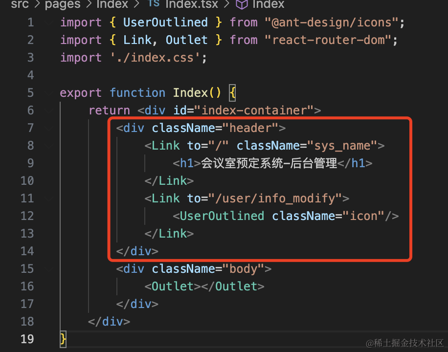

```html
<div className="header">
    <Link to="/" className="sys_name">
        <h1>会议室预定系统-后台管理</h1>
    </Link>
    <Link to="/user/info_modify">
        <UserOutlined className="icon"/>
    </Link>
</div>
```

并且添加它的样式：

```css
#index-container .sys_name {
    text-decoration: none;
    color: #000;
}
```
这样就可以方便跳转对应的路由了：

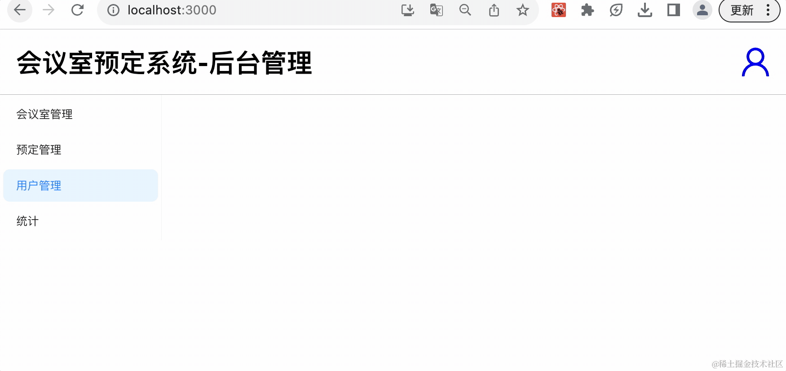

然后，我们来实现信息修改页面：


之前用户端修改信息页面也是类似的，我们直接拿过来就行：

```javascript
import { Button, Form, Input, message } from 'antd';
import { useForm } from 'antd/es/form/Form';
import { useCallback, useEffect, useState } from 'react';
import './info_modify.css';
import { useNavigate } from 'react-router-dom';
import { HeadPicUpload } from './HeadPicUpload';

export interface UserInfo {
    username: string;
    headPic: string;
    nickName: string;
    email: string;
    captcha: string;
}

const layout1 = {
    labelCol: { span: 6 },
    wrapperCol: { span: 18 }
}

export function InfoModify() {
    const [form] = useForm();
    const navigate = useNavigate();

    const onFinish = useCallback(async (values: UserInfo) => {

    }, []);

    const sendCaptcha = useCallback(async function () {
        
    }, []);

    useEffect(() => {
        async function query() {
            
        }
        query();
    }, []);

    return <div id="updateInfo-container">
        <Form
            form={form}
            {...layout1}
            onFinish={onFinish}
            colon={false}
            autoComplete="off"
        >
            <Form.Item
                label="头像"
                name="headPic"
                rules={[
                    { required: true, message: '请输入头像!' },
                ]}
                shouldUpdate
            >
                <HeadPicUpload></HeadPicUpload>
            </Form.Item>

            <Form.Item
                label="昵称"
                name="nickName"
                rules={[
                    { required: true, message: '请输入昵称!' },
                ]}
            >
                <Input />
            </Form.Item>

            <Form.Item
                label="邮箱"
                name="email"
                rules={[
                    { required: true, message: '请输入邮箱!' },
                    { type: "email", message: '请输入合法邮箱地址!'}
                ]}
            >
                <Input disabled/>
            </Form.Item>

            <div className='captcha-wrapper'>
                <Form.Item
                    label="验证码"
                    name="captcha"
                    rules={[{ required: true, message: '请输入验证码!' }]}
                >
                    <Input />
                </Form.Item>
                <Button type="primary" onClick={sendCaptcha}>发送验证码</Button>
            </div>

            <Form.Item
                {...layout1}
                label=" "
            >
                <Button className='btn' type="primary" htmlType="submit">
                    修改
                </Button>
            </Form.Item>
        </Form>
    </div>   
}
```
css 部分如下：

```css
#updateInfo-container {
    width: 400px;
    margin: 50px auto 0 auto;
    text-align: center;
}
#updateInfo-container .btn {
    width: 100%;
}
#updateInfo-container .captcha-wrapper {
    display: flex;
    justify-content: flex-end;
}
```
用到的 HeadPicUpload 组件如下：

```javascript
import { InboxOutlined } from "@ant-design/icons";
import { message } from "antd";
import Dragger, { DraggerProps } from "antd/es/upload/Dragger";

interface HeadPicUploadProps {
    value?: string;
    onChange?: Function
}

let onChange: Function;

const props: DraggerProps = {
    name: 'file',
    action: 'http://localhost:3005/user/upload',
    onChange(info) {
        const { status } = info.file;
        if (status === 'done') {
            onChange(info.file.response.data);
            message.success(`${info.file.name} 文件上传成功`);
        } else if (status === 'error') {
            message.error(`${info.file.name} 文件上传失败`);
        }
    }
};

const dragger = <Dragger {...props}>
    <p className="ant-upload-drag-icon">
        <InboxOutlined />
    </p>
    <p className="ant-upload-text">点击或拖拽文件到这个区域来上传</p>
</Dragger>

export function HeadPicUpload(props: HeadPicUploadProps) {

    onChange = props.onChange!

    return props?.value ? <div>
        
        {dragger}
    </div>: <div>
        {dragger}
    </div>
}
```
这些都是我们前面写过一遍的。

渲染出来是这样的：
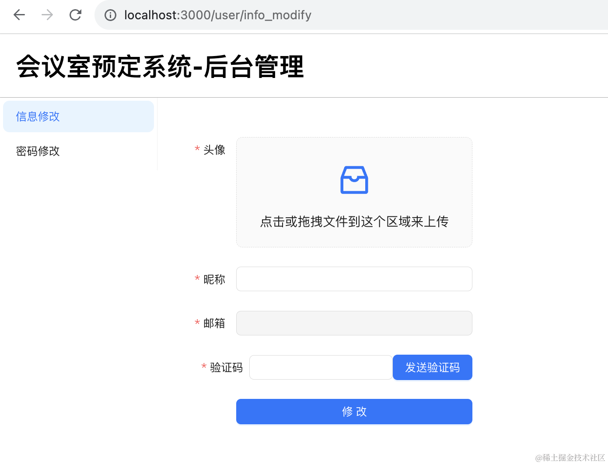

上传功能也是可用的：


然后我们还要加上回显接口、发送验证码接口、更新接口。

在 interfaces.tsx 加上这三个接口：

```javascript
export async function getUserInfo() {
    return await axiosInstance.get('/user/info');
}

export async function updateInfo(data: UserInfo) {
    return await axiosInstance.post('/user/admin/update', data);
}

export async function updateUserInfoCaptcha() {
    return await axiosInstance.get('/user/update/captcha');
}
```
然后先调用下回显接口：

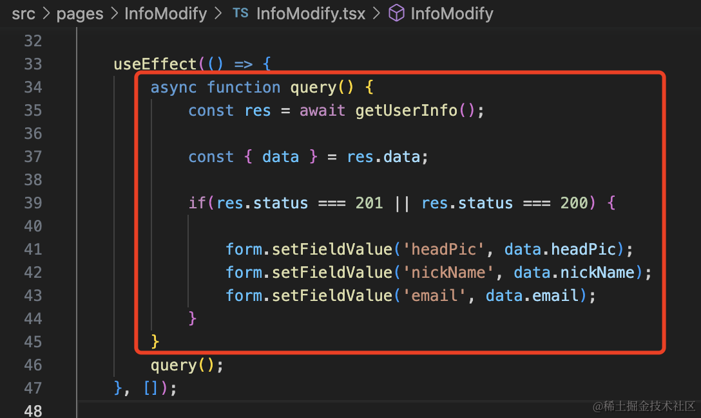

```javascript
async function query() {
    const res = await getUserInfo();

    const { data } = res.data;

    if(res.status === 201 || res.status === 200) {

        form.setFieldValue('headPic', data.headPic);
        form.setFieldValue('nickName', data.nickName);
        form.setFieldValue('email', data.email);
    }
}
```

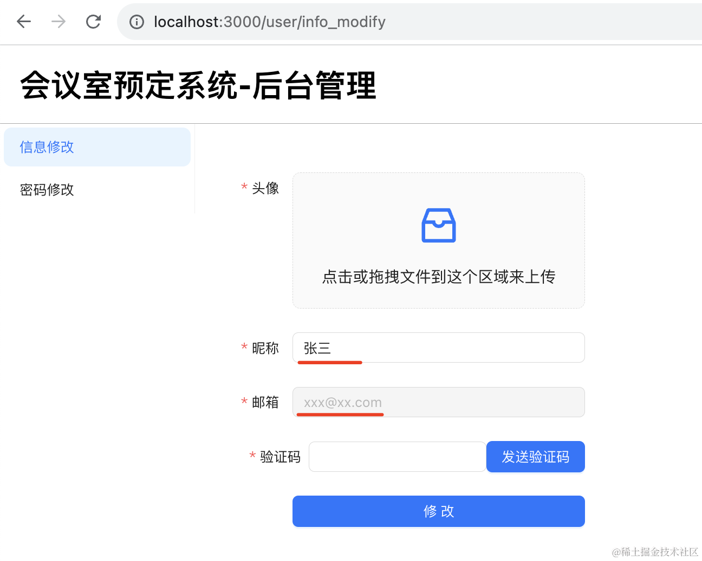

可以看到，正确回显了数据。

然后是发送验证码接口：

```javascript
const sendCaptcha = useCallback(async function () {
    const res = await updateUserInfoCaptcha();
    if(res.status === 201 || res.status === 200) {
        message.success(res.data.data);
    } else {
        message.error('系统繁忙，请稍后再试');
    }
}, []);
```
不过现在的邮箱地址不是真实的，我们手动去数据库里改一下：

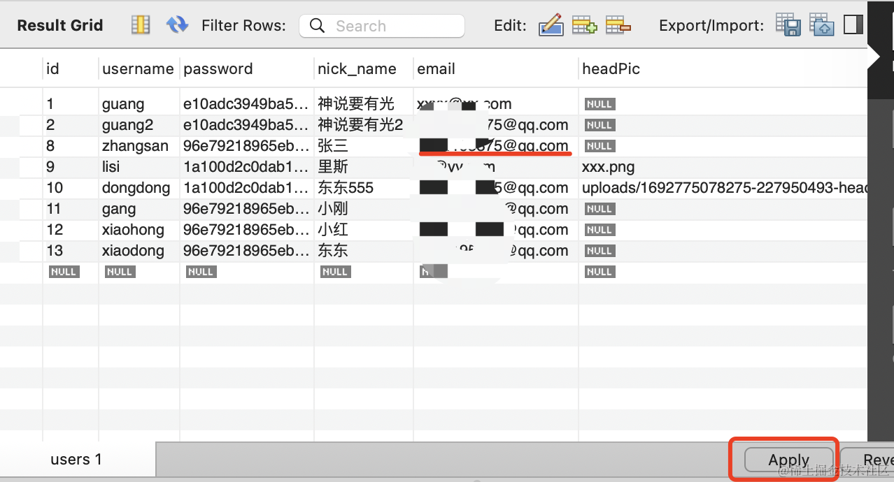

改完点击 apply。

然后需要重新登录一遍，因为现在后端会直接从 jwt 里取邮箱地址，重新登录才会更新。

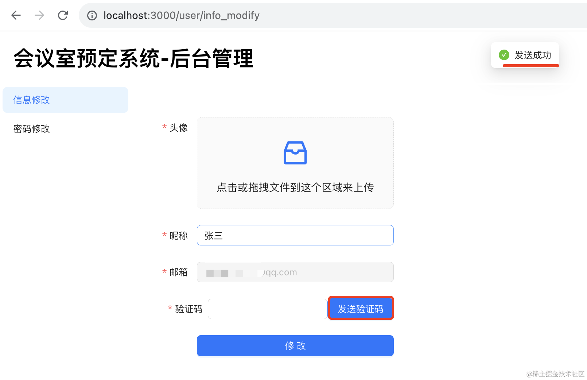

邮箱收到了验证码：

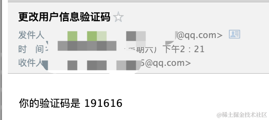

然后加上更新用户信息的接口：
```javascript
const onFinish = useCallback(async (values: UserInfo) => {
    const res = await updateInfo(values);

    if(res.status === 201 || res.status === 200) {
        const { message: msg, data} = res.data;
        if(msg === 'success') {
            message.success('用户信息更新成功');
        } else {
            message.error(data);
        }
    } else {
        message.error('系统繁忙，请稍后再试');
    }
}, []);
```
上传头像，点击发送验证码，填入收到的验证码，点击修改：

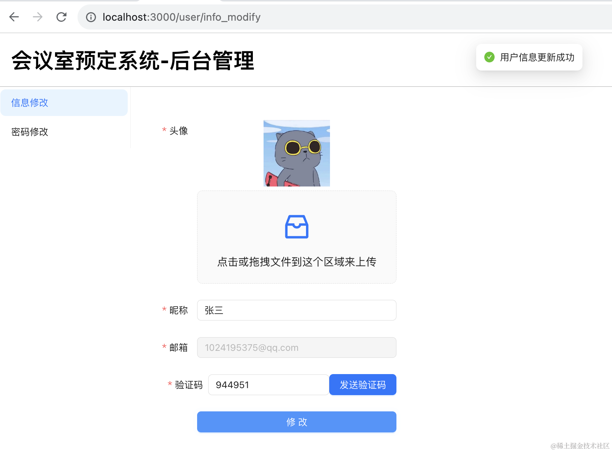

修改成功后，刷新页面，可以看到依然是修改后的数据，就代表修改成功了：

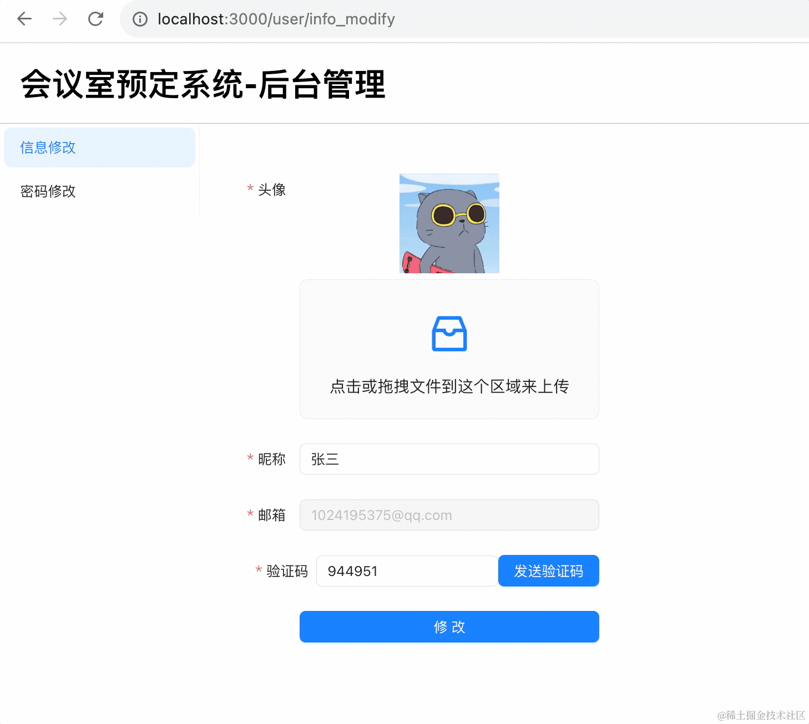

接下来是密码修改页面：


代码如下：

```javascript
import { Button, Form, Input, message } from 'antd';
import { useForm } from 'antd/es/form/Form';
import './password_modify.css';
import { useCallback } from 'react';
import { Link, useNavigate } from 'react-router-dom';

export interface UpdatePassword {
    email: string;
    captcha: string;
    password: string;
    confirmPassword: string;
}

const layout1 = {
    labelCol: { span: 6 },
    wrapperCol: { span: 18 }
}

const layout2 = {
    labelCol: { span: 0 },
    wrapperCol: { span: 24 }
}

export function PasswordModify() {
    const [form] = useForm();
    const navigate = useNavigate();

    const onFinish = useCallback(async (values: UpdatePassword) => {

    }, []);

    const sendCaptcha = useCallback(async function () {

    }, []);

    return <div id="updatePassword-container">
        <Form
            form={form}
            {...layout1}
            onFinish={onFinish}
            colon={false}
            autoComplete="off"
        >
            <Form.Item
                label="密码"
                name="password"
                rules={[{ required: true, message: '请输入密码!' }]}
            >
                <Input.Password />
            </Form.Item>

            <Form.Item
                label="确认密码"
                name="confirmPassword"
                rules={[{ required: true, message: '请输入确认密码!' }]}
            >
                <Input.Password />
            </Form.Item>
            <Form.Item
                label="邮箱"
                name="email"
                rules={[
                    { required: true, message: '请输入邮箱!' },
                    { type: "email", message: '请输入合法邮箱地址!'}
                ]}
            >
                <Input />
            </Form.Item>

            <div className='captcha-wrapper'>
                <Form.Item
                    label="验证码"
                    name="captcha"
                    rules={[{ required: true, message: '请输入验证码!' }]}
                >
                    <Input />
                </Form.Item>
                <Button type="primary" onClick={sendCaptcha}>发送验证码</Button>
            </div>

            <Form.Item
                {...layout1}
                label=" "
            >
                <Button className='btn' type="primary" htmlType="submit">
                    修改密码
                </Button>
            </Form.Item>
        </Form>
    </div>   
}
```

用到的 password_modify.css：

```css
#updatePassword-container {
    width: 400px;
    margin: 40px auto;
    text-align: center;
}
#updatePassword-container .btn {
    width: 100%;
}
#updatePassword-container .captcha-wrapper {
    display: flex;
    justify-content: flex-end;
}
```
渲染出来是这样的：

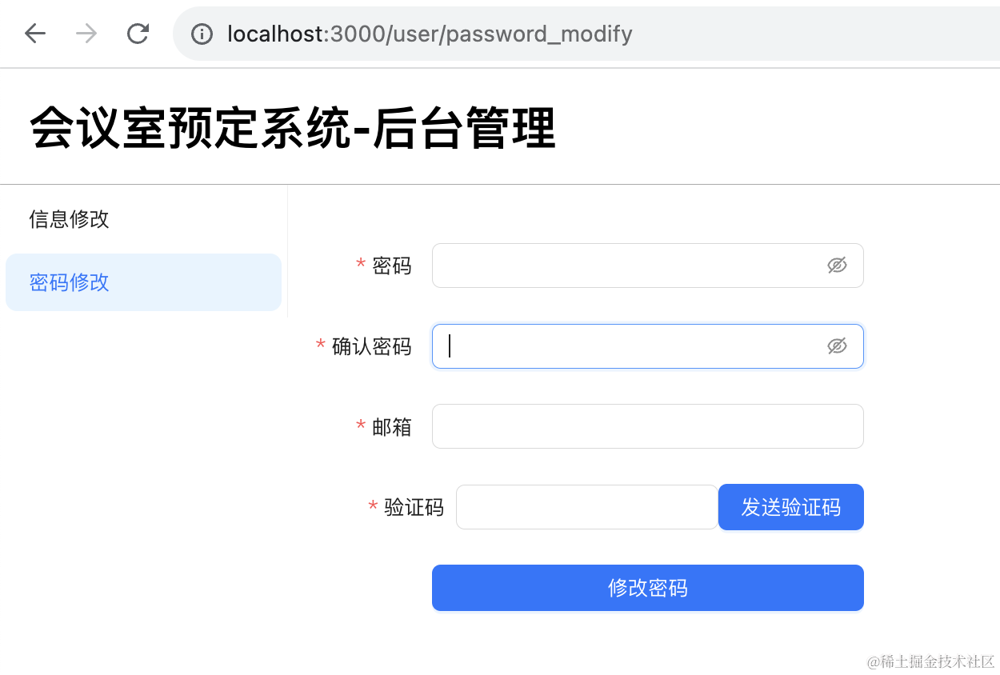

然后在 interfaces.ts 加上用到的发送验证码、修改密码这两个接口：

```javascript
export async function updatePasswordCaptcha(email: string) {
    return await axiosInstance.get('/user/update_password/captcha', {
        params: {
            address: email
        }
    });
}

export async function updatePassword(data: UpdatePassword) {
    return await axiosInstance.post('/user/admin/update_password', data);
}
```
然后先在页面调用下回显接口：

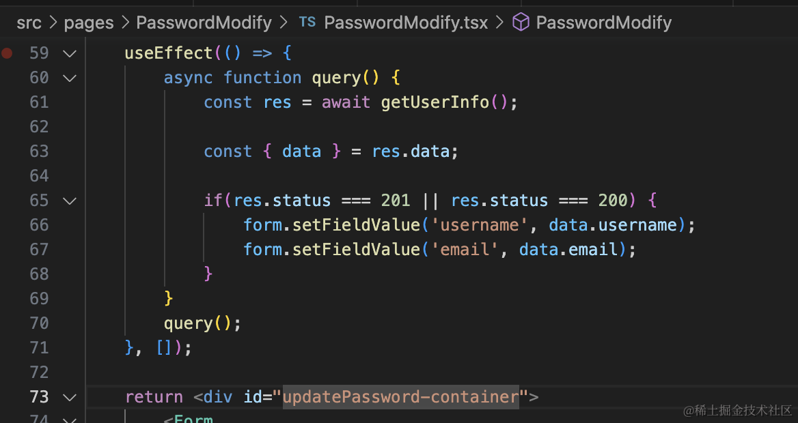
```javascript
useEffect(() => {
    async function query() {
        const res = await getUserInfo();

        const { data } = res.data;

        if(res.status === 201 || res.status === 200) {  
            form.setFieldValue('username', data.username);              
            form.setFieldValue('email', data.email);
        }
    }
    query();
}, []);
```
并把邮箱 Input 设置为 disabled

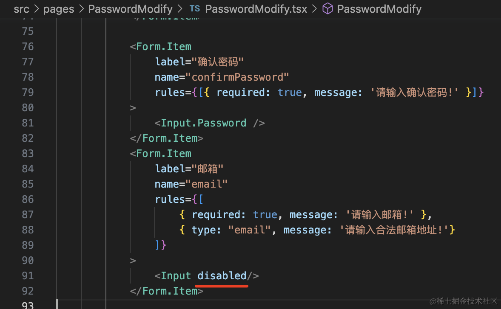

这样邮箱地址就会回显，并且只读：

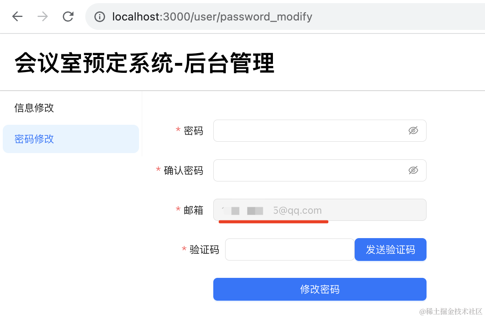

然后调用发送验证码接口：

```javascript
const sendCaptcha = useCallback(async function () {
    const address = form.getFieldValue('email');
    if(!address) {
        return message.error('邮箱地址为空');
    }

    const res = await updatePasswordCaptcha(address);
    if(res.status === 201 || res.status === 200) {
        message.success(res.data.data);
    } else {
        message.error('系统繁忙，请稍后再试');
    }
}, []);
```
点击发送验证码：

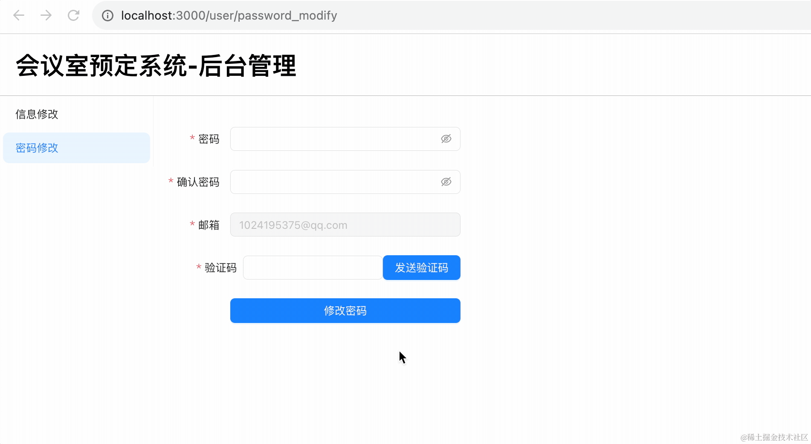

邮箱收到了对应的验证码：

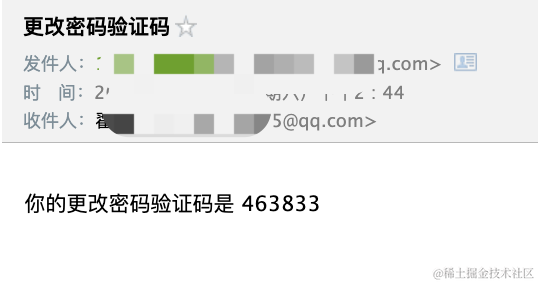
然后加上修改密码接口：

```javascript
const onFinish = useCallback(async (values: UpdatePassword) => {
    if(values.password !== values.confirmPassword) {
        return message.error('两次密码不一致');
    }

    const res = await updatePassword({
        ...values,
        username: form.getFieldValue('username')
    });

    const { message: msg, data} = res.data;

    if(res.status === 201 || res.status === 200) {
        message.success('密码修改成功');
    } else {
        message.error(data || '系统繁忙，请稍后再试');
    }
}, []);
```
提示密码修改成功：

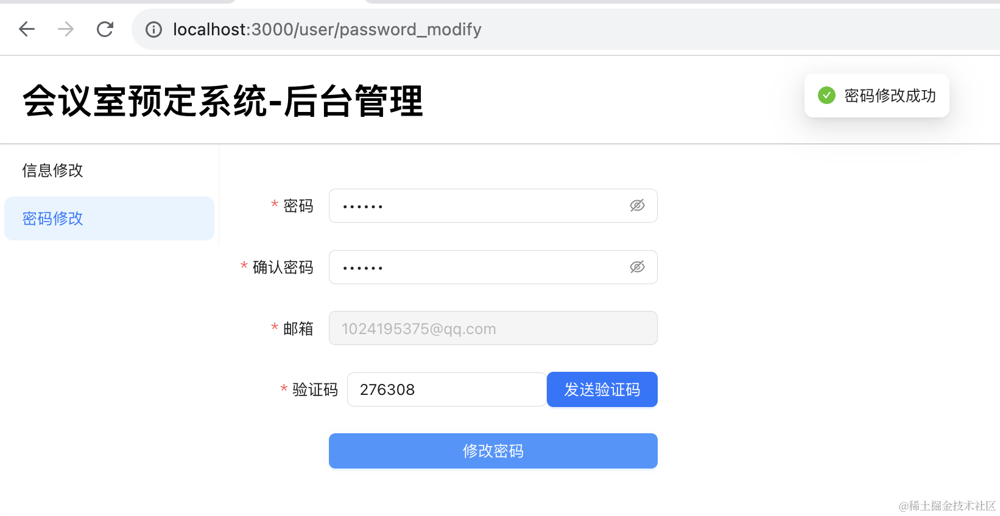

我们可以去登录页面，用老密码试试：

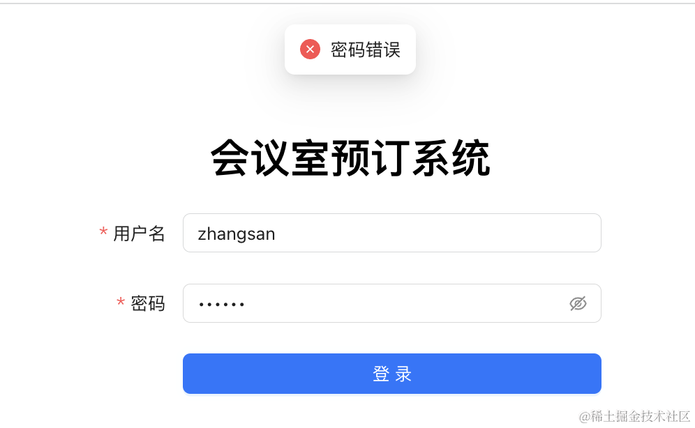

再用新密码试试：

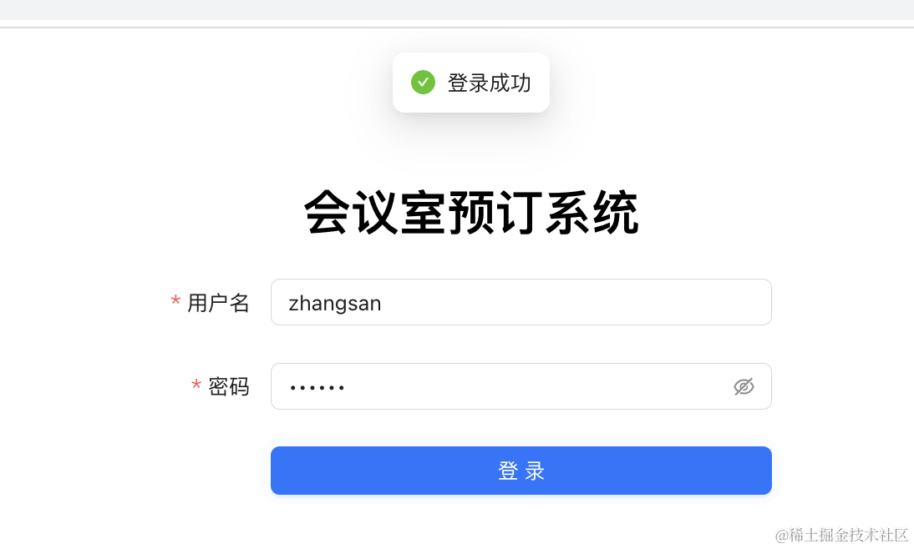

这样，管理端的用户相关的页面就完成了。

案例代码上传了[小册仓库](https://github.com/QuarkGluonPlasma/nestjs-course-code/tree/main/meeting_room_booking_system_frontend_admin)。

## 总结

这节我们实现了管理端的用户信息修改和密码修改的页面。

首先添加了一个和管理页面平级的二级路由，然后添加了两个组件。

这两个页面都是表单，涉及到回显数据、发送验证码、上传文件、更新接口。

这也是管理系统的常见功能。

下节开始，我们就开始写会议室管理的功能了。
