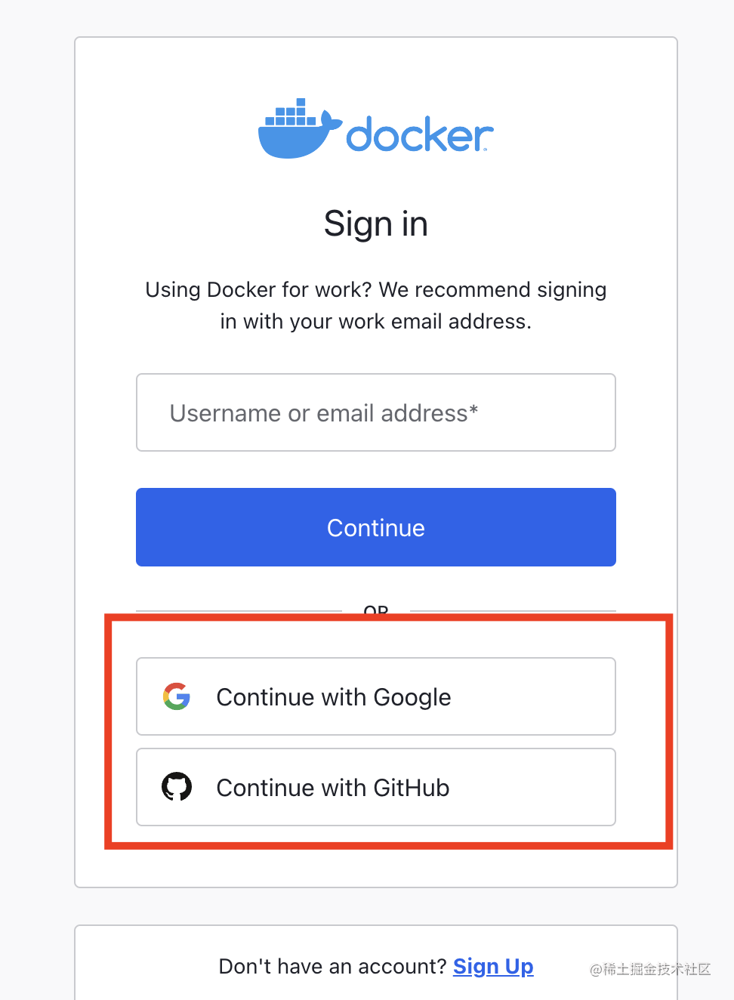
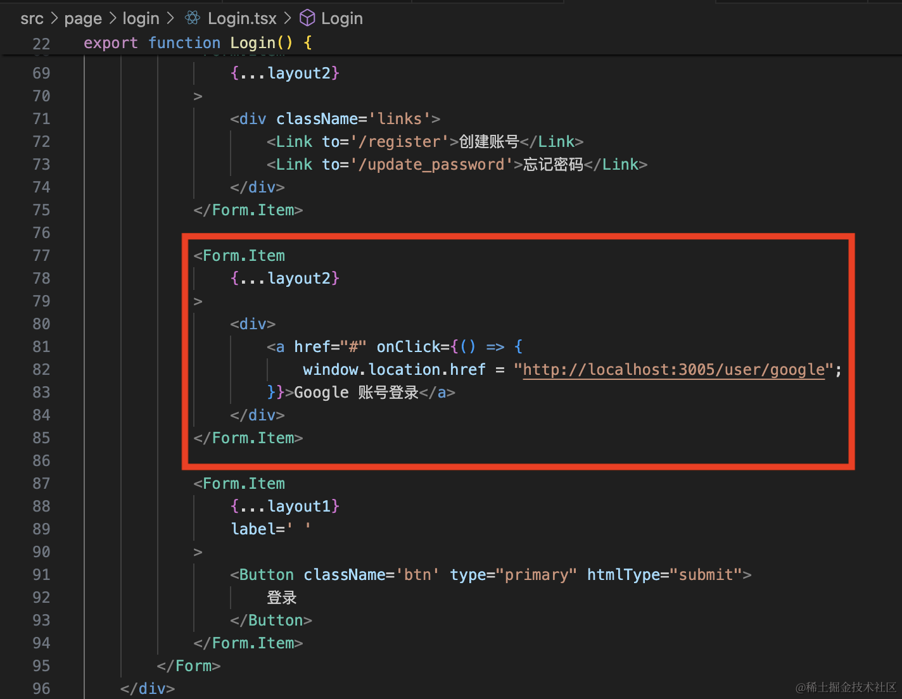
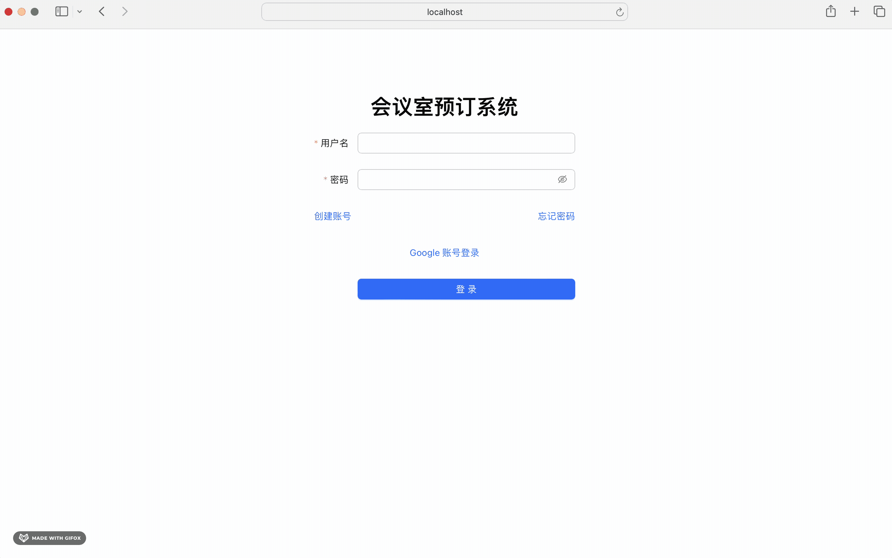
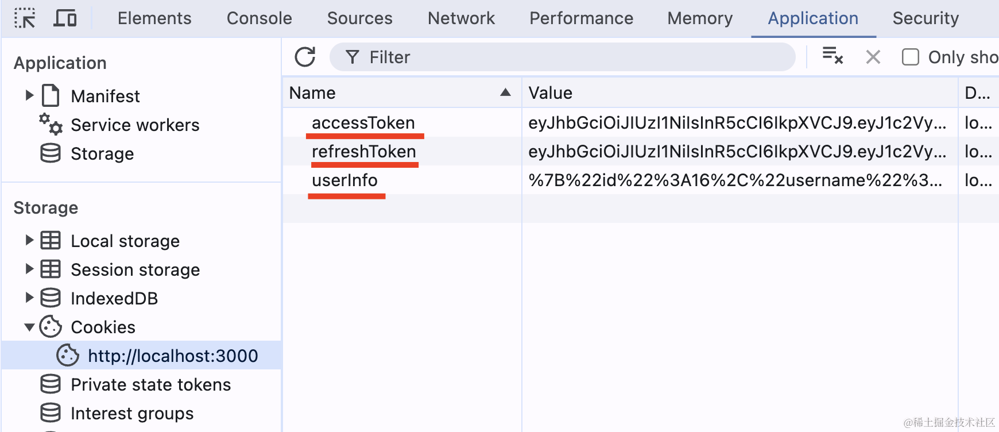
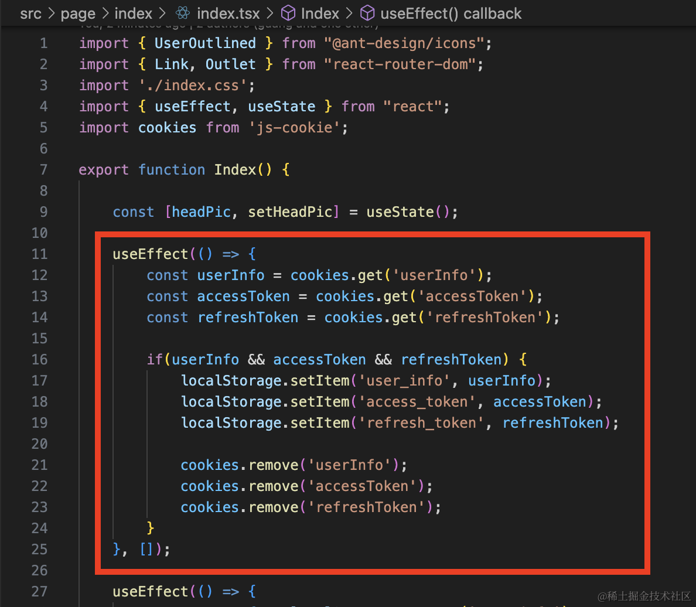
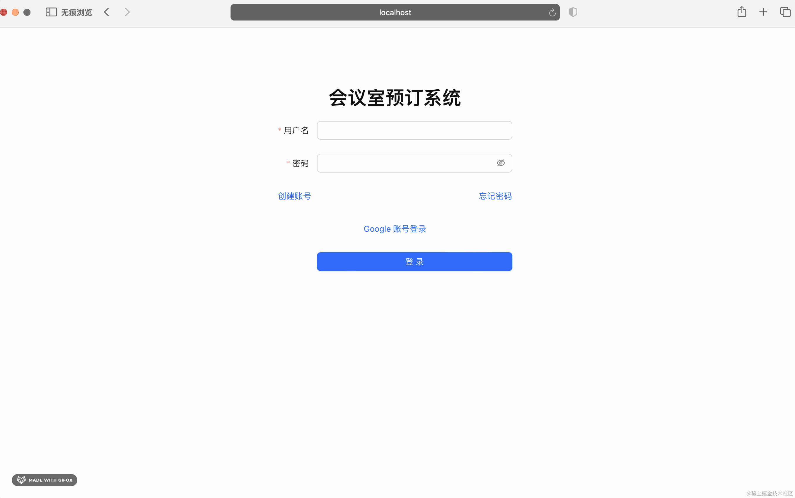
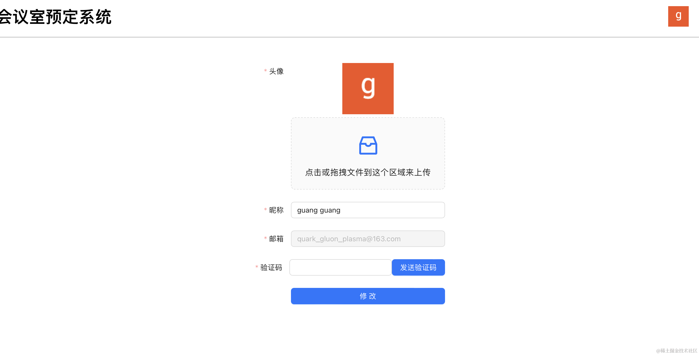
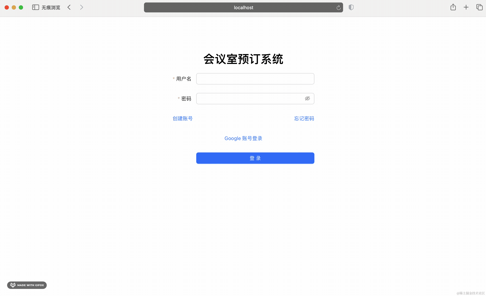

上节实现了 Google 账号登录的后端代码，这节在前端代码里调用下就好了。

类似 https://login.docker.com/u/login 



在登录框下加个 google 账号登录的按钮。

改下 Login.tsx



```javascript
<Form.Item
    {...layout2}
>
    <div>
        <a href="#" onClick={() => {
            window.location.href = "http://localhost:3005/user/google";
        }}>Google 账号登录</a>
    </div>
</Form.Item>
```
点击的时候跳转 google 登录页面。

试一下：



跳转没问题。

再看下 cookie：



也没问题。

接下来只需要在首页处理下 cookie，同步登录状态就好了。

那怎么同步登录状态呢？

看下之前的登录流程：


登录后再 localStorage 里保存了 access_token、refresh_token、user_info 这三个信息，这就是保存了登录状态了。

那现在只要判断下有这三个 cookie，就把它设置到 localStorage，然后刷新下页面不就好了？

安装下操作 cookie 的包：

```
npm install --save js-cookie
npm i --save-dev @types/js-cookie
```
然后在 Index 组件里写下逻辑：



```javascript
useEffect(() => {
    const userInfo = cookies.get('userInfo');
    const accessToken = cookies.get('accessToken');
    const refreshToken = cookies.get('refreshToken');

    if(userInfo && accessToken && refreshToken) {
        localStorage.setItem('user_info', userInfo);
        localStorage.setItem('access_token', accessToken);
        localStorage.setItem('refresh_token', refreshToken);

        cookies.remove('userInfo');
        cookies.remove('accessToken');
        cookies.remove('refreshToken');
    }
}, []);
```

如果 cookie 包含 userInfo、accessToken、refreshToken，就设置到 localStorage，然后把 cookie 删掉。

再试下：





登录成功！

短时间内再次登录不需要再次授权：



你用 [dockerhub](https://hub.docker.com/u/login) 也是这样：


这样，Google 账号登录的前端代码就完成了。

案例代码上传了[小册仓库](https://github.com/QuarkGluonPlasma/nestjs-course-code/tree/main/meeting_room_booking_system_frontend_user)

## 总结

这节我们实现了 Google 账号登录的前端部分。

点击 Google 登录按钮的时候修改 location.href 为 /user/google 触发 Google 账号登录授权。

授权后会回调 /user/callback/google，我们在接口查询了用户信息，通过 cookie 返回 userInfo 和 jwt 的 token，然后重定向到首页。