这节我们来做下微服务的拆分，并把一些公共 Module 放到 Lib 里。

创建项目：

```
nest new exam-system
```

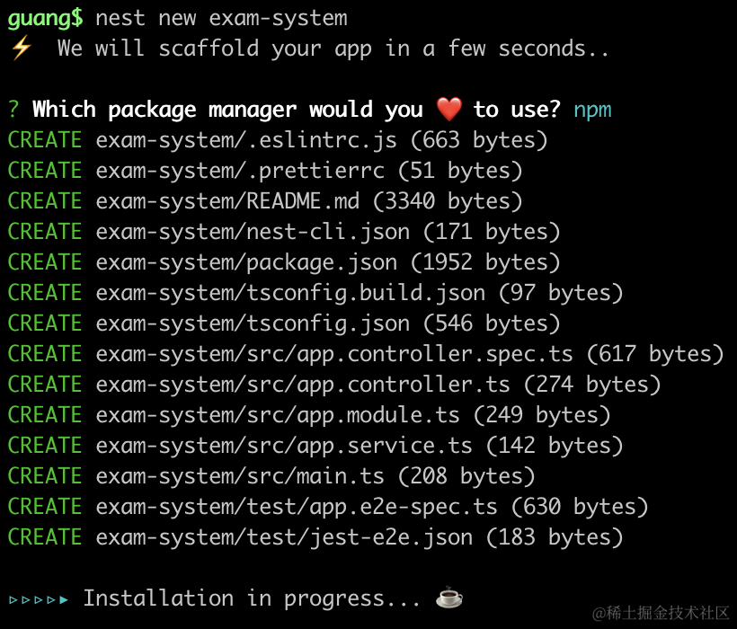

然后添加 4 个 app：

```
nest g app user
```

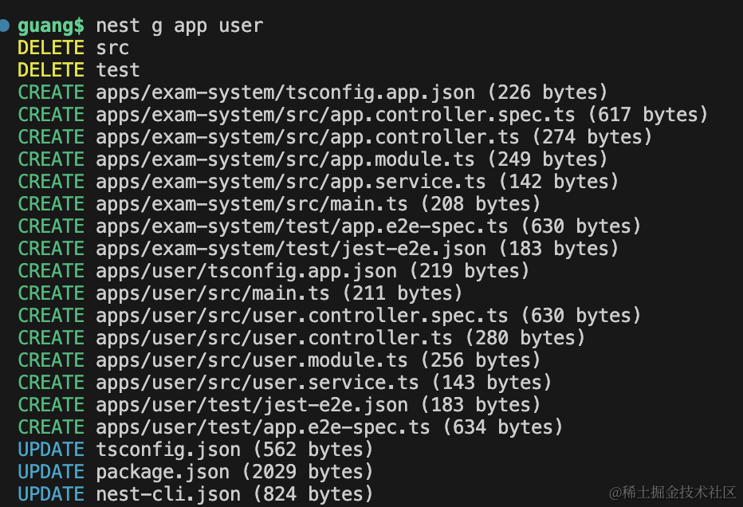

```
nest g app exam
```

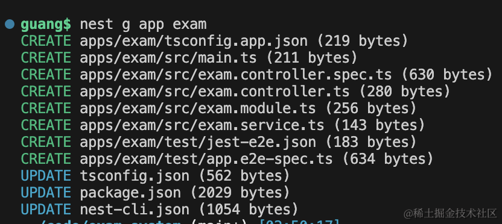

```
nest g app answer
```

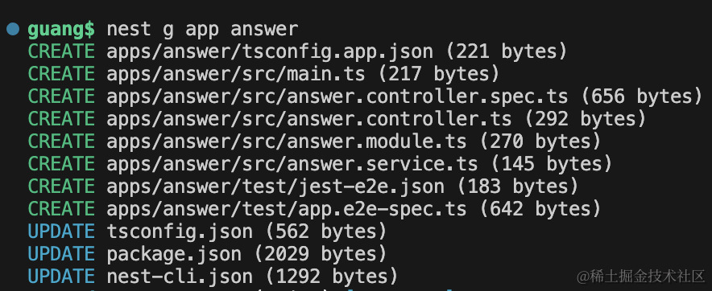

```
nest g app analyse
```

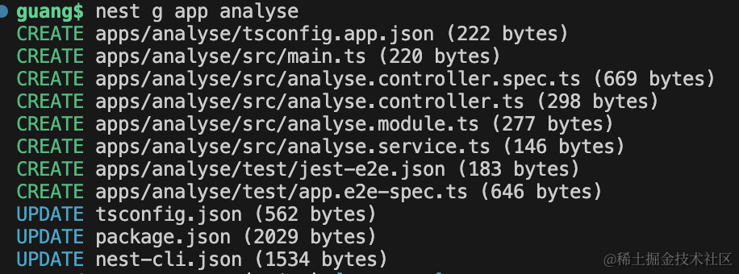

看下现在的目录：

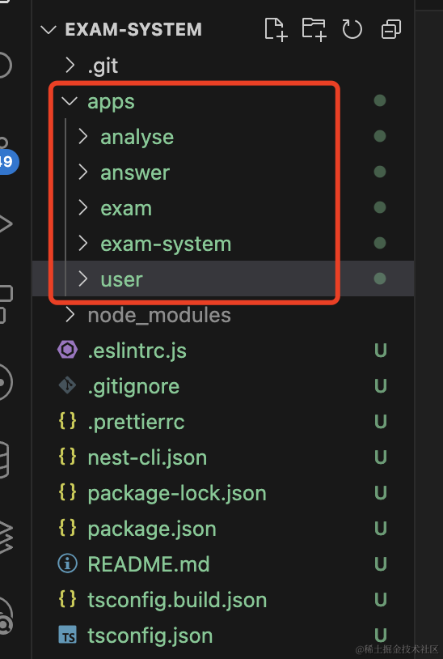

还有 nest-cli.json

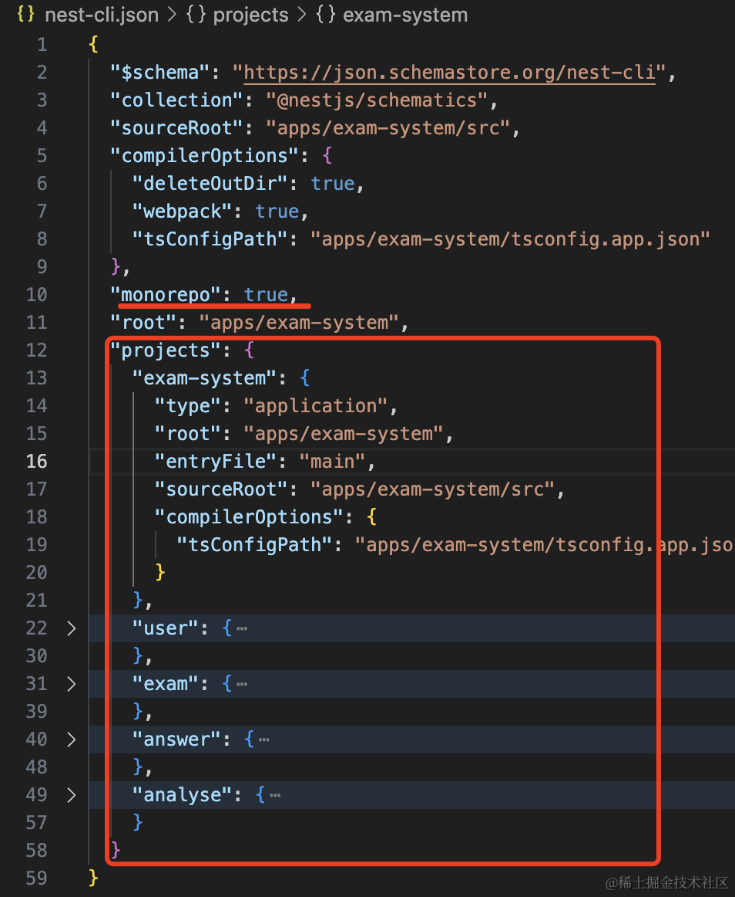

我们改下 user、exam、answer、analyse 的服务的启动端口，分别改为 3001、3002、3003、3004

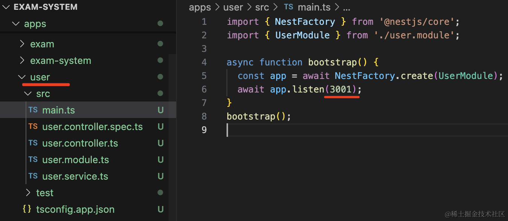

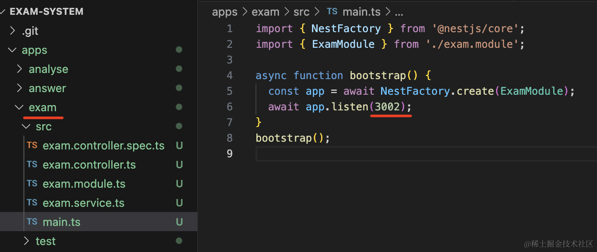

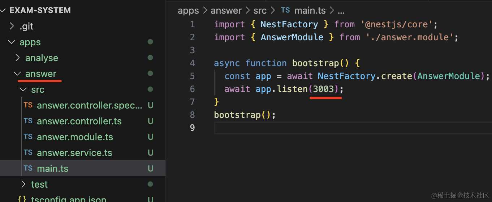

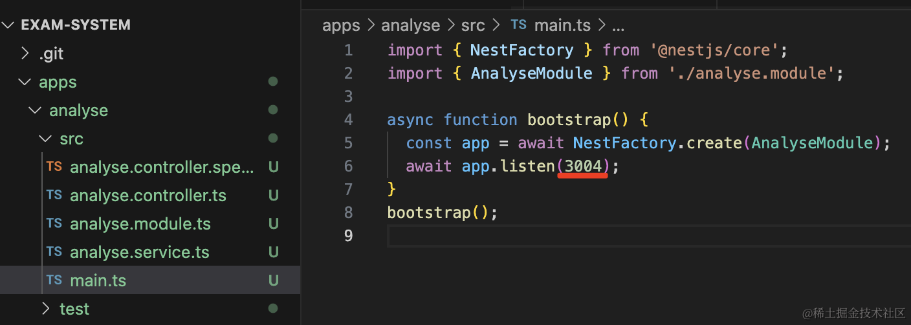

跑起来：

```
npm run start:dev user
npm run start:dev exam
npm run start:dev answer
npm run start:dev analyse
```


浏览器访问这 4 个服务的接口：

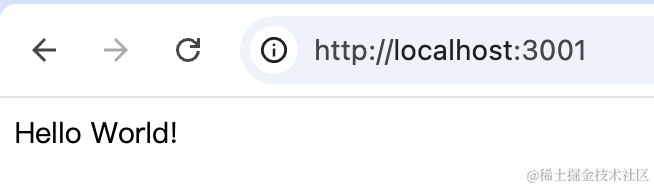

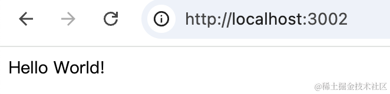

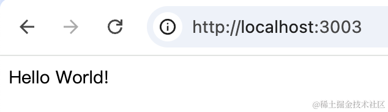

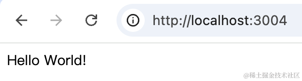

没啥问题。

多个微服务之间是可以相互调用的。

在根目录安装微服务的包：

```
npm install @nestjs/microservices --save
```
然后改下 exam 微服务，添加一个消息处理函数：

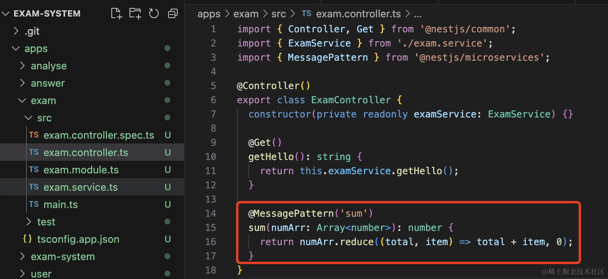

```javascript
@MessagePattern('sum')
sum(numArr: Array<number>): number {
    return numArr.reduce((total, item) => total + item, 0);
}
```
在 main.ts 里注册下：

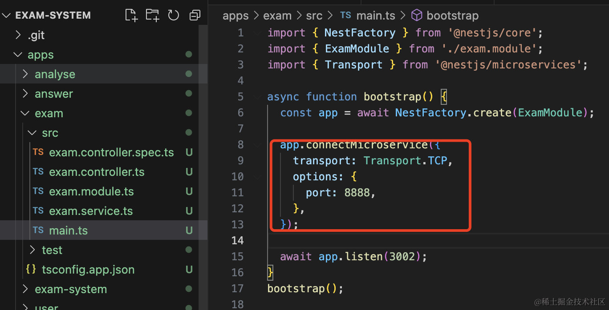

```javascript
app.connectMicroservice({
    transport: Transport.TCP,
    options: {
      port: 8888,
    },
});
app.startAllMicroservices();
```
exam 服务暴露了 3002 的 HTTP 服务，现在用 connectMicroservice 就是再暴露 8888 的 TCP 服务。

在 answer 的服务里面调用下这个微服务：

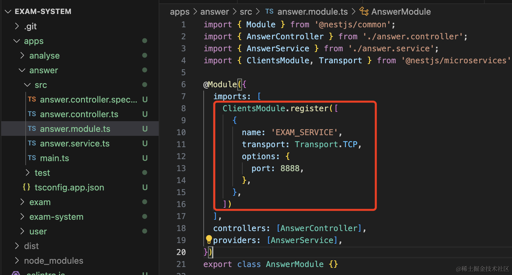
```javascript
ClientsModule.register([
  {
    name: 'EXAM_SERVICE',
    transport: Transport.TCP,
    options: {
      port: 8888,
    },
  },
])
```
用客户端模块连接上 888 端口的微服务，然后在 Controller 里调用下：

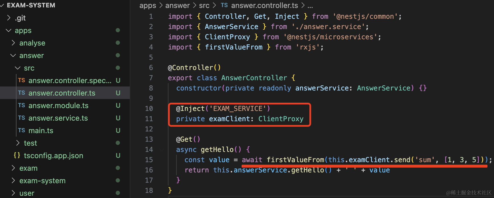

```javascript
import { Controller, Get, Inject } from '@nestjs/common';
import { AnswerService } from './answer.service';
import { ClientProxy } from '@nestjs/microservices';
import { firstValueFrom } from 'rxjs';

@Controller()
export class AnswerController {
  constructor(private readonly answerService: AnswerService) {}

  @Inject('EXAM_SERVICE')
  private examClient: ClientProxy

  @Get()
  async getHello() {
    const value = await firstValueFrom(this.examClient.send('sum', [1, 3, 5]));
    return this.answerService.getHello() + ' ' + value
  }
}
```
在之前的 hello world 接口里调用下微服务的 sum 方法。

用 firstValueFrom 取返回的值。

重新跑一下这两个服务：

```
npm run start:dev exam
npm run start:dev answer
```
试一下：

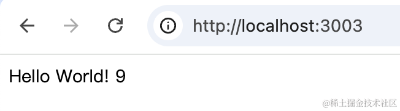

微服务调用成功了。

虽然是隔着网络的两个服务，但是用起来和本地的 service 体验一样，这就是 RPC（远程过程调用）

user、exam、answer、analyse 微服务，各自提供 HTTP 接口，之间还可以通过 TCP 做相互调用。

那多个微服务的公共代码呢？

放在 lib 里。

比如 RedisModule：

```
nest g lib redis
```
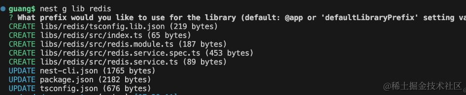

会让你指定一个前缀，这里用默认的 @app。

然后可以看到在 libs 目录下多了这个公共模块：

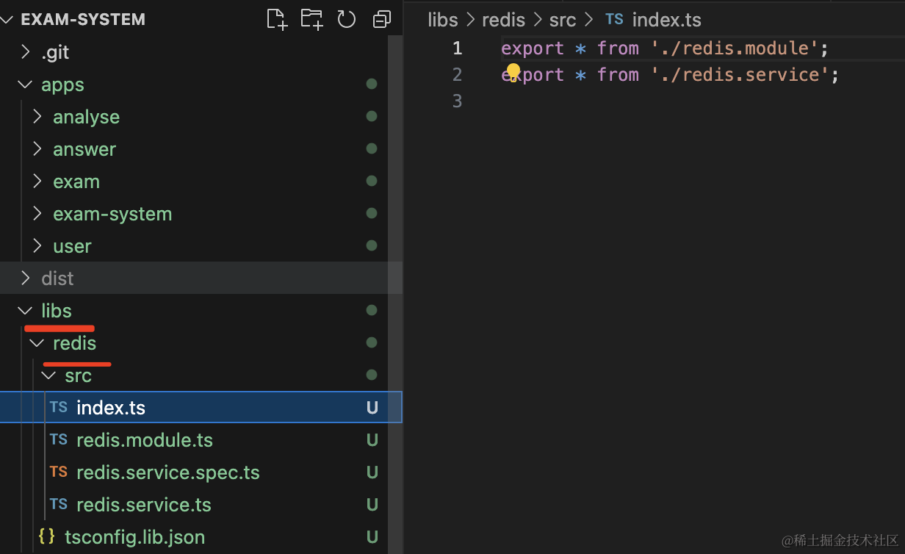

并且在 tsconfig.json 里生成了别名配置：

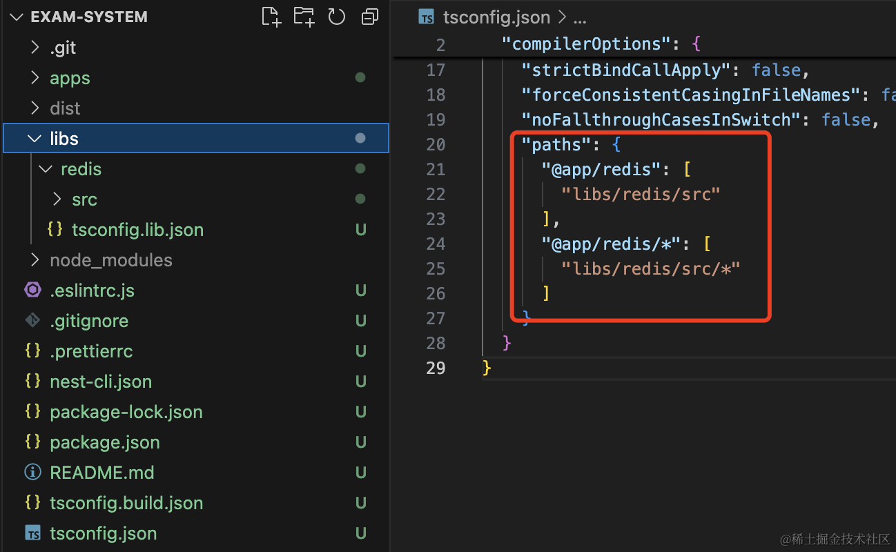

改下 RedisModule

```javascript
import { Global, Module } from '@nestjs/common';
import { createClient } from 'redis';
import { RedisService } from './redis.service';

@Global()
@Module({
  providers: [RedisService, 
    {
      provide: 'REDIS_CLIENT',
      async useFactory() {
        const client = createClient({
            socket: {
                host: 'localhost',
                port: 6379
            }
        });
        await client.connect();
        return client;
      }
    }
  ],
  exports: [RedisService]
})
export class RedisModule {}
```
还有 RedisService

```javascript
import { Inject, Injectable } from '@nestjs/common';
import { RedisClientType } from 'redis';

@Injectable()
export class RedisService {

    @Inject('REDIS_CLIENT') 
    private redisClient: RedisClientType

    async keys(pattern: string) {
        return await this.redisClient.keys(pattern);
    }

    async get(key: string) {
        return await this.redisClient.get(key);
    }

    async set(key: string, value: string | number, ttl?: number) {
        await this.redisClient.set(key, value);

        if(ttl) {
            await this.redisClient.expire(key, ttl);
        }
    }
}
```
然后分别在 user 和 exam 的 service 里用一下：

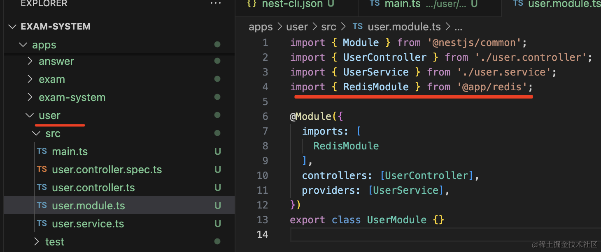

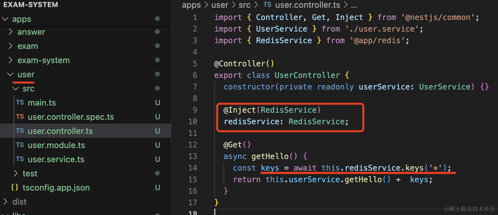

```javascript
import { Controller, Get, Inject } from '@nestjs/common';
import { UserService } from './user.service';
import { RedisService } from '@app/redis';

@Controller()
export class UserController {
  constructor(private readonly userService: UserService) {}

  @Inject(RedisService)
  redisService: RedisService;

  @Get()
  async getHello() {
    const keys = await this.redisService.keys('*');
    return this.userService.getHello() +  keys;
  }
}
```
把 redis 的容器跑起来，去 RedisInsight 里看下：

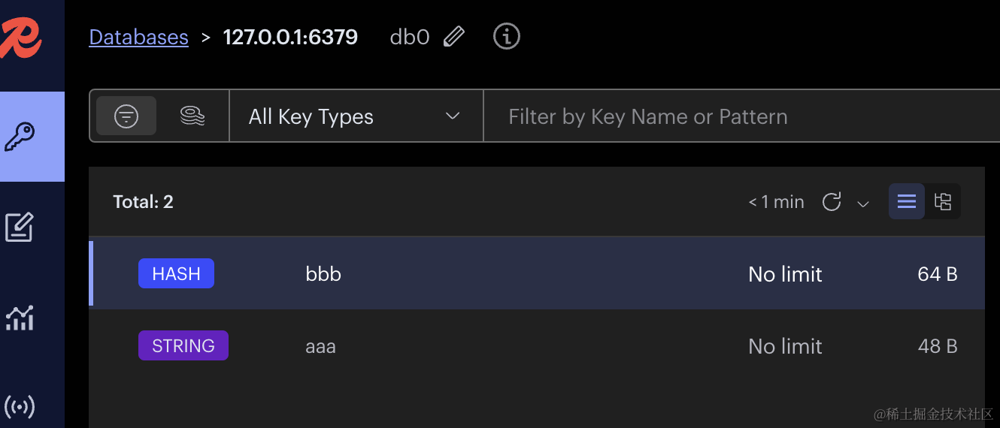

有两个 key。

把用户微服务跑起来：

```
npm run start:dev user
```
访问下：

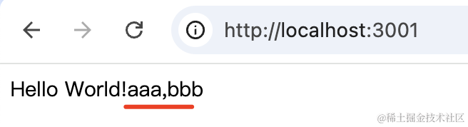

可以看到，lib 里的 RedisService 正确引入并生效了。

在 exam 微服务里也引入下：

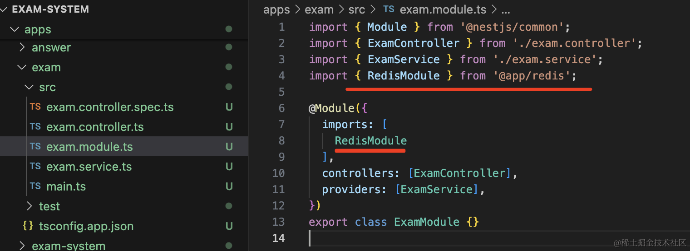

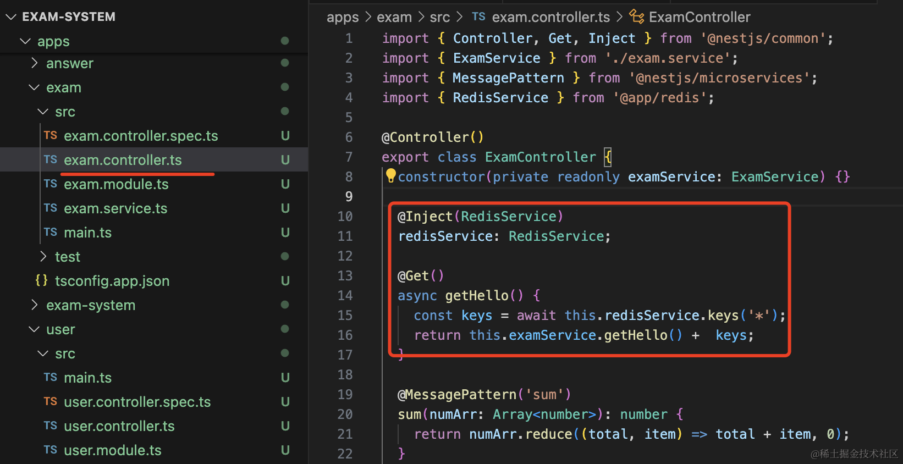

```javascript
@Inject(RedisService)
redisService: RedisService;

@Get()
async getHello() {
    const keys = await this.redisService.keys('*');
    return this.examService.getHello() +  keys;
}
```
把服务跑起来：

```
npm run start:dev exam
```
试一下：

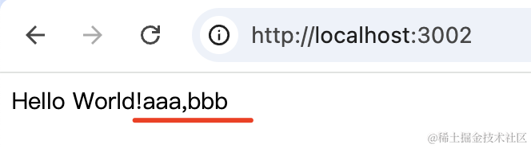

这样，同一个模块就可以在两个微服务里使用了。

案例代码在[小册仓库](https://github.com/QuarkGluonPlasma/nestjs-course-code/tree/main/exam-system)

## 总结

这节我们微服务架构的项目结构。

创建了 user、exam、answer、analyse 这 4 个 app，还有 redis 这个公共 lib。

4 个微服务都单独暴露 http 接口在不同端口，之间还可以通过 TCP 来做通信。

微服务之间的 RPC 通信用起来就和用本地的 service 一样。

libs 下的模块可以在每个 app 里引入，可以放一些公共代码。

这样，微服务架构的 monorepo 的项目就够就搭建完成了。

