这节我们实现下登录。

在 UserController 添加一个 login 的路由：

```javascript
@Post('login')
async userLogin(@Body() loginUser: LoginUserDto) {
    console.log(loginUser);
    return 'success';
}
```
创建 src/user/dto/login-user.dto.ts：

```javascript
import { IsNotEmpty } from "class-validator";

export class LoginUserDto {

    @IsNotEmpty({
        message: "用户名不能为空"
    })
    username: string;
    
    @IsNotEmpty({
        message: '密码不能为空'
    })
    password: string;    
}
```

测试下：

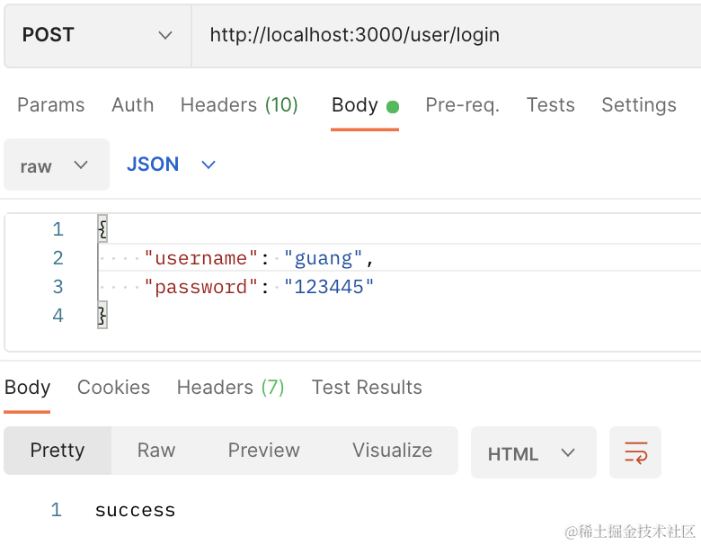

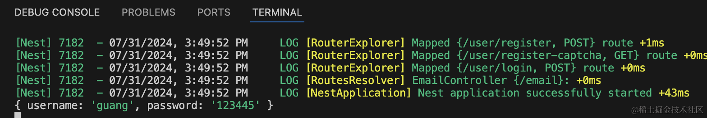

服务端打印了接收的参数。

ValidationPipe 开启 transform: true

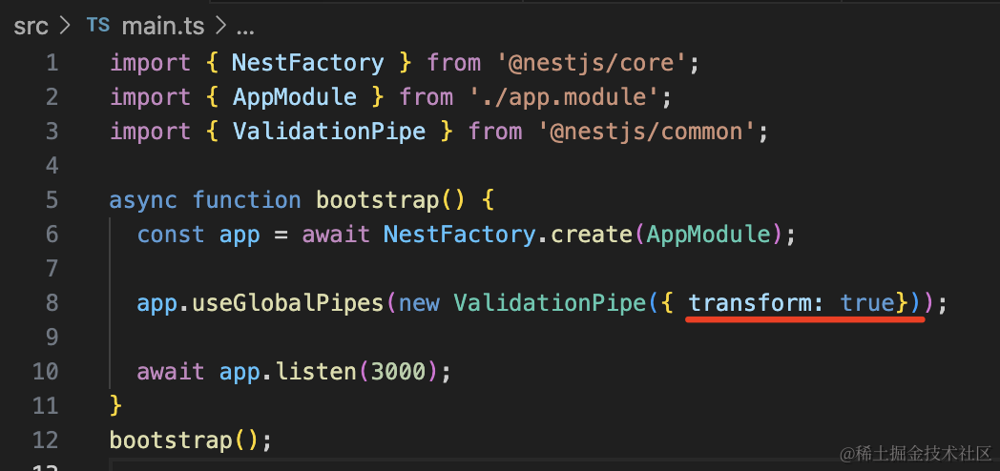

再次访问：

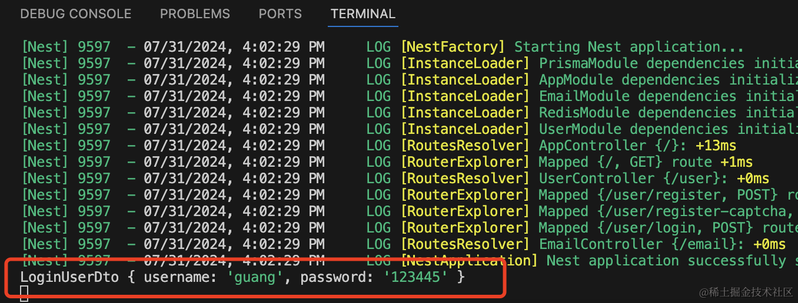

这样会把参数转为 dto 的实例。

然后在 UserService 实现 login 方法：

```javascript
async login(loginUserDto: LoginUserDto) {
  const foundUser = await this.prismaService.user.findUnique({
    where: {
      username: loginUserDto.username
    }
  });

  if(!foundUser) {
      throw new HttpException('用户不存在', HttpStatus.BAD_REQUEST);
  }

  if(foundUser.password !== loginUserDto.password) {
      throw new HttpException('密码错误', HttpStatus.BAD_REQUEST);
  }

  delete foundUser.password;
  return foundUser;
}
```

为了开发方便，我们注册的时候没有对密码做加密，登录的时候也就不用加密了。

在 UserController 里调用下：

```javascript
@Post('login')
async userLogin(@Body() loginUser: LoginUserDto) {
    const user = await this.userService.login(loginUser);

    return user;
}
```
测试下：

当用户名不存在时：

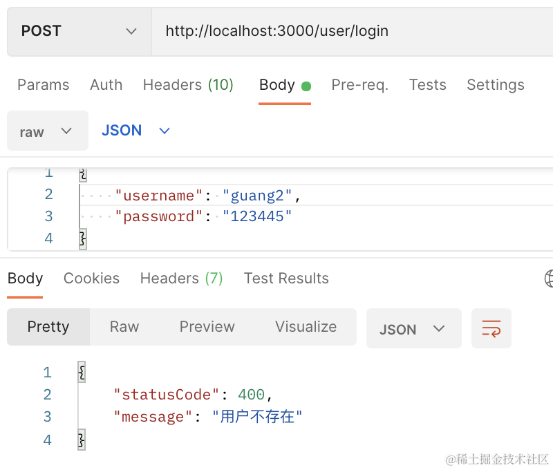

当密码错误时：
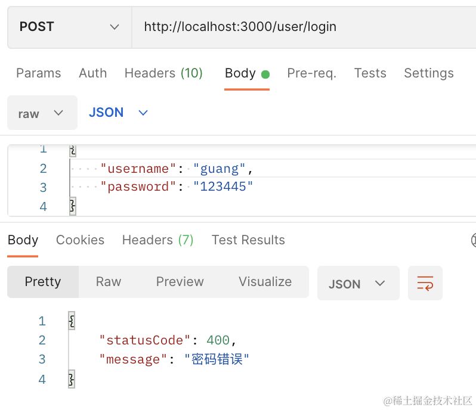

登录成功：

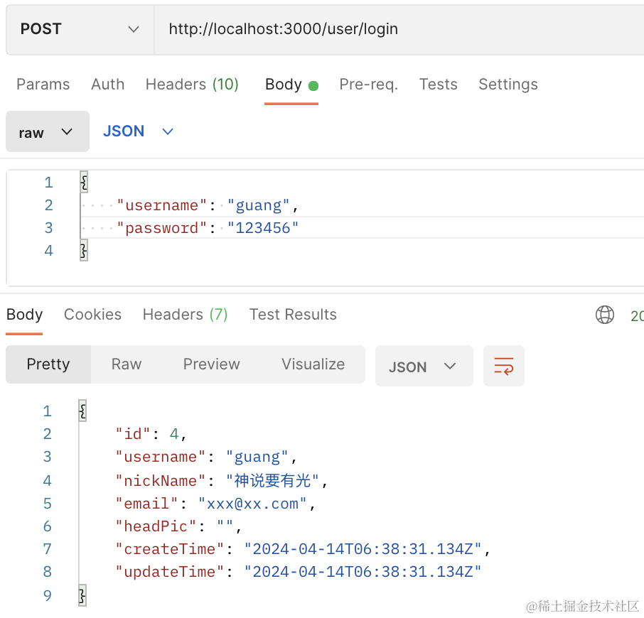

登录成功之后我们要返回 jwt。

引入下 jwt 的包：

```
npm install --save @nestjs/jwt
```

在 AppModule 里引入：

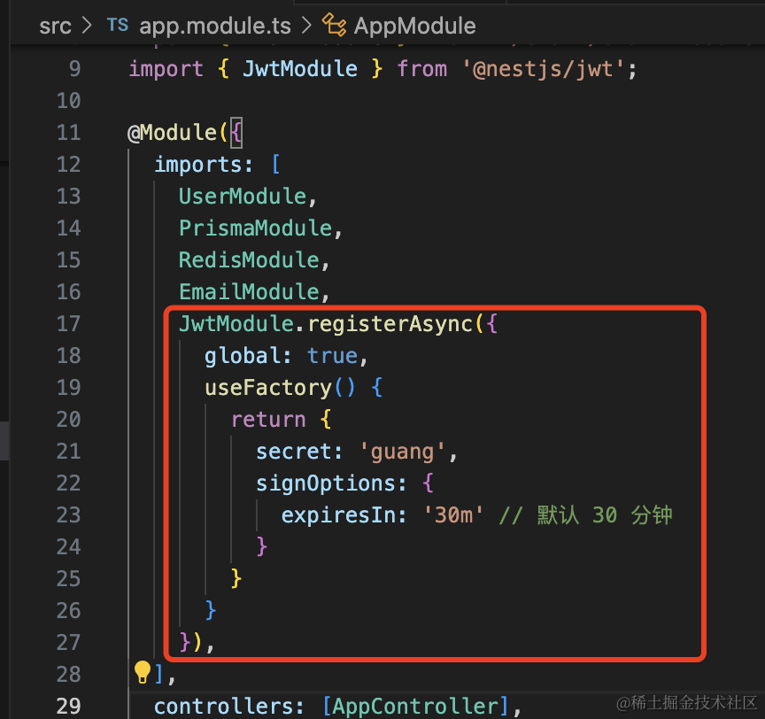

```javascript
JwtModule.registerAsync({
  global: true,
  useFactory() {
    return {
      secret: 'guang',
      signOptions: {
        expiresIn: '30m' // 默认 30 分钟
      }
    }
  }
}),
```

然后登录成功之后返回 token：

```javascript
@Inject(JwtService)
private jwtService: JwtService;

@Post('login')
async userLogin(@Body() loginUser: LoginUserDto) {
    const user = await this.userService.login(loginUser);

    return {
      user,
      token: this.jwtService.sign({
        userId: user.id,
        username: user.username
      }, {
        expiresIn: '7d'
      })
    };
}
```

token 过期时间是 7 天。

测试下：

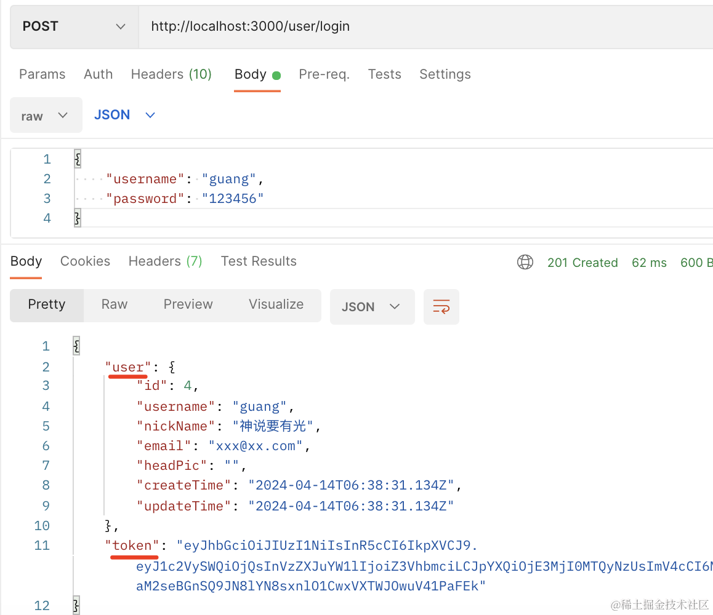

我们这里就不用双 token 的方式来刷新了，而是用单 token 无限续期来做。

也就是当访问接口的时候，就返回一个新的 token。

这样只要它在 token 过期之前，也就是 7 天内访问了一次系统，那就会刷新换成新 token。

超过 7 天没访问，那就需要重新登录了。

然后我们加上 AuthGuard 来做登录鉴权：

```
nest g guard auth --flat --no-spec
```
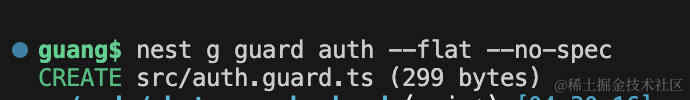

AuthGuard 的实现代码如下：

```javascript
import { CanActivate, ExecutionContext, Inject, Injectable, UnauthorizedException } from '@nestjs/common';
import { Reflector } from '@nestjs/core';
import { JwtService } from '@nestjs/jwt';
import { Request } from 'express';
import { Observable } from 'rxjs';

interface JwtUserData {
  userId: number;
  username: string;
}

declare module 'express' {
  interface Request {
    user: JwtUserData
  }
}

@Injectable()
export class AuthGuard implements CanActivate {
  
  @Inject()
  private reflector: Reflector;

  @Inject(JwtService)
  private jwtService: JwtService;
  
  canActivate(
    context: ExecutionContext,
  ): boolean | Promise<boolean> | Observable<boolean> {
    const request: Request = context.switchToHttp().getRequest();
    
    const requireLogin = this.reflector.getAllAndOverride('require-login', [
      context.getClass(),
      context.getHandler()
    ]);

    if(!requireLogin) {
      return true;
    }

    const authorization = request.headers.authorization;

    if(!authorization) {
      throw new UnauthorizedException('用户未登录');
    }

    try{
      const token = authorization.split(' ')[1];
      const data = this.jwtService.verify<JwtUserData>(token);

      request.user = {
        userId: data.userId,
        username: data.username,
      }
      return true;
    } catch(e) {
      throw new UnauthorizedException('token 失效，请重新登录');
    }
  }
}
```
用 reflector 从目标 controller 和 handler 上拿到 require-login 的 metadata。

如果没有 metadata，就是不需要登录，返回 true 放行。

否则从 authorization 的 header 取出 jwt 来，把用户信息设置到 request，然后放行。

如果 jwt 无效，返回 401 响应，提示 token 失效，请重新登录。

然后全局启用这个 Guard，在 AppModule 里添加这个 provider：

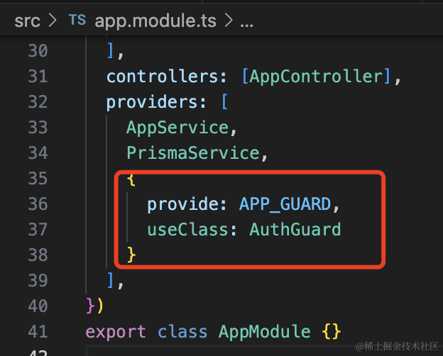

```javascript
{
  provide: APP_GUARD,
  useClass: AuthGuard
}
```

在 AppController 添加 aaa、bbb 两个接口：

```javascript
@Get('aaa')
aaa() {
    return 'aaa';
}

@Get('bbb')
bbb() {
    return 'bbb';
}
```
访问下：

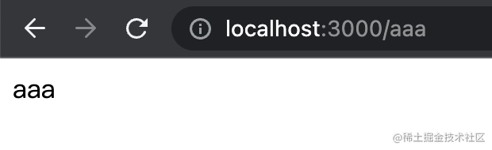

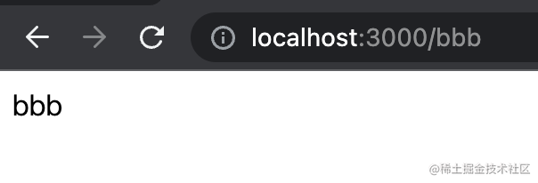

然后在 aaa 加上 require-login 的 matadata

```javascript
@Get('aaa')
@SetMetadata('require-login', true)
aaa() {
    return 'aaa';
}
```
会提示用户未登录：

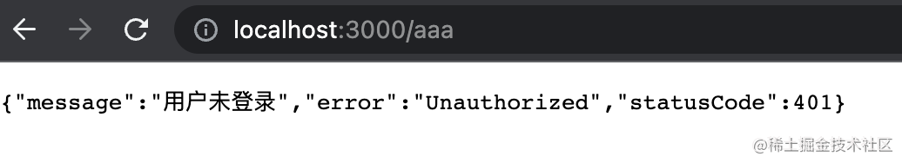

而 bbb 还是可以直接访问的：

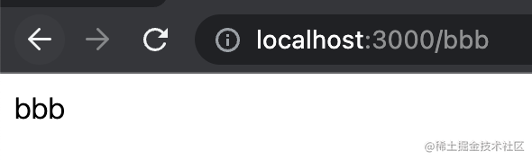

登录下，拿到 token：

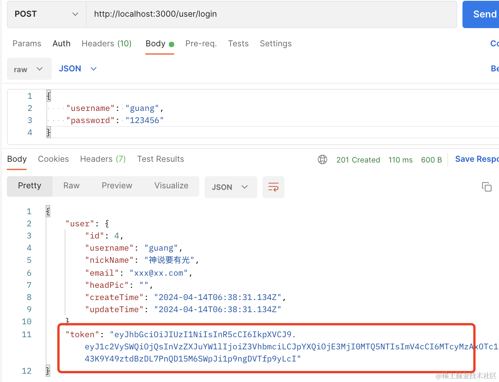

添加到 authorization 的 header 里，就可以访问了：

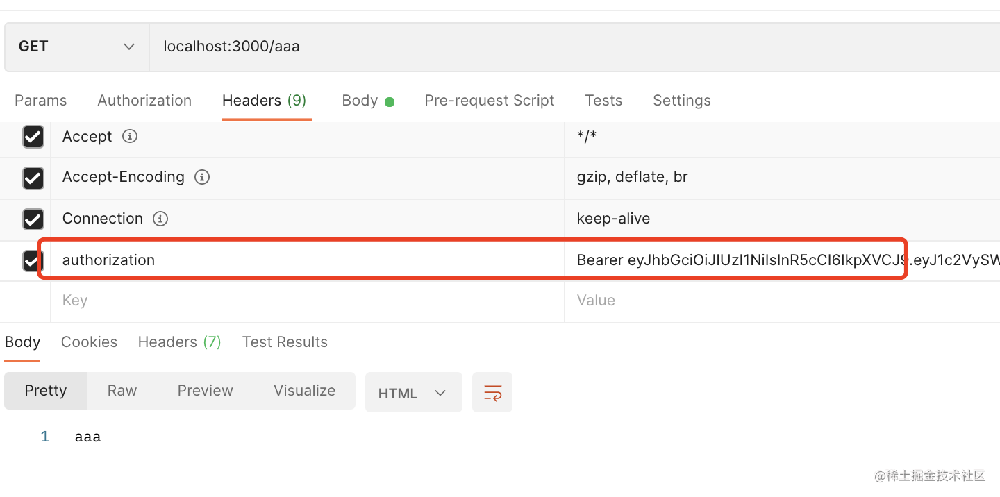

我们把这个 @SetMetadata 封装成自定义装饰器

新建 src/custom.decorator.ts

```javascript
import { SetMetadata } from "@nestjs/common";

export const  RequireLogin = () => SetMetadata('require-login', true);
```
然后就可以通过在 controller 或者 handler 上的 @RequiredLogin 来声明接口需要登录了：

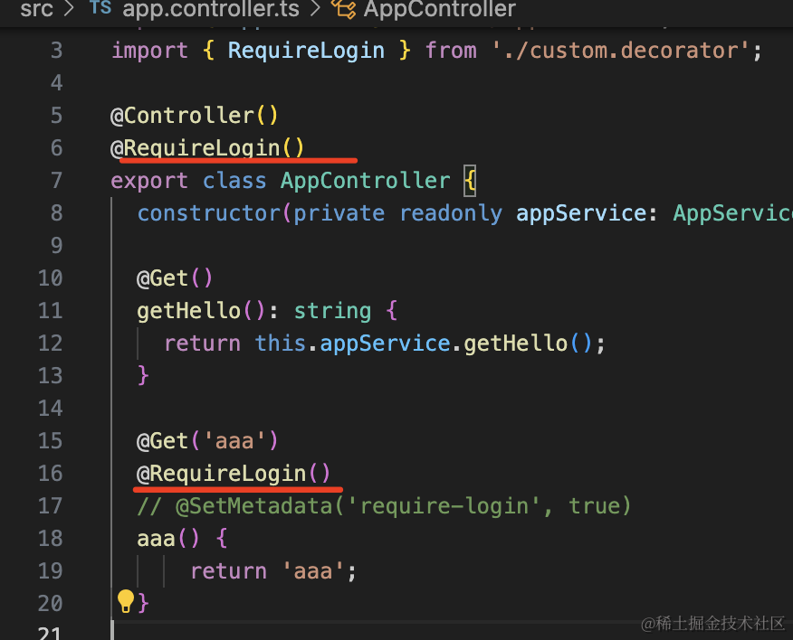

再实现个自定义参数装饰器来取 request.user

```javascript
import { SetMetadata } from "@nestjs/common";
import { createParamDecorator, ExecutionContext } from '@nestjs/common';
import { Request } from "express";

export const  RequireLogin = () => SetMetadata('require-login', true);

export const UserInfo = createParamDecorator(
  (data: string, ctx: ExecutionContext) => {
    const request = ctx.switchToHttp().getRequest<Request>();

    if(!request.user) {
        return null;
    }
    return data ? request.user[data] : request.user;
  },
)
```
在 aaa 方法里测试下：

```javascript
@Get('aaa')
@RequireLogin()
// @SetMetadata('require-login', true)
aaa(@UserInfo() userInfo, @UserInfo('username') username) {
    console.log(userInfo, username);
    return 'aaa';
}
```

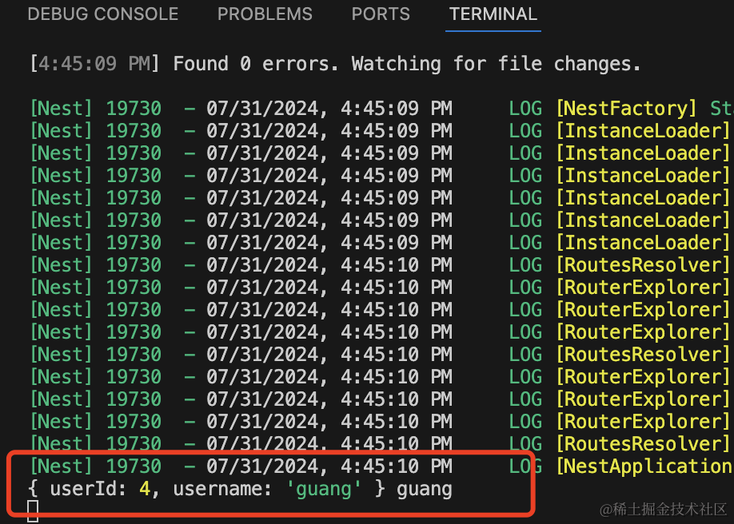

这样，就完成了登录和鉴权。

还有 token 自动续期没有做，这个就是访问接口之后，在 header 或者 body 里额外返回新 token。

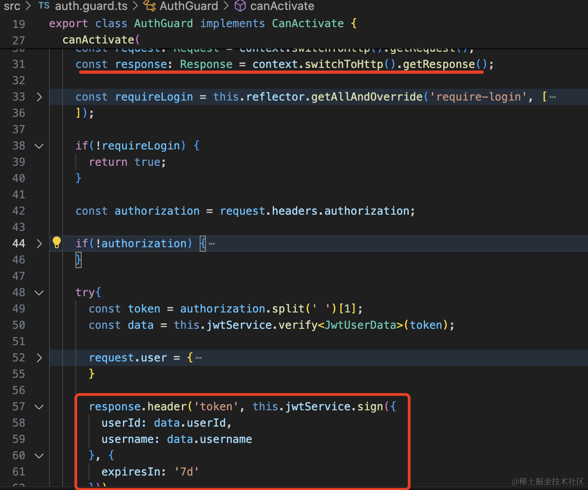

```javascript
import { CanActivate, ExecutionContext, Inject, Injectable, UnauthorizedException } from '@nestjs/common';
import { Reflector } from '@nestjs/core';
import { JwtService } from '@nestjs/jwt';
import { Request, Response } from 'express';
import { Observable } from 'rxjs';

interface JwtUserData {
  userId: number;
  username: string;
}

declare module 'express' {
  interface Request {
    user: JwtUserData
  }
}

@Injectable()
export class AuthGuard implements CanActivate {
  
  @Inject()
  private reflector: Reflector;

  @Inject(JwtService)
  private jwtService: JwtService;
  
  canActivate(
    context: ExecutionContext,
  ): boolean | Promise<boolean> | Observable<boolean> {
    const request: Request = context.switchToHttp().getRequest();
    const response: Response = context.switchToHttp().getResponse();

    const requireLogin = this.reflector.getAllAndOverride('require-login', [
      context.getClass(),
      context.getHandler()
    ]);

    if(!requireLogin) {
      return true;
    }

    const authorization = request.headers.authorization;

    if(!authorization) {
      throw new UnauthorizedException('用户未登录');
    }

    try{
      const token = authorization.split(' ')[1];
      const data = this.jwtService.verify<JwtUserData>(token);

      request.user = {
        userId: data.userId,
        username: data.username,
      }

      response.header('token', this.jwtService.sign({
        userId: data.userId,
        username: data.username
      }, {
        expiresIn: '7d'
      }))

      return true;
    } catch(e) {
      console.log(e);
      throw new UnauthorizedException('token 失效，请重新登录');
    }
  }
}
```

再访问下 aaa 接口：

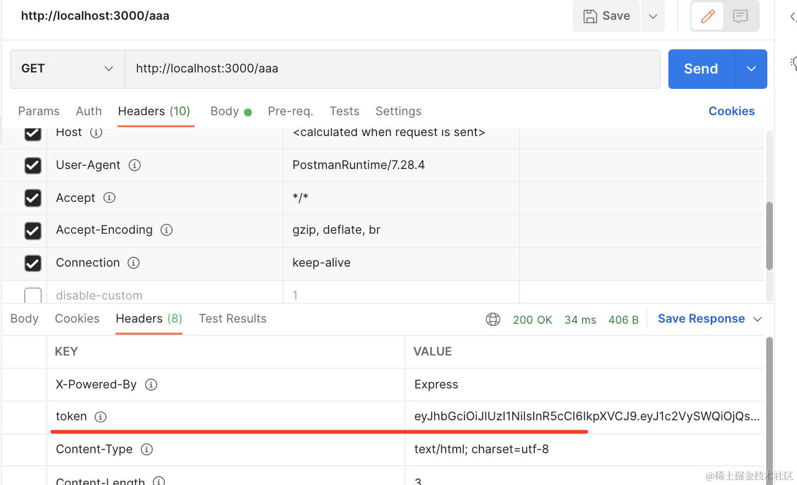

可以看到返回了新 token。

这样只要访问需要登录的接口，就会刷新 token。

比双token 的方案简单多了，很多公司就是这样做的。

代码在[小册仓库](https://github.com/QuarkGluonPlasma/nestjs-course-code/tree/main/chat-room-backend)。

## 总结

这节我们实现了登录、鉴权。

添加了 /user/login 接口来实现登录，登录后返回 jwt token。

访问的时候在 Authorization 的 header 带上 jwt 的 token 就能通过 AuthGuard 的鉴权。

我们做了 token 的自动续期，也就是访问接口后在 header 返回新 token，这样比双 token 的方案简单。

然后封装了 @RequireLogin 和 @UserInfo 两个自定义装饰器。

登录之后，就可以访问一些需要 user 信息的接口了。
