用户模块的功能写完了，这节我们来实现添加好友、加入群聊的功能。

好友关系就是用户和用户的多对多关联，保存在好友关系表里。

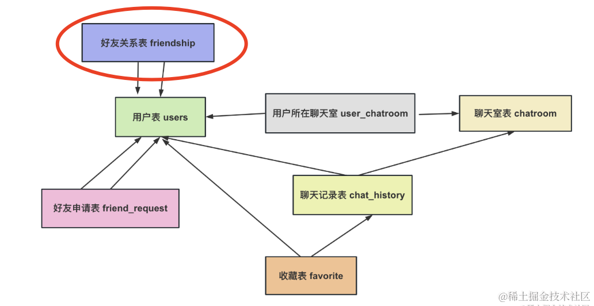

聊天室有专门的表，加入群聊就是往用户-聊天室的中间表插入一条记录：

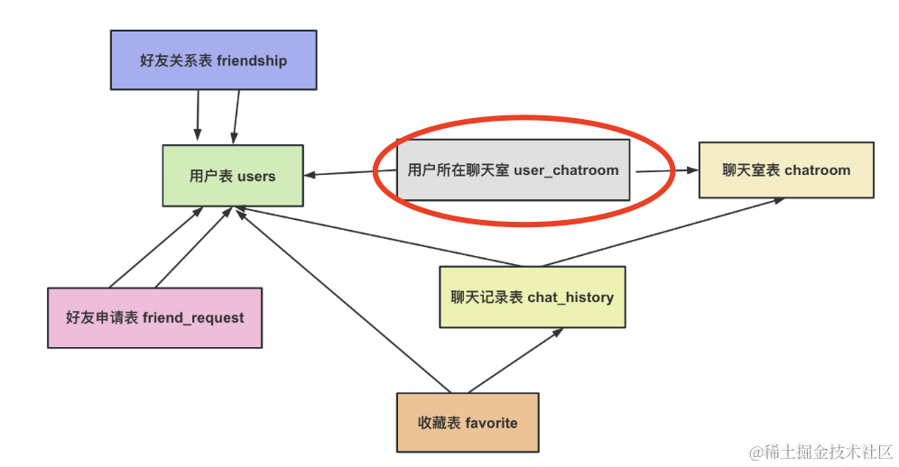

我们先来实现好友关系的保存：

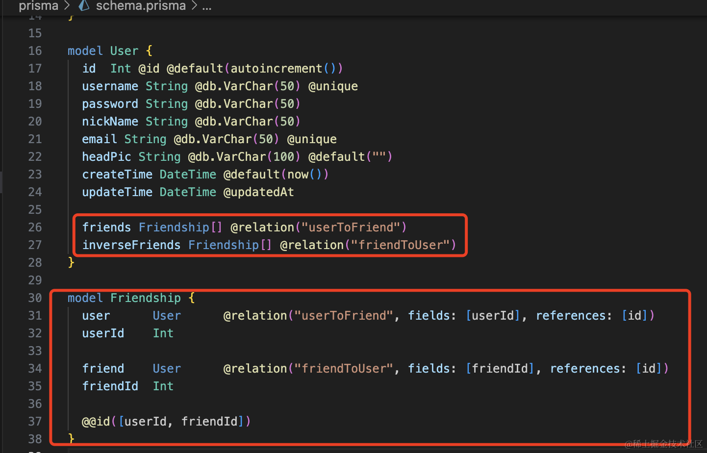

```javascript
model User {
  id  Int @id @default(autoincrement())
  username String @db.VarChar(50) @unique
  password String @db.VarChar(50)
  nickName String @db.VarChar(50)
  email String @db.VarChar(50) @unique
  headPic String @db.VarChar(100) @default("")
  createTime DateTime @default(now())
  updateTime DateTime @updatedAt

  friends Friendship[] @relation("userToFriend")
  inverseFriends Friendship[] @relation("friendToUser")
}

model Friendship {
  user      User      @relation("userToFriend", fields: [userId], references: [id])
  userId    Int

  friend    User      @relation("friendToUser", fields: [friendId], references: [id])
  friendId  Int

  @@id([userId, friendId])
}
```
在 schema 里添加一个中间表 Friendship

它是 user 和 user 的多对多。

这种自身的多对多，需要在 User 的 model 里添加两个属性 friends、inverseFriends 来保存。

friends 是 user 的好友有哪些。

inverseFriends 是 user 是哪些人的好友。

执行 migrate dev 生成这个表：

```
npx prisma migrate dev --name friendship
```
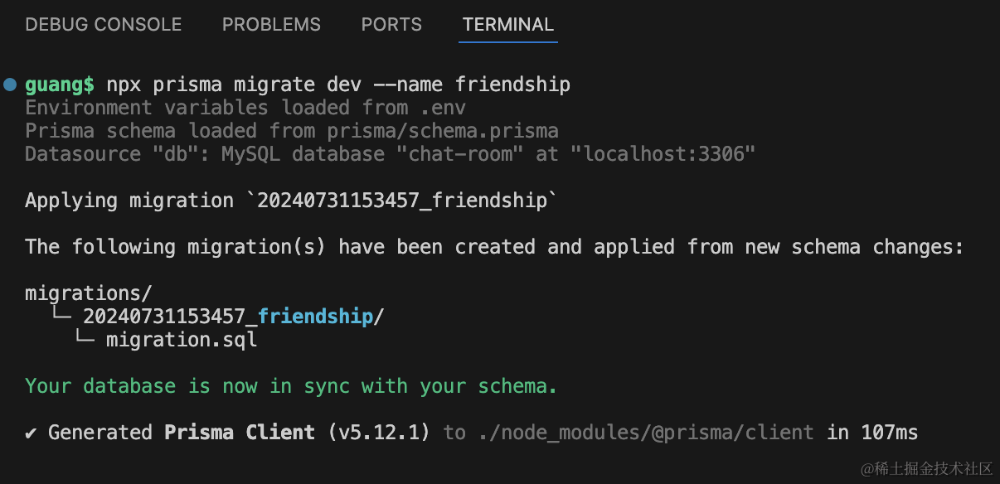

可以看到，生成的 sql 是对的：

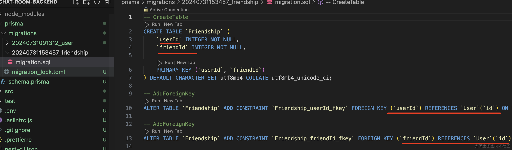

一个中间表，两个字段 userId、friendId 都是外键，引用 user 表的 id。

现在好友关系表里还没有数据：

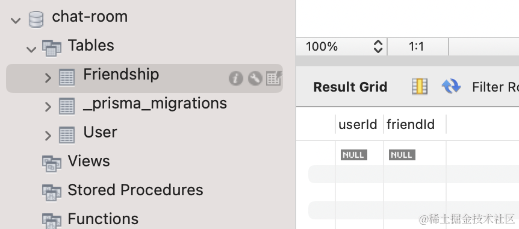

我们先注册几个用户：

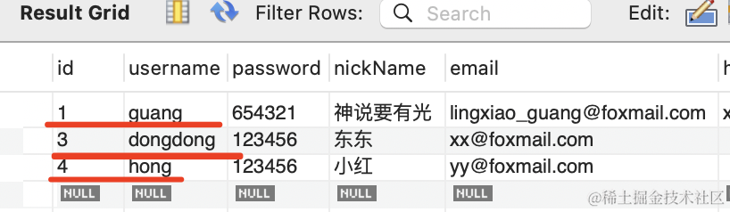

自己注册的时候可以先把验证码这段注释掉：

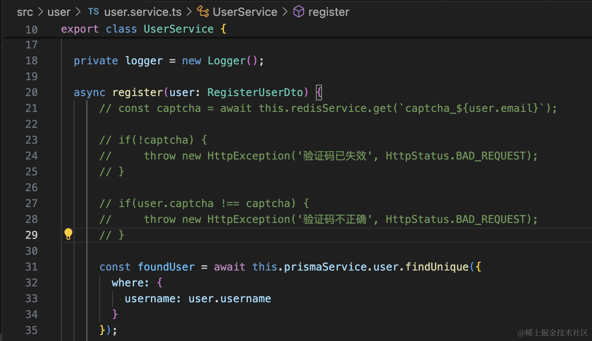

然后手动在 friendship 表里加入几条好友关系：

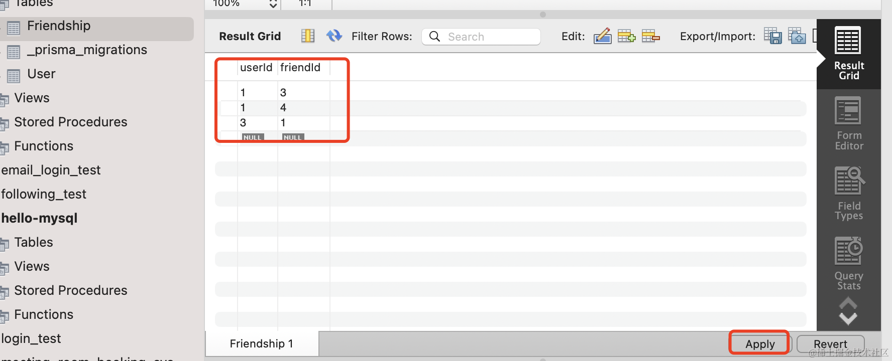

在 UserController 添加一个路由

```javascript
@Get('friendship')
@RequireLogin()
async friendship(@UserInfo('userId') userId: number) {
    return this.userService.getFriendship(userId);
}
```
在 UserService 实现下：

```javascript
async getFriendship(userId: number) {
    const friends = await this.prismaService.friendship.findMany({
        where: {
            OR: [
                {
                    userId: userId
                },
                {
                    friendId: userId
                }
            ] 
        }
    });

    const set = new Set<number>();
    for(let i =0; i< friends.length; i++) {
        set.add(friends[i].userId)
        set.add(friends[i].friendId)
    }

    const friendIds = [...set].filter(item => item !== userId);

    const res = [];

    for(let i = 0; i< friendIds.length; i++) {
        const user = await this.prismaService.user.findUnique({
            where: {
              id: friendIds[i],
            },
            select: {
              id: true,
              username: true,
              nickName: true,
              email: true
            }
        })
        res.push(user)
    }

    return res
}
```

我们要查询 userId 或者 friendId 为当前用户的记录，把 id 去重并去掉籽身后，查询对应的用户信息。

也就是对方是我的好友、我是对方的好友，都算作互相是好友。

试一下：

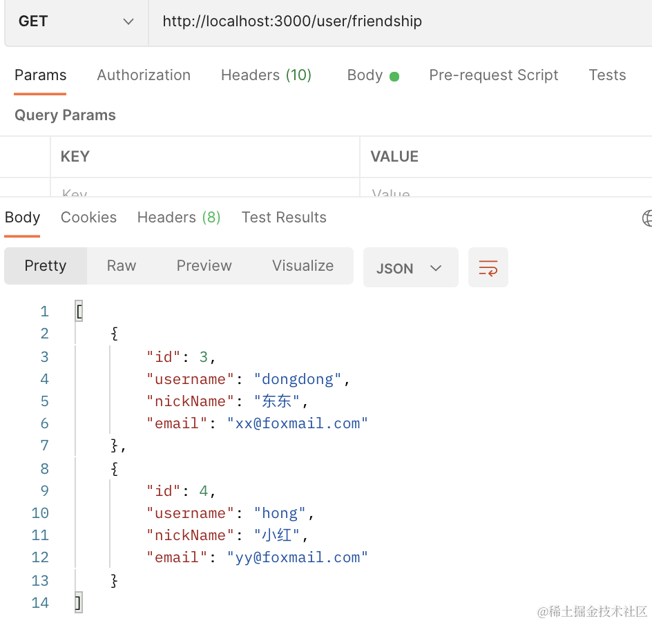

这就是好友列表的功能：

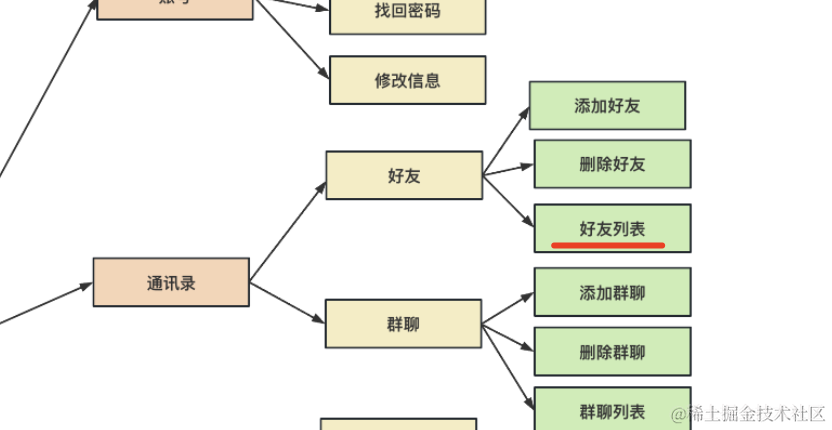

而添加和删除好友就是在这个好友关系表里新增、删除数据。

但是并不是直接添加好友，而是需要先发一个申请，对方通过后才添加这条好友关系：

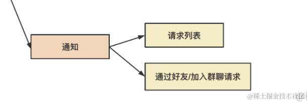

创建下这个好友申请表：

好友申请表 friend_request：

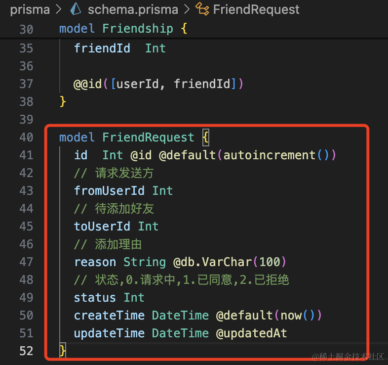

生成这个表：

```
npx prisma migrate dev --name friend_request
```
看下生成的 sql：

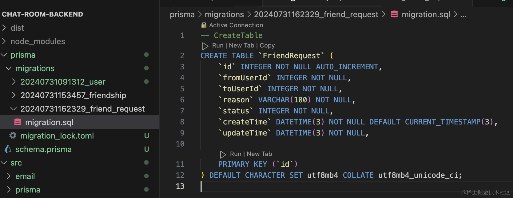

没啥问题。

添加一个新的模块：

```
nest g resource friendship --no-spec
```
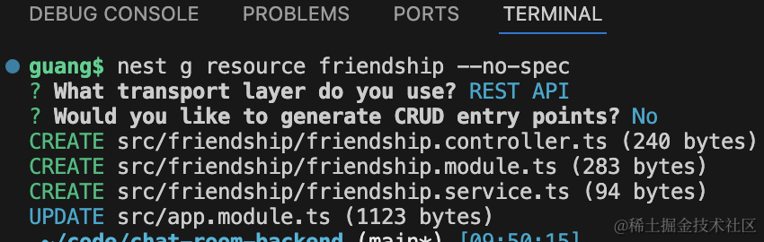

添加一个 /friendship/add 路由：

```javascript
import { Body, Controller, Get, Post } from '@nestjs/common';
import { FriendshipService } from './friendship.service';
import { FriendAddDto } from './dto/friend-add.dto';
import { RequireLogin, UserInfo } from 'src/custom.decorator';

@Controller('friendship')
export class FriendshipController {
  constructor(private readonly friendshipService: FriendshipService) {}

  @Post('add')
  @RequireLogin()
  async add(@Body() friendAddDto: FriendAddDto, @UserInfo("userId") userId: number) {
    return this.friendshipService.add(friendAddDto, userId);
  }
}
```

这个接口需要登录，然后 @UserInfo 取出 userId 传入。

创建 dto

```javascript
import { IsNotEmpty } from "class-validator";

export class FriendAddDto {

    @IsNotEmpty({
        message: "添加的好友 id 不能为空"
    })
    friendId: number;

    reason: string;    
}
```
好友请求的理由可以不填。

然后写下 FriendshipService：

```javascript
import { FriendAddDto } from './dto/friend-add.dto';
import { Inject, Injectable } from '@nestjs/common';
import { PrismaService } from 'src/prisma/prisma.service';

@Injectable()
export class FriendshipService {

    @Inject(PrismaService)
    private prismaService: PrismaService;

    async add(friendAddDto: FriendAddDto, userId: number) {
        return await this.prismaService.friendRequest.create({
            data: {
                fromUserId: userId,
                toUserId: friendAddDto.friendId,
                reason: friendAddDto.reason,
                status: 0
            }
        })
    }
}
```
测试下：

我们先注册一个新的用户：

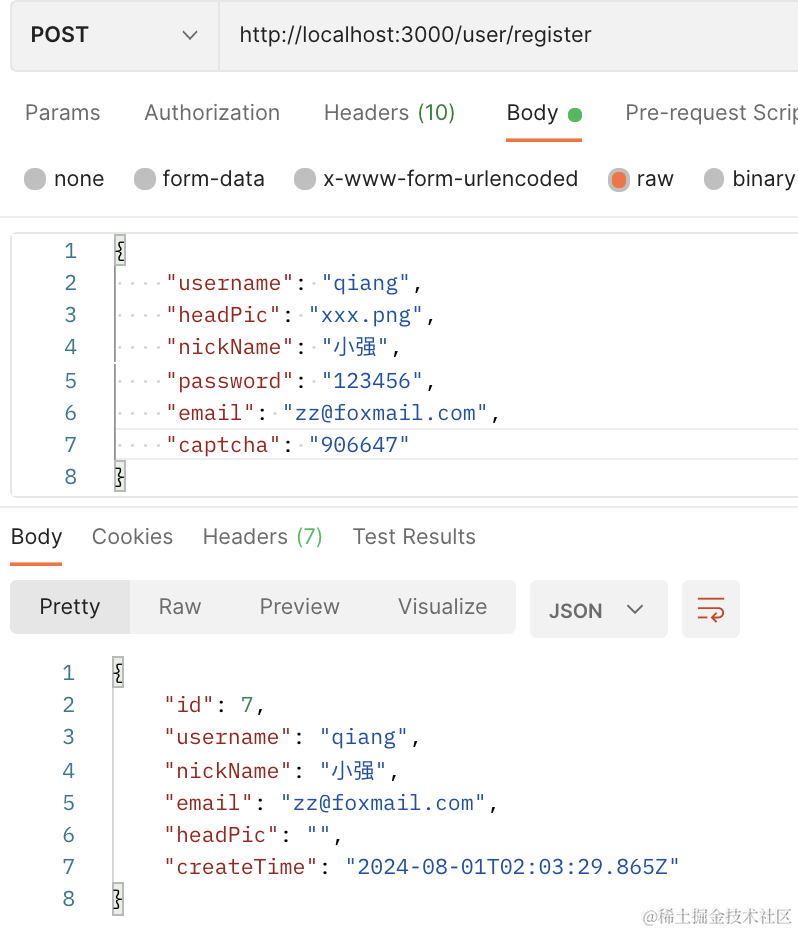

然后让 guang 向 xiaoqiang 发送好友申请：

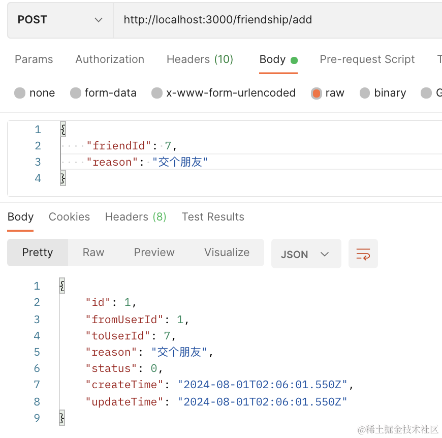

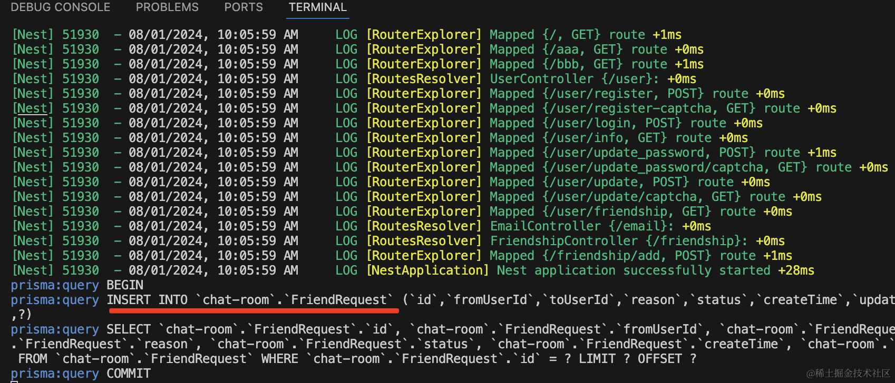

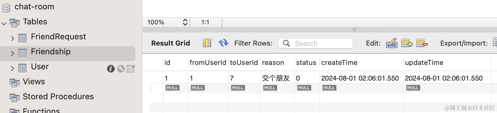

好友请求创建成功。

我们加一个好友请求列表接口：

```javascript
import { Body, Controller, Get, Post } from '@nestjs/common';
import { FriendshipService } from './friendship.service';
import { FriendAddDto } from './dto/friend-add.dto';
import { RequireLogin, UserInfo } from 'src/custom.decorator';

@Controller('friendship')
@RequireLogin()
export class FriendshipController {
  constructor(private readonly friendshipService: FriendshipService) {}

  @Post('add')
  async add(@Body() friendAddDto: FriendAddDto, @UserInfo("userId") userId: number) {
    return this.friendshipService.add(friendAddDto, userId);
  }

  @Get('request_list')
  async list(@UserInfo("userId") userId: number) {
    return this.friendshipService.list(userId);
  }
}
```
这个接口也需要登录，我们把 @RequireLogin 加到 controller 上。

在 FriendshipService 实现这个方法：

```javascript
async list(userId: number) {
    return this.prismaService.friendRequest.findMany({
        where: {
            fromUserId: userId
        }
    })
}
```

测试下：

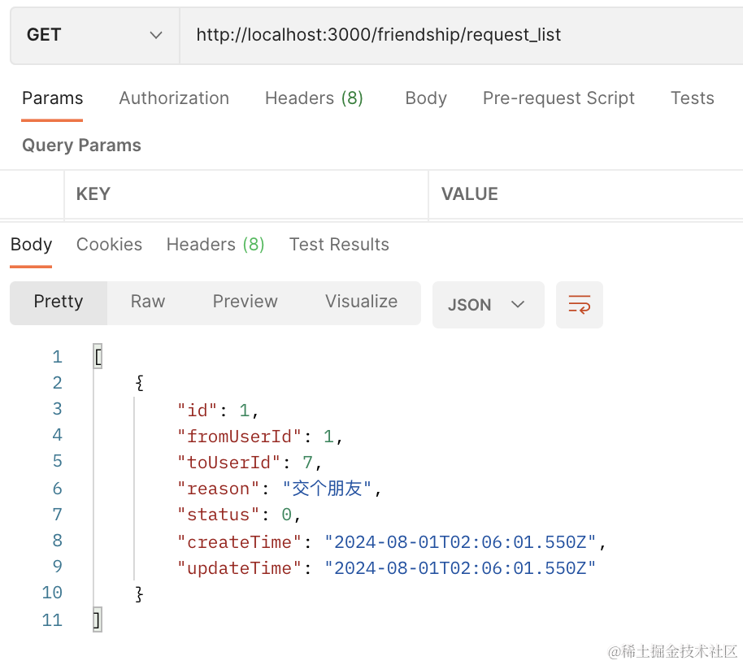

这样就查询出了当前登录用户的所有好友申请。

然后加一下同意申请、拒绝申请的接口：

```javascript
@Get('agree/:id')
async agree(@Param('id') friendId: number, @UserInfo("userId") userId: number) {
    if(!friendId) {
      throw new BadRequestException('添加的好友 id 不能为空');
    }
    return this.friendshipService.agree(friendId, userId);
}

@Get('reject/:id')
async reject(@Param('id') friendId: number, @UserInfo("userId") userId: number) {
    if(!friendId) {
      throw new BadRequestException('添加的好友 id 不能为空');
    }
    return this.friendshipService.reject(friendId, userId);
}
```
在 FriendshipService 里实现下：

```javascript
async agree(friendId: number, userId: number) {
    await this.prismaService.friendRequest.updateMany({
        where: {
            fromUserId: friendId,
            toUserId: userId,
            status: 0
        },
        data: {
            status: 1
        }
    })

    const res = await this.prismaService.friendship.findMany({
        where: {
            userId,
            friendId
        }
    })

    if(!res.length) {
            await this.prismaService.friendship.create({
                data: {
                    userId,
                    friendId
                }
            })
        }
    return '添加成功'
}

async reject(friendId: number, userId: number) {
    await this.prismaService.friendRequest.updateMany({
        where: {
            fromUserId: friendId,
            toUserId: userId,
            status: 0
        },
        data: {
            status: 2
        }
    })
    return '已拒绝'
}
```
同意好友申请之后在 frinedship 好友关系表添加一条记录。

添加之前先查询下，如果已经有好友了，就不用添加了。

测试下：

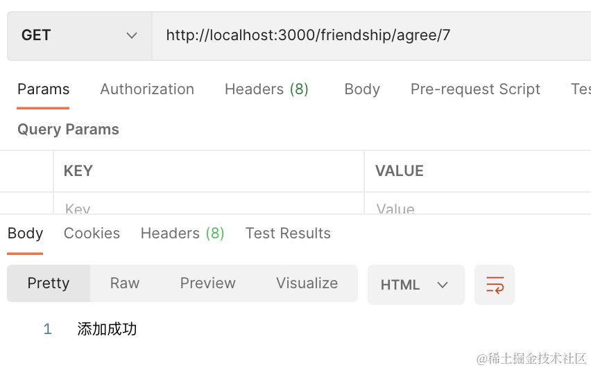

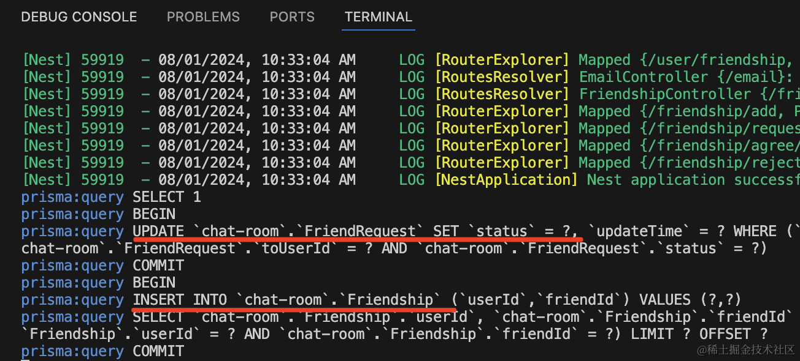

再查询下好友请求列表：

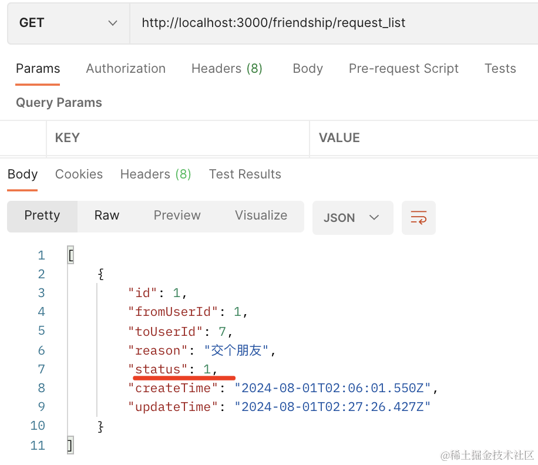

可以看到，好友状态修改了。

然后查询下好友列表：

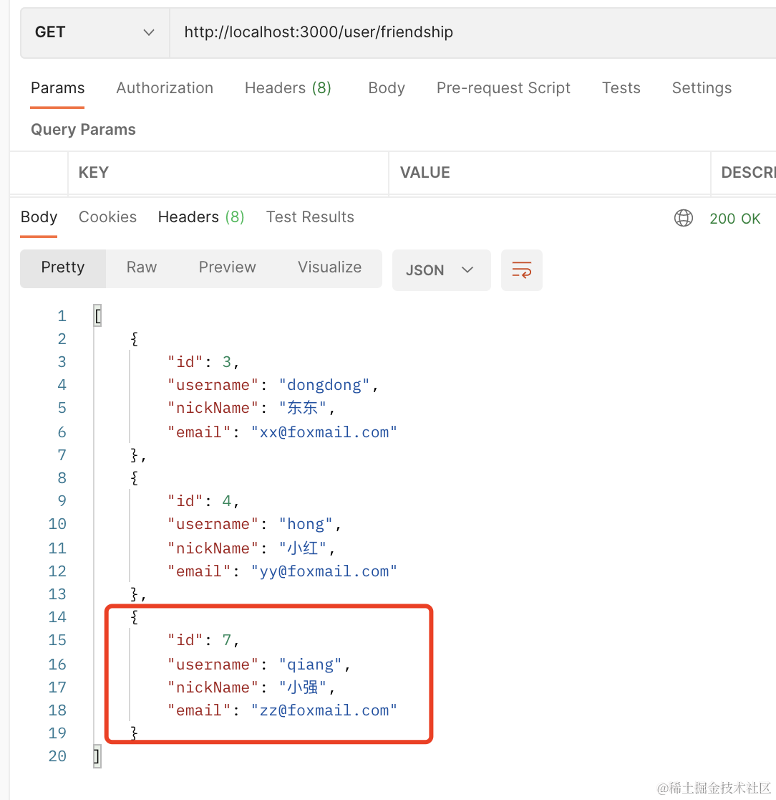

guang 的好友列表多了一个叫小强的好友。

这样，添加好友功能就完成了。

不过这个好友列表接口不应该放在 user 模块，我们把它转移到 friendship 模块：

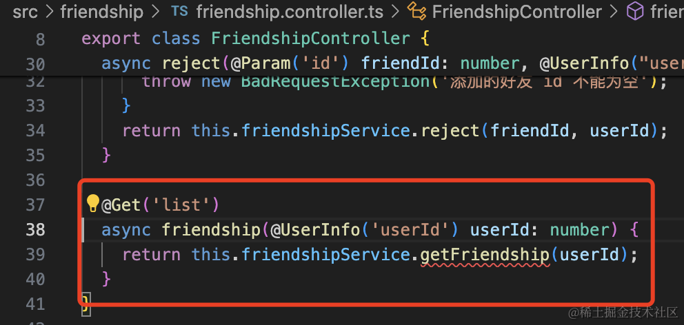

```javascript
@Get('list')
async friendship(@UserInfo('userId') userId: number) {
    return this.friendshipService.getFriendship(userId);
}
```
把之前 userService 的方法移到这里来：

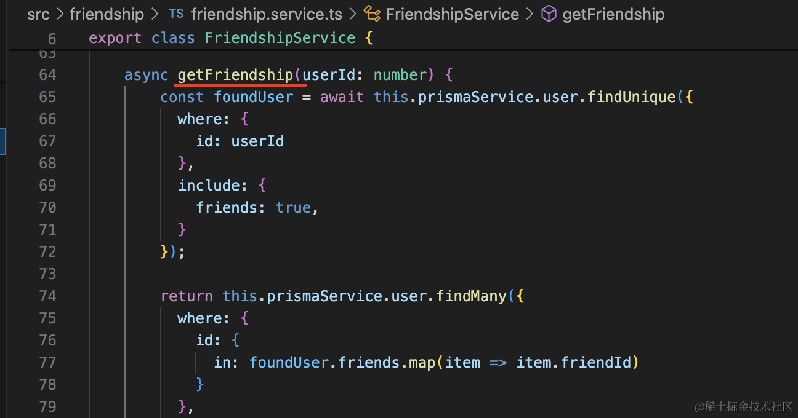

测试下：

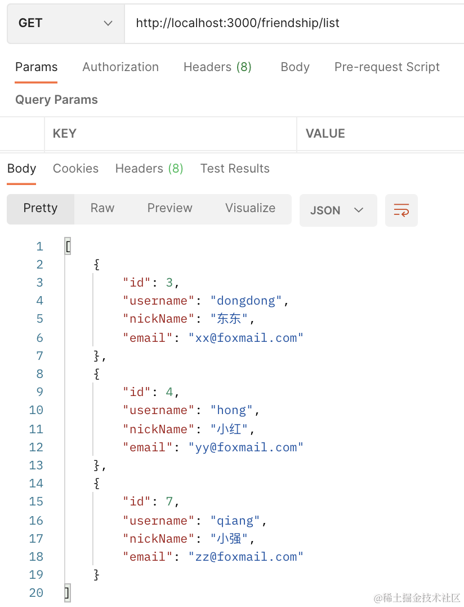

最后再来实现删除好友的功能：

在 FriendshipController 添加一个路由：

```javascript
@Get('remove/:id')
async remove(@Param('id') friendId: number, @UserInfo('userId') userId: number) {
    return this.friendshipService.remove(friendId, userId);
}
```
在 service 实现下具体逻辑：

```javascript
async remove(friendId: number, userId: number) {
    await this.prismaService.friendship.deleteMany({
        where: {
            userId,
            friendId,
        }
    })
    return '删除成功';
}
```
测试下：

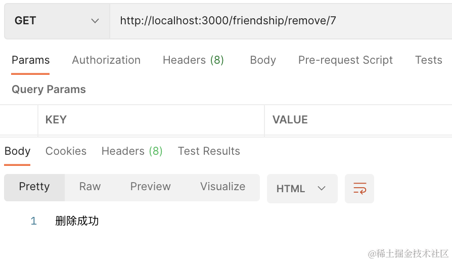

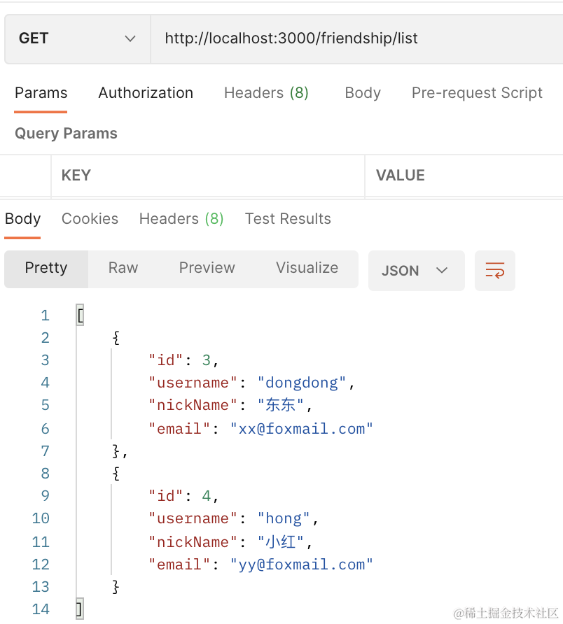

代码在[小册仓库](https://github.com/QuarkGluonPlasma/nestjs-course-code/tree/main/chat-room-backend)。

## 总结

这节我们实现了好友列表和添加好友的功能。

好友关系就是用户和用户的多对多关系，需要一个中间表来保存。

好友列表就是根据当前用户 id 查询它的好友关系。

添加好友需要创建一个好友请求，状态为申请中，同意之后改为已同意，然后添加一条好友关系的记录。

删除好友的话就是删除好友关系表中对应的记录。

这样，好友功能就完成了。
