这节来实现下发送表情、图片、文件。

这种 emoji 表情：

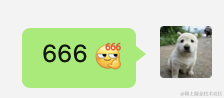

有现成的库 [emoji-mart](https://www.npmjs.com/package/emoji-mart)：

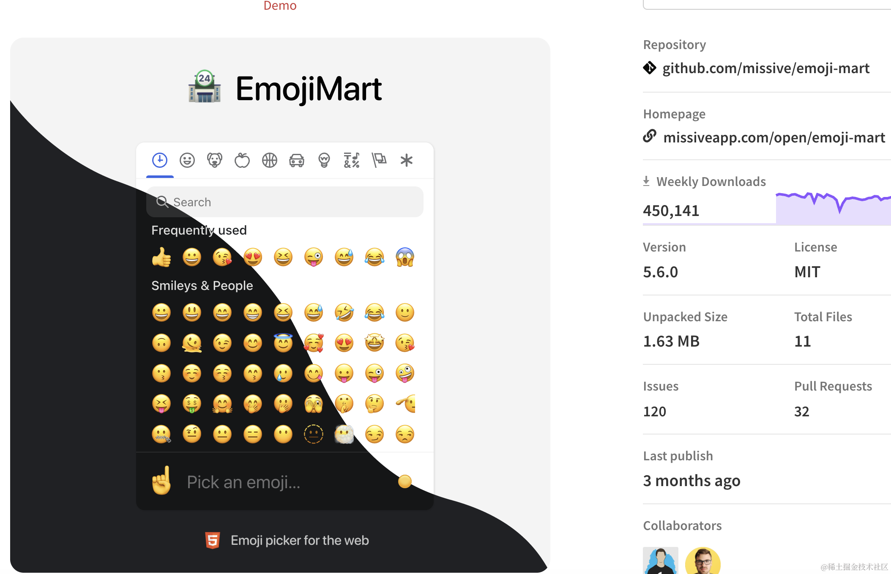

可以试试他的 [demo](https://missiveapp.com/open/emoji-mart)：


我们直接用就行：

安装下：

```
npm install --save @emoji-mart/data @emoji-mart/react
```

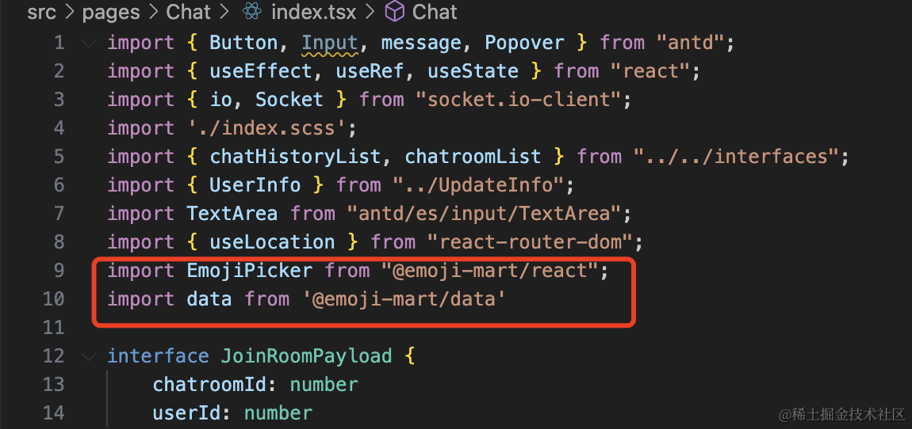

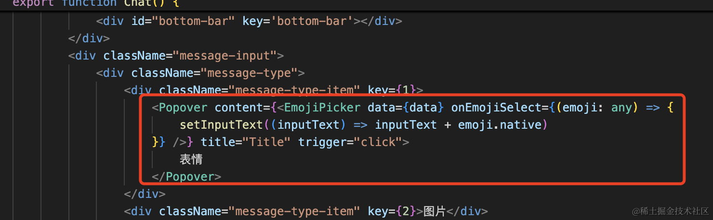

```javascript
<Popover content={<EmojiPicker data={data} onEmojiSelect={(emoji: any) => {
    setInputText((inputText) => inputText + emoji.native)
}} />} title="Title" trigger="click">
    表情
</Popover>
```

这样，就可以发表情了：

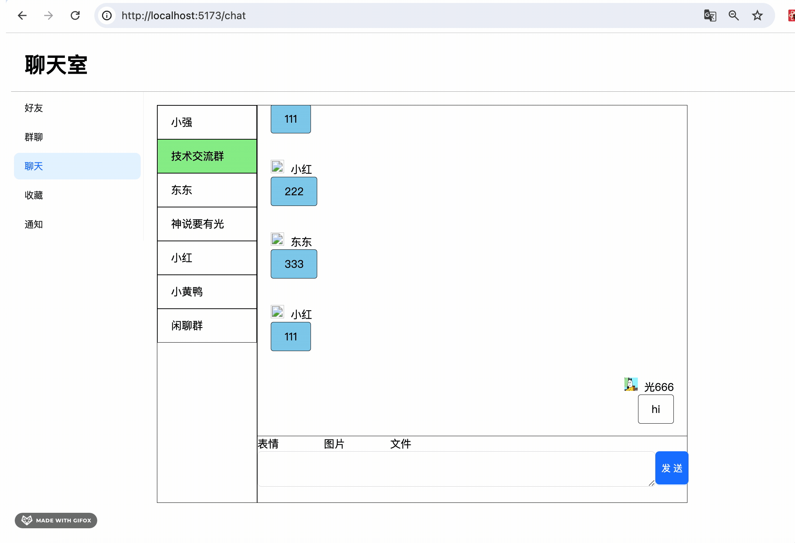

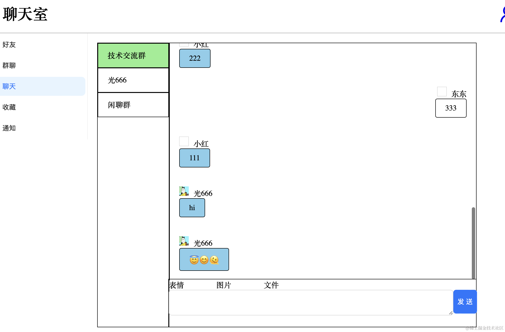

然后来实现发送图片：

这个和之前的上传图片没啥大的区别。

加一个 Modal：

src/pages/Chat/UploadImageModal.tsx

```javascript
import { Modal } from "antd";
import { ImageUpload } from "./ImageUpload";
import { useState } from "react";

interface UploadImageModalProps {
    isOpen: boolean;
    handleClose: (imageSrc?: string) => void
}

export function UploadImageModal(props: UploadImageModalProps) {
    const [imgSrc, setImgSrc] = useState<string>('');

    return <Modal 
        title="上传图片"
        open={props.isOpen}
        onOk={() => {
            props.handleClose(imgSrc)
            setImgSrc('')
        }}
        onCancel={() => props.handleClose()}
        okText={'确认'}
        cancelText={'取消'}    
    >
        <ImageUpload value={imgSrc} onChange={(value: string) => {
            setImgSrc(value)
        }}/>
    </Modal>
}
```
Modal 里只包含上传组件，关闭弹窗的时候把 imgSrc 通过参数返回。

这个上传组件和之前的差不多：

src/pages/Chat/ImageUpload.tsx

```javascript
import { InboxOutlined } from "@ant-design/icons";
import { message } from "antd";
import Dragger, { DraggerProps } from "antd/es/upload/Dragger";
import axios from "axios";
import { presignedUrl } from "../../interfaces";

interface ImageUploadProps {
    value?: string;
    onChange?: Function
}

let onChange: Function;

const props: DraggerProps = {
    name: 'file',
    action: async (file) => {
        const res = await presignedUrl(file.name);
        return res.data;
    },
    async customRequest(options) {
        const { onSuccess, file, action } = options;

        const res = await axios.put(action, file);

        onSuccess!(res.data);
    },
    onChange(info) {
        const { status } = info.file;
        if (status === 'done') {
            onChange('http://localhost:9000/chat-room/' + info.file.name);
            message.success(`${info.file.name} 文件上传成功`);
        } else if (status === 'error') {
            message.error(`${info.file.name} 文件上传失败`);
        }
    }
};

const dragger = <Dragger {...props}>
    <p className="ant-upload-drag-icon">
        <InboxOutlined />
    </p>
    <p className="ant-upload-text">点击或拖拽文件到这个区域来上传</p>
</Dragger>

export function ImageUpload(props: ImageUploadProps) {

    onChange = props.onChange!

    return props?.value ? <div>
        
        {dragger}
    </div>: <div>
        {dragger}
    </div>
}
```
和之前上传头像的逻辑一样。

然后在 Chat 组件里用一下：

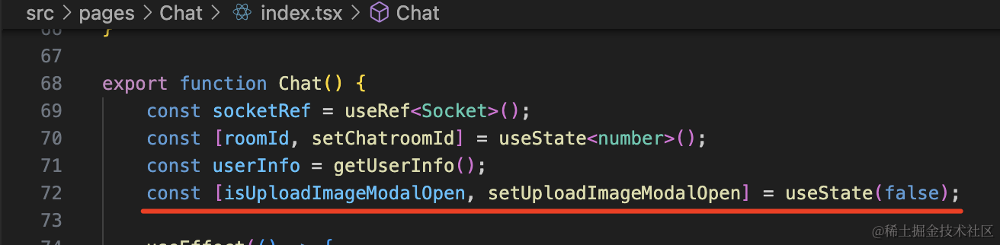

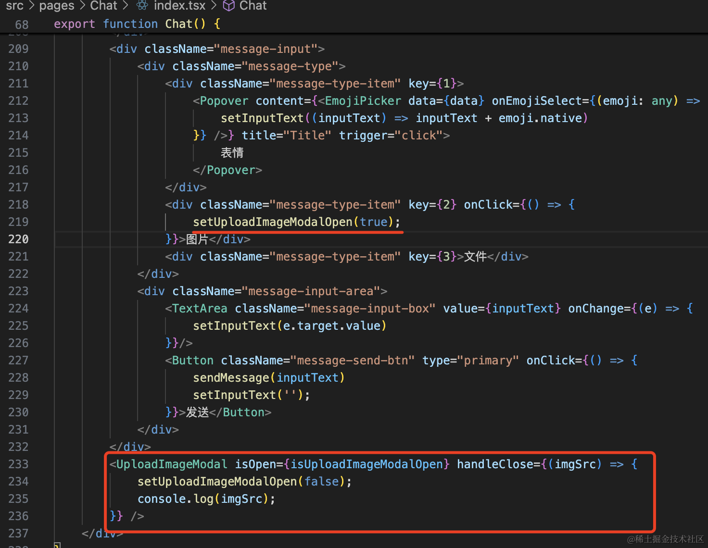

```javascript
const [isUploadImageModalOpen, setUploadImageModalOpen] = useState(false);
```
```javascript
setUploadImageModalOpen(true);
```
```javascript
<UploadImageModal isOpen={isUploadImageModalOpen} handleClose={(imgSrc) => {
    setUploadImageModalOpen(false);
    console.log(imgSrc);
}} />
```
测试下：


上传成功，点击确认按钮，在控制台打印了图片 url。

我们把这个 url 作为消息发送就好了。

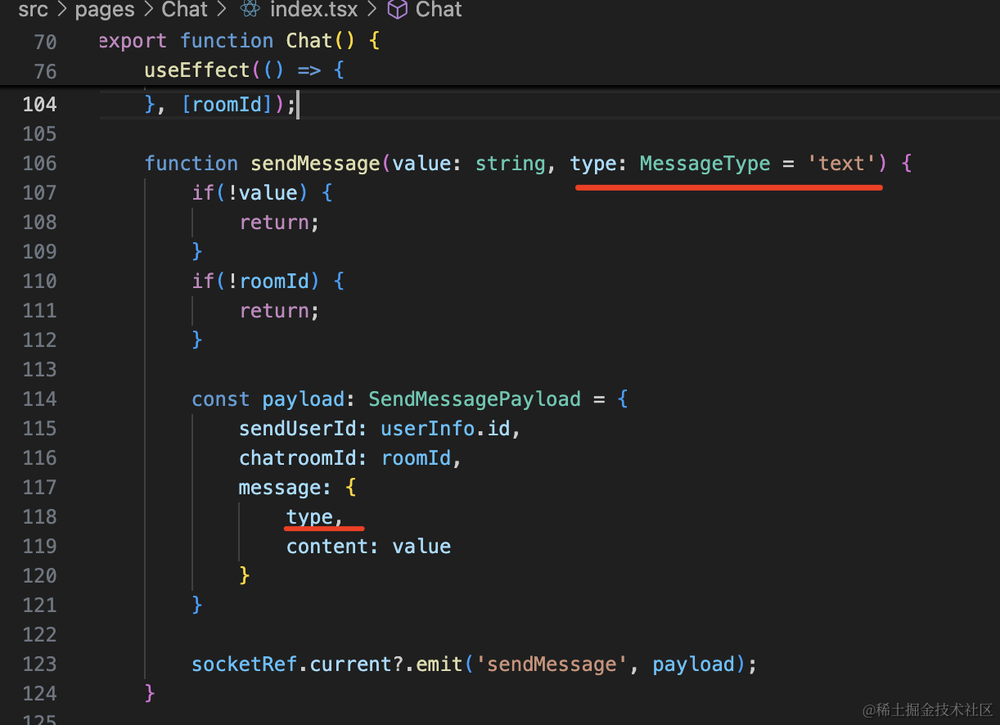

首先在 sendMessage 方法加一个 type 参数，可以指定 image、text、file，默认是 text。

然后上传完图片之后，调用 sendMessage 方法，type 为 image：

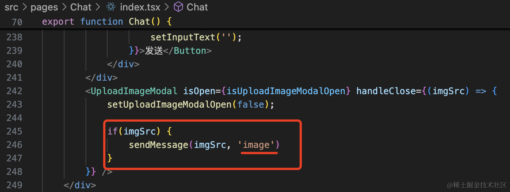

另外，消息展示的时候也要根据类型做下处理：

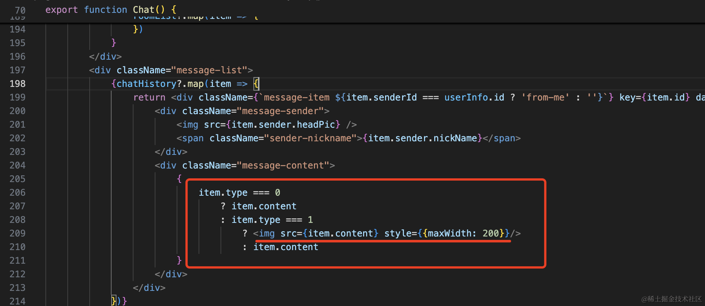

```javascript
import { Button, Input, message, Popover } from "antd";
import { useEffect, useRef, useState } from "react";
import { io, Socket } from "socket.io-client";
import './index.scss';
import { chatHistoryList, chatroomList } from "../../interfaces";
import { UserInfo } from "../UpdateInfo";
import TextArea from "antd/es/input/TextArea";
import { useLocation } from "react-router-dom";
import EmojiPicker from "@emoji-mart/react";
import data from '@emoji-mart/data'
import { UploadImageModal } from "./UploadImageModal";

interface JoinRoomPayload {
    chatroomId: number
    userId: number
}

interface SendMessagePayload {
    sendUserId: number;
    chatroomId: number;
    message: Message
}

type MessageType = 'image' | 'text' | 'file';

interface Message {
    type: MessageType
    content: string
}

type Reply  = {
    type: 'sendMessage'
    userId: number
    message: ChatHistory
} | {
    type: 'joinRoom'
    userId: number
}


interface Chatroom {
    id: number;
    name: string;
    createTime: Date;
}

interface ChatHistory {
    id: number
    content: string
    type: number
    chatroomId: number
    senderId: number
    createTime: Date,
    sender: UserInfo
}

interface User {
    id: number;
    email: string;
    headPic: string;
    nickName: string;
    username: string;
    createTime: Date;
}

export function getUserInfo(): User {
    return JSON.parse(localStorage.getItem('userInfo')!);
}

export function Chat() {
    const socketRef = useRef<Socket>();
    const [roomId, setChatroomId] = useState<number>();
    const userInfo = getUserInfo();
    const [isUploadImageModalOpen, setUploadImageModalOpen] = useState(false);

    useEffect(() => {
        if(!roomId) {
            return;
        }
        const socket = socketRef.current = io('http://localhost:3005');
        socket.on('connect', function() {
    
            const payload: JoinRoomPayload = {
                chatroomId: roomId,
                userId: userInfo.id
            }
    
            socket.emit('joinRoom', payload);
    
            socket.on('message', (reply: Reply) => {
                if(reply.type === 'sendMessage') {
                    setChatHistory((chatHistory) => {
                        return chatHistory ? [...chatHistory, reply.message] : [reply.message]
                    });   
                    setTimeout(() => {
                        document.getElementById('bottom-bar')?.scrollIntoView({block: 'end'});
                    }, 300);
                }
            });
        });
        return () => {
            socket.disconnect();
        }
    }, [roomId]);

    function sendMessage(value: string, type: MessageType = 'text') {
        if(!value) {
            return;
        }
        if(!roomId) {
            return;
        }

        const payload: SendMessagePayload = {
            sendUserId: userInfo.id,
            chatroomId: roomId,
            message: {
                type,
                content: value
            }
        }

        socketRef.current?.emit('sendMessage', payload);
    }

    const [roomList, setRoomList] = useState<Array<Chatroom>>();

    async function queryChatroomList() {
        try{
            const res = await chatroomList();

            if(res.status === 201 || res.status === 200) {
                setRoomList(res.data.map((item: Chatroom) => {
                    return {
                        ...item,
                        key: item.id
                    }
                }));
            }
        } catch(e: any){
            console.log(e);
            message.error(e.response?.data?.message || '系统繁忙，请稍后再试');
        }
    }

    useEffect(() => {
        queryChatroomList();
    }, []);

    useEffect(() => {
        setTimeout(() => {
            document.getElementById('bottom-bar')?.scrollIntoView({block: 'end'});
        }, 300);
    }, [roomId])

    const [chatHistory, setChatHistory] = useState<Array<ChatHistory>>();

    async function queryChatHistoryList(chatroomId: number) {
        try{
            const res = await chatHistoryList(chatroomId);

            if(res.status === 201 || res.status === 200) {
                setChatHistory(res.data.map((item: Chatroom) => {
                    return {
                        ...item,
                        key: item.id
                    }
                }));
            }
        } catch(e: any){
            message.error(e.response?.data?.message || '系统繁忙，请稍后再试');
        }
    }
    const [inputText, setInputText] = useState('');

    const location = useLocation();

    useEffect(() => {
        if(location.state?.chatroomId) {
            setChatroomId(location.state?.chatroomId);

            queryChatHistoryList(location.state?.chatroomId);
        }
    }, [location.state?.chatroomId]);

    return <div id="chat-container">
        <div className="chat-room-list">
            {
                roomList?.map(item => {
                    return <div className={`chat-room-item ${item.id === roomId ? 'selected' : ''}`} key={item.id} data-id={item.id} onClick={() => {
                        queryChatHistoryList(item.id);
                        setChatroomId(item.id);
                    }}>{item.name}</div>
                })
            }
        </div>
        <div className="message-list">
            {chatHistory?.map(item => {
                return <div className={`message-item ${item.senderId === userInfo.id ? 'from-me' : ''}`} key={item.id} data-id={item.id}>
                    <div className="message-sender">
                        
                        <span className="sender-nickname">{item.sender.nickName}</span>
                    </div>
                    <div className="message-content">
                        {
                            item.type === 0 
                                ? item.content 
                                : item.type === 1
                                    ? 
                                    : item.content
                        }
                    </div>
                </div>
            })}
            <div id="bottom-bar" key='bottom-bar'></div>
        </div>
        <div className="message-input">
            <div className="message-type">
                <div className="message-type-item" key={1}>
                    <Popover content={<EmojiPicker data={data} onEmojiSelect={(emoji: any) => {
                        setInputText((inputText) => inputText + emoji.native)
                    }} />} title="Title" trigger="click">
                        表情
                    </Popover>
                </div>
                <div className="message-type-item" key={2} onClick={() => {
                    setUploadImageModalOpen(true);
                }}>图片</div>
                <div className="message-type-item" key={3}>文件</div>
            </div>
            <div className="message-input-area">
                <TextArea className="message-input-box" value={inputText} onChange={(e) => {
                    setInputText(e.target.value)
                }}/>
                <Button className="message-send-btn" type="primary" onClick={() => {
                    sendMessage(inputText)
                    setInputText('');
                }}>发送</Button>
            </div>
        </div>
        <UploadImageModal isOpen={isUploadImageModalOpen} handleClose={(imgSrc) => {
            setUploadImageModalOpen(false);

            if(imgSrc) {
                sendMessage(imgSrc, 'image')
            }
        }} />
    </div>
}
```
测试下：


这样，发送图片功能就完成了。

发送文件其实和这个差不多，只是展示的方式不同。

可以图片上传的逻辑，稍微改造下：

把 ImageUpload 组件改名为 FileUpload 组件，加一个 type 参数：

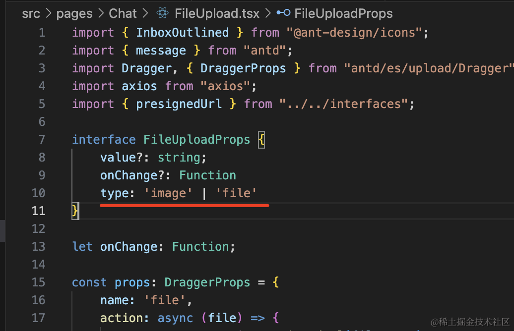

type 为 file 的时候，预览部分直接展示 value：

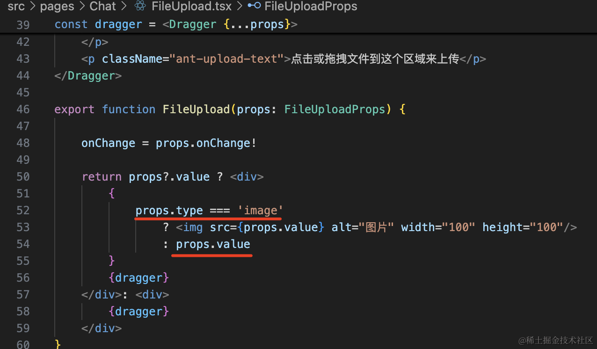

```javascript
import { InboxOutlined } from "@ant-design/icons";
import { message } from "antd";
import Dragger, { DraggerProps } from "antd/es/upload/Dragger";
import axios from "axios";
import { presignedUrl } from "../../interfaces";

interface FileUploadProps {
    value?: string;
    onChange?: Function
    type: 'image' | 'file'
}

let onChange: Function;

const props: DraggerProps = {
    name: 'file',
    action: async (file) => {
        const res = await presignedUrl(file.name);
        return res.data;
    },
    async customRequest(options) {
        const { onSuccess, file, action } = options;

        const res = await axios.put(action, file);

        onSuccess!(res.data);
    },
    onChange(info) {
        const { status } = info.file;
        if (status === 'done') {
            onChange('http://localhost:9000/chat-room/' + info.file.name);
            message.success(`${info.file.name} 文件上传成功`);
        } else if (status === 'error') {
            message.error(`${info.file.name} 文件上传失败`);
        }
    }
};

const dragger = <Dragger {...props}>
    <p className="ant-upload-drag-icon">
        <InboxOutlined />
    </p>
    <p className="ant-upload-text">点击或拖拽文件到这个区域来上传</p>
</Dragger>

export function FileUpload(props: FileUploadProps) {

    onChange = props.onChange!

    return props?.value ? <div>
        {
            props.type === 'image'
                ? 
                : props.value
        }
        {dragger}
    </div>: <div>
        {dragger}
    </div>
}
```
然后 UploadImageModal 改名为 UploadModal

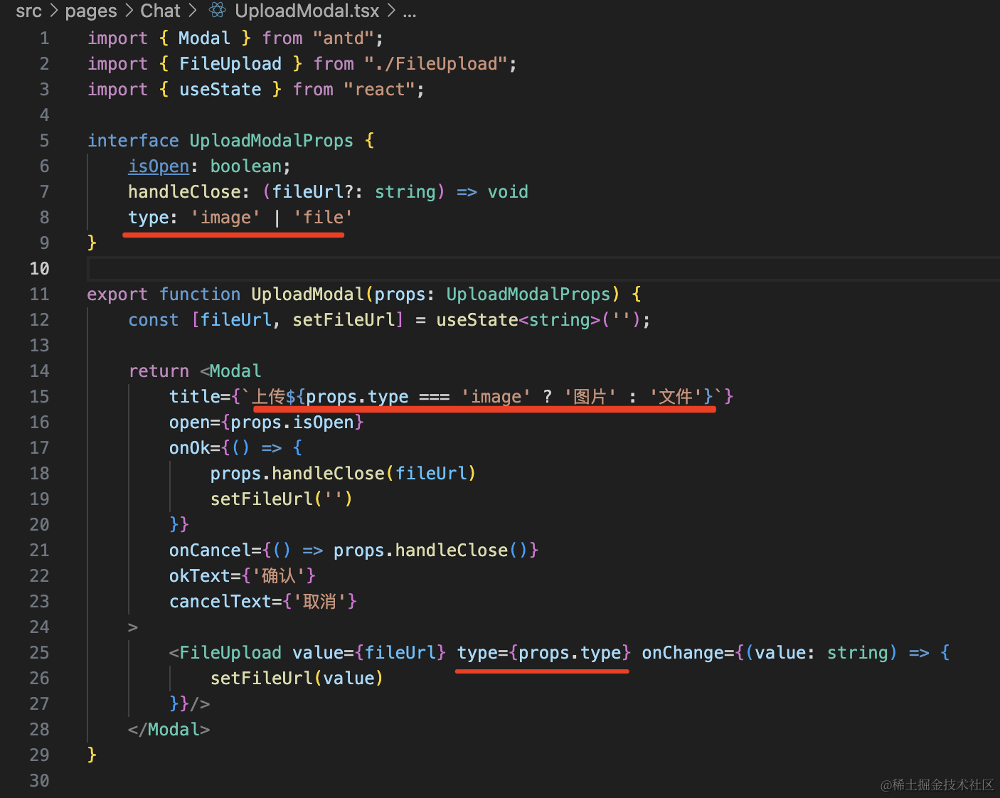

也增加一个 type 参数，展示不同文案。

```javascript
import { Modal } from "antd";
import { FileUpload } from "./FileUpload";
import { useState } from "react";

interface UploadModalProps {
    isOpen: boolean;
    handleClose: (fileUrl?: string) => void
    type: 'image' | 'file'
}

export function UploadModal(props: UploadModalProps) {
    const [fileUrl, setFileUrl] = useState<string>('');

    return <Modal 
        title={`上传${props.type === 'image' ? '图片' : '文件'}`}
        open={props.isOpen}
        onOk={() => {
            props.handleClose(fileUrl)
            setFileUrl('')
        }}
        onCancel={() => props.handleClose()}
        okText={'确认'}
        cancelText={'取消'}    
    >
        <FileUpload value={fileUrl} type={props.type} onChange={(value: string) => {
            setFileUrl(value)
        }}/>
    </Modal>
}
```

最后，在 Chat/index.tsx 里引入修改后的组件：

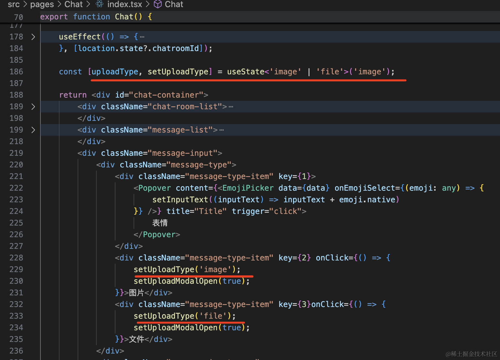

加一个 uploadType 的参数，点击图片、文件按钮会设置不同的 type。

然后发送消息的时候，根据 type 来发：

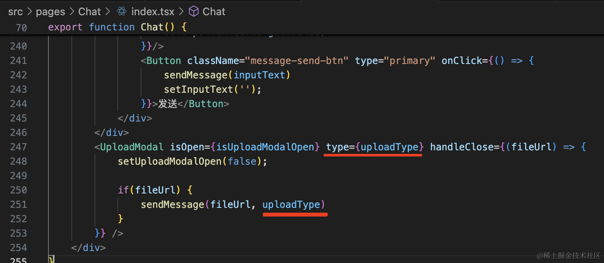

然后改下展示的内容：

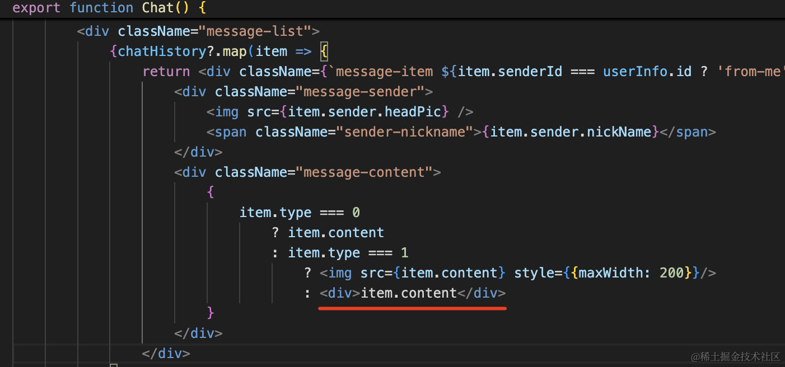

文件就直接展示路径好了。

```javascript
import { Button, Input, message, Popover } from "antd";
import { useEffect, useRef, useState } from "react";
import { io, Socket } from "socket.io-client";
import './index.scss';
import { chatHistoryList, chatroomList } from "../../interfaces";
import { UserInfo } from "../UpdateInfo";
import TextArea from "antd/es/input/TextArea";
import { useLocation } from "react-router-dom";
import EmojiPicker from "@emoji-mart/react";
import data from '@emoji-mart/data'
import { UploadModal } from "./UploadModal";

interface JoinRoomPayload {
    chatroomId: number
    userId: number
}

interface SendMessagePayload {
    sendUserId: number;
    chatroomId: number;
    message: Message
}

type MessageType = 'image' | 'text' | 'file';

interface Message {
    type: MessageType
    content: string
}

type Reply  = {
    type: 'sendMessage'
    userId: number
    message: ChatHistory
} | {
    type: 'joinRoom'
    userId: number
}


interface Chatroom {
    id: number;
    name: string;
    createTime: Date;
}

interface ChatHistory {
    id: number
    content: string
    type: number
    chatroomId: number
    senderId: number
    createTime: Date,
    sender: UserInfo
}

interface User {
    id: number;
    email: string;
    headPic: string;
    nickName: string;
    username: string;
    createTime: Date;
}

export function getUserInfo(): User {
    return JSON.parse(localStorage.getItem('userInfo')!);
}

export function Chat() {
    const socketRef = useRef<Socket>();
    const [roomId, setChatroomId] = useState<number>();
    const userInfo = getUserInfo();
    const [isUploadModalOpen, setUploadModalOpen] = useState(false);

    useEffect(() => {
        if(!roomId) {
            return;
        }
        const socket = socketRef.current = io('http://localhost:3005');
        socket.on('connect', function() {
    
            const payload: JoinRoomPayload = {
                chatroomId: roomId,
                userId: userInfo.id
            }
    
            socket.emit('joinRoom', payload);
    
            socket.on('message', (reply: Reply) => {
                if(reply.type === 'sendMessage') {
                    setChatHistory((chatHistory) => {
                        return chatHistory ? [...chatHistory, reply.message] : [reply.message]
                    });   
                    setTimeout(() => {
                        document.getElementById('bottom-bar')?.scrollIntoView({block: 'end'});
                    }, 300);
                }
            });
        });
        return () => {
            socket.disconnect();
        }
    }, [roomId]);

    function sendMessage(value: string, type: MessageType = 'text') {
        if(!value) {
            return;
        }
        if(!roomId) {
            return;
        }

        const payload: SendMessagePayload = {
            sendUserId: userInfo.id,
            chatroomId: roomId,
            message: {
                type,
                content: value
            }
        }

        socketRef.current?.emit('sendMessage', payload);
    }

    const [roomList, setRoomList] = useState<Array<Chatroom>>();

    async function queryChatroomList() {
        try{
            const res = await chatroomList();

            if(res.status === 201 || res.status === 200) {
                setRoomList(res.data.map((item: Chatroom) => {
                    return {
                        ...item,
                        key: item.id
                    }
                }));
            }
        } catch(e: any){
            console.log(e);
            message.error(e.response?.data?.message || '系统繁忙，请稍后再试');
        }
    }

    useEffect(() => {
        queryChatroomList();
    }, []);

    useEffect(() => {
        setTimeout(() => {
            document.getElementById('bottom-bar')?.scrollIntoView({block: 'end'});
        }, 300);
    }, [roomId])

    const [chatHistory, setChatHistory] = useState<Array<ChatHistory>>();

    async function queryChatHistoryList(chatroomId: number) {
        try{
            const res = await chatHistoryList(chatroomId);

            if(res.status === 201 || res.status === 200) {
                setChatHistory(res.data.map((item: Chatroom) => {
                    return {
                        ...item,
                        key: item.id
                    }
                }));
            }
        } catch(e: any){
            message.error(e.response?.data?.message || '系统繁忙，请稍后再试');
        }
    }
    const [inputText, setInputText] = useState('');

    const location = useLocation();

    useEffect(() => {
        if(location.state?.chatroomId) {
            setChatroomId(location.state?.chatroomId);

            queryChatHistoryList(location.state?.chatroomId);
        }
    }, [location.state?.chatroomId]);

    const [uploadType, setUploadType] = useState<'image' | 'file'>('image'); 

    return <div id="chat-container">
        <div className="chat-room-list">
            {
                roomList?.map(item => {
                    return <div className={`chat-room-item ${item.id === roomId ? 'selected' : ''}`} key={item.id} data-id={item.id} onClick={() => {
                        queryChatHistoryList(item.id);
                        setChatroomId(item.id);
                    }}>{item.name}</div>
                })
            }
        </div>
        <div className="message-list">
            {chatHistory?.map(item => {
                return <div className={`message-item ${item.senderId === userInfo.id ? 'from-me' : ''}`} key={item.id} data-id={item.id}>
                    <div className="message-sender">
                        
                        <span className="sender-nickname">{item.sender.nickName}</span>
                    </div>
                    <div className="message-content">
                        {
                            item.type === 0 
                                ? item.content 
                                : item.type === 1
                                    ? 
                                    : <div>item.content</div>
                        }
                    </div>
                </div>
            })}
            <div id="bottom-bar" key='bottom-bar'></div>
        </div>
        <div className="message-input">
            <div className="message-type">
                <div className="message-type-item" key={1}>
                    <Popover content={<EmojiPicker data={data} onEmojiSelect={(emoji: any) => {
                        setInputText((inputText) => inputText + emoji.native)
                    }} />} title="Title" trigger="click">
                        表情
                    </Popover>
                </div>
                <div className="message-type-item" key={2} onClick={() => {
                    setUploadType('image');
                    setUploadModalOpen(true);
                }}>图片</div>
                <div className="message-type-item" key={3}onClick={() => {
                    setUploadType('file');
                    setUploadModalOpen(true);
                }}>文件</div>
            </div>
            <div className="message-input-area">
                <TextArea className="message-input-box" value={inputText} onChange={(e) => {
                    setInputText(e.target.value)
                }}/>
                <Button className="message-send-btn" type="primary" onClick={() => {
                    sendMessage(inputText)
                    setInputText('');
                }}>发送</Button>
            </div>
        </div>
        <UploadModal isOpen={isUploadModalOpen} type={uploadType} handleClose={(fileUrl) => {
            setUploadModalOpen(false);

            if(fileUrl) {
                sendMessage(fileUrl, uploadType)
            }
        }} />
    </div>
}
```
试下效果：

发送图片：
 
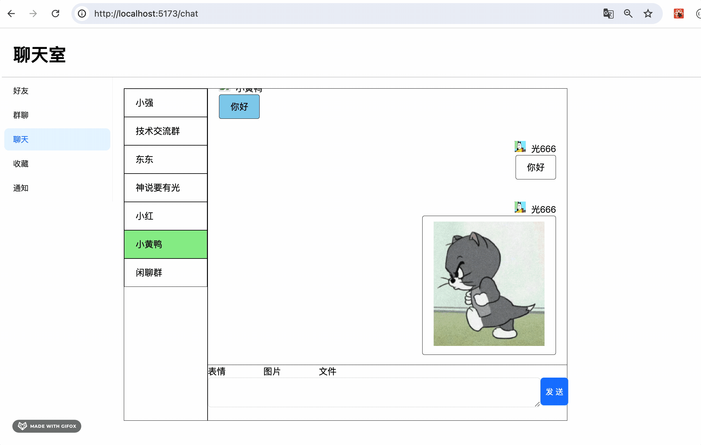

发送文件：


都没问题。

当时我们服务端没支持 file，改一下：

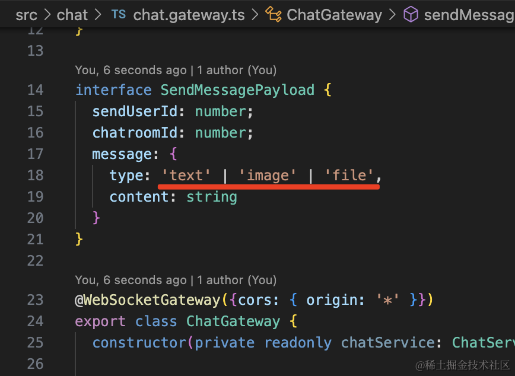

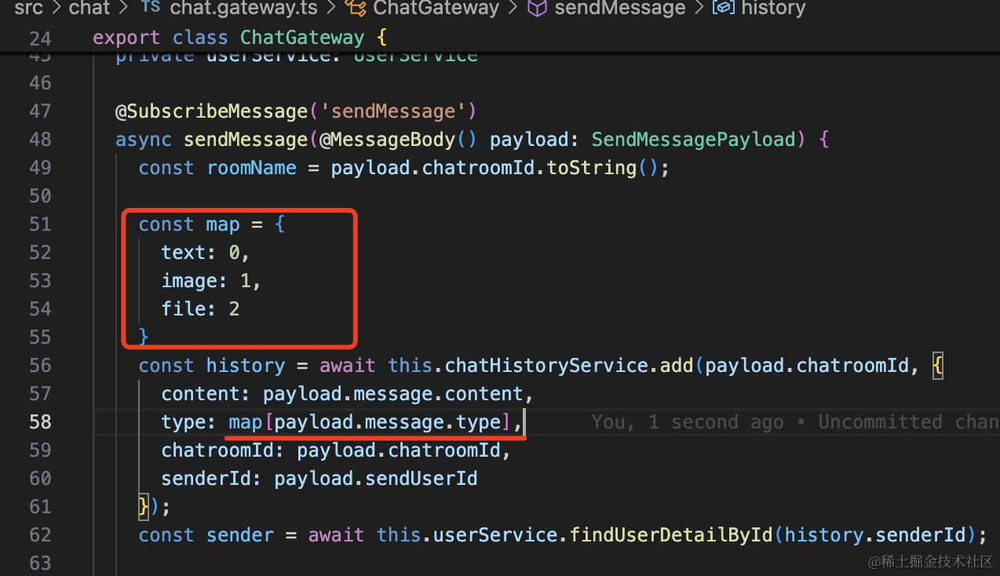

```javascript
const map = {
  text: 0,
  image: 1,
  file: 2
}
const history = await this.chatHistoryService.add(payload.chatroomId, {
  content: payload.message.content,
  type: map[payload.message.type],
  chatroomId: payload.chatroomId,
  senderId: payload.sendUserId
});
```
然后在前端支持下文件下载：

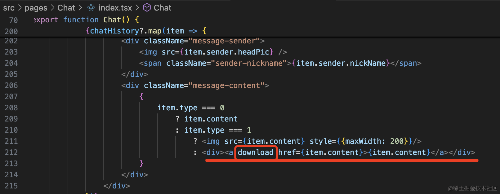

```javascript
<a download href={item.content}>{item.content}</a>
```
现在，就可以发送和下载文件了：


整体测试下：

发送表情：


发送图片：

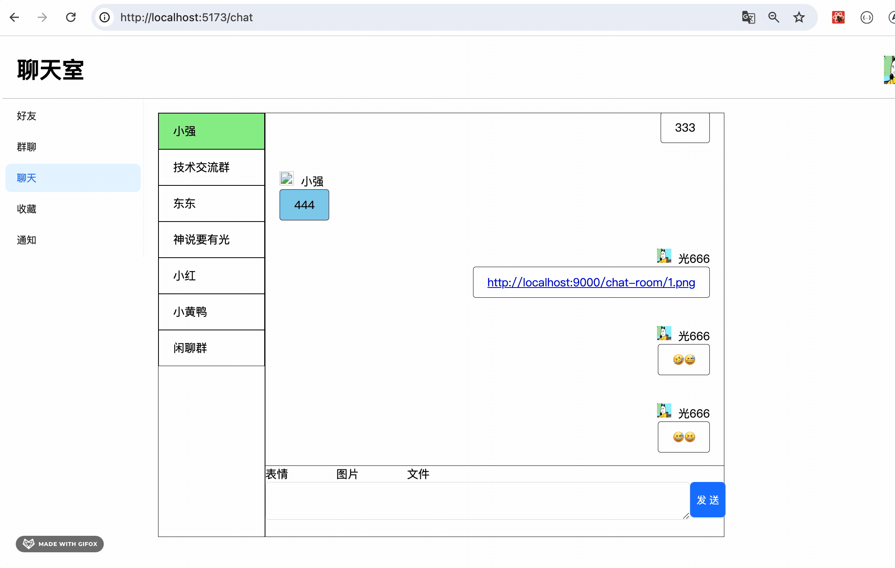

发送文件：


都没问题。

[前端代码](https://github.com/QuarkGluonPlasma/nestjs-course-code/tree/main/chat-room-frontend)

[后端代码](https://github.com/QuarkGluonPlasma/nestjs-course-code/tree/main/chat-room-backend)

## 总结

这节我们实现了发送表情、图片、文件。

表情用 emoji-mart 这个包实现。

图片就是之前的上传图片，只是上传完把 url 作为消息发过去，设置下 type 为 image。

文件也是一样上传，上传完把 url 作为消息发过去，设置 type 为 file。

然后展示 image 和 file 的时候分别作为图片展示，以及支持下载。

这样，发送表情、图片、文件的功能就完成了。
