定时任务，顾名思义就是你可以设定个时间，任务会在设定的时间自动执行。

比如上节我们在 redis 里存取数据，然后通过定时任务在凌晨 4 点刷入数据库。

这节我们就更全面的学下定时任务吧。

新建个 nest 项目：

```
nest new schedule-task
```

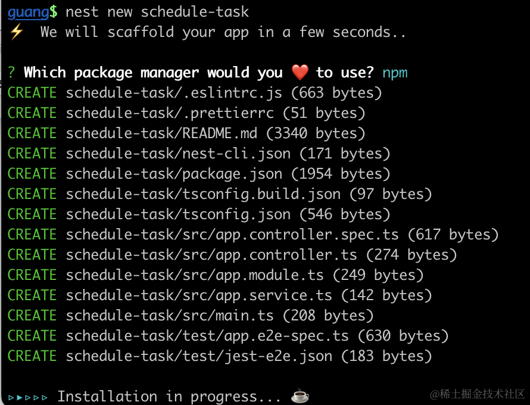

然后安装定时任务的包：

```
npm install --save @nestjs/schedule
```
在 AppModule 里引入：

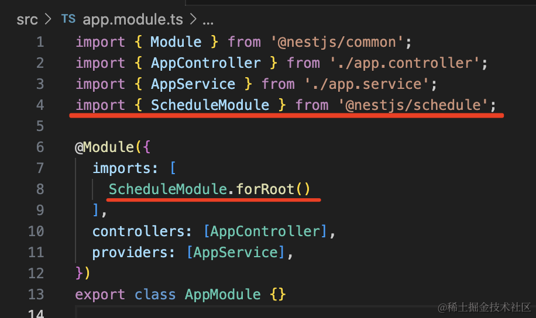

然后就可以创建定时任务了。

我们创建个 service：
```
nest g service task --flat --no-spec
```
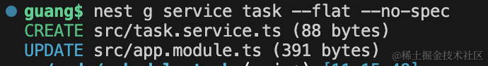

通过 @Cron 声明任务执行时间：

```javascript
import { Injectable, Logger } from '@nestjs/common';
import { Cron, CronExpression } from '@nestjs/schedule';

@Injectable()
export class TaskService {

  @Cron(CronExpression.EVERY_5_SECONDS)
  handleCron() {
    console.log('task execute');
  }
}
```
把服务跑起来试下：

```
npm run start:dev
```
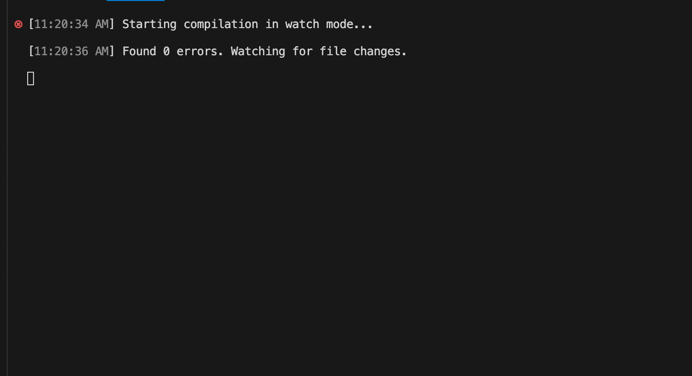

可以看到，任务每 5s 都会执行。

当然，也可以注入其他模块的 service。

我们创建个 aaa 模块：

```
nest g resource aaa
```
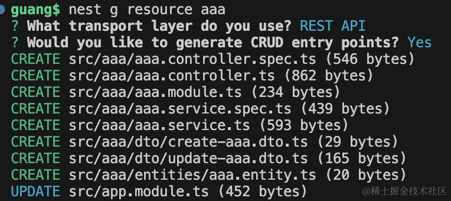

把 AaaService 导出：

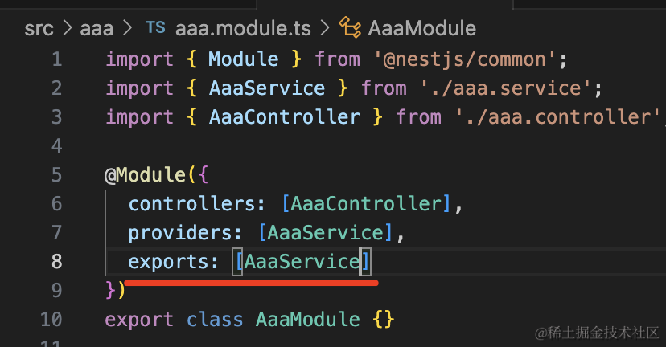

然后在 TaskService 注入：

```javascript
import { Inject, Injectable, Logger } from '@nestjs/common';
import { Cron, CronExpression } from '@nestjs/schedule';
import { AaaService } from './aaa/aaa.service';

@Injectable()
export class TaskService {

  @Inject(AaaService)
  private aaaService: AaaService;

  @Cron(CronExpression.EVERY_5_SECONDS)
  handleCron() {
    console.log('task execute：', this.aaaService.findAll());
  }
}
```
这样就可以定时执行 AaaService 的方法：

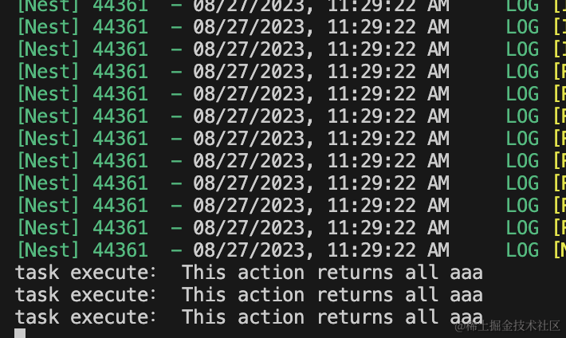

上节我们定时把 redis 数据刷入数据库就是这样做的。

我们设置的每 5s 执行一次，其实是一个 cron 表达式：

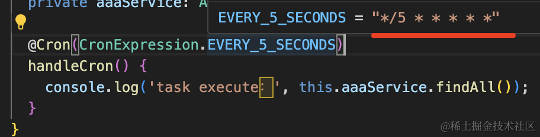

cron 表达式有这 7 个字段：

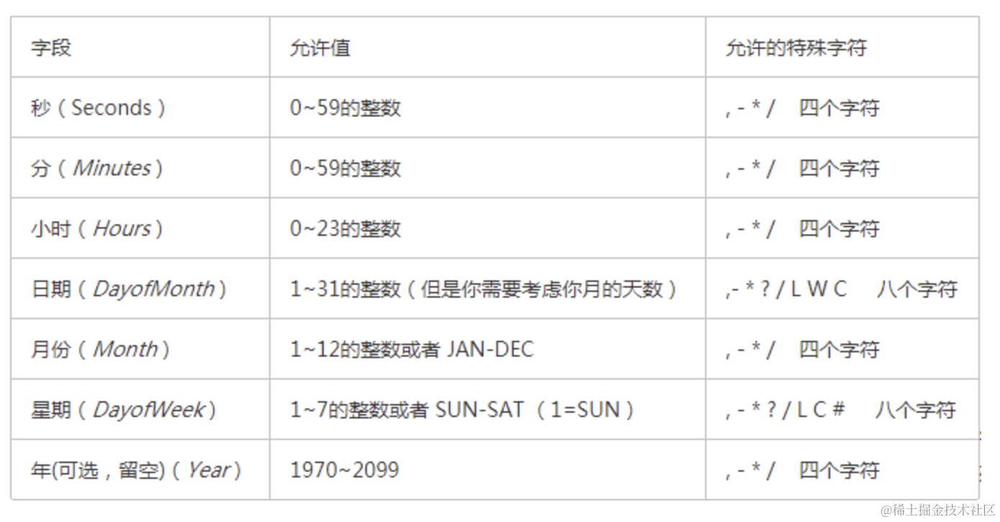

其中年是可选的，所以一般都是 6 个。

每个字段都可以写 * ，比如秒写 * 就代表每秒都会触发，日期写 * 就代表每天都会触发。

但当你指定了具体的日期的时候，星期得写 ？

比如表达式是 

```
7 12 13 10 * ?
```

就是每月 10 号的 13:12:07 执行这个定时任务。

但这时候你不知道是星期几，如果写 * 代表不管哪天都会执行，这时候就要写 ?，代表忽略星期。

同样，你指定了星期的时候，日期也可能和它冲突，这时候也要指定 ?

但只有日期和星期可以指定 ？，因为只有这俩字段是相互影响的。

除了指定一个值外，还可以指定范围，比如分钟指定 20-30，

```
0 20-30 * * * *
```

这个表达式就是从 20 到 30 的每分钟每个第 0 秒都会执行。


当然也可以指定枚举值，通过 , 分隔

比如每小时的第 5 和 第 10 分钟的第 0 秒执行定时任务：

```
0 5,10 * * * *
```
而且还可以通过 / 指定每隔多少时间触发一次。

比如从第 5 分钟开始，每隔 10 分钟触发一次：
```
0 5/10 * * * *
```

此外，日期和星期还支持几个特殊字符：

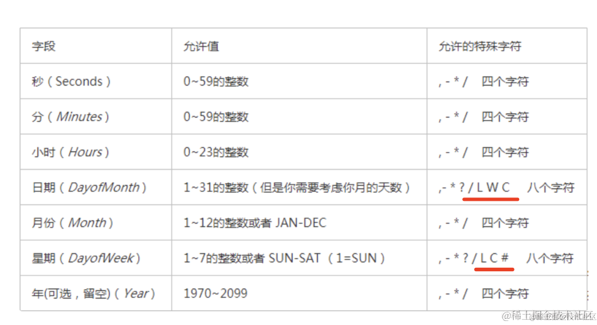

L 是 last，L 用在星期的位置就是星期六：
```
* * * ? * L
```
L 用在日期的位置就是每月最后一天：

```
* * * L * ?
```
W 代表工作日 workday，只能用在日期位置，代表从周一到周五
```
* * * W * ?
```
当你指定 2W 的时候，代表每月的第而个工作日：

```
* * * 2W * ?
```
LW 可以在指定日期时连用，代表每月最后一个工作日：

```
* * * LW * ?
```
星期的位置还可以用 4#3 表示每个月第 3 周的星期三：

```
* * * ? * 4#3
```
同理，每个月的第二周的星期天就是这样：
```
* * * ? * 1#2
```

此外，星期几除了可以用从 1（星期天） 到 7（星期六） 的数字外，还可以用单词的前三个字母：SUN, MON, TUE, WED, THU, FRI, SAT

我们来看几个例子：

每隔 5 秒执行一次:
```
*/5 * * * * ?
```
每天 5-15 点整点触发：
```
0 0 5-15 * * ?  
```
每天 10 点、14 点、16 点触发：
```
0 0 10,14,16 * * ?   
```
每个星期三中午12点：
```
0 0 12 ? * WED
```
每周二、四、六下午五点：
```
0 0 17 ? * TUES,THUR,SAT
```
每月最后一天 22 点执行一次：
```
0 0 22 L * ?
```
2023 年至 2025 年的每月的最后一个星期五上午 9:30 触发
```
0 30 9 ? * 6L 2023-2025 
```
每月的第三个星期五上午 10:15 触发：
```
0 15 10 ? * 6#3 
```
基本就这些语法。

但自己写这样的 cron 表达式还是挺麻烦的，所以 Nest 提供了一些常量可以直接用：

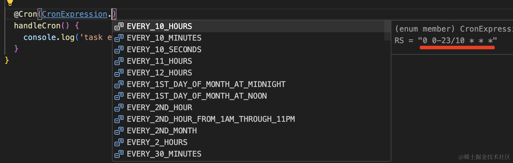

这个 @Cron 装饰器还有第二个参数，可以指定定时任务的名字，还有时区：

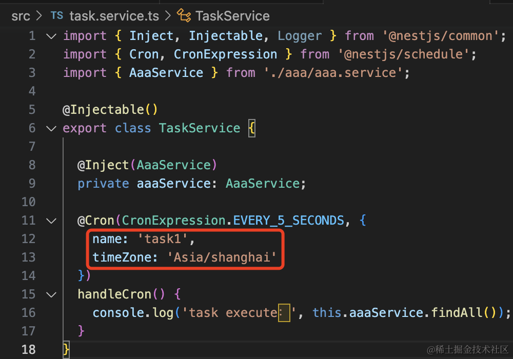

时区的名字可以在[这里](https://momentjs.com/timezone/)查：


除了 @Cron 之外，你还可以用 @Interval 指定任务的执行间隔，参数是毫秒值：

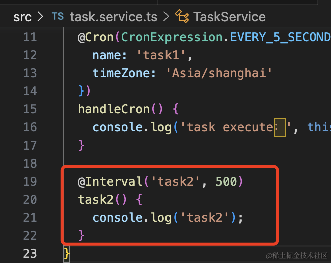

```javascript
@Interval('task2', 500)
task2() {
    console.log('task2');
}
```


还可以用 @Timeout 指定多长时间后执行一次：

```javascript
@Timeout('task3', 3000)
task3() {
    console.log('task3');
}
```
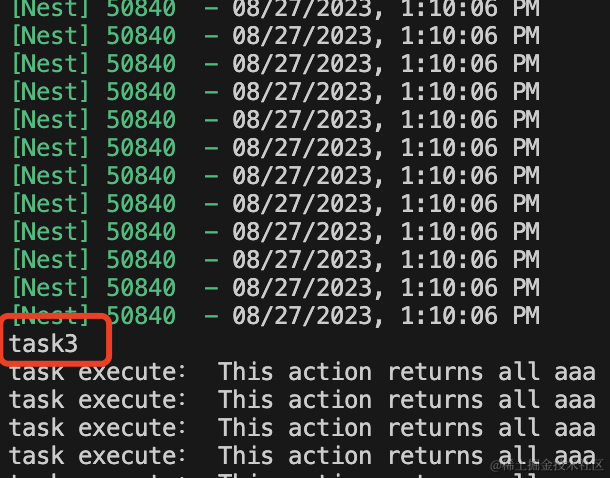

综上，我们可以通过 @Cron、@Interval、@Timeout 创建 3 种定时任务。

我们知道了怎么声明定时任务，那能不能管理定时任务，也就是对它做增删改呢？

当然是可以的。

我们在 AppModule 里注入 SchedulerRegistry，然后在 onApplicationBootstrap 的声明周期里拿到所有的 cronJobs 打印下：

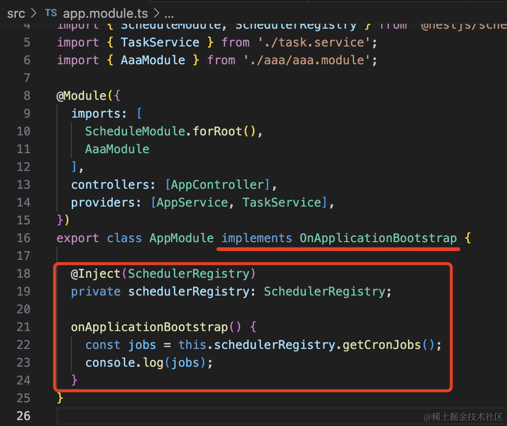

```javascript
@Inject(SchedulerRegistry)
private schedulerRegistry: SchedulerRegistry;

onApplicationBootstrap() {
    const jobs = this.schedulerRegistry.getCronJobs();
    console.log(jobs);
}
```
可以看到，拿到了我们声明的 task1 的定时任务：

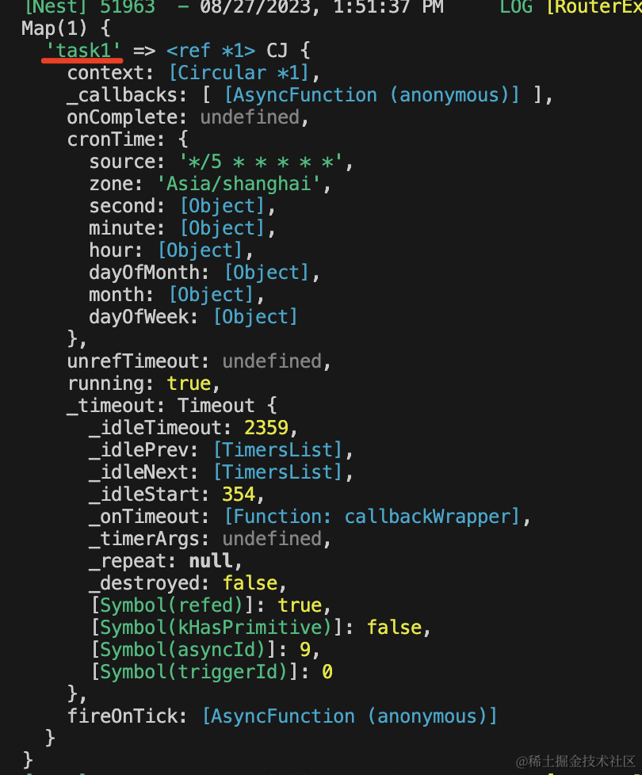

这样看不方便，我们加一下调试配置：

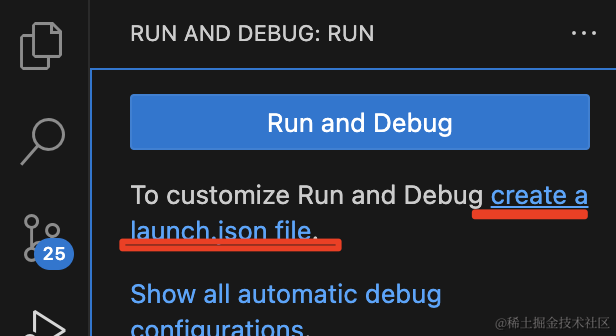

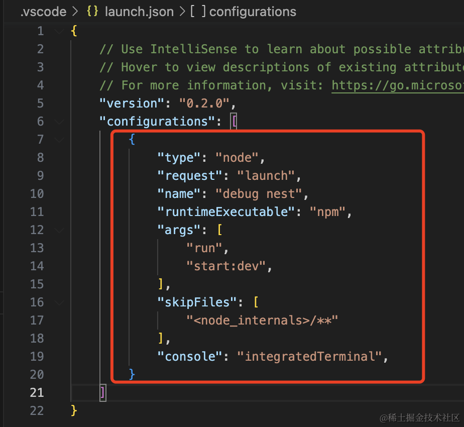
```json
{
    "type": "node",
    "request": "launch",
    "name": "debug nest",
    "runtimeExecutable": "npm",
    "args": [
        "run",
        "start:dev",
    ],
    "skipFiles": [
        "<node_internals>/**"
    ],
    "console": "integratedTerminal",
}
```
打个断点：

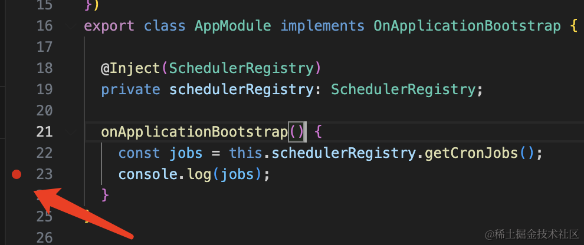

把之前的服务停掉，点击 debug 启动：

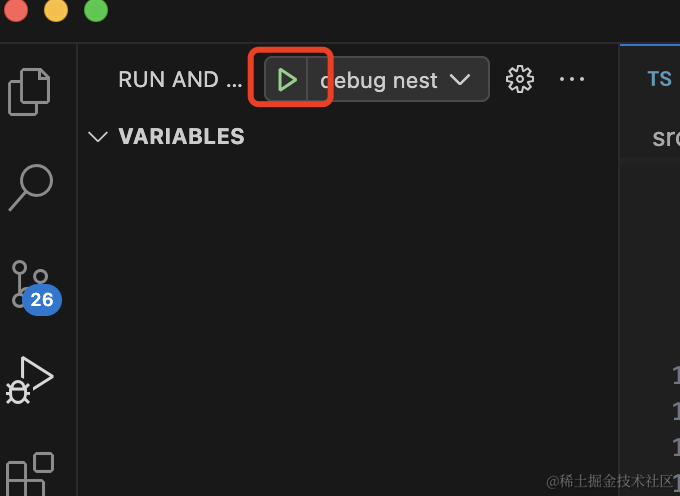

代码会在断点处断住：

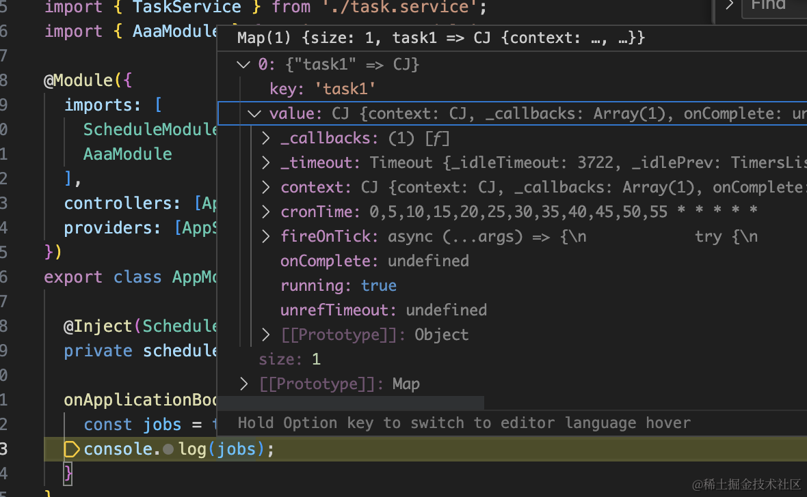

这样就方便多了。

切换到 debug console 就可以动态执行表达式：

比如拿到所有的 interval 定时任务的名字：

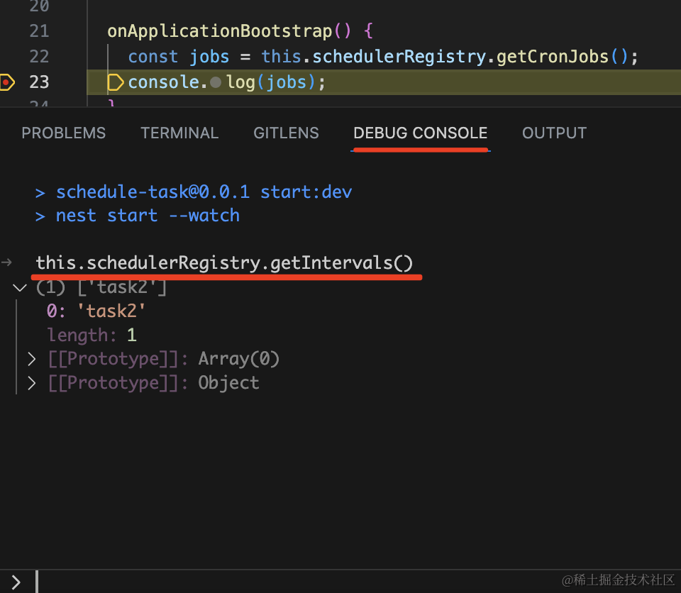

再根据名字拿到具体的 interval 定时任务：

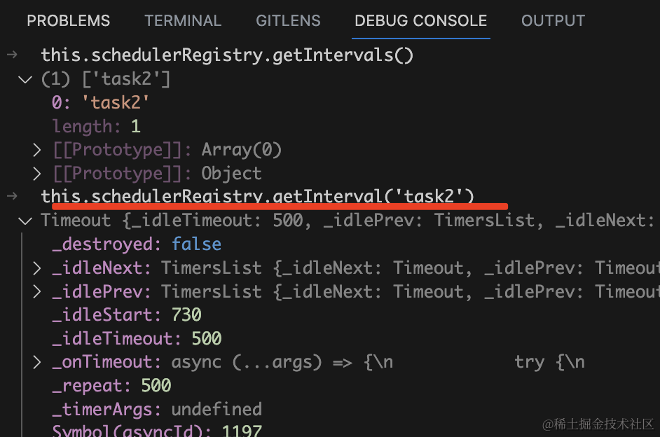

```javascript
this.schedulerRegistry.getIntervals()

this.schedulerRegistry.getInterval('task2')
```
timeout 和 cron 类型的定时任务也是同理：

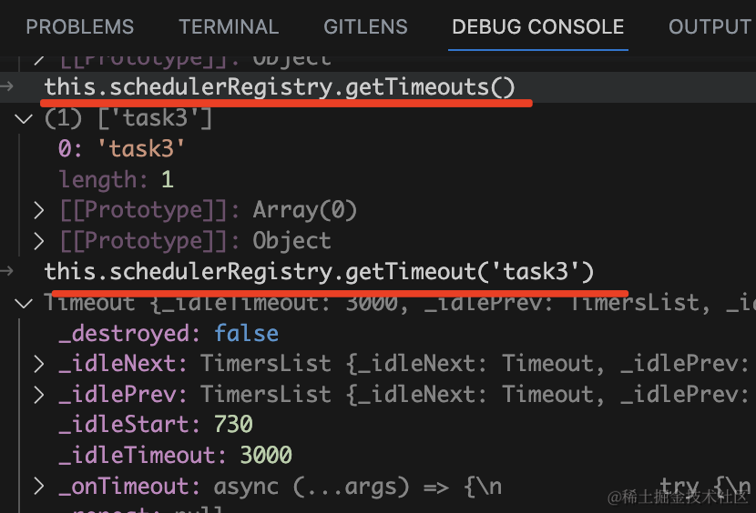
```javascript
this.schedulerRegistry.getTimeouts();

this.schedulerRegistry.getTimeout('task3')
```
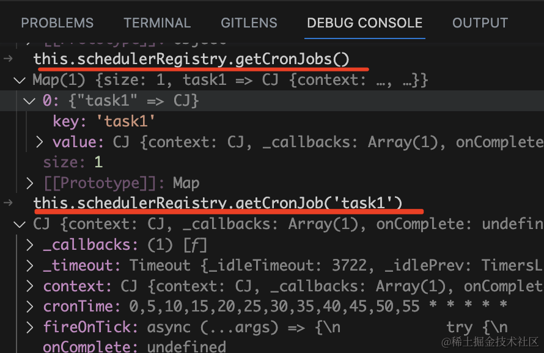

```javascript
this.schedulerRegistry.getCronJobs()

this.schedulerRegistry.getCronJob('task1')
```
当然，它还有增加和删除定时任务的 api：

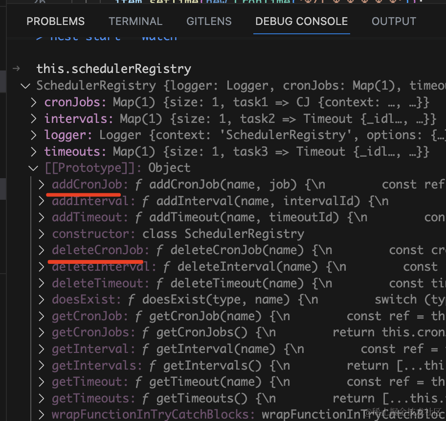

我们来写个具体的案例：

把声明的 3 个 task 删掉，再动态添加 3 个：

自己创建定时任务，需要安装 cron 的包：

```
npm install --save cron
```
然后实现下删除定时任务的逻辑：

```javascript
onApplicationBootstrap() {
    const crons = this.schedulerRegistry.getCronJobs();
    
    crons.forEach((item, key) => {
      item.stop();
      this.schedulerRegistry.deleteCronJob(key);
    });

    const intervals = this.schedulerRegistry.getIntervals();
    intervals.forEach(item => {
      const interval = this.schedulerRegistry.getInterval(item);
      clearInterval(interval);

      this.schedulerRegistry.deleteInterval(item);
    });

    const timeouts = this.schedulerRegistry.getTimeouts();
    timeouts.forEach(item => {
      const timeout = this.schedulerRegistry.getTimeout(item);
      clearTimeout(timeout);

      this.schedulerRegistry.deleteTimeout(item);
    });

    console.log(this.schedulerRegistry.getCronJobs());
    console.log(this.schedulerRegistry.getIntervals());
    console.log(this.schedulerRegistry.getTimeouts());
  }
```
为什么停掉 CronJob 用 job.stop 而停掉 timeout 和 interval 用 clearTimeout 和 clearInterval 呢？

因为 timeout 和 interval 本来就是基于 setTimeout、setInterval 的原生 api 封装出来的啊！

而 CronJob 则是基于 cron 包。

跑起来试下：

```
npm run start:dev
```
确实没有定时任务执行了：

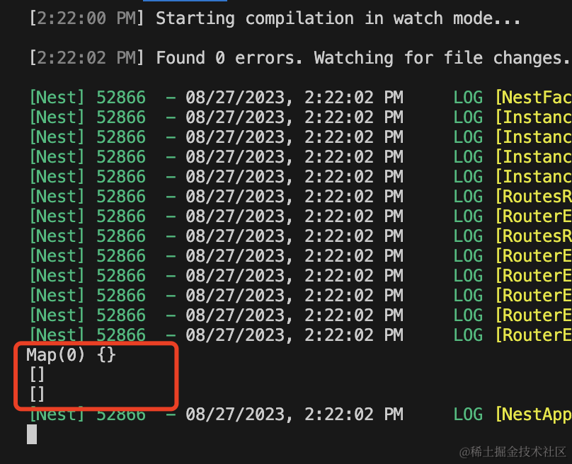

当然，还可以动态添加定时任务：

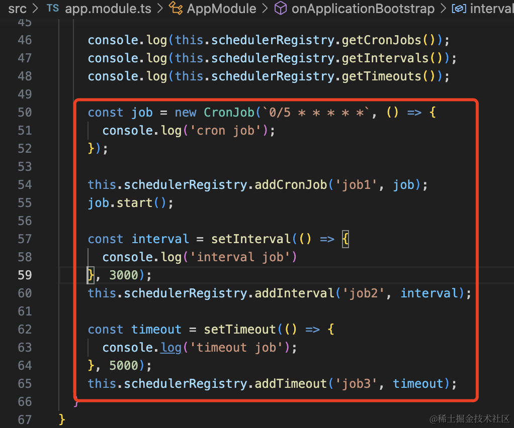

```javascript
const job = new CronJob(`0/5 * * * * *`, () => {
  console.log('cron job');
});

this.schedulerRegistry.addCronJob('job1', job);
job.start();

const interval = setInterval(() => {
  console.log('interval job')
}, 3000);
this.schedulerRegistry.addInterval('job2', interval);

const timeout = setTimeout(() => {
  console.log('timeout job');
}, 5000);
this.schedulerRegistry.addTimeout('job3', timeout);
```
这里也可以看出来 CronJob 是基于 cron 包封装的，而 interval 和 timeout 就是用的原生 api。

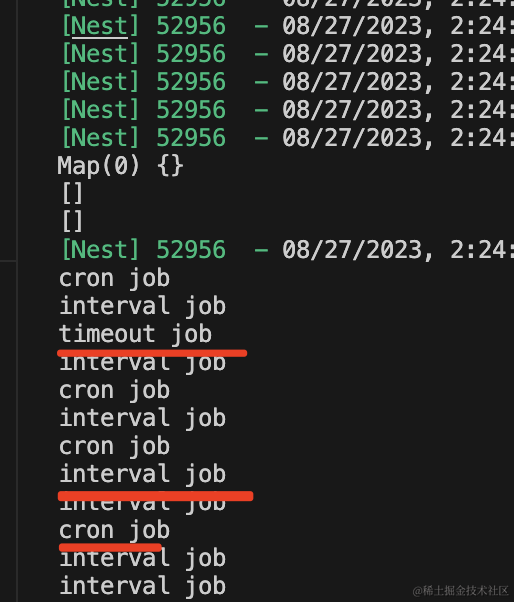

跑起来可以看到，定时任务确实都添加成功了。

也就是说，我们可以注入 SchedulerRegistry 来动态增删定时任务。

案例代码上传了[小册仓库](https://github.com/QuarkGluonPlasma/nestjs-course-code/tree/main/schedule-task)。

## 总结

这节我们学习了定时任务，用到 @nestjs/scheduler 这个包。

主要有 cron、timeout、interval 这  3 种任务。

其中 cron 是依赖 cron 包实现的，而后两种则是对原生 api 的封装。

我们学习了 cron 表达式，还是挺复杂的，当然，你也可以直接用 CronExpression 的一些常量。

此外，你还可以注入 SchedulerRegistery 来对定时任务做增删改查。

定时任务里可以注入 service，来定时执行一些逻辑，在特定业务场景下是很有用的。

