后端应用中会有很多业务模块，这些业务模块之间会有互相调用的关系。

但是把一个业务模块作为依赖注入的别的业务模块也不大好。

比如下单送优惠券的活动，订单模块在订单完成后调用优惠券模块下发优惠券。

这种如果直接把优惠券模块注入到订单模块里就不大好，因为是两个独立的业务模块。

有没有别的通信方式呢？

有，比如通过 event emitter 通信。

我们试一下：

```
nest new event-emitter-test
```

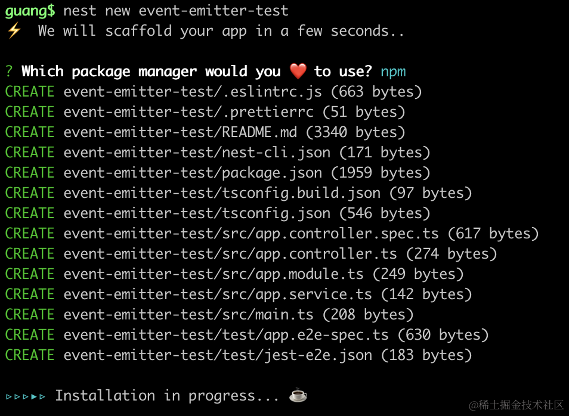

安装用到的包：

```
npm i --save @nestjs/event-emitter
```
在 AppModule 引入下 EventEmitterModule：

```javascript
import { Module } from '@nestjs/common';
import { AppController } from './app.controller';
import { AppService } from './app.service';
import { EventEmitterModule } from '@nestjs/event-emitter';

@Module({
  imports: [
    EventEmitterModule.forRoot(),
  ],
  controllers: [AppController],
  providers: [AppService],
})
export class AppModule {}
```

然后创建两个 module：

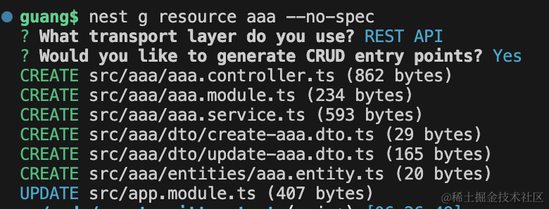

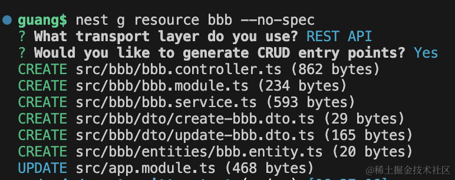

把服务跑起来：

```
npm run start:dev
```

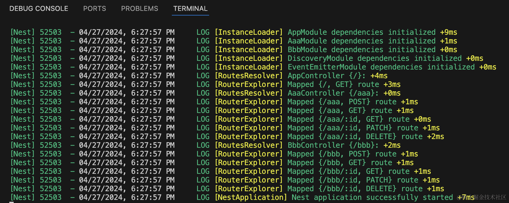

访问下 aaa 和 bbb 的接口：

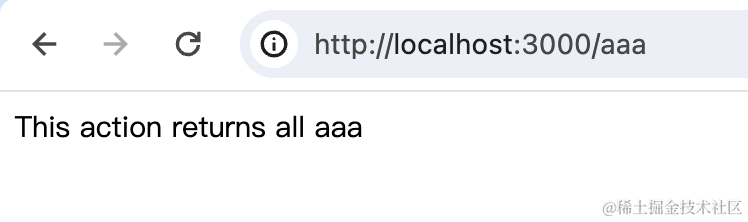

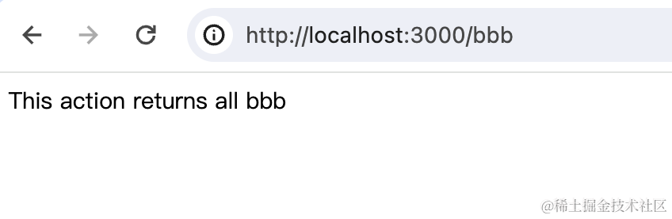

没啥问题。

然后我们想在 aaa 模块的查询触发的时候，调用 bbb 模块记录一条日志呢？

这时候就可以用 Event Emitter 来做。

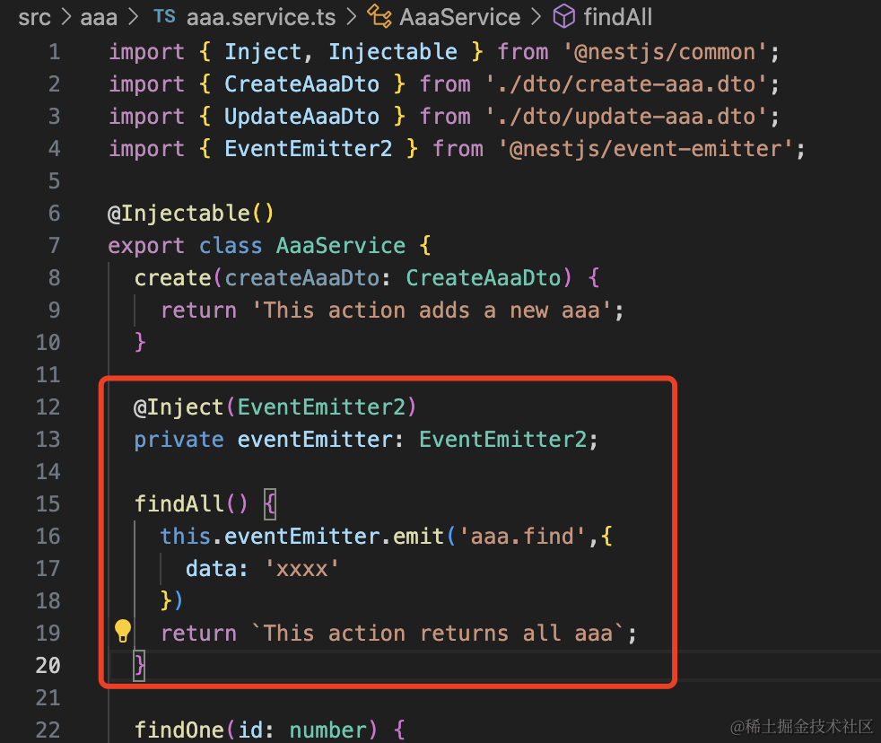

```javascript
@Inject(EventEmitter2)
private eventEmitter: EventEmitter2;

findAll() {
    this.eventEmitter.emit('aaa.find',{
      data: 'xxxx'
    })
    return `This action returns all aaa`;
}
```
在 AaaService 里注入 EventEmitter2，然后调用它的 emit 方法发送一个事件。

然后在 BbbService 里监听下：

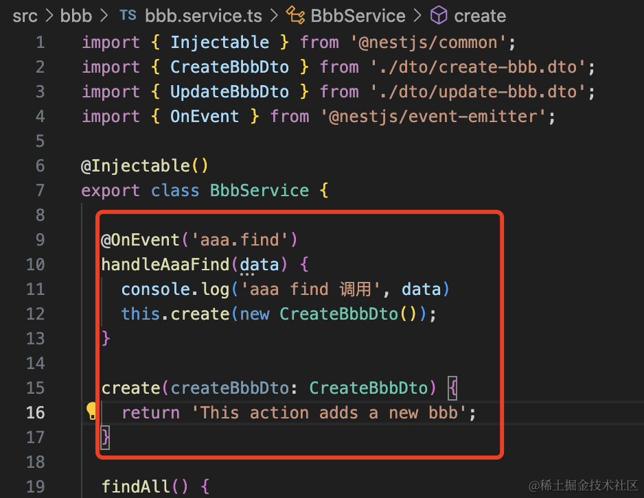

```javascript
@OnEvent('aaa.find')
handleAaaFind(data) {
    console.log('aaa find 调用', data)
    this.create(new CreateBbbDto());
}
```
试一下：

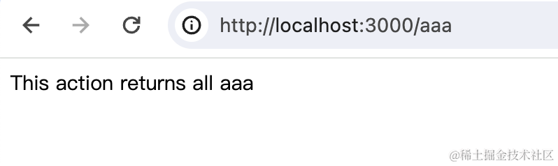

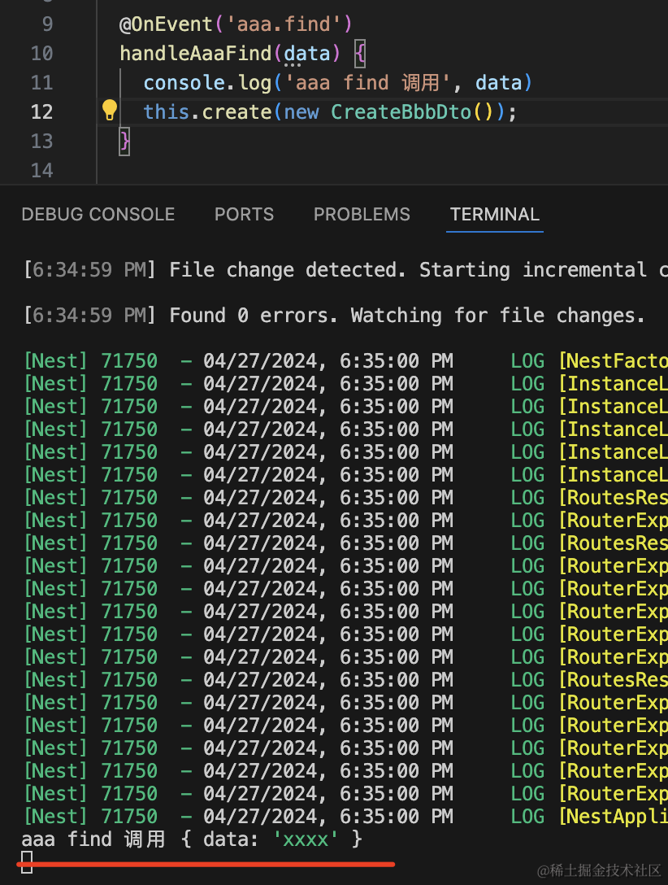

可以看到 AaaService 的 findAll 调用的时候，自动触发了 BbbService 里的方法调用。

是不是很方便？

如果你没感觉出来，那想一下不通过事件怎么做呢？

是不是需要在 BbbModule 里把 BbbService 放到 exports 里声明，然后在 AaaModule 里引入之后 BbbModule 之后，注入它的 BbbService 来用呢？

或者通过全局模块，把 BbbModule 通过 @Global 声明为全局模块，然后在 AaaService 里注入 BbbService 来调用呢？

不管哪种都很麻烦。

而通过事件的方式就简单太多了。

此外，EventEmitterModule 还支持一些配置：

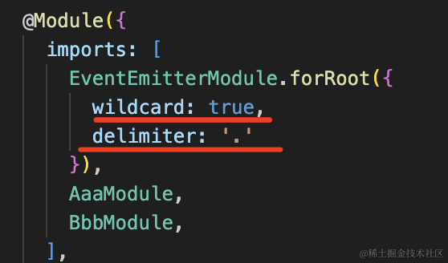

wildcard 是允许通配符 *。

delimiter 是 namespace 和事件名的分隔符。

配置之后就可以这样用了：

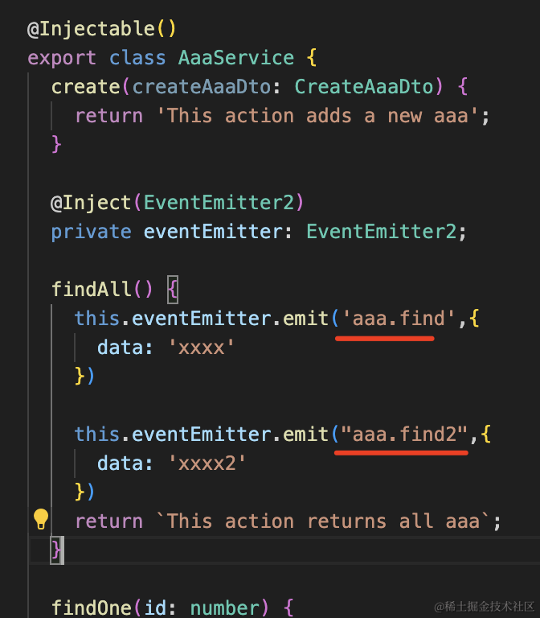

```javascript
findAll() {
    this.eventEmitter.emit('aaa.find',{
      data: 'xxxx'
    })

    this.eventEmitter.emit('aaa.find2',{
      data: 'xxxx2'
    })
    return `This action returns all aaa`;
}
```

BbbService 里可以用 aaa.* 通配符匹配：

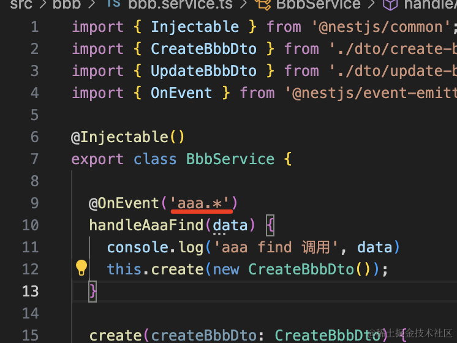

测试下：

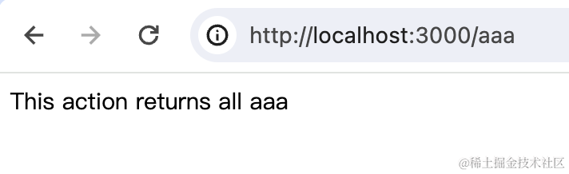

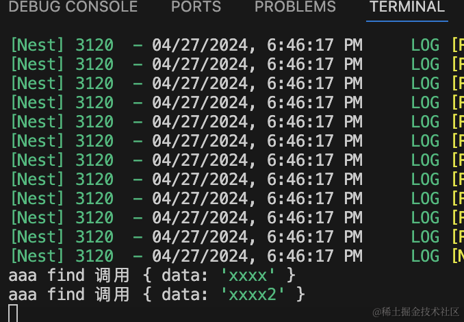

event emitter 用起来很简单，但却很有用，比直接引入模块注入依赖的方式方便太多了。

我们来做个具体案例，用户注册成功之后，通知模块里发送欢迎邮件：

```
nest g resource user --no-spec
nest g resource notification --no-spec
```
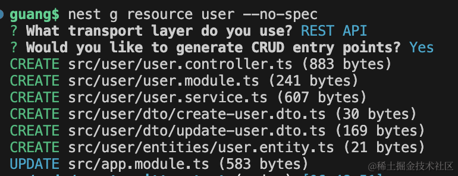

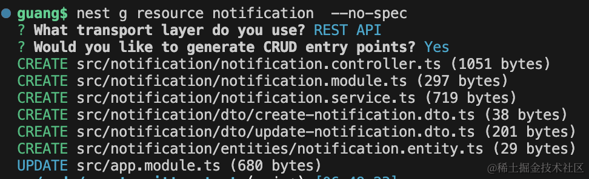

```
nest g module email
nest g service email --no-spec
```
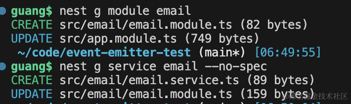

创建 user 用户模块、notification 通知模块，email 邮件模块。

先来写下邮件模块：

安装 nodemailer 包：

```
npm install --save nodemailer
```
写下 EmailService：

```javascript
import { Injectable } from '@nestjs/common';
import { createTransport, Transporter} from 'nodemailer';

@Injectable()
export class EmailService {

    transporter: Transporter
    
    constructor() {
      this.transporter = createTransport({
          host: "smtp.qq.com",
          port: 587,
          secure: false,
          auth: {
              user: "你的用户名",
              pass: "你的授权码"
          },
      });
    }

    async sendMail({ to, subject, html }) {
      await this.transporter.sendMail({
        from: {
          name: '系统邮件',
          address: "你的邮箱地址"
        },
        to,
        subject,
        html
      });
    }

}
```
如何获取授权码看 [node 发邮件](https://juejin.cn/book/7226988578700525605/section/7247327089496424505)那节。

然后把 EmailModule 声明为全局模块：

```javascript
import { Global, Module } from '@nestjs/common';
import { EmailService } from './email.service';

@Global()
@Module({
  providers: [EmailService],
  exports: [EmailService]
})
export class EmailModule {}

```

这样 NotificationService 里就可以直接注入 EmailService 了：

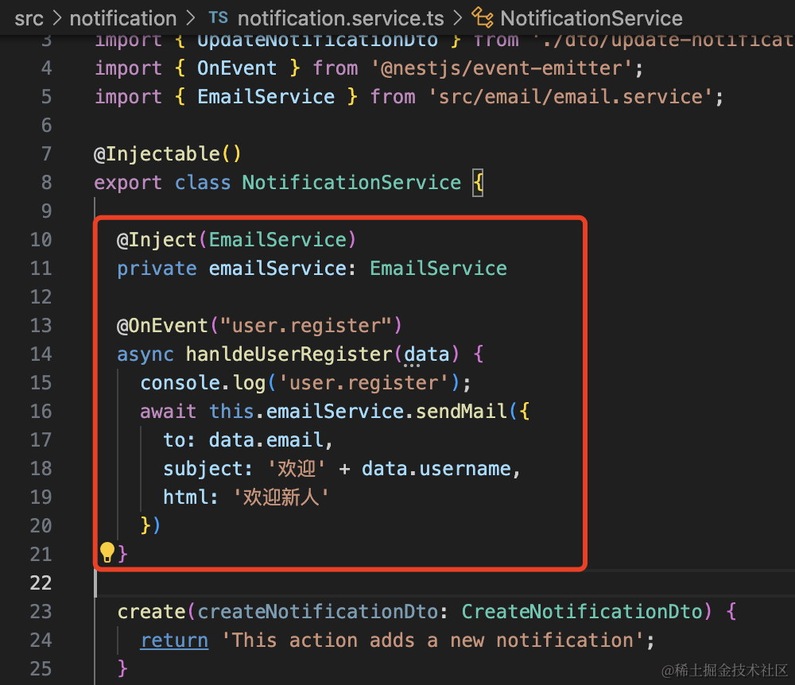

```javascript
@Inject(EmailService)
private emailService: EmailService

@OnEvent("user.register")
async hanldeUserRegister(data) {
    console.log('user.register');

    await this.emailService.sendMail({
      to: data.email,
      subject: '欢迎' + data.username,
      html: '欢迎新人'
    })
}
```

然后在 CreateUserDto 添加两个属性：

```javascript
export class CreateUserDto {
    username: string;
    email: string;
}
```
在 create 的时候调用下：

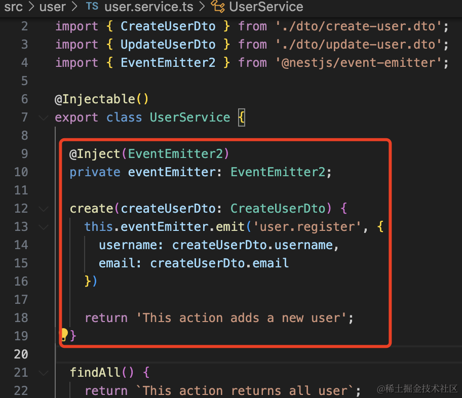

```javascript
@Inject(EventEmitter2)
private eventEmitter: EventEmitter2;

create(createUserDto: CreateUserDto) {
    this.eventEmitter.emit('user.register', {
      username: createUserDto.username,
      email: createUserDto.email
    })

    return 'This action adds a new user';
}
```
在 postman 里调用下 create 接口：

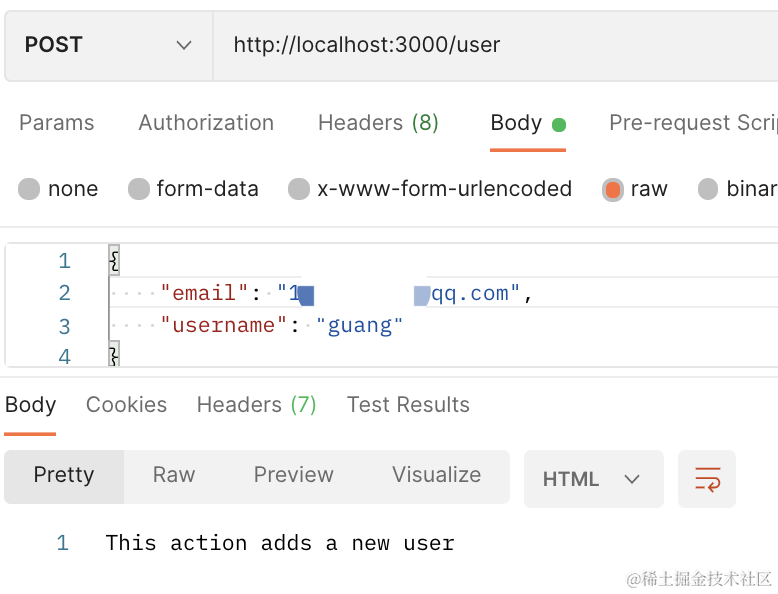

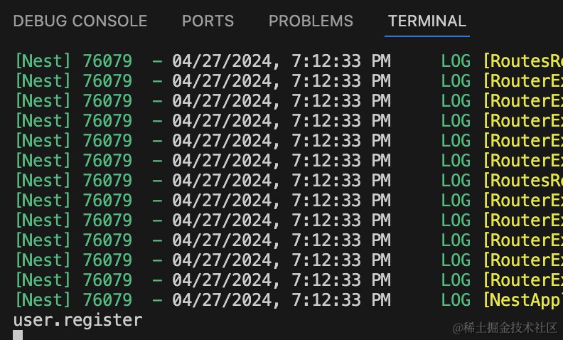

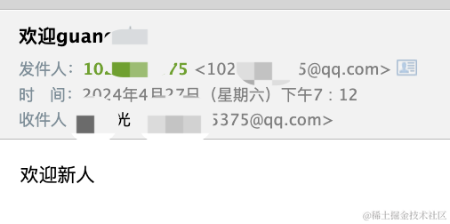

通知成功了！

案例代码上传了[小册仓库](https://github.com/QuarkGluonPlasma/nestjs-course-code/tree/main/event-emitter-test)。
## 总结

多个业务模块之间可能会有互相调用的关系，但是也不方便直接注入别的业务模块的 Service 进来。

这种就可以通过 EventEmitter 来实现。

在一个 service 里 emit 事件和 data，另一个 service 里 @OnEvent 监听这个事件就可以了。

用起来很简单，但比起注入别的模块的 service 方便太多了。
