前面我们学了 Nest 如何上传文件到服务器，但实际上基本不会直接在应用服务器存文件。

因为很容易到达存储上限，而且不好管理。

一般都会用 OSS 服务，比如阿里云的 OSS。

或者自己搭的 OSS 服务，比如用 minio。

用了 OSS 服务之后，可以通过服务器中转的方式上传文件：

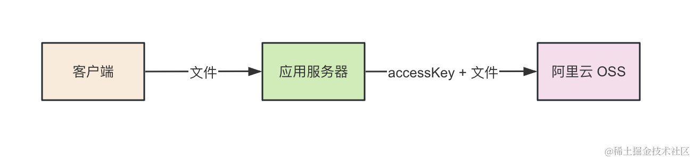

也就是前端把文件上传应用服务器，服务器上传阿里云或者 minio。

但这样没必要，传两次文件，浪费流量。

一般都是前端直传 OSS 服务，然后把文件 url 给应用服务器：

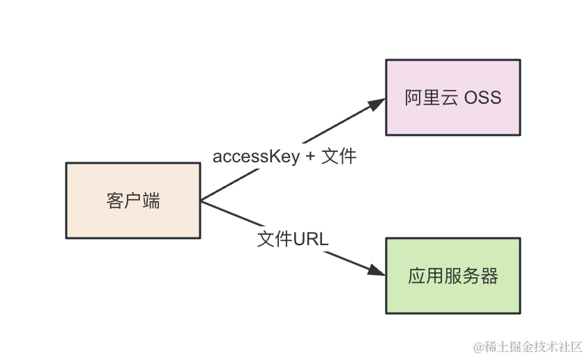

但这样直接把 accessKey 暴露给前端也不安全。

学阿里云 OSS 的时候我们讲过通过临时凭证的方式直穿 OSS。

也就是应用服务器返回一个临时的凭证，前端用这个临时凭证传 OSS，不需要把 accessKey 暴露给前端。

用 minio 自然也可以。

这节我们就来讲下前端如何直传 minio 的 OSS 服务。

搜索下 minio：

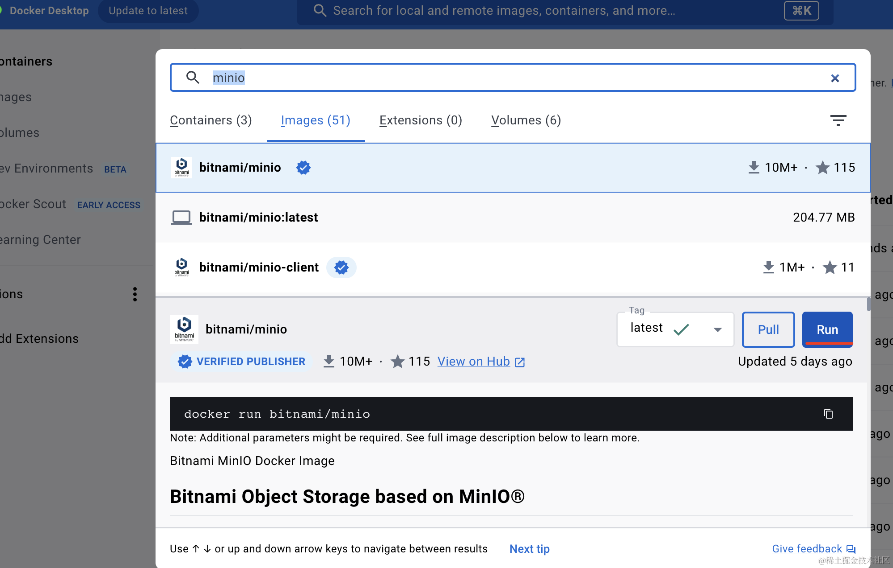

填入一些信息：

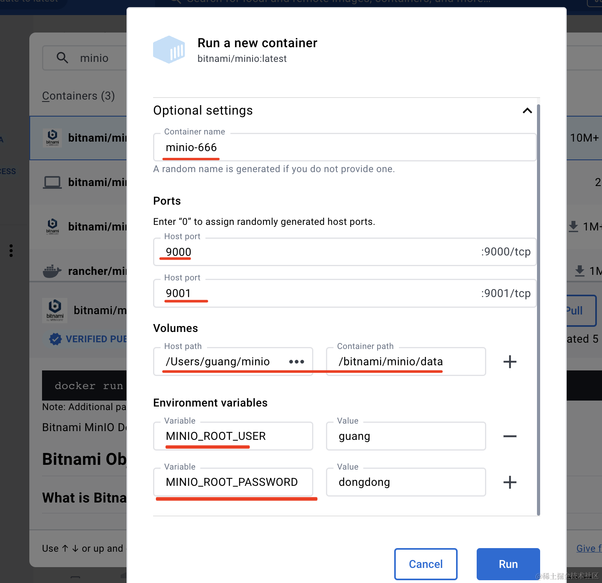

name 是容器名。

port 是映射本地 9000 和 9001 端口到容器内的端口。

volume 是挂载本地目录到容器内的目录

这里挂载了一个本地一个目录到容器内的数据目录 /bitnami/minio/data，这样容器里的各种数据都保存在本地了。

还要指定两个环境变量，MINIO_ROOT_USER 和 MINIO_ROOT_PASSWORD，是用来登录的。

点击 run，跑起来之后可以看到数据目录被标记为 mounted，端口也映射成功了：

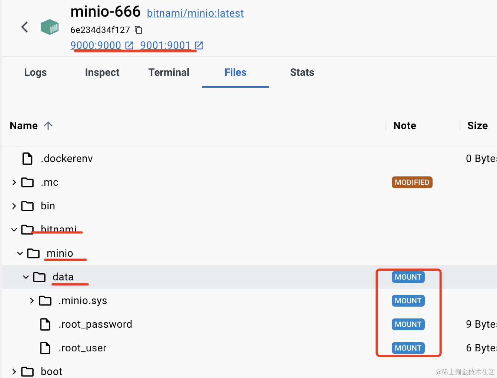

访问下 http://localhost:9001

我们创建个 bucket：

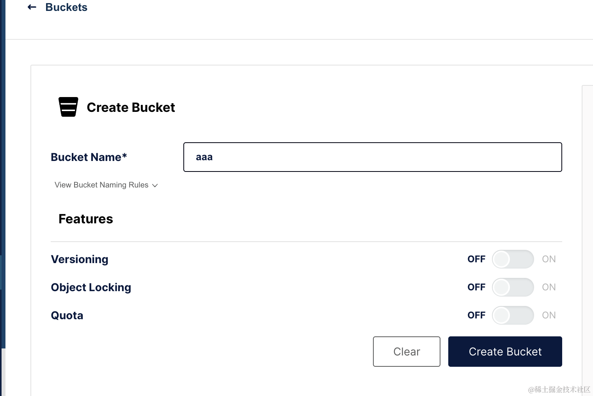

设置下可以公开访问：

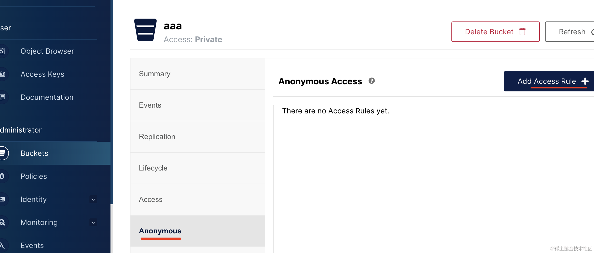

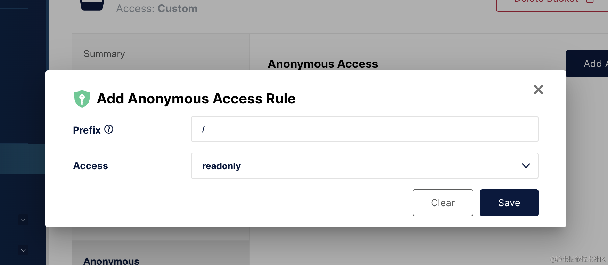

然后上传个文件：

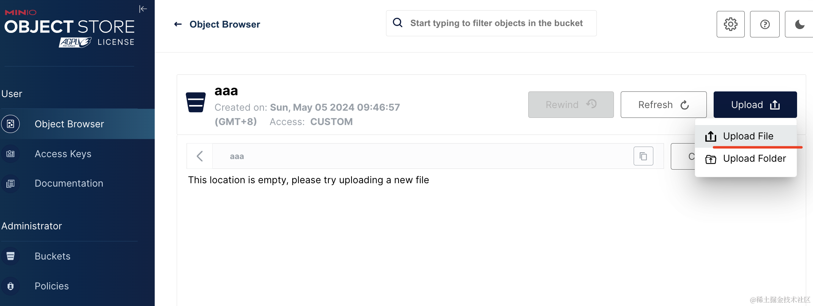

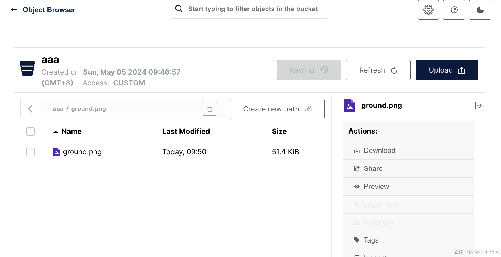

浏览器直接访问文件路径的 URL：

http://localhost:9000/aaa/ground.png


可以看到，现在 OSS 服务的上传和查看图片就都成功了。

上节我们也写过在 node 里上传文件到 minio：

```javascript
var Minio = require('minio')

var minioClient = new Minio.Client({
  endPoint: 'localhost',
  port: 9000,
  useSSL: false,
  accessKey: '',
  secretKey: '',
})

function put() {
    minioClient.fPutObject('aaa', 'hello.png', './smile.png', function (err, etag) {
        if (err) return console.log(err)
        console.log('上传成功');
    });
}

put()
```
这节来做前端直传 minio。

因为需要服务端生成临时凭证，我们创建个 nest 服务：

```
nest new minio-fe-upload
```
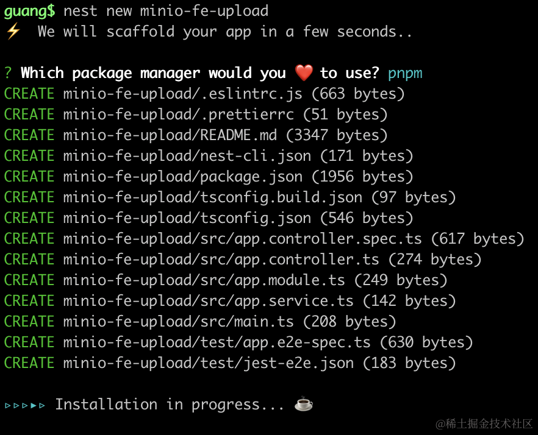

安装 minio 包：
```
npm install --save minio
```
然后创建个模块：

```
nest g module minio
```

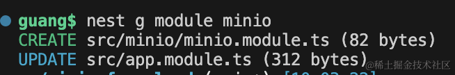
```javascript
import { Global, Module } from '@nestjs/common';
import * as Minio from 'minio';

export const MINIO_CLIENT = 'MINIO_CLIENT';

@Global()
@Module({
    providers: [
        {
            provide: MINIO_CLIENT,
            async useFactory() {
                const client = new Minio.Client({
                        endPoint: 'localhost',
                        port: 9000,
                        useSSL: false,
                        accessKey: '',
                        secretKey: ''
                    })
                return client;
            }
          }
    ],
    exports: [MINIO_CLIENT]
})
export class MinioModule {}
```
把 minio client 封装成 provider，放到 exports 里，并设置模块为 @Global。

用到 accessKey 和 secretKey 在这里创建：

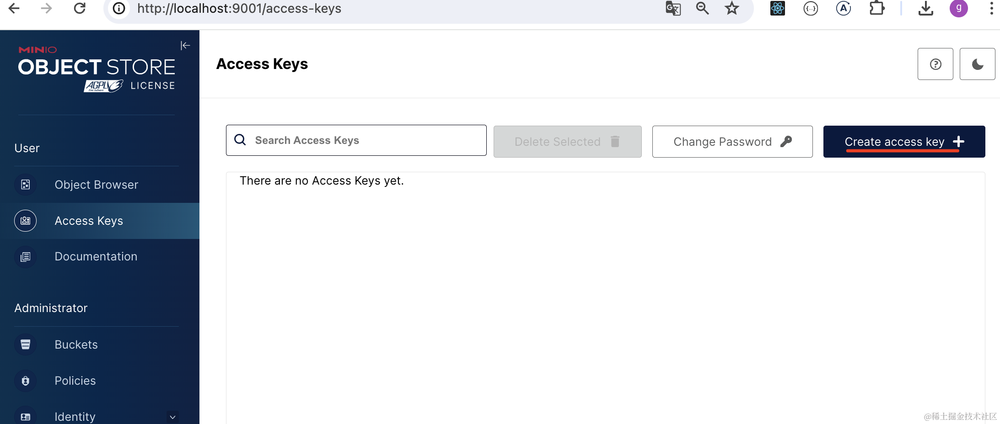

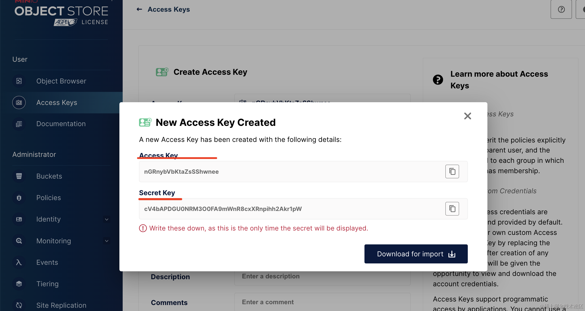

在 AppController 里注入下测试下：

```javascript
import { Controller, Get, Inject } from '@nestjs/common';
import { AppService } from './app.service';
import { MINIO_CLIENT } from './minio/minio.module';
import * as Minio from 'minio';

@Controller()
export class AppController {
  constructor(private readonly appService: AppService) {}

  @Inject(MINIO_CLIENT)
  private minioClient: Minio.Client;

  @Get('test')
  async test() {
    try {
      await this.minioClient.fPutObject('aaa', 'hello.json', './package.json');
      return 'http://localhost:9000/aaa/hello.json';
    } catch(e) {
      console.log(e);
      return '上传失败';
    }
  }

  @Get()
  getHello(): string {
    return this.appService.getHello();
  }
}
```
注入 Minio Client，在 test 接口里上传文件。

把服务跑起来；

```
npm run start:dev
```

试一下：


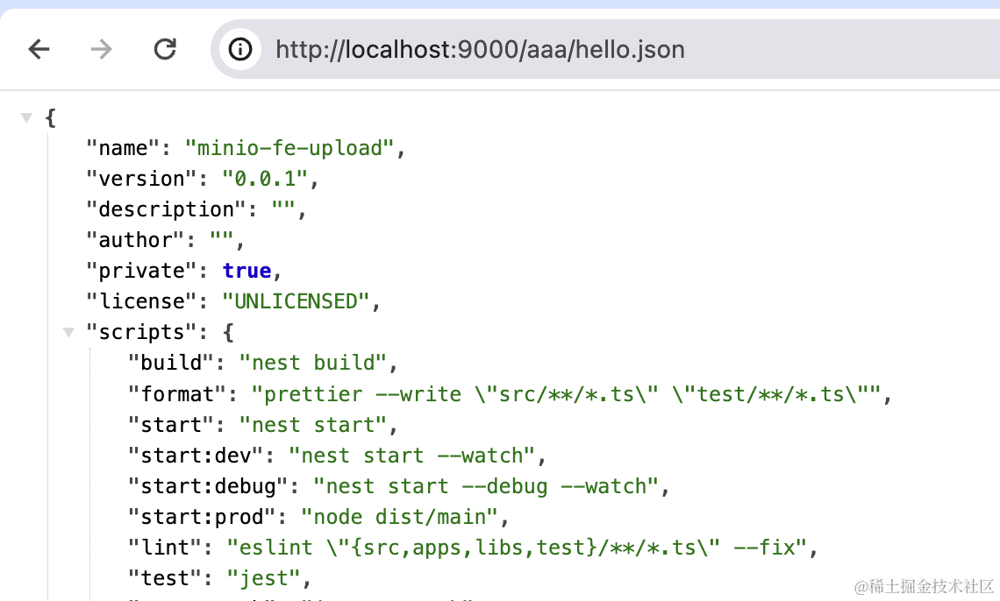

上传成功。

然后我们要在前端做直传，

指定 public 为静态文件目录：

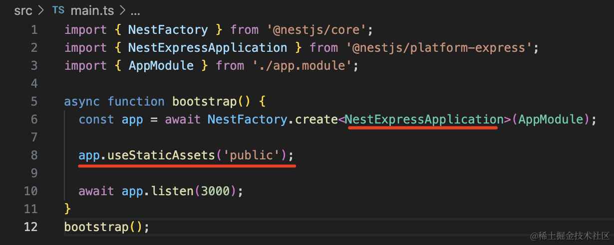

```javascript
import { NestFactory } from '@nestjs/core';
import { NestExpressApplication } from '@nestjs/platform-express';
import { AppModule } from './app.module';

async function bootstrap() {
  const app = await NestFactory.create<NestExpressApplication>(AppModule);
  
  app.useStaticAssets('public');

  await app.listen(3000);
}
bootstrap();
```
写下前端代码 public/index.html

```html
<!DOCTYPE html>
<html lang="en">
<head>
    <meta charset="UTF-8">
    <meta name="viewport" content="width=device-width, initial-scale=1.0">
    <title>Document</title>
</head>
<body>
    <input type="file" id="selector" multiple>
    <button onclick="upload()">Upload</button>
    <div id="status">No uploads</div>

    <script type="text/javascript">
        function upload() {
            var files = document.querySelector("#selector").files;
            for (var i = 0; i < files.length; i++) {
                var file = files[i];
                retrieveNewURL(file, (file, url) => {
                    uploadFile(file, url);
                });
            }
        }

        function retrieveNewURL(file, cb) {
            fetch(`/presignedUrl?name=${file.name}`).then((response) => {
                response.text().then((url) => {
                    cb(file, url);
                });
            }).catch((e) => {
                console.error(e);
            });
        }

        function uploadFile(file, url) {
            if (document.querySelector('#status').innerText === 'No uploads') {
                document.querySelector('#status').innerHTML = '';
            }
            fetch(url, {
                method: 'PUT',
                body: file
            }).then(() => {
                document.querySelector('#status').innerHTML += `<br>Uploaded ${file.name}.`;
            }).catch((e) => {
                console.error(e);
            });
        }
    </script>
</body>
</html>
```
这部分是[文档](https://min.io/docs/minio/linux/integrations/presigned-put-upload-via-browser.html)里的。

就是一个 type 为 file 的 input，可以多选。

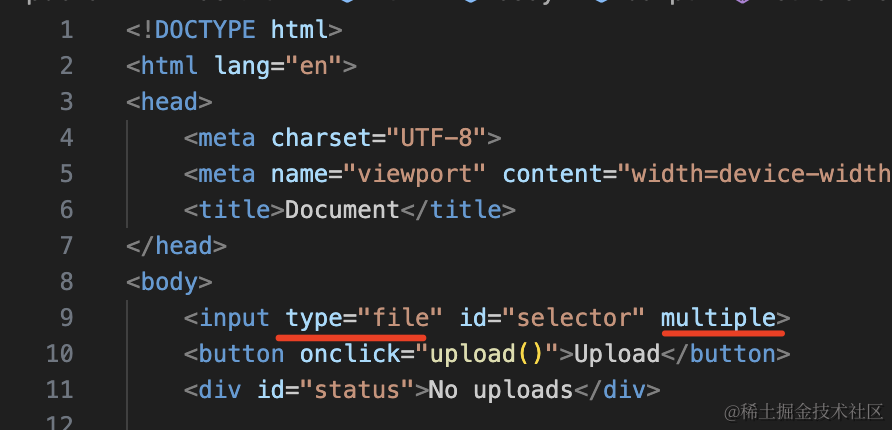

点击上传的时候遍历文件，对每个文件路径调用服务端的 presignedUrl 接口进行 url 签名：


之后用返回的 url 就可以直传服务端了：

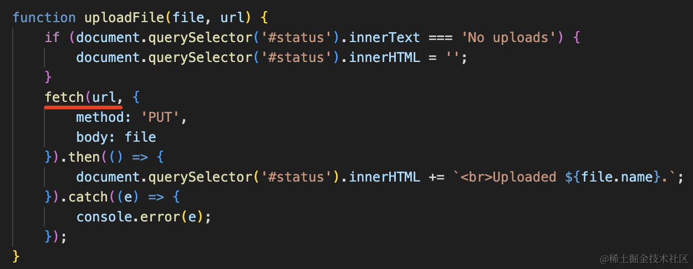

用 fetch 传的，换成 axios 也一样。

然后我们在服务端增加这个签名接口：

```javascript  
@Get('presignedUrl')
async presignedUrl(@Query('name') name: string) {
    return this.minioClient.presignedPutObject('aaa', name, 3600);
}
```
这里的第一个参数是 bucketName，第二个参数是 objectName，第三个参数是过期时间，我们指定 3600秒，也就是一小时

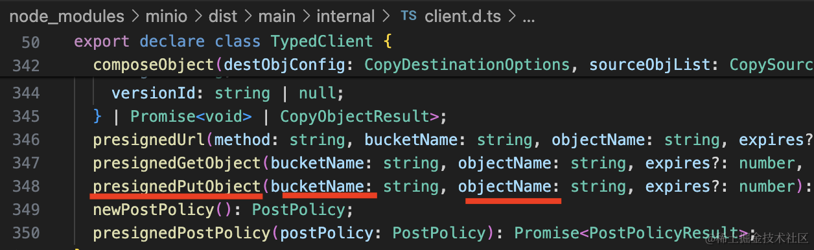

bucketName 是 aaa，而 objectName 需要文件上传的时候拿到 file.name 作为参数传过来。

测试下：


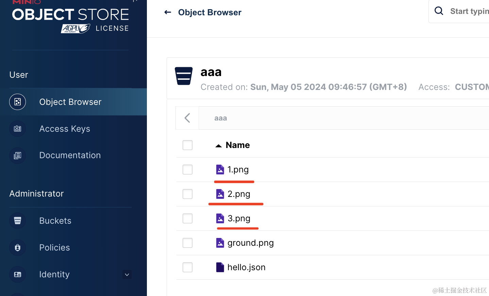

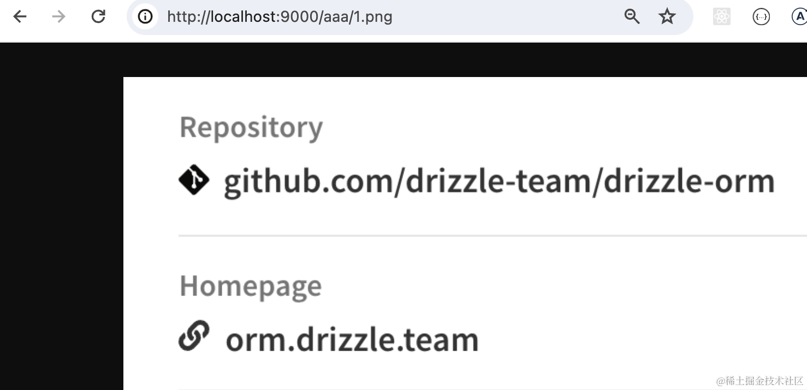

上传成功！

看下 url 签名之后的样子：

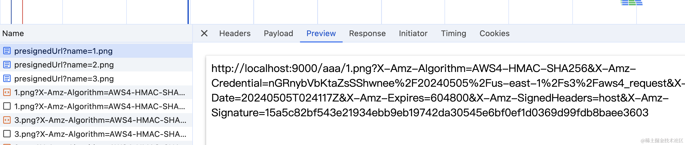

其实就是在 url 里带上了鉴权信息。

这样，前端不需要 accessKey 也可以直传文件到 minio 了。

案例代码上传了[小册仓库](https://github.com/QuarkGluonPlasma/nestjs-course-code/tree/main/minio-fe-upload)。

## 总结

前面我们实现过阿里云 OSS 的前端直传文件，只要在服务端做预签名，前端就可以不用 accessKey 实现文件上传。

这节我们实现了 minio 的前端文件直传，也是通过服务端做预签名，然后前端直接传 minio 就行。

一般我们不会直接上传文件到应用服务器，而是传阿里云 OSS 或者传 minio。
