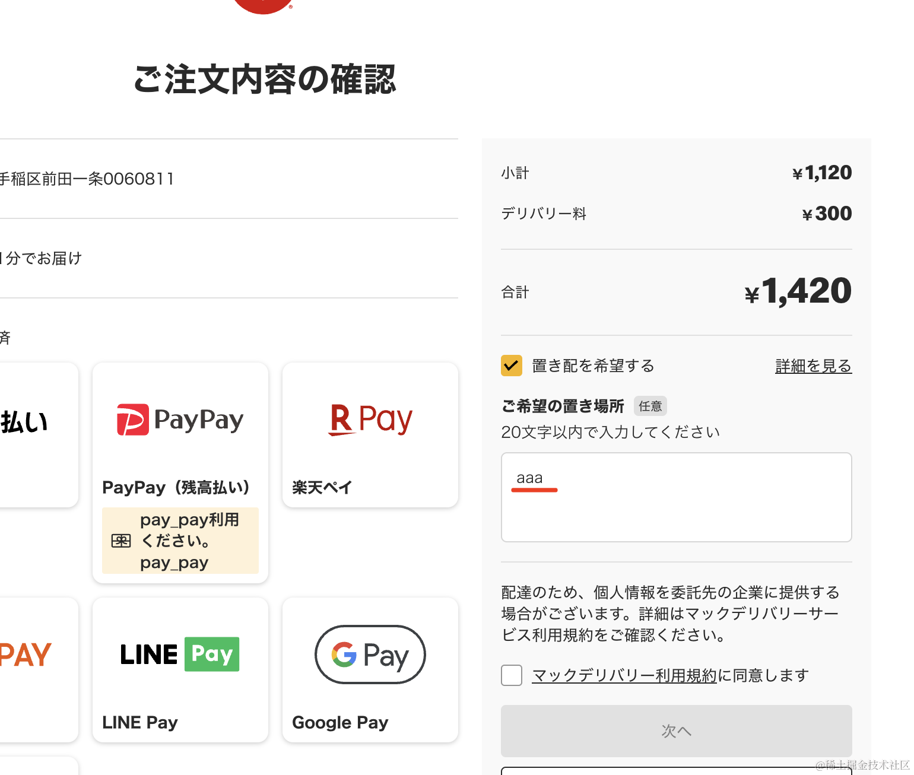
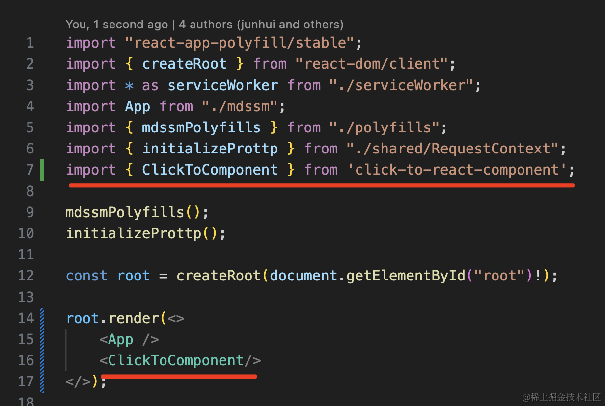
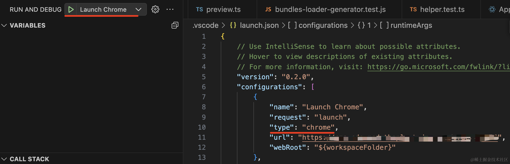
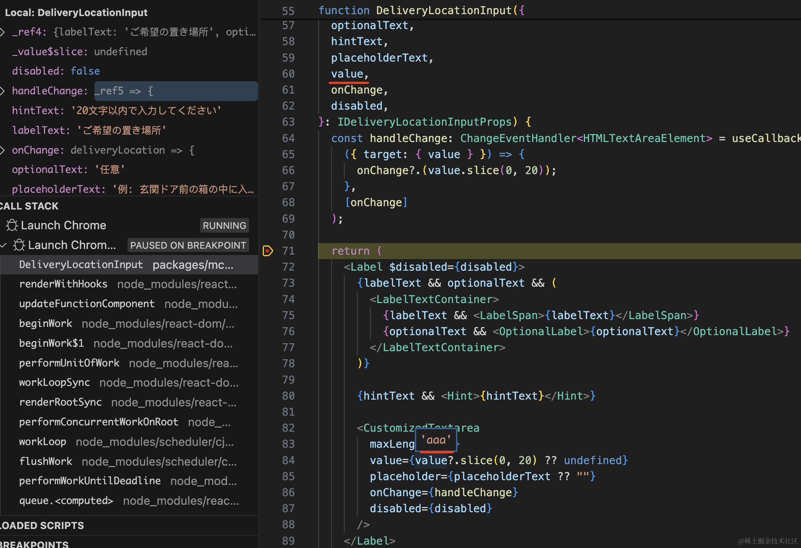
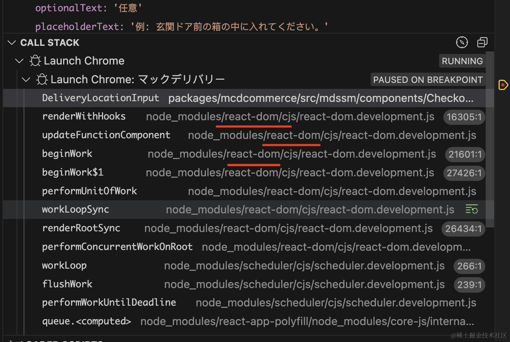
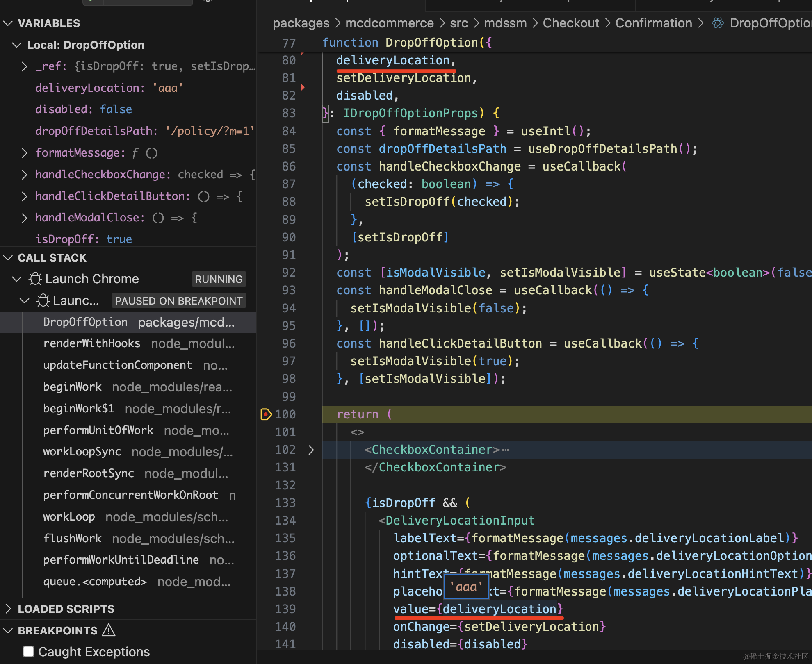
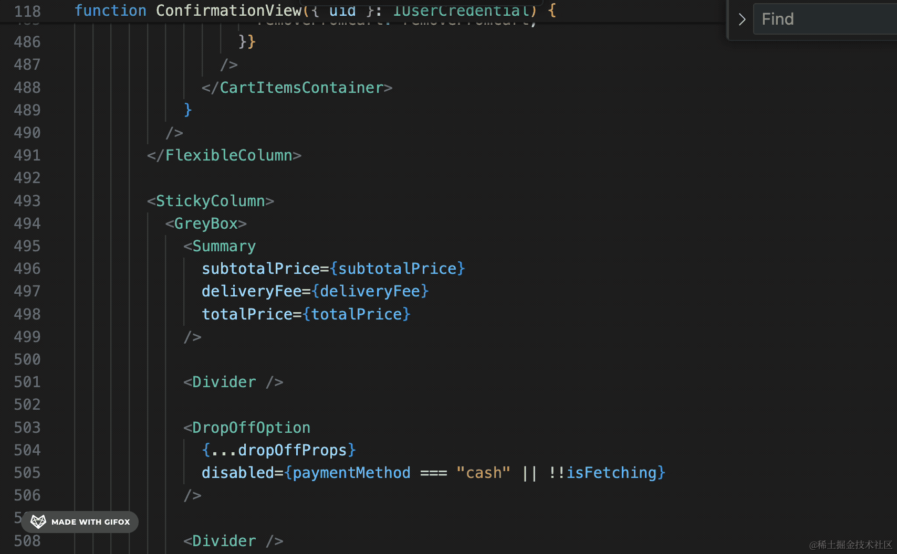

我们学了如何在 VSCode 里断点调试 React 组件，也学了用 click-to-react-component 点击页面元素直接在 VSCode 打开对应组件。

这俩单独使用都很不错，而如果把两者结合起来用，会有更爽的调试体验。

比如我们要调试这个页面，理清这个输入框的内容是哪里来的：

我们先在项目里引入 click-to-react-component

用它来定位这个输入框的源码在哪，按住 option + 点击元素即可：

添加调试配置后启动 debug：

然后在刚定位到的组件 return 的地方打个断点：

发现这个 value 是从父组件通过 props 传进来的。

所以要继续去父组件里打断点。

但是 React 组件渲染的时候调用栈里都是 react 源码，找不到父组件在哪。

那怎么办呢？

这时候可以借助 click-to-react-component 展示所有父组件的能力：

按住 option + 右键，会展示这个元素所在组件的所有父组件。

点击父组件：

这样就定位到了父组件里渲染这个子组件的源码位置：

这时候发现这个值依然是通过 props 传进来的。

所以我们用同样的方式继续往上找：

定位到了一个自定义 hooks，参数都是这里返回的：

在这里打个断点调试下：

不断 step into 进入函数内部，最终，我们找到了这个参数的来源：

在 localStorage 里读取了某个 key，key 的名字也调试出来了。

这样我们就达成了调试目标。

整个过程我们根本不需要去理清业务代码的逻辑。

想想看，你是接手这个业务项目的新人，虽然你还没看这些业务代码，但你可以快速定位界面上显示的值的来源，定位到代码在哪里改。

是不是就很高效！

## 总结

这节我们把 VSCode 断点调试 React 组件和 click-to-react-component 点击元素在 VSCode 打开组件结合了起来。

引入 click-to-react-component，然后添加一个调试配置。

按照这样的步骤来：

- option + 点击页面上想调试的元素，定位到 VSCode 里的源码
- 打断点看一下值的来源
- 如果是来自父组件，那就用 option + 右键查找父组件，直接定位到父组件的源码
- 在定位到的父组件源码里打断点
- 不断往上找，直到找到产生这个值的地方，断点调试

这样，就算你不懂这段业务逻辑，也能快速梳理清楚整个流程，并知道在哪里改代码。

两者结合用，调试体验是非常爽的。
