上节我们学了用 react-intl 做国际化。

我们会把文案抽离出来，放在不同的资源包里维护。

比如 zh-CN.json：

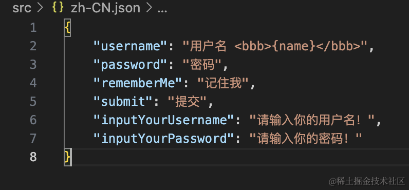

en-US.json：

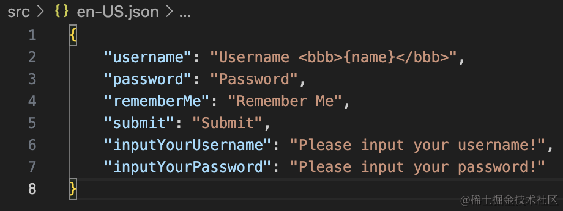

而这个文案的翻译一般是产品经理做的。

那怎么把这个资源包给产品经理编辑呢？

直接给他 json 文件么？

这样并不好。

一般我们都是导出 excel。

来写一下：

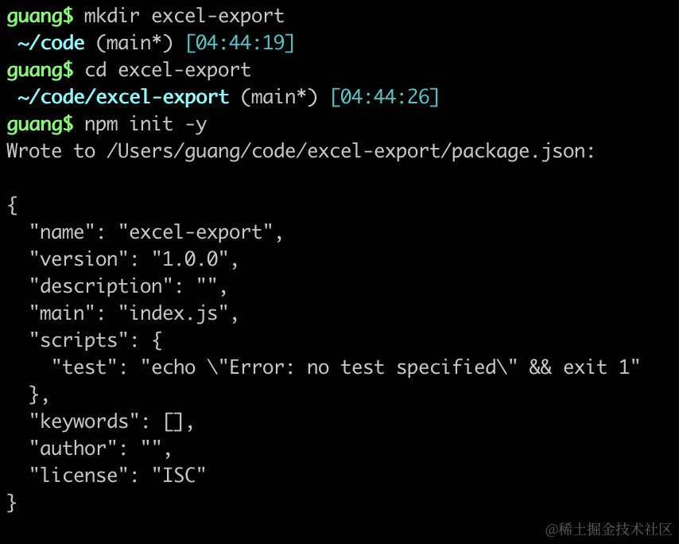
```
mkdir excel-export
cd excel-export
npm init -y
```
进入项目，安装 exceljs：

```
npm install --save exceljs
```
写下 index.js

```javascript
const { Workbook } = require('exceljs');

async function main(){
    const workbook = new Workbook();

    const worksheet = workbook.addWorksheet('guang111');

    worksheet.columns = [
        { header: 'ID', key: 'id', width: 20 },
        { header: '姓名', key: 'name', width: 30 },
        { header: '出生日期', key: 'birthday', width: 30},
        { header: '手机号', key: 'phone', width: 50 }
    ];

    const data = [
        { id: 1, name: '光光', birthday: new Date('1994-07-07'), phone: '13255555555' },
        { id: 2, name: '东东', birthday: new Date('1994-04-14'), phone: '13222222222' },
        { id: 3, name: '小刚', birthday: new Date('1995-08-08'), phone: '13211111111' }
    ]
    worksheet.addRows(data);

    workbook.xlsx.writeFile('./data.xlsx');    
}

main();
```
就是按照 workbook（工作簿） > worksheet（工作表）> row （行）的层次来添加数据。

跑一下：

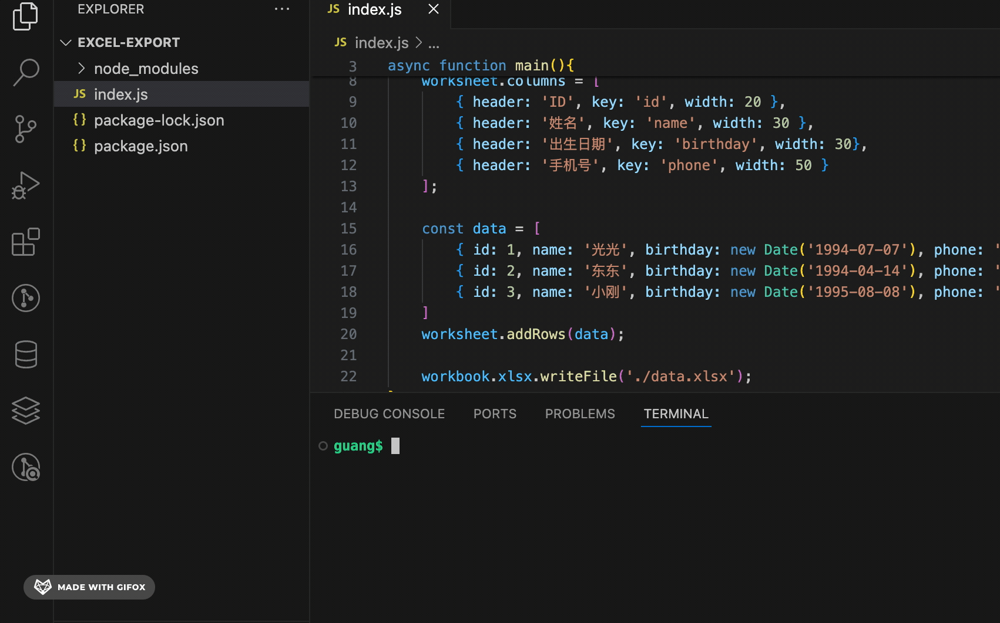

生成了 excel 文件。

打开看下：

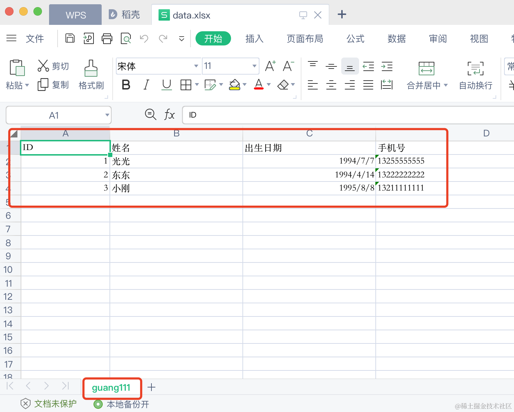

可以看到 worksheet 的名字，还有每行的数据都是对的。

这样，就完成了 excel 的生成。

那我们就可以把 zh-CN.json、en-US.json 等的内容整合到 excel 文件里：

把 zh-CN.json 和 en-US.json 复制过来：

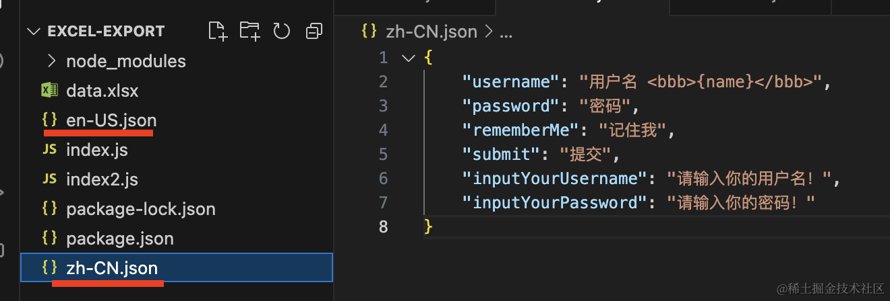
zh-CN.json
```json
{
    "username": "用户名 <bbb>{name}</bbb>",
    "password": "密码",
    "rememberMe": "记住我",
    "submit": "提交",
    "inputYourUsername": "请输入你的用户名！",
    "inputYourPassword": "请输入你的密码！"
}
```
en-US.json
```json
{
    "username": "Username <bbb>{name}</bbb>",
    "password": "Password",
    "rememberMe": "Remember Me",
    "submit": "Submit",
    "inputYourUsername": "Please input your username!",
    "inputYourPassword": "Please input your password!"
}
```
然后写下 index2.js

```javascript
const { Workbook } = require('exceljs');
const fs = require('fs');

const languages = ['zh-CN', 'en-US'];

async function main(){
    const workbook = new Workbook();

    const worksheet = workbook.addWorksheet('test');

    const bundleData = languages.map(item => {
        return JSON.parse(fs.readFileSync(`./${item}.json`));
    })

    const data = [];

    bundleData.forEach((item, index) => {
        for(let key in item) {
            const foundItem = data.find(item => item.id === key);
            if(foundItem) {
                foundItem[languages[index]] = item[key]
            } else {
                data.push({
                    id: key,
                    [languages[index]]: item[key]
                })
            }
        }
    })

    console.log(data);

    worksheet.columns = [
        { header: 'ID', key: 'id', width: 30 },
        ...languages.map(item => {
            return {
                header: item,
                key: item,
                width: 30
            }
        })
    ];

    worksheet.addRows(data);

    workbook.xlsx.writeFile('./bundle.xlsx');    
}

main();
```
这里我们读取了 en-US.json 和 zh-CN.json 的内容，然后按照 id、en-US、zh-CN 的 column 来写入 excel。

跑一下：

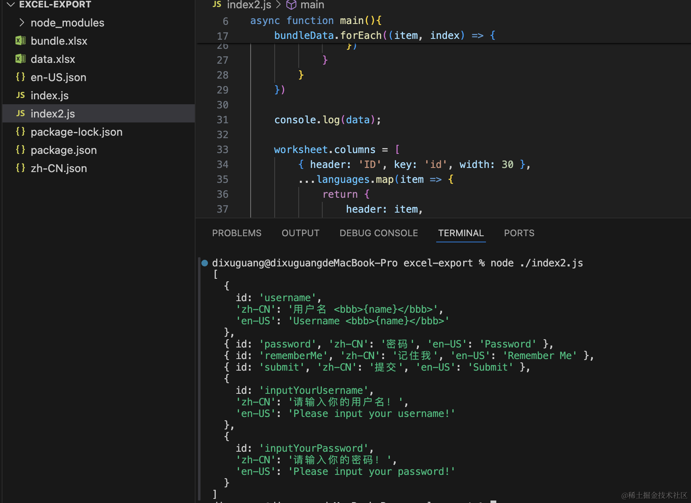

看下生成的 excel：

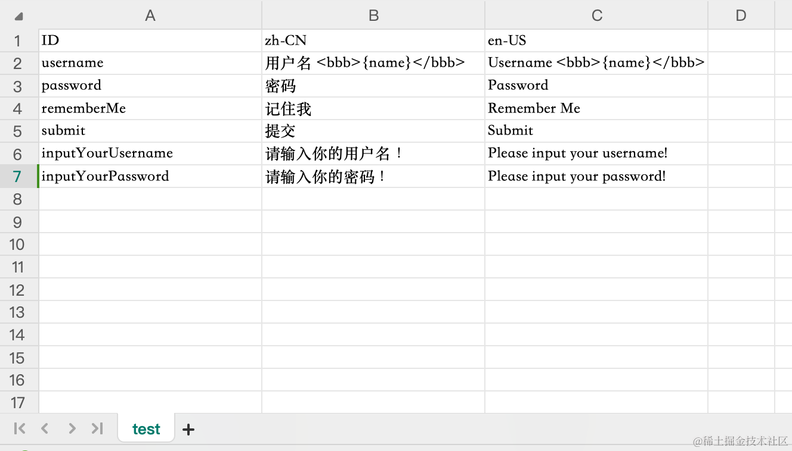

现在这个 excel 已经可以交给产品经理去编辑了，但是还少了一些描述。

可能产品经理看到某个 key 并不知道这个文案是在哪里用的，干啥的。

所以我们最好加一些描述。

打开上节的项目，再次执行 extract 命令：

```
npx formatjs extract "src/**/*.tsx" --out-file messages.json
```
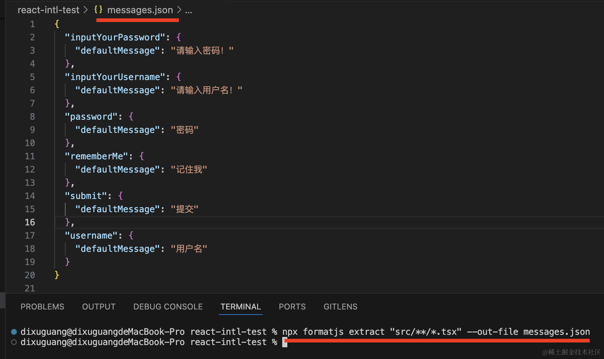

现在有 defaultMessage，没有 description，我们在 defineMessages 的时候加一下：

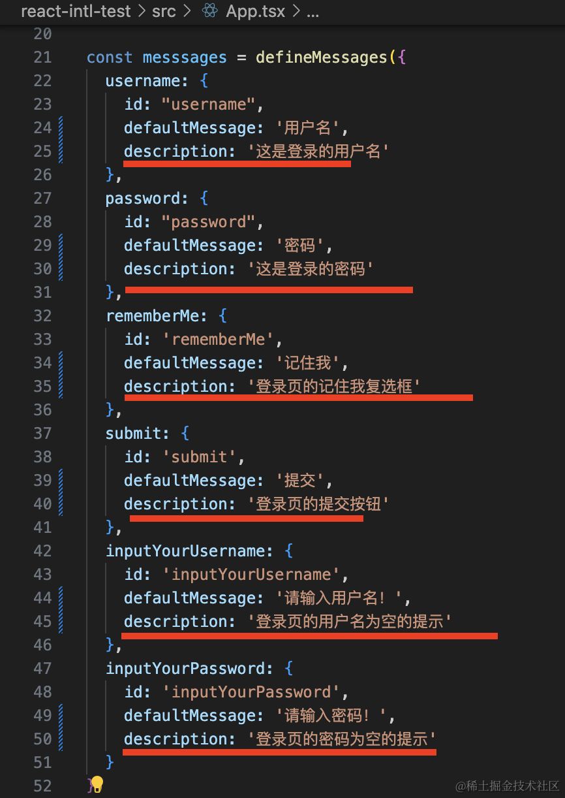

```javascript
const messsages = defineMessages({
  username: {
    id: "username",
    defaultMessage: '用户名',
    description: '这是登录的用户名'
  },
  password: {
    id: "password",
    defaultMessage: '密码',
    description: '这是登录的密码'
  },
  rememberMe: {
    id: 'rememberMe',
    defaultMessage: '记住我',
    description: '登录页的记住我复选框'
  },
  submit: {
    id: 'submit',
    defaultMessage: '提交',
    description: '登录页的提交按钮'
  },
  inputYourUsername: {
    id: 'inputYourUsername',
    defaultMessage: '请输入用户名！',
    description: '登录页的用户名为空的提示'
  },
  inputYourPassword: {
    id: 'inputYourPassword',
    defaultMessage: '请输入密码！',
    description: '登录页的密码为空的提示'
  }
})
```

重新 extract 生成 messages.json

```
npx formatjs extract "src/**/*.tsx" --out-file messages.json
```

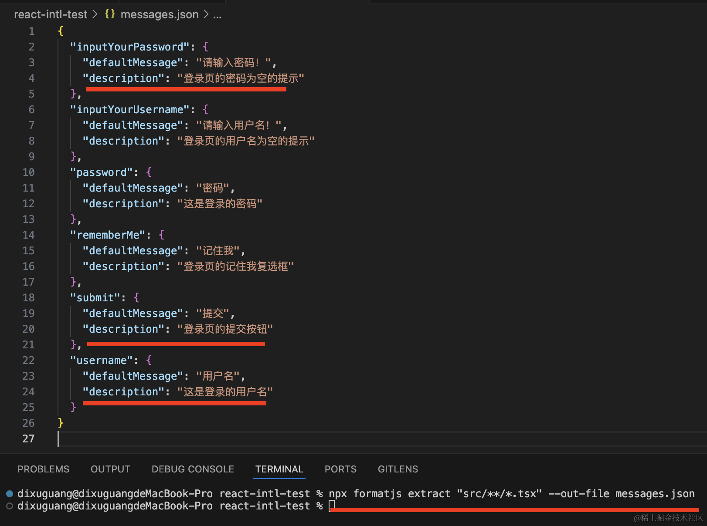

上节我们把这个文件删掉了，其实没必要删掉，可以用它来生成 excel。

把 messages.json 复制过去，我们改下 index2.js

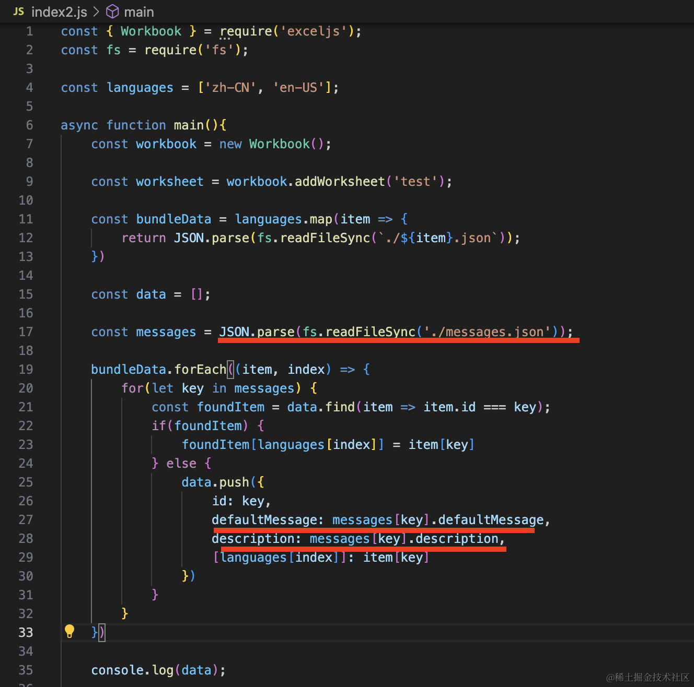
```javascript
const { Workbook } = require('exceljs');
const fs = require('fs');

const languages = ['zh-CN', 'en-US'];

async function main(){
    const workbook = new Workbook();

    const worksheet = workbook.addWorksheet('test');

    const bundleData = languages.map(item => {
        return JSON.parse(fs.readFileSync(`./${item}.json`));
    })

    const data = [];

    const messages = JSON.parse(fs.readFileSync('./messages.json'));

    bundleData.forEach((item, index) => {
        for(let key in messages) {
            const foundItem = data.find(item => item.id === key);
            if(foundItem) {
                foundItem[languages[index]] = item[key]
            } else {
                data.push({
                    id: key,
                    defaultMessage: messages[key].defaultMessage,
                    description: messages[key].description,
                    [languages[index]]: item[key]
                })
            }
        }
    })

    console.log(data);

    worksheet.columns = [
        { header: 'ID', key: 'id', width: 30 },
        { header: 'defaultMessage', key: 'defaultMessage', width: 30 },
        { header: 'description', key: 'description', width: 50 },
        ...languages.map(item => {
            return {
                header: item,
                key: item,
                width: 30
            }
        })
    ];

    worksheet.addRows(data);

    workbook.xlsx.writeFile('./bundle.xlsx');    
}

main();
```
现在生成的是这样的：

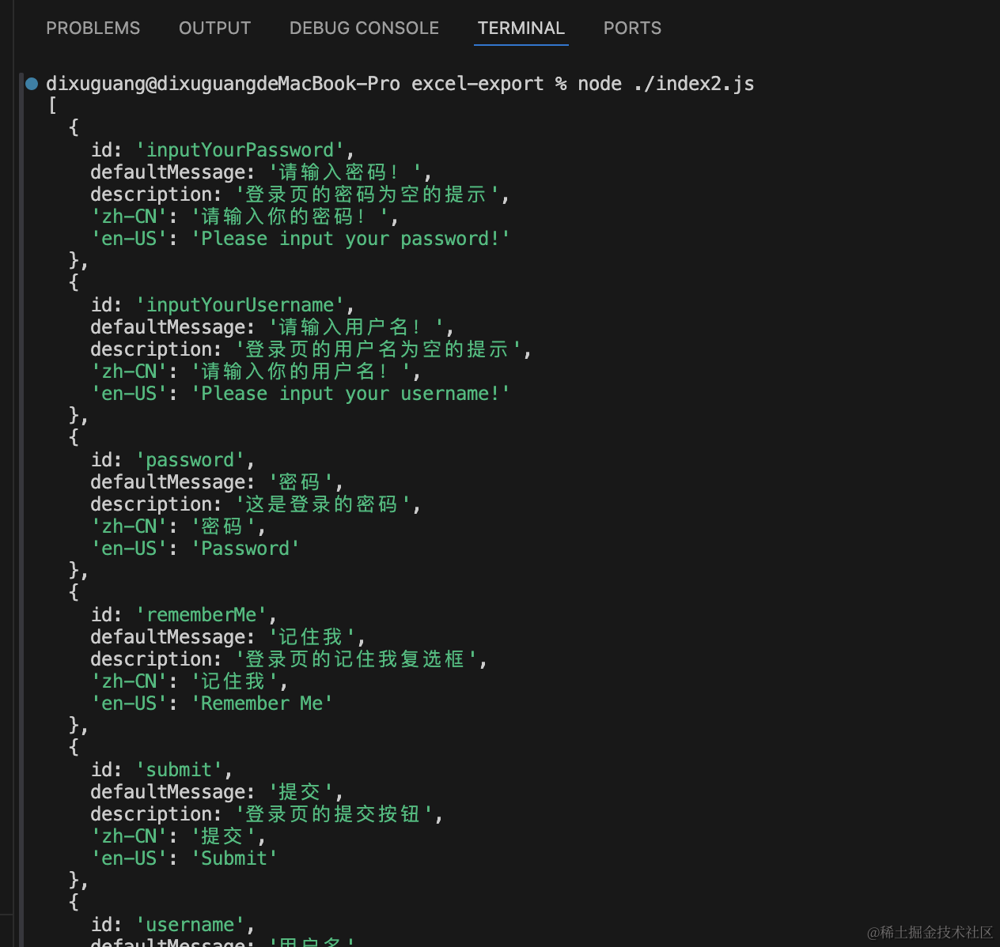

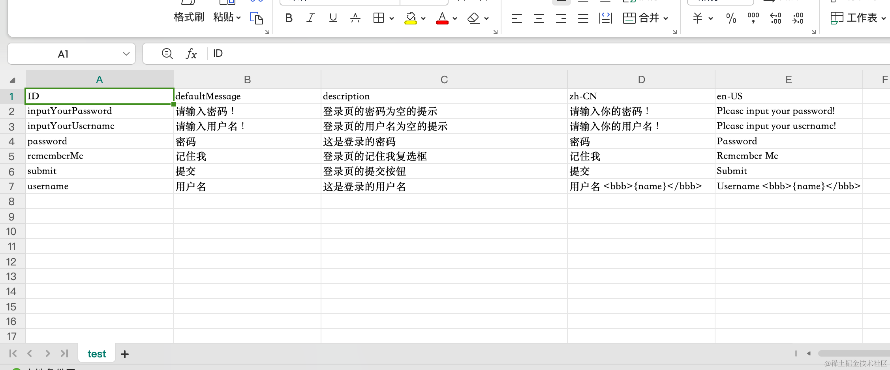

这样产品经理就知道每个 key 是哪里的文案，什么意思，就知道怎么翻译了。

改一下：

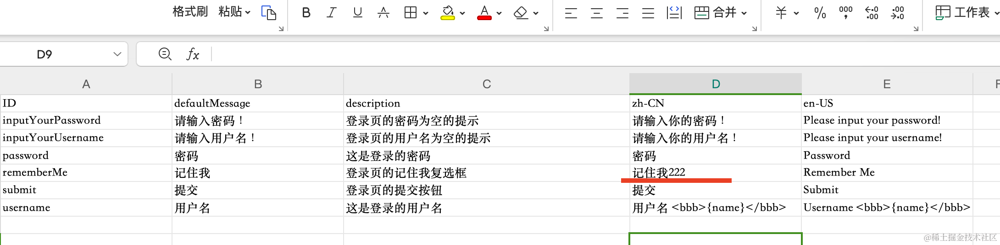

然后改完之后要用这个生成 en-US.json 和 zh-CN.json 在项目里引入用。

写一下这个脚本：

index3.js

```javascript
const { Workbook } = require('exceljs');

async function main(){
    const workbook = new Workbook();

    const workbook2 = await workbook.xlsx.readFile('./bundle.xlsx');

    workbook2.eachSheet((sheet, index1) => {
        console.log('工作表' + index1);

        sheet.eachRow((row, index2) => {
            const rowData = [];
    
            row.eachCell((cell, index3) => {
                rowData.push(cell.value);
            });

            console.log('行' + index2, rowData);
        })
    })
}

main();
```
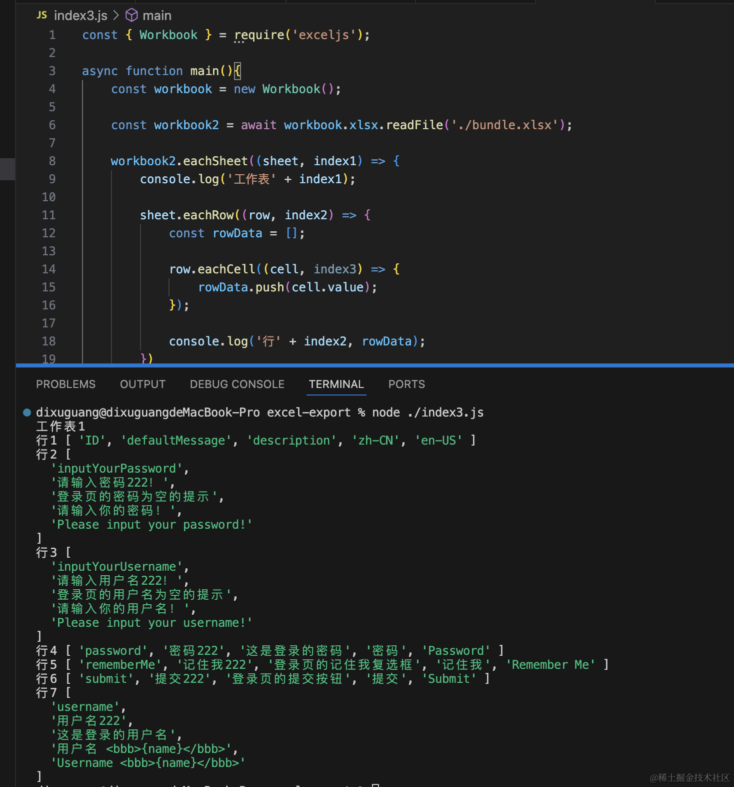

解析也是按照 workbook（工作簿） > worksheet（工作表）> row （行）的层次，调用 eachSheet、eachRow、eachCell 就好了。

然后生成 json：

```javascript
const { Workbook } = require('exceljs');
const fs = require('fs');

async function main(){
    const workbook = new Workbook();

    const workbook2 = await workbook.xlsx.readFile('./bundle.xlsx');

    const zhCNBundle = {};
    const enUSBundle = {};

    workbook2.eachSheet((sheet) => {

        sheet.eachRow((row, index) => {
            if(index === 1) {
                return;
            }
            const key = row.getCell(1).value;
            const zhCNValue = row.getCell(4).value;
            const enUSValue = row.getCell(5).value;

            zhCNBundle[key] = zhCNValue;
            enUSBundle[key] = enUSValue;
        })
    });

    console.log(zhCNBundle);
    console.log(enUSBundle);
    fs.writeFileSync('zh-CN.json', JSON.stringify(zhCNBundle, null, 2));
    fs.writeFileSync('en-US.json', JSON.stringify(enUSBundle, null, 2));
}

main();
```
跑一下：

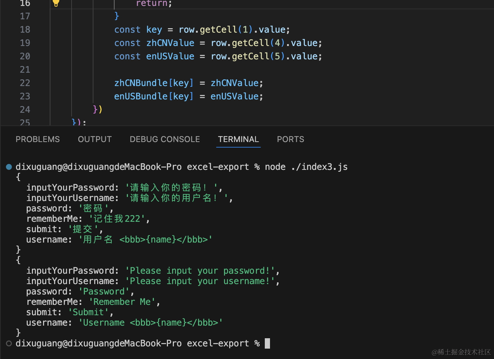

这样就把产品经理编辑后的 excel 生成了国际化资源包：

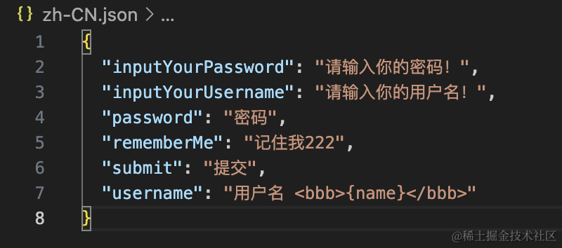

项目里直接用这个资源包就好了。

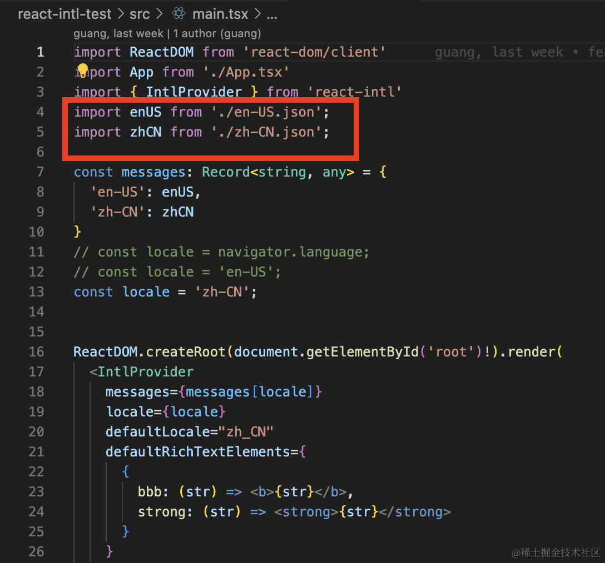

现在这样的工作流是可以的，但是不能协同编辑。

如果能够像在线文档一样协同编辑这个 excel 就好了。

可以的，用 google sheets.

打开 google sheets： https://docs.google.com/spreadsheets/

登录之后创建一个新的 sheet：

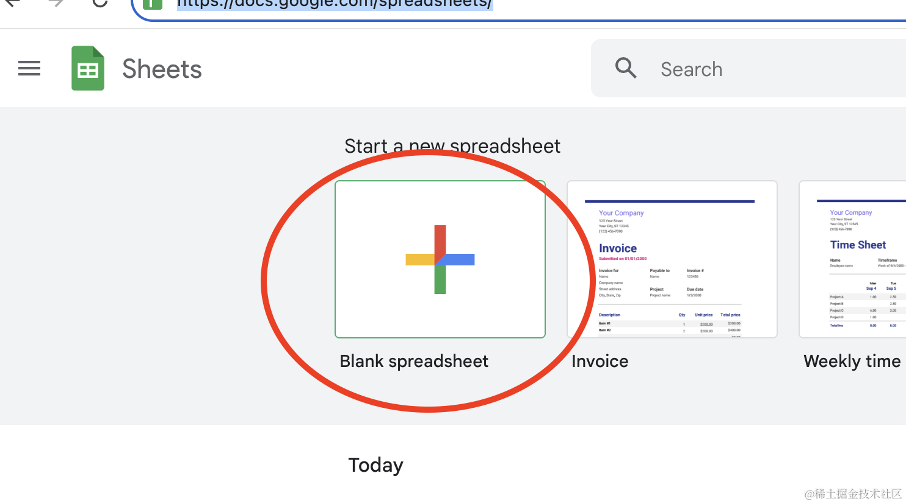

它可以导入 csv 格式的文件：


选择 replace 替换当前工作表：


这样，就导入了 csv 的数据：

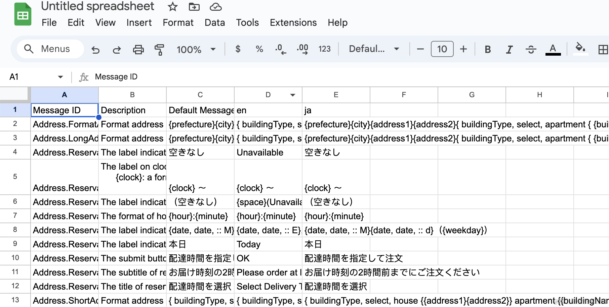

可以在线编辑了。

把这个 url 分享出去就行。


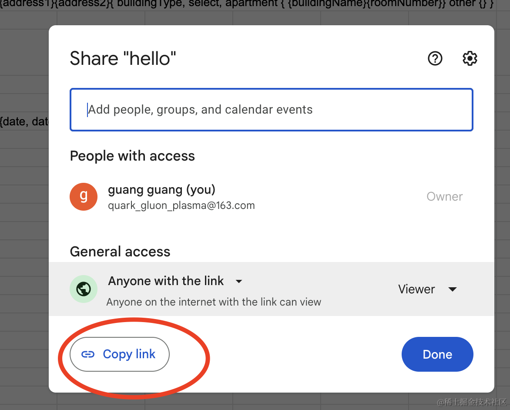

比如这个 url： 

https://docs.google.com/spreadsheets/d/1FgCNmoTz9FWuR6Jv1SJ9ioWd2bBfrtRAeoi5CYpmXBA/edit?usp=sharing

接下来的问题就变成了如何用 node 生成和解析 csv 文件。

这个可以用 csv-parse 和 csv-stringify 来做。

安装 csv-stringify：

```
npm install --save-dev csv-stringify
```
然后写下 index4.js

```javascript
const { stringify } = require("csv-stringify");
const fs = require('fs');

const languages = ['zh-CN', 'en-US'];

async function main(){
    const bundleData = languages.map(item => {
        return JSON.parse(fs.readFileSync(`./${item}.json`));
    })

    const data = [];

    const messages = JSON.parse(fs.readFileSync('./messages.json'));

    bundleData.forEach((item, index) => {
        for(let key in messages) {
            const foundItem = data.find(item => item.id === key);
            if(foundItem) {
                foundItem[languages[index]] = item[key]
            } else {
                data.push({
                    id: key,
                    defaultMessage: messages[key].defaultMessage,
                    description: messages[key].description,
                    [languages[index]]: item[key]
                })
            }
        }
    })

    console.log(data);

    const columns = {
        id: "Message ID",
        defaultMessage: "Default Message",
        description: "Description",
        'zh-CN': "zh-CN",
        'en-US': "en-US"
    };
      
    stringify(data, { header: true, columns }, function (err, output) {
        fs.writeFileSync("./messages.csv", output);
    });
}

main();
```

也是定义 columns 和 column 对应的 data，调用 stringify 来转成 csv 文件。

跑一下：

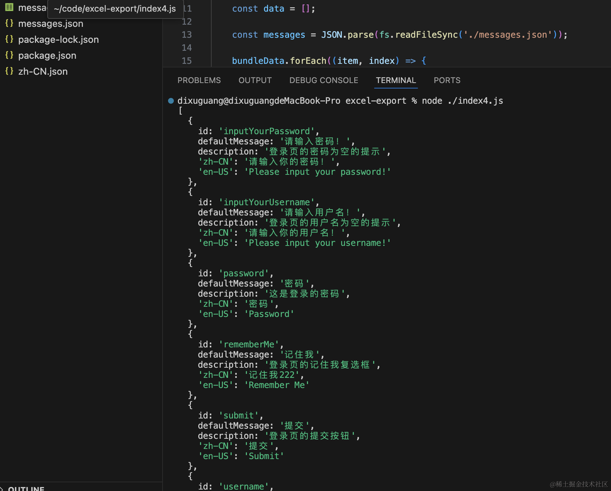

可以看到，生成了 message.csv 文件。

然后在 google sheet 里导入：


你可以点开这个链接看一下：

https://docs.google.com/spreadsheets/d/1FgCNmoTz9FWuR6Jv1SJ9ioWd2bBfrtRAeoi5CYpmXBA/edit?usp=sharing

改一下这个文案：

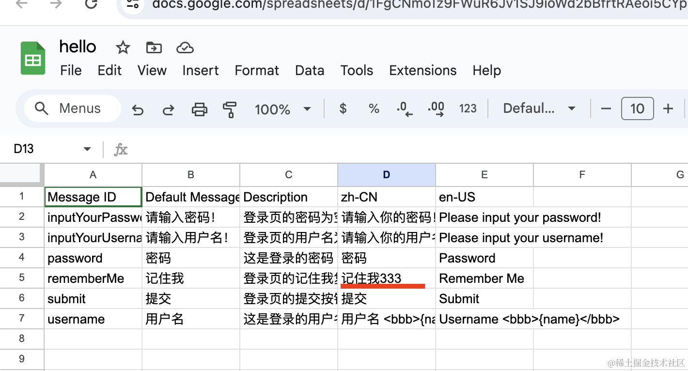

然后导出到本地再转成 json 就好了。

怎么导出呢？

在现在的 url 后加一个 export?format=csv 就好了：

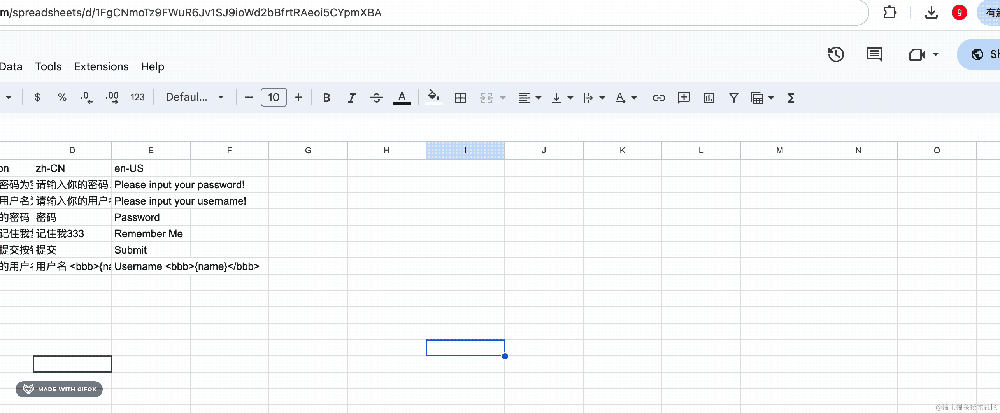

比如这个链接： https://docs.google.com/spreadsheets/d/1FgCNmoTz9FWuR6Jv1SJ9ioWd2bBfrtRAeoi5CYpmXBA/export?format=csv

然后在代码里下载下导出的 csv：

index5.js

```javascript
const { execSync } = require('child_process');
const { parse } = require("csv-parse/sync");
const fs = require('fs');

const sheetUrl = "https://docs.google.com/spreadsheets/d/1FgCNmoTz9FWuR6Jv1SJ9ioWd2bBfrtRAeoi5CYpmXBA";

execSync(`curl -L ${sheetUrl}/export?format=csv -o ./message2.csv`, {
    stdio: 'ignore'
});

const input = fs.readFileSync("./message2.csv");

const records = parse(input, { columns: true });

console.log(records);
```

这里用 curl 命令来下载，-L 是自动跳转的意思，因为访问这个 url 会跳转一个新的地址。

安装用到的包：

```
npm install --save-dev csv-parse
```
跑一下：

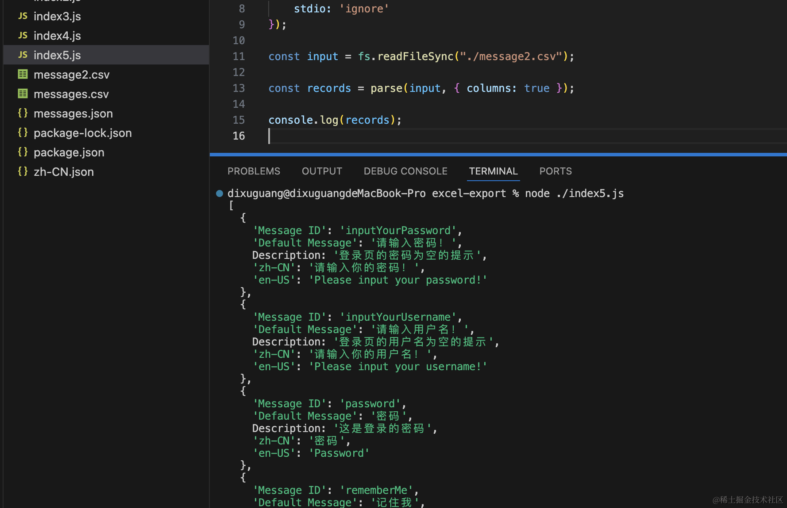

可以看到，message2.csv 下载了下来，并且还解析出了其中的数据。

接下来用这个生成 zh-CN.json 和 en-US.json，然后在项目里用就好了。

```javascript
const { execSync } = require('child_process');
const { parse } = require("csv-parse/sync");
const fs = require('fs');

const sheetUrl = "https://docs.google.com/spreadsheets/d/1FgCNmoTz9FWuR6Jv1SJ9ioWd2bBfrtRAeoi5CYpmXBA";

execSync(`curl -L ${sheetUrl}/export?format=csv -o ./message2.csv`, {
    stdio: 'ignore'
});

const input = fs.readFileSync("./message2.csv");

const data = parse(input, { columns: true });

const zhCNBundle = {};
const enUSBundle = {};

data.forEach(item => {
    const keys = Object.keys(item);
    const key = item[keys[0]];
    const valueZhCN = item[keys[3]];
    const valueEnUS = item[keys[4]];

    zhCNBundle[key] = valueZhCN;
    enUSBundle[key] = valueEnUS;
})

console.log(zhCNBundle);
console.log(enUSBundle);

fs.writeFileSync('zh-CN.json', JSON.stringify(zhCNBundle, null, 2));
fs.writeFileSync('en-US.json', JSON.stringify(enUSBundle, null, 2));
```

跑一下：

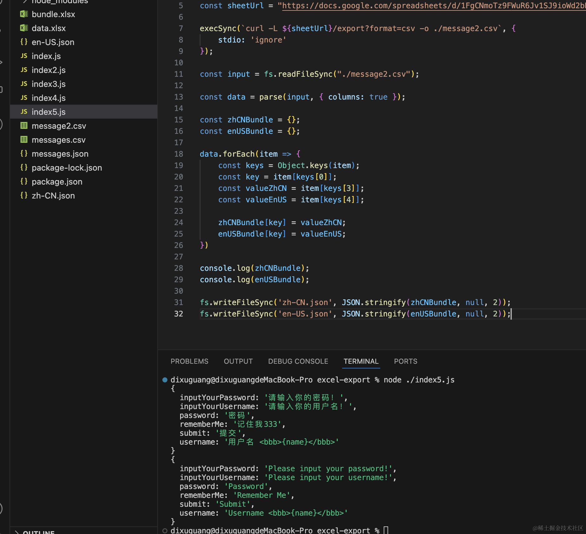

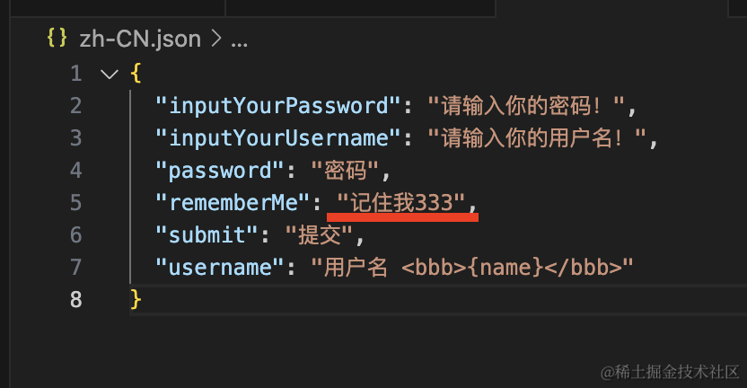

这样，就完成了资源包在 google sheet 的在线编辑，以及编辑完以后下载并解析生成资源包的功能。

相比用 exceljs 生成 excel 文件的方式，google sheet 可以把 url 分享出去，可以协同编辑，更方便一点。

案例代码上传了[小册仓库](https://github.com/QuarkGluonPlasma/react-course-code/tree/main/excel-export)

## 总结

国际化资源包需要交给产品经理去翻译，我们会把 json 转成 excel 交给他。

我们先用 exceljs 实现了 excel 的解析和生成，编辑完之后再转成 en-US.json、zh-CN.json 的资源包。

然后用 google sheet 实现了在线编辑和分享，编辑完之后下载并解析 csv，然后转成 en-US.json、zh-CN.json 的资源包。

用到了 csv-parse、csv-stingify。

这两种方案都可以，确定好方案之后把这些脚本内置到项目里就可以了。
