学了很多技术之后，这节来综合练习下，做个 Todo List。

当然，不是普通的那种，而是拖拽版：

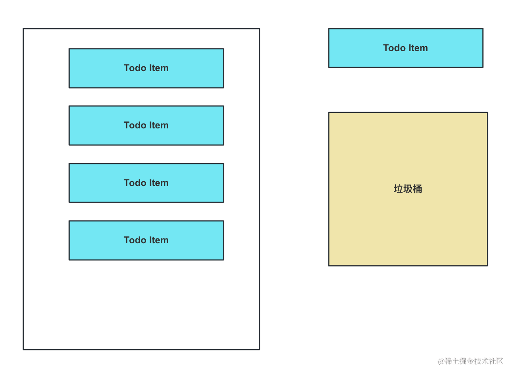

可以拖拽右边的 Todo Item 到列表里：

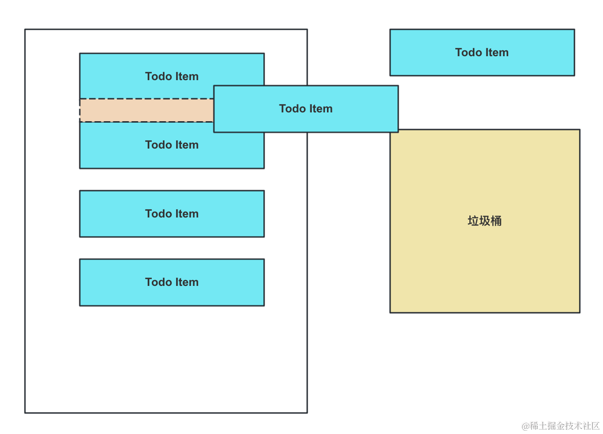

拖拽到空白区域的时候，会高亮标出，松手后插入到该位置。

或者也可以拖动列表中的 TodoItem 调整顺序。

还可以拖到垃圾箱删除：

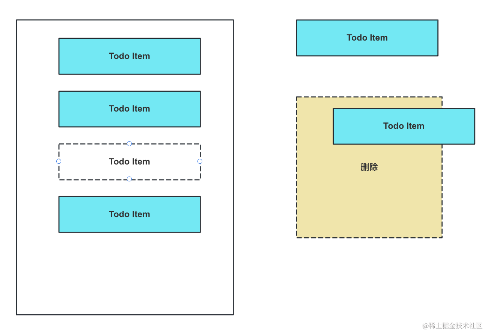

当拖动过来或者双击 TodoItem 的时候，可以进入编辑模式：

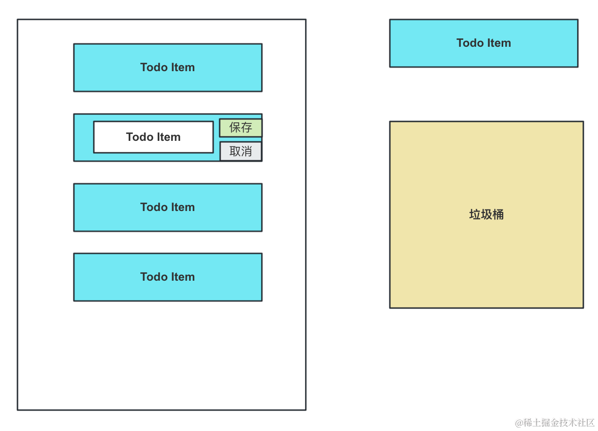

此外，Todo Item 勾选后代表完成：

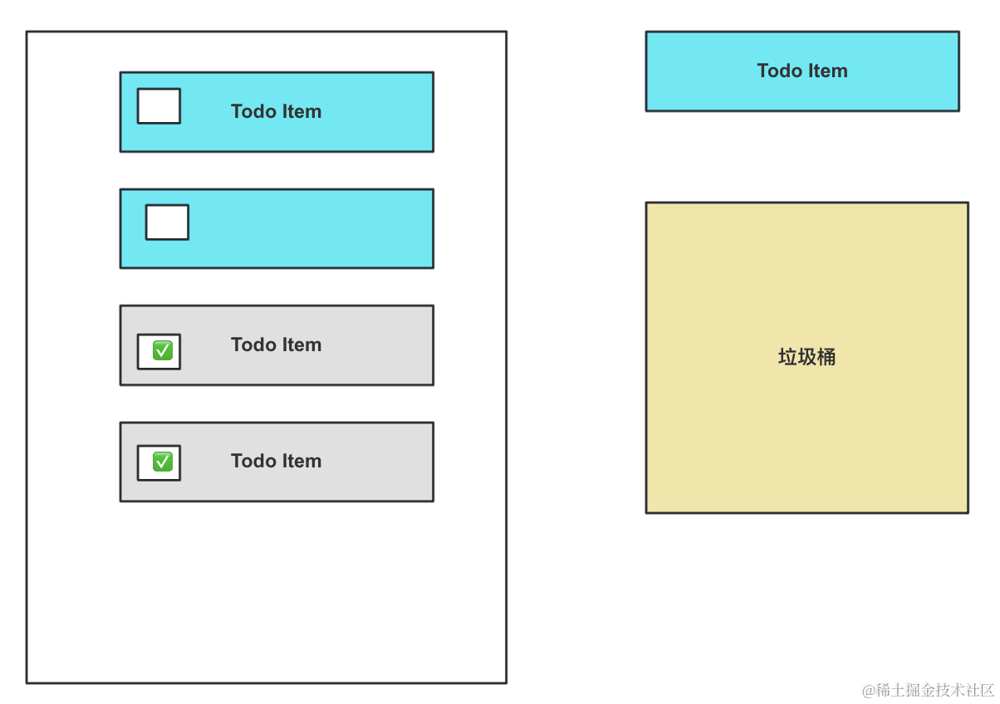

技术栈用 react-dnd + zustand + tailwind + react-spring。

列表的数据都在 Store 里存储：

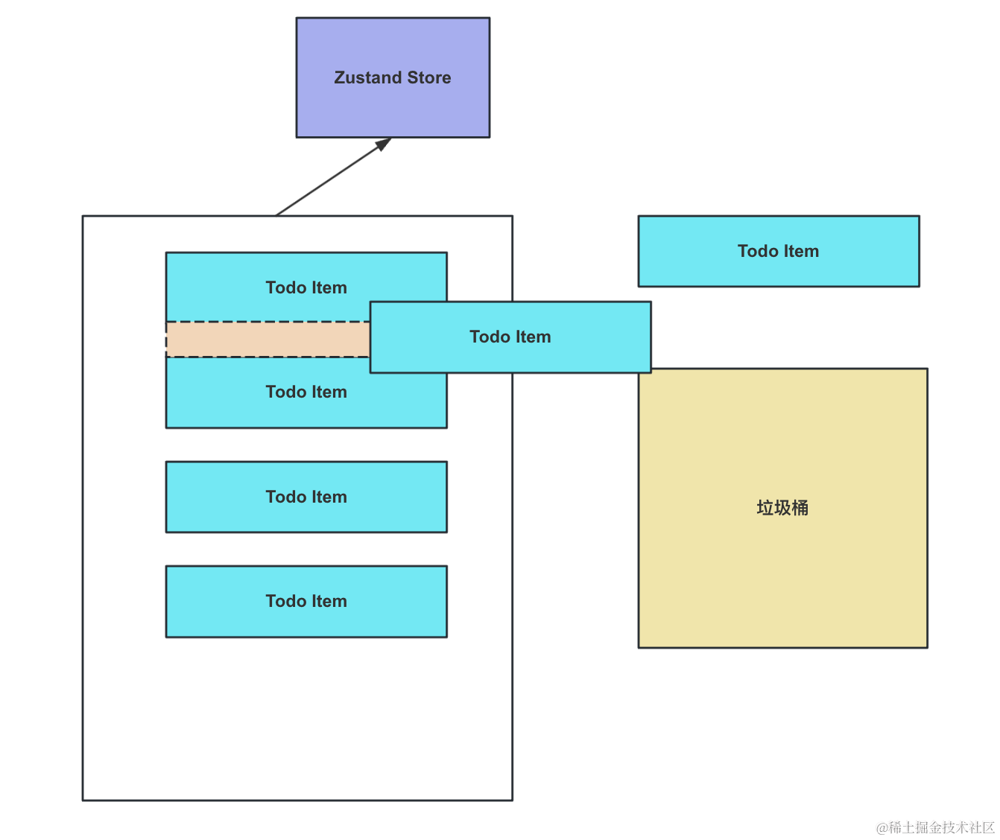

增删改之后修改 Store 里的数据。

用 React Dnd 来做拖拽。

用 react-spring 实现过渡动画。

样式使用 Tailwind 的原子化样式来写。

需求理清了，我们正式上手写：

```
npx create-vite
```

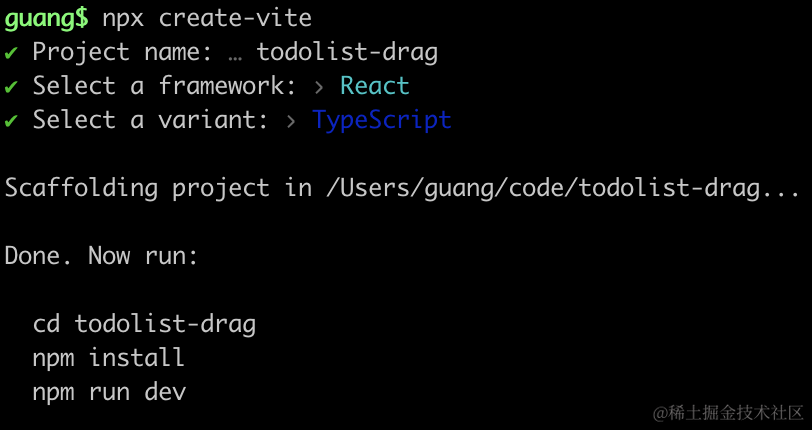

进入项目，去掉 StrictMode：

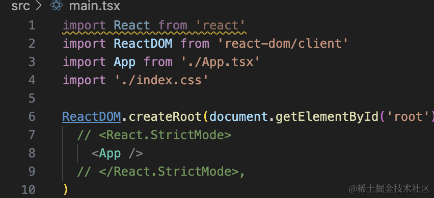

然后新建 TodoList/index.tsx 组件：

```javascript
import { FC } from "react";

interface TodoListProps {

}

export const TodoList:FC<TodoListProps> = (props) => {
    
    return <div></div>
}
```

按照 [tailwind 文档](https://www.tailwindcss.cn/docs/guides/vite#react)里的步骤安装 tailwind：

```javascript
npm install -D tailwindcss postcss autoprefixer

npx tailwindcss init -p
```

会生成 tailwind 和 postcss 配置文件：

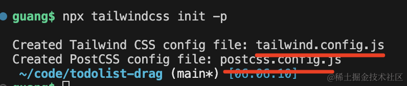

修改下 content 配置，也就是从哪里提取 className：

```javascript
/** @type {import('tailwindcss').Config} */
export default {
  content: [
    "./index.html",
    "./src/**/*.{js,ts,jsx,tsx}",
  ],
  theme: {
    extend: {},
  },
  plugins: [],
}
```
前面 [tailwind 那节](https://juejin.cn/book/7294082310658326565)讲过，tailwind 会提取 className 之后按需生成最终的 css。

改下 index.css 引入 tailwind 基础样式：

```css
@tailwind base;
@tailwind components;
@tailwind utilities;
```

安装 tailwind 插件之后：


在写代码的时候就会提示 className 和对应的样式值：

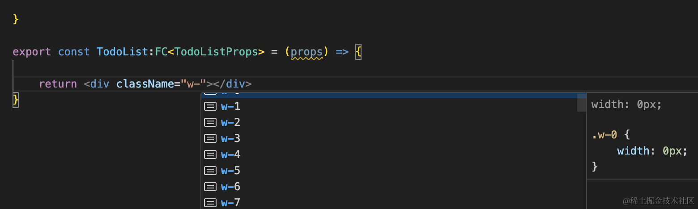

这个插件触发提示需要先敲一个空格，这点要注意下：

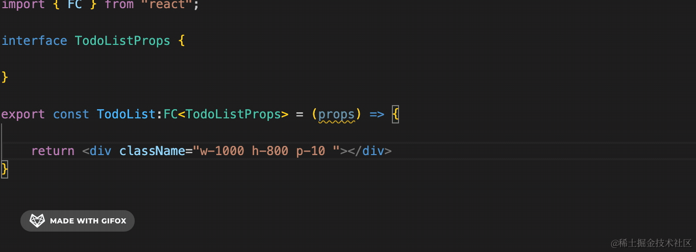

有的你不知道 className 叫啥的样式，还可以在 [tailwind 文档](https://www.tailwindcss.cn/docs/border-width)里搜：


改下 TodoList 的样式：

```javascript
import { FC } from "react";

interface TodoListProps {

}

export const TodoList:FC<TodoListProps> = (props) => {

    return <div className="w-1000 h-600 m-auto mt-100 p-10 border-2 border-black"></div>
}
```
设置 width 1000，height 600，margin-top 100 padding 10 然后 border 2

在 App.tsx 引入下：

```javascript
import { TodoList } from './TodoList'

function App() {

  return <TodoList></TodoList>
}

export default App
```

把开发服务跑起来：

```
npm install

npm run dev
```
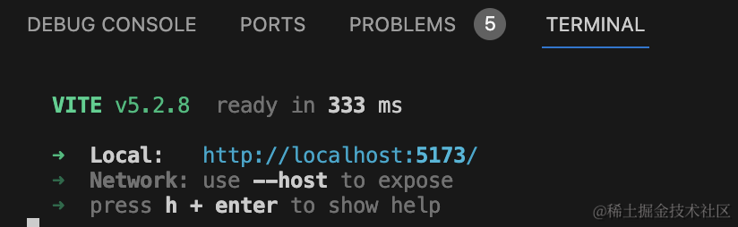

为啥部分样式没生效呢？

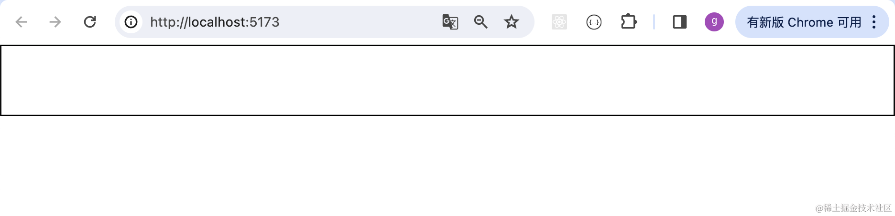

因为像 w-1000 h-600 mt-100 这种，在内置的 className 里并没有。

需要在 tailwind.config.js 里配置下：

```javascript
/** @type {import('tailwindcss').Config} */
export default {
  content: [
    "./index.html",
    "./src/**/*.{js,ts,jsx,tsx}",
  ],
  theme: {
    extend: {
      width: {
        1000: '1000px',
      },
      height: {
        600: '600px'
      },
      margin: {
        100: '100px'
      }
    },
  },
  plugins: [],
}
```
这样就好了：

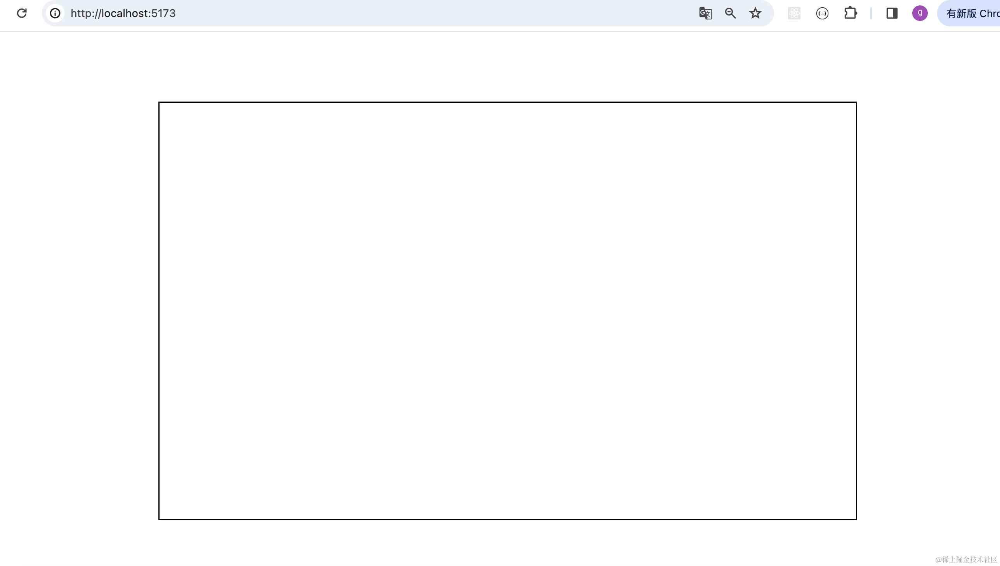

然后继续写布局：
```javascript
import { FC } from "react";

interface TodoListProps {

}

export const TodoList:FC<TodoListProps> = (props) => {


    return <div className={`
            w-1000 h-600 m-auto mt-100 p-10
            border-2 border-black
            flex justify-between items-start
        `}>
        <div className="flex-2 h-full mr-10 bg-blue-400 overflow-auto">
        </div>

        <div className="flex-1 h-full bg-blue-400">

        </div>
    </div>
}
```

父元素 display:flex，然后 子元素分别 2 和 1 的比例，设置 margin-right:10px

这里 h-full 是 height:100%


flex-2 要配置下：

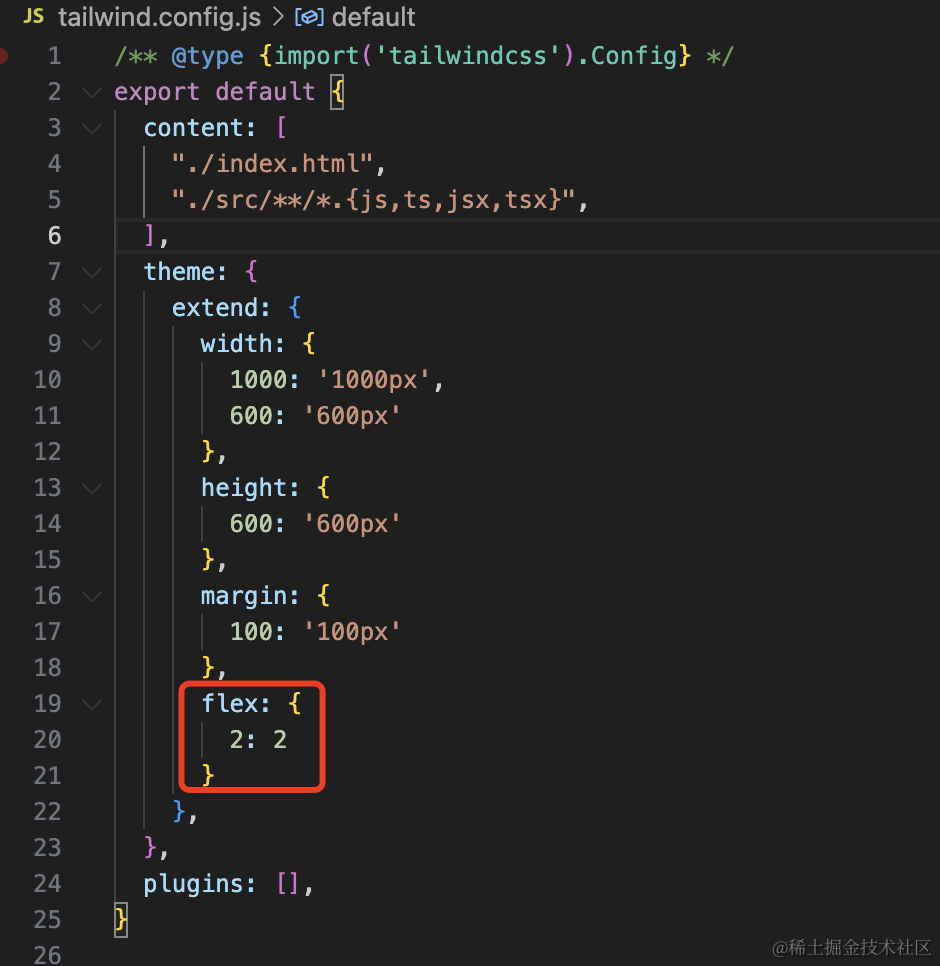

看一下：
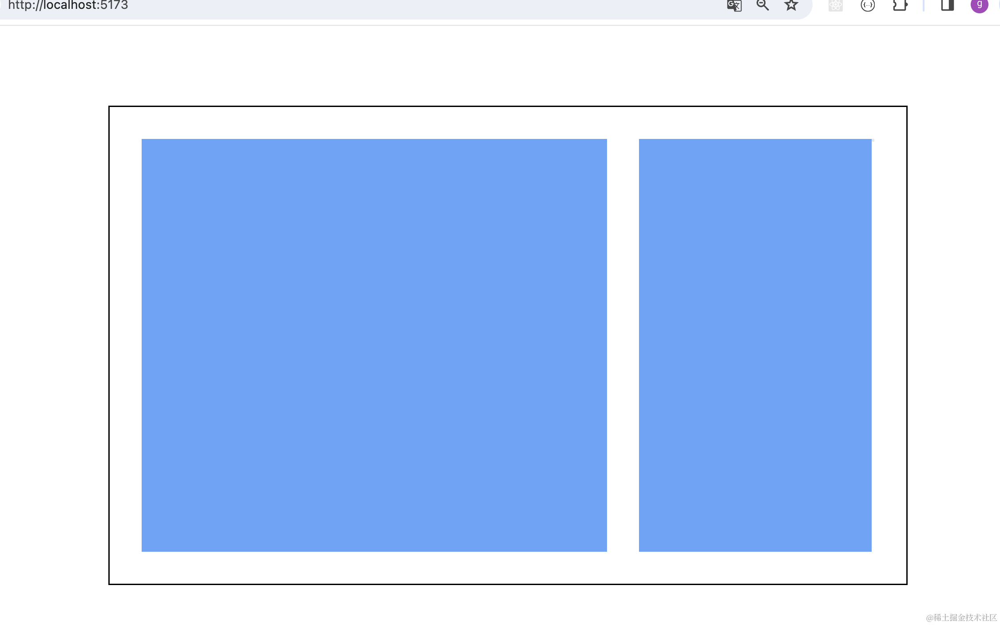

你会发现 margin 和 padding 都不是 10px，而是 2.5rem

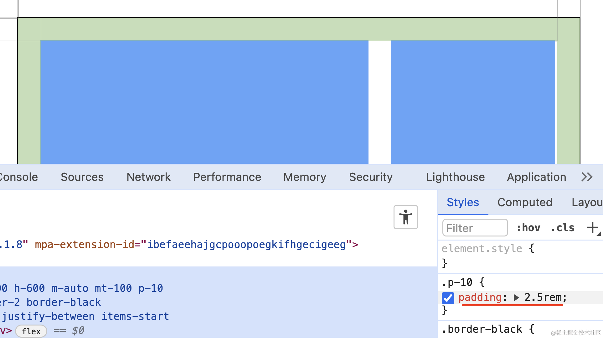

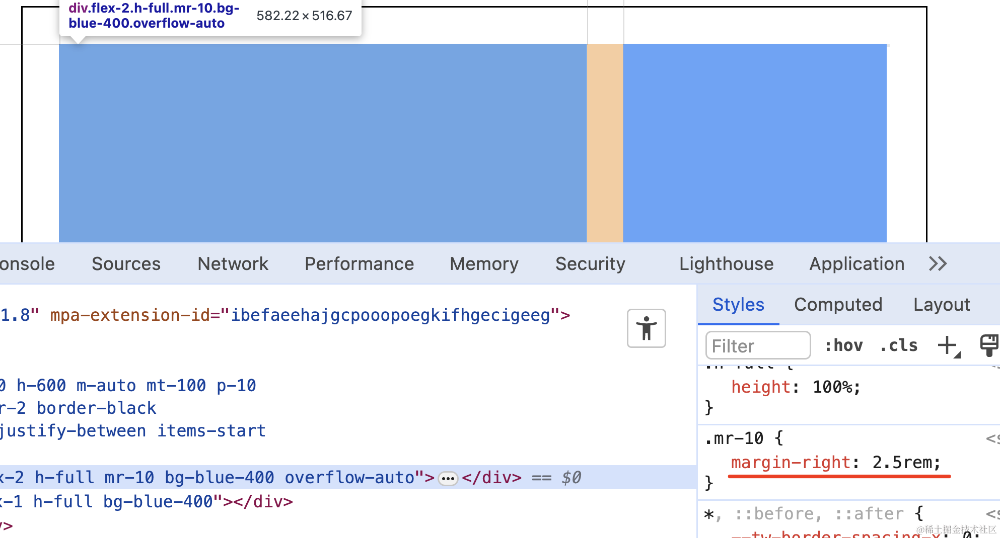

我们在 tailwind.config.js 里覆盖下：

```javascript
/** @type {import('tailwindcss').Config} */
export default {
  content: [
    "./index.html",
    "./src/**/*.{js,ts,jsx,tsx}",
  ],
  theme: {
    extend: {
      width: {
        1000: '1000px',
        600: '600px'
      },
      height: {
        600: '600px'
      },
      margin: {
        100: '100px',
        10: '10px'
      },
      padding: {
        10: '10px'
      },
      flex: {
        2: 2
      }
    },
  },
  plugins: [],
}
```
这样就好了：

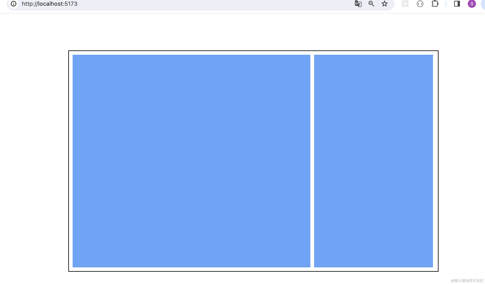

然后去掉背景颜色，添加 List、GarbageBin、NewItem 这三个组件：

```javascript
import { FC } from "react";
import classNames from "classnames";
import { NewItem } from "./NewItem";
import { GarbageBin } from "./GarbageBin";
import { List } from "./List";

interface TodoListProps {

}

export const TodoList:FC<TodoListProps> = (props) => {


    return <div className={classNames(
            "w-1000 h-600 m-auto mt-100 p-10",
            "border-2 border-black",
            "flex justify-between items-start"
        )}>
        <div className="flex-2 h-full mr-10 overflow-auto">
            <List/>
        </div>

        <div className={classNames(
            "flex-1 h-full",
            "flex flex-col justify-start"
        )}>
            <NewItem/>
            <GarbageBin className={"mt-100"}/>
        </div>
    </div>
}
```
这里多行 className 换成用 classnames 包来写。

```
npm install --save classnames
```
分别添加 GarbageBin.tsx

```javascript
import classNames from "classnames"
import { FC } from "react"

interface GarbaseProps{
    className?: string | string[]
}

export const GarbageBin: FC<GarbaseProps> = (props) => {
    
    const cs = classNames(
        "h-100 border-2 border-black",
        props.className
    );

    return <div className={cs}></div>
}
```
NewItem.tsx

```javascript
import classNames from "classnames"
import { FC } from "react"

interface NewItemProps{
    className?: string | string[]
}

export const NewItem: FC<NewItemProps> = (props) => {
    
    const cs = classNames(
        "h-200 border-2 border-black",
        props.className
    );

    return <div className={cs}></div>
}
```
还有 List.tsx

```javascript
import classNames from "classnames"
import { FC } from "react"

interface ListProps{
    className?: string | string[]
}

export const List: FC<ListProps> = (props) => {
    
    const cs = classNames(
        "h-full border-2 border-black",
        props.className
    );

    return <div className={cs}></div>
}
```

这里的 h-200、h-100 要在配置文件里加一下：

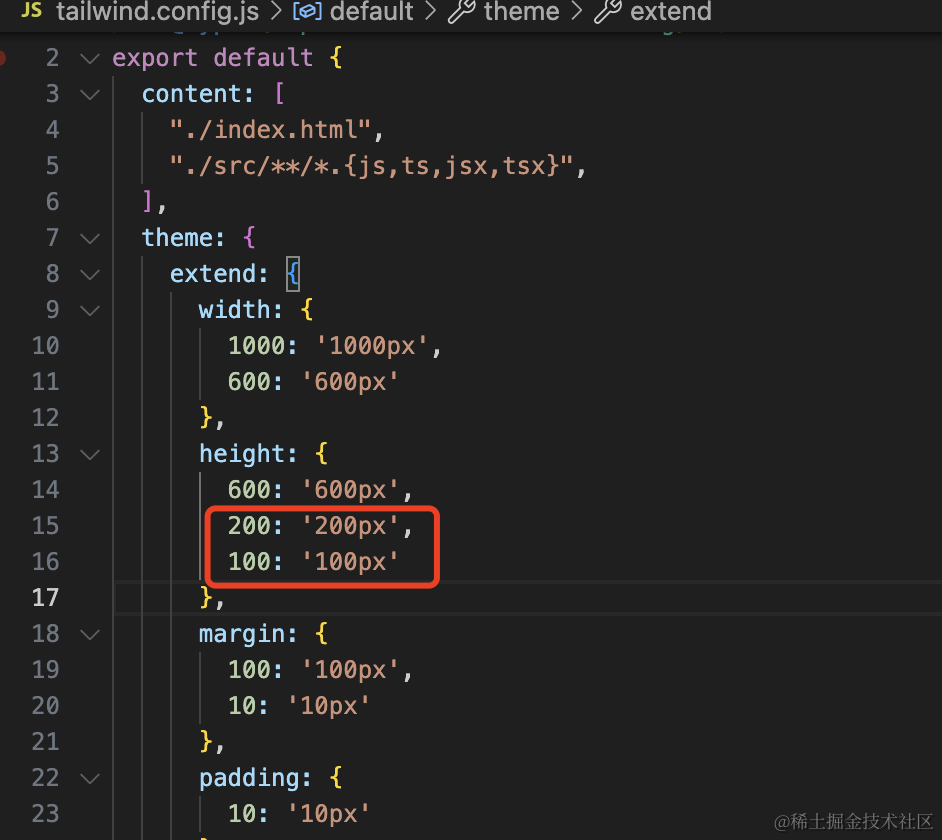

现在界面是这样的：

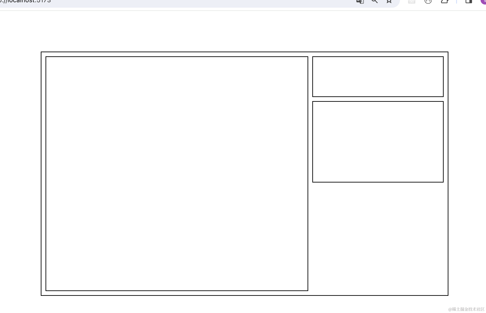

然后先来实现 List 组件部分：

```javascript
import classNames from "classnames"
import { FC } from "react"

interface ListProps{
    className?: string | string[]
}

export const List: FC<ListProps> = (props) => {
    
    const cs = classNames(
        "h-full p-10",
        props.className
    );

    return <div className={cs}>
        <Item/>
        <Item/>
        <Item/>
        <Item/>
        <Item/>
        <Item/>
        <Item/>
    </div>
}

function Item() {
    return <div className={classNames(
        "h-100 border-2 border-black bg-blue-300 mb-10 p-10",
        "flex justify-start items-center",
        "text-xl tracking-wide"
    )}>
        <input type="checkbox" className="w-40 h-40 mr-10"/>
        <p>待办事项</p>
    </div>
}
```

配置文件加一下 w-40、h-40 的配置：

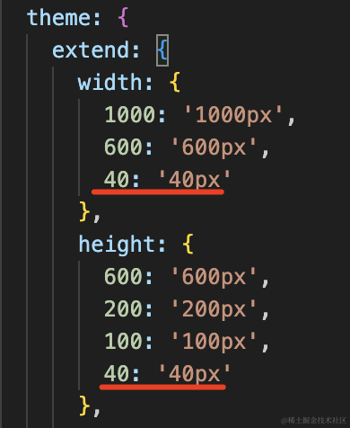

看下效果：

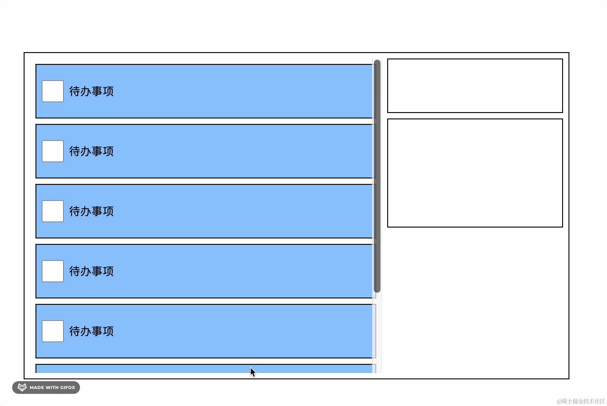

里面用到的 className 可以去查 [tailwind 文档](https://www.tailwindcss.cn/docs/user-select)。

然后是 NewItem 组件：

```javascript
import classNames from "classnames"
import { FC } from "react"

interface NewItemProps{
    className?: string | string[]
}

export const NewItem: FC<NewItemProps> = (props) => {
    
    const cs = classNames(
        "h-100 border-2 border-black",
        "leading-100 text-center text-2xl",
        "bg-green-300",
        "cursor-move select-none",
        props.className
    );

    return <div className={cs}>新的待办事项</div>
}
```
GarbageBin 组件：

```javascript
import classNames from "classnames"
import { FC } from "react"

interface GarbaseProps{
    className?: string | string[]
}

export const GarbageBin: FC<GarbaseProps> = (props) => {
    
    const cs = classNames(
        "h-200 border-2 border-black",
        "bg-orange-300",
        "leading-200 text-center text-2xl",
        "cursor-move select-none",
        props.className
    );

    return <div className={cs}>垃圾箱</div>
}
```
在配置文件里加一下两个 line-height：

```javascript
/** @type {import('tailwindcss').Config} */
export default {
  content: [
    "./index.html",
    "./src/**/*.{js,ts,jsx,tsx}",
  ],
  theme: {
    extend: {
      width: {
        1000: '1000px',
        600: '600px',
        40: '40px'
      },
      height: {
        600: '600px',
        200: '200px',
        100: '100px',
        40: '40px'
      },
      margin: {
        100: '100px',
        10: '10px'
      },
      padding: {
        10: '10px'
      },
      flex: {
        2: 2
      },
      lineHeight: {
        100: '100px',
        200: '200px'
      }
    },
  },
  plugins: [],
}
```

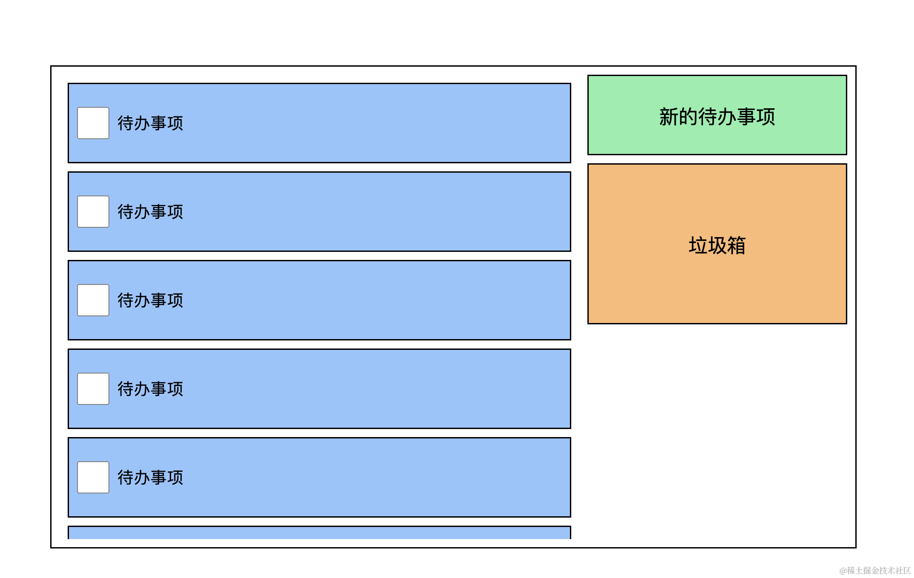

其实这些 width、height、margin、padding 的值的覆盖可以统一放到 spacing 里：

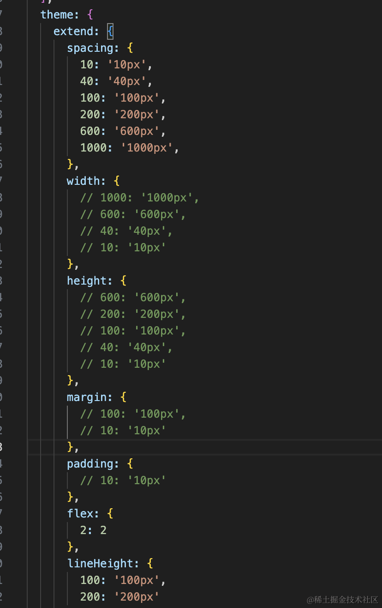

```javascript
/** @type {import('tailwindcss').Config} */
export default {
  content: [
    "./index.html",
    "./src/**/*.{js,ts,jsx,tsx}",
  ],
  theme: {
    extend: {
      spacing: {
        10: '10px',
        40: '40px',
        100: '100px',
        200: '200px',
        600: '600px',
        1000: '1000px',
      },
      width: {
        // 1000: '1000px',
        // 600: '600px',
        // 40: '40px',
        // 10: '10px'
      },
      height: {
        // 600: '600px',
        // 200: '200px',
        // 100: '100px',
        // 40: '40px',
        // 10: '10px'
      },
      margin: {
        // 100: '100px',
        // 10: '10px'
      },
      padding: {
        // 10: '10px'
      },
      flex: {
        2: 2
      },
      lineHeight: {
        100: '100px',
        200: '200px'
      }
    },
  },
  plugins: [],
}
```

[tailwind 文档](https://www.tailwindcss.cn/docs/customizing-spacing)里写了，很多样式都继承 spacing 的配置：

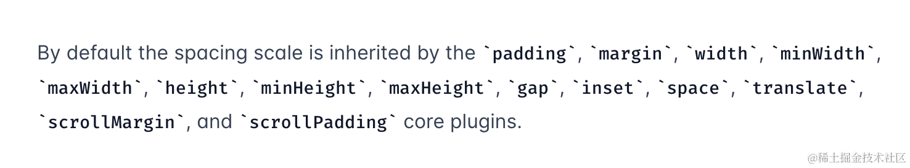

或者不想全局改默认配置，也可以用 text-[14px] 这种方式。

text-[14px] 就会生成 font-size:14px 的样式：

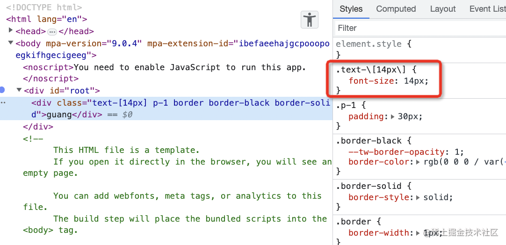

接下来加上 react-dnd 来做拖拽。

安装用到的包：

```
npm install react-dnd react-dnd-html5-backend
```
在 main.tsx 引入下 DndProvider

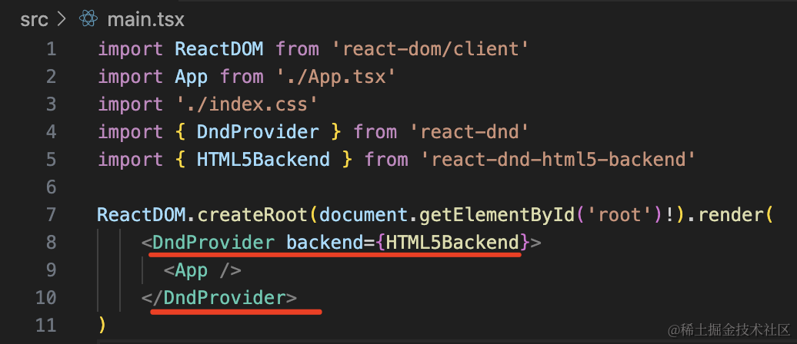

```javascript
import ReactDOM from 'react-dom/client'
import App from './App.tsx'
import './index.css'
import { DndProvider } from 'react-dnd'
import { HTML5Backend } from 'react-dnd-html5-backend'

ReactDOM.createRoot(document.getElementById('root')!).render(
    <DndProvider backend={HTML5Backend}>
      <App />
    </DndProvider>
)
```
它是 react-dnd 用来跨组件传递数据的。

在 NewItem.tsx 组件里用 useDrag 添加拖拽：
```javascript
import classNames from "classnames"
import { FC, useEffect, useRef } from "react"
import { useDrag } from "react-dnd";

interface NewItemProps{
    className?: string | string[]
}

export const NewItem: FC<NewItemProps> = (props) => {

    const ref = useRef<HTMLDivElement>(null);

    const [{ dragging }, drag] = useDrag({
        type: 'new-item',
        item: {},
        collect(monitor) {
            return {
                dragging: monitor.isDragging()
            }
        }
    });

    useEffect(() => {
        drag(ref);
    }, []);

    const cs = classNames(
        "h-100 border-2 border-black",
        "leading-100 text-center text-2xl",
        "bg-green-300",
        "cursor-move select-none",
        dragging ? 'border-dashed bg-white' : '',
        props.className
    );

    return <div ref={ref} className={cs}>新的待办事项</div>
}
```

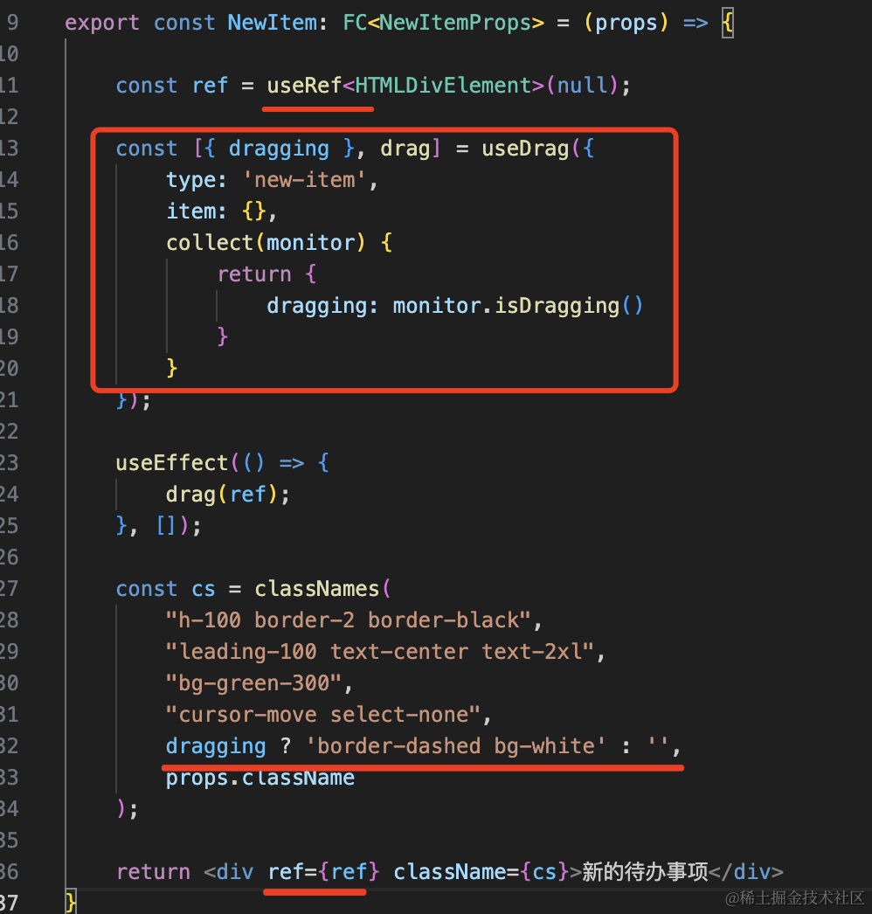

拖动过程中，设置 border 虚线、背景白色。

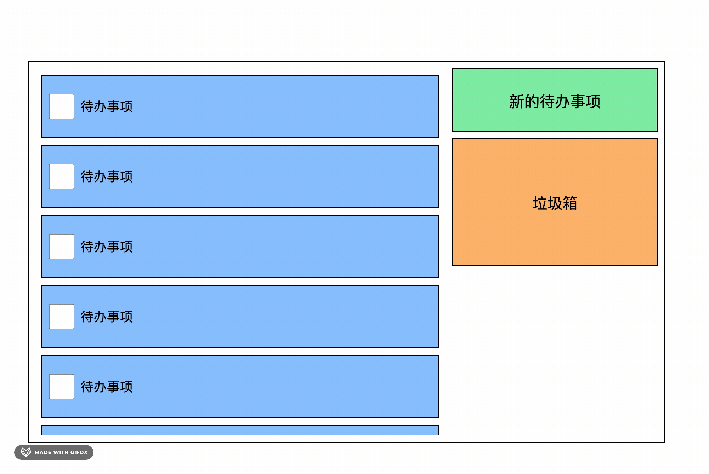

然后在 List 的 Item 也加上 useDrag 拖拽：

```javascript
function Item() {
    const ref = useRef<HTMLDivElement>(null);

    const [{ dragging }, drag] = useDrag({
        type: 'list-item',
        item: {},
        collect(monitor) {
            return {
                dragging: monitor.isDragging()
            }
        }
    });

    useEffect(() => {
        drag(ref);
    }, []);

    return <div ref={ref} className={classNames(
        "h-100 border-2 border-black bg-blue-300 mb-10 p-10",
        "flex justify-start items-center",
        "text-xl tracking-wide",
        dragging ? 'bg-white border-dashed' : ''
    )}>
        <input type="checkbox" className="w-10 h-10 mr-10"/>
        <p>待办事项</p>
    </div>
}
```


在垃圾箱添加 useDrop：

```javascript
import classNames from "classnames"
import { FC, useEffect, useRef } from "react"
import { useDrop } from "react-dnd";

interface GarbaseProps{
    className?: string | string[]
}

export const GarbageBin: FC<GarbaseProps> = (props) => {
    
    const ref = useRef<HTMLDivElement>(null);

    const [{ isOver }, drop] = useDrop(() => {
        return {
            accept: 'list-item',
            drop(item) {},
            collect(monitor) {
                return {
                    isOver: monitor.isOver()
                }
            }
        }
    });

    useEffect(()=> {
        drop(ref);
    }, []);
    

    const cs = classNames(
        "h-200 border-2 border-black",
        "bg-orange-300",
        "leading-200 text-center text-2xl",
        "cursor-move select-none",
        isOver ? "bg-yellow-400 border-dashed" : "",
        props.className
    );

    return <div ref={ref} className={cs}>垃圾箱</div>
}
```
accept 指定了 list-item，只有对应的 type 拖拽到这里才能触发 isOver：


那新的 todo item 拖到哪里呢？

到这里：
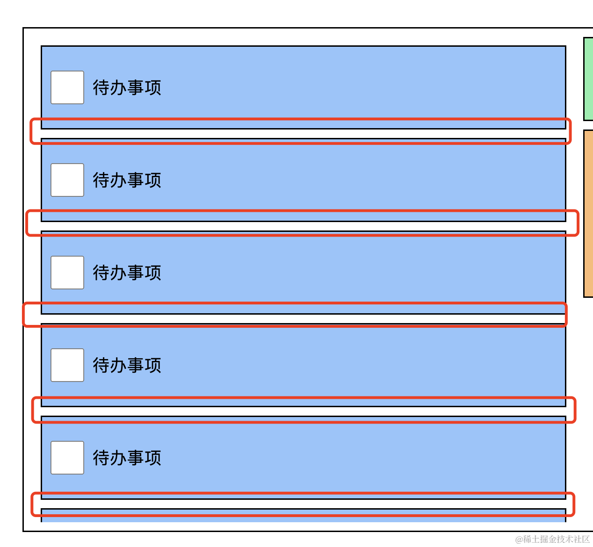

所以我们要把这些地方也新建个组件，然后添加 useDrop：

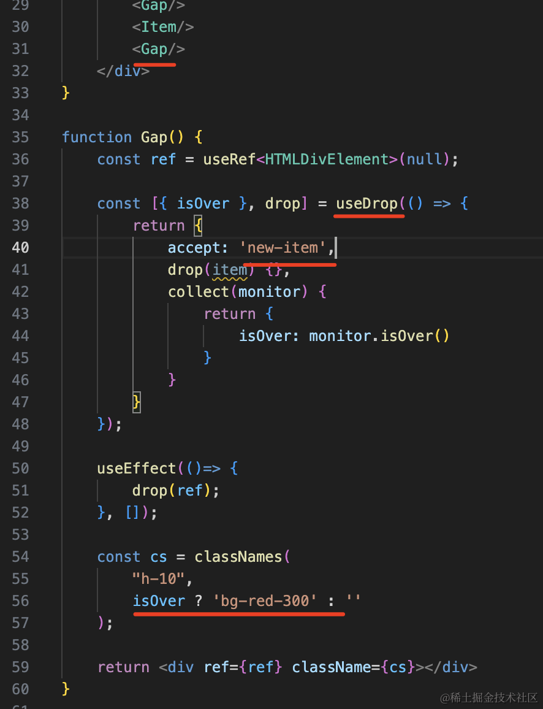

去掉之前 Item 的 mt-10 换成 Gap 的 h-10：

```javascript
import classNames from "classnames"
import { FC, useEffect, useRef } from "react"
import { useDrag, useDrop } from "react-dnd";

interface ListProps{
    className?: string | string[]
}

export const List: FC<ListProps> = (props) => {
    
    const cs = classNames(
        "h-full p-10",
        props.className
    );

    return <div className={cs}>
        <Gap/>
        <Item/>
        <Gap/>
        <Item/>
        <Gap/>
        <Item/>
        <Gap/>
        <Item/>
        <Gap/>
        <Item/>
        <Gap/>
        <Item/>
        <Gap/>
        <Item/>
        <Gap/>
    </div>
}

function Gap() {
    const ref = useRef<HTMLDivElement>(null);

    const [{ isOver }, drop] = useDrop(() => {
        return {
            accept: 'new-item',
            drop(item) {},
            collect(monitor) {
                return {
                    isOver: monitor.isOver()
                }
            }
        }
    });

    useEffect(()=> {
        drop(ref);
    }, []);

    const cs = classNames(
        "h-10",
        isOver ? 'bg-red-300' : ''
    );

    return <div ref={ref} className={cs}></div>
}

function Item() {
    const ref = useRef<HTMLDivElement>(null);

    const [{ dragging }, drag] = useDrag({
        type: 'list-item',
        item: {},
        collect(monitor) {
            return {
                dragging: monitor.isDragging()
            }
        }
    });

    useEffect(() => {
        drag(ref);
    }, []);

    return <div ref={ref} className={classNames(
        "h-100 border-2 border-black bg-blue-300 p-10",
        "flex justify-start items-center",
        "text-xl tracking-wide",
        dragging ? 'bg-white border-dashed' : ''
    )}>
        <input type="checkbox" className="w-40 h-40 mr-10"/>
        <p>待办事项</p>
    </div>
}
```
覆盖下 w-10、h-10 的值，默认是 rem，我们还是用 px：

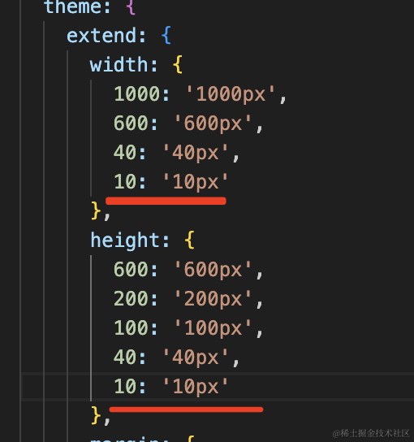

现在 new-item 就能拖过来了：


现在 Gap 和 Item 代码挺多了，分离出去作为单独的模块 Gap.tsx 和 Item.tsx

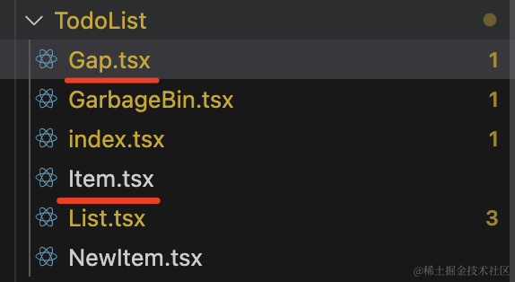

接下来处理下具体的状态逻辑。

安装 zustand：

```
npm install --save zustand
```
创建 TodoList/Store.ts

```javascript
import { create } from 'zustand';

export interface ListItem {
  id: string,
  status: 'todo' | 'done',
  content: string
}

type State = {
  list: Array<ListItem>
}

type Action = {
  addItem: (item: ListItem) => void,
  deleteItem: (id: string) => void,
  updateItem: (item: ListItem) => void,
}

export const useTodoListStore = create<State & Action>((set) => ({
  list: [],
  addItem: (item: ListItem) => {
    set((state) => {
      return {
        list: [
          ...state.list,
          item
        ]
      }
    })
  },
  deleteItem: (id: string) => {
    set((state) => {
      return {
        list: state.list.filter(item => {
          return item.id !== id;
        })
      }
    });
  },
  updateItem: (updateItem: ListItem) => {
    set(state => {
      return {
        list: state.list.map(item => {
          if(item.id === updateItem.id) {
            return updateItem;
          }
          return item;
        })
      }
    })
  }
}))
```
state 就是 list，然后添加 addItem、deleteItem、updateItem 的方法。

在 List 组件里引入下：

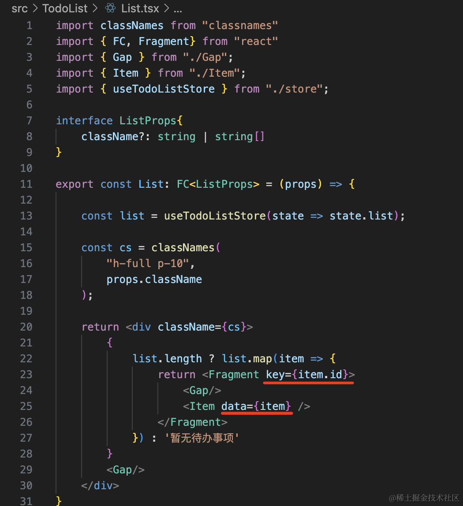

传入 data，顺便指定 key：

```javascript
import classNames from "classnames"
import { FC, Fragment} from "react"
import { Gap } from "./Gap";
import { Item } from "./Item";
import { useTodoListStore } from "./store";

interface ListProps{
    className?: string | string[]
}

export const List: FC<ListProps> = (props) => {
    
    const list = useTodoListStore(state => state.list);

    const cs = classNames(
        "h-full p-10",
        props.className
    );

    return <div className={cs}>
        {
            list.length ? list.map(item => {
                return <Fragment key={item.id}>
                    <Gap/>
                    <Item data={item} />
                </Fragment>
            }) : '暂无待办事项'
        }
        <Gap/>
    </div>
}
```
\<Fragment> 也可以写 <></>，它只是用来给多个 children 包一层，但不会生成 dom 节点。

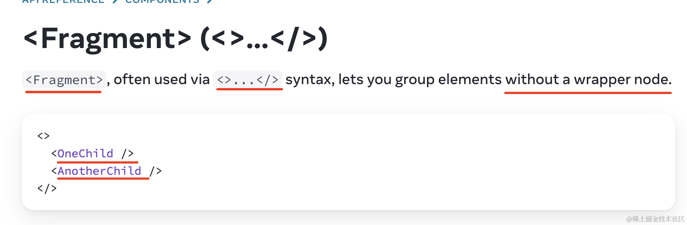

在 Item 组件添加 content 参数：

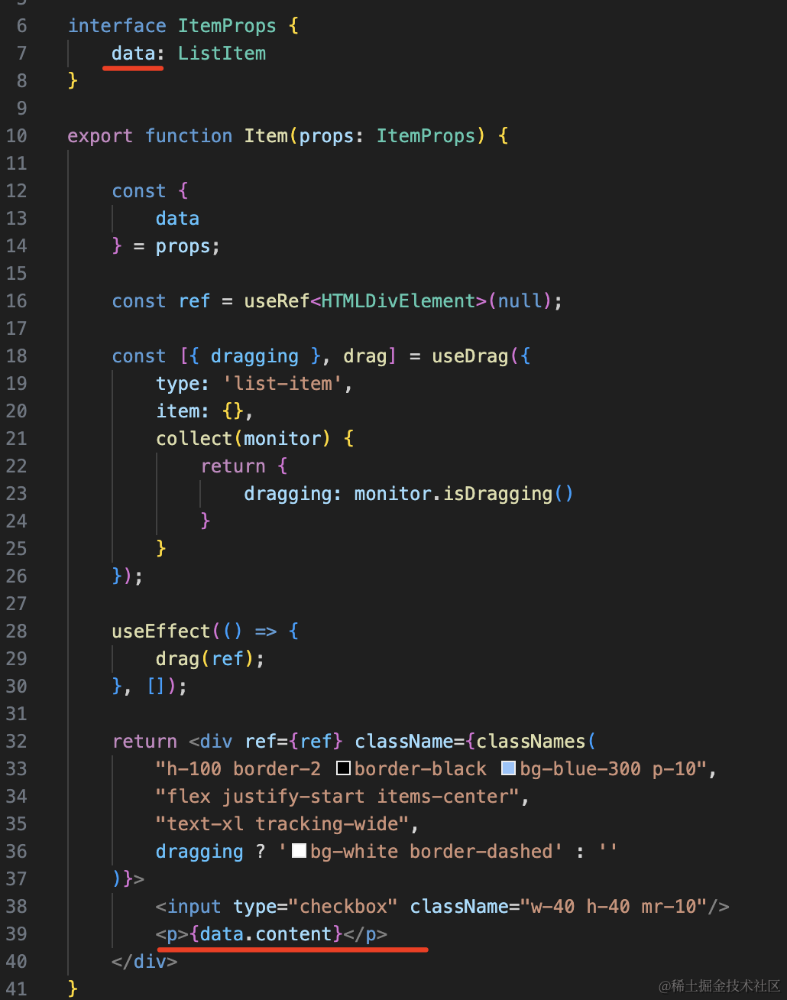

看下效果：

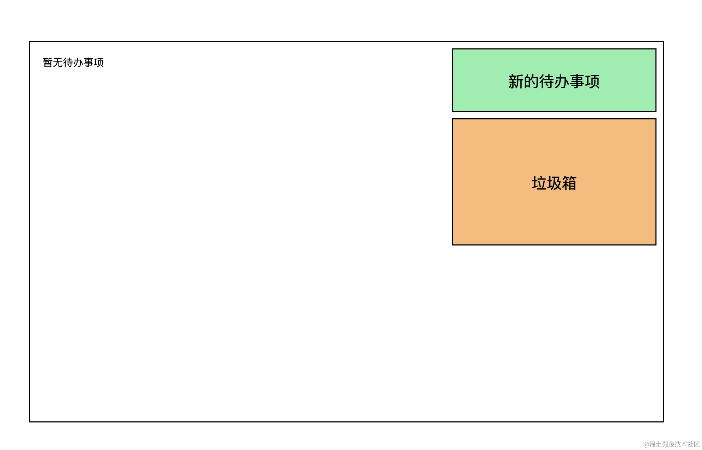

我们加一下添加 item 的处理：

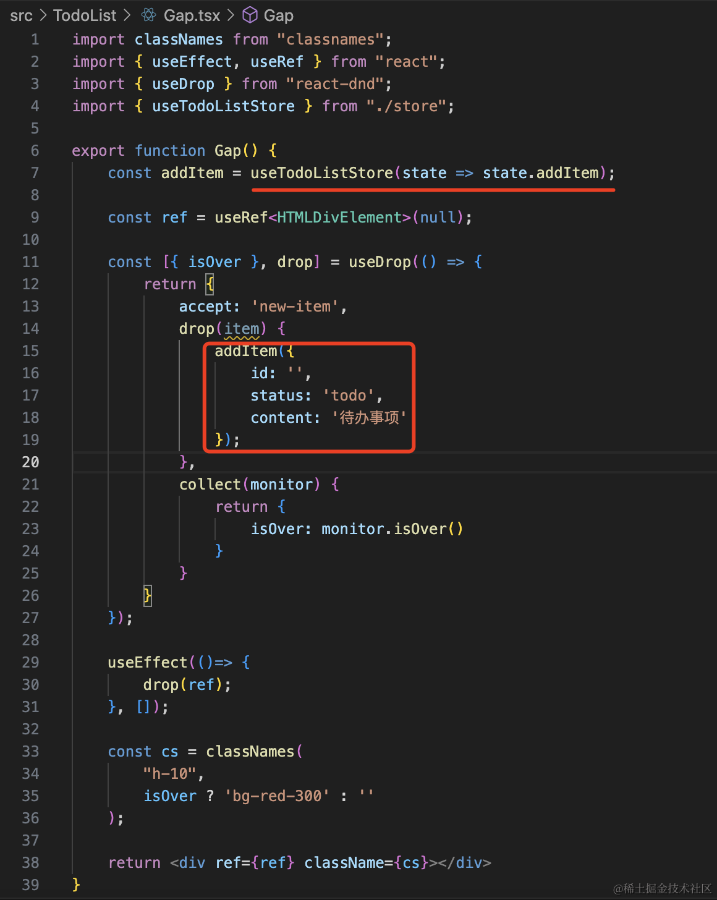

```javascript
import classNames from "classnames";
import { useEffect, useRef } from "react";
import { useDrop } from "react-dnd";
import { useTodoListStore } from "./store";

export function Gap() {
    const addItem = useTodoListStore(state => state.addItem);

    const ref = useRef<HTMLDivElement>(null);

    const [{ isOver }, drop] = useDrop(() => {
        return {
            accept: 'new-item',
            drop(item) {
                addItem({
                    id: Math.random().toString().slice(2, 8),
                    status: 'todo',
                    content: '待办事项'
                });
            },
            collect(monitor) {
                return {
                    isOver: monitor.isOver()
                }
            }
        }
    });

    useEffect(()=> {
        drop(ref);
    }, []);

    const cs = classNames(
        "h-10",
        isOver ? 'bg-red-300' : ''
    );

    return <div ref={ref} className={cs}></div>
}
```

这里用 Math.random 生成 6 位的随机数：

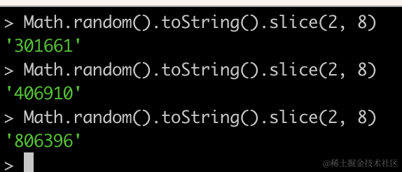

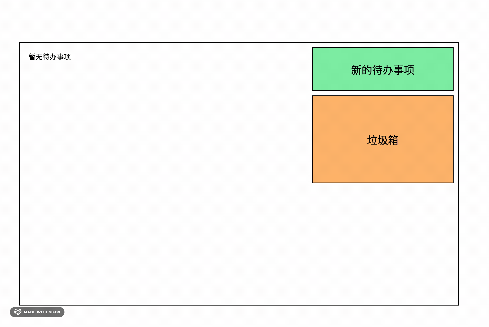

然后加一下删除的处理：

drag 的时候加上传递的数据：

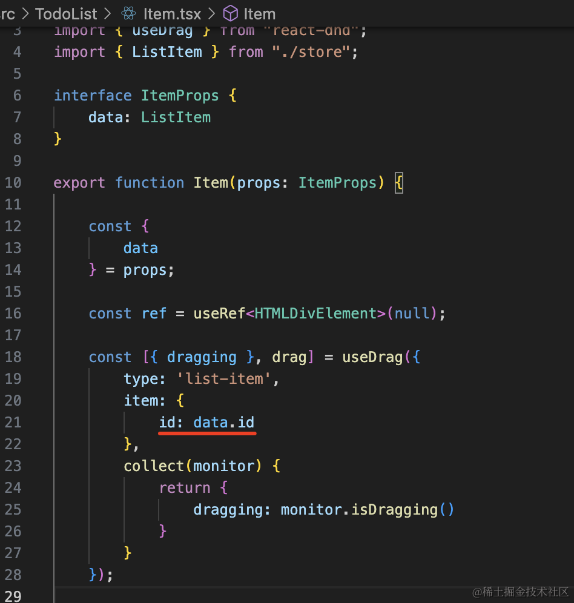

drop 的时候拿到 id 执行删除：

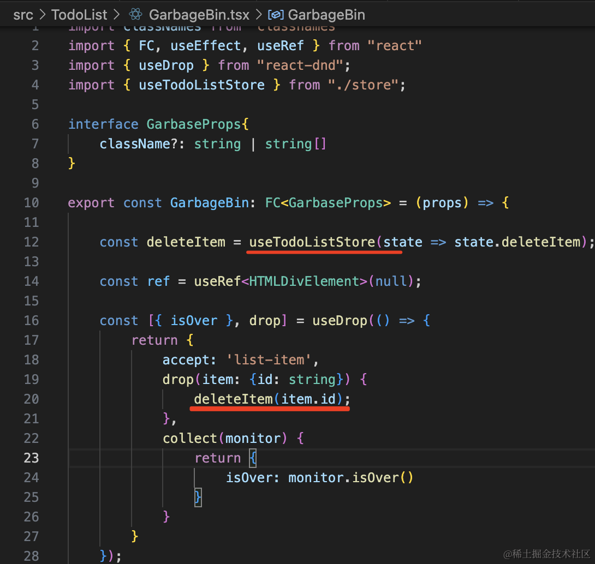

测试下：

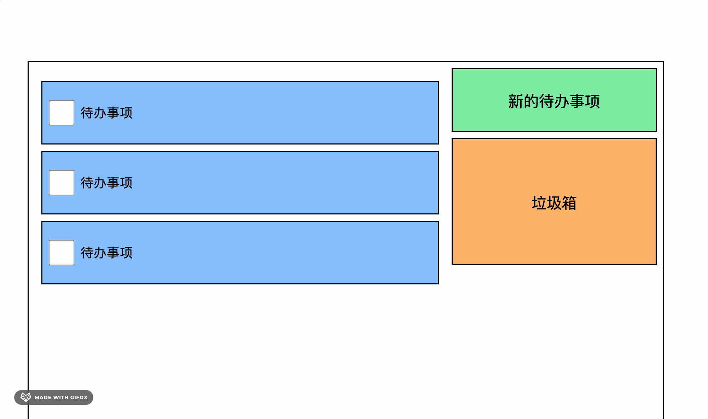

删除也没问题。

然后加上编辑功能：

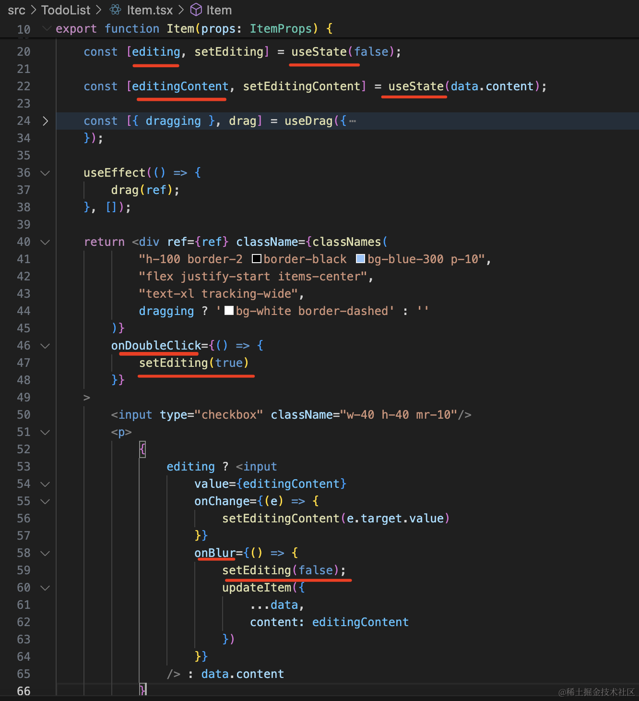

用两个 state 分别保存 editing 状态和 input 内容。

onDoubleClick 的时候显示 input，修改 editing 状态为 true。

onBlur 的时候修改 editing 状态为 false。

并且用 updateItem 更新状态：

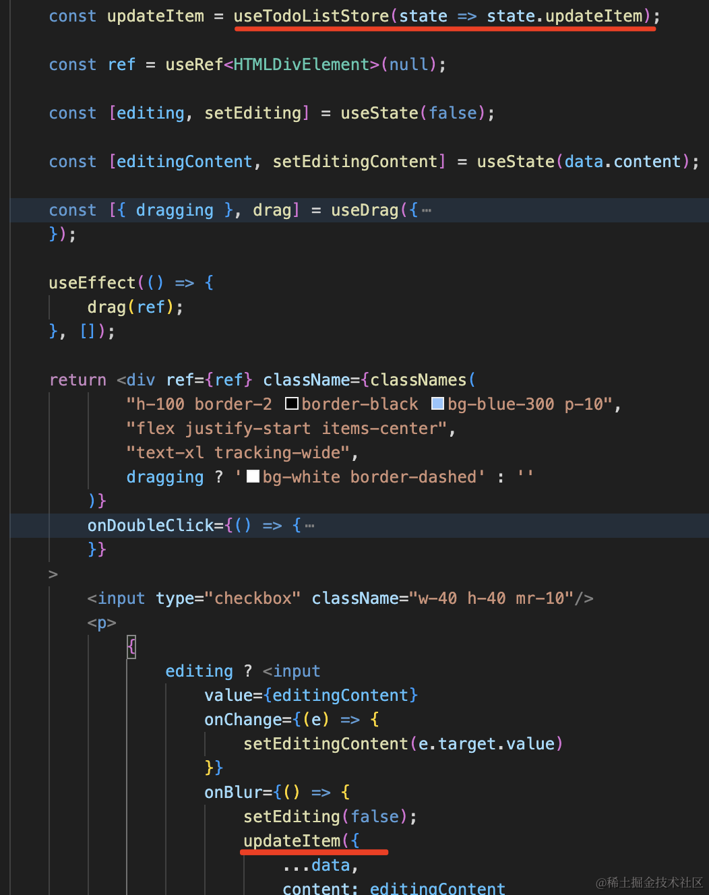

没啥问题：

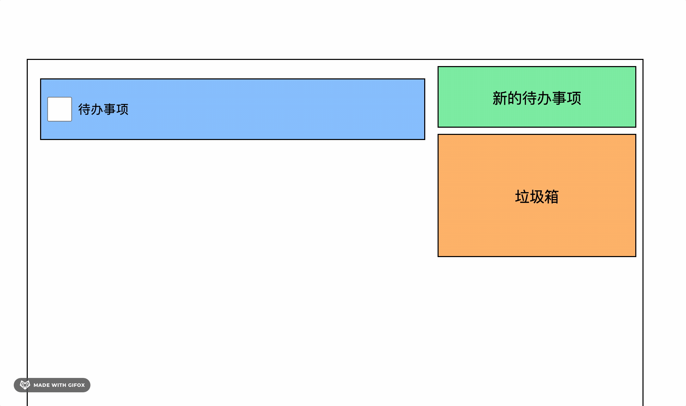

然后当选中 checkbox 的时候，也要 updateItem：

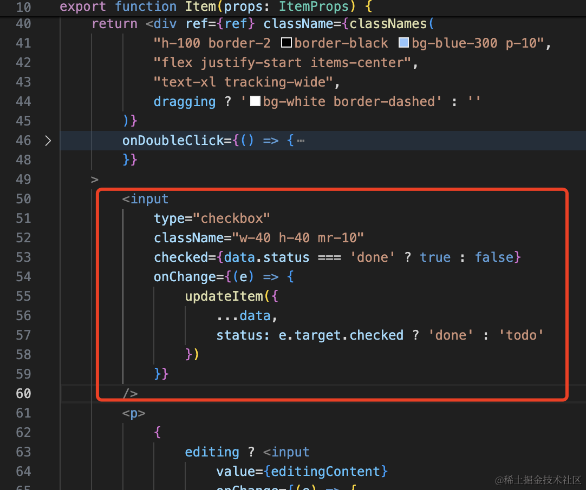

```javascript
import classNames from "classnames";
import { useEffect, useRef, useState } from "react";
import { useDrag } from "react-dnd";
import { ListItem, useTodoListStore } from "./store";

interface ItemProps {
    data: ListItem
}

export function Item(props: ItemProps) {

    const {
        data
    } = props;

    const updateItem = useTodoListStore(state => state.updateItem);

    const ref = useRef<HTMLDivElement>(null);

    const [editing, setEditing] = useState(false);

    const [editingContent, setEditingContent] = useState(data.content);

    const [{ dragging }, drag] = useDrag({
        type: 'list-item',
        item: {
            id: data.id
        },
        collect(monitor) {
            return {
                dragging: monitor.isDragging()
            }
        }
    });

    useEffect(() => {
        drag(ref);
    }, []);

    return <div ref={ref} className={classNames(
            "h-100 border-2 border-black bg-blue-300 p-10",
            "flex justify-start items-center",
            "text-xl tracking-wide",
            dragging ? 'bg-white border-dashed' : ''
        )}
        onDoubleClick={() => {
            setEditing(true)
        }}
    >
        <input 
            type="checkbox" 
            className="w-40 h-40 mr-10"
            checked={data.status === 'done' ? true : false}
            onChange={(e) => {
                updateItem({
                    ...data,
                    status: e.target.checked ? 'done' : 'todo'
                })
            }}
        />
        <p>
            {
                editing ? <input 
                    value={editingContent}
                    onChange={(e) => {
                        setEditingContent(e.target.value)
                    }}
                    onBlur={() => {
                        setEditing(false);
                        updateItem({
                            ...data,
                            content: editingContent
                        })
                    }}
                /> : data.content 
            }
        </p>
    </div>
}
```

还有，现在不管拖动到哪里都是在后面插入：

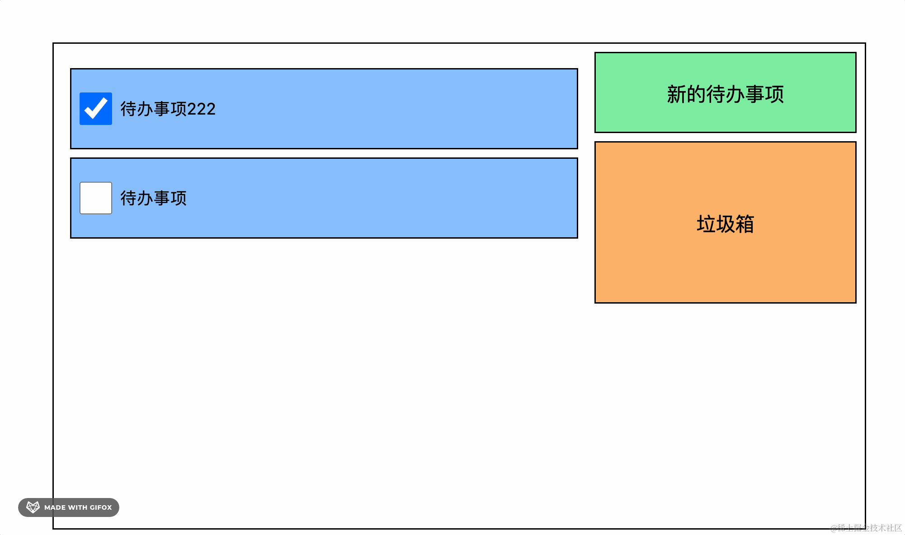

我们希望能根据 drop 的位置来插入：

所以给 Gap 传入 id 参数：

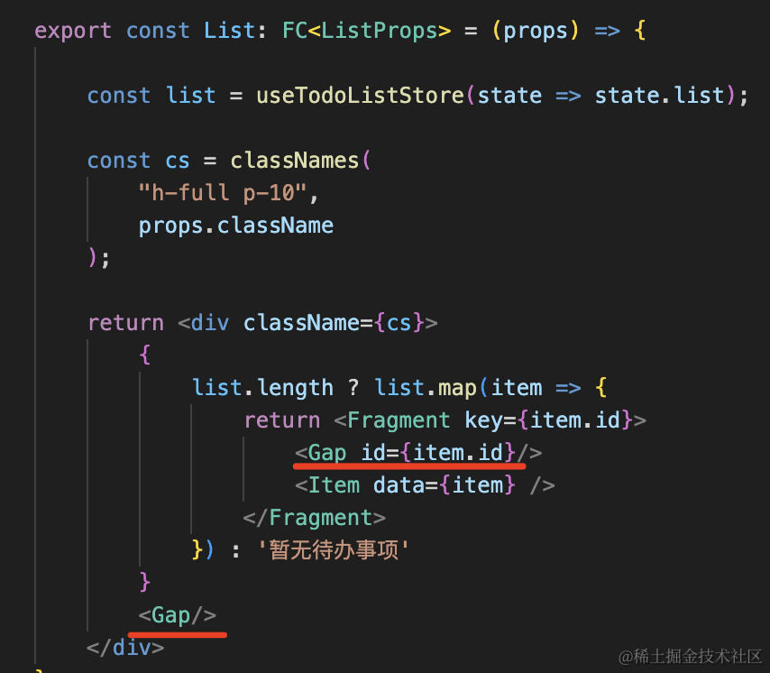

然后 Gap 组件 drop 的时候传入 addItem 方法：


addItem 方法里根据 id 插入：


没有传就插入在后面，否则 findIndex，然后在那个位置插入。

测试下：


没啥问题。

不过 gap 区域有点小，大家实现的时候可以改大一点。

还有，现在一刷新，数据就没了：


我们给 zustand 加上 persist 中间件：


注意，ts + middleware 的场景，zustand 要换这种写法。

[文档的解释](https://github.com/pmndrs/zustand/blob/main/docs/guides/typescript.md)是为了更好的处理类型：


反正功能是一样的。

```javascript
import { StateCreator, create } from 'zustand';
import { persist } from 'zustand/middleware';

export interface ListItem {
  id: string,
  status: 'todo' | 'done',
  content: string
}

type State = {
  list: Array<ListItem>
}

type Action = {
  addItem: (item: ListItem, id?: string) => void,
  deleteItem: (id: string) => void,
  updateItem: (item: ListItem) => void,
}

const stateCreator: StateCreator<State & Action> = (set) => ({
  list: [],
  addItem: (item: ListItem, id?: string) => {
    set((state) => {
      if(!id) {
        return {
          list: [
            ...state.list,
            item
          ]
        }
      }

      const newList = [
        ...state.list, 
      ];

      const index = newList.findIndex(item => item.id === id);

      newList.splice(index, 0, item);

      return {
        list: newList
      }
    })
  },
  deleteItem: (id: string) => {
    set((state) => {
      return {
        list: state.list.filter(item => {
          return item.id !== id;
        })
      }
    });
  },
  updateItem: (updateItem: ListItem) => {
    set(state => {
      return {
        list: state.list.map(item => {
          if(item.id === updateItem.id) {
            return updateItem;
          }
          return item;
        })
      }
    })
  }
});

export const useTodoListStore = create<State & Action>()(persist(stateCreator, {
  name: 'todolist'
}));
```
测试下：


现在，数据就被保存到了 localstorage 中，刷新数据也不会丢失。

这样，拖拽版 TodoList 就完成了。

大家还可以加个拖拽排序功能，和上节实现一样。

最后，我们加上过渡动画，用 react-spring：

```
npm install --save @react-spring/web
```
然后渲染 list 的时候用 react-spring 的 useTransition 的 hook 处理下：


useTransition 会根据传入的配置来生成 style，这些 style 要加在 animated.div 上。

并且，keys 也是在配置里传入的，animated.div 会自动添加。


案例代码上传了[小册仓库](https://github.com/QuarkGluonPlasma/react-course-code/tree/main/todolist-drag)

## 总结

我们用 react-dnd + zustand 实现了拖拽版 todolist。

用 tailwind 来写的样式。

用 @react-spring/web 加上了过渡动画。

这是个综合实战，对 react-dnd、tailwind、zustand、react-spring 都有较全面的应用。
