这节我们开始做一个实战项目：React Playground。

类似 [vue 的 playground](https://play.vuejs.org/)：

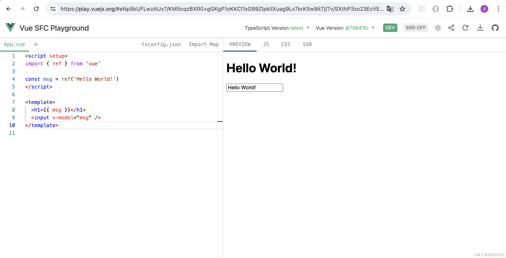

左边写代码，右边实时预览。

右边还可以看到编译后的代码：


先来分析下实现思路。

首先是编译：

编译用的 [@babel/standalone](https://babeljs.io/docs/babel-standalone)，这个是 babel 的浏览器版本。

可以用它实时把 tsx 代码编译为 js。

试一下：

```javascript
npx create-vite
```

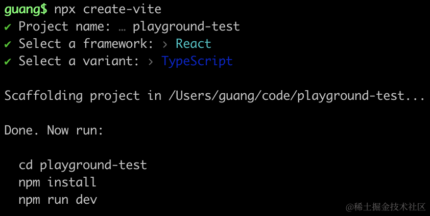

进入项目安装 @babel/standalone 和它的 ts 类型：

```
npm install
npm i --save @babel/standalone
npm i --save-dev @types/babel__standalone
```

去掉 index.css 和 StrictMode：

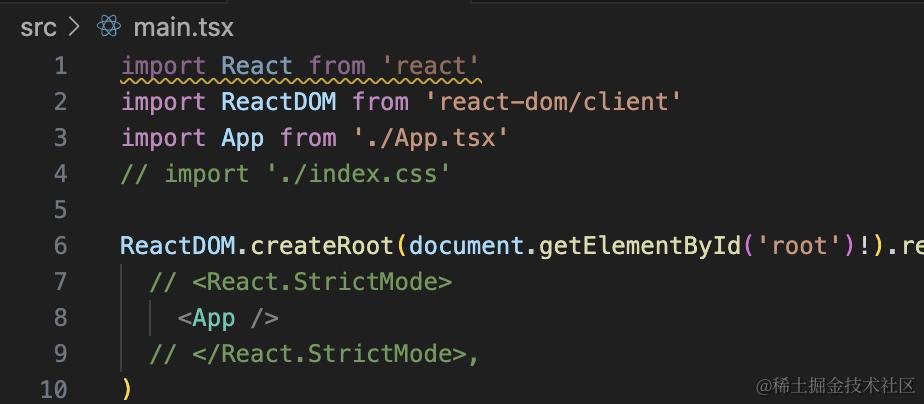

改下 App.tsx

```javascript
import { useRef, useState } from 'react'
import { transform } from '@babel/standalone';

function App() {

  const textareaRef = useRef<HTMLTextAreaElement>(null);

  function onClick() {
    if(!textareaRef.current) {
      return ;
    }

    const res = transform(textareaRef.current.value, {
      presets: ['react', 'typescript'],
      filename: 'guang.tsx'
    });
    console.log(res.code);
  }

  const code = `import { useEffect, useState } from "react";

  function App() {
    const [num, setNum] = useState(() => {
      const num1 = 1 + 2;
      const num2 = 2 + 3;
      return num1 + num2
    });
  
    return (
      <div onClick={() => setNum((prevNum) => prevNum + 1)}>{num}</div>
    );
  }
  
  export default App;
  `
  return (
    <div>
      <textarea ref={textareaRef} style={{ width: '500px', height: '300px'}} defaultValue={code}></textarea>
      <button onClick={onClick}>编译</button>
    </div>
  )
}

export default App
```

在 textarea 输入内容，设置默认值 defaultValue，用 useRef 获取它的 value。

然后点击编译按钮的时候，拿到内容用 babel.transform 编译，指定 typescript 和 react 的 preset。

打印 res.code。

可以看到，打印了编译后的代码：

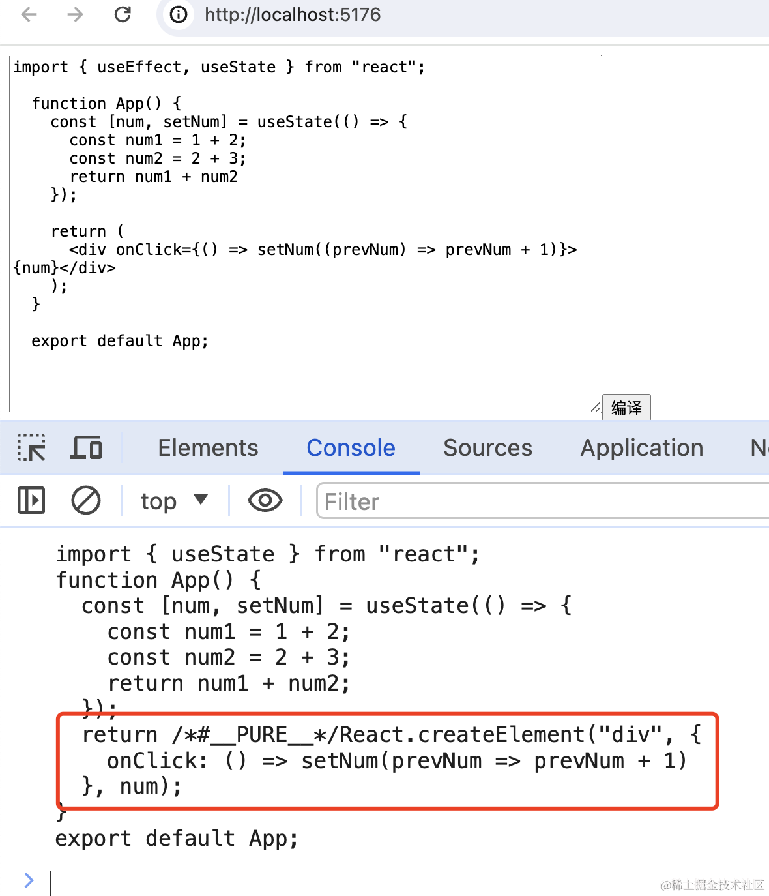

但现在编译后的代码也不能跑啊：

主要是 import 语句这里：

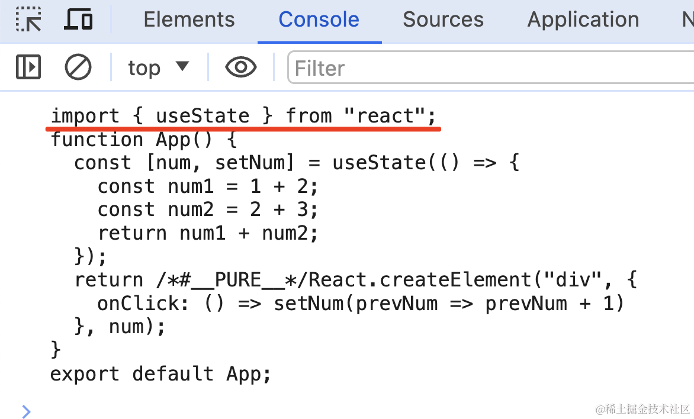

运行代码的时候，会引入 import 的模块，这时会找不到。

当然，我们可以像 vite 的 dev server 那样做一个根据 moduleId 返回编译后的模块内容的服务。

但这里是纯前端项目，显然不适合。

其实 import 的 url 可以用 blob url。

在 public 目录下添加 test.html：

```html
<!DOCTYPE html>
<html lang="en">
<head>
    <meta charset="UTF-8">
    <meta name="viewport" content="width=device-width, initial-scale=1.0">
    <title>Document</title>
</head>
<body>

<script>
    const code1 =`
    function add(a, b) {
        return a + b;
    }
    export { add };
    `;

    const url = URL.createObjectURL(new Blob([code1], { type: 'application/javascript' }));
    const code2 = `import { add } from "${url}";

    console.log(add(2, 3));`;

    const script = document.createElement('script');
    script.type="module";
    script.textContent = code2;
    document.body.appendChild(script);
</script>
</body>
</html>
```
浏览器访问下：

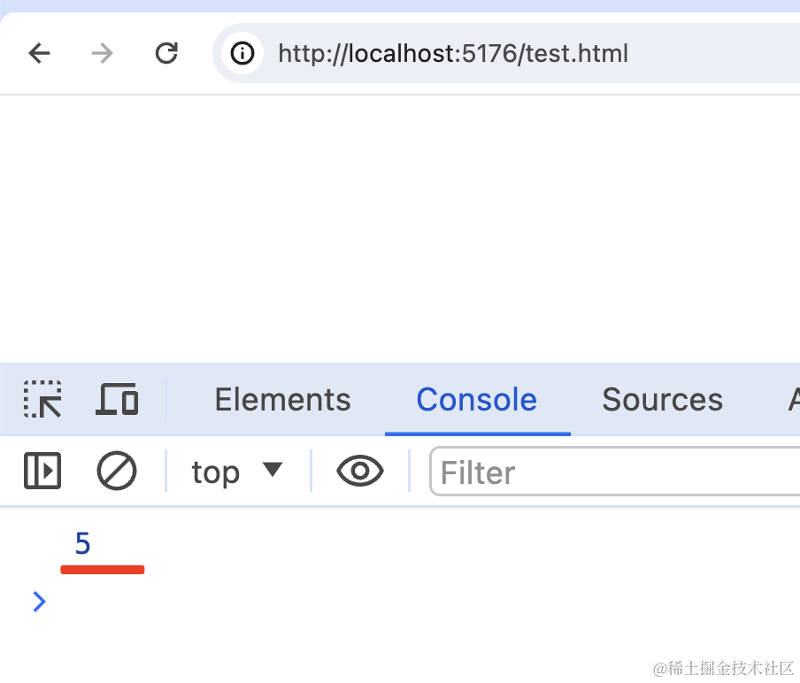

这里用的就是 blob url：

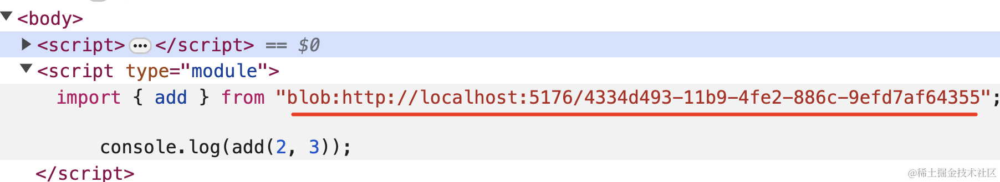

我们可以把一段 JS 代码，用 URL.createObjectURL 和 new Blob 的方式变为一个 url：

```javascript
URL.createObjectURL(new Blob([code], { type: 'application/javascript' }))
```
那接下来的问题就简单了，左侧写的所有代码都是有文件名的。

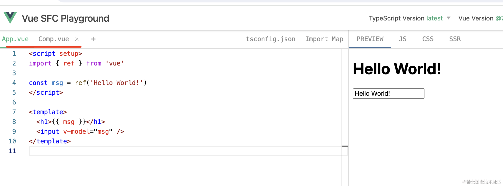

我们只需要根据文件名替换下 import 的 url 就好了。

比如 App.tsx 引入了 ./Aaa.tsx

```javascript
import Aaa from './Aaa.tsx';

export default function App() {
    return <Aaa></Aaa>
}
```

我们维护拿到 Aaa.tsx 的内容，然后通过 Bob 和 URL.createObjectURL 的方式把 Aaa.tsx 内容变为一个 blob url，替换 import 的路径就好了。

这样就可以直接跑。

那怎么替换呢？

babel 插件呀。

babel 编译流程分为 parse、transform、generate 三个阶段。

babel 插件就是在 transform 的阶段增删改 AST 的：

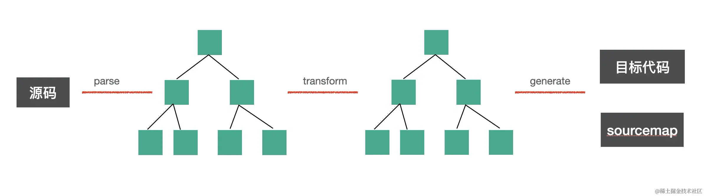

通过 [astexplorer.net](https://astexplorer.net/#/gist/6f01ee950445813f623214fb2c7abba9/b45fffd5a735f829d15098efa4f860438c3a070e) 看下对应的 AST：

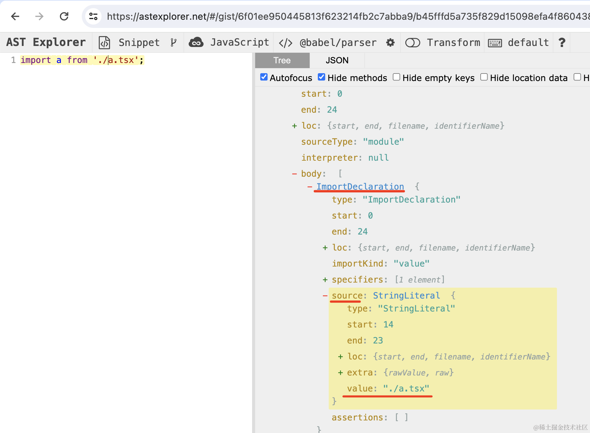

只要在对 ImportDeclaration 的 AST 做处理，把 source.value 替换为对应文件的 blob url 就行了。

比如这样写：

```javascript
import { transform } from '@babel/standalone';
import type { PluginObj } from '@babel/core';

function App() {

    const code1 =`
    function add(a, b) {
        return a + b;
    }
    export { add };
    `;

    const url = URL.createObjectURL(new Blob([code1], { type: 'application/javascript' }));

    const transformImportSourcePlugin: PluginObj = {
        visitor: {
            ImportDeclaration(path) {
                path.node.source.value = url;
            }
        },
    }


  const code = `import { add } from './add.ts'; console.log(add(2, 3));`

  function onClick() {
    const res = transform(code, {
      presets: ['react', 'typescript'],
      filename: 'guang.ts',
      plugins: [transformImportSourcePlugin]
    });
    console.log(res.code);
  }

  return (
    <div>
      <button onClick={onClick}>编译</button>
    </div>
  )
}

export default App
```
这里插件的类型用到了 @babel/core 包的类型，安装下：

```
npm i --save-dev @types/babel__core
```

我们用 babel 插件的方式对 import 的 source 做了替换。

把 ImportDeclaration 的 soure 的值改为了 blob url。


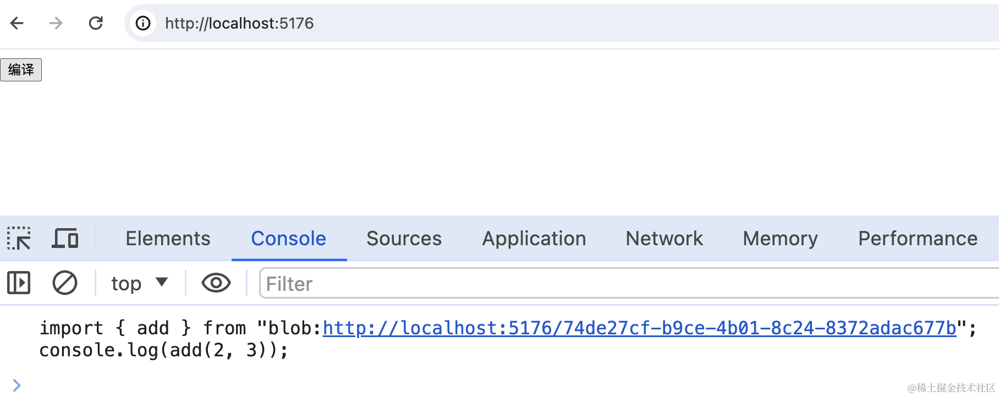

这样，浏览器里就能直接跑这段代码。

那如果是引入 react 和 react-dom 的包呢？这些也不是在左侧写的代码呀

这种可以用 import maps 的机制：
 
在 public 下新建 test2.html

```html
<!DOCTYPE html>
<html lang="en">
<head>
    <meta charset="UTF-8">
    <meta name="viewport" content="width=device-width, initial-scale=1.0">
    <title>Document</title>
</head>
<body>
    <script type="importmap">
        {
            "imports": {
                "react": "https://esm.sh/react@18.2.0"
            }
        }
    </script>
    <script type="module">
        import React from "react";

        console.log(React);
    </script>
</body>
</html>
```
访问下：

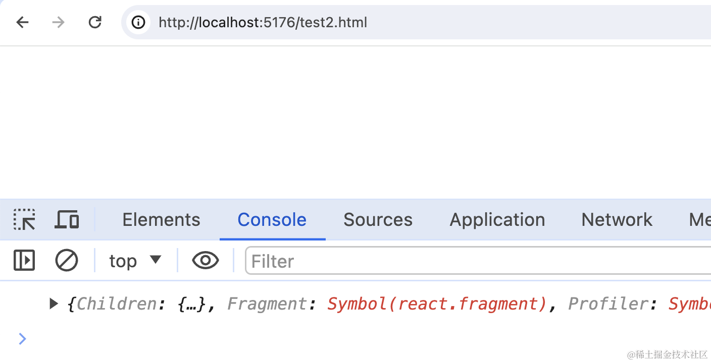

可以看到，import react 生效了。

为什么会生效呢？

你访问下可以看到，[返回的内容](https://esm.sh/react@18.2.0)也是 import url 的方式：

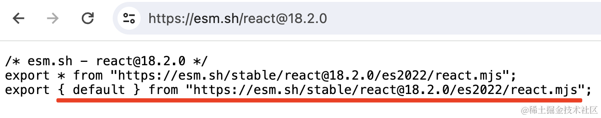

这里的 [esm.sh](https://esm.sh) 就是专门提供 esm 模块的 CDN 服务：

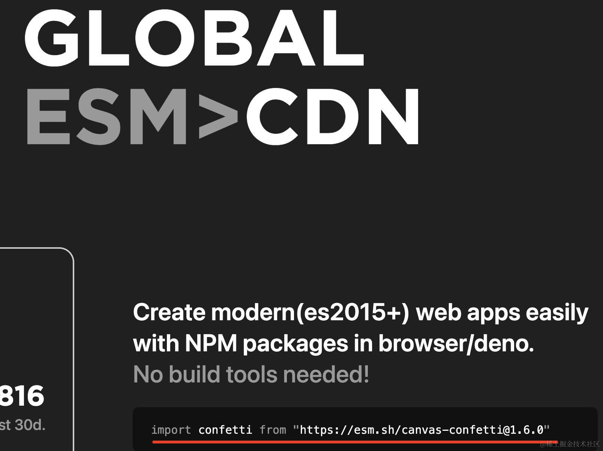

这是它们做的 [react playground](https://code.esm.sh/)：

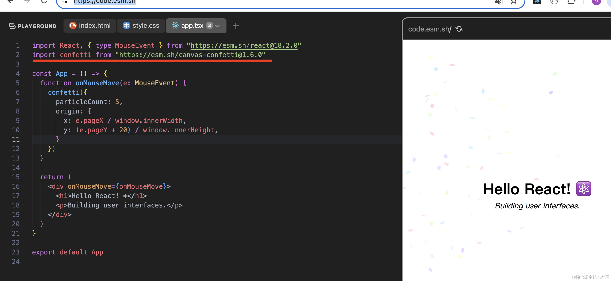

这样，如何引入编辑器里写的 ./Aaa.tsx 这种模块，如何引入 react、react-dom 这种模块我们就都清楚了。

分别用 Blob + URL.createBlobURL 和 import maps + esm.sh 来做。

那编辑器部分如何做呢？

这个用 @monaco-editor/react

安装下：

```
npm install @monaco-editor/react
```

试一下：

```javascript
import Editor from '@monaco-editor/react';

function App() {

    const code =`import { useEffect, useState } from "react";

function App() {
    const [num, setNum] = useState(() => {
        const num1 = 1 + 2;
        const num2 = 2 + 3;
        return num1 + num2
    });

    return (
        <div onClick={() => setNum((prevNum) => prevNum + 1)}>{num}</div>
    );
}

export default App;
`;

    return <Editor height="500px" defaultLanguage="javascript" defaultValue={code} />;
}

export default App;
```

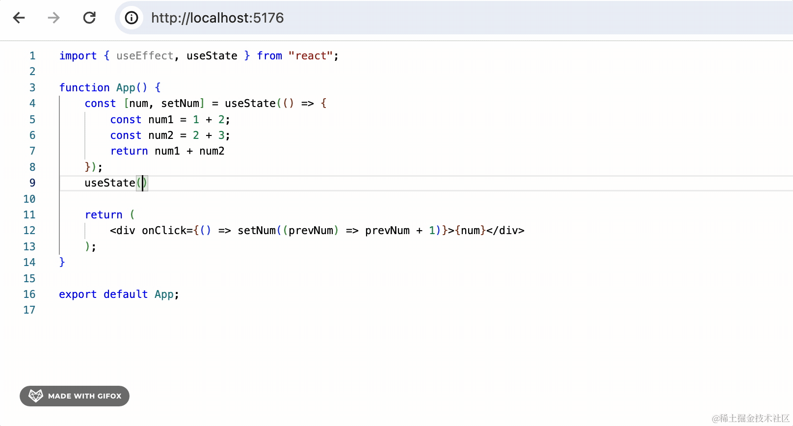

Editor 有很多[参数](https://github.com/suren-atoyan/monaco-react?tab=readme-ov-file#editor)，等用到的时候再展开看。

接下来看下预览部分：

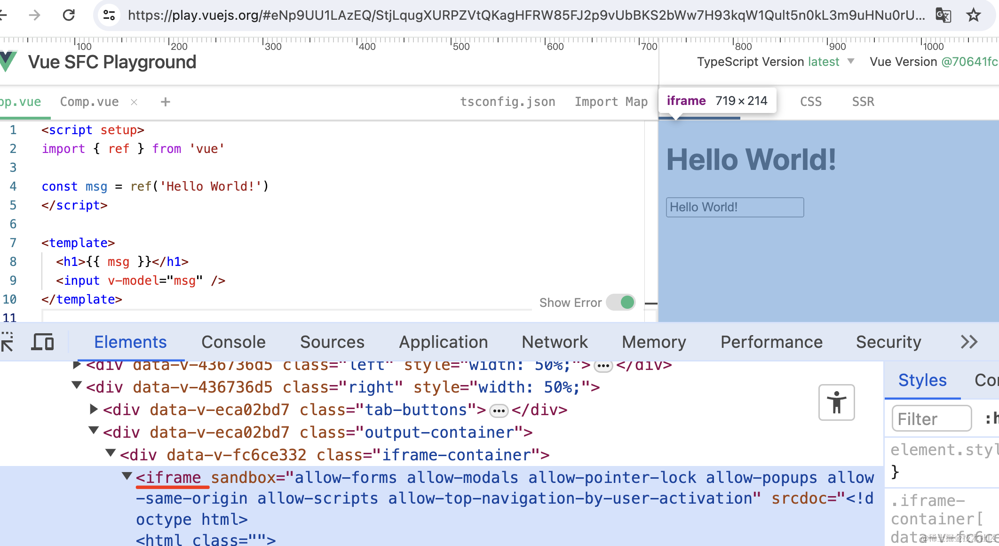

这部分就是 iframe，然后加一个通信机制，左边编辑器的结果，编译之后传到 iframe 里渲染就好了。

```javascript
import React from 'react'

import iframeRaw from './iframe.html?raw';

const iframeUrl = URL.createObjectURL(new Blob([iframeRaw], { type: 'text/html' }));

const Preview: React.FC = () => {

  return (
    <iframe
        src={iframeUrl}
        style={{
            width: '100%',
            height: '100%',
            padding: 0,
            border: 'none'
        }}
    />
  )
}

export default Preview;
```
iframe.html：
```html
<!doctype html>
<html lang="en">
<head>
  <meta charset="UTF-8"/>
  <meta name="viewport" content="width=device-width, initial-scale=1.0"/>
  <title>Preview</title>
  <style>
    * {
      padding: 0;
      margin: 0;
    }
  </style>
</head>
<body>
<script type="importmap">
  {
    "imports": {
      "react": "https://esm.sh/react@18.2.0",
      "react-dom/client": "https://esm.sh/react-dom@18.2.0"
    }
  }
</script>
<script>

</script>
<script type="module">
  import React, {useState, useEffect} from 'react';
  import ReactDOM from 'react-dom/client';

  const App = () => {
    return React.createElement('div', null, 'aaa');
  };

  window.addEventListener('load', () => {
    const root = document.getElementById('root')
    ReactDOM.createRoot(root).render(React.createElement(App, null))
  })
</script>

<div id="root">
  <div style="position:absolute;top: 0;left:0;width:100%;height:100%;display: flex;justify-content: center;align-items: center;">
    Loading...
  </div>
</div>

</body>
</html>

```
这里路径后面加个 ?raw 是通过字符串引入（webpack 和 vite 都有这种功能），用 URL.createObjectURL + Blob 生成 blob url 设置到 iframe 的 src 就好了：

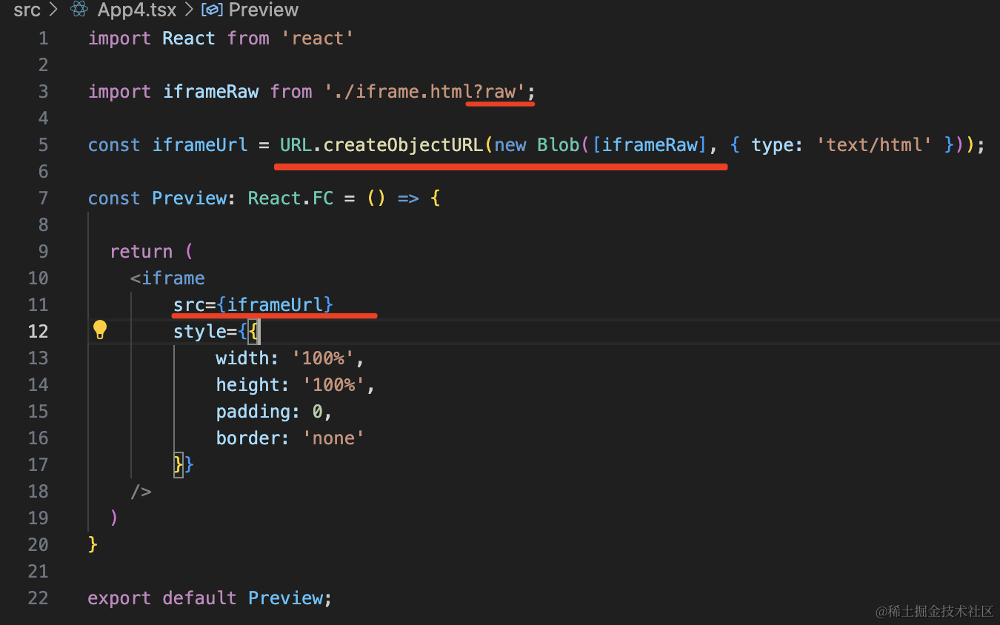

渲染的没问题：

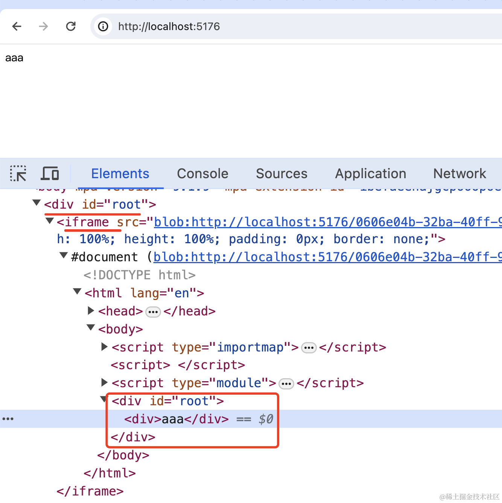

这样，我们只需要内容变了之后生成新的 blob url 就好了。

至此，从编辑器到编译到预览的流程就理清了。

案例代码上传了[小册仓库](https://github.com/QuarkGluonPlasma/react-course-code/tree/main/playground-test)。

## 总结

我们分析了下 react playground 的实现思路。

编辑器部分用 @monaco-editor/react 实现，然后用 @babel/standalone 在浏览器里编译。

编译过程中用自己写的 babel 插件实现 import 的 source 的修改，变为 URL.createObjectURL + Blob 生成的 blob url，把模块内容内联进去。

对于 react、react-dom 这种包，用 import maps 配合 [esm.sh](https://esm.sh/) 网站来引入。

然后用 iframe 预览生成的内容，url 同样是把内容内联到 src 里，生成 blob url。

这样，react playground 整个流程的思路就理清了。
