这节开始，我们做一个实战项目：低代码编辑器

这种编辑器都差不多，比如百度开源的 [amis](https://aisuda.github.io/amis-editor-demo/#/edit/0)：

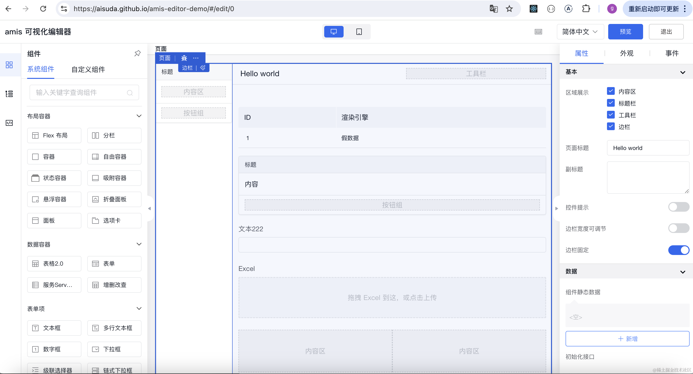

左边是物料区，中间是画布区，右边是属性编辑区。

可以从物料区拖拽组件到中间的画布区，来可视化搭建页面：


画布区的组件可以选中之后，在属性编辑区修改属性：


左边可以看到组件的大纲视图，用树形展示组件嵌套结构：

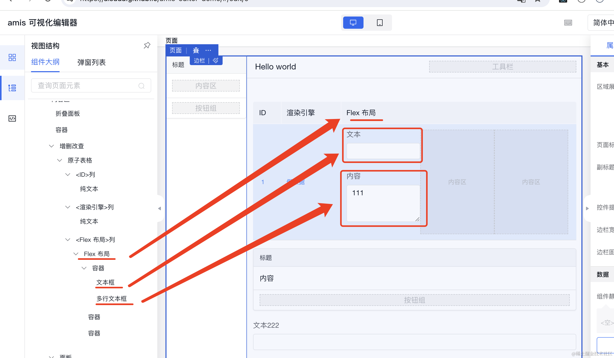

也可以直接看生成的 json 结构：

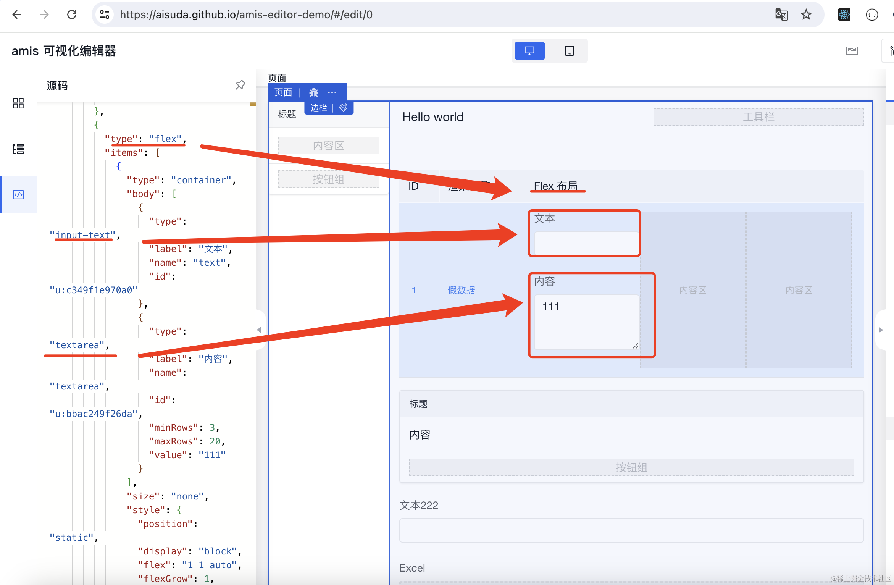

可以看到，json 的嵌套结构和页面里组件的结构一致，并且 json 对象的属性也是在属性编辑区编辑后的。

所以说，整个低代码编辑器就是围绕这个 json 来的。

**从物料区拖拽组件到画布区，其实就是在 json 的某一层级加了一个组件对象。**

**选中组件在右侧编辑属性，其实就是修改 json 里某个组件对象的属性。**

**大纲就是把这个 json 用树形展示。**

你从 json 的角度来回想一下低代码编辑器的拖拽组件到画布、编辑属性、查看大纲这些功能，是不是原理就很容易想通了？

没错，这就是低代码编辑器的核心，就是一个 json。

拖拽也是低代码编辑器的一个难点，用 react-dnd 做就行。

但交互方式是次要的，比如移动端页面的低代码编辑器，可能不需要拖拽，点击就会添加到画布：


这种不需要拖拽的是低代码编辑器么？

明显也是。所以说，拖拽不是低代码编辑器必须的。

理解低代码编辑器的核心就是 json 数据结构，不同交互只是修改这个 json 不同部分就行。

下面我们自己来写一个：

```
npx create-vite lowcode-editor
```
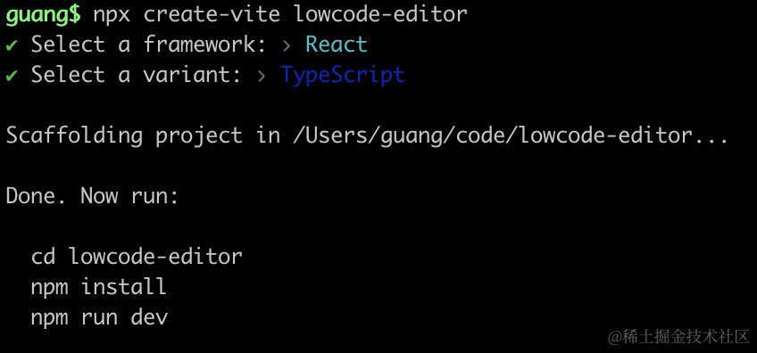

安装依赖，把项目跑起来：

```
npm install
npm run dev
```
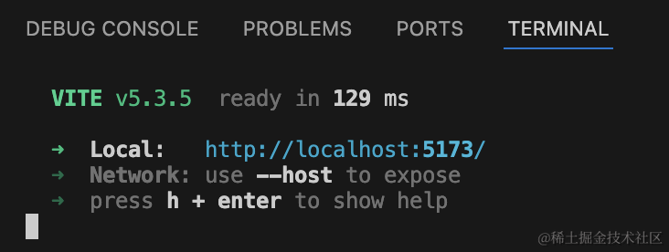

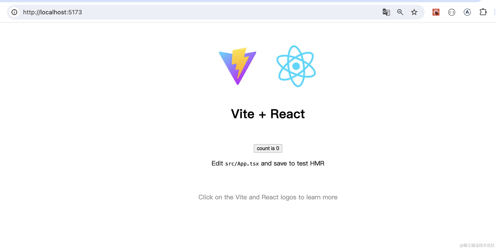

改下 main.tsx：

```javascript
import ReactDOM from 'react-dom/client'
import App from './App.tsx'

ReactDOM.createRoot(document.getElementById('root')!).render(<App />)
```

新建 src/editor/index.tsx

```javascript
export default function LowcodeEditor() {
    return <div>LowcodeEditor</div>
}
```

在 App.tsx 引入下：

```javascript
import LowcodeEditor from './editor';

function App() {

  return (
    <LowcodeEditor/>
  )
}

export default App

```

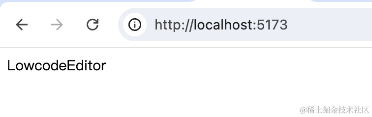

按照 [tailwind 文档](https://www.tailwindcss.cn/docs/guides/vite#react)里的步骤安装 tailwind：

```javascript
npm install -D tailwindcss postcss autoprefixer

npx tailwindcss init -p
```

会生成 tailwind 和 postcss 配置文件：

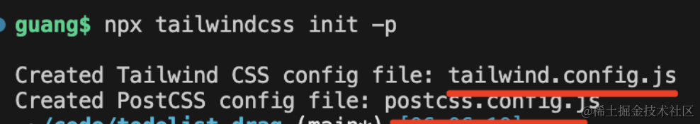

修改下 content 配置，也就是从哪里提取 className：

```javascript
/** @type {import('tailwindcss').Config} */
export default {
  content: [
    "./index.html",
    "./src/**/*.{js,ts,jsx,tsx}",
  ],
  theme: {
    extend: {},
  },
  plugins: [],
}
```
tailwind 会提取 className 之后按需生成最终的 css。

改下 index.css 引入 tailwind 基础样式：

```css
@tailwind base;
@tailwind components;
@tailwind utilities;
```

在 main.tsx 里引入：

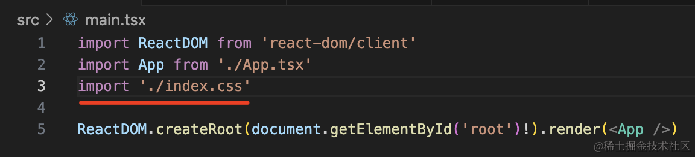

如果你没安装 tailwind 插件，需要安装一下：

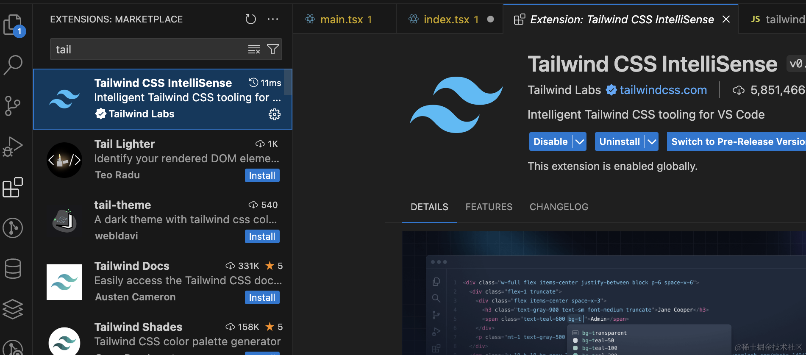

这样在写代码的时候就会提示 className 和对应的样式值：

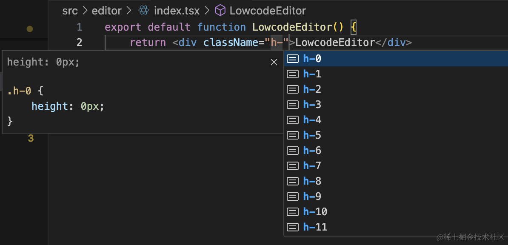

不知道 className 叫啥的样式，还可以在 [tailwind 文档](https://www.tailwindcss.cn/docs/border-width)里搜：

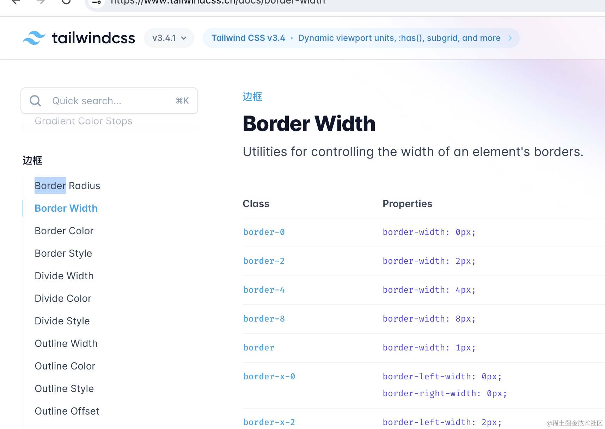

接下来写布局：

我们用 [allotment](https://www.npmjs.com/package/allotment) 实现可拖动改变大小的 pane：


安装这个包：

```
npm install --save allotment
```

改下 LowcodeEditor：

```javascript
import { Allotment } from "allotment";
import 'allotment/dist/style.css';

export default function ReactPlayground() {
    return <div className='h-[100vh] flex flex-col'>
        <div className=''>
           Header
        </div>
        <Allotment>
            <Allotment.Pane preferredSize={240} maxSize={300} minSize={200}>
                Materail
            </Allotment.Pane>
            <Allotment.Pane>
                EditArea
            </Allotment.Pane>
            <Allotment.Pane preferredSize={300} maxSize={500} minSize={300}>
                Setting
            </Allotment.Pane>
        </Allotment>
    </div>
}
```
引入 Allotment 组件和样式。

设置左右两个 pane 的初始 size，最大最小 size。

h-[任意数值] 是 tailwind 支持的样式写法，就是 height: 任意数值 的意思。

h-[100vh] 就是 height: 100vh

然后设置 flex、flex-col

看下样式：

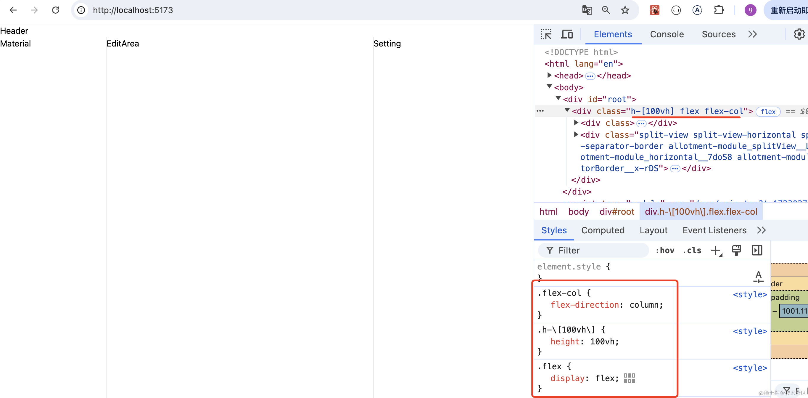

没问题。

左右两边是可以拖拽改变大小的：

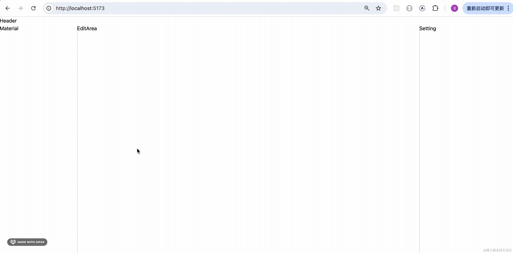

初始 size、最大、最小 size 都和我们设置的一样。

然后写下 header 的样式。

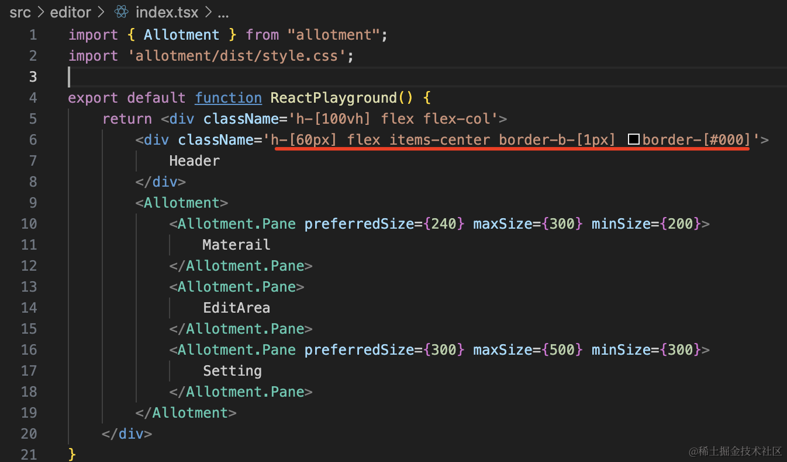

高度 60px、用 flex 布局，竖直居中，有一个底部 border

```
h-[60px] flex items-center border-b-[1px] border-[#000]
```
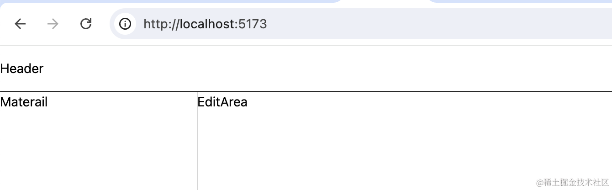

没啥问题。

然后换成具体的组件：

```javascript
import { Allotment } from "allotment";
import 'allotment/dist/style.css';
import { Header } from "./components/Header";
import { EditArea } from "./components/EditArea";
import { Setting } from "./components/Setting";
import { Material } from "./components/Material";

export default function ReactPlayground() {
    return <div className='h-[100vh] flex flex-col'>
        <div className='h-[60px] flex items-center border-b-[1px] border-[#000]'>
            <Header />
        </div>
        <Allotment>
            <Allotment.Pane preferredSize={240} maxSize={300} minSize={200}>
                <Material />
            </Allotment.Pane>
            <Allotment.Pane>
                <EditArea />
            </Allotment.Pane>
            <Allotment.Pane preferredSize={300} maxSize={500} minSize={300}>
                <Setting />
            </Allotment.Pane>
        </Allotment>
    </div>
}
```
分别写下这几个组件：

editor/components/Header.tsx

```javascript
export function Header() {
    return <div>Header</div>
}
```
editor/components/Material.tsx

```javascript
export function Material() {
    return <div>Material</div>
}
```
editor/components/EditArea.tsx

```javascript
export function EditArea() {
    return <div>EditArea</div>
}
```
editor/components/Setting.tsx
```javascript
export function Setting() {
    return <div>Setting</div>
}
```
布局写完了，接下来可以正式来写逻辑了。

这节先来写下低代码编辑器核心的数据结构。

我们不用 Context 保存全局数据了，用 zustand 来做。

```javascript
npm install --save zustand
```
前面做 todolist 案例用过 zustand：

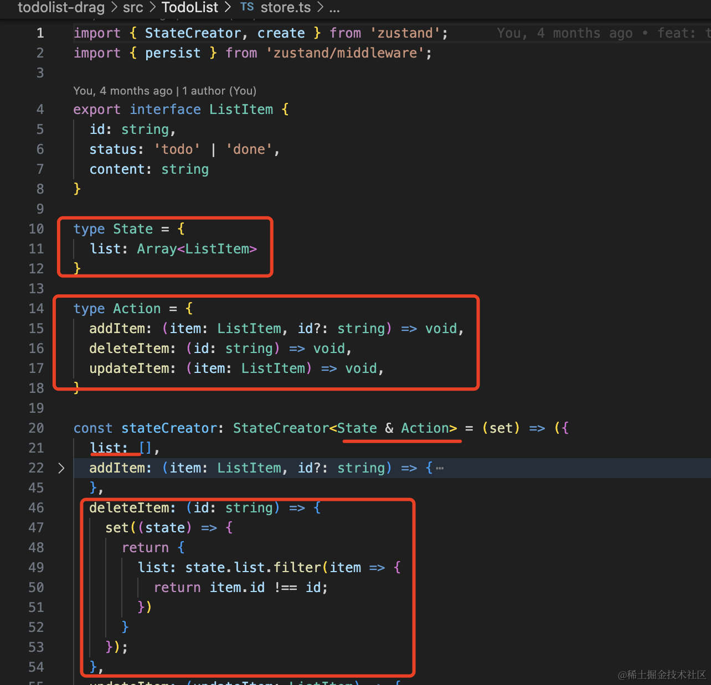

声明 State、Action 的类型，然后在 create 方法里声明 state、action 就行。

创建 editor/stores/components.tsx，在这里保存全局的那个组件 json：

```javascript
import {create} from 'zustand';

export interface Component {
  id: number;
  name: string;
  props: any;
  children?: Component[];
  parentId?: number;
}

interface State {
  components: Component[];
}

interface Action {
  addComponent: (component: Component, parentId?: number) => void;
  deleteComponent: (componentId: number) => void;
  updateComponentProps: (componentId: number, props: any) => void;
}

export const useComponetsStore = create<State & Action>(
  ((set, get) => ({
    components: [
      {
        id: 1,
        name: 'Page',
        props: {},
        desc: '页面',
      }
    ],
    addComponent: (component, parentId) =>
      set((state) => {
        if (parentId) {
          const parentComponent = getComponentById(
            parentId,
            state.components
          );

          if (parentComponent) {
            if (parentComponent.children) {
              parentComponent.children.push(component);
            } else {
              parentComponent.children = [component];
            }
          }

          component.parentId = parentId;
          return {components: [...state.components]};
        }
        return {components: [...state.components, component]};
      }),
    deleteComponent: (componentId) => {
      if (!componentId) return;

      const component = getComponentById(componentId, get().components);
      if (component?.parentId) {
        const parentComponent = getComponentById(
          component.parentId,
          get().components
        );

        if (parentComponent) {
          parentComponent.children = parentComponent?.children?.filter(
            (item) => item.id !== +componentId
          );

          set({components: [...get().components]});
        }
      }
    },
    updateComponentProps: (componentId, props) =>
      set((state) => {
        const component = getComponentById(componentId, state.components);
        if (component) {
          component.props = {...component.props, ...props};

          return {components: [...state.components]};
        }

        return {components: [...state.components]};
      }),
    })
  )
);


export function getComponentById(
    id: number | null,
    components: Component[]
  ): Component | null {
    if (!id) return null;
  
    for (const component of components) {
      if (component.id == id) return component;
      if (component.children && component.children.length > 0) {
        const result = getComponentById(id, component.children);
        if (result !== null) return result;
      }
    }
    return null;
}
```
我们从上到下来看下：

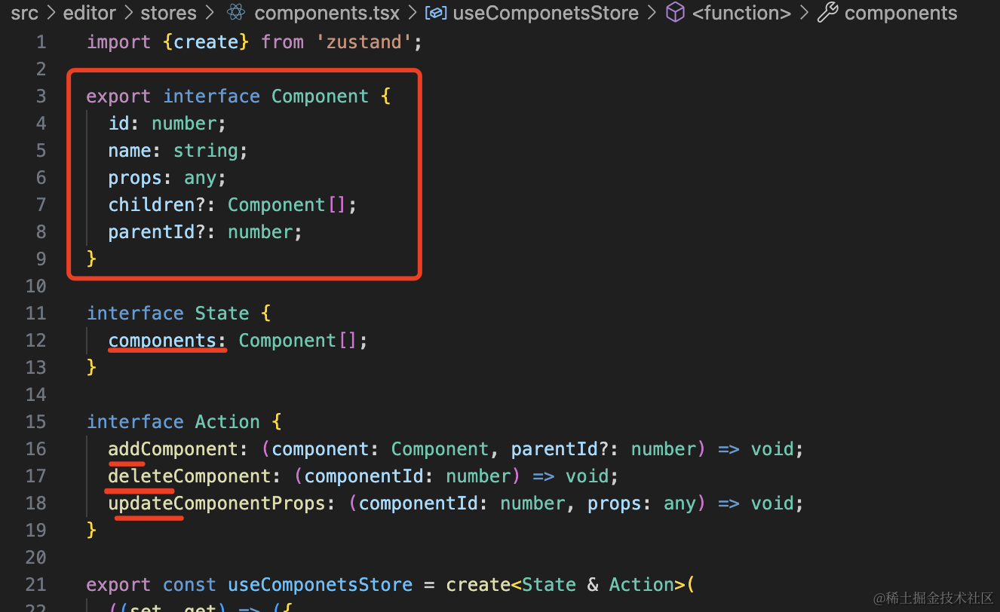

store 里保存着 components 组件树，它是一个用 children 属性连接起来的树形结构。

我们定义了每个 Component 节点的类型，有 id、name、props 属性，然后通过 chiildren、parentId 关联父子节点。

此外，定义了 add、delete、update 的增删改方法，用来修改 components 组件树。

这是一个树形结构，想要增删改都要先找到 parent 节点，我们实现了查找方法：

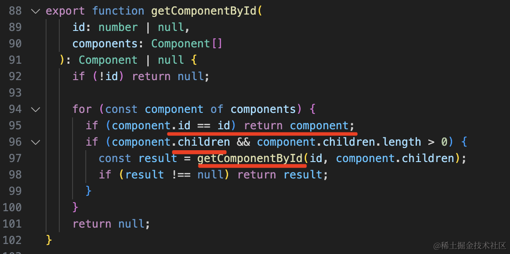

树形结构中查找节点，自然是通过递归。

如果节点 id 是查找的目标 id 就返回当前组件，否则遍历 children 递归查找。

之后就可以实现增删改方法了：

新增会传入 parentId，在哪个节点下新增：

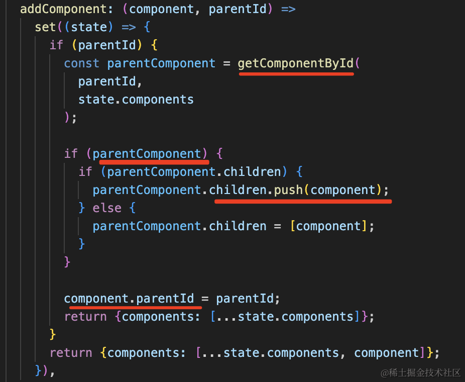

查找到 parent 之后，在 children 里添加一个 component，并把 parentId 指向这个 parent。

没查到就直接放在 components 下。

删除则是找到这个节点的 parent，在 parent.children 里删除当前节点：

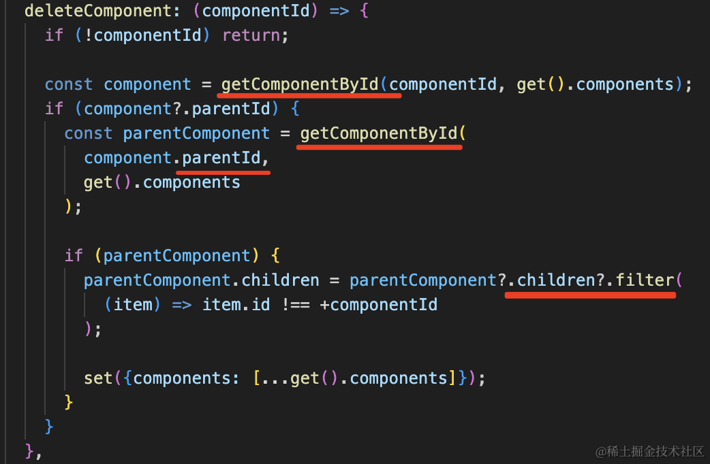

修改 props 也是找到目标 component，修改属性：

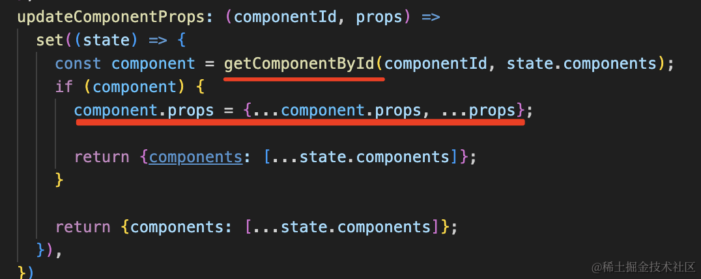

这样，components 和它的增删改查方法就都定义好了。

这就是我们前面分析的核心数据结构。

有了这个就能实现低代码编辑器的大多数功能了。

不信？

我们试一下：

比如我们拖拽一个容器组件进来：


是不是就是在 components 下新加了一个组件。

模拟实现下：

```javascript
import { useEffect } from "react";
import { useComponetsStore } from "../../stores/components"

export function EditArea() {

    const {components, addComponent} = useComponetsStore();

    useEffect(()=> {
        addComponent({
            id: 222,
            name: 'Container',
            props: {},
            children: []
        }, 1);
    }, []);

    return <div>
        <pre>
            {
                JSON.stringify(components, null, 2)
            }
        </pre>
    </div>
}
```
在 EditArea 组件里，调用 store 里的 addComponent 添加一个组件。

然后把 components 组件树渲染出来：

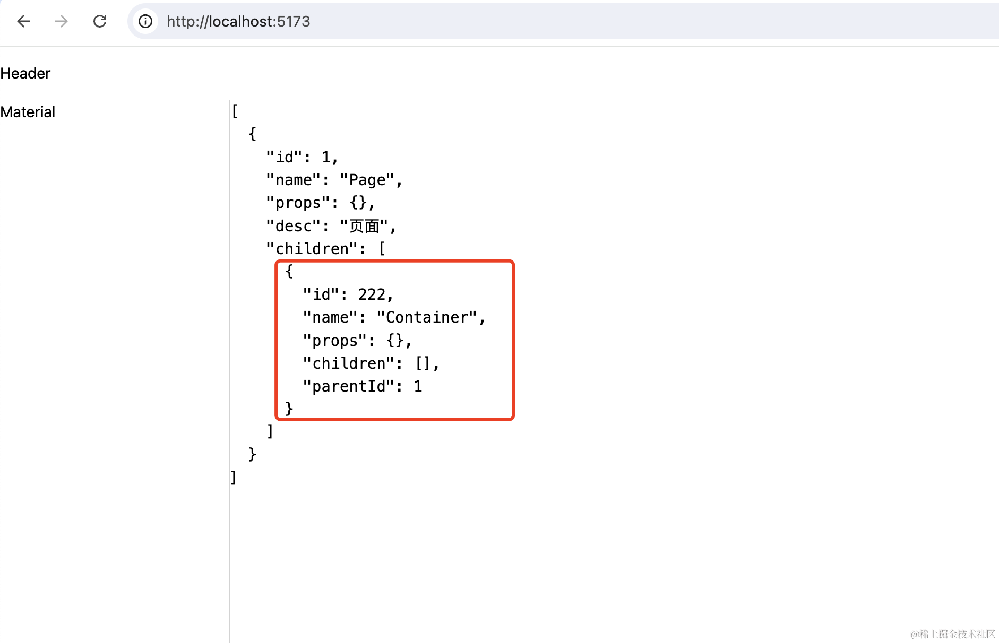

可以看到，Page 下多了一个 Container 组件。

然后在 Container 下拖拽一个 Video 组件过去：


对应的底层操作就是这样的：

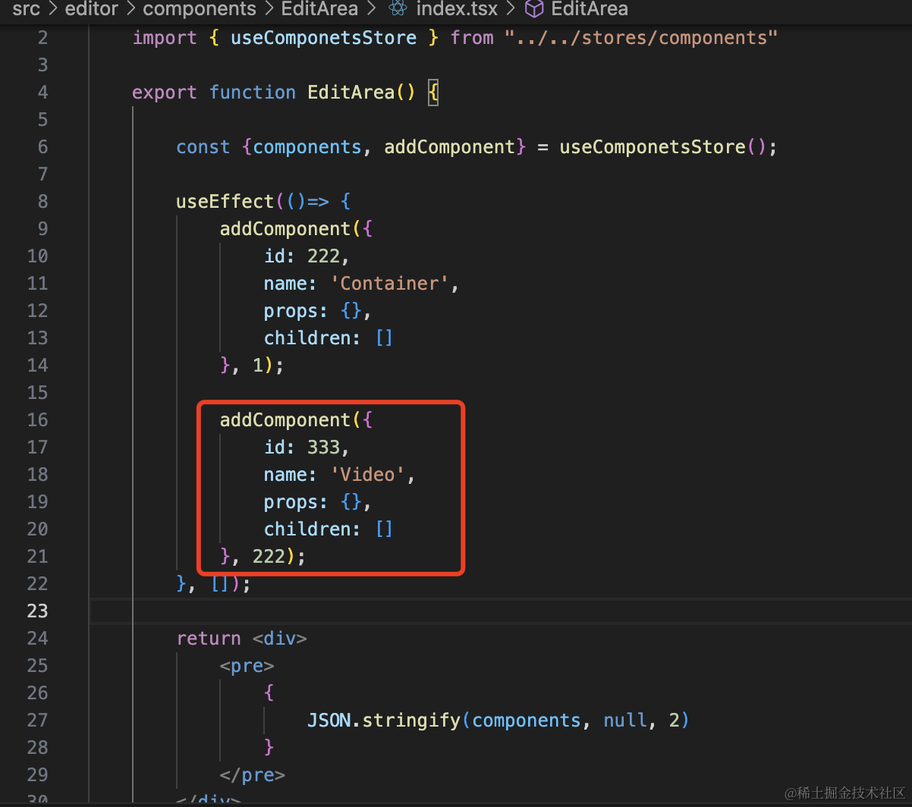

```javascript
addComponent({
    id: 333,
    name: 'Video',
    props: {},
    children: []
}, 222);
```

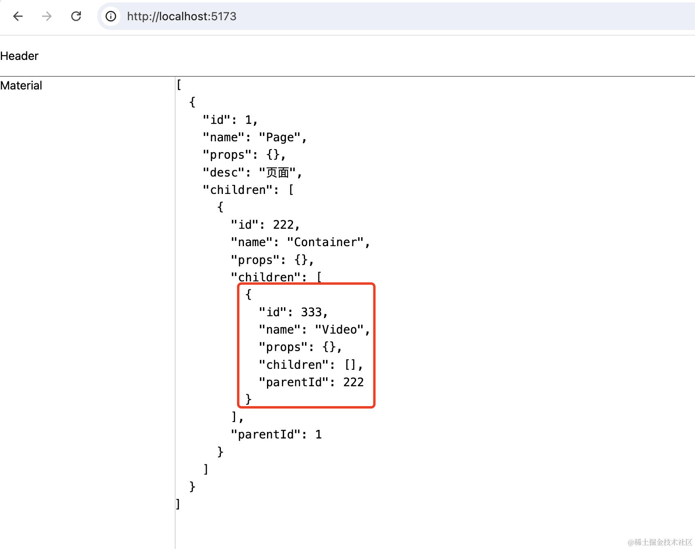

在编辑器中把这个组件删除：


对应的操作就是 deleteComponent：

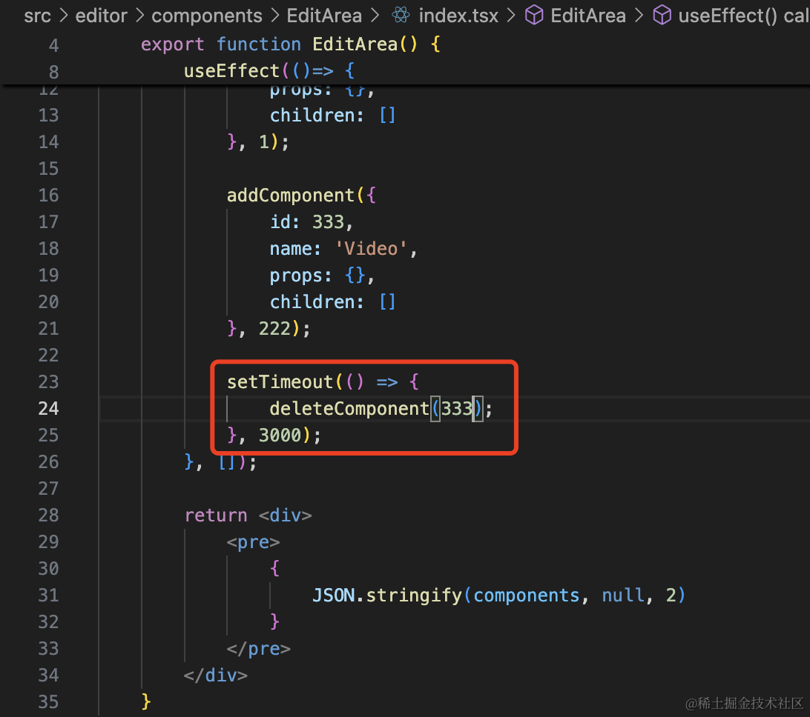

```javascript
setTimeout(() => {
    deleteComponent(333);
}, 3000);
```
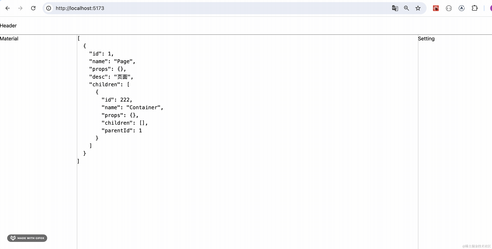

在右边属性编辑区修改组件的信息：


对应的就是 updateComponentProps：

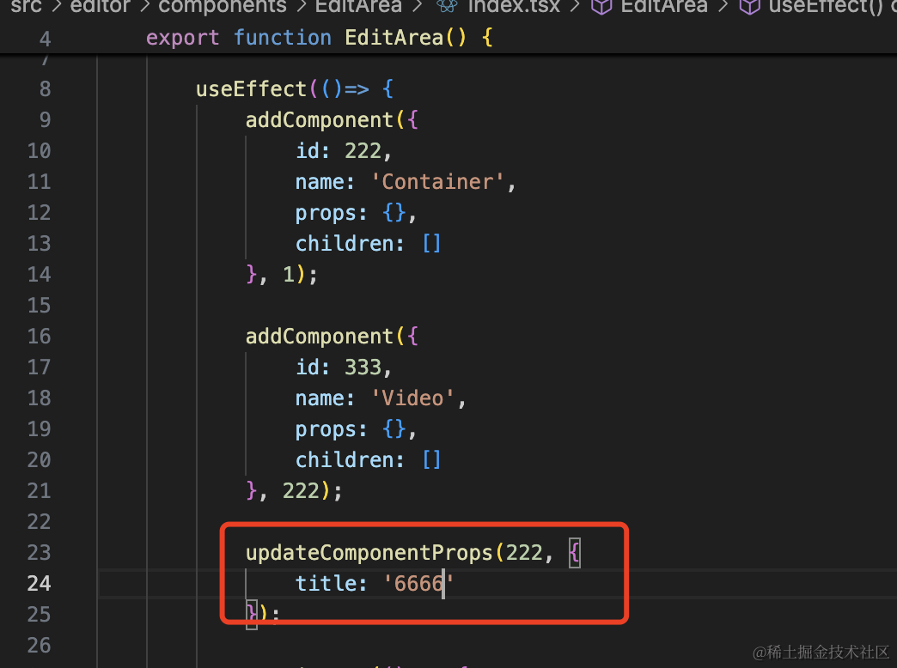

（amis 用的 body 属性关联子组件，我们用的 children）

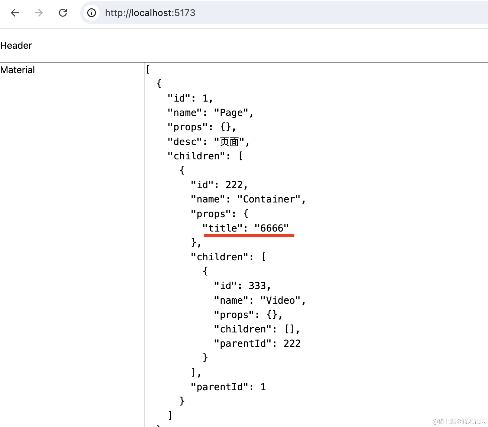

至于大纲和 json：

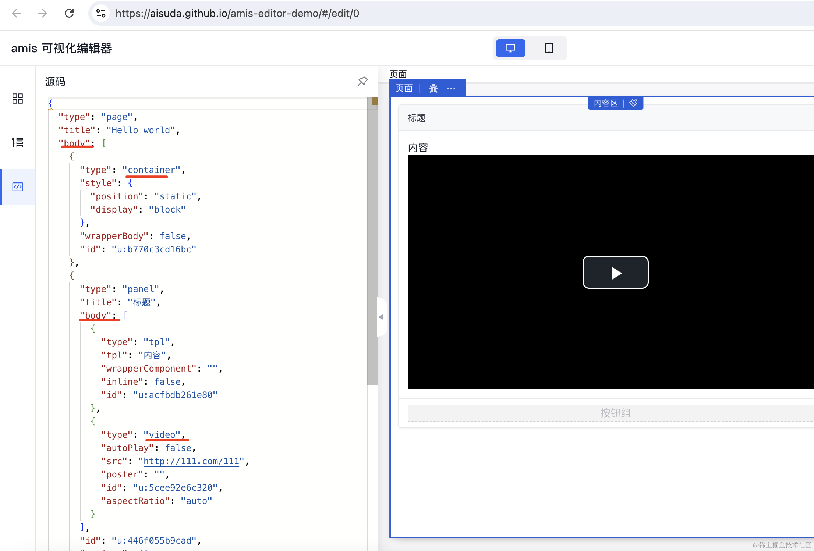

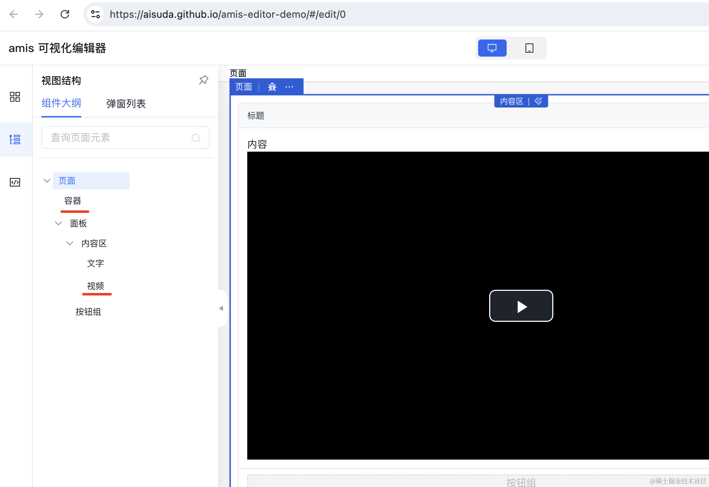

就是对这个 json 的展示：

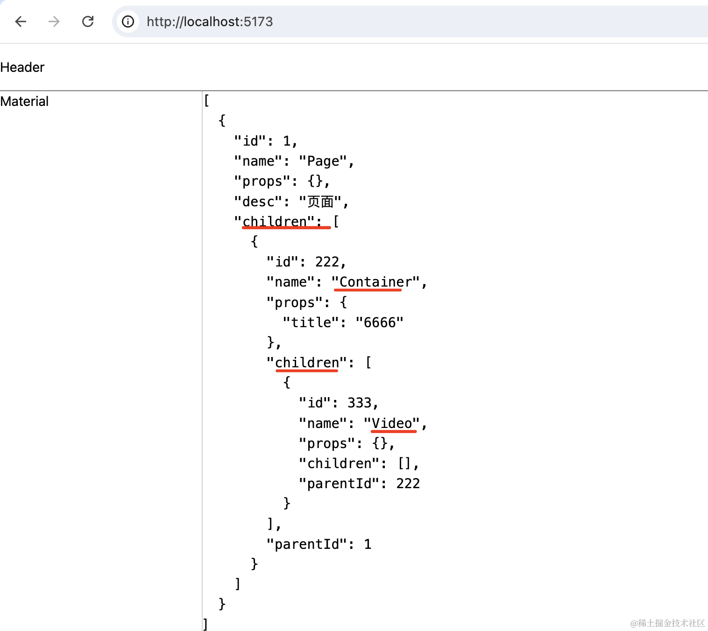

所以说，从物料区拖组件到画布，删除组件、在属性编辑区修改组件属性，都是对这个 json 的修改。

案例代码上传了[小册仓库](https://github.com/QuarkGluonPlasma/react-course-code/tree/main/lowcode-editor)，可以切换到这个 commit 查看：

```
git reset --hard 32bd1b33e74adb3832c839161aef415a0d4f3b20
```

## 总结

我们分析了下低代码编辑器 amis，发现核心就是一个 json 的数据结构。

这个 json 就是一个通过 children 属性串联的组件对象树。

从物料区拖拽组件到画布区，就是在 json 的某一层级加了一个组件对象。

选中组件在右侧编辑属性，就是修改 json 里某个组件对象的属性。

大纲就是把这个 json 用树形展示。

然后我们写了下代码，用 allomet 实现了 split pane 布局，用 tailwind 来写样式，引入 zustand 来做全局 store。

在 store 中定义了 components 和对应的 add、update、delete 方法。

然后对应低代码编辑器里的操作，用这些方法实现了一下。

这个数据结构并不复杂，却是低代码编辑器的核心。
