上节我们理清了低代码编辑器的实现原理，实现了核心数据结构 components 和 add、update、delete 方法。

并且把拖拽操作对应到了这些增删改方法上。


这节我们来实现下拖拽操作。

首先，我们把 json 渲染到中间的画布区：

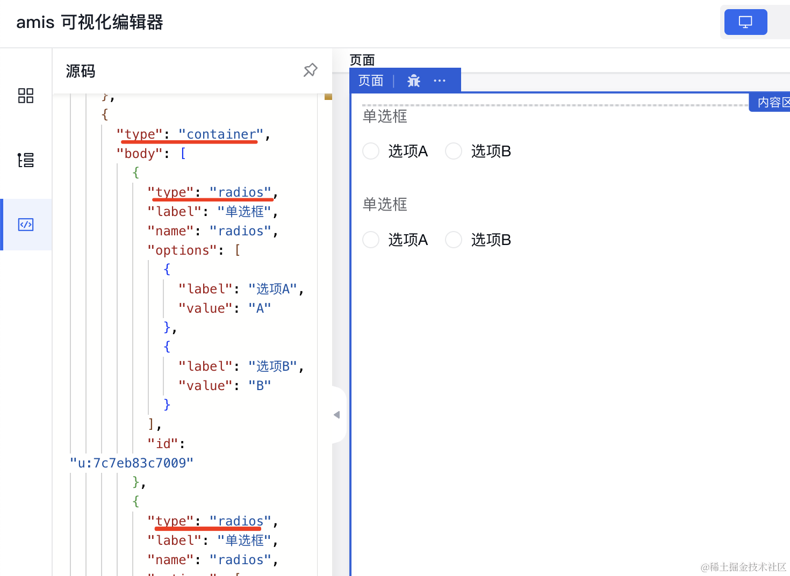

现在的 json 里只有组件名，没有具体的组件：

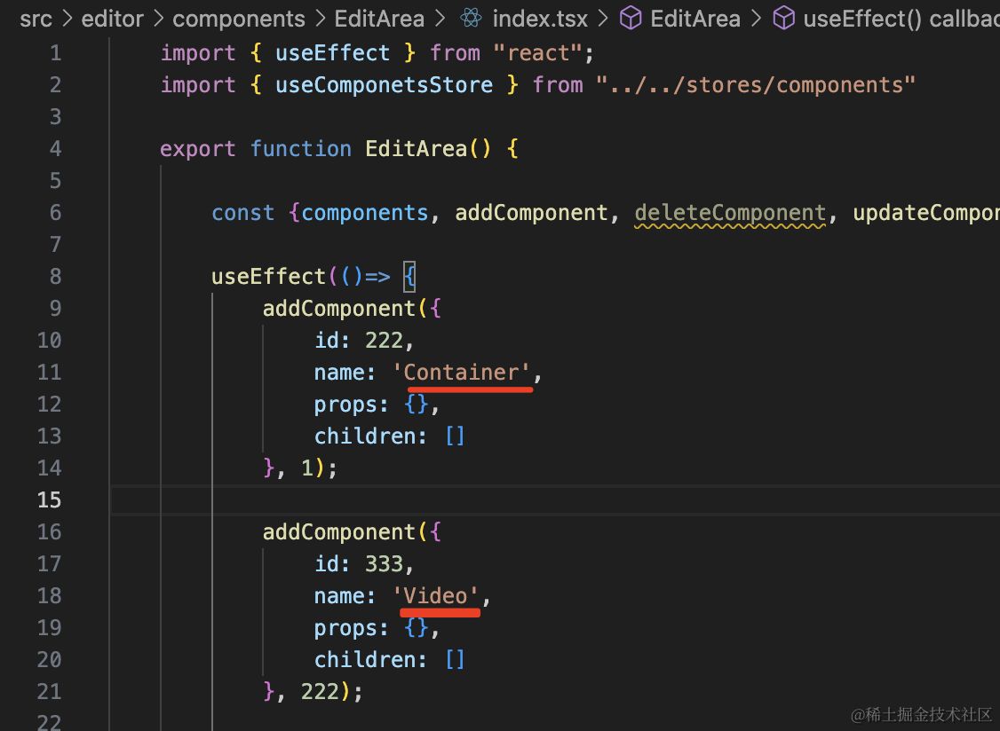

我们写两个组件：

editor/materials/Container/index.tsx

```javascript
import { PropsWithChildren } from 'react';

const Container = ({ children }: PropsWithChildren) => {

  return (
    <div 
      className='border-[1px] border-[#000] min-h-[100px] p-[20px]'
      >{children}</div>
  )
}

export default Container;
```

因为布局放在 components 目录下，那物料组件就放 materials 目录下吧：

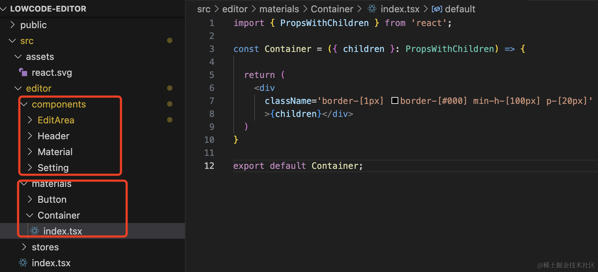

加了一个黑色的 border，设置了最小高度为 100px，padding 为 20px。

然后再加一个 Button 组件：

editor/materials/Button/index.tsx

```javascript
import { Button as AntdButton } from 'antd';
import { ButtonType } from 'antd/es/button';

export interface ButtonProps {
    type: ButtonType,
    text: string;
}

const Button = ({type, text}: ButtonProps) => {
  return (
    <AntdButton type={type}>{text}</AntdButton>
  )
}

export default Button;
```

安装用到的 antd：

```
npm install --save-dev antd
```

然后还要加一个 compnent 名字和 Component 实例的映射。

在 stores 下创建一个新的 Store

stores/component-config.tsx
```javascript
import {create} from 'zustand';
import Container from '../materials/Container';
import Button from '../materials/Button';

export interface ComponentConfig {
    name: string;
    defaultProps: Record<string, any>,
    component: any
}
 
interface State {
    componentConfig: {[key: string]: ComponentConfig};
}

interface Action {
    registerComponent: (name: string, componentConfig: ComponentConfig) => void
}

export const useComponentConfigStore = create<State & Action>((set) => ({
    componentConfig: {
        Container: {
            name: 'Container',
            defaultProps: {},
            component: Container
        },
        Button: {
            name: 'Button',
            defaultProps: {
                type: 'primary',
                text: '按钮'
            },
            component: Button
        },
    },
    registerComponent: (name, componentConfig) => set((state) => {
        return {
            ...state,
            componentConfig: {
                ...state.componentConfig,
                [name]: componentConfig
            }
        }
    })
}));
```
声明 state 和 action 的类型。

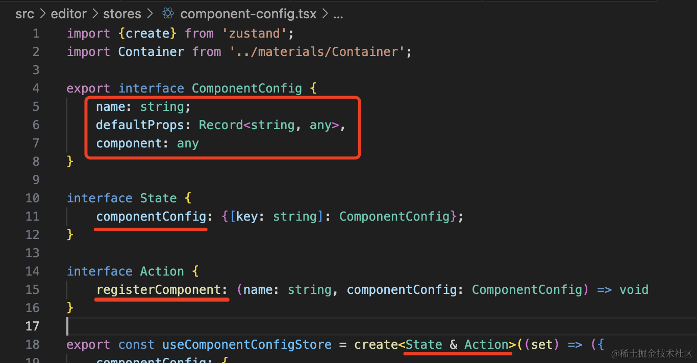

state 就是 componentConfig 的映射。

key 是组件名，value 是组件配置（包括 component 组件实例、defaultProps 组件默认参数）。

action 就是往 componentConfig 里加配置。

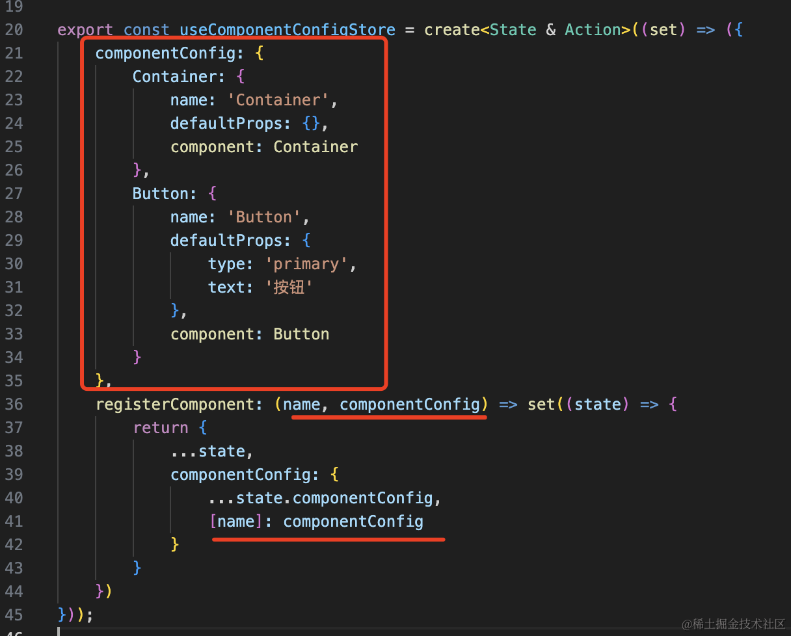

componentConfig 现在有 Container、Button 两个组件。

有了组件的配置，接下来就可以渲染了：

在 EditArea/index.tsx 递归渲染 components

```javascript
import React, { useEffect } from "react";
import { useComponentConfigStore } from "../../stores/component-config";
import { Component, useComponetsStore } from "../../stores/components"

export function EditArea() {
    const { components, addComponent } = useComponetsStore();
    const { componentConfig } = useComponentConfigStore();

    useEffect(()=> {
        addComponent({
            id: 222,
            name: 'Container',
            props: {},
            children: []
        }, 1);

        addComponent({
            id: 333,
            name: 'Button',
            props: {
                text: '无敌'
            },
            children: []
        }, 222);
    }, []);


    function renderComponents(components: Component[]): React.ReactNode {
        return components.map((component: Component) => {
            const config = componentConfig?.[component.name]

            if (!config?.component) {
                return null;
            }
            
            return React.createElement(
                config.component,
                {
                    key: component.id,
                    ...config.defaultProps,
                    ...component.props,
                },
                renderComponents(component.children || [])
            )
        })
    }

    return <div className="h-[100%]">
        <pre>
            {JSON.stringify(components, null, 2)}
        </pre>
        {renderComponents(components)}
    </div>
}
```
components 是一个树形结构，我们 render 的时候也要递归渲染：

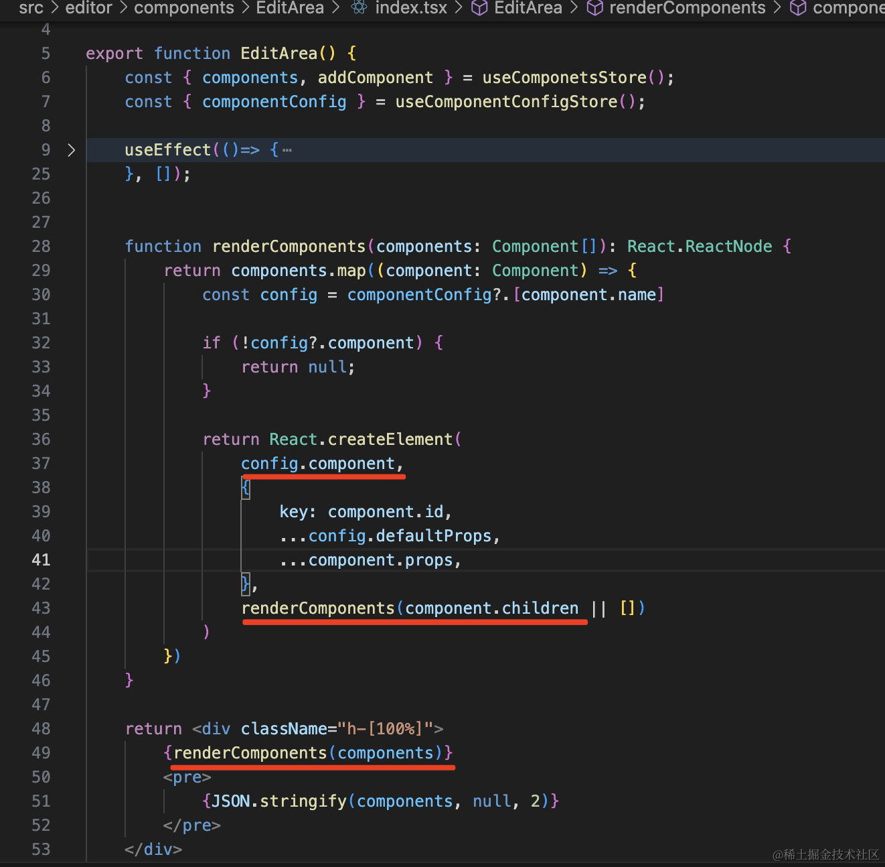

从组件配置中拿到 name 对应的组件实例，然后用 React.cloneElement 来创建组件。

props 是配置里的 defaultProps 用 component.props 覆盖后的结果。

React.cloneElement 的第三个参数是 children，递归调用 renderComponents 渲染就行。

这样，就把 components 组件树渲染了出来。

看下效果：

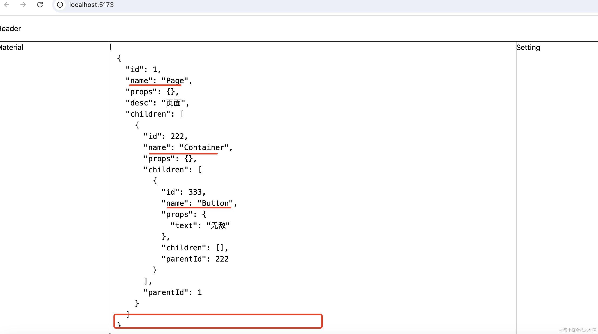

json 下面并没有渲染出组件来。

因为 Page 组件还没写。

写一下：

materials/Page/index.tsx

```javascript
import { PropsWithChildren } from "react";

function Page({ children }: PropsWithChildren) {

  return (
    <div
      className='p-[20px] h-[100%] box-border'
    >
      {children}
    </div>
  )
}

export default Page;
```
在 componentConfig 里配置下：

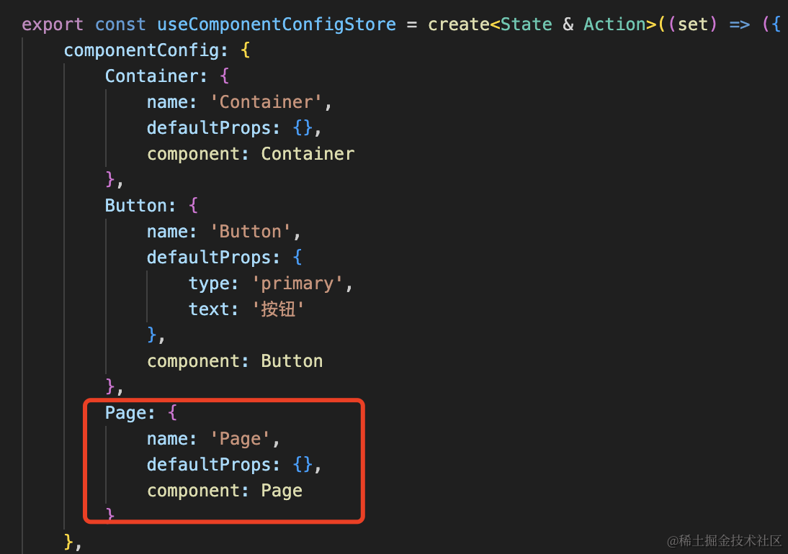

```javascript
Page: {
    name: 'Page',
    defaultProps: {},
    component: Page
}
```

把 json 注释掉：

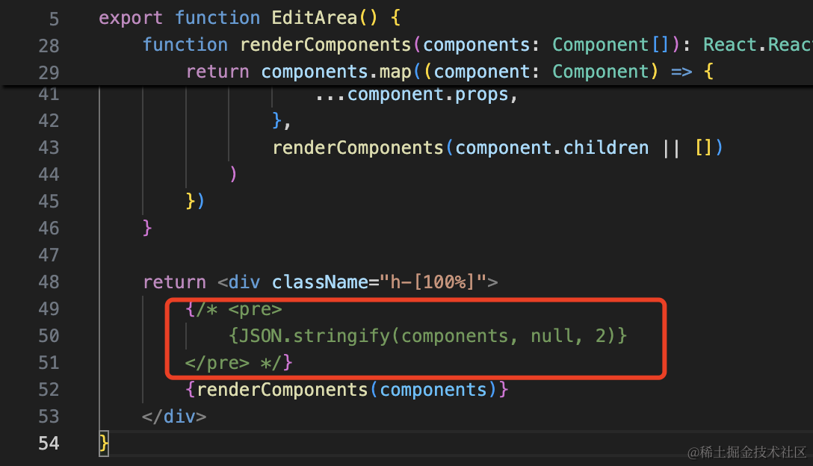

看下渲染效果：

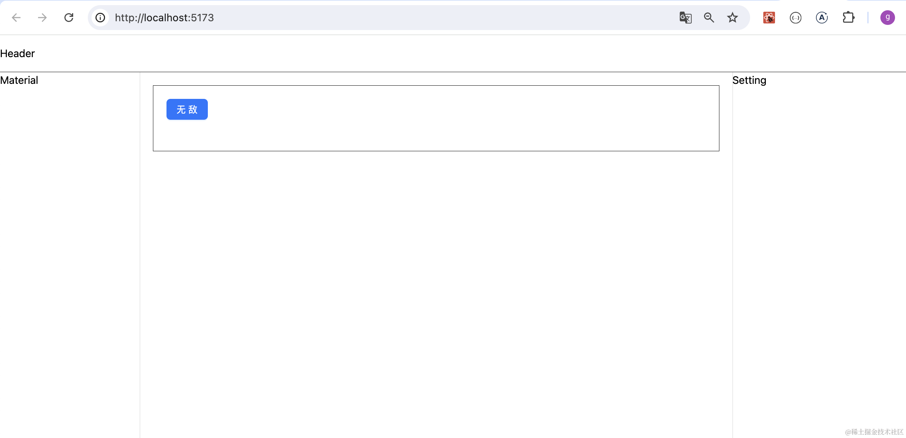

components 里的 Page、Container、Button 组件都渲染出来了。

用 react devtools 看下：

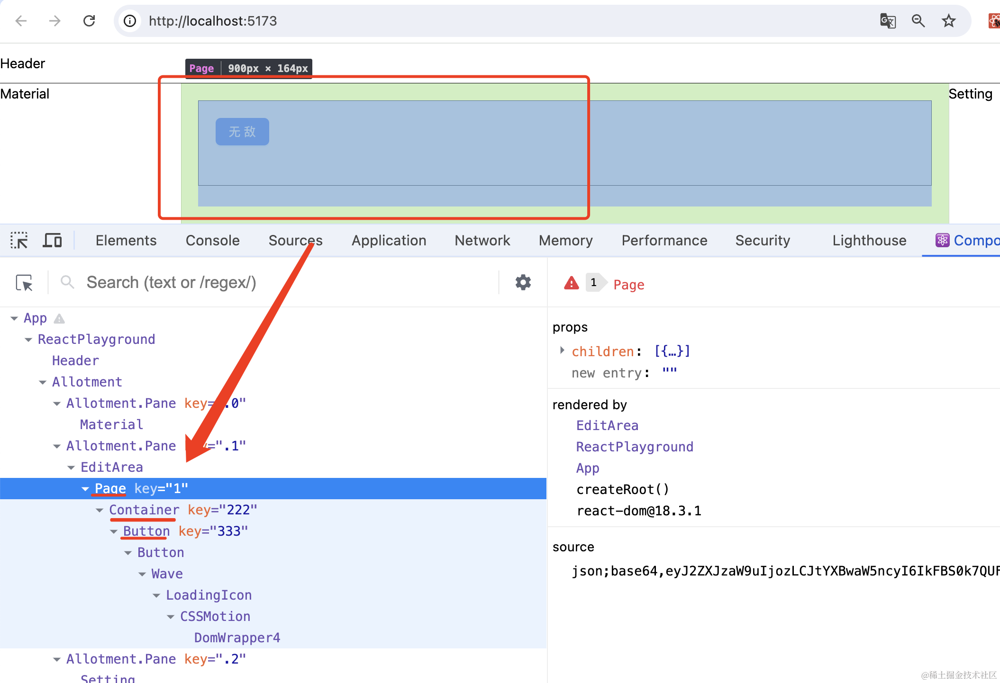

没啥问题。

这样，我们就把 components 的 json 渲染成了组件树。

把 addComponent 去掉，我们用拖拽的方式来添加组件：

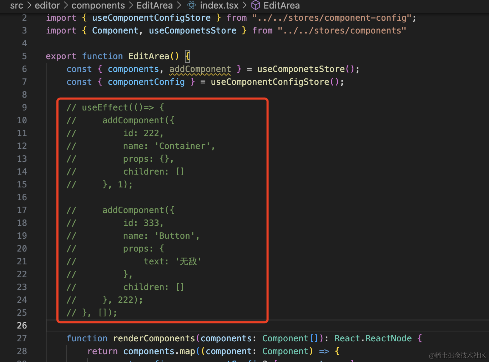

拖拽用 react-dnd 来做。

安装 react-dnd 的包：

```
npm install react-dnd react-dnd-html5-backend
```

在 main.tsx 里引入 DndProvider：

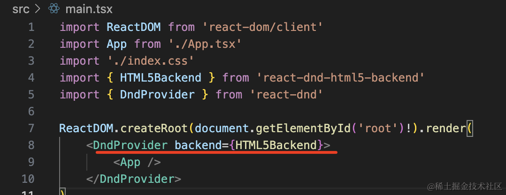

这个是 react-dnd 用来跨组件传递数据的

```javascript
import ReactDOM from 'react-dom/client'
import App from './App.tsx'
import './index.css'
import { HTML5Backend } from 'react-dnd-html5-backend'
import { DndProvider } from 'react-dnd'

ReactDOM.createRoot(document.getElementById('root')!).render(
    <DndProvider backend={HTML5Backend}>
        <App />
    </DndProvider>
)
```

然后在要拖拽的组件上添加 useDrag，在拖拽到的组件上添加 useDrop 就可以实现拖拽。

我们先写一下物料区：

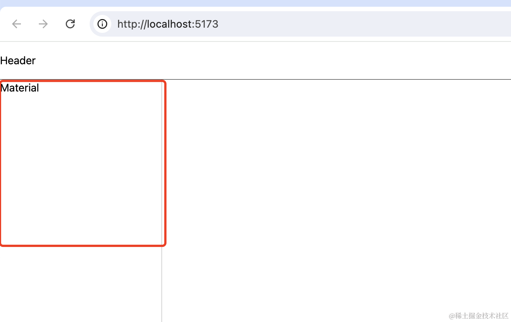

components/Material/index.tsx

```javascript
import { useMemo } from "react";
import { useComponentConfigStore } from "../../stores/component-config";

export function Material() {
    const { componentConfig } = useComponentConfigStore();

    const components = useMemo(() => {
        return Object.values(componentConfig);
     }, [componentConfig]);

    return <div>{
        components.map(item => {
            return <div
                className='
                    border-dashed
                    border-[1px]
                    border-[#000]
                    py-[8px] px-[10px] 
                    m-[10px]
                    cursor-move
                    inline-block
                    bg-white
                    hover:bg-[#ccc]
                '
            >
                {item.name}
            </div>
        })
    }</div>
}
```
读取 componentConfig 里注册的所有组件类型，渲染出来。

设置下 border、margin、padding。

看下效果：


我们要给每个 item 添加 useDrag 实现拖拽。

封装个组件：

components/MaterialItem/index.tsx

```javascript
export interface MaterialItemProps {
    name: string
}

export function MaterialItem(props: MaterialItemProps) {

    const {
        name
    } = props;

    return <div
        className='
            border-dashed
            border-[1px]
            border-[#000]
            py-[8px] px-[10px] 
            m-[10px]
            cursor-move
            inline-block
            bg-white
            hover:bg-[#ccc]
        '
    >
        {name}
    </div>
}
```
这样组件渲染的时候就可以用

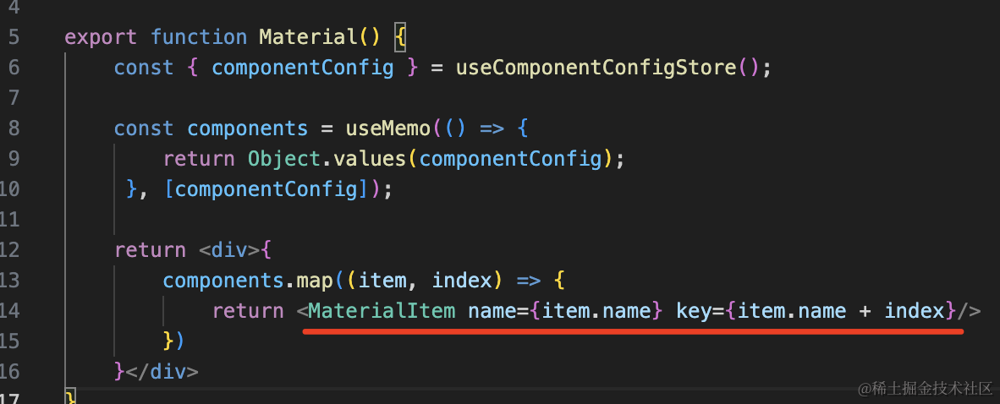

```javascript
components.map((item, index) => {
    return <MaterialItem name={item.name} key={item.name + index}/>
})
```
不影响页面渲染：


然后加一下 useDrag：

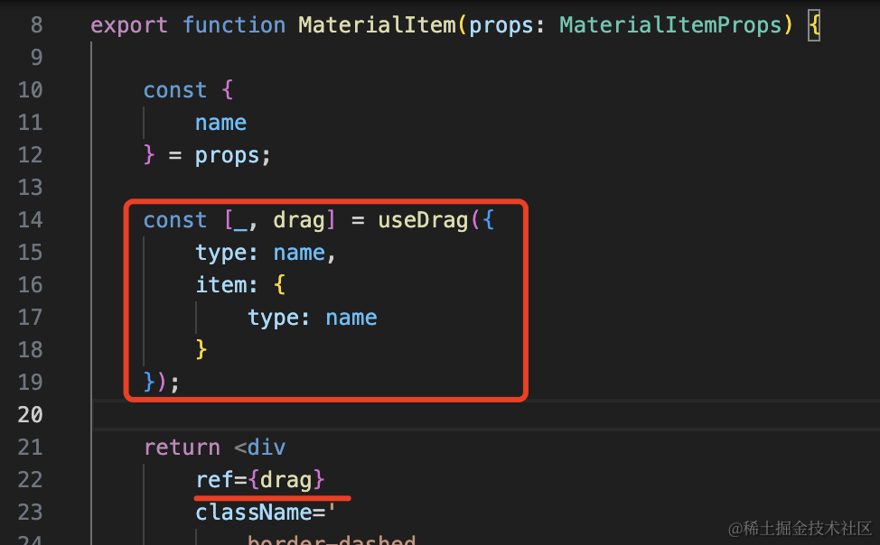
```javascript
import { useEffect, useRef } from "react";
import { useDrag } from "react-dnd";

export interface MaterialItemProps {
    name: string
}

export function MaterialItem(props: MaterialItemProps) {

    const {
        name
    } = props;

    const [_, drag] = useDrag({
        type: name,
        item: {
            type: name
        }
    });

    return <div
        ref={drag}
        className='
            border-dashed
            border-[1px]
            border-[#000]
            py-[8px] px-[10px] 
            m-[10px]
            cursor-move
            inline-block
            bg-white
            hover:bg-[#ccc]
        '
    >
        {name}
    </div>
}
```
type 是当前 drag 的元素的标识，drop 的时候根据这个来决定是否 accept。

item 是传递的数据。

测试下：

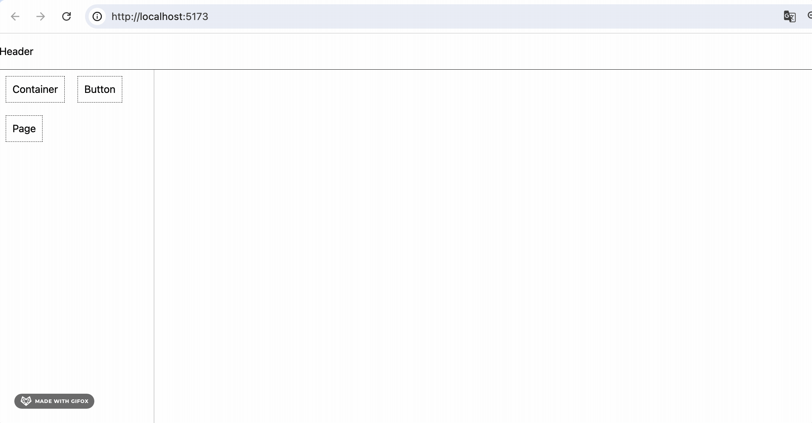

现在就可以拖拽了。

只是还没处理 drop 的逻辑。

我们在 Page 组件加一下 useDrop 的处理逻辑：

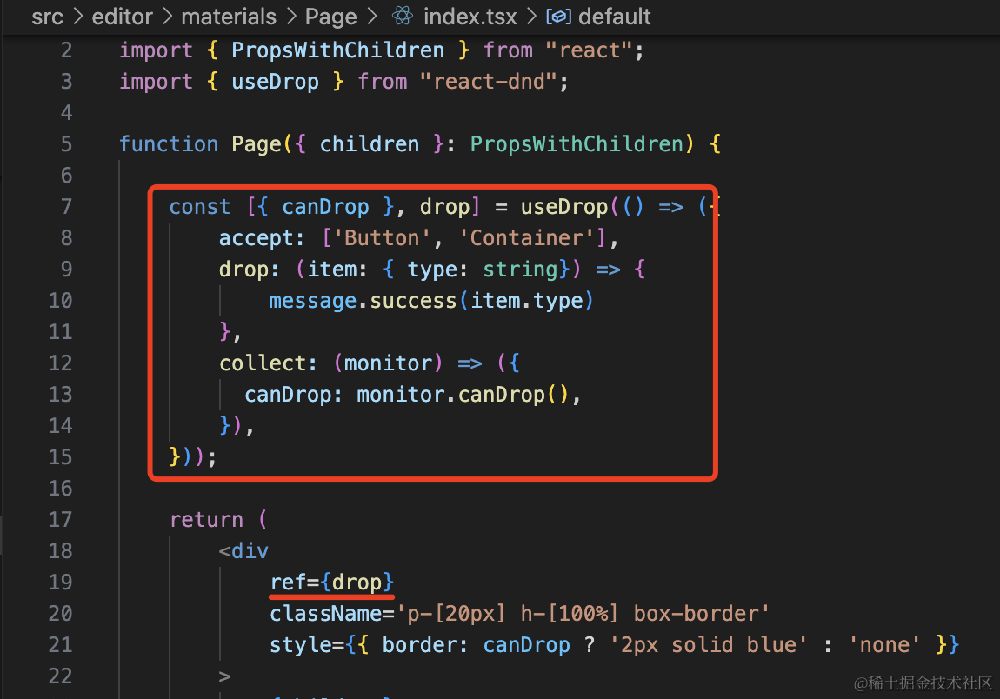

```javascript
import { message } from "antd";
import { PropsWithChildren } from "react";
import { useDrop } from "react-dnd";

function Page({ children }: PropsWithChildren) {

    const [{ canDrop }, drop] = useDrop(() => ({
        accept: ['Button', 'Container'],
        drop: (item: { type: string}) => {
            message.success(item.type)
        },
        collect: (monitor) => ({
          canDrop: monitor.canDrop(),
        }),
    }));

    return (
        <div
            ref={drop}
            className='p-[20px] h-[100%] box-border'
            style={{ border: canDrop ? '2px solid blue' : 'none' }}
        >
            {children}
        </div>
    )
}

export default Page;
```
accept 指定接收的 type，这里接收 Button 和 Container 组件

drop 的时候显示下传过来的 item 数据。

canDrop 的话加一个 border 的高亮。

试一下：

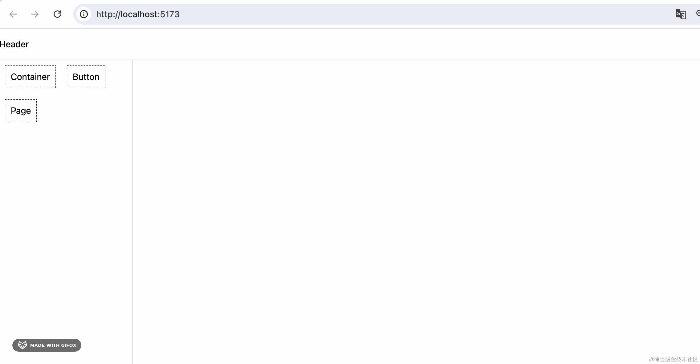

可以看到，Container 和 Button 拖拽到 Page 组件的时候，会触发 drop 事件。

接下来我们只要调用 addComponent 来添加 component 就行了。

这需要把 id 传进来：

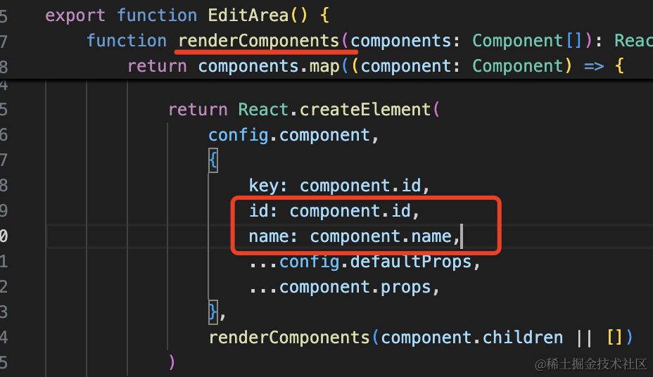

我们在 renderComponents 的时候传一下 component 的 id、name。

每个组件的参数都是这样，我们在 interface.ts 里定义下参数类型：

editor/interface.ts

```javascript
import { PropsWithChildren } from "react";

export interface CommonComponentProps extends PropsWithChildren{
    id: number;
    name: string;
    [key: string]: any
}
```

然后调用下 addComponent：

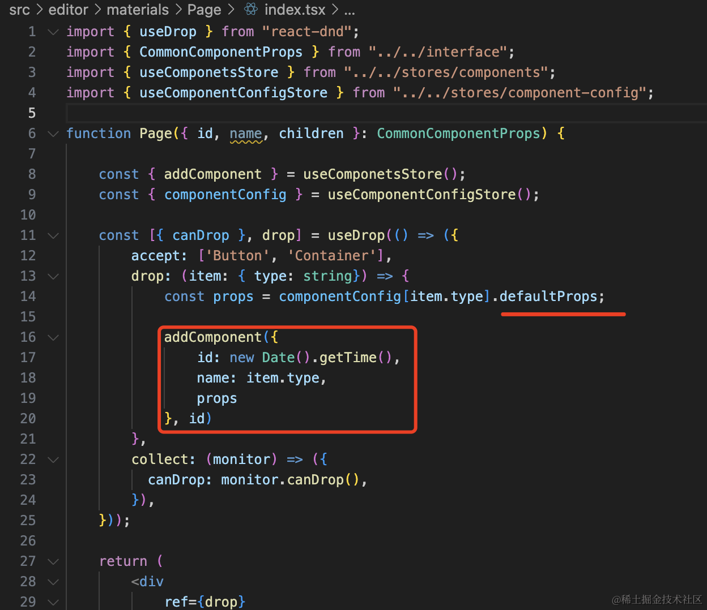

```javascript
import { useDrop } from "react-dnd";
import { CommonComponentProps } from "../../interface";
import { useComponetsStore } from "../../stores/components";
import { useComponentConfigStore } from "../../stores/component-config";

function Page({ id, name, children }: CommonComponentProps) {

    const { addComponent } = useComponetsStore();
    const { componentConfig } = useComponentConfigStore();

    const [{ canDrop }, drop] = useDrop(() => ({
        accept: ['Button', 'Container'],
        drop: (item: { type: string}) => {
            const props = componentConfig[item.type].defaultProps;

            addComponent({
                id: new Date().getTime(),
                name: item.type,
                props
            }, id)
        },
        collect: (monitor) => ({
          canDrop: monitor.canDrop(),
        }),
    }));

    return (
        <div
            ref={drop}
            className='p-[20px] h-[100%] box-border'
            style={{ border: canDrop ? '2px solid blue' : 'none' }}
        >
            {children}
        </div>
    )
}

export default Page;
```
测试下：

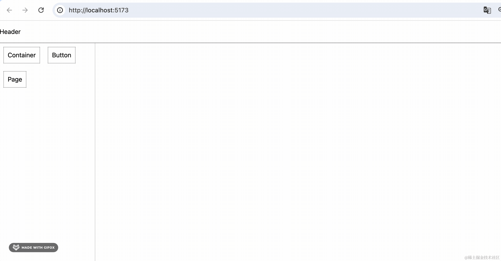

完美！

这样，拖拽编辑的第一步就完成了。

然后 Container 组件也是可以 drop 的。

我们加一下：

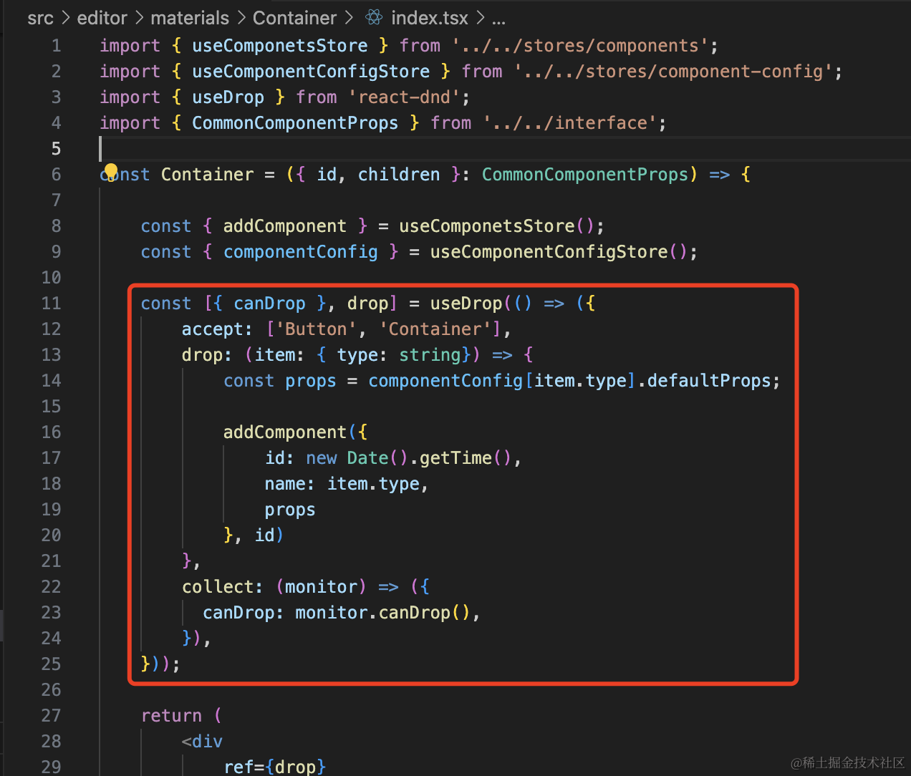

```javascript
import { useComponetsStore } from '../../stores/components';
import { useComponentConfigStore } from '../../stores/component-config';
import { useDrop } from 'react-dnd';
import { CommonComponentProps } from '../../interface';

const Container = ({ id, children }: CommonComponentProps) => {

    const { addComponent } = useComponetsStore();
    const { componentConfig } = useComponentConfigStore();

    const [{ canDrop }, drop] = useDrop(() => ({
        accept: ['Button', 'Container'],
        drop: (item: { type: string}) => {
            const props = componentConfig[item.type].defaultProps;

            addComponent({
                id: new Date().getTime(),
                name: item.type,
                props
            }, id)
        },
        collect: (monitor) => ({
          canDrop: monitor.canDrop(),
        }),
    }));

    return (
        <div 
            ref={drop}
            className={`min-h-[100px] p-[20px] ${ canDrop ? 'border-[2px] border-[blue]' : 'border-[1px] border-[#000]'}`}
        >{children}</div>
    )
}

export default Container;
```
测试下：

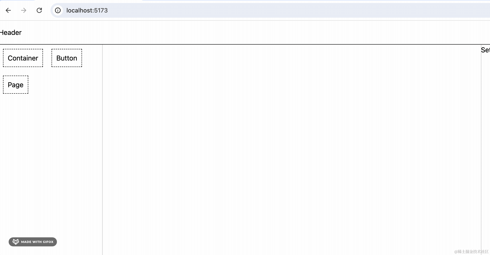

可以拖拽组件到 Container 了，但是 Page 的 drop 也被触发了。

我们要加一下判断，处理过 drop 就不再处理。

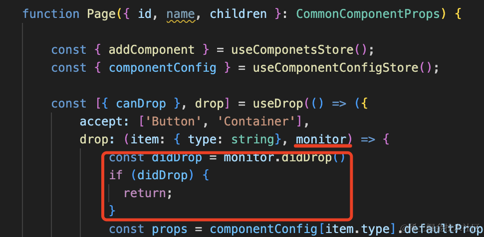

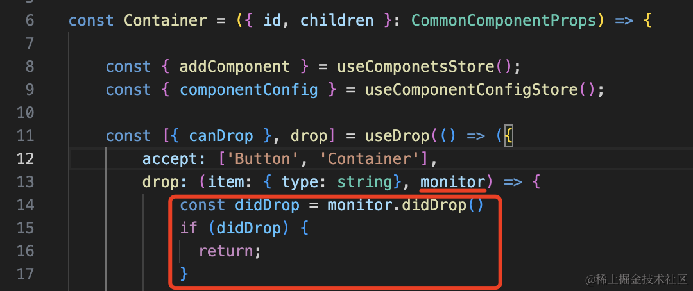

```javascript
const didDrop = monitor.didDrop()
if (didDrop) {
  return;
}
```
这样就好了：


没啥问题。

useDrop 代码重复了两次，我们封装一个自定义 hooks：

editor/hooks/useMaterialDrop.ts

```javascript
import { useDrop } from "react-dnd";
import { useComponentConfigStore } from "../stores/component-config";
import { useComponetsStore } from "../stores/components";

export function useMaterailDrop(accept: string[], id: number) {
    const { addComponent } = useComponetsStore();
    const { componentConfig } = useComponentConfigStore();

    const [{ canDrop }, drop] = useDrop(() => ({
        accept,
        drop: (item: { type: string}, monitor) => {
            const didDrop = monitor.didDrop()
            if (didDrop) {
              return;
            }

            const props = componentConfig[item.type].defaultProps;

            addComponent({
                id: new Date().getTime(),
                name: item.type,
                props
            }, id)
        },
        collect: (monitor) => ({
          canDrop: monitor.canDrop(),
        }),
    }));

    return { canDrop, drop }
}
```
传入 accept 和 id 参数，返回 canDrop 和 drop。

在 Page 和 Container 组件用一下：

```javascript
import { CommonComponentProps } from "../../interface";
import { useMaterailDrop } from "../../hooks/useMaterailDrop";

function Page({ id, name, children }: CommonComponentProps) {

    const {canDrop, drop } = useMaterailDrop(['Button', 'Container'], id);

    return (
        <div
            ref={drop}
            className='p-[20px] h-[100%] box-border'
            style={{ border: canDrop ? '2px solid blue' : 'none' }}
        >
            {children}
        </div>
    )
}

export default Page;
```
```javascript
import { useMaterailDrop } from '../../hooks/useMaterailDrop';
import { CommonComponentProps } from '../../interface';

const Container = ({ id, children }: CommonComponentProps) => {

    const {canDrop, drop } = useMaterailDrop(['Button', 'Container'], id);

    return (
        <div 
            ref={drop}
            className={`min-h-[100px] p-[20px] ${ canDrop ? 'border-[2px] border-[blue]' : 'border-[1px] border-[#000]'}`}
        >{children}</div>
    )
}

export default Container;
```
这样代码好看多了。

然后我们先在 Setting 组件里展示下 json：

```javascript
import { useComponetsStore } from "../../stores/components";

export function Setting() {
    const { components } = useComponetsStore();

    return <div>
        <pre>
            {JSON.stringify(components, null, 2)}
        </pre> 
    </div>
}
```
测试下：


可以看到，拖拽编辑的时候，json 和画布的内容会同步修改。

完美！

案例代码上传了[小册仓库](https://github.com/QuarkGluonPlasma/react-course-code/tree/main/lowcode-editor)，可以切换到这个 commit 查看：

```
git reset --hard 6f55fcbcc93bfec667975d808ac2d4c3f97fac05
```

## 总结

这节我们实现了拖拽组件到画布，也就是拖拽编辑 json。

首先我们加了 Button 和 Container 组件，并创建了 componentConfig 的全局 store，用来保存组件配置。

然后实现了 renderComponents，它就是递归渲染 component，用到的组件配置从 componentConfig 取。

之后引入 react-dnd 实现了拖拽编辑，左侧的物料添加 useDrag，画布里的组件添加 useDrop，然后当 drop 的时候，在对应 id 下添加一个对应的类型的组件。

组件类型在 useDrag 的时候通过 item 传递，添加到的组件 id 在 drop 的那个组件里就有。

然后还要处理下 didDrop，保证只 drop 一次。

这样，我们就实现了拖拽编辑 json 的功能。
