上节我们实现了 json 到组件树的渲染，以及拖拽改变 json，支持任意层级：


这节我们继续来实现编辑时的交互效果。

也就是[这个](https://aisuda.github.io/amis-editor-demo/#/edit/0)：

鼠标 hover 到画布区的任意组件，都会有高亮效果：

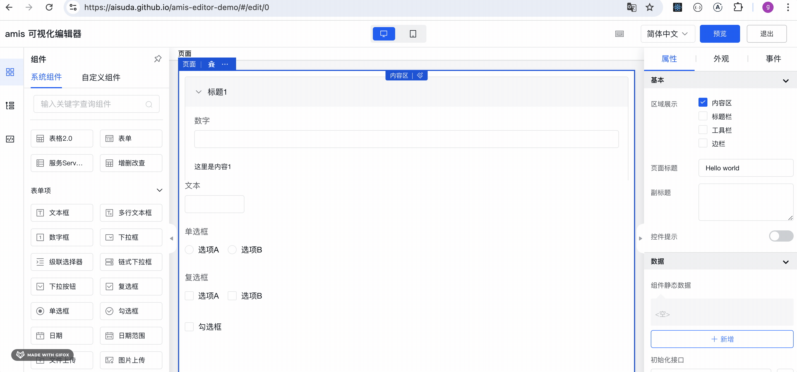

选中组件的时候，会有框选效果：


这种效果怎么实现呢？

最容易想到的就是每个组件都做下处理，hover 或者 click 的时候展示编辑框。

但每个组件都加这段逻辑比较麻烦。

更好的方式是在画布区根组件统一监听 hover 和 click，根据触发事件的元素的 width、height、left、top，来显示编辑框。

类似我们之前实现的 OnBoarding 组件：


就是一个 div 来改变 width、height、left、top 实现的。

这里也类似。

我们实现下：

我们需要知道 hover 或者 click 的元素对应的 component 的 id。

在渲染的时候加一下这个：

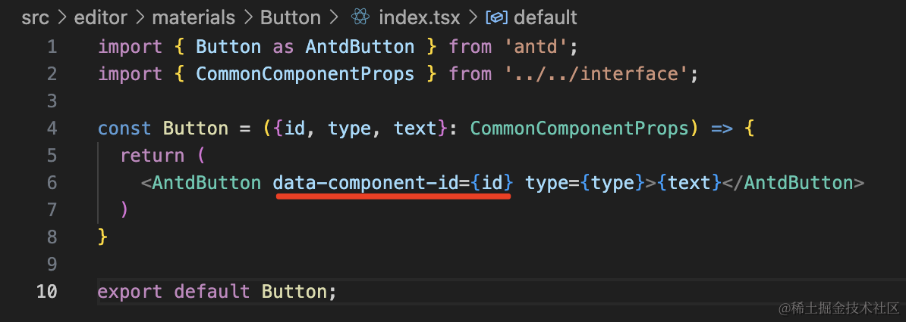

```javascript
import { Button as AntdButton } from 'antd';
import { CommonComponentProps } from '../../interface';

const Button = ({id, type, text}: CommonComponentProps) => {
  return (
    <AntdButton data-component-id={id} type={type}>{text}</AntdButton>
  )
}

export default Button;
```
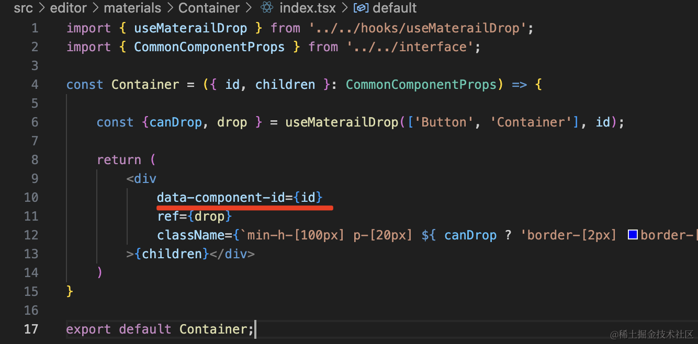

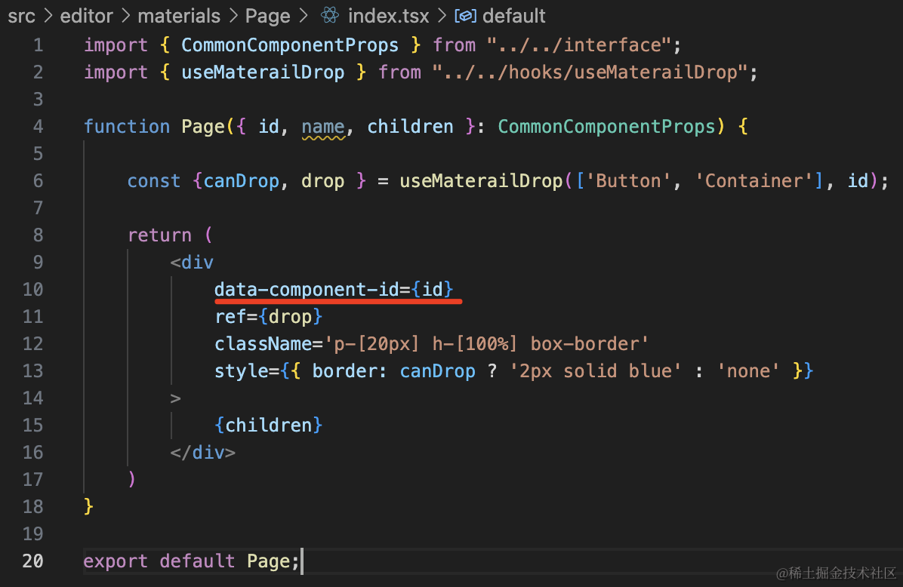

试一下：

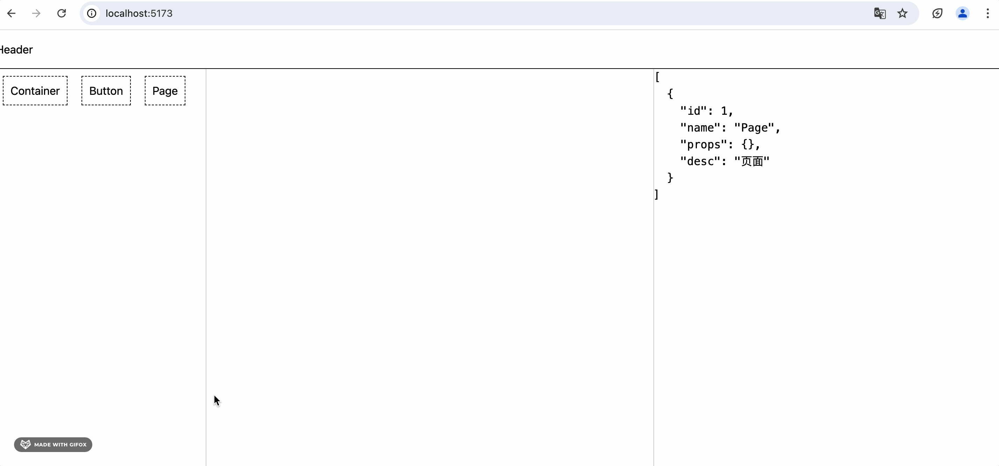

拖拽两个组件过来。

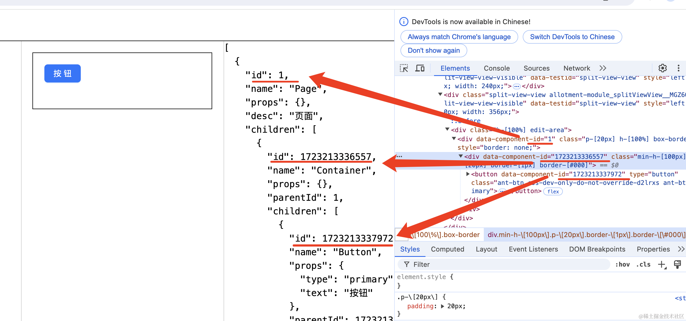

可以看到，id 加在了组件元素的 data-component-id 属性上。

然后在 EditArea 里处理下 hover

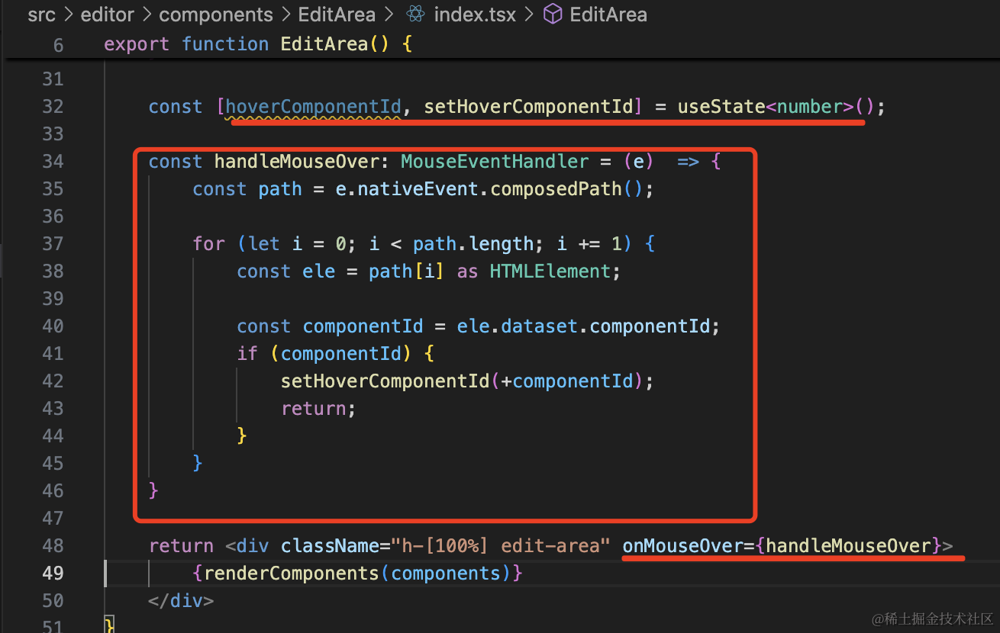

```javascript
const [hoverComponentId, setHoverComponentId] = useState<number>();

const handleMouseOver: MouseEventHandler = (e)  => {
    const path = e.nativeEvent.composedPath();

    for (let i = 0; i < path.length; i += 1) {
        const ele = path[i] as HTMLElement;

        const componentId = ele.dataset?.componentId;
        if (componentId) {
            setHoverComponentId(+componentId);
            return;
        }
    }
}
```

mouseover 的时候做下处理，找到元素的 data-component-id 设置为 hoverComponentId 的 state

加个 debugger

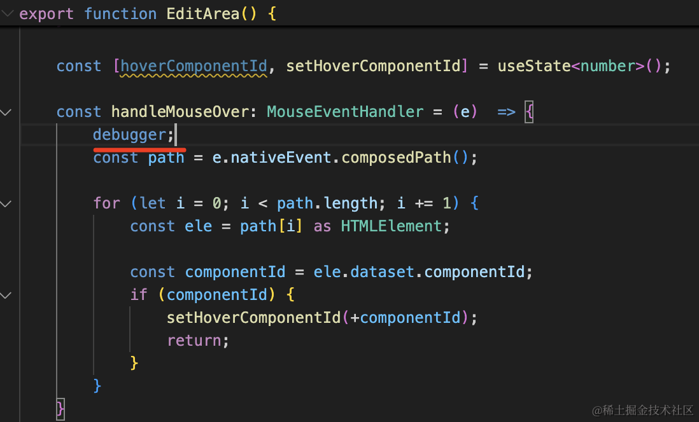

浏览器里打开 devtools，鼠标划到画布区：

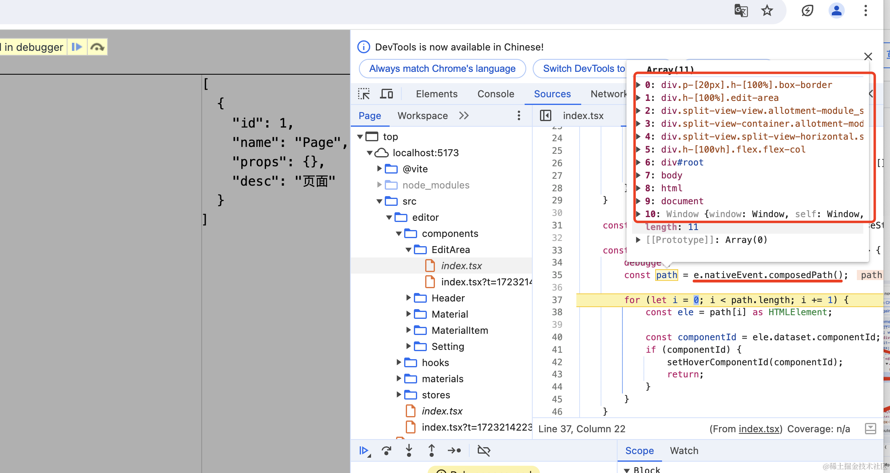

可以看到 composedPath 是从触发事件的元素到 html 根元素的路径。

这是 event 对象的 api。

为啥不直接 e.composedPath 而是取 e.nativeEvent.composedPath 呢？

因为 react 里的 event 是合成事件，有的原生事件的属性它没有：

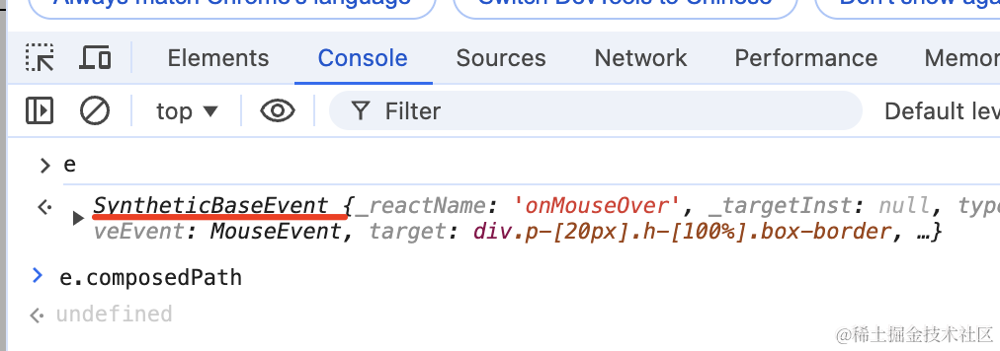

这时候就可以通过 e.nativeEvent 取它的原生事件：

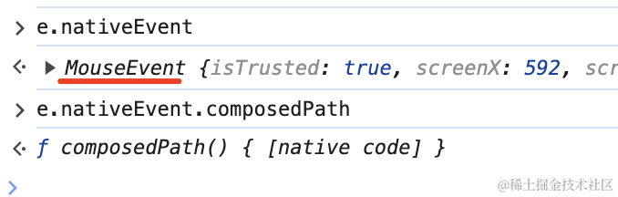

然后我们在整个路径从底向上找，找到第一个有 data-component-id 的元素。

它就是当前 hover 的组件了。

还有这个 ele.dataset，它是一个 dom 的属性，包含所有 data-xx 的属性的值：

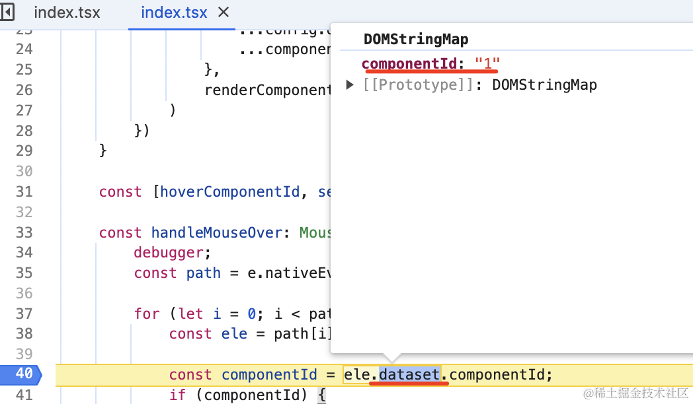

这样，在 hover 到不同 component 的时候，就能拿到对应的 componentId

我们渲染下这个 hoverComponentId：

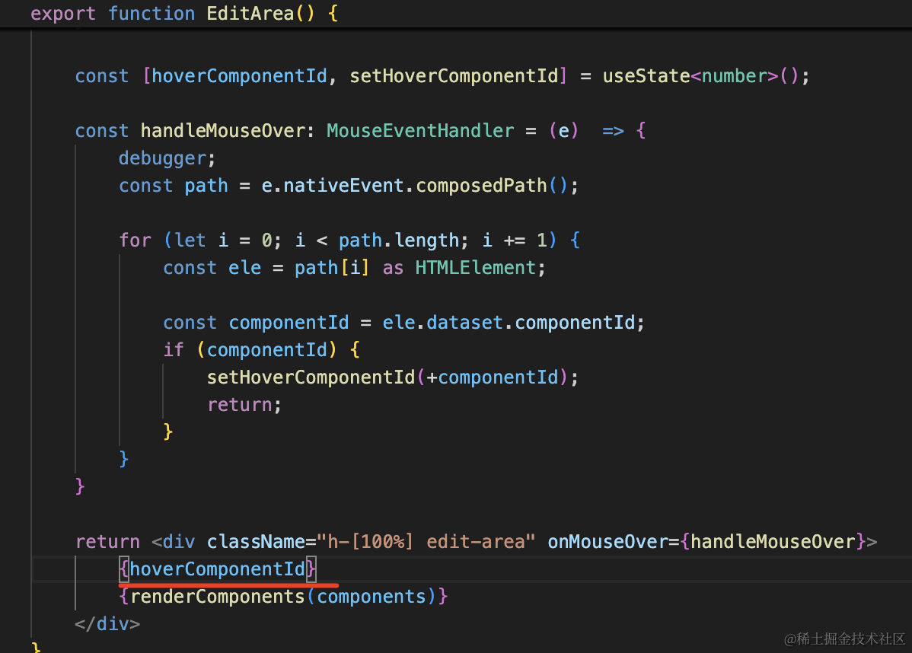

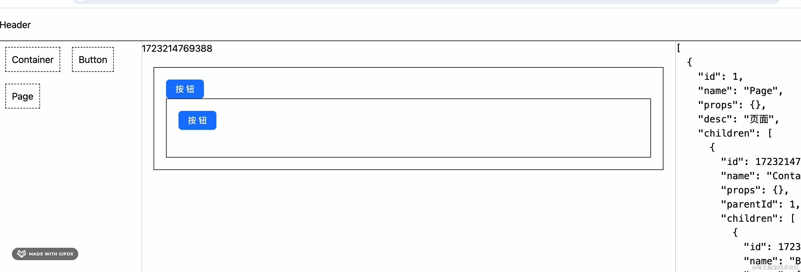

没啥问题。

然后接下来就是拿到 component-id 对应的 dom 的 with、height、left、top，加一个框上去就好了。

我们创建个组件来写这个：

editor/components/HoverMask/index.tsx

```javascript
import {
  useEffect,
  useMemo,
  useState,
} from 'react';
import { createPortal } from 'react-dom';

interface HoverMaskProps {
  containerClassName: string
  componentId: number;
}

function HoverMask({ containerClassName, componentId }: HoverMaskProps) {

  const [position, setPosition] = useState({
    left: 0,
    top: 0,
    width: 0,
    height: 0
  });

  useEffect(() => {
    updatePosition();
  }, [componentId]);

  function updatePosition() {
    if (!componentId) return;

    const container = document.querySelector(`.${containerClassName}`);
    if (!container) return;

    const node = document.querySelector(`[data-component-id="${componentId}"]`);
    if (!node) return;

    const { top, left, width, height } = node.getBoundingClientRect();
    const { top: containerTop, left: containerLeft } = container.getBoundingClientRect();

    setPosition({
      top: top - containerTop + container.scrollTop,
      left: left - containerLeft + container.scrollTop,
      width,
      height
    });
  }

  const el = useMemo(() => {
      const el = document.createElement('div');
      el.className = `wrapper`;

      const container = document.querySelector(`.${containerClassName}`);
      container!.appendChild(el);
      return el;
  }, []);

  return createPortal((
    <div
      style={{
        position: "absolute",
        left: position.left,
        top: position.top,
        backgroundColor: "rgba(0, 0, 255, 0.1)",
        border: "1px dashed blue",
        pointerEvents: "none",
        width: position.width,
        height: position.height,
        zIndex: 12,
        borderRadius: 4,
        boxSizing: 'border-box',
      }}
    />
  ), el)
}

export default HoverMask;
```
从上到下来看：

首先，需要传入 containerClassName 和 componentId 参数：

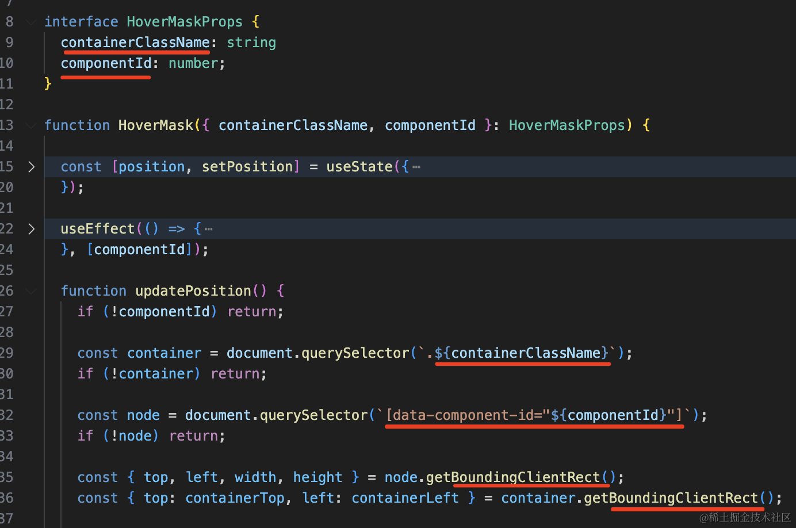

componentId 就是 hover 的组件 id，而 containerClassName 就是画布区的根元素的 className。

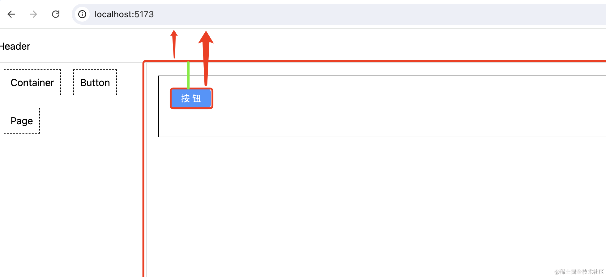

比如上图，我们计算按钮和画布区顶部的距离，就需要按钮的 boundingClientRect 还有画布区的 boundingClientRect。

所以需要传入 containerClassName 和 componentId。

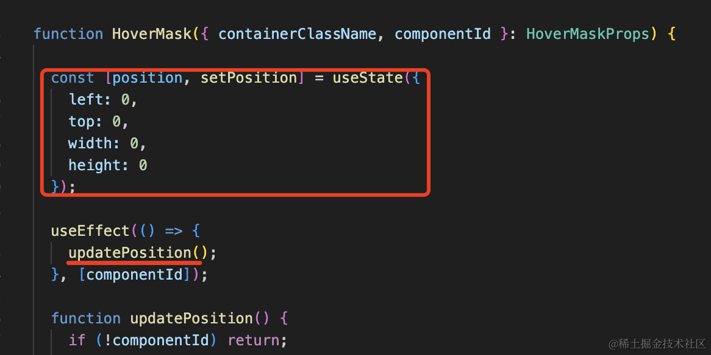

我们声明 left、top、width、height 的 state，调用 updatePosition 来计算这些位置。

计算方式如下：

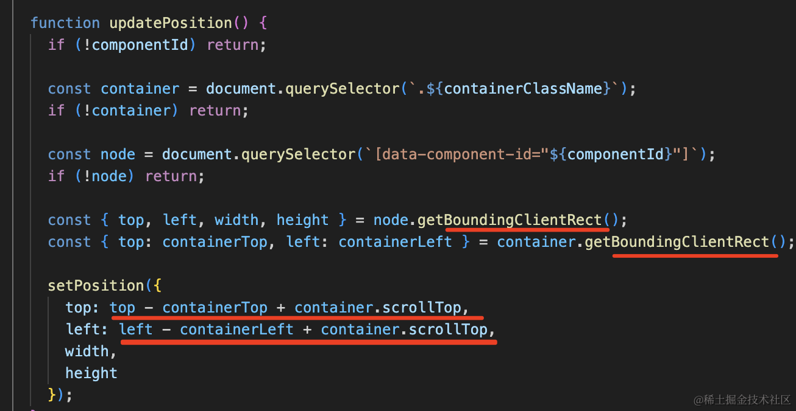

获取两个元素的 boundingClientRect，计算 top、left 的差值，加上 scrollTop、scrollLeft。

因为 boundingClientRect 只是可视区也就是和视口的距离，要算绝对定位的位置的话要加上已滚动的距离。

然后创建一个 div 挂载在容器下，用于存放 portal：

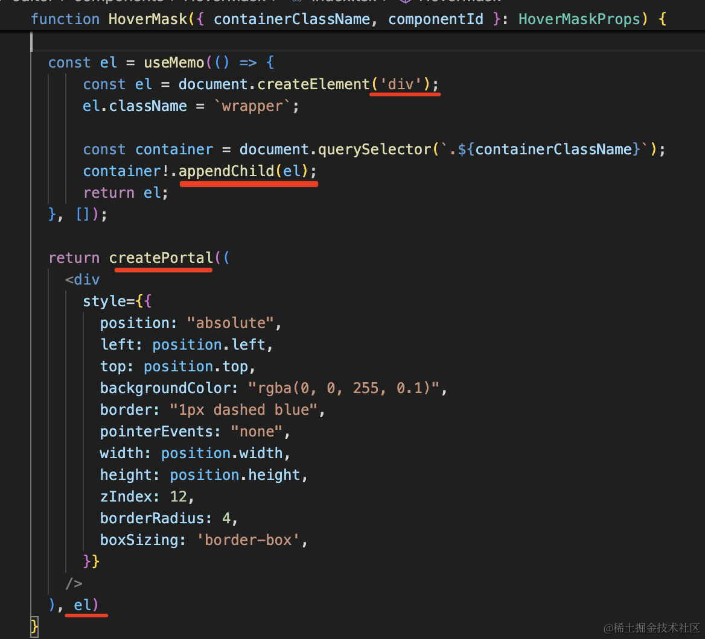

具体的样式比较简单，就是设置下 top、left、width、height，然后设置下 border、background 就好了：

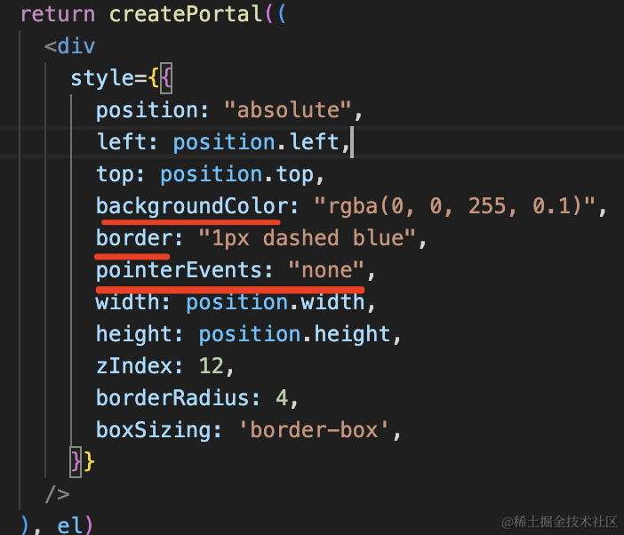

注意还要设置 pointer-event 为 none，不响应鼠标事件。

HoverMask 组件写完了，我们用一下：

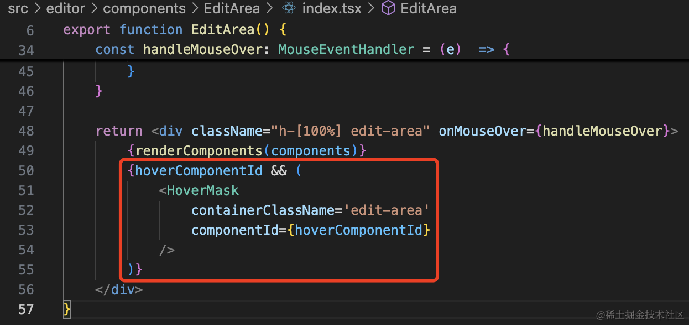

```javascript
{hoverComponentId && (
    <HoverMask
        containerClassName='edit-area'
        componentId={hoverComponentId}
    />
)}
```
看下效果：


高亮是对的，只是当鼠标离开画布区的时候还在高亮。

处理下 mouseleave 的时候：

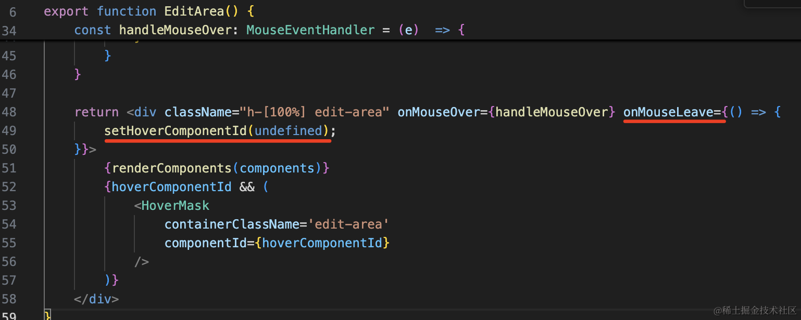

```javascript
onMouseLeave={() => {
    setHoverComponentId(undefined);
}}
```
这样就好了：


但只是高亮下意义不大，我们把组件名也显示下：

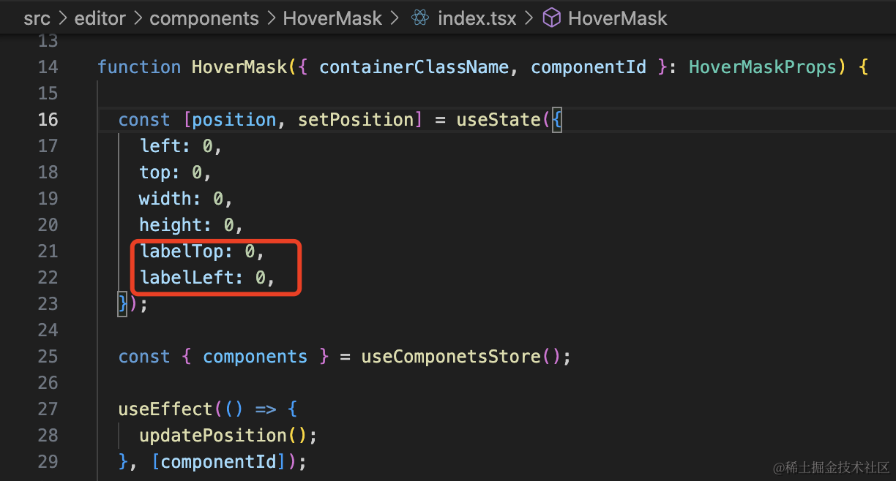

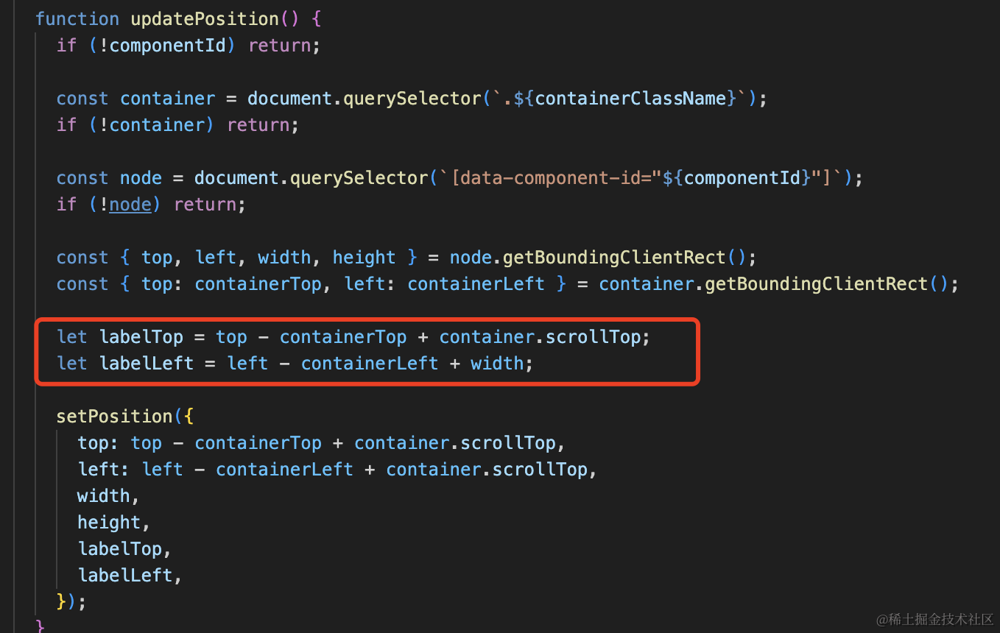

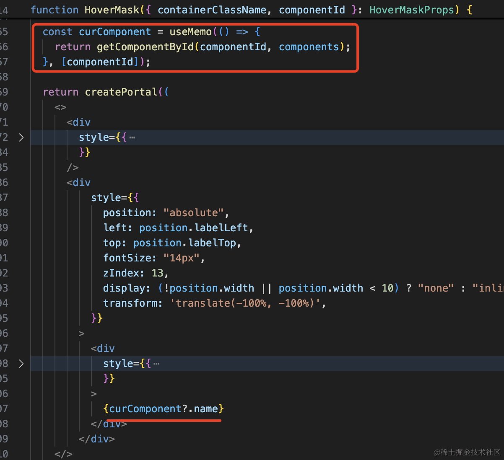

就是在加一个右上角 label 的位置计算，然后根据 id 找到对应 component 的 name 显示。

```javascript
import {
  useEffect,
  useMemo,
  useState,
} from 'react';
import { createPortal } from 'react-dom';
import { getComponentById, useComponetsStore } from '../../stores/components';

interface HoverMaskProps {
  containerClassName: string
  componentId: number;
}

function HoverMask({ containerClassName, componentId }: HoverMaskProps) {

  const [position, setPosition] = useState({
    left: 0,
    top: 0,
    width: 0,
    height: 0,
    labelTop: 0,
    labelLeft: 0,
  });

  const { components } = useComponetsStore();

  useEffect(() => {
    updatePosition();
  }, [componentId]);

  function updatePosition() {
    if (!componentId) return;

    const container = document.querySelector(`.${containerClassName}`);
    if (!container) return;

    const node = document.querySelector(`[data-component-id="${componentId}"]`);
    if (!node) return;

    const { top, left, width, height } = node.getBoundingClientRect();
    const { top: containerTop, left: containerLeft } = container.getBoundingClientRect();

    let labelTop = top - containerTop + container.scrollTop;
    let labelLeft = left - containerLeft + width;

    setPosition({
      top: top - containerTop + container.scrollTop,
      left: left - containerLeft + container.scrollTop,
      width,
      height,
      labelTop,
      labelLeft,
    });
  }

  const el = useMemo(() => {
      const el = document.createElement('div');
      el.className = `wrapper`;

      const container = document.querySelector(`.${containerClassName}`);
      container!.appendChild(el);
      return el;
  }, []);

  const curComponent = useMemo(() => {
    return getComponentById(componentId, components);
  }, [componentId]);

  return createPortal((
    <>
      <div
        style={{
          position: "absolute",
          left: position.left,
          top: position.top,
          backgroundColor: "rgba(0, 0, 255, 0.05)",
          border: "1px dashed blue",
          pointerEvents: "none",
          width: position.width,
          height: position.height,
          zIndex: 12,
          borderRadius: 4,
          boxSizing: 'border-box',
        }}
      />
      <div
          style={{
            position: "absolute",
            left: position.labelLeft,
            top: position.labelTop,
            fontSize: "14px",
            zIndex: 13,
            display: (!position.width || position.width < 10) ? "none" : "inline",
            transform: 'translate(-100%, -100%)',
          }}
        >
          <div
            style={{
              padding: '0 8px',
              backgroundColor: 'blue',
              borderRadius: 4,
              color: '#fff',
              cursor: "pointer",
              whiteSpace: 'nowrap',
            }}
          >
            {curComponent?.name}
          </div>
        </div>
    </>
  ), el)
}

export default HoverMask;
```
测试下：


这里的位置是这样算的：

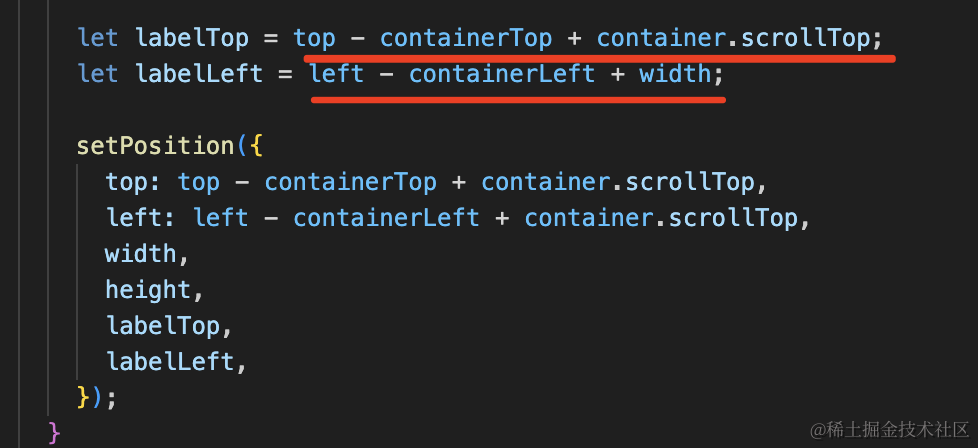

labelTop 和高亮框一样，齐平。

labelLeft 是高亮框的 left，加上高亮框宽度。

然后 translate 回去：

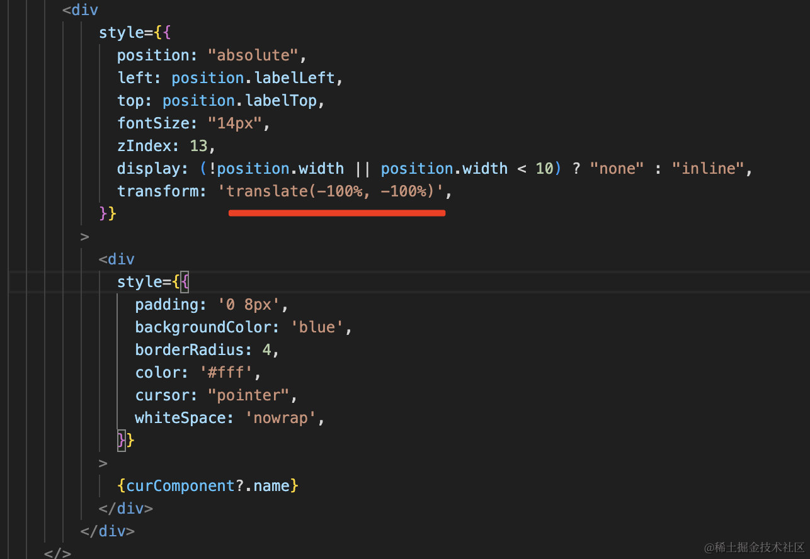

如果不 tanslate 回去是这样的：

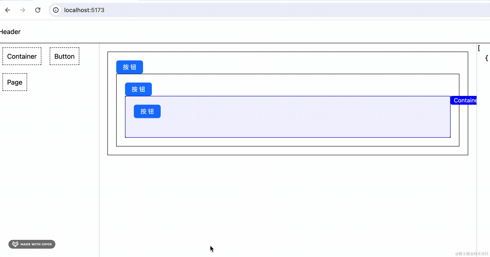

此外，还要处理下边界情况，Page 组件就没显示 label 因为定位到上面去了：

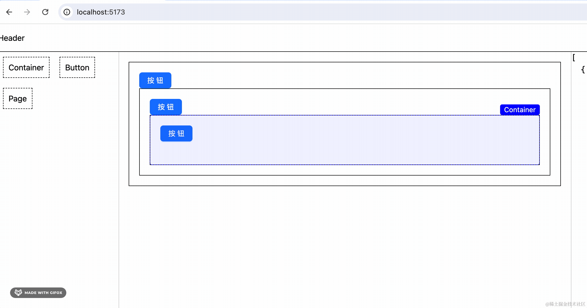

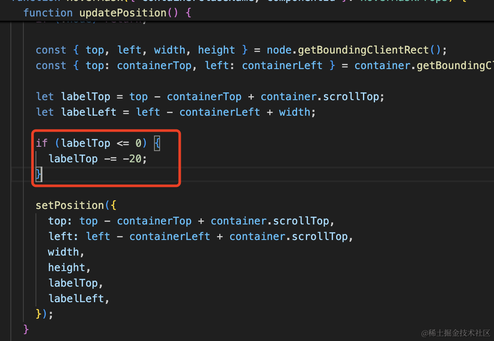

```javascript
if (labelTop <= 0) {
  labelTop -= -20;
}
```
现在就能显示出来了：

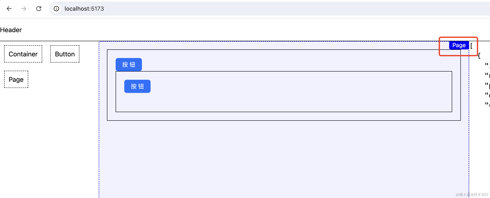

其实还有个问题：

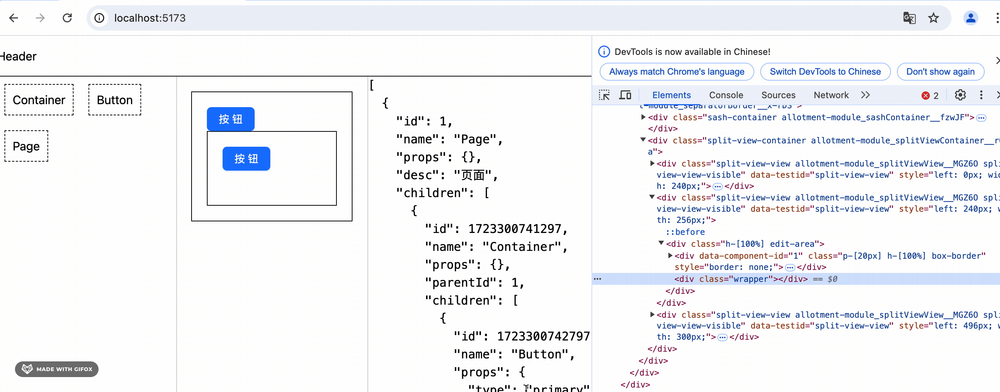

.wrapper 会创建多个。

这是因为 hoverComponentId 只要一变，就会卸载之前的 HoverMask 创建新的：

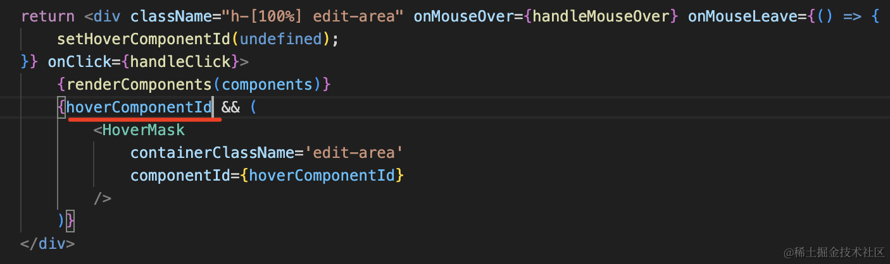

所以这段逻辑会执行多次，创建多个 .wrapper 元素：

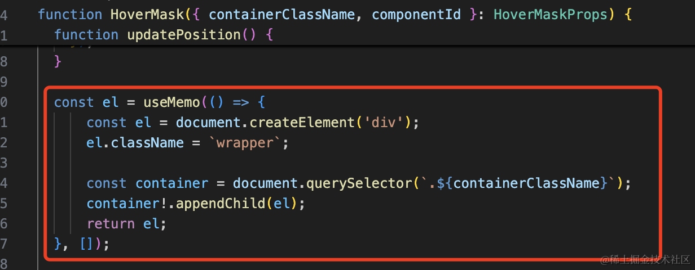

这样性能不好。

我们改一下：

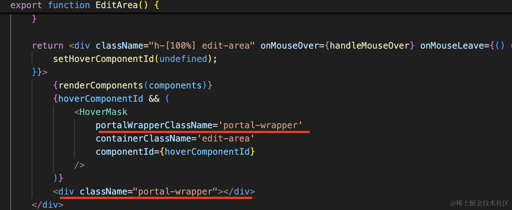

直接在 EditArea 里创建个元素用来挂载 portal，把 className 传入 HoverMask 组件。

```javascript
return <div className="h-[100%] edit-area" onMouseOver={handleMouseOver} onMouseLeave={() => {
    setHoverComponentId(undefined);
}} onClick={handleClick}>
    {renderComponents(components)}
    {hoverComponentId && (
        <HoverMask
            portalWrapperClassName='portal-wrapper'
            containerClassName='edit-area'
            componentId={hoverComponentId}
        />
    )}
    <div className="portal-wrapper"></div>
</div>
```
HoverMask 直接把 portal 挂载到这个 className 的元素下就好了：

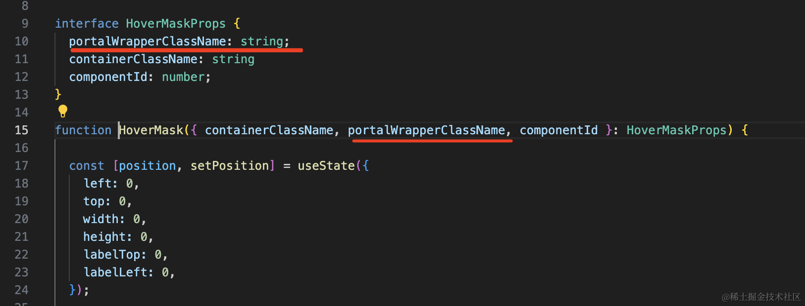

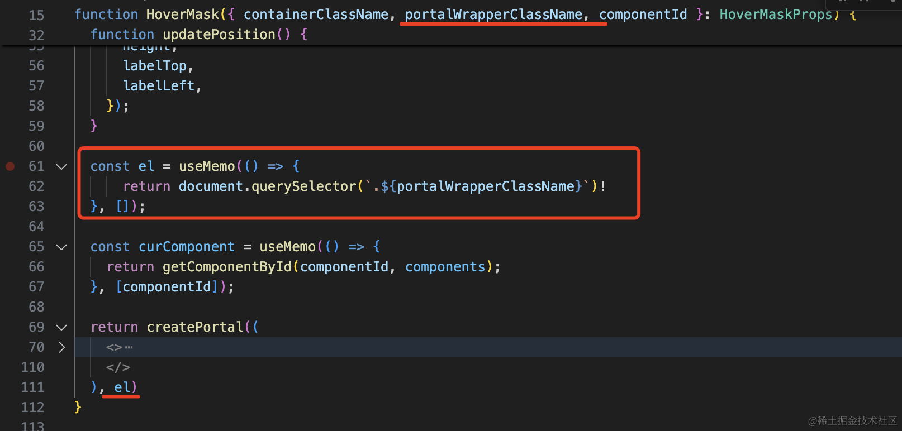

```javascript
import {
  useEffect,
  useMemo,
  useState,
} from 'react';
import { createPortal } from 'react-dom';
import { getComponentById, useComponetsStore } from '../../stores/components';

interface HoverMaskProps {
  portalWrapperClassName: string;
  containerClassName: string
  componentId: number;
}

function HoverMask({ containerClassName, portalWrapperClassName, componentId }: HoverMaskProps) {

  const [position, setPosition] = useState({
    left: 0,
    top: 0,
    width: 0,
    height: 0,
    labelTop: 0,
    labelLeft: 0,
  });

  const { components } = useComponetsStore();

  useEffect(() => {
    updatePosition();
  }, [componentId]);

  function updatePosition() {
    if (!componentId) return;

    const container = document.querySelector(`.${containerClassName}`);
    if (!container) return;

    const node = document.querySelector(`[data-component-id="${componentId}"]`);
    if (!node) return;

    const { top, left, width, height } = node.getBoundingClientRect();
    const { top: containerTop, left: containerLeft } = container.getBoundingClientRect();

    let labelTop = top - containerTop + container.scrollTop;
    let labelLeft = left - containerLeft + width;

    if (labelTop <= 0) {
      labelTop -= -20;
    }
  
    setPosition({
      top: top - containerTop + container.scrollTop,
      left: left - containerLeft + container.scrollTop,
      width,
      height,
      labelTop,
      labelLeft,
    });
  }

  const el = useMemo(() => {
      return document.querySelector(`.${portalWrapperClassName}`)!
  }, []);

  const curComponent = useMemo(() => {
    return getComponentById(componentId, components);
  }, [componentId]);

  return createPortal((
    <>
      <div
        style={{
          position: "absolute",
          left: position.left,
          top: position.top,
          backgroundColor: "rgba(0, 0, 255, 0.05)",
          border: "1px dashed blue",
          pointerEvents: "none",
          width: position.width,
          height: position.height,
          zIndex: 12,
          borderRadius: 4,
          boxSizing: 'border-box',
        }}
      />
      <div
          style={{
            position: "absolute",
            left: position.labelLeft,
            top: position.labelTop,
            fontSize: "14px",
            zIndex: 13,
            display: (!position.width || position.width < 10) ? "none" : "inline",
            transform: 'translate(-100%, -100%)',
          }}
        >
          <div
            style={{
              padding: '0 8px',
              backgroundColor: 'blue',
              borderRadius: 4,
              color: '#fff',
              cursor: "pointer",
              whiteSpace: 'nowrap',
            }}
          >
            {curComponent?.name}
          </div>
        </div>
    </>
  ), el)
}

export default HoverMask;
```
测试下：


现在就只会有一个 wrapper 元素了。

案例代码上传了[小册仓库](https://github.com/QuarkGluonPlasma/react-course-code/tree/main/lowcode-editor)，可以切换到这个 commit 查看：

```
git reset --hard 8b0dacec372a39d4eb90090c0d0a694f7ed9485b
```

## 总结

这节我们实现了下编辑的时候的交互，实现了 hover 的时候展示高亮框和组件名。

我们在每个组件渲染的时候加上了 data-component-id，然后在画布区根组件监听 mouseover 事件，通过触发事件的元素一层层往上找，找到 component-id。

然后 getBoudingClientRect 拿到这个元素的 width、height、left、top 等信息，和画布区根元素的位置做计算，算出高亮框的位置。

并在高亮框的右上角展示了组件名。

这样，编辑时高亮展示组件信息的功能就完成了。
