这节我们来画下流程图。

创建个项目：

```
npx create-vite audio-flow
```
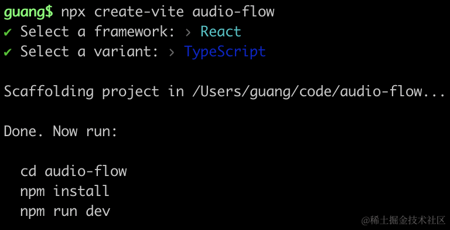

进入项目，安装下 reactflow

```
npm install
npm install --save @xyflow/react
```
去掉 index.css


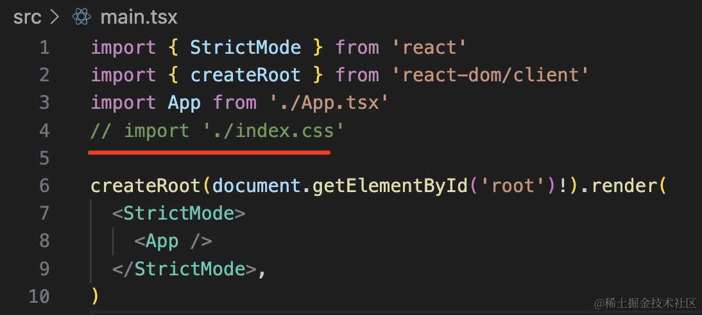

然后改下 App.tsx

```javascript
import { addEdge, Background, BackgroundVariant, Connection, Controls, MiniMap, OnConnect, ReactFlow, useEdgesState, useNodesState } from '@xyflow/react';
import '@xyflow/react/dist/style.css';
 
const initialNodes = [
  { id: '1', position: { x: 0, y: 0 }, data: { label: '1' } },
  { id: '2', position: { x: 0, y: 100 }, data: { label: '2' } },
];
const initialEdges = [{ id: 'e1-2', source: '1', target: '2' }];
 
export default function App() {
  const [nodes, setNodes, onNodesChange] = useNodesState(initialNodes);
  const [edges, setEdges, onEdgesChange] = useEdgesState(initialEdges);
 
  const onConnect = (params: Connection) => {
    setEdges((eds) => addEdge(params, eds))
  }

  return (
    <div style={{ width: '100vw', height: '100vh'}}>
      <ReactFlow 
        nodes={nodes}
        edges={edges}
        onNodesChange={onNodesChange}
        onEdgesChange={onEdgesChange}
        onConnect={onConnect}
      >
        <Controls/>
        <MiniMap/>
        <Background variant={BackgroundVariant.Lines}/>
      </ReactFlow>
    </div>
  );
}
```
我们写了下基础代码，加了两个 node，一个 edge，然后加了 Controles、Background、MiniMap 组件。

跑起来看一下：

```
npm run dev
```
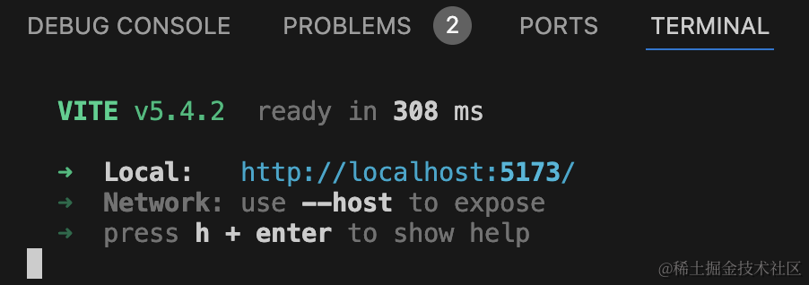


没啥问题，只是流程图不在正中央。

加个 fitView 就好了：

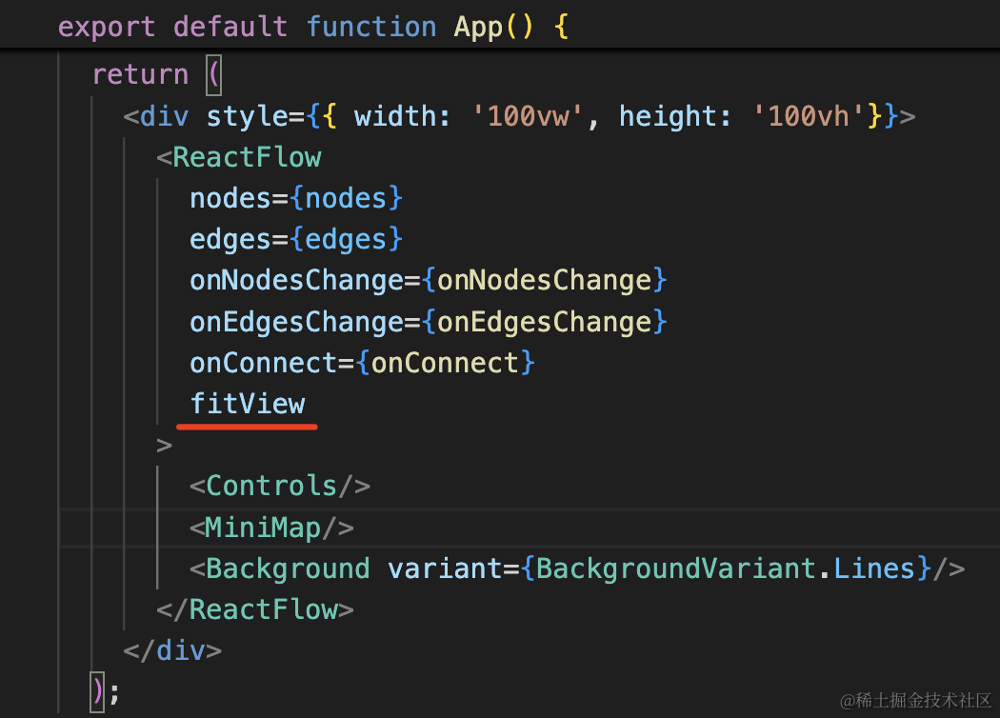

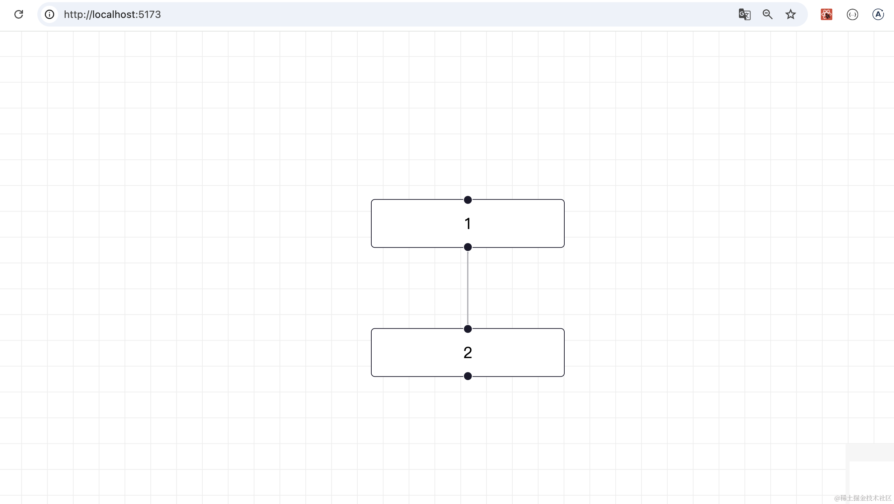

接下来分别实现这三种自定义节点：

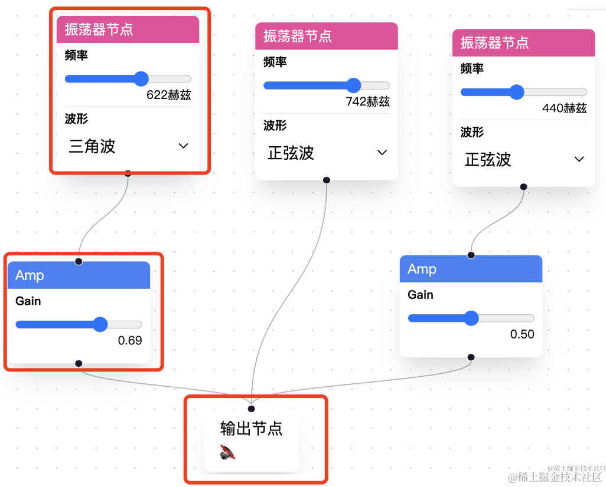

我们用 tailwind 来写样式。

按照 [tailwind 文档](https://www.tailwindcss.cn/docs/guides/vite#react)里的步骤安装 tailwind：

```javascript
npm install -D tailwindcss postcss autoprefixer

npx tailwindcss init -p
```

会生成 tailwind 和 postcss 配置文件：


修改下 content 配置，也就是从哪里提取 className：

```javascript
/** @type {import('tailwindcss').Config} */
export default {
  content: [
    "./index.html",
    "./src/**/*.{js,ts,jsx,tsx}",
  ],
  theme: {
    extend: {},
  },
  plugins: [],
}
```
tailwind 会提取 className 之后按需生成最终的 css。

改下 index.css 引入 tailwind 基础样式：

```css
@tailwind base;
@tailwind components;
@tailwind utilities;
```
在 main.tsx 里引入：

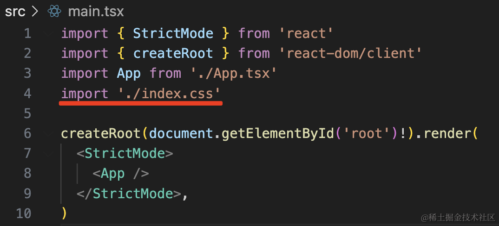

如果你没安装 tailwind 插件，需要安装一下：


这样在写代码的时候就会提示 className 和对应的样式值：


不知道 className 叫啥的样式，还可以在 [tailwind 文档](https://www.tailwindcss.cn/docs/border-width)里搜：


接下来创建振荡器的自定义节点：

components/OscillatorNode.tsx

```javascript
import { Handle, Position } from '@xyflow/react';

export interface OscillatorNodeProps {
  id: string
  data: {
    frequency: number
    type: string
  }
}

export function OscillatorNode({ id, data }: OscillatorNodeProps) {
    return (
      <div className={'bg-white shadow-xl'}>
          <p className={'rounded-t-md p-[8px] bg-pink-500 text-white'}>振荡器节点</p>
          <div className={'flex flex-col p-[8px]'}>
            <span>频率</span>
            <input
                type="range"
                min="10"
                max="1000"
                value={data.frequency}
            />
            <span className={'text-right'}>{data.frequency}赫兹</span>
          </div>
          <hr className={'mx-[4px]'} />
          <div className={'flex flex-col p-[8px]'}>
            <p>波形</p>
            <select value={data.type}>
              <option value="sine">正弦波</option>
              <option value="triangle">三角波</option>
              <option value="sawtooth">锯齿波</option>
              <option value="square">方波</option>
            </select>
          </div>
          <Handle type="source" position={Position.Bottom} />
      </div>
    );
};
```
就是一个标题，一个 input，一个 select，用 tailwind 写下样式。

可以通过 data 传入 frequency、type

用一下：

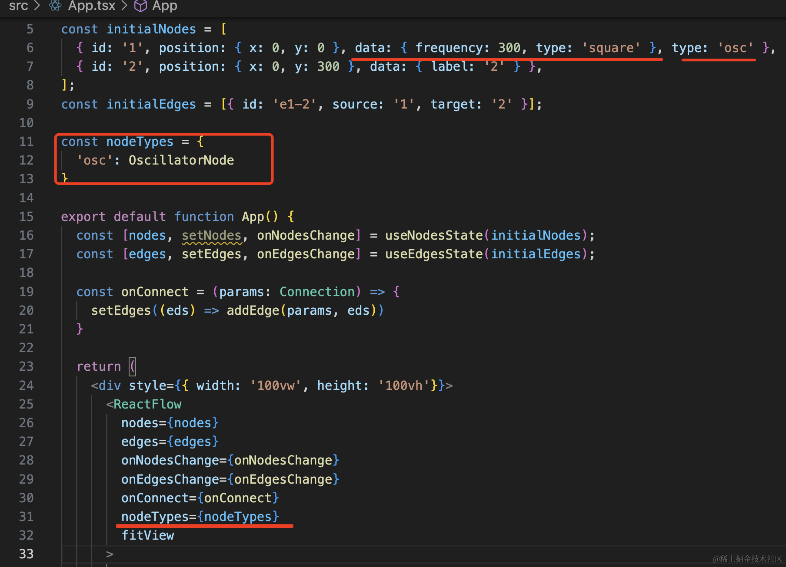

```javascript
import { addEdge, Background, BackgroundVariant, Connection, Controls, MiniMap, OnConnect, ReactFlow, useEdgesState, useNodesState } from '@xyflow/react';
import '@xyflow/react/dist/style.css';
import { OscillatorNode } from './components/OscillatorNode';
 
const initialNodes = [
  { id: '1', position: { x: 0, y: 0 }, data: { frequency: 300, type: 'square' }, type: 'osc' },
  { id: '2', position: { x: 0, y: 300 }, data: { label: '2' } },
];
const initialEdges = [{ id: 'e1-2', source: '1', target: '2' }];

const nodeTypes = {
  'osc': OscillatorNode
}

export default function App() {
  const [nodes, setNodes, onNodesChange] = useNodesState(initialNodes);
  const [edges, setEdges, onEdgesChange] = useEdgesState(initialEdges);
 
  const onConnect = (params: Connection) => {
    setEdges((eds) => addEdge(params, eds))
  }

  return (
    <div style={{ width: '100vw', height: '100vh'}}>
      <ReactFlow 
        nodes={nodes}
        edges={edges}
        onNodesChange={onNodesChange}
        onEdgesChange={onEdgesChange}
        onConnect={onConnect}
        nodeTypes={nodeTypes}
        fitView
      >
        <Controls/>
        <MiniMap/>
        <Background variant={BackgroundVariant.Lines}/>
      </ReactFlow>
    </div>
  );
}
```
看下效果：
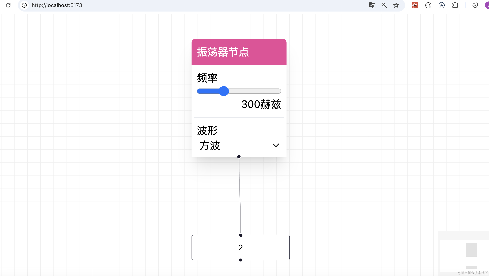

可以看到，节点替换为了我们自定义的节点，并且根据传入的 data 做了表单回显。

接下来写下第二种自定义节点：

components/VolumeNode.tsx

```javascript
import { Handle, Position } from '@xyflow/react';

export interface VolumeNodeProps {
  id: string
  data: {
    gain: number
  }
}

export function VolumeNode({ id, data }: VolumeNodeProps) {
    return (
        <div className={'rounded-md bg-white shadow-xl'}>
            <Handle type="target" position={Position.Top} />

            <p className={'rounded-t-md p-[4px] bg-blue-500 text-white'}>音量节点</p>
            <div className={'flex flex-col p-[4px]'}>
                <p>Gain</p>
                <input
                    type="range"
                    min="0"
                    max="1"
                    step="0.01"
                    value={data.gain}
                />
                <p className={'text-right'}>{data.gain.toFixed(2)}</p>
            </div>

            <Handle type="source" position={Position.Bottom} />
        </div>
    );
}
```

主要是上下两个 Handle、中间一个 input。

用一下：

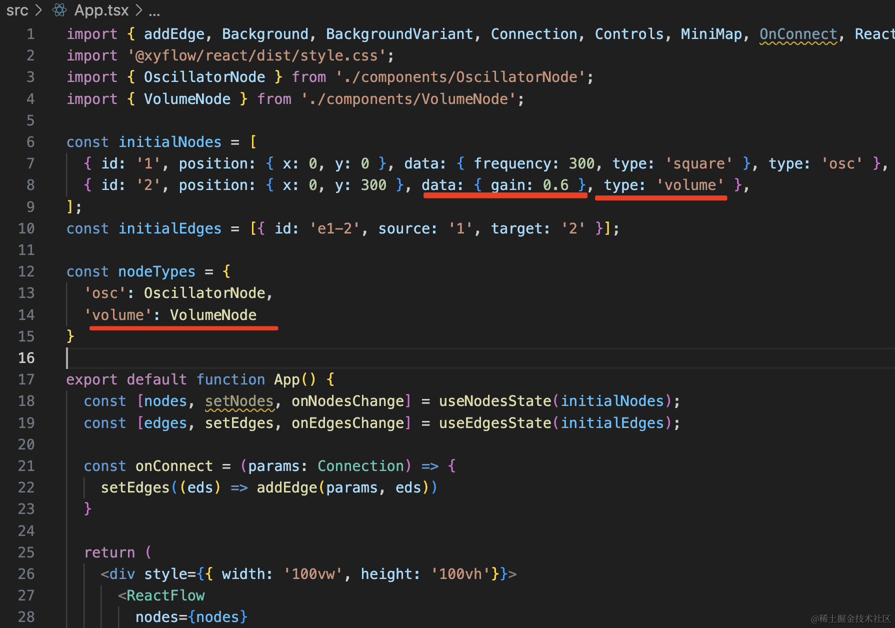

```javascript
const initialNodes = [
  { id: '1', position: { x: 0, y: 0 }, data: { frequency: 300, type: 'square' }, type: 'osc' },
  { id: '2', position: { x: 0, y: 300 }, data: { gain: 0.6 }, type: 'volume' },
];
const initialEdges = [{ id: 'e1-2', source: '1', target: '2' }];

const nodeTypes = {
  'osc': OscillatorNode,
  'volume': VolumeNode
}
```
看下效果：

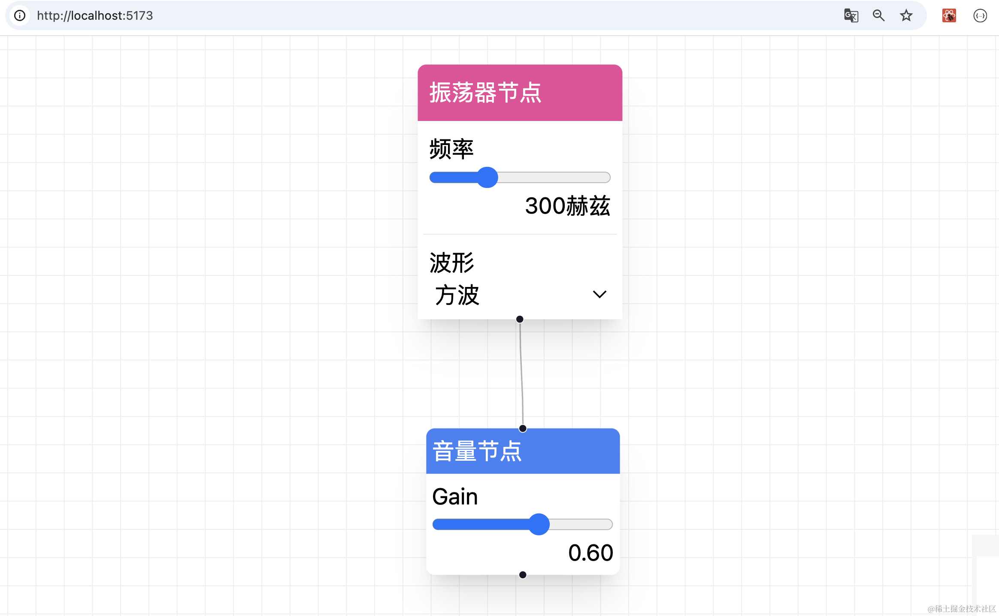

可以看到，音量节点也渲染出来了。

然后来写最后一个节点：输出节点


components/OutputNode.tsx

```javascript
import { Handle, Position } from '@xyflow/react';
import { useState } from 'react';

export function OutputNode() {
    const [isRunning, setIsRuning] = useState(false);

    function toggleAudio() {
        setIsRuning(isRunning => !isRunning)
    }

    return <div className={'bg-white shadow-xl p-[20px]'}>
        <Handle type="target" position={Position.Top} />

        <div>
            <p>输出节点</p>
            <button onClick={toggleAudio}>
                {isRunning ? (
                    <span role="img">
                    🔈
                    </span>
                ) : (
                    <span role="img">
                    🔇
                    </span>
                )}
            </button>
        </div>
    </div>
}
```
用一下：

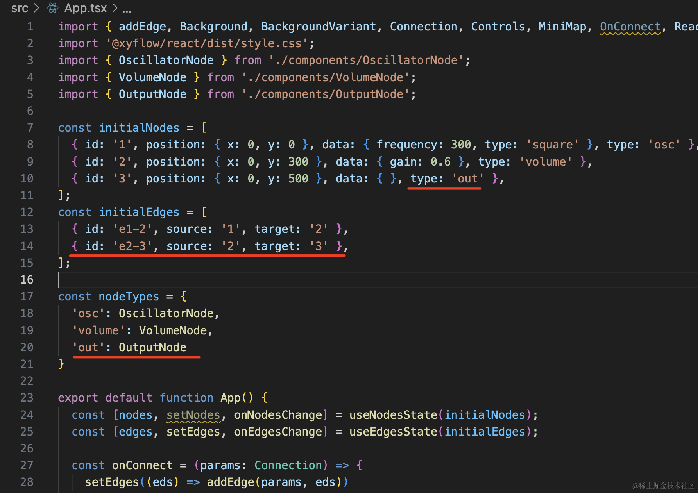

加一个节点类型，然后加一个节点、一条边。

```javascript
const initialNodes = [
  { id: '1', position: { x: 0, y: 0 }, data: { frequency: 300, type: 'square' }, type: 'osc' },
  { id: '2', position: { x: 0, y: 300 }, data: { gain: 0.6 }, type: 'volume' },
  { id: '3', position: { x: 0, y: 500 }, data: { }, type: 'out' },
];
const initialEdges = [
  { id: 'e1-2', source: '1', target: '2' },
  { id: 'e2-3', source: '2', target: '3' },
];

const nodeTypes = {
  'osc': OscillatorNode,
  'volume': VolumeNode,
  'out': OutputNode
}
```

看下效果：

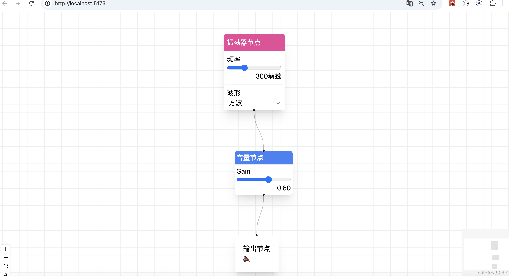

这样，三种自定义节点就都画出来了。

案例代码上传了[小册仓库](https://github.com/QuarkGluonPlasma/react-course-code/tree/main/audio-flow)

## 总结

我们创建了 vite 项目，引入了 tailwind 来写样式。

然后实现了流程图的绘制，主要是三种自定义节点的绘制：

振荡器节点、音量节点、输出节点。

流程图画完了，下节来开发音频部分的功能。
