上节学会了用 Chrome 远程调试 Android 网页，这节来调试下 iOS 网页。

ios 网页调试只能用 safari 浏览器。

打开偏好设置 > 高级，勾选显示“开发”菜单：

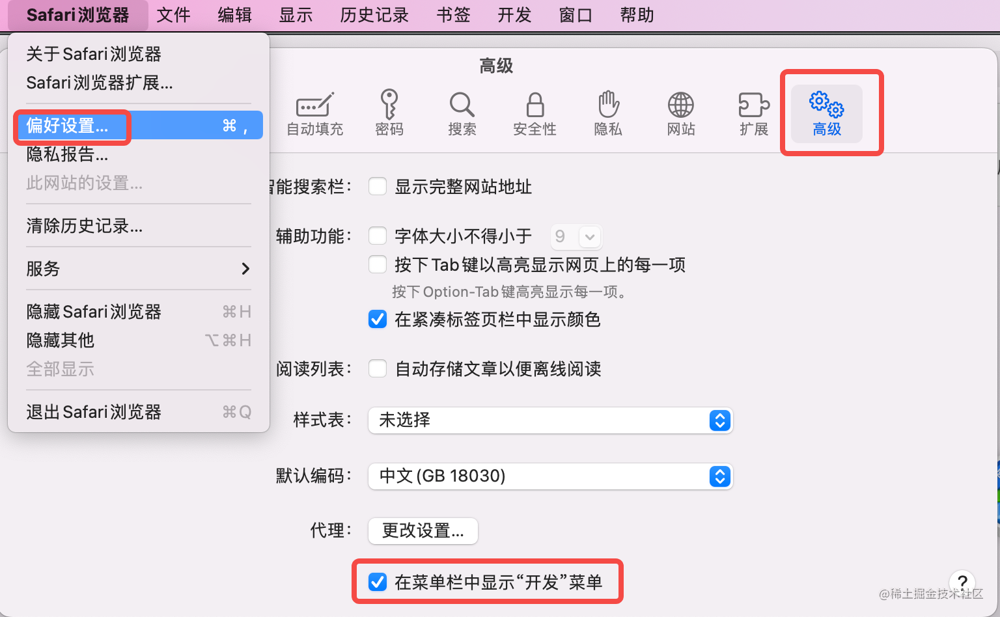

之后就会出现“开发”菜单，下面会展示所有连接的设备：

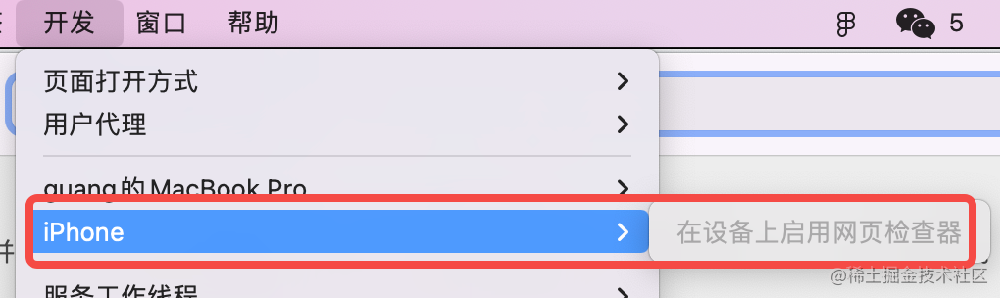

它会提示你在 iPhone 上启用网页检查器。

这个是在 设置 > safari 浏览器 > 高级里开启的：

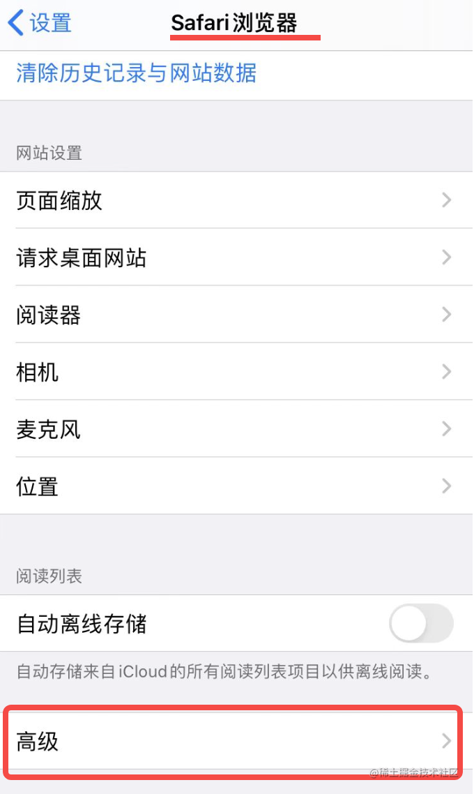

网页检查器下面也有这么一行提示：

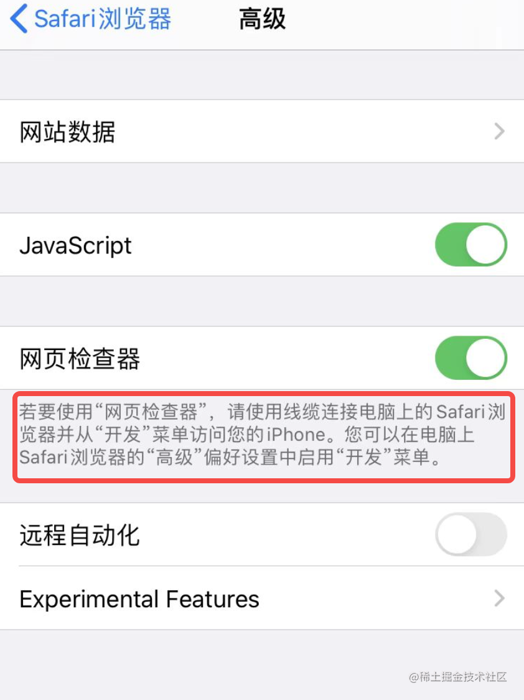

之后在 Safari 浏览器里打开一个页面，比如 baidu.com：

在电脑的 Safari 浏览器的开发菜单里就会显示出这个网页：

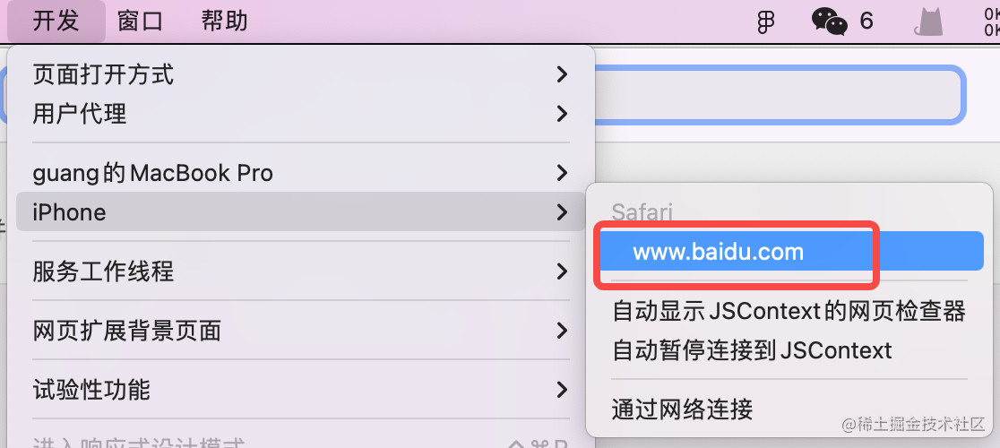

不只是 Safari 浏览器，一些 APP 里内嵌的网页开启了调试的话也可以连接。

之后就可以在电脑上远程调试 iphone 上的网页了：

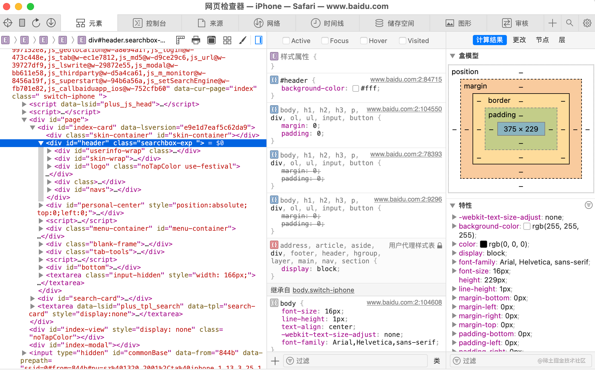

可以调试网络请求：

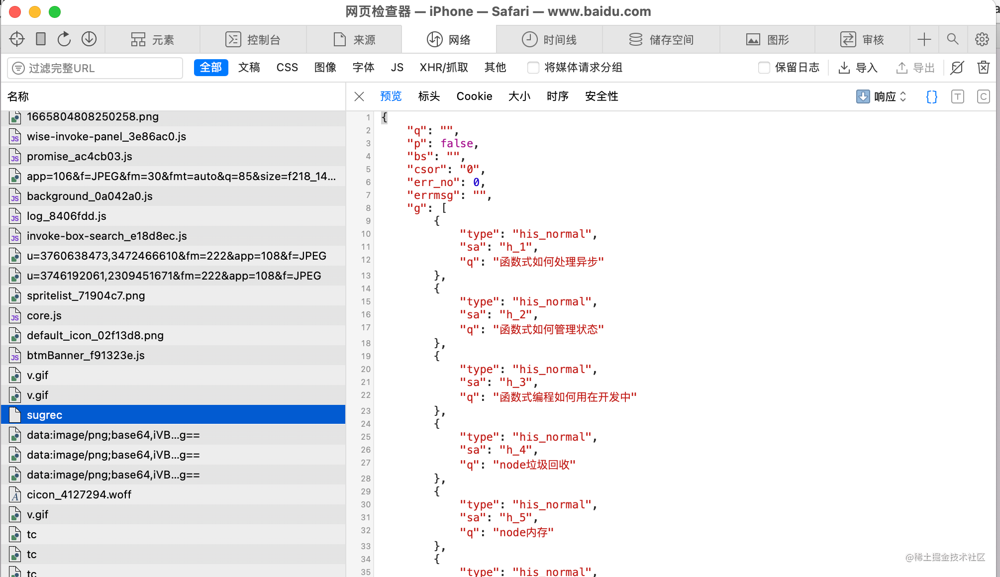

可以断点调试：

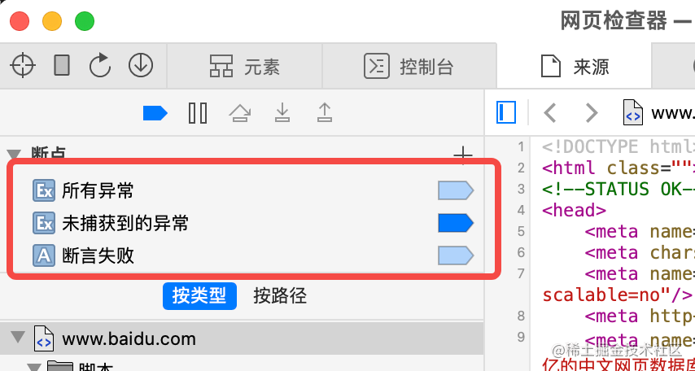

比如可以在所有未捕获的异常处断住，这是异常断点。

可以在请求某个 URL 的时候断住，这是 URL 断点：

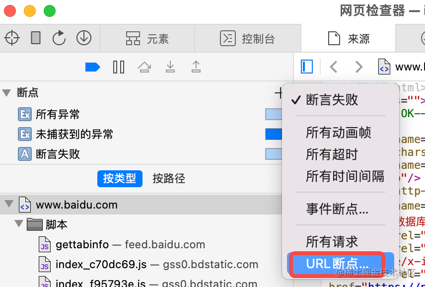

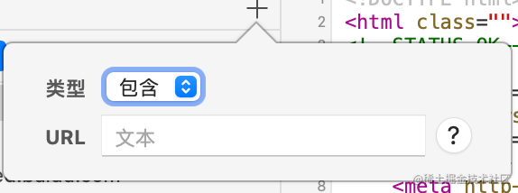

可以添加事件断点：

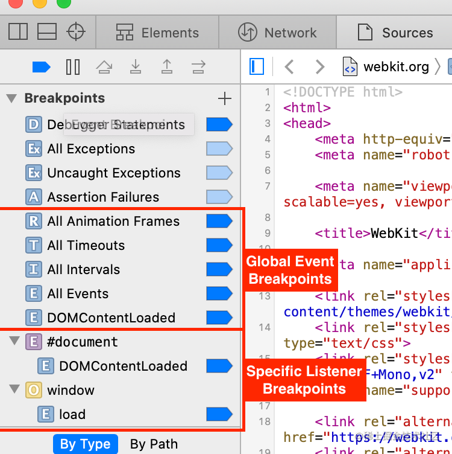

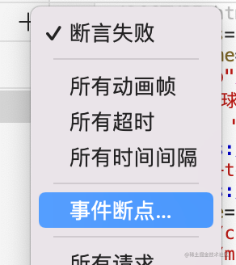

还可以在 requestAnimationFrame、setInterval 的回调处断住。

而且在 Chrome DevTools 里的 DOM 断点，这里也同样支持：

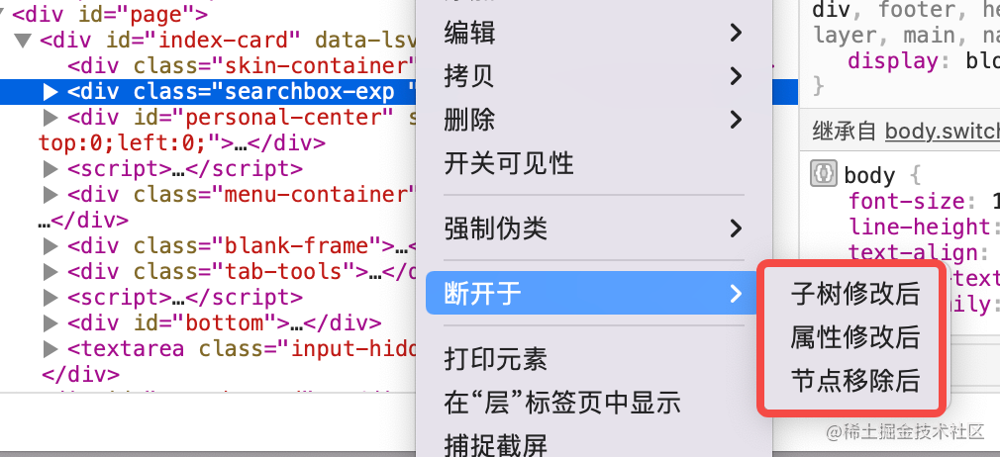

也就是元素子树修改、属性修改、节点移除的时候断住。

而且也可以分析网页的图层：

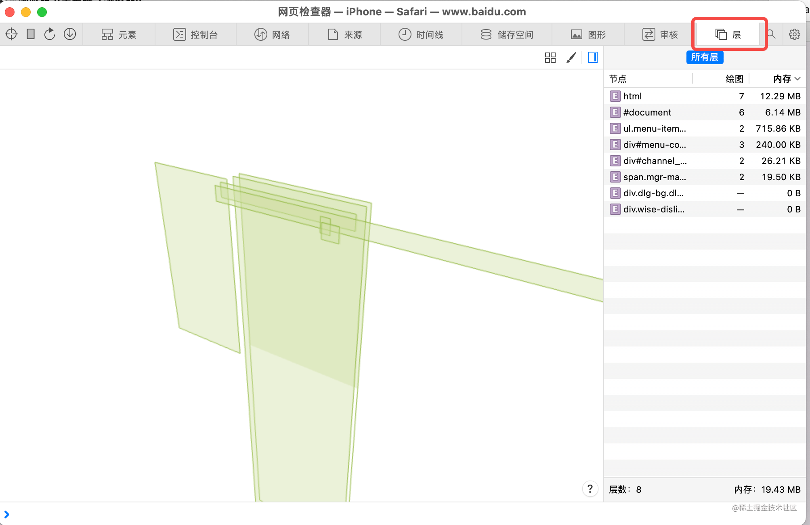

基本所有的网页调试功能都支持。

## 总结

调试 iphone 上的网页要用 Safari 浏览器，支持各种断点、支持元素审查、网络请求的调试等等各种功能。

当你需要调试 ios 的网页的时候，不管是 safari 打开的网页，还是 APP 里内嵌的网页，都可以用这种方式来调试。

