本章开始将进行服务端的实战开发，包含了 Devops、服务端以及其他涉及到的中间件的模块。

> 由于 **NestJS** 的文档非常完善以及之前有写过比较完整的 **NestJS** 的小册，如果对 **NestJS** 非常熟悉的同学可以快速跳过本章，另外整个实战篇的代码都会按照流程进行开发，只有重点的部分会拿出来单独讲解，如果有同学感觉哪块的内容不足够的话，请留言或者与加群沟通，我会在设计篇补充完整，理论上看完设计就应该能写出大体的框架而不是要在具体的代码中再去理解，**所以如果有疑问那就是我设计篇没有写好，需要重新补充内容**。

## 环境搭建

在之前的 **Demo** 中，我们一直都在服务器或者虚拟机上直接安装所需要的软件服务，但这样并不利于迁移以及要解决各种复杂的环境配置问题，所以这次我们将采用基于 **Docker Compose** 的方式来快速搭建所需的开发环境，但这需要你熟悉 **Docker** 以及 **Docker Compose** 的使用。

*   安装 **Docker**: <https://docs.docker.com/engine/install/>
*   安装 **Docker Compose**: <https://docs.docker.com/compose/install/>

> 安装过程自己查看文档，嫌麻烦 **Mac** 与 **Windows** 同学可以直接下载 **Dockers Desktop**

在任意目录下新建 `docker-compose.yml` 文件，并填入以下内容：

```docker
version: '3.3'

volumes:
  mongodb_data:
  mysql_data:

services:
  mongo:
    image: bitnami/mongodb:5.0.8
    volumes:
      - 'mongodb_data:/Users/Shared/mongodb'
    ports:
      - "27017:27017"

  mysql:
    image: bitnami/mysql:8.0
    environment:
      - MYSQL_ROOT_PASSWORD=123456
    volumes:
      - 'mysql_data:/Users/Shared/mysql'
    ports:
      - "3306:3306"
```

运行 `docker-compose up` 启动服务：

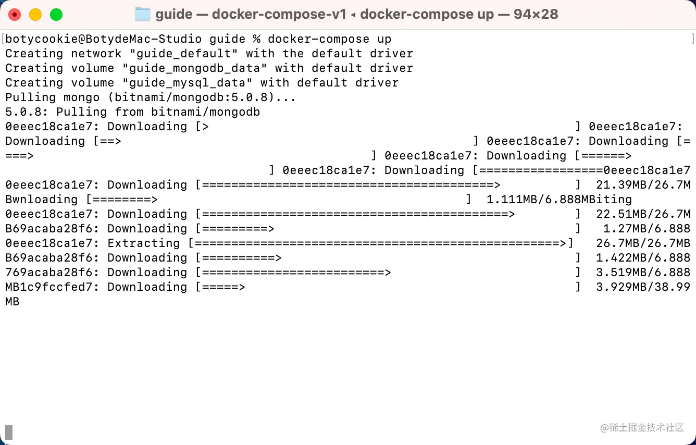

如果你本地没有对应的镜像，则会开始拉取对应的镜像。

如果想后台启动的话，则使用 `docker-compose up -d` 脚本，启动完毕之后如下图所示：

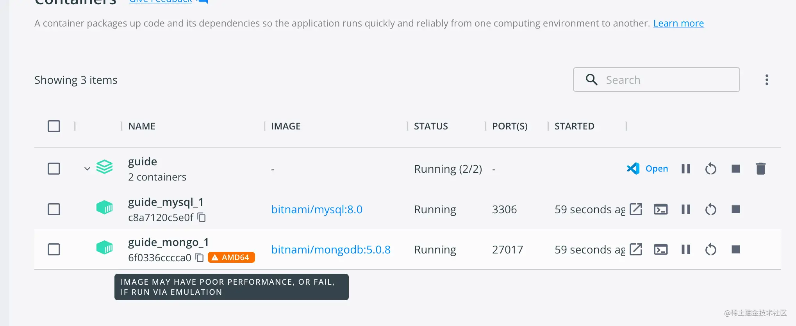

如果出现上图的问题，代表此镜像与 **M1** 芯片不兼容，最简单的解决办法就是切换 **mongodb** 的镜像为 **mongo:5.0.0-focal** 即可。

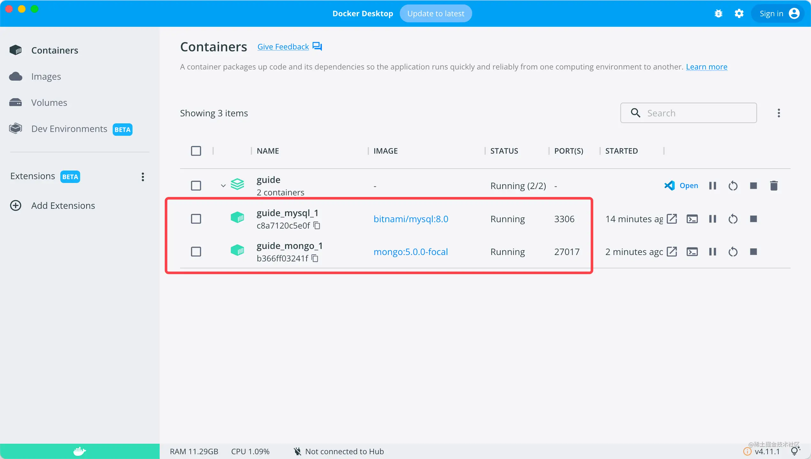

接下来我们可以使用客户端去验证对应的数据库是否正常启动。

#### 数据库可视化客户端

**MongoDB**

1.  **Robo 3T**：这是一个免费的 **MongoDB** 客户端，提供了一个直观的界面来管理 **MongoDB** 数据库并支持 **Windows**、**MacOS** 和 **Linux** 平台；
2.  **Mongo Management Studio**：这是一个开源的 **MongoDB** 客户端，它提供了一个直观的界面来管理 **MongoDB** 数据库。支持 **Windows**、**MacOS** 和 **Linux** 平台；
3.  **Mongo Express**：这是一个基于 **Web** 的 **MongoDB** 客户端，支持 **Windows**、**MacOS** 和 **Linux** 平台。

我个人比较习惯 **Robo 3T**，至于其他你们随意就好，下面就是正常连接了 **MongoDB** 的样子

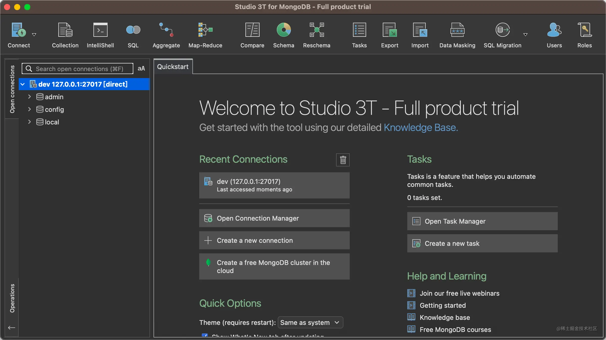

**MYSQL**

1.  **DBeaver**：**DBeaver** 是一款开源的通用数据库管理工具，支持 **MySQL**、**PostgreSQL**、**Oracle**、**DB2** 等多种数据库系统；
2.  **HeidiSQL**：提供图形化界面，支持 **Windows** 操作系统；
3.  **MySQL Workbench**：**MySQL Workbench** 是 **MySQL** 官方提供的免费的数据库管理工具，提供图形化界面并支持 **Windows**、**MacOS** 和 **Linux** 平台

我个人比较习惯 **MySQL Workbench**，至于其他你们随意就好，下面就是正常连接了 **MYSQL** 的样子：

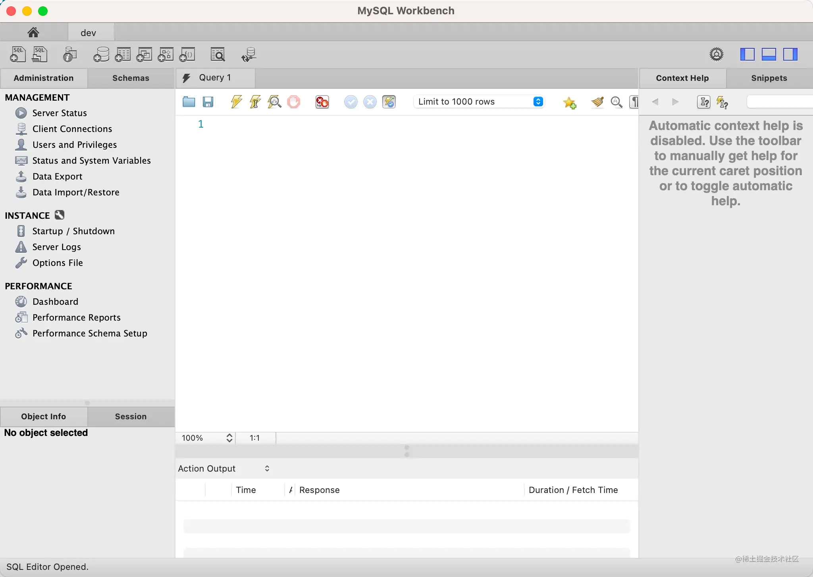

> 对应的，其他的中间件比如 **Redis** 都可以采用此方式进行启动，除了一些基础的配置需要特殊处理之外，无需特别关注环境问题，对于 **Docker** 不熟悉的同学可以关注工程化的专栏，里面有一些相关的知识可以配合看看。

## NestJS 项目初始化

因为之前有些同学初始化的过程中遇到过坑，所以这次又是一次全新的初始化过程，采用最新的 **@nestjs/cli** 版本以及依赖进行项目初始化。

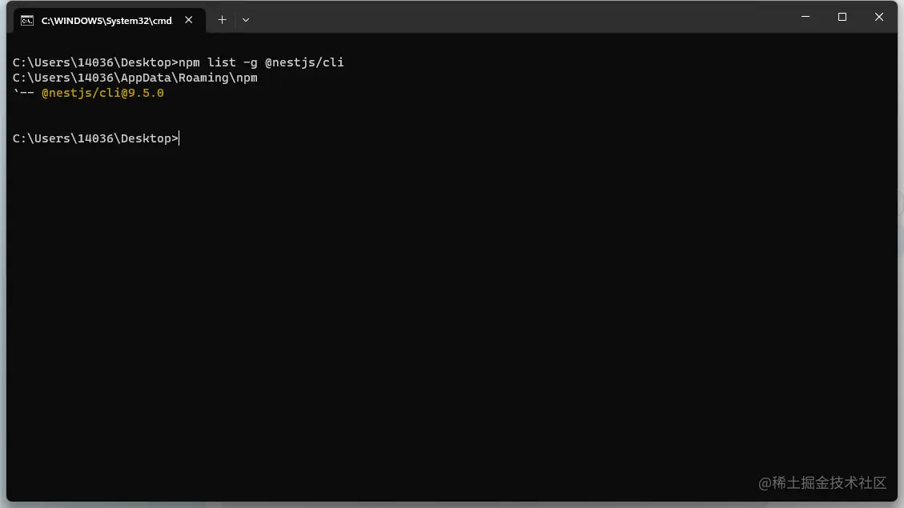

#### 项目初始化

执行初始化脚本：

```shell
nest new low-code-test
```

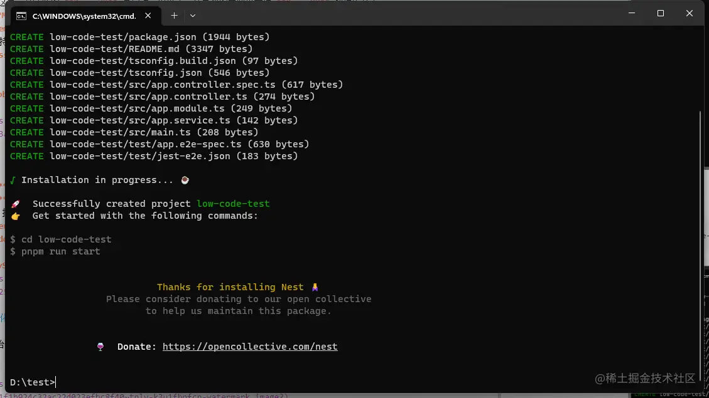

项目目录结构如下所示：

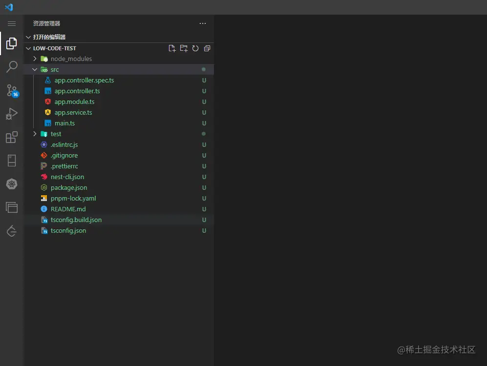

> 可以将上述的 `docker-compose.yml` 文件移动到此项目的根目录。

输入如下脚本即可运行工程：

```shell
pnpm start
```

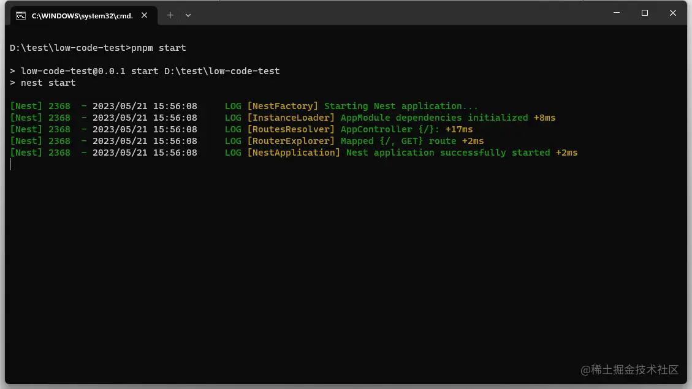

#### 项目拆分

在之前的项目设计中，我们将整个服务拆解成立多个微服务，但同时创建多个工程从项目维护上来说是非常不便的，同时多工程之间的共用依赖维护也是一个头疼的问题，所以我们将采用 **Monorepo** 的模式来开发整个后端服务。

执行以下命令创建新的子应用 `devops`，同时将常规工程转化为 **Monorepo** 模式：

```shell
nest generate app devops
```

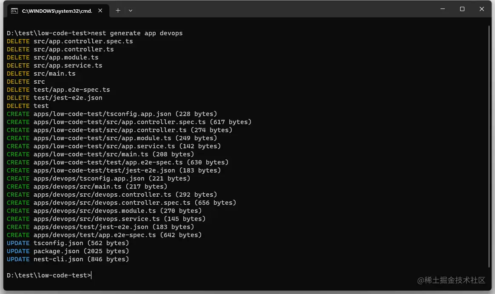

新的目录结构如下所示，`devops` 与 `low-code-test` 两个工程都被收拢到了 `apps` 目录下：

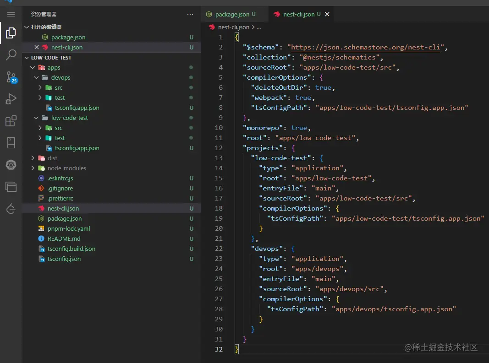

此时脚本的启动命令也变成如下所示：

```shell
nest start // 启动默认的项目
nest start devops  // 启动 devops 子模块
```

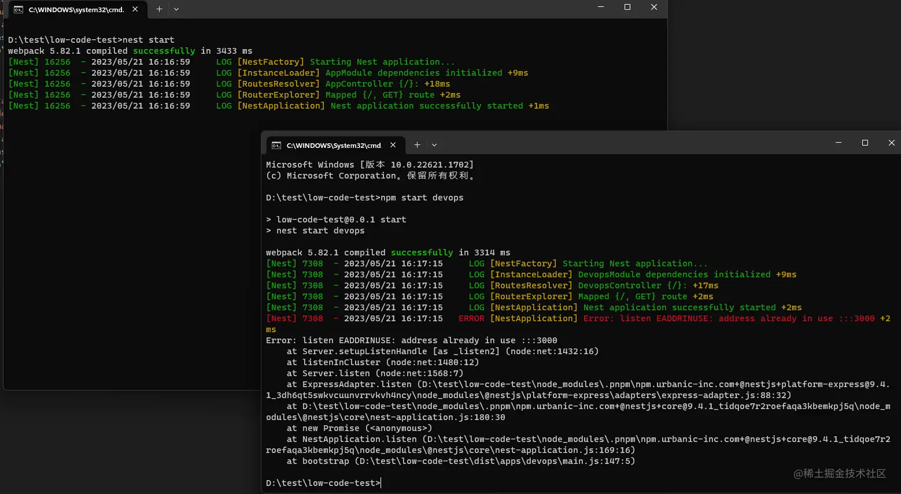

直接运行如上的脚本，当然会出现端口重复的错误，我们需要修改 **devops** 子项目的启动端口：

```diff
# 13.服务端实战：初始化项目
import { NestFactory } from '@nestjs/core';
import { DevopsModule } from './devops.module';

async function bootstrap() {
  const app = await NestFactory.create(DevopsModule);
-  await app.listen(3000);
+  await app.listen(3001);
}
bootstrap();
```

重新启动出现如下图所示即代表成功：

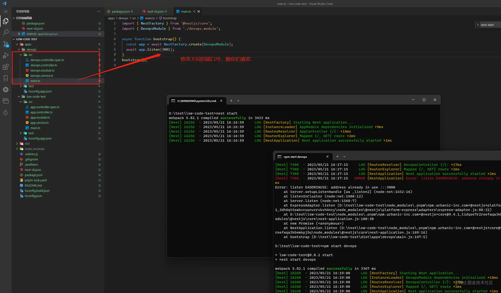

#### Turborepo 管理 Monorepo

每个子应用都存在互相调用的情况，开多个窗口运行也是一件非常麻烦的时候，所以我们需要借助 `turbo` 来帮助一次性启动所有的子应用。

> **Turborepo** 是一个用于管理基于 **Monorepo** 的 **Node.js** 项目的工具。使用 **Turborepo**，你可以将多个 **Node.js** 项目存储在单个 **Monorepo** 存储库中，并使用一个命令来管理这些项目。**Turborepo** 提供了一些命令，例如 `turborepo add`，`turborepo build`，`turborepo test`，`turborepo lint` 等，用于管理 **Monorepo** 中所有项目的构建，测试和代码质量控制。

1.  项目根目录添加 `pnpm-workspace.yaml` 将项目转成 `pnpm workspace` 模式：

```ts
packages:
  - "apps/*"
```

2.  使用以下命令安装 **Turborepo**：

```shell
pnpm i -w turbo 
```

3.  项目根目录添加 `turbo.json` 配置文件

```json
{
  "$schema": "https://turborepo.org/schema.json",
  "pipeline": {
    "dev": {
      "cache": false
    }
  }
}
```

4.  子应用添加对应的 `package.json`，添加对应的启动命令：

```json
# 文件目录 `low-code-test\apps\devops`
{
  "name": "devops",
  "version": "0.0.1",
  "scripts": {
    "dev": "cd .. && pnpm start:devops"
  }
}
```

```json
# 文件目录 `low-code-test\apps\low-code-test`
{
  "name": "low-code-test",
  "version": "0.0.1",
  "scripts": {
    "dev": "cd .. && pnpm start:lowcode"
  }
}
```

5.  修改项目根目录的启动命令：

```diff
- "start": "nest start",
+ "start": "turbo run dev",
+ "start:lowcode": "nest start",
+ "start:devops": "nest start devops",
```

6.  执行启动脚本 `pnpm start`，出现如下图所示即可：

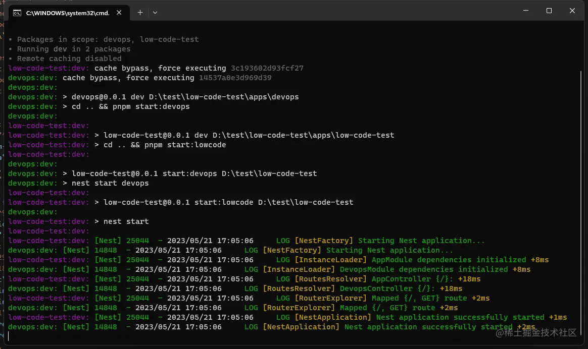

#### 创建公共库

每个子服务之间也会有一些公共的功能会重复，在 **Monorepos** 项目中，我们可以使用 **NestJS** 提供的 **library** 能力来实现（标准模式项目可以使用 **npm** 包实现类似的功能）。

输入以下指令添加公用的 **library**：

```shell
nest g library comm
```

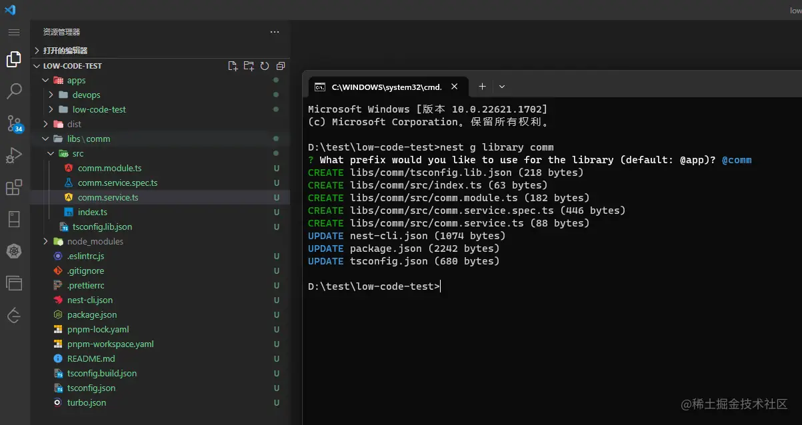

## 写在最后

至此整个项目的前置工作已完成，后续会基于此工程进行业务开发，实战的过程就是如此枯燥且朴实无华，如果有同学哪块不清楚可以留言反馈，我们每一条留言都会有反馈的。

如果你有什么疑问或者更好的建议，欢迎在评论区提出或者加群沟通。 👏
