# 16.服务端实战：数据库实操（MYSQL）

本章将介绍基于 **TypeORM** 的 **Mysql** 数据库实操部分，其中的实操细节部分，我们将使用之前小册中的用户系统作为 **Demo**，如果没有看过之前的 **RBAC** 的介绍也并没有关系，因为这一章我们仅仅只是为了熟悉数据库相关的各种操作罢了。

## 准备前置

经过前两章节的实战，我们手上已经有了一个基础的工程，接下来我们先创建一个 **user** 微服务来熟悉数据库的相关操作：

1. 输入生成微服务的指令
```shell 
nest generate app user
```
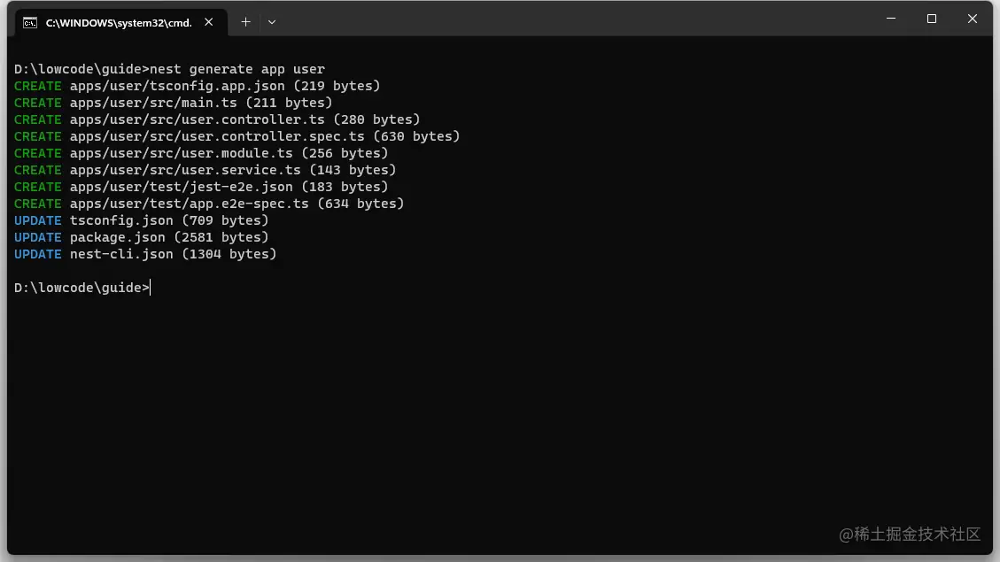

2. 为了兼容给 **MnnoRepo**，`app/user` 目录下新增虚拟 `package.json` 文件：
```JSON
{
  "name": "user",
  "version": "0.0.1",
  "description":"user",
  "scripts": {
    "dev": "cd .. && pnpm start:user"
  }
}
```

3. 修改根目录启动脚本，新增启动用户微服务的命令:

```diff
  "scripts": {
    "build": "nest build",
    "format": "prettier --write \"apps/**/*.ts\" \"libs/**/*.ts\"",
    "start": "turbo run dev",
    "start:lowcode": "cross-env RUNNING_ENV=dev nest start --watch",
+    "start:user": "cross-env RUNNING_ENV=dev nest start user --watch",
    "start:devops": "cross-env RUNNING_ENV=dev nest start devops --watch",
  },
```

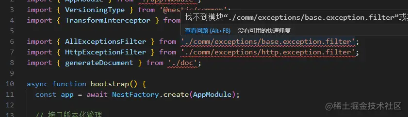

4. 其他通用的内容，照搬之前的 **low-code-test** 子工程即可，但将其他的业务模块去掉，最终获取的目录结构如下所示：

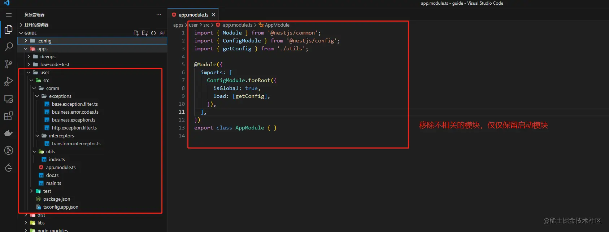

> 此时并不要急于运行项目，因为我们加了 **Doc** 模块，其中依赖了 **package.json**，会导致构建目录异常，所以并不必着急启动，我们继续引入其他模块后即可正常启动。

5. 使用以下脚本创建 **curd** 的 **user** 模块：

```shell
nest g resource user --project user
```

> --project 记得加，不然会在根项目生成

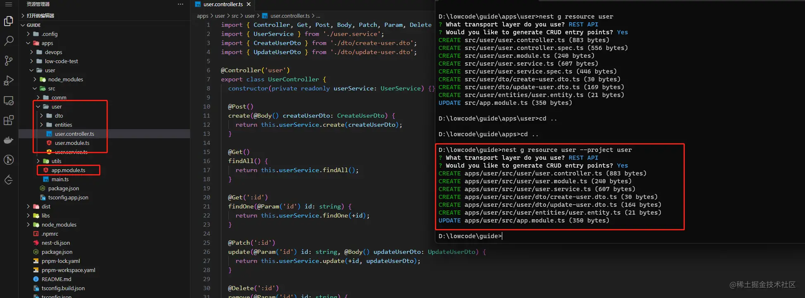

可以看到借助于 **CLI** 工具，不仅仅生成了整个 **User** 的 **CURD** 模块，同时也帮我们在 `app.module.ts` 中注册了对应的 **Module**。

另外，如果你们使用此命令的时候，同时生成了 `spec` 文件，可以选择在 `nest-cli.json` 添加如下配置来禁用测试文件的生成。 

```json
"generateOptions": {
"spec": false
},
```

## 基础操作

#### 增

准备工作做完之后现在开始基础篇的训练。

首先需要先创建实体类，在我们之前创建的 **CURD** 中有一个 `user/entities/user.entity.ts` 文件，也就是之前我们介绍过的与数据库关联的实体类，现在我们来用户实体类型添加一些属性，此外之前我们约定了 `Mysql` 的实体文件命名规则，所以需要将文件名改为 `user.mysql.entity.ts`。

```
import { Entity, Column, UpdateDateColumn, PrimaryGeneratedColumn, CreateDateColumn } from 'typeorm';

export enum UserStatus {
  disabled = 0,
  enabled = 1
}

@Entity()
export class User {
  @PrimaryGeneratedColumn() // 自增主键
  id?: number;

  @Column({ default: null }) // 普通类型
  name: string;

  @Column({ default: null })
  username: string;

  @Column({ default: null })
  email: string;

  @Column({ default: null })
  avatar?: string;

  @Column({ default: null })
  mobile?: string;

  @Column({ default: null })
  enName?: string;

  @Column({ default: null })
  departmentName?: string;

  @Column({ default: null })
  departmentId?: number;

  @Column({ default: UserStatus.enabled })
  status?: UserStatus;

  @UpdateDateColumn()
  updateTime?: string;

  @CreateDateColumn()
  createTime?: string;
}
```

略微按照之前的模式调整以下目录结构，并引入 `user.providers.ts`：

```ts
import { User } from './user.mysql.entity';

export const UserProviders = [
  {
    provide: 'USER_REPOSITORY',
    useFactory: async (AppDataSource) => await AppDataSource.getRepository(User),
    inject: ['MYSQL_DATA_SOURCE'],
  },
];
```

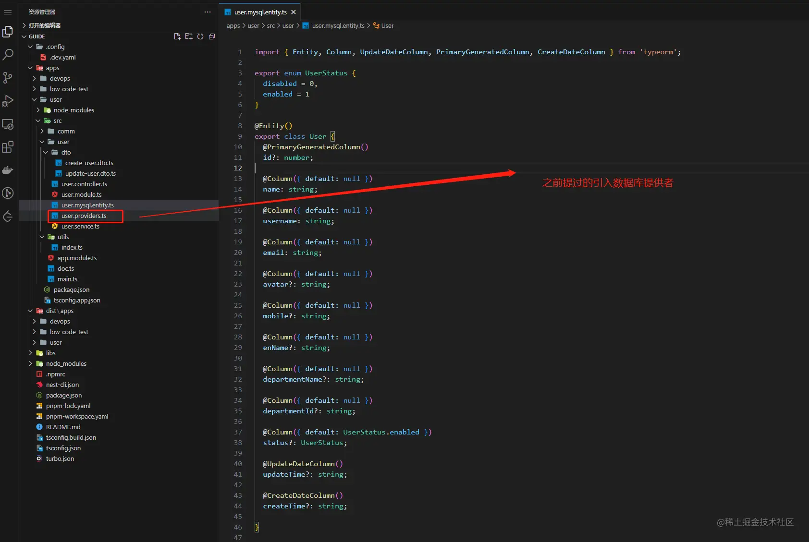

完毕之后在 `user/user.module.ts` 导入 `UserProviders` 以及 `DatabaseModule`：

```
import { Module } from '@nestjs/common';
import { DatabaseModule } from '@app/comm/database/database.module';
import { UserService } from './user.service';
import { UserController } from './user.controller';
import { UserProviders } from './user.providers';
import { DepartmentModule } from '../department/department.module';

@Module({
  imports: [
    DatabaseModule,
    DepartmentModule
  ],
  controllers: [UserController],
  providers: [...UserProviders, UserService,],
})
export class UserModule { }

```


完成上述步骤就可以使用 `pnpm start:user` 正常启动项目了:

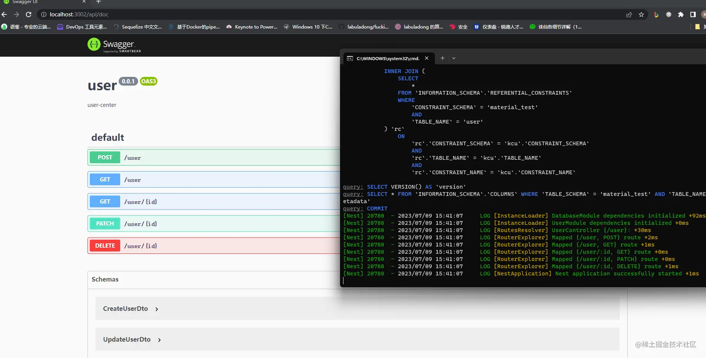

正如之前所说的一样，我们在测试环境开启了同步的配置。

**文件**：`.config/.dev.yaml`
```
MYSQL_CONFIG:
    synchronize: true
```

所以在每一次启动的时候，**TypeORM** 都会进行实体类与 **Mysql** 数据库表结构的同步，所以可以在 **Mysql workbench** 中看到 **material_test** 数据库创建了一张 **User** 表。

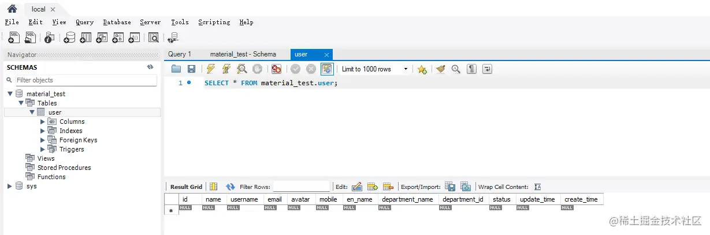

细心的同学应该注意到了，数据库存储的字段与我们的实体类有区别，大驼峰格式被转换成为了下划线格式，这是上一章提到的 `naming.strategies.ts` 的转换结果。

> 其中要注意的是，所有的实体类都需用使用 **@Entity** 来注册，否则无法正常注册到表中，所以复制的时候请不要遗漏。

每一个实体类都需有一个主键，可以使用 `PrimaryColumn` 来创建主键字段，如果并无实际含义的情况下可以使用 `PrimaryGeneratedColumn` 来自动创建主键，该值将使用自动增量值自动生成。

同时大家需要注意的时，在 **User** 实体类中，`UserStatus` 字段使用了 **enum** 元组类型，只有 **postgres** 和 **Mysql** 支持 `enum` 类型，在 **Mongoose** 中使用 **enum** 并不会生效。

1. 按照实体类修改 `user/dto/create-user.dto.ts`:

```ts
import { ApiProperty } from "@nestjs/swagger";
import { IsNotEmpty } from "class-validator"

export class CreateUserDto {

  @IsNotEmpty()
  @ApiProperty({ example: 'cookie' })
  name: string;

  @IsNotEmpty()
  @ApiProperty({ example: '言萧凡' })
  username: string;

  @ApiProperty({ example: 'cookie' })
  enName?: string;

  @IsNotEmpty()
  @ApiProperty({ example: '' })
  email: string;

  @ApiProperty({ example: '' })
  avatar?: string;

  @ApiProperty({ example: '' })
  mobile?: string;


  @ApiProperty({ example: '' })
  departmentName?: string;

  @ApiProperty({ example: 0 })
  departmentId?: number;
}
```

2. 添加新增用户的 `service`： `user/user.service.ts`:

```ts
import { Inject, Injectable } from '@nestjs/common';
import { CreateUserDto } from './dto/create-user.dto';
import { UpdateUserDto } from './dto/update-user.dto';
import { Repository } from 'typeorm';
import { User } from './user.mysql.entity';

@Injectable()
export class UserService {
  constructor(
    @Inject('USER_REPOSITORY')
    private userRepository: Repository<User>,
  ) { }

  create(createUserDto: CreateUserDto) {
    return this.userRepository.save(createUserDto)
  }

  findAll() {
    return `This action returns all user`;
  }

  findOne(id: number) {
    return `This action returns a #${id} user`;
  }

  update(id: number, updateUserDto: UpdateUserDto) {
    return `This action updates a #${id} user`;
  }

  remove(id: number) {
    return `This action removes a #${id} user`;
  }
}
```

3. 打开 **doc** 链接 http://localhost:3002/api/doc#/default/UserController_create

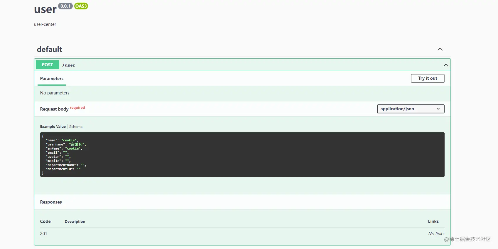

4. 测试执行此方法得到如下返回结果则代表插入成功

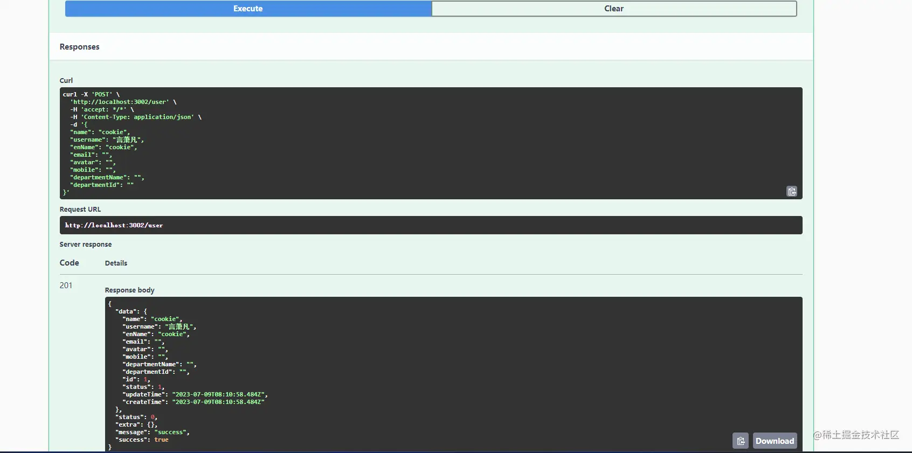

同时数据库应该也支持新增了对应的数据字段

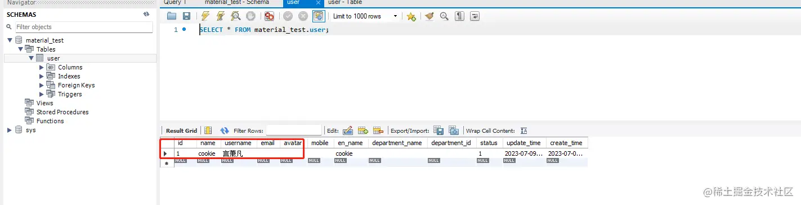

#### 查

1. 修改 `user.service.ts`，新增查询方法:

```
  findAll() {
    return this.userRepository.find()
  }

  findOne(id: number) {
    return this.userRepository.findOneBy({ id })
  }
```

查询所有：

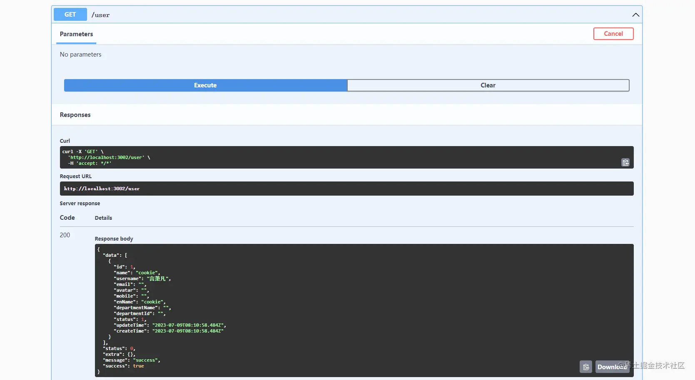

查询单个：

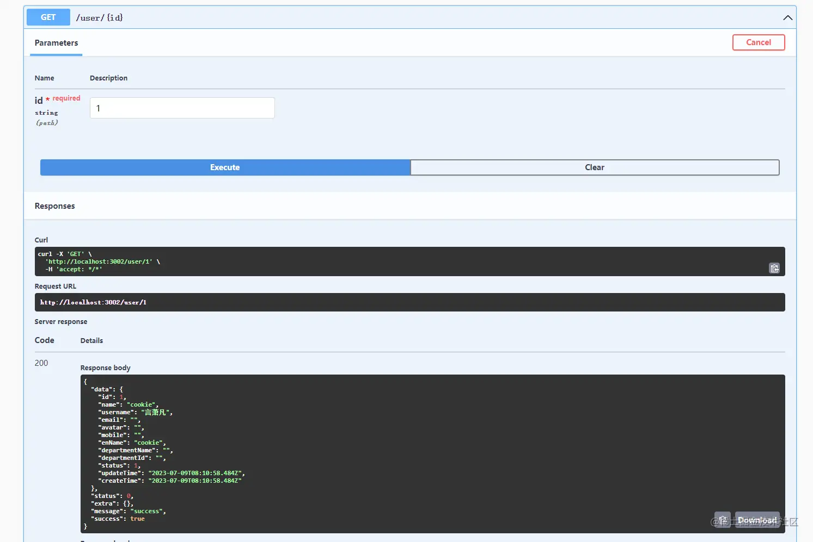

#### 删

1. 修改 `user.service.ts`，新增删除方法:
```
  remove(id: number) {
    return this.userRepository.delete(id)
  }
```

删除 `id=1` 的用户，返回数据如下所示则代表成功：

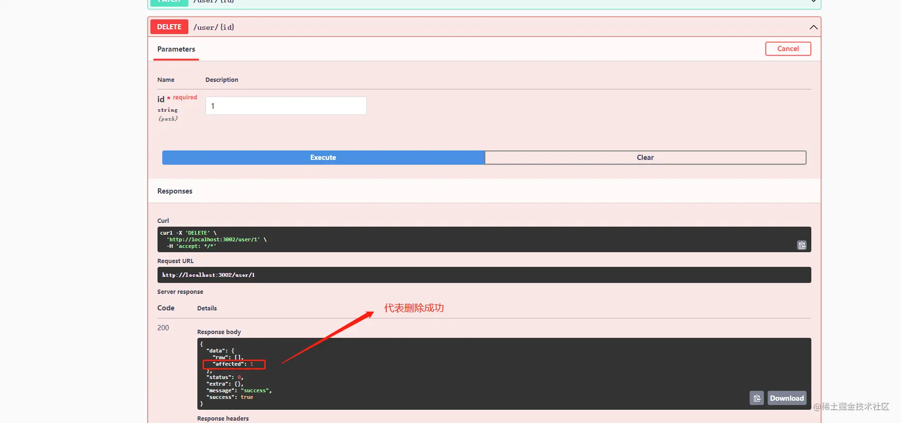


直接查询数据库可以看到 **id** 为 **1** 的数据已经确实被删除了。

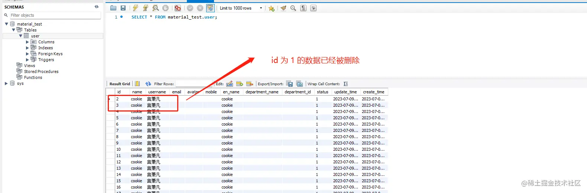

#### 改

一般来说，单纯的修改数据是可以继承 **CreateUserDto**，除非有其他的业务特殊处理，这个可以根据自己的取舍。

如果你不想使用 **patch** 方法的话，改成 **post** 需要新增 **id** 字段，否则不需要加

```
import { ApiProperty, PartialType } from '@nestjs/swagger';
import { CreateUserDto } from './create-user.dto';
import { IsNotEmpty } from 'class-validator';

export class UpdateUserDto extends PartialType(CreateUserDto) {

  @IsNotEmpty()
  @ApiProperty({ example: 2 })
  id: number;
}
```

1. 修改 `user.service.ts`，新增更新方法:

```
update(id: number, updateUserDto: UpdateUserDto) {
return this.userRepository.update({ id }, updateUserDto)
}
```
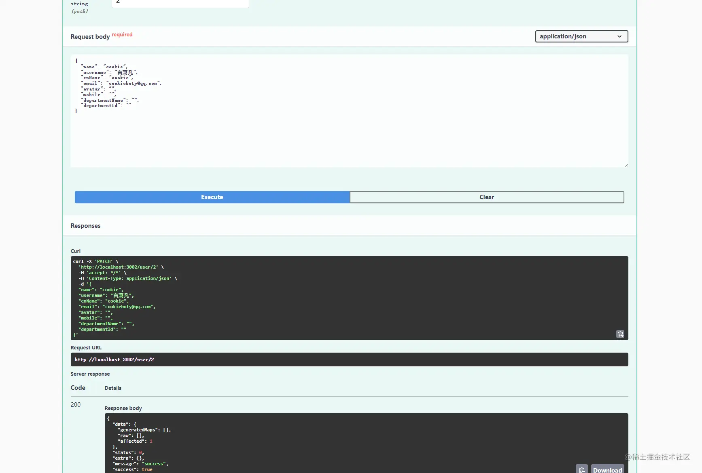

> 注意，这里的 demo 使用的是 patch 方法，所以我并没有加 id 属性。

正常请求之后，数据库自然也会更新成功：

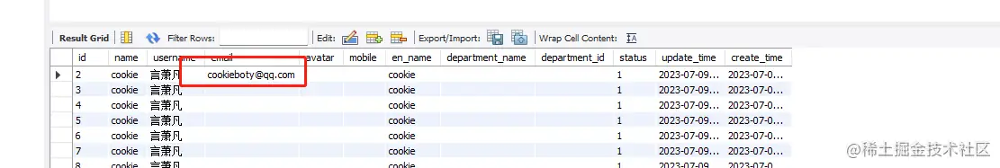

## 一对多

在上述 **User** 的实体类中有一个 `departmentId` 字段，一般来说，部门会有多个员工，所以如果有使用一对多的模式来创建两张表的关联，这样用户在获取的时候将不再只有 `departmentId` 字段，接下来我们来进入一对多的实操环节。

首先，我们需要按照创建 **User** 的模式，创建一个 **Department** **CRUD** 模块。

整体结构如下所示：

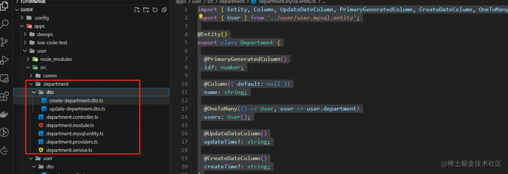

1. 修改 `department/department.mysql.entity.ts` 文件为：

```
import { Entity, Column, UpdateDateColumn, PrimaryGeneratedColumn, CreateDateColumn, OneToMany } from 'typeorm';
import { User } from '../user/user.mysql.entity';

@Entity()
export class Department {

  @PrimaryGeneratedColumn()
  id?: number;

  @Column({ default: null })
  name: string;

  @OneToMany(() => User, user => user.department)
  users: User[];

  @UpdateDateColumn()
  updateTime?: string;

  @CreateDateColumn()
  createTime?: string;
}
```

2. 修改 `user/user.mysql.entity.ts` 文件为：

```
import { Entity, Column, UpdateDateColumn, PrimaryGeneratedColumn, CreateDateColumn, ManyToOne, } from 'typeorm';
import { Department } from '../department/department.mysql.entity';

export enum UserStatus {
  disabled = 0,
  enabled = 1
}

@Entity()
export class User {
  @PrimaryGeneratedColumn()
  id?: number;

  @Column({ default: null })
  name: string;

  @Column({ default: null })
  username: string;

  @Column({ default: null })
  email: string;

  @Column({ default: null })
  avatar?: string;

  @Column({ default: null })
  mobile?: string;

  @Column({ default: null })
  enName?: string;

  @ManyToOne(() => Department, department => department.users)
  department: Department;

  @Column({ default: UserStatus.enabled })
  status?: UserStatus;

  @UpdateDateColumn()
  updateTime?: string;

  @CreateDateColumn()
  createTime?: string;
}
```

我们将 `departmentId` 与 `departmentName` 换成 `department` 字段，就不再需要多存字段同时获取的信息会更多，但 `CreateUserDto` 里面只需要删除 `departmentName` 即可，我们还需要使用 `departmentId` 来获取部门信息。

> 注意根据我们的设计是一个部门对应多个员工，所以 `Department` 实体类使用 `OneToMany` 来装饰字段，而 `user` 实体类则使用 `ManyToOne` 来装饰 `department` 字段。

3. 修改 `uer/user.service.ts` 中 `create` 方法，添加查询部门以及添加的关系逻辑：

```
  async create(createUserDto: CreateUserDto) {
    const dep = await this.departmentService.findOne(createUserDto.departmentId)
    return this.userRepository.save({
      ...createUserDto,
      department: dep
    })
  }

  findAll() {
    return this.userRepository.find({ relations: ["department"] })
  }
```

> 注意在查询 `dep` 的时候是一个异步方法，所以需要 `async` 与 `await` 来同步获取查询返回值。

4. 修改 `department/department.service.ts` 的 `findAll` 方法，添加 `relations` 筛选关联关系：

```
  findAll() {
    return this.depRepository.find({ relations: ["users"] })
  }
```

在完成上述所有步骤后，我们可以进行相关的测试了，一切顺利的话，将如下所示：

预先新增一个部门：

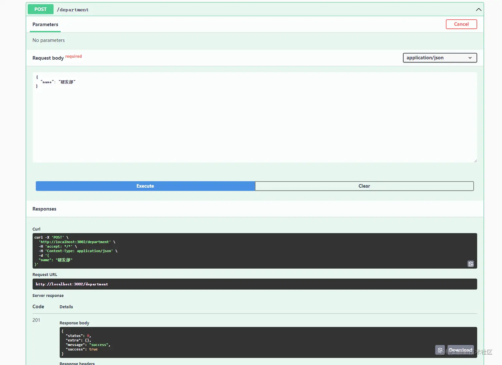

新增用户：

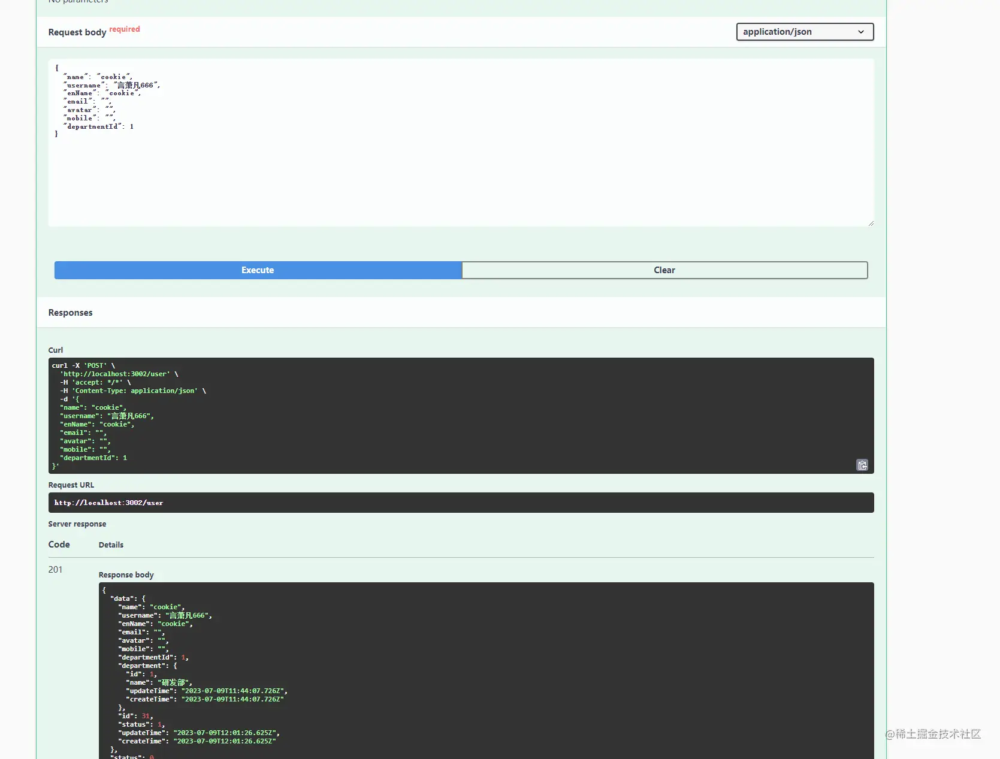

查询部门：
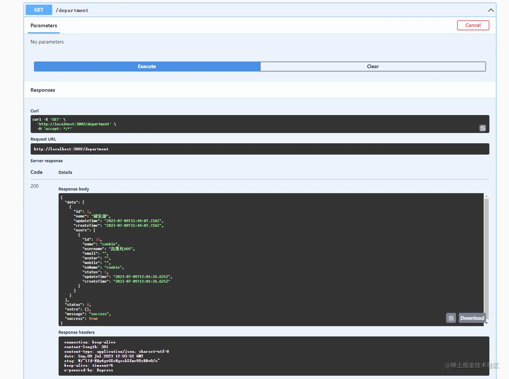

查询用户：

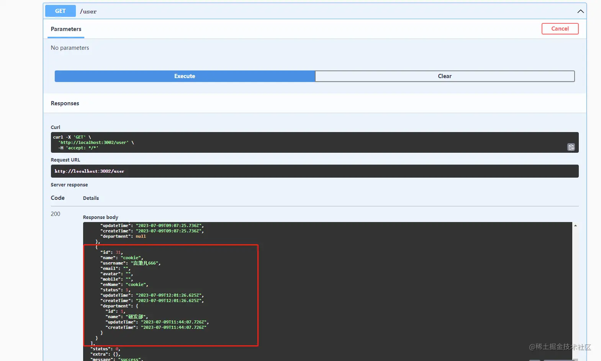

## 写在最后

为了让更多的同学可以顺利学会 **NestJS** 的使用，数据库相关的介绍比之前会多一些，分为基础与进阶。

本章只介绍了基于 **TypeORM** 的 **Mysql** 基础用法，下一章，我们将继续学习 **Mongoose** 的相关使用方法与注意事项。

> **本章依然没有 **Demo** 工程也不会放在 **Github** 上，因此这章的的代码不需要加群询问仓库地址，但我会针对每一个细节做一定的介绍与全流程的代码展示，所以如果遇到问题，加群或者留言直接质疑步骤或者模块，我会在文章中补充完整，务必做到基础实战的所有内容不借助于工程就能实现**。

如果你有什么疑问，欢迎在评论区提出或者加群沟通。 👏
