# 20.服务端实战：用户服务开发（上）

在进行了一系列服务端的基础训练之后，本章将迎来第一个服务端实战项目：用户系统。

我们将完全按照之前的表结构来开发用户系统，为了方便各位操作，用户的三方登录将以 **Github** 授权来作为演示。

本章 demo 工程：
- **服务端：https://github.com/Ignition-Space/Ignition main 分支**
- **客户端：https://github.com/Ignition-Space/Ignition-web next 分支**


## 准备工作

#### 配置测试域名

1. **修改本地 **host** 文件的 **DNS** 解析**

```shell
127.0.0.1 wwww.ig-space.com
127.0.0.1 api.ig-space.com
```

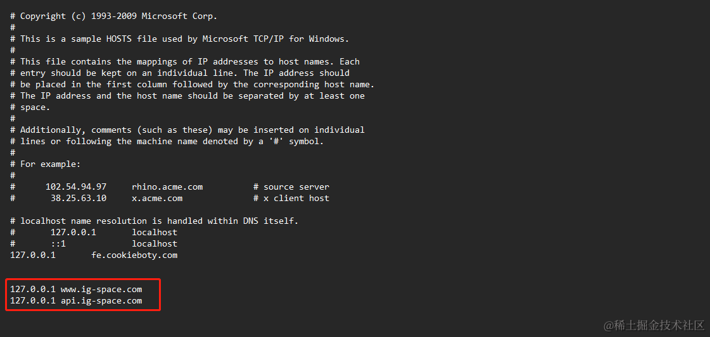

其中 `wwww.ig-space.com` 作为客户端的域名，`api.ig-space.com` 作为服务端的域名。

2. **使用 **nginx** 配置对应服务的方向代理，然后启动或者重启 **nginx** 服务**

```shell
server {
    listen 80;
    server_name www.ig-space.com;
    location / {
    proxy_pass   http://127.0.0.1:10010/;
    }
}

server {
    listen 80;
    server_name api.ig-space.com;
    location / {
    proxy_pass   http://127.0.0.1:4000/;
    }
}
```

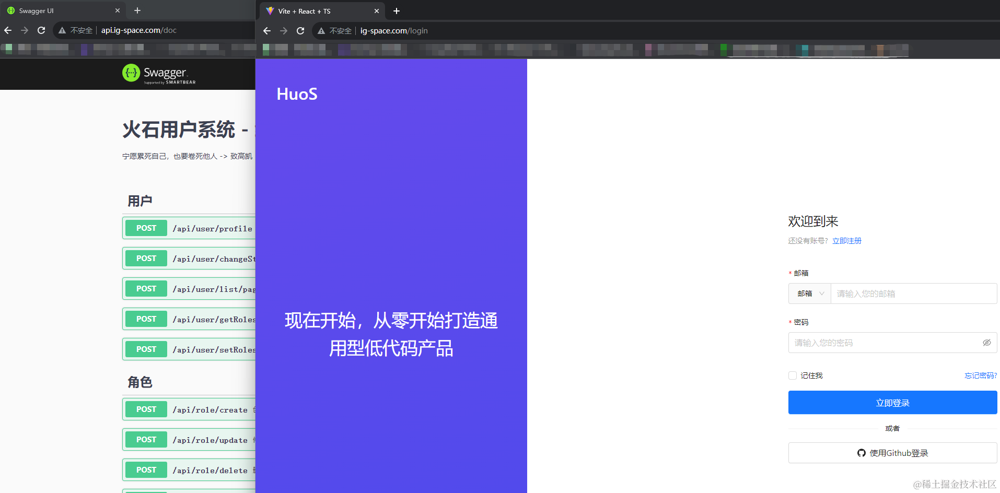

如下能通过域名正常访问对应的前后端项目即可。

> 由于后续的操作需要配置本地测试域名才能进行，当然你也可以直接申请一个公网环境的域名来做测试，但为了节约资源减少不必要的浪费，我依然建议你使用本地域名来测试。


#### 配置 Github 授权

整个 **Github** 的授权过程，可以全程参考下述截图步骤，中间步骤就不再一一描述，跟着做就行。

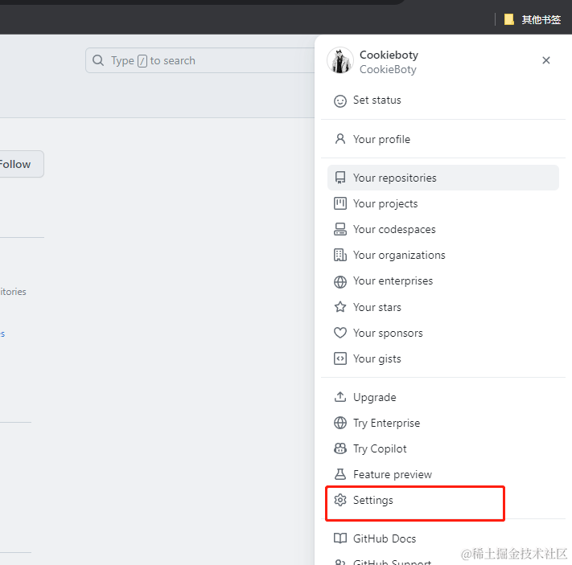


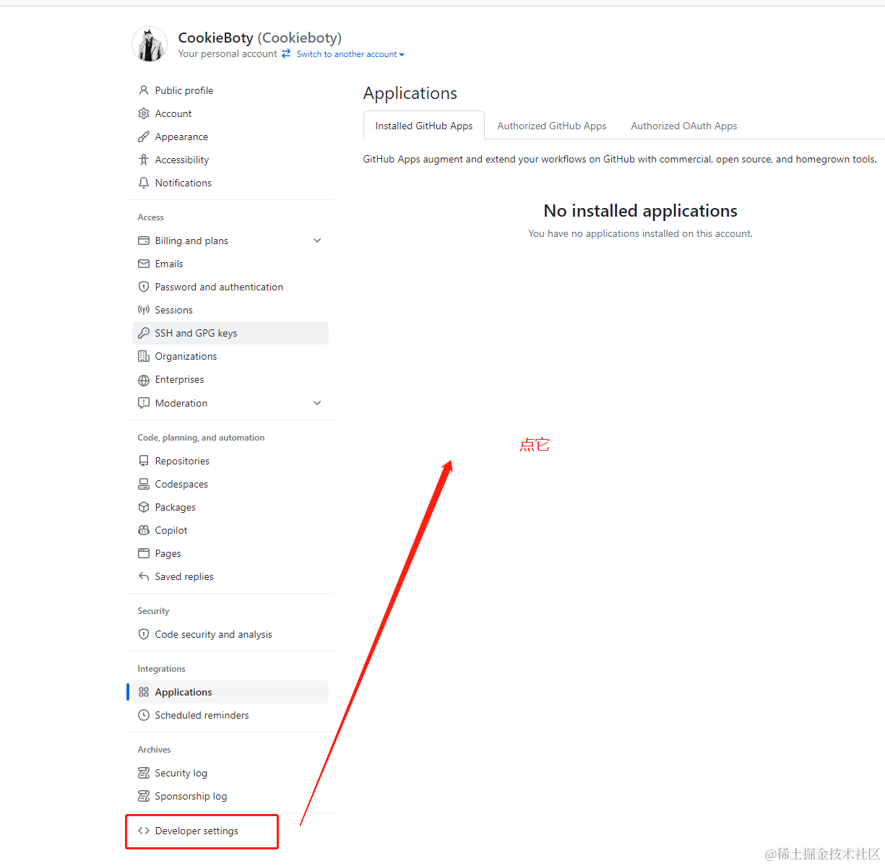


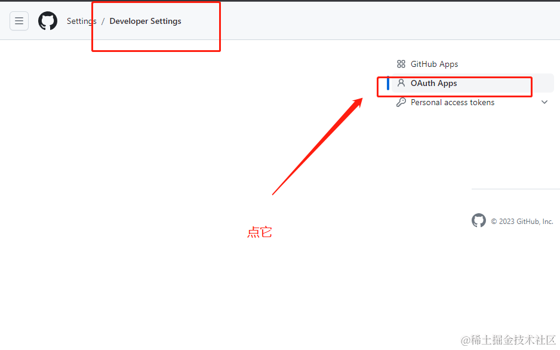


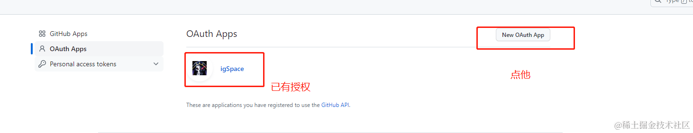


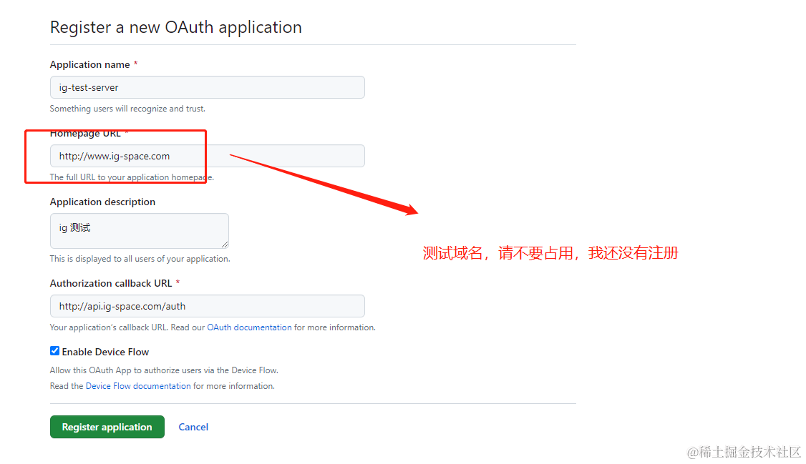


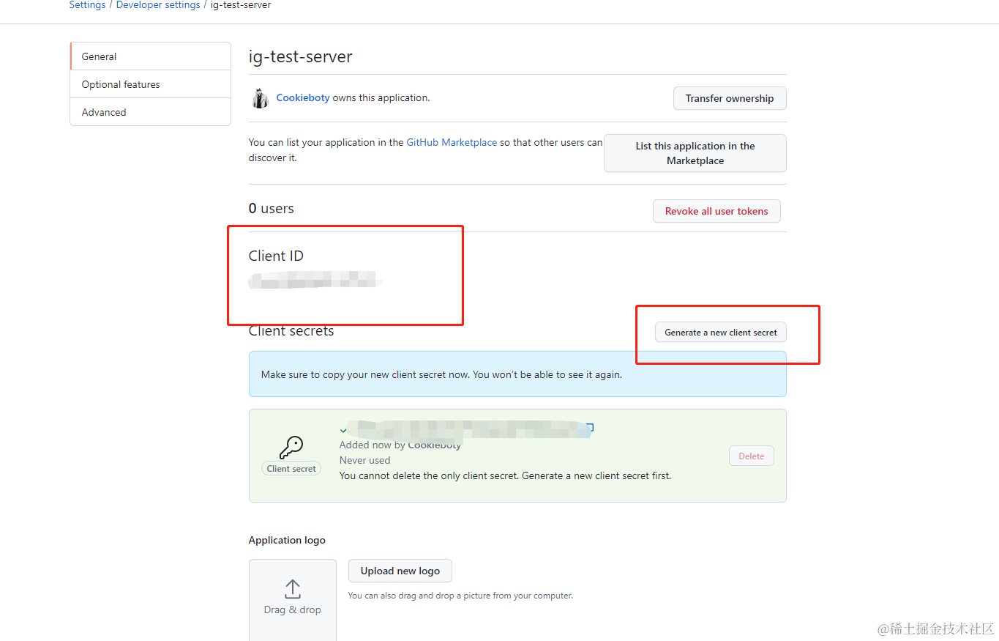

最后获取到 **Client ID** & **Client secrets**，注意这两个玩意请不要泄密，不然容易被人盗用。

**同时要注意 secrets 只有再生成的时候才能拿到，一定要保存好因为关闭页面之后是无法再次找回。**

## 用户授权登录

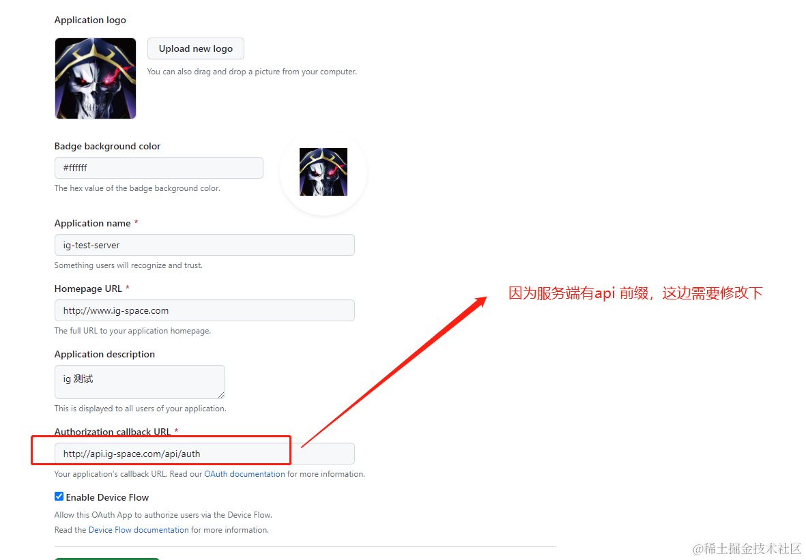

由于我们的服务端有 **api** 前缀，所以需要修改一下回调接口，如果不想要 `/api` 前缀，可以在 **nginx** 中代理。

然后我们来拼接一下 **Github** 的授权地址：

https://github.com/login/oauth/authorize?client_id=07aac5b0e0a0dc5dfdcb&redirect_uri=http%3A%2F%2Fapi.ig-space.com%2Fapi%2Fauth

正确在浏览器中输入以上地址会得到下图所示的 **Github** 授权界面，注意参数记得 `URLEncode`。

> 真实服务中依然不建议你们将 `client_id` 直接写在客户端，可以写个请求接口从后端获取，这里只是为了便于演示，所以我将测试的 `client_id` 放出来，方便对照测试，所以请不要乱玩。

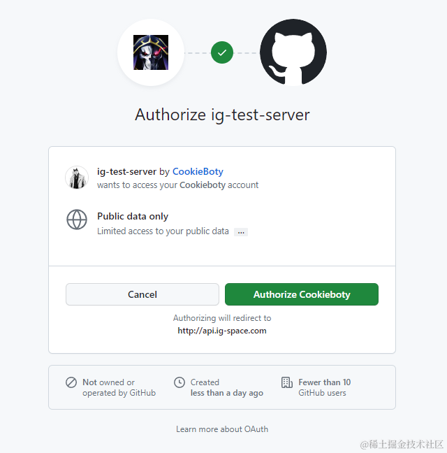

点击首选之后，系统会重定向到 http://api.ig-space.com/auth?code=11c0d5fafb7a8774c07e ，并携带一个对应的授权 **code**。

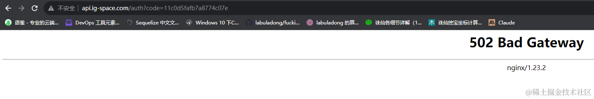

当然我现在还没有写对应的 **auth** 授权流程肯定会报错了，如果你打算自己写的话，那么可以按照下述流程并参考工程项目来开发。

#### Github 授权

1. 在 `lib/commm/helper/github/auth.ts` 中添加新的换取用户凭证方法：

```ts

import { BASE_API_GITHUB_URL, BASE_GITHUB_URL, GITHUB_ID, GITHUB_SECRET } from './const';

import { methodV } from '../../utils/request';

/**
 * @description: 获取用户 token
 */
export const getGithubToken = async ({ code }) => {
  const { data } = await methodV({
    baseUrl: BASE_GITHUB_URL,
    url: `login/oauth/access_token`,
    method: 'POST',
    params: {
      client_id: GITHUB_ID,
      client_secret: GITHUB_SECRET,
      code,
    },
  });
  console.log('github===>', data)
  return data;
};

/**
 * @description: 获取 Github 用户
 */
export const getGithubUser = async ({ token }) => {
  const { data } = await methodV({
    baseUrl: BASE_API_GITHUB_URL,
    url: `user`,
    method: 'GET',
    headers: {
      Authorization: `token ${token}`,
    },
  });
  console.log(data)
  return data;
};
```

其中 `GITHUB_ID` & `GITHUB_SECRET` 需要再 `.config/.dev.yaml` 里面配置:

```
GITGUB_CONFIG:
  CLIENT_ID: 07aac5b0e0a0dc5dfdcb // 这是的作者 CLIENT_ID，请不要随便乱玩，要玩玩自己的
  CLIENT_SECRETS: 请不要写错，使用上文生成的 SECRETS
```

统一的配置文件，我比较喜欢用 `lib/commm/helper/github/const.ts` 来承接：

```ts
import { getConfig } from "../../utils";

const { GITGUB_CONFIG } = getConfig()

export const GITHUB_ID = GITGUB_CONFIG.CLIENT_ID
export const GITHUB_SECRET = GITGUB_CONFIG.CLIENT_SECRETS
export const BASE_GITHUB_URL = "https://github.com/"
export const BASE_API_GITHUB_URL = "https://api.github.com/"
```

2. 在 `src/user/oauth.service.ts` 中添加新的换取用户凭证的 `Service`：

```ts
import { Injectable, } from '@nestjs/common';
import { BusinessException, getGithubUser, } from '@app/common';
import { getGithubToken } from '@app/common';
import * as querystring from 'querystring'

@Injectable()
export class OAuthService {

  async getUserToken(code: string) {
    const res: any = await getGithubToken({ code });
    const params = querystring.parse(res)
    console.log('params===>?', params.access_token)
    return this.getOathUser(params.access_token as string);
  }

  async getOathUser(token: string) {
    return getGithubUser({ token })
  }
}

```

3. 在 `src/auth/auth.controller.ts` 中添加换取 **Github** 用户信息的 `Controller`：

```
  @ApiOperation({
    summary: 'OAUTH 授权',
  })
  @Public()
  @Get('/')
  async OAuth(@Query("code") code) {
    console.log('code===>', code)
    return this.authService.validateFeishuUser(code);
  }
```

4. 添加 `src/auth/auth.service.ts` 获取 **Github** 的信息，并在数据库中落库：
```ts
import { Injectable } from '@nestjs/common';

import { JwtService } from '@nestjs/jwt';
import { GithubUserInfo } from '../userCenter/user/user.dto';
import { User } from '../userCenter/user/user.mysql.entity';
import { UserService } from '../userCenter/user/user.service';
import { OAuthService } from '../userCenter/user/oauth.service';

@Injectable()
export class AuthService {
  constructor(
    private jwtService: JwtService,
    private userService: UserService,
    private oAuthService: OAuthService,
  ) { }

  async validateFeishuUser(code: string): Promise<Payload> {

    const userInfo: GithubUserInfo = await this.getOAuthTokenByApplications(code);

    // 同步信息
    const user: User = await this.userService.createOrUpdateByOAoth(
      userInfo,
    );

    return {
      userId: user.id,
      username: user.username,
      name: user.name,
      email: user.email,
    };
  }

  async getOAuthTokenByApplications(code: string) {

    const oauth = await this.oAuthService.getUserToken(code);
    return oauth;
  }
}
```

此时在重新点击之前的授权链接可以得到正确的返回信息：

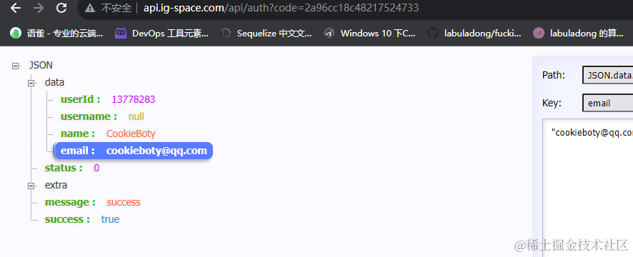

并且用户数据已经正确落库：

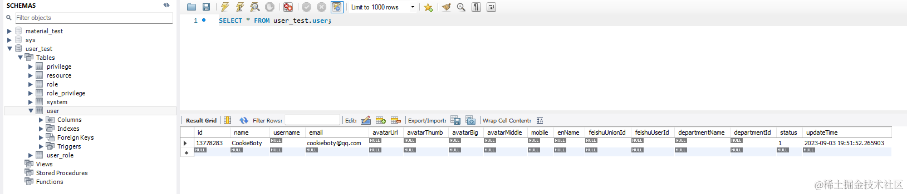

> 此时我们已经拿到了 **Github** 的 `access_token`，可以使用 `access_token` 调用 **Github** 的 **open api**，如果有需求的可以自行保存一下，但对于我们的项目来说仅仅只是为了减少鉴权这一步所以存下来的价值不大。

#### jwt 

**token** 的方案有很多种，我们选择较为通用的 **jwt** 来做为项目的 **token** 方案。

1. **安装对应的依赖**

``` shell
npm install @nestjs/passport passport
```

2. **新建 `/src/auth/strategies` 目录，添加 `oauth.strategy.ts` 与 `jwt-auth.strategy.ts` 两个文件**：

```ts
// oauth.strategy.ts

import { PassportStrategy } from '@nestjs/passport';
import { Injectable, Query, UnauthorizedException } from '@nestjs/common';
import { AuthService } from '../auth.service';
import { Strategy } from 'passport-custom';

@Injectable()
export class OAuthStrategy extends PassportStrategy(Strategy, 'oauth') {
  constructor(private authService: AuthService) {
    super();
  }

  async validate(req): Promise<Payload> {
    const q: any = req.query;

    const user = await this.authService.validateFeishuUser(q.code as string);

    if (!user) {
      throw new UnauthorizedException();
    }
    return user;
  }
}
```

```ts
// jwt-auth.strategy.ts
import { Injectable } from '@nestjs/common';
import { PassportStrategy } from '@nestjs/passport';
import { Strategy } from 'passport-jwt';
import { jwtConstants } from '../constants';

const cookieExtractor = function (req) {
  let token = null;
  if (req && req.cookies) {
    token = req.cookies['jwt'];
  }
  return token;
};

@Injectable()
export class JwtStrategy extends PassportStrategy(Strategy) {
  constructor() {
    super({
      jwtFromRequest: cookieExtractor,
      ignoreExpiration: jwtConstants.ignoreExpiration,
      secretOrKey: jwtConstants.secret,
    });
  }

  async validate(payload: Payload): Promise<Payload> {
    return { ...payload };
  }
}

```

`OAuthStrategy` 根据 `passport` 提供的方法，调用 `authService` 中的 `validateFeishuUser` 方法，从 Github 获取对应的用户信息。

`JwtStrategy` 则是使用 `passport-jwt`拓展的功能，对 `cookie` 做了拦截、解密等功能。

> 注意无论是使用 `passport` 自带的三方功能或者自行拓展 `passport`，都需要对 `validate` 方法进行重写以便实现自己的业务逻辑。

3. **新建 `/src/auth/guards` 目录，添加 `oauth.guard.ts` 与 `jwt-auth.guard.ts` 两个文件**：

```ts
// oauth.guard.ts
import { Injectable } from '@nestjs/common';
import { AuthGuard } from '@nestjs/passport';

@Injectable()
export class OAuthGuard extends AuthGuard('oauth') { }
```

这里要**注意**，因为 `OAuthGuard` 已经继承了通用的 `AuthGuard`，验证逻辑在 `OAuthStrategy` 实现了，所以并没有额外的代码出现，如果有其他的逻辑则需要对不同的方法进行重写已完成需求。

```ts
// jwt-auth.guard.ts
import { ExecutionContext, Injectable } from '@nestjs/common';
import { Reflector } from '@nestjs/core';
import { AuthGuard } from '@nestjs/passport';
import { BUSINESS_ERROR_CODE, BusinessException } from '@app/common';
import { IS_PUBLIC_KEY } from '../constants';

@Injectable()
export class JwtAuthGuard extends AuthGuard('jwt') {
  constructor(private reflector: Reflector) {
    super();
  }

  canActivate(context: ExecutionContext) {
    const loginAuth = this.reflector.getAllAndOverride<boolean>(IS_PUBLIC_KEY, [
      context.getHandler(),
      context.getClass(),
    ]);

    if (loginAuth) {
      return true;
    }

    return super.canActivate(context);
  }

  handleRequest(err, user, info) {
    if (err || !user) {
      throw (
        err ||
        new BusinessException({
          code: BUSINESS_ERROR_CODE.TOKEN_INVALID,
          message: 'token 已失效',
        })
      );
    }
    return user;
  }
}
```

`JwtAuthGuard` 模块实现了 `canActivate` 与 `handleRequest` 的重写，分别是针对于自定义逻辑与异常捕获的处理。

因为我们使用了 `JwtAuthGuard` 作为全局验证，但有的时候也是需要针对于部分接口开启白名单。例如，登录接口就需要开启白名单，毕竟把登录接口也拦截了，整个项目就无法正常使用了。

4. 重写之前 **OAUTH** 授权方法：

```ts
  @ApiOperation({
    summary: 'OAUTH 授权',
  })
  @Public()
  @UseGuards(OAuthGuard)
  @Get('/')
  async OAuth(@PayloadUser() user: Payload, @Res({ passthrough: true }) response) {
    const { access_token } = await this.authService.login(user);

    response.cookie('jwt', access_token, {
      path: '/',
      httpOnly: true,
      domain: '.ig-space.com'
    });
    
    return access_token
  }
```

5. `AuthService` 添加 `jwt` 注册用户的方法

```ts
  async login(user: Payload) {
    return {
      access_token: this.jwtService.sign(user),
    };
  }
```

然后在重新请求之前的授权路径，可以发现我们可以将 **jwt** 生成的 `cookie` 种在了 .ig-space.com 二级域名下，这样在 www.ig-space.com 也可以从 `cookie` 拿到对应的 `token` 实现了登录流程，最后只需要添加重定向的功能即可完成登录闭环。 

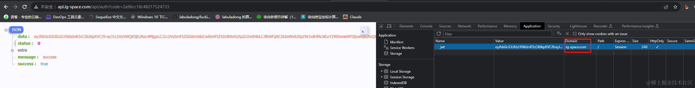

可以在 http://api.ig-space.com/doc#/%E7%94%A8%E6%88%B7/UserController_profile 直接使用获取用户接口来测试鉴权功能是否连通。

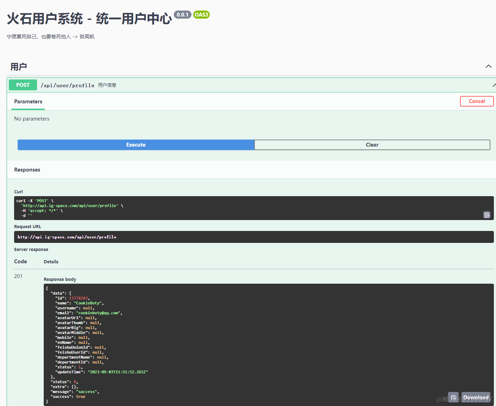

## 写在最后

本章是正式进入服务端开发的第一个章节，难度较之前可能有比较大幅度的提升，如果有服务端的基础或者之前买过 **NestJS** 小册的同学来说还是比较简单的（并非推广 **NestJS** 小册，自学能力强的同学不建议买 **NetsJS** 的教程，因为本身的文档就非常详细，小册主要的价值其实是架构设计啥的。）

由于整个鉴权的内容非常多，**所以小册章节中只有主要的步骤以及关键的代码实现**，更多的内容可以留言让我补充或者参考服务端的项目来学习。

本章主要介绍用户授权、登录等内容，下一章则主要讲述用户系统中 **RBAC** 权限的相关代码实现。

如果你有什么疑问，欢迎在评论区提出或者加群沟通。 👏

