# 26.服务端实战：服务部署

本章的纯服务端部署内容与《**NestJS 实战**》小册的应用部署有重合的地方，已经阅读过的同学，可以跳过纯服务端部署**直接看混合应用部署的章节**。

对 **Docker** 不熟悉的同学可以参考以下两篇文章：

[前端全栈之路 - 玩转 Docker (基础)](https://juejin.cn/post/7147483669299462174)

[前端全栈之路 - 玩转 Docker (Dockerfile)](https://juejin.cn/post/7160972042757079077)


## 纯服务端部署

`NestJS` 两种方式的发布类型： `PM2` 与 `Docker Compose` 部署，纯服务段部署的列子为 [fast-gateway](https://github.com/Ignition-Space/fast-gateway)。

#### PM2

[PM2](https://pm2.keymetrics.io/docs/usage/quick-start/) 是一款使用于生产环境的 `NodeJS` 的进程管理工具，操作非常简便，内置了进程管理、监控、日志以及负载均衡的能力。

首先需要安装 `PM2` 的依赖，一般会安装在全局依赖：

```shell
$ yarn global add pm2
```

普通的前端项目启动的话，直接使用以下命令就行了：

```shell
pm2 start app.js
```
但毕竟是这一个实战的项目而且也有不同的环境变量存在，直接这么启动并不合适，可以借助 `Ecosystem File` 来完成我们的需求。

1. 项目根目录新建 `ecosystem.config.js`：
```js
module.exports = {
  apps: [
    {
      name: "gateway",
      script: "dist/src/main.js",
      env_production: {
        RUNNING_ENV: "prod"
      },
      env_development: {
        RUNNING_ENV: "dev"
      }
    }
  ]
}
```

2. 添加 `package.json` 中的 `scripts` 构建命令：
```diff
+ "build": "nest build",
+ "build:webpack": "nest build --webpack",
```

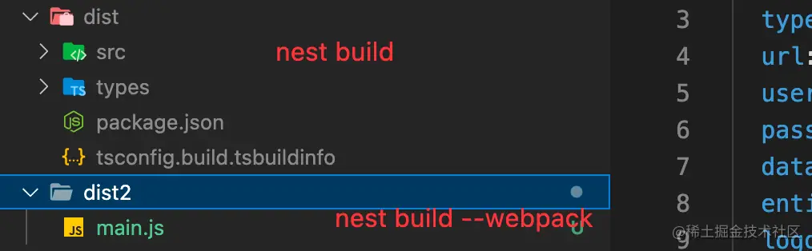

对比一下两种构建命令的不同点：
- `nest build`：将 `NestJS` 项目的源码从 `TS` 编译成 `JS` 之后再使用 `node main.js` 来运行项目，这样有个好处是还能看到大概的工程路径，也可以使用 `TypeOrm` 动态注册实体类的功能。
- `nest build --webpack` 会将 `NestJS` 项目打包成一个独立的 `main.js`，从文件类型的角度来说，做了一次混淆跟合并，原理跟之前提到过的热更新启动是一样的，按照这种模式的话来使用的话，**就不能使用动态注册实体类的功能，只能手动引入实体类**。

两种构建产物的方式都可以完成要求，按照自己的喜好选择就行，但无论是 `webpack` 打包成单文件的模式还是使用 `TSC` 模式生成 `JS` 项目代码，都需要在发布工程里面添加 `node_modules`，否则是没办法正常启动。

因为这两种模式并没有将依赖直接打包进产物内，虽然可以曲线修改 `webpack.config` 可以使得在 `webpack` 模式下，能将所有的依赖都打入单文件，但是由于环境依赖的问题，这种模式的产物大概率只能在相同的环境运行依赖，例如 `windows` 下打包的产物是无法部署在 `linux` 环境下。

3. 在 `package.json` 的 `scripts` 中添加启动脚本：
```diff
+ "start:prod": "nest build && pm2 start ecosystem.config.js --env production"
```

添加完毕之后，执行 `yarn start:prod` 出现如下界面既完成了项目生产环境的部署，如果不能正常访问接口的话，可以使用 `pm2 log gateway` 查看启动日志，如果按照我给的方案走一般不会出现问题，有问题的话，大概率是配置文件找不到，调整配置文件即可。

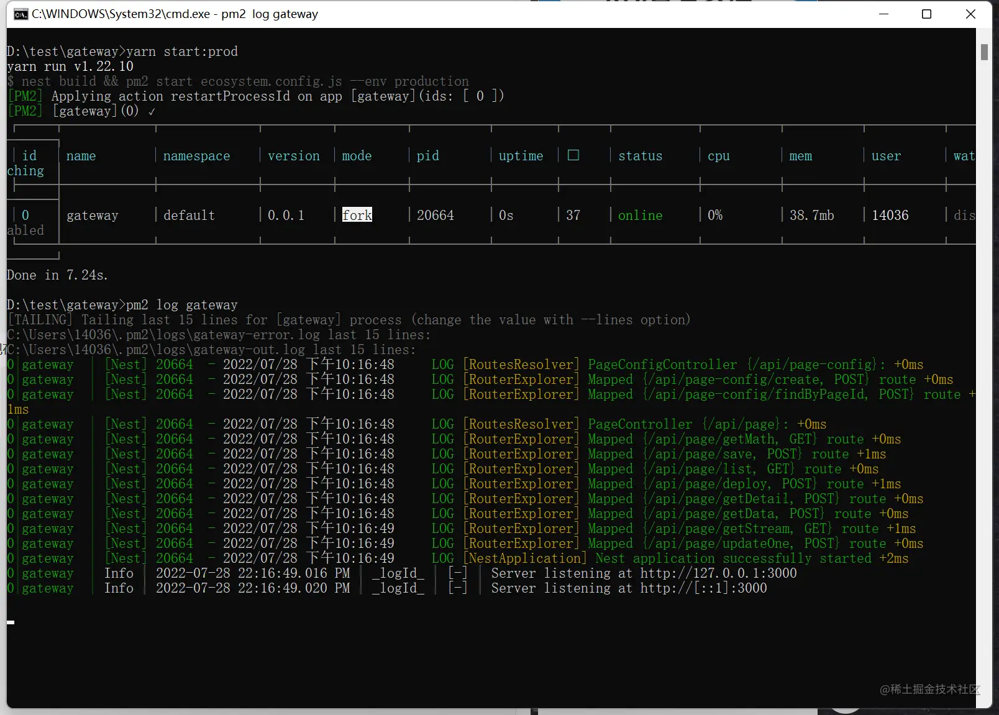

> **切记，如果使用 webpack 模式部署生产环境，一定要手动注册实体类！！！！不然会报错的！！！！**

更多的 `PM2` 的 `API` 使用与黑科技，用兴趣的同学可以自己进行摸索，这里就不过多介绍了。

#### Docker Compose

`Docker Compose` 项目是 `Docker` 官方的开源项目，负责实现对 `Docker` 容器集群的快速编排日常开发工作中，经常会碰到需要多个容器相互配合来完成某项任务的情况。

比如我们的网关服务体系就由 **3** 个不同的服务组成，其中还不包括 `Redis`、`Mysql` 这种中间件的服务，所以每个服务都使用直接 `Docker` 来部署的话，效率低下而且维护麻烦，而借助 `Docker Compose` 可以将我们的服务统一一次性部署完成。

**第一步**：要把项目工程打包成 `image`，根路径创建文件 `Dockerfile`:
```
FROM node:16-alpine3.15

RUN mkdir -p /home/app/

WORKDIR /home/app/

COPY package*.json ./

RUN npm install

COPY . .

EXPOSE 3000

ENTRYPOINT ["npm", "run"]

CMD ["start"]
```

**第二步**：根目录运行以下脚本来就行构建：

```shell
$ docker build -f ./Dockerfile -t gateway:0.0.1 .
```

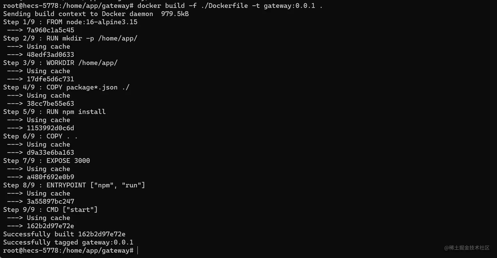

**第三步**：运行以下命令既可以启动容器运行：

```shell
docker run -d -e RUNNING_ENV=prod -p 3000:3000 gateway:0.0.1
```

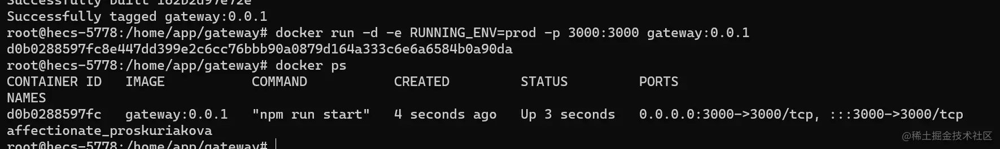

使用 `docker logs [容器id] `既可以看到我们的项目已经正常启动了：
 
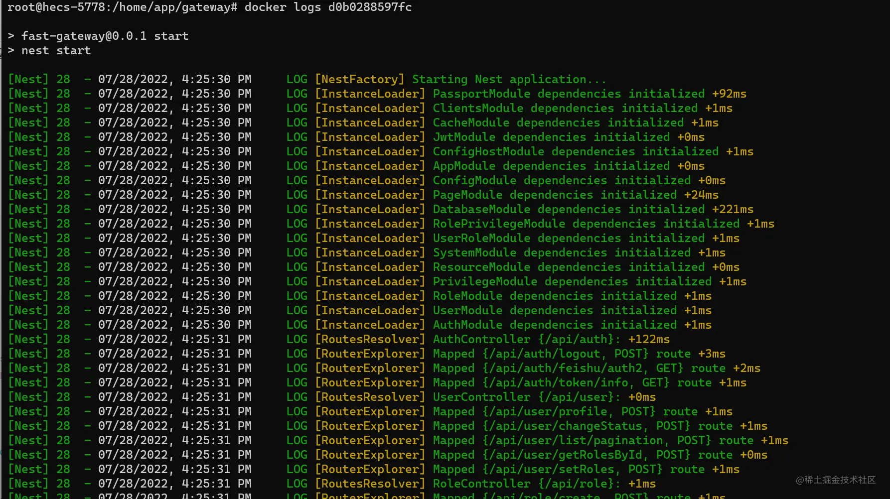


以上是直接使用 `Docker` 来部署项目，换成 `Docker Compose` 的话，则需要额外新建文件 `docker-compose.gateway-service-dev.yml`：
```
version: "3"
services:
  gateway-service-dev:
    container_name: gateway-service-dev
    build:
      context: ./
      dockerfile: Dockerfile
    ports:
      - "3000:3000"
    environment:
      RUNNING_ENV: 'dev'
    networks:
      - servicebus
networks:
  servicebus:
    name: servicebus
```
启动命令为：

```shell
docker-compose -f docker-compose.gateway-service-dev.yml up -d  --build
```
其中 `build` 参数代表构建过程，所以我们在使用 docker-compose 构建的时候可以省去第二步构建镜像的步骤，配合 `docker file` 中的前置安装依赖步骤，可以在每次更新代码后需要重新构建时，项目依赖不更新的情况下，使用缓存构建，大幅度减少构建时间。

## 混合应用部署

对于我们新的体系来说，是基于 **PNPM** 的 **monorepo** 的开发模式，前端的项目都是在同一个服项目开发。

虽然在同一个项目中开发，但你依然可以使用前后端分离的模式来发布对应的项目，前端构建完毕后推送到 **oss** 或者其他的静态服务器，也可以使用 **Docker Compose** 来同时发布前后端应用，接下来我们一起学一下同时发布前后端应用。

混合应用部署的列子为：[ignition](https://github.com/Ignition-Space/ignition)

#### 准备构建脚本

在之前的项目架构中，我们使用了 **turbo** 来管理我们多个项目启动的问题，比如同时启动用户系统的前后端项目，可以使用：

```package
"dev:user": "turbo run dev:user",
```

启动完毕之后，如下所示前后端项目都正常运行起来了。

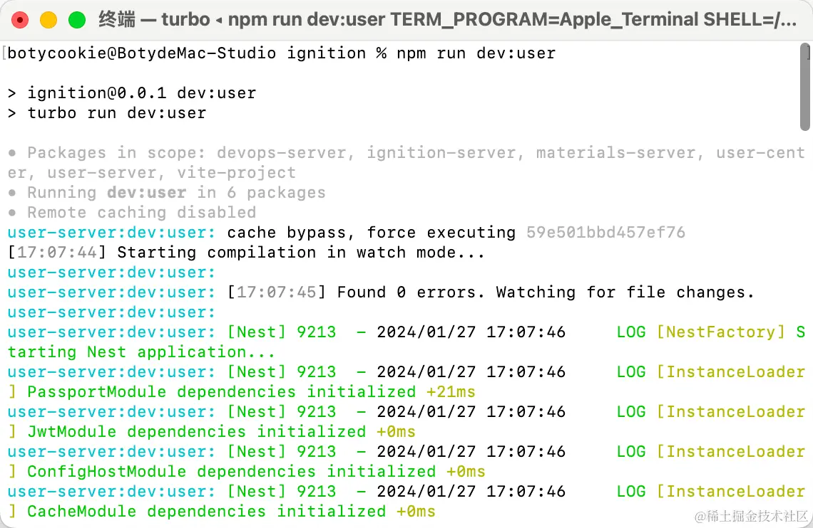

我们按照 **dev:user** 的模式来准备一下构建的脚本。

首先在 `turbo.json` 中添加 `build:user` 的命令。

```diff
{
  "$schema": "https://turborepo.org/schema.json",
  "pipeline": {
    "dev": {
      "cache": false
    },
    "dev:user": {
      "cache": false
    },
    "dev:ig": {
      "cache": false
    },
+    "build:user": {
+       "dependsOn": ["^build"]
+    }
  }
}
```

然后在对应的项目中修改构建的脚本，**NestJS** 只需要修改脚本命令即可，但 **Vite** 需要修改构建输出地址。

1. 修改前端构建命令

`/clients/userCenter/package.json`

```diff
+ "build:user": "vite build",
```

2. 修改前端构建项目输出目录
`/clients/userCenter/vite.config.ts`
```diff
build: {
    outDir: '../../dist-web/user',
  },
```

> 小册的 用户系统是 **vite** 框架，如果是 **webpack** 的话，需要按照对应的规则修改。

正常构建出的目录结构如下所示：

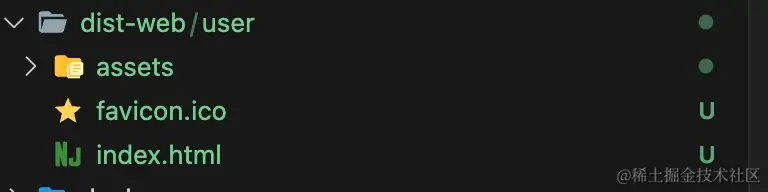

3. 修改服务端的构建命令

`/apps/userServer/package.json`
```diff
+ "build:user": "cd .. && pnpm build-server:user"
```

4. 更目录新增构建命令

```diff
+ "build:user": "turbo run build:user",
+ "build-server:user": "nest build user-server",
```

5. 运行 `pnpm build:user`，可以获取到如下的构建产物

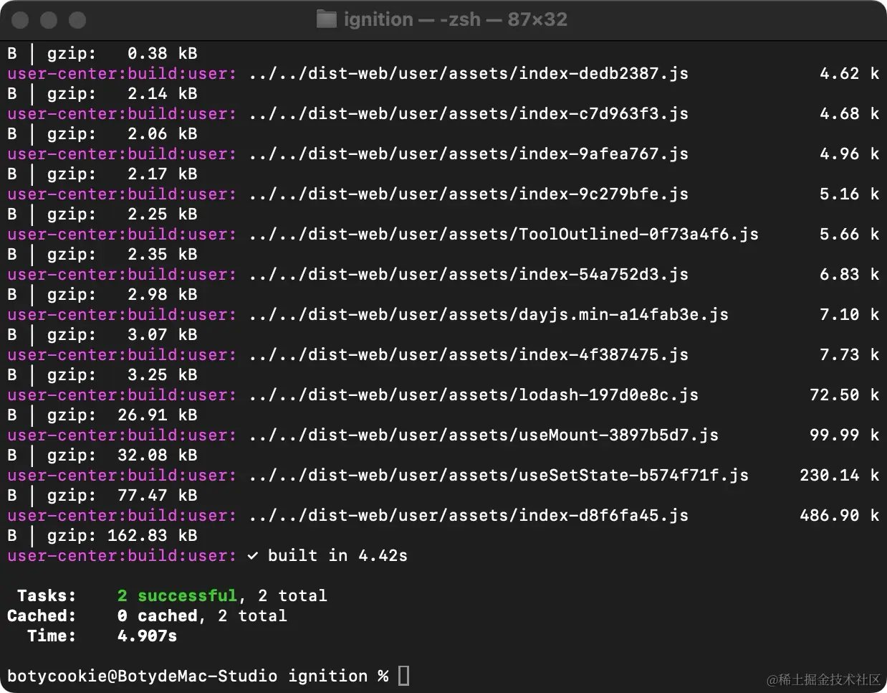

**构建完毕的路径如下**：

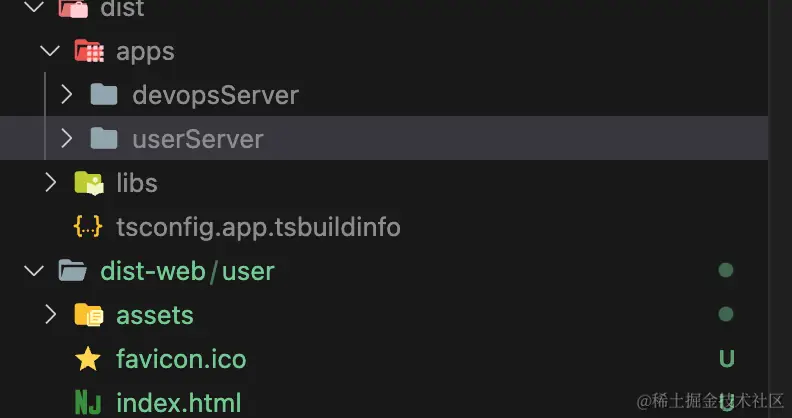

#### 准备 dokcer 镜像

与 **build:user** 一样，我们需要重写创建 **deploy:user** 命令，为了减少容器以来，**demo** 使用 **anywhere** 启动静态资源。

启动命令需要修改成：

**前端项目**:

```sh
+ "deploy:user": "anywhere -p 8080 -d ../../dist-web/user -s",
```

**服务端项目**：

**主工程**:

```sh
+ "start-server:user": "node ./dist/apps/userServer/src/main.js",
+ "deploy:user": "turbo run deploy:user",
```

**子工程**：

```sh
+ "deploy:user": "cd .. && pnpm start-server:user"
```

**dockerfile** 脚本如下：

```dockerfile
FROM node:16-alpine3.15

RUN mkdir -p /home/app/

WORKDIR /home/app/

RUN npm i anywhere -g

RUN npm i pnpm -g

COPY package*.json ./

RUN pnpm install

COPY . .

RUN pnpm install

RUN pnpm run build:user

EXPOSE 8080

EXPOSE 4000

CMD pnpm run deploy:user  
```

> 之所以会有 **2** 次 `RUN pnpm install`，第一次是安装全局的，可以加缓存，第二次是安装子工程的，一般也就前端会出现各种依赖需要更新的情况，服务端的更新频率一般较低。

**构建镜像**：

```sh
docker build -f ./Dockerfile -t ig:0.0.1 .
```

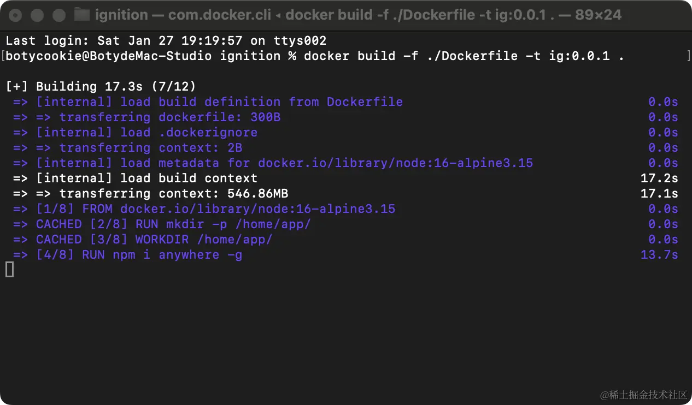

**运行容器**：

```sh
docker run -d -p 8080:8080 -p 4000:4000 ig:0.0.1
```

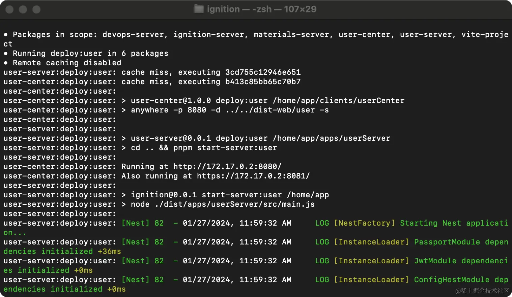

正常启动之后效果如下所示：

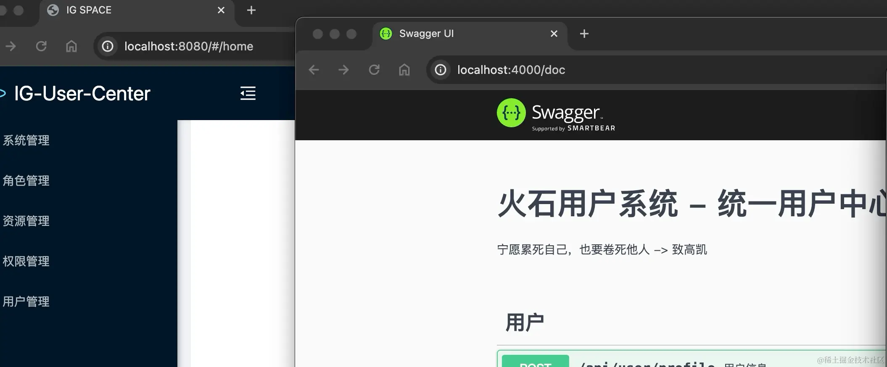

#### 备注
但 **Docker** 容器的哲学是一个 **Docker** 容器只运行一个进程。

同时 **Docker** 也不具备一次性运行多个进程的功能，无论是 **anywhere** 还是 **NestJS** 都属于进程，所以使用 `&&` 符号是没办法同时启动两个进程的，这里我们使用 **turbo** 来帮助我们补充这个能力。

这种一个容器运行多个进程并不是最优解决，最好的办法还是前后端分离部署，前端资源上 **oss** 或者其他静态服务器，**docker** 中只需要启动 **NestJS** 服务端的程序即可。

但在一些内部服务，小项目也不失为一种方法，偶尔拿来练练。

## 写在最后

部署篇的章节为了方便大家快速使用，目前较为简单，等待所有的项目都完成之后，会在 `docker compose` 部分扩充内容，给大家展示容器编排的优势。

另外如果有机会或者想尝试 `K8S` 部署的话，可以参考 `Devops` 的小册，里面有 `Rancher` 章节是关于集群部署的。

后面也会有专门的直播&录播模块，应该都会尽快上线。

如果你有什么疑问，欢迎在评论区提出或者加群沟通。 👏