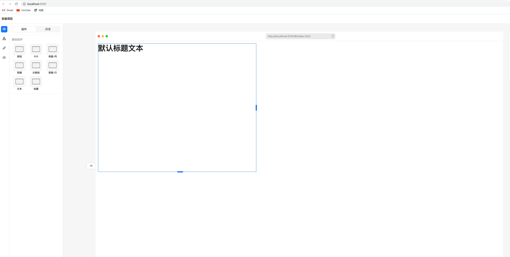

# 38.组件实战：布局组件实现

在日常开发中，往往会在页面当中使用一些特定的样式来给整体应用做一个大框架的设计，比如在以前面试非常🔥的**双飞翼**、**圣杯**、**三栏居中**等等通过CSS实现的布局容器，我们可以统一称其为**应用程序的布局。**

在网页开发中，如何把你的盒子放在与视口相关的正确位置上显示是非常重要的，因此CSS中提供了非常多的布局解决方案，比如**Flex、Grid、Position**等一系列的布局模式给开发者使用，帮助其能够能简单、快速的搭建现代化前端应用页面。

在低代码平台当中，布局组件同样至关重要。它决定了编排的效率与渲染效果的差异。在本章节的主要内容就是来完成编辑器中常见的基础布局组件。

## 容器大小

在编辑状态下，用户可以通过自定义的手柄自然的调整大小。想要实现如下图所示的容器收缩效果就需要借助**re-resizable**来实现相关的功能。

如下代码所示：

**re-resizable**可以创建一个可伸缩的容器，下面是一些常见的设置属性：

-   **宽度与高度**：通过**defaultSize和size**分别设置默认宽度和高度与状态大小的改变。
-   **范围**：**bounds**属性设置为**parent**可以将容器拉伸的范围限定为父容器的高和宽，避免**overflow**后超出可视区域内。
-   **拖动方向**：设置**enable**属性可以指定开启能够支持缩放的点位，分别为四角和四边，默认情况下是全部开启的状态。

需要注意的是**Resizable的Ref**绑定是通过函数形式来处理的，连接器**connect**链接物料组件使用的是**resizable.current.resizable**来进行绑定，这样的话就将一份**Resizable**组件保存起来，方便后续进行使用。

```tsx

export interface ContainerProps {
  style?: React.CSSProperties;
  children?: React.ReactNode;
  initialWidth?: string | number;
  initialHeight?: string | number;
  width?: string | number;
  height?: string | number;
}

export const Container: UserComponent<
    ContainerProps
> = ({ children, initialWidth, initialHeight, style, ...styleProps }) => {
  const resizable = React.useRef<any>(null)
  const frameworkContext = React.useContext(FrameworkContext)

  const {
    actions: { setProp },
    connectors: { connect },
    active
  } = useNode((node) => ({
    parent: node.data.parent,
    active: node.events.selected
  }))

  return (
    <Resizable
      style={{
        position: 'relative',
        ...style,
      }}
      size={{
        width: styleProps?.width as string,
        height: styleProps?.height as string
      }}
      defaultSize={{
        width: initialWidth || '100%',
        height: initialHeight || '100%'
      }}
      bounds='parent'
      enable={{
        right: frameworkContext?.enabled,
        bottom: frameworkContext?.enabled
      }}
      ref={(ref) => {
        if (ref) {
          resizable.current = ref
          connect(resizable.current.resizable)
        }
      }}
      onResize={handleResizableChange}
    >
      {children}
    </Resizable>
  )
}

Container.craft = {
  displayName: '容器',
  related: {
  }
}
```

#### 指示器

完成相关的**Resizeable**组件后，此时页面容器已经可以拖动了，但是会发现拖动的标记不明显。此时就需要根据自身需求实现**IndicatorRound**组件。

如下代码所示：

通过**position**的方式，为右下两侧添加指示符号标记。

```tsx
import * as React from "react";
import { css } from "@emotion/css";
import { theme } from "antd";
import clsx from "clsx";
import classes from "./index.module.sass";

const { useToken } = theme;

export interface IndicatorsProps {
  bound?: string;
  show?: boolean;
}

export const IndicatorRound: React.FC<IndicatorsProps> = (props) => {
  const { token } = useToken();

  return (
    <div
      className={clsx(classes.indicatorRound, {
        [classes.hide]: !props.show,
      })}
    >
      <span
        style={{
          background: token.colorPrimary,
        }}
        className={classes.indicatorRoundInline}
      />
      <span
        style={{
          background: token.colorPrimary,
        }}
        className={classes.indicatorRoundBlock}
      />
      <span />
    </div>
  );
};

```
```scss
.indicatorRound
  position: absolute
  top: 0
  left: 0
  width: 100%
  height: 100%
  pointer-events: none
  
  &Inline
    position: absolute
    width: 6px
    height: 30px
    top: 50%
    right: -3px
    z-index: 2
    border-radius: 200px
    pointer-events: none
    transform: translate(0, -50%)

  &Block
    position: absolute
    width: 30px
    height: 6px
    bottom: -3px
    left: 50%
    z-index: 2
    border-radius: 200px
    pointer-events: none

.hide
  display: none
```

### 使用方式

将**IndicatorRound**组件渲染到**Resizable**，此时**IndicatorRound**的组件将定位到其两侧，来给用户拉伸的提示信息和操作。接下来为**Resizable**添加绑定事件，来设置当前拖拽的宽度与高度。

handleResizableChange方法做的事情很简单，**ResizeCallback** 会返回当前容器的ElementDOM，可以直接拿到当前宽度和高度，并使用 **@craftjs/core** 中的 **setProp** 为容器组件设置对应的**Props**属性。

```diff
import { IndicatorRound } from './Indicators'

+ const handleResizableChange: ResizeCallback = (
+    _,
+    __,
+    elRef,
+  ) => {
+    const { width, height } = elRef.style
+    setProp((prop: Record<string, any>) => {
+      prop.width = width
+      prop.height = height
+   }, 400)
+  }

<Resizable
      style={{
        position: 'relative',
        ...style,
      }}
      size={{
        width: styleProps?.width as string,
        height: styleProps?.height as string
      }}
      defaultSize={{
        width: initialWidth || '100%',
        height: initialHeight || '100%'
      }}
      bounds='parent'
      enable={{
        right: frameworkContext?.enabled,
        bottom: frameworkContext?.enabled
      }}
      ref={(ref) => {
        if (ref) {
          resizable.current = ref
          connect(resizable.current.resizable)
        }
      }}
+      onResize={handleResizableChange}
    >
      {children}
+    <IndicatorRound show={active} />
    </Resizable>
```

如下所示，就是当前显示的效果。



## 栅格布局

栅格布局是一种常用的网页布局技术，可以将页面划分为多个水平和垂直的栅格列，以便更方便地组织和布局内容。

在栅格布局中，通常使用CSS Grid或Flexbox来创建栅格系统。这两种技术都可以实现灵活的栅格布局，但在实现方式和语法上略有不同。

**Ant Design**组件提供的栅格化系统是基于 **Flex** 布局，允许子元素在父节点内的水平对齐方式 - 居左、居中、居右、等宽排列、分散排列。子元素与子元素之间，支持顶部对齐、垂直居中对齐、底部对齐的方式。同时，支持使用 **order** 来定义元素的排列顺序。

在物料组件中，只需要通过简单的**Element**组件包装，就可以实现一个基础的栅格化的布局组件。

**Element**是一个重要的概念和实体，它主要用于表示和操作用户在可视化编辑器中添加的组件或元素。它代表页面上的一个独立的组件或元素，它包含了该组件的所有相关数据和属性。这些数据可以包括组件的位置、尺寸、样式、文本内容等。在编辑器中，一些容器包装类的组件实现必然离不开它的身影。在实现**Row和Column**物料组件的过程中，**Element**的使用方式有多种，下面分别是不同形式的Element组件的实现。

具体的实现代码：

```tsx
export const Row = createReactMaterial(withMaterialNode<RowProps>(AntdRow), {
})

export const RowView = React.forwardRef<any, RowProps>((props, ref) => {
  return (
    <Element id="row-columns" canvas ref={ref} is={Row} {...props} >
      <Column/>
      {props.children}
    </Element>
  )
})

export const Rows = createReactMaterial(withMaterialNode<RowProps>(RowView), {
  displayName: '容器-行',
})
```

```tsx
export const ColumnView = React.forwardRef<any, ColProps>((props, ref) => {
  return (
    <AntCol ref={ref} {...props} >
        <Element is={Slot} canvas id="col-container"  />
    </AntCol>
  )
})

ColumnView.defaultProps = {
  span: 4
}

export const Column = createReactMaterial(withMaterialNode<ColProps>(ColumnView), {
  displayName: '容器-列',
  props: {
    span: 4
  }
})
```


## 扩展

当实现了容器大小的调整和栅栏化组件后，在后续也会将列表、条件选择、页面布局等组件引入到对应的布局组件分类中来，大体上的实现大差不差，可以通过当前现有的一些业务组件进行轻量的改造旧可以直接放入到编辑器中进行使用，大多数情况下只需要为其包裹一层自定义的Element，并创建成为物料组件。

> 本章节内容会随着后续materials的更新同步插入。

## 总结

在本章节中，我们着重介绍了一系列基础组件容器，以供后续扩展更多容器组件的需要。这些容器组件可以在编辑器中使用，用于组织和排列其他组件，实现页面布局的灵活性和多样性。以下是我们计划实现的基础容器组件列表：

1.  **栅格布局容器**：栅格布局容器是一种经典的布局工具，通过将页面划分为网格状的列和行，使得组件的位置和尺寸可以灵活调整，以适应各种布局需求。
1.  **盒子容器**：作为最基础的布局组件，盒子容器可以将多个组件包装在一个容器中。通过定义容器的背景颜色、边距和背景设置，以及控制内部组件的布局关系，盒子容器能够确保整体布局的一致性和美观性。
1.  **水平和垂直布局容器**：水平和垂直布局容器可用于创建水平或垂直方向的页面布局。通过这些容器组件，开发人员可以轻松地放置和对齐组件，实现各种布局效果，例如导航栏、侧边栏等。
1.  **卡片容器**：卡片容器是一种常见的布局组件，常用于展示信息和内容。它提供了一个容器，可容纳文本、图片等组件，并提供样式和边框以呈现出卡片的效果。
1.  **表单容器**：表单容器是用于创建和布局表单的组件。它可以包含输入框、复选框、下拉列表等表单元素，并帮助开发人员合理布局这些元素，以方便用户填写和提交表单。如

以上这些布局容器组件在中后台场景中经常被使用，并通过它们，我们可以高效地搭建各种页面布局。