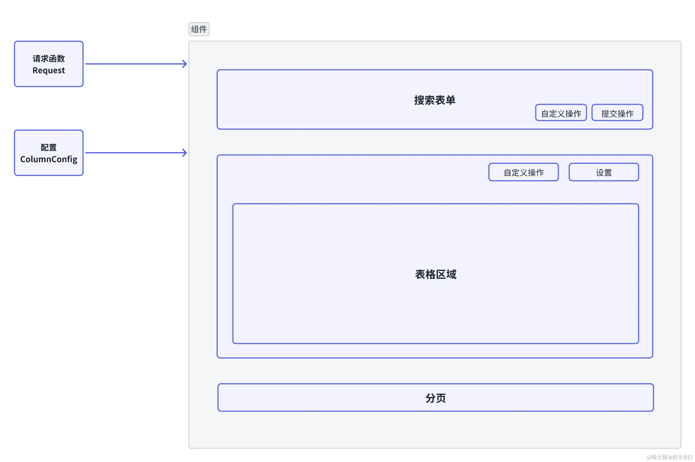
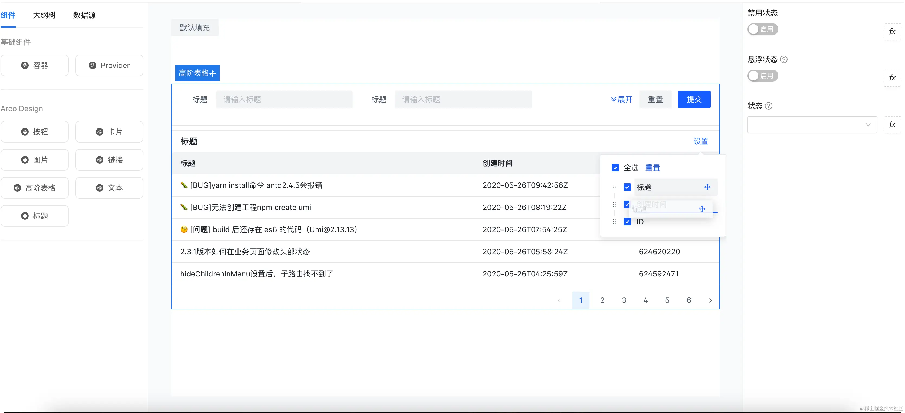
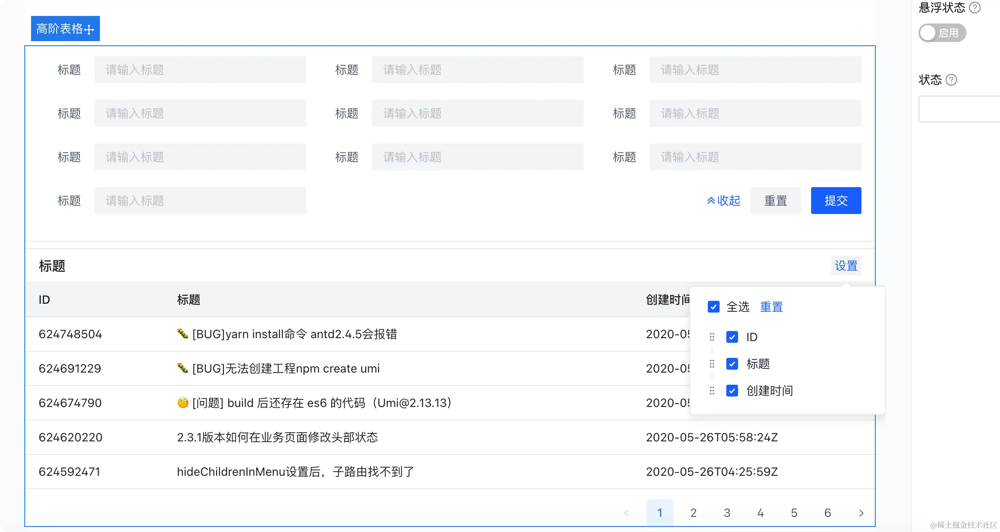

# 40.组件实战：表格组件开发

在中后台业务场景下绝大部分的表格都不会单独存在(简单的甚至可以使用**List**代替)，伴随着业务DS的体验一致和与服务器数据交互，大部分的团队都会将其封装成为高阶组件进行使用，从而提升产品交付的速度和质量，后期维护和升级的成本也将大幅度减少。

目前市面上存在不少的优质解决方案，如下：

-   [**SurelyTable**](https://www.surely.cool/)
-   [**MUI-Data-Grid**](https://mui.com/x/react-data-grid/)
-   [**AntD ProTable**](https://procomponents.ant.design/components/table)

## 功能设计

整体的功能设计如下，使用时只需要传入请求参数和基本配置即可完成。通过传入接口请求和配置对象，可以轻松的生成一个带搜索和工具栏的高阶表格组件。

-   **请求函数**：传入一个固定返回total和data的异步函数，来请求接口数据源获得表格中需要展示的数据列表。request参数会接管整个列表的公共状态属性，如loading、selectKeys、请求参数修改与响应。
-   **配置**：配置对象分为表单组件和表格列的配置，两者可以分开也可以将其合并在一个参数当中进行配置。



如上图所示，除了传入的重要参数外，按照中台标准的模板，将其分割为以下几个模块：

-   **表单Form**：查询表单模块

    -   内置标准表单组件如：输入、下拉选择器等组件，且允许用户传入自定义组件。
    -   搜索与重置交互操作，且允许用户传入自定义的操作按钮。
    -   当搜索表单项多的时候，收起和展开可以减少其展示面积，避免遮挡表格内部重要信息的展示。

-   **表格展示Table**：数据展示模块

    -   操作设置：能够自定义列表列字段的显示和隐藏，顺序调整等行为，来提升不同使用者的数据展示体验。
    -   自定义操作：通过传入自定义操作能够在操作栏中添加新的组件，来支持更多的自定义功能，保持风格的一致。

-   **分页显示**：分页控制表格内显示数据的数量，可以减少服务端的压力与减少页面因为数据量大导致的卡顿。

## 开发实现

在实现时尽可能的减少学习成本，因此Demo的实现上尽可能采用最小原子化的设计方式来进行开发。可以看到如下物料的演示过程，在物料组件的**props**中传入了**rowKey**、**request**、**searchFields**、**columns**等几个参数就能够直接完成整个组件的展示。

-   **rowKey**：列表的唯一key，避免表格出现组件的重复加载，效果同React.Key相似。
-   **request**：请求函数，用于携带查询条件请求服务端数据。
-   **searchFields**：搜索表单的配置，用来统一生成表单的组件展示。
-   **columns**：同Table组件的属性配置，声明表格组件的列信息。

> **searchFields**与**columns**两者的配置可以进行合并，大多数情况下表格列的展示字段通常也会在搜索栏中出现，因此基于自身的业务属性可以将两者结合来实现一份配置同时完成搜索和显示。

```tsx
import { createReactMaterial } from "@huos/core";
import { ProTableView } from "./view";
import { Panel } from "./panel";
import request from "umi-request";

export const __ArcoProTable__ = createReactMaterial(ProTableView, {
  displayName: "高阶表格",
  custom: {
    useResize: false,
  },
  props: {
   // tableRowKey
    rowKey: 'id',
    // request
    request: async (params) => {
    },
    // formFields
    searchFields: [
    ],
    // tableColumns
    columns: [
      
    ],
  },
  related: {
    settingRender: Panel,
  },
});
```

  


### 请求实现

首先，先来看看request参数的实现原理。

如下代码所示：

**request**本身是一个**Promise异步函数**，它分别会接收三个参数：

-   **params**：用户查询的参数，如搜索表单的属性，分页组件的页码与表格长度。

-   **Sort & filter**: 表格的标题在部分场景中筛选和排序是两种高频的使用方式，因此在request当中也会接管对应的参数并将当前状态通过参数进行传递，在请求函数中，您可以将其转换成为理想的参数格式发送给接口，从而完成对应操作的实现。

-   返回值：request请求函数的返回值是一个对象，内部包含success、data、total等几个关键性的数据，正常情况下是必填的。

    -   **success**：判断当前请求是否成功，以此来决定后续表格组件是否继续向下解析。
    -   **data**：列表数据。
    -   **total**: 列表总数，将会传递给分页组件进行渲染展示，从而支持分页功能。

  


```tsx
interface DefaultRequestParams {
    pageSize: number;
    current: number;
}

type RequestType = (params: R & DefaultRequestParams, sort: SortType, filter: FilterType) => Promise<{
    success: boolean,
    data: any[],
    total: number;
}>

{
    request: async (params: any) => {
      const data = await request(
        "https://proapi.azurewebsites.net/github/issues",
        {
          method: "GET",
          params,
        }
      );
      return data;
    }
  }
```

通过上述几个出入参数约定基本的请求格式后，就可以快速的完成具体功能的实现。

如下代码所示：

使用**useEffect**对**params、sort、filter**这几个入参的副作用进行管理，当发生变化时则重新执行**request**函数获取最新的数据。

```tsx
React.useEffect(() => {
      if (request) {
        setTrue()
        request(params, sort, filter).then(({ success = false, data = [], total = [] }) => {
          if (success) {
            setTableData({
              data,
              total
            })
          }
        }).finally(() => {
          setFalse()
        })
      }
    }, [params, sort, filter])
```

### 表单实现

搜索表单组件主要需要接收一个**items**参数，它是**ProTable**组件**searchFields**的透传。

如下代码所示：

**searchField**需要在**FromItem**的基础上额外接收**componentType**和**componentProps**属性，这两个属性类似之前编辑器协议的实现，主要是用来查找渲染的表单组件的。

-   **componentType**：表单控件的名称索引，通过索引在**resolver**中查找对应的控件并展示。
-   **componentProps**：对应表单控件的参数传递。

```tsx
export interface SearchFormProps {
  items: Array<{
    componentType: keyof typeof resolver;
    componentProps: any;
  } & FormItemProps>;
}
```

**resolver**的实现如下代码所示：

将**ArcoDesign**的表单控件封装成为一个大对象，根据**componentType**可以直接进行获取到对应的组件，遍历**searchFields**将其渲染随后进行渲染。

> 如果读过前面设计篇的同学应该能够很快的理解，resolver的方式能够将组件配置简单化，方便后续的存储。

```tsx
const resolver = {
  InputNumber,
  Select,
  Input,
  Switch,
  TreeSelect,
  Slider,
  // ...
} as const;


export const SearchForm: React.FC<SearchFormProps> = (props) => {
  const [collapsed, { toggle }] = useBoolean(true);

  return (
    <Grid collapsed={collapsed} cols={3} colGap={12}>
      {props.items.map((item) => {
        const { componentType, componentProps, ...formItemProps } = item
        const Element = resolver?.[componentType]
        return (
          <GridItem>
            <Form.Item {...formItemProps} >
              <Element {...componentProps} />
            </Form.Item>
          </GridItem>
        );
      })}
    </Grid>
  );
};
```

### 展开收起

整个表单组件是使用**Grid布局**实现的，它能够支持折叠，并且将表单操作的区域固定在末尾，从而达到一个展开收起的功能。

如下代码所示：

为**GridItem**组件添加**suffix**属性后，通过**useBoolean**声明的**collapsed**属性来完成收起开关的切换，在**suffix**网格中，通过**collapsed**的状态判断在页面组件中显示的相关文本信息。

```tsx
export const SearchForm: React.FC<SearchFormProps> = (props) => {
  const [collapsed, { toggle }] = useBoolean(true);

  return (
    <Grid collapsed={collapsed} cols={3} colGap={12}>
      {props.items.map((item) => {
        const { componentType, componentProps, ...formItemProps } = item
        const Element = resolver?.[componentType]
        return (
          <GridItem>
            <Form.Item {...formItemProps} >
              <Element {...componentProps} />
            </Form.Item>
          </GridItem>
        );
      })}
      <GridItem suffix>
        <div
          style={{
            display: "flex",
            alignItems: "center",
            gap: 12,
            justifyContent: "flex-end",
          }}
        >
          <Typography.Text
            style={{ cursor: "pointer" }}
            type="primary"
            onClick={toggle}
          >
            {collapsed ? <IconDoubleDown /> : <IconDoubleUp />}
            {collapsed ? "展开" : "收起"}
          </Typography.Text>
          <Button htmlType="reset">重置</Button>
          <Button htmlType="submit" loading={props.loading} type="primary">
            提交
          </Button>
        </div>
      </GridItem>
    </Grid>
  );
};
```

### 表格实现

表格的实现要做的就是接管一些中心状态，并将其透传到外部从而做一个中间处理过程。

如下代码所示：

在**Form**表单的**onSubmit**和**Table**表格的**onChange**事件中分别设置**params**，**sort**、**filter**等必要属性的状态存储，从而完成**request**的请求重新调用，以此来更新表格视图中的数据。

```tsx
export const ProTable = React.forwardRef<HTMLDivElement, ProTableProps>(
  ({ searchFields, request, ...props }, ref) => {
    const [loading, { setTrue, setFalse }] = useBoolean(false);
    const [params, setParams] = React.useState({
      pageSize: 5,
      current: 1,
    });
    const [sort, setSort] = React.useState();
    const [filter, setFilter] = React.useState();
    const [tableData, setTableData] = React.useState<any>({
      data: [],
      total: 0,
    });
    const [form] = Form.useForm();

    React.useEffect(() => {
      if (request) {
        setTrue();
        request(params, sort, filter)
          .then(({ success = false, data = [], total = [] }) => {
            if (success) {
              setTableData({
                data,
                total,
              });
            }
          })
          .finally(() => {
            setFalse();
          });
      }
    }, [params, sort, filter]);

    const handleSubmit = (values: any) => {
      setParams({
        pageSize: params.pageSize,
        current: 1,
        ...values,
      });
    };

    return (
      <Space
        direction="vertical"
        style={{ width: "100%" }}
        ref={ref}
        className="arco-pro-table"
      >
        {isEmpty(searchFields) ? null : (
          <Card size="small">
            <Form form={form} onSubmit={handleSubmit}>
              <SearchForm loading={loading} items={searchFields || []} />
            </Form>
          </Card>
        )}
        <Card
          size="small"
          title="标题"
          bodyStyle={{ padding: 0, margin: 0 }}
          extra={<Control columns={props.columns || []} />}
        >
          <Table
            noDataElement
            borderCell={false}
            border={false}
            loading={loading}
            data={tableData.data}            
            onChange={(pagination, sort: any, filter: any) => {
              setSort(sort)
              setFilter(filter)
              setParams({
                ...params,
                pageSize: pagination.pageSize || 10,
                current: pagination.current || 1,
              });
            }}
            pagination={{
              pageSize: params.pageSize,
              current: params.current,
              total: tableData?.total || 0,
            }}
            {...props}
          />
        </Card>
      </Space>
    );
  }
);
```

### 字段配置

字段配置是一个非常实用的功能，通过表格设置按钮可以对表格列进行显示隐藏以及排序功能。

如下图所示：

通过设置面板，可以管理当前列显示和位置更换。

 



如下代码所示：

**checkedKeys**：当前选中的keys，表示当前需要展示的显示的列有哪些。

**sortKeys**：当前表格所有列的keys排序，通过对dataIndex的索引标记进行顺序的更新。

在初始化时，需要将当前**columns**的所有keys进行初始化来全部选中。当**sortKeys**和**checkedKeys**发生变化时，会触发**onChange**事件来调整表格的**columns**状态。

```tsx


  const [checkedKeys, setCheckedKeys] = React.useState<string[]>([])
  const [sortKeys, setSortKeys] = React.useState<string[]>([])

  const allKeys = React.useMemo(() => {
    return props.columns.map(e => e.dataIndex)
  }, [props.columns])

  useMount(() => {
    setCheckedKeys(allKeys)
    setSortKeys(allKeys)
  })

  React.useEffect(() => {
    props.onChange(checkedKeys, sortKeys)
  }, [checkedKeys, sortKeys])
```

使用useMemo对sortKeys和checkedKeys变化时的对应处理，以此来计算得出相应的columns结果，并给予Table组件显示，只有当useMemo的属性变化时进行重新计算，以此来作为缓存减少重复计算工作。

```tsx
const memoizedColumns = React.useMemo(() => {
      if (!props.columns?.length) return []
      let columns = sortKeys.map((_key) => props.columns?.find((v) => v.dataIndex === _key))
      // 过滤显示的keys 
      const showColumns = columns.filter((v) => checkKeys.includes(v?.dataIndex as string))

      console.log(showColumns, 'showColumns')
      return showColumns
      
    }, [sortKeys, checkKeys, props.columns])
```

使用**Tree**组件的**draggable**属性来开启其上下文拖拽，并在**onDrop**事件中对当前**sortKeys**进行调整，其目的就是为了实现**columns的dataIndex**排序。

如下图所示，通过一个**Stag变量**暂存需要放置的元素，将拖动的元素放置完成后，在将拖动元素的**Stag**放到拖动元素的位置，以此来完成一次交换。

暂时无法在飞书文档外展示此内容

需要注意的是，拖动分三种情况，一种是生序拖动，一种是降序拖动，最后一种则是无变化拖动，因此实现了一个**moveArrayElements**函数来处理不同情况下的问题发生。

如下代码所示：

在**onDrop**事件回调中使用**moveArrayElements**来处理拖拽数据的处理，当**dropPosition**为0时，不做任何处理。反之通过拖动下标和放置下标结合向上或者是向下拖动完整数据的交互。

```tsx
<Tree
              blockNode
              multiple
              showLine
              draggable
              checkable
              icons={{
                switcherIcon: <IconDragDotVertical />,
                dragIcon: <IconDragArrow />,
              }}
              checkedKeys={checkedKeys}
              onCheck={(keys, extra) => {
                console.log(keys, extra);
                setCheckedKeys(keys);
              }}
              onDrop={({ dragNode, dropNode, dropPosition }) => {
                function moveArrayElements(arr: string[], startIndex: number, endIndex: number, p: number) {
                  if (startIndex < 0 || startIndex >= arr.length || endIndex < 0 || endIndex >= arr.length) {
                    console.error("Invalid start index or end index.");
                    return arr;
                  }
                
                  const element = arr[startIndex];
                  arr.splice(startIndex, 1); // 移除开始下标位置的元素
                
                  arr.splice(endIndex, 0, element)
                
                  return arr;
                }
                const cloneKeys = clone(sortKeys)
                const dragIdx = cloneKeys.indexOf(dragNode?.key as string);
                const dropIdx = cloneKeys.indexOf(dropNode?.key as string);
                if (dropPosition !== 0) {
                  const newSortKeys = moveArrayElements(cloneKeys, dragIdx, dropIdx, dropPosition)
                   setSortKeys(newSortKeys)
                }
              }}
            >
              {sortKeys.map((columnDataIdx) => {
                const column = props.columns.find((v) => v.dataIndex === columnDataIdx)
                return (
                  <TreeNode
                    style={{ width: 200 }}
                    key={column.dataIndex}
                    title={column.title}
                  ></TreeNode>
                );
              })}
            </Tree>
```

> 目前代码不是最优实现，只是相应的更加清晰，能够有一个全面的了解过程。

## 效果

完成了整体的实现后，使用**createReactMaterial**则可以将其链接到编辑器当中进行使用，后续就是为其添加属性面板的组件插槽的工作了。

```tsx
export const __ArcoProTable__ = createReactMaterial(ProTableView, {
  displayName: "高阶表格",
  custom: {
    useResize: false,
  },
  props: {
    request: async (params: any) => {
      const data = await request(
        "https://proapi.azurewebsites.net/github/issues",
        {
          method: "GET",
          params,
        }
      );
      return data;
    },
    searchFields: [
      {
        label: "标题",
        field: "title",
        componentProps: {
          options: [],
          placeholder: "请输入标题",
        },
        componentType: "Input",
      },
      {
        label: "标题",
        field: "title",
        componentProps: {
          options: [],
          placeholder: "请输入标题",
        },
        componentType: "Input",
      },
      {
        label: "标题",
        field: "title",
        componentProps: {
          options: [],
          placeholder: "请输入标题",
        },
        componentType: "Input",
      },
      {
        label: "标题",
        field: "title",
        componentProps: {
          options: [],
          placeholder: "请输入标题",
        },
        componentType: "Input",
      },
      {
        label: "标题",
        field: "title",
        componentProps: {
          options: [],
          placeholder: "请输入标题",
        },
        componentType: "Input",
      },
      {
        label: "标题",
        field: "title",
        componentProps: {
          options: [],
          placeholder: "请输入标题",
        },
        componentType: "Input",
      },

      {
        label: "标题",
        field: "title",
        componentProps: {
          options: [],
          placeholder: "请输入标题",
        },
        componentType: "Input",
      },
      {
        label: "标题",
        field: "title",
        componentProps: {
          options: [],
          placeholder: "请输入标题",
        },
        componentType: "Input",
      },{
        label: "标题",
        field: "title",
        componentProps: {
          options: [],
          placeholder: "请输入标题",
        },
        componentType: "Input",
      },
      {
        label: "标题",
        field: "title",
        componentProps: {
          options: [],
          placeholder: "请输入标题",
        },
        componentType: "Input",
      },

    ],
    columns: [
      {
        title: 'ID',
        dataIndex: 'id'
      },
      {
        title: "标题",
        dataIndex: "title",
      },
      {
        title: "创建时间",
        key: "showTime",
        dataIndex: "created_at",
      },
    ],
  },
  related: {
    settingRender: Panel,
  },
});
```

在编辑中，它的显示如下所示：



## 总结

在组件实战中，我们通过增加组件的可扩展性和复用性，以及简化配置区块的方式，提高了代码的维护能力和搭建组件的敏捷性。这种设计思路借鉴了 **Ant Design** **ProTable** 组件库的设计理念，在早期大部分方案也是类似的实现模式。其本质就是降低工程代码中的重复**CURD**工作，能够快速的将组件区块运用到实际当中。通过结合底代码的物料接入方式，能够迅速将其过渡延伸到平台能力提供快速的表格能力实现。

> 目前而言，当前仅仅只是一个基础实现，其目的是为了做一定的功能实战，当前章节会随着后续编辑器能力扩展而更新相关的内容。