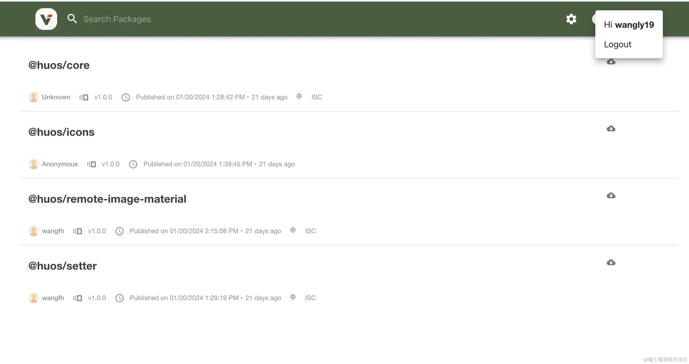
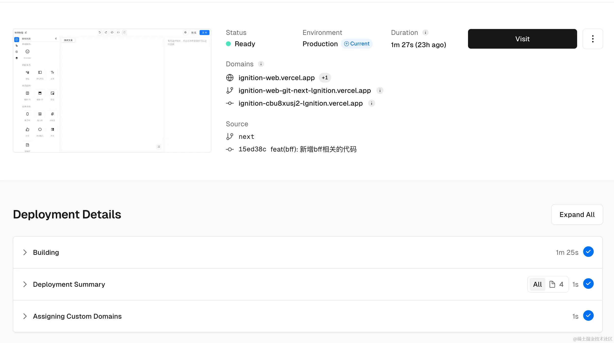
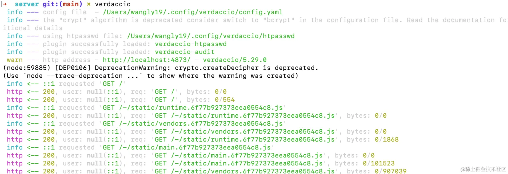
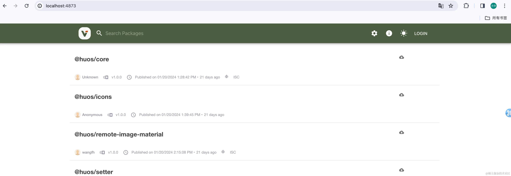
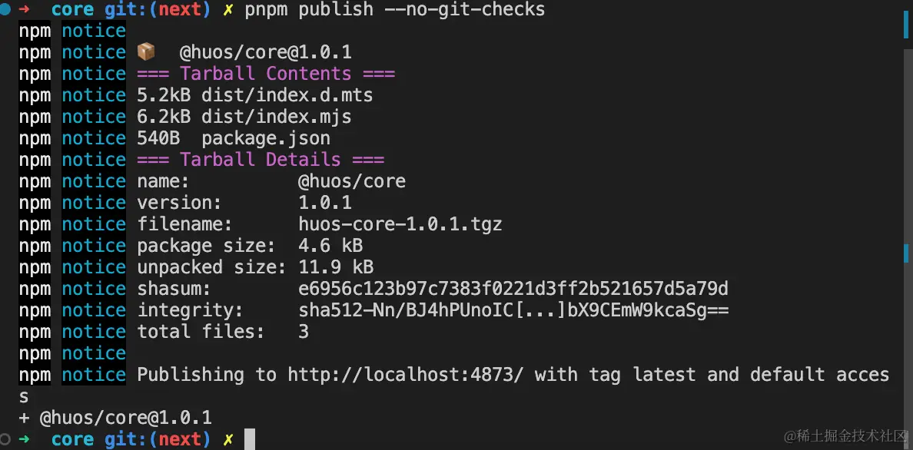
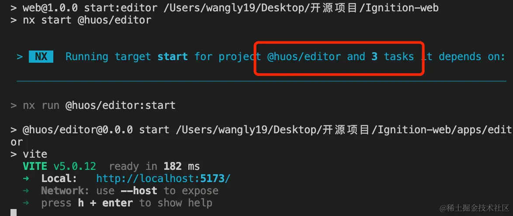
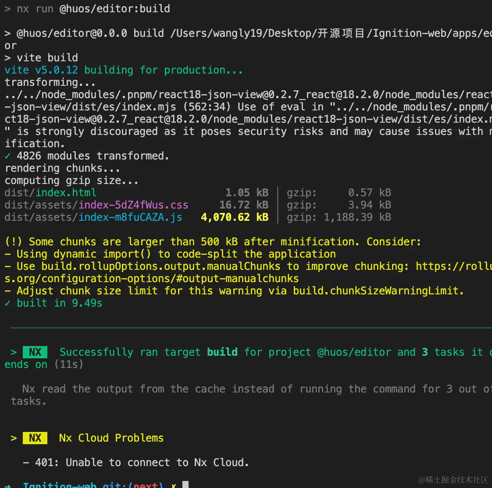
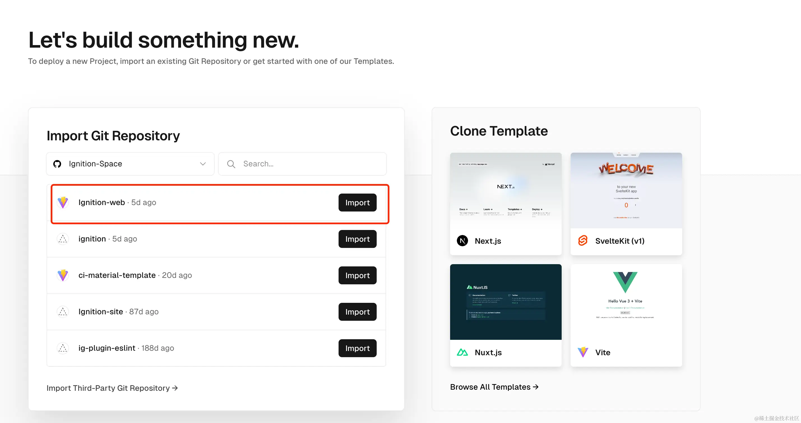
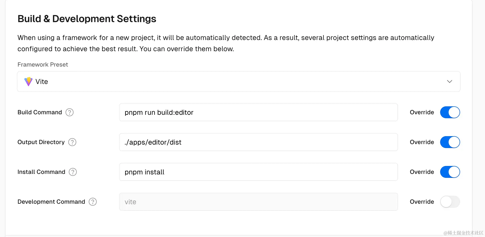
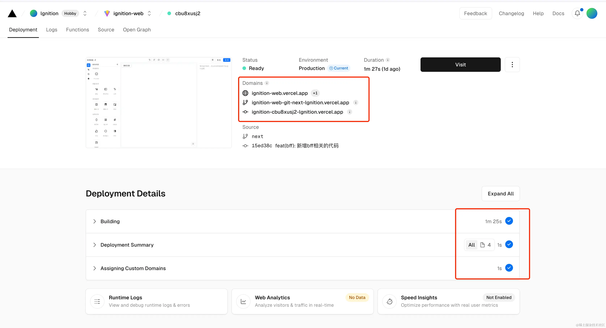

到此为止的话，我们的基础项目其实已经有一个基本的雏形了。接下来就是完成整个工程的构建和部署了，在本章节主要会将之前的内容进行发布和部署，相关的依赖包也会发布到内部的私有化**NPM**托管平台。

**Verdaccio** 是一个轻量级的、可自托管的 **npm 仓库管理器**。它允许您在本地环境中搭建**私有的 npm 仓库**，用于存储和发布自己的 **JavaScript包**，如下图所示：

在私有化的**npm**平台中，我发布了**packages**内相关的依赖包，其目的是为了让其能够被复用，主要目的是为提供远程物料构建**Devops**流程而准备的。



**Vercel** 是一个用于托管静态网站和部署 **Serverless** 函数的云平台。它提供了一个简单而强大的方式来构建、部署和扩展 **Web 应用程序**。我们可以**Vercel**来简单的配置我们的**Github Action**的发布流程。

如下图所示：

在**Vercel**中导入当前的代码仓库和部署分支，完成依赖安装和构建产物的路径后即可快速的来完成我们前端工程的部署。在这个环节需要配置好包管理器的依赖安装命令、当前目录的根路径、目标产物的地址、构建项目的命令、对应构建的分支等配置信息，在后面会仔细的介绍。



## 发布依赖

在这一小节中，会将整个**package**当中的通用依赖发布到内部私有平台当中。

整体的链路如下：


### 安装Verdaccio

**Verdaccio**的安装有以下几种

-   **Nodejs CLI**：**Verdaccio**本身也是一个集成依赖，可以通过**Nodejs**的包管理工具进行安装，如下代码所示，通过**npm**、**pnpm**、**yarn**等包管理工具可以直接安装**verdaccio**，后续通过**verdaccio** **cli**命令启动即可。

```
# 44.项目进阶：构建前端工程
npm install --location=global verdaccio

# yarn安装
yarn global add verdaccio

# ponpm 安装
pnpm install -g verdaccio

# shell 执行
verdaccio
```

-   **Docker**：通过**Docker Image**的方式进行安装，大多数情况下，默认配置就足够了，执行以下命令即可完成**Docker Image**的安装和启动。

```
# docker pull
docker pull verdaccio
# started
docker run -it --rm --name verdaccio -p 4873:4873 verdaccio/verdaccio
```

### 启动Verdaccio

使用**npm**安装的方式后，直接在sehll命令行执行全局**verdaccio**命令，此时就可以看到服务启动的日志信息了。

如下图所示：

根据对应的日志信息，在浏览器打开**4873**的端口地址，打开本地浏览器访问**http://localhost:4873**的时候，就能够在本地打开刚才安装的**Verdaccio**平台了。



如果你想后台常驻，可以全局安装使用pm2来完成启动，具体可以查阅**pm2**的相关文档，如下shell所示：

```
pm2 start verdaccio
```

### 添加用户

当启动**verdaccio**的时候，此时我们还没有账户，因此需要通过**npm**来添加一个用户账号，如下命令所示:

使用**npm addUser**命令指定**registry**可以为我们的私有平台添加一个用户，执行命令后会依次让你添加用户，密码和邮箱等用户信息，按照提示键入完成后，即可前往我们的私有平台登录。


```
➜  ~ npm adduser --registry http://localhost:4873/
npm notice Log in on http://localhost:4873/
Username: test
Email: (this IS public) xxxxxxxx@163.com
Logged in on http://localhost:4873/.
```

### 发布包

**npm**的发布流程很多同学应该都知道怎么操作，在这里推荐使用nrm来进行管理，具体的操作可以前往nrm的下载地址查看：<https://www.npmjs.com/package/nrm>。

```
# 安装nrm
npm install -g nrm

# 添加huos源
nrm add huos http://localhost:4873/

# 切换源
nrm use huos

# 完毕
```


在对应**packages**的包目录下依次执行如下命令：

```
# 构建
pnpm run build

# 发布

pnpm publish --no-git-checks
```

先执行构建命令，然后执行发布命令。当出现如下图所示的npm notice后表示当前的包发布成功。



如下图所示：

此时私有化平台的 **@huos/core**已经更新成为1.0.1版本，此时表明我们的包已经发布完成，后续就可以通过**npm install**进行使用。


需要注意的是，如果提示没有权限，此时需要执行**pnpm login**进行登录，登录的方式与**npm**平台相同，账号和密码是刚才使用**npm addUser**添加的用户信息。

## 构建前端

针对**monorepo**的构建之前也提到过了使用**tubro** + **pnpm workspace**的方式来进行的。但是在真实体验的过程中，我将其切换为了**nx**来进行管理。两者在使用层面上并没有太大的区别，配置方法几乎一摸一样，而且相互有提供转换配置的，**Nx**提供了项目管理、任务自动化、代码生成和依赖分析等功能更细致一些，因此我将**tubro**切换为了**nx**。

### 安装Nx

首先通过**pnpm**命令全局安装**Nx CLI**，如下代码所示：

```
pnpm add nx -wD
```

### 配置Nx

如下代码配置文件所示  
通过在根目录新建好**nx.json**文件，

```
{
  "targetDefaults": {
    "build": {
      "cache": true,
      "dependsOn": ["^build"]
    },
    "start": {
      "dependsOn": ["^build"]
    },
    "test": {
      "cache": true
    },
    "lint": {
      "cache": true
    }
  },
  "affected": {
    "defaultBase": "next"
  },
  "nxCloudAccessToken": "token******"
}
```

上面的配置文件，只需要注意**build**和**start**的**dependsOn**了，这个配置表示**nx**当前执行**start**和**build**命令时，会对他们依赖的本地包进行预构建。

```
"build": {
      "cache": true,
      "dependsOn": ["^build"]
    },
    "start": {
      "dependsOn": ["^build"]
    },
```

### Shell

创建**Nx**的配置文件后，接下来就是添加主工程的打包集命令了，如下图所示：

在主工程的**pakage.json**中添加以下**script**脚本命令。其中**start:editor**和**build:editor**就是当前启动和构建编辑器的命令，它们都是通过**Nx CLI**来执行的。

```
"scripts": {
    "build": "nx run-many -t build",
    "start:main": "nx start @huos/main",
    "start:editor": "nx start @huos/editor",
    "build:editor": "nx build @huos/editor",
    "graph": "nx graph"
  },
```


添加完成后，分别执行**start:editor**和**build:editor**看看是否可以启动和构建成功。如下图所示，分别执行启动和构建命令的输出结构，会发现都会将依赖的 **@huos/setter**和 **@huos/core**提前重新构建，以此来表示当前的依赖代码是最新的状态。





到此，整个**Nx**的构建就基本上结束了，此时可以看到执行构建命令完成后在**editor**目录下生成了**dist**的资源产物，接下来就可以通过构建部署平台将其进行部署。

## 部署前端

部署的阶段在这里我使用**Vercel**来进行演示，如果是自己的服务器直接使用服务器部署方案直接跟手操作即可。在前面提到过**Vercel**是一个免费的前端部署平台，使用起来也非常简单。

### 导入项目

在**Vercel**中选择添加一个新项目，如下图所示，点击图片中红色的部分。


创建新项目会跳转到下图的界面，如果使用的是**github**登录的话，可以直接选择现有的仓库直接导入，在这里我直接选择了[ignition-web](https://vercel.com/lgnition/ignition-web)项目直接导入。



### 构建配置

导入项目后，需要修改当前需要构建的相关配置。如下图所示：

-   修改**build command**命令为上一小节我们自己自定义的**pnpm run build:editor**，此时打包机的路径位于根目录。
-   修改**Output Directory**的路径为 **./apps/editor/dist**，这个路径是我们**editor**项目构建后的输出地址，因为当前处于根目录，因此需要将其定位到具体的产物目录当中去。
-   由于我们使用的**pnpm**，因此需要将**install command**修改为**pnpm install**，直接指定当前的包管理工具。



以上配置修改完成后，后续提交代码就会进行我们工程的构建，如下图所示：

构建完成后就会出现前端访问的地址，以及下面的**Deplpyment Details**的阶段都没有错误，此时就可以访问我们的前端工程路径了。



## 总结

本章节主要将前端工程相关的依赖和工程进行了部署，随着应用依赖的多元化，后续将会有更多的工程和项目依赖到通用包。在之前也有很多同学私信提问说如何部署，集成构建等相关问题，故此本章节将其从开发到构建的相关流程进行了梳理，从而帮助有需要开发构建部署的同学。

在这之前已经完成了最小化的业务流程，后续更多的时补充页面相关交互与服务端之间的联系，慢慢积累功能，以此来形成一个较为基础完善的平台，而构建前端工程是将其整个脉络理解清晰的前提。

目前整体架构为**Nx + pnpm + Vite**的模式，将初始化工程中的tubro进行平替，使用文档更全和社区更好的Nx来代替，后续有兴趣的同学也可以了解一下Nx相关的知识，如果能够更加深入的掌握Nx，未来使用monorepo作为项目管理的时候会更加的便捷。

## 资源

-   <https://verdaccio.org/>
-   [https://vercel.com](https://vercel.com/lgnition/ignition-web/7KYfjDnoaGokek3qJfBT52Kx2JKz)/
-   <https://www.npmjs.com/package/nrm>
-   <https://nx.dev/getting-started/intro>
-   <https://juejin.cn/post/7096701542408912933#heading-8>