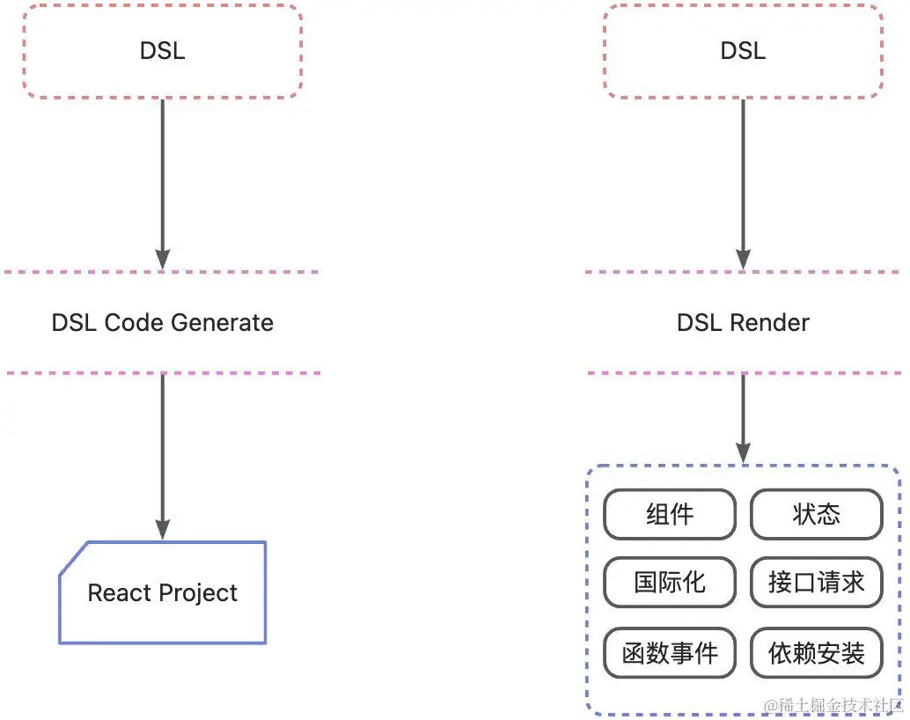
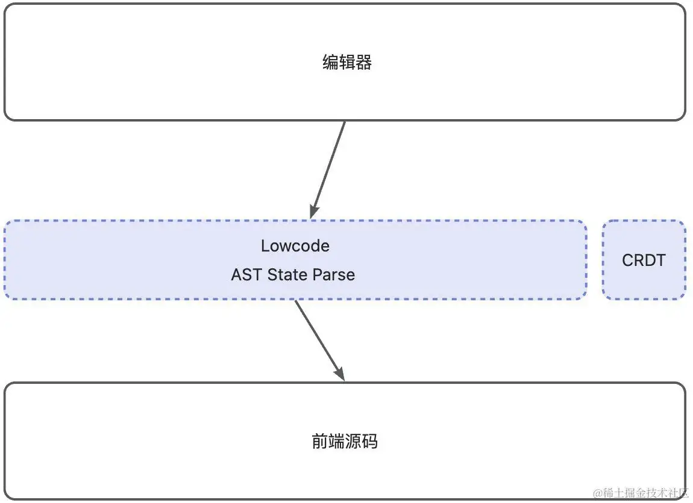

# 48.项目进阶：低代码与 AST

在之前的章节中，我们有提到过AST的方案的优势与劣势。在这一章节中会主要来梳理下一些相关知识背景的介绍和运用策略，也为后续协议升级做一点前置性的铺垫。

## 抽象语法树（AST）

AST是在计算机科学中用于表示编程语言代码结构的一种数据结构。它是将源代码的语法结构以树的形式进行组织。通过构建抽象语法树，编译器和解释器可以对代码进行静态分析、语法检查、优化和代码生成等操作。抽象语法树还可以用于编程工具中，例如代码编辑器、自动完成功能和重构工具，以提供更高级别的代码分析和操作。

前端中的垫片、代码压缩、注释生成文档、代码转换等能力的实现都离不开AST的理念，通过词法分析的形式操作AST，最终将其转换为期望的目标代码。

### 以Babel举例

Babel 是一个工具链，在前端开发的过程中通常都会使用它来让自己编写的JavaScript代码转换为向后兼容，社区中也有很多很多基于其开发的扩展插件。

如下流程图所示：

babel的操作过程就是将我们编写的代码通过词法、语法的解析生成中间层的数据结构与代码，在这个基础上进行标准化的操作后，最终将其生成为我们理想中的目标代码。

有兴趣了解的同学可以去学习相关的AST细节知识点，在这里仅仅去做一些简单的概述。

## 面向现在

目前而言，我们小册的工程是基于DSL的EditorState，没有办法直接来给应用提供useState相关的能力。因此，在小册前面设计了JSRuntmie相关的能力，通过统一配置解析HOC来实现运行时的参数模块能力。

如下图所示：

第一种是通过页面编辑器搭建的DSL私有化协议，使用DSL Code Generate 进行代码模板的生成，从而得到基于模板工程产生的React项目，从而实现私有化部署和二次开发。

第二种是运行时方案，通过页面编辑器搭建的DSL私有化协议，使用DSL Render来渲染协议中的组件、状态、国际化、接口请求、全局依赖、函数事件等内容，从而实现页面展示的效果，对此需要牺牲一定的性能来完成sdk的加载和前置操作的执行。

目前而言，大部分低代码平台都是基于私有化的DSL的协议来完成的，实现的思路整体并没有太多的差别，重点在于结合自身业务和产品的趋向性设计好自身的DSL。

## 面向未来

面向未来的低代码编辑器工作台，简单的DSL已经很难满足未来的编辑趋势。为了应对主流的趋势，协议的通用性是必然的。

通过AST语法树的协议，让编辑器与源代码直接形成接入。如下图所示

低代码编辑器通过可视化搭建能力来进行AST得解析操作。最终可以允许最终用户使用状态、存储、表达式等来进行页面的协作。

现如今，协作编辑是团队工作模式的必须品，而低代码平台在协同编辑与交互设计也需要保证整体系统的协议数据无冲突化。

因此在后面后一个无冲突复制数据类型，也就是CRDT做为规划。通过协同编辑的方式，能够让多人来在编辑器工作台中完成lowcode的开发，甚至是procode的开发。

## 对比

完整的页面构建器将允许最终用户本质上构建 UI 组件，就像开发人员编写 React 组件一样。从本质上讲，这意味着页面构建器将是一个具有 UI 抽象的代码编辑器。最终用户能够创建几乎与开发人员可以用代码编写的组件一样复杂的 UI 组件。

-   逆向：基于通用DSL协议生成的前端工程，很难将其逆向成为编辑器的通用协议，大多数情况下只能单向导出，而基于AST可以双向进行管理，极大程度上提高灵活度。
-   语义：每个低代码平台的DSL都不一致，多数情况下很难复用原有的组件资产，多数情况下都是通过中间层添加转换器的方式来渲染React组件，从而达到组件与物料的解耦，而AST协议能直达源码，可以减少很多无意义的开销
-   ProCode：AST协议在转代码的场景下具有天然的优势，本质上是基于JavaScript来抽象的数据结构，那么还原到代码自然水到渠成。

目前而言AST协议有很多优点，但是缺点也同样明显，不可忽视。在这里仅仅举例一些常见的场景，作为未来编辑器的形状，协议驱动的模式肯定会越来越完善。在后面小册工程的更新中，也会慢慢的去进行尝试。

## 总结

我们可以将AST是一个具有通用性质的低代码协议，现如今市面上大多数的协议都是自研自建，因此每个产品的协议都比较定制化，其原因主要在于每个产品的设计理念不一样，想要实现的功能模型也不一样，因此协议的定义草拟自然而然的天差地别。

现如今，小册平台的协议是基于craftjs为基础向上去抽象而成的，但是在未来随着更多基础sdk的实现，会不会变得更加复杂还不得而知，但是从目前的体量上来设计是完全能够满足使用的。随着网易Tango低代码引擎的发布，也看到了更多低代码和无代码平台的设计方案在慢慢发展。

## 资源

-   [网易云音乐 Tango 低代码引擎正式开源！](https://juejin.cn/post/7273051203562749971?searchId=202402041718469483D25CE0EDCA0DA969#heading-3)
-   [babeljs](https://babeljs.io/docs/usage)
-   [rekajs](https://reka.js.org/docs/introduction)
-   [Future of Craft.js - taking it to the next level! ](https://github.com/prevwong/craft.js/issues/507)