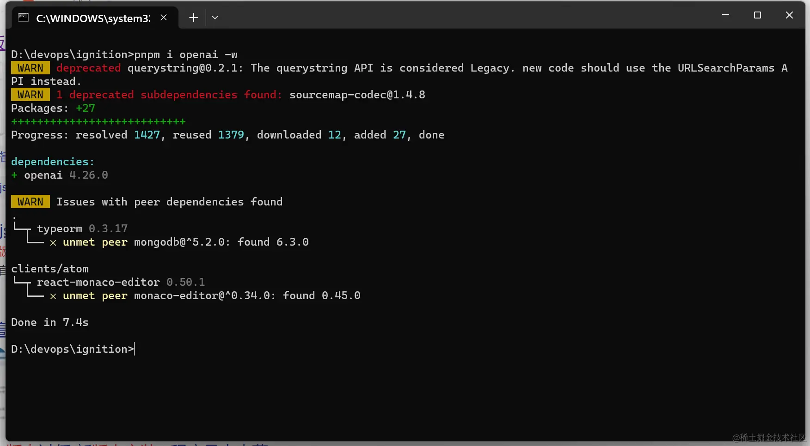
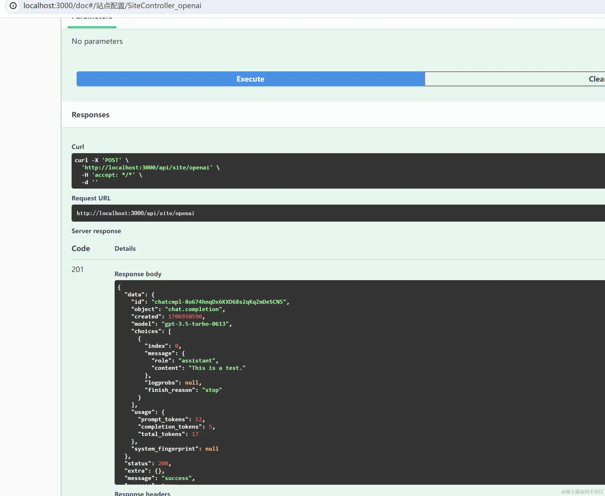
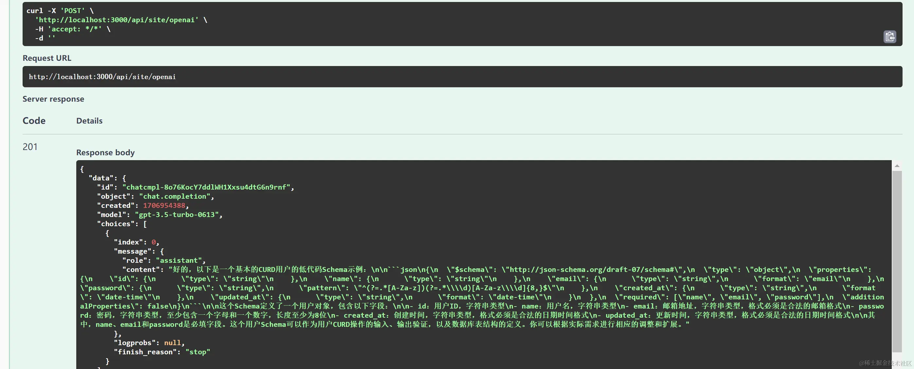
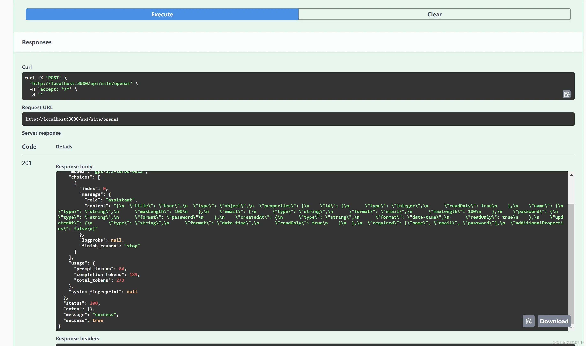
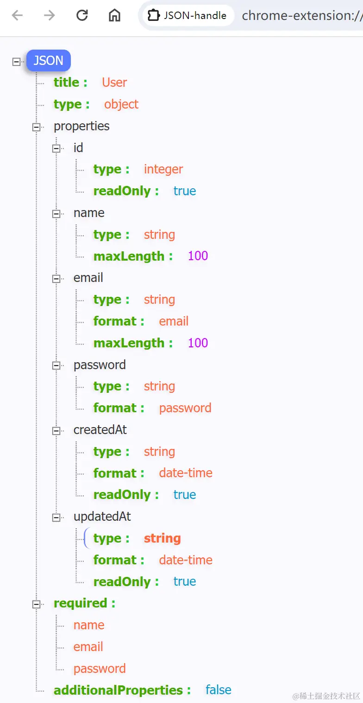

# 49.失败的 GPT 接入


去年的 **GPT** 横空出世以来，到现在大家伙也或者或少都一直接触过了 **GPT** 相关的产品，比如文生图、查询问题、机器人对话等等。

除此之外，还有各种编程插件也接入了 **GPT**，帮助我们来进行**单元测试**、**文档编写**、**辅助编程**等等各种开发场景，确实对研发效率有了质的提升同时对产品质量上也是很高的保障。

## 安装

接下里我们将使用比较常见的 **gpt-3.5** 来作为模型， 进行后续的测试。

首先安装 **openai** 的 **node** 包：

```shell
pnpm i openai
```



根据文档直接初始化调用即可：

```ts
@ApiOperation({
    summary: 'openai',
  })
  @Post('openai')
  async openai() {
    const openai = new OpenAI({
      apiKey: this.OPENAI_API_KEY,
    });
    console.log('openai===>', openai);
    const params: OpenAI.Chat.ChatCompletionCreateParams = {
      messages: [{ role: 'user', content: 'Say this is a test' }],
      model: 'gpt-3.5-turbo',
    };
    const chatCompletion: OpenAI.Chat.ChatCompletion =
      await openai.chat.completions.create(params);
    return chatCompletion;
  }
```

如下是 **GPT** 正常的返回值:



接下来我们需要对它进行一定的 **prompt** 矫正，拿到我们预期的结果。

## 调试

首先要了解一点，**大模型无记忆特性的**，也就意味着大部分的内容其实都是一次性的提示，除非你以及预先生成好了各种模板，否则你会发现得到的回答几乎给不了你很多帮助，这个跟你直接使用 **GPT** 的网页端的 **BOT** 并非一样，因为 **BOT** 已经帮你记录了一些上下文历史数据，但如果你去调用则需要自行维护这些内容。

#### 第一次调试

接下来，我们来了解一下上传参数中 **role** 的含义：
1. **System Role** 是指对模型的输入进行指定，以便模型在生成回复时具有特定的角色或身份，可以理解为预设模型作为一个具体方向的角色，避免模型自我发散；
2. **User Role** 用户消息一般是直接给到 **GPT** 的一些指令；
3. **Assistant Role** 作为 **GPT** 自己的响应，一般也可以不带。

所以，我们进行第一次的 **prompt** 的优化，可以从 **System Role** 进行：

> 接下来的内容都将只写 **prompt** 的修改

```
  messages: [
    {
      role: 'system',
      content: '你是一个低代码领域的专家，擅长进行各种Schema的编写',
    },
    { role: 'user', content: '帮我生成一个CURD用户的低代码Schema' },
  ],
```



如上图所示，它确实很棒，已经帮我们返回了一段标准关于用户 **CURD** 的低代码 **Schema**，但仅次并不能够直接使用，因为他的回复是一个自然语言，携带了非常多的其他的内容，这些并不是能转成低代码程序能够直接使用的模块。

#### 继续调试

```
messages: [
    {
      role: 'system',
      content: '你是一个低代码领域的专家，擅长进行各种Schema的编写',
    },
    {
      role: 'system',
      content: '当你收到以JSON结尾的时候，只需要返回格式化好的Schmea',
    },
    {
      role: 'user',
      content: '帮我生成一个CURD用户的低代码Schema，以JSON结尾',
    },
],
```

请注意，我们新增加了一条 **prompt** `以JSON结尾`，当 **GPT** 接收到了带有这条信息结尾的时候，将直接返回它生成好的 **Schema**，无关的内容将会省略，这样方便我们直接拿到结果进行转换。



如上所示的返回值，我们将 `/n` 跟 `/"` 进行转换之后，可以得到一份正常的 **Json** 格式的 **Schmea**



但这还是远不能满足我们的需求，已经这个 **Schema** 并非是对应我们的低代码系统。

所以还需要更进一步的进行 **Prompt** 的优化，但我深深的思考了一下得出下面的一些结论：

#### 继续尝试

后续我进行了无数的尝试，为了生成足够准确的代码，喂了不少的数据模型，但最终得出来的内容虽然已经足够准确但还是需要进行人工进行校准，这就与我想要的完美结果有所差距。

而且无论是 **MFF** 的方案还是老王的低代码方案，前提都是以 **Schema** 为结果的驱动，特别在 **MFF** 方案中，我们借助了 **OPENAPI** 的规则来进行转换成低代码搭建的 **Schema**。

对于 **GPT** 来说，其实是在把一段已经**规则明确的内容**告诉它，然后再让它帮我重新组装成一套新的结构返回给我。

但实际上，对于已知规则的结构体来说，使用 **GPT** 就大材小用了，因为可以通过函数代码来完成转换，如同我们在搭建工程中提到的转换代码。

所有最后的完美结合居然是使用 **GPT** 将解析代码完善的更好，然后直接解析 **OPENAPI** 出结果。

当然这个结果并非是最满意的，但对于目前我们的低代码系统来说，确实是一个失败的接入，因为这本身就是面对一个开发提效且打算深入对应业务模型的通用性的产品。

## 写在最后

这一章本来是打算删除的，思索了很久还是决定写出来，毕竟一万个读者就有一万个哈姆雷特，而且我一直对 **GPT** 提高生产力报有非常的期望，这里也聊下我在尝试接入过程中遇到的一些问题，但这并不是我在否决 **GPT**，只是针对位于我们这个低代码的场景与解决方案上，它的帮助确实有限，没有想象中的那么高。

那么什么场景的低代码适合 **GPT** 的接入呢？

#### 面向非开发的低代码使用者

显而易见的是，当你对实际开发过程不了解的情况下，**GPT** 可以协助讲**自然语言**转成系统语言，通过之前所说的转换处理就可以使用，但前提是将低代码所有的物料进行了一定的训练才可以。

这个训练过程比较复杂，但比较好的观望是在 GPT 的协助下文生代码与 D2C 的实现会更加精准。

#### 有系统级别流程编排的模块

在我所接触到的开发中，拿 **GPT** 来写 **SQL** 的人数占比挺高的，毕竟这块的逻辑更为通用且使用者一般也是具备一定的开发思维，给到的 **Prompt** 也是足够 **GPT** 生成对应的 **SQL**。

所以同时辅助业务流程编排，这对于 **SASS** 类型的产品来说，可以降低不少的对接流程，提供快更快更精准的服务。

后面会有视频辅助继续介绍如何利用 **GPT** 来协助编程。

**whatever** 新的一年还是 **All In AI** 依然是最好的选择。

虽然目前不是最好，但未来可期，时代不会主动抛弃前进的人，加油！

如果你有什么疑问，欢迎在评论区提出或者加群沟通。 👏
