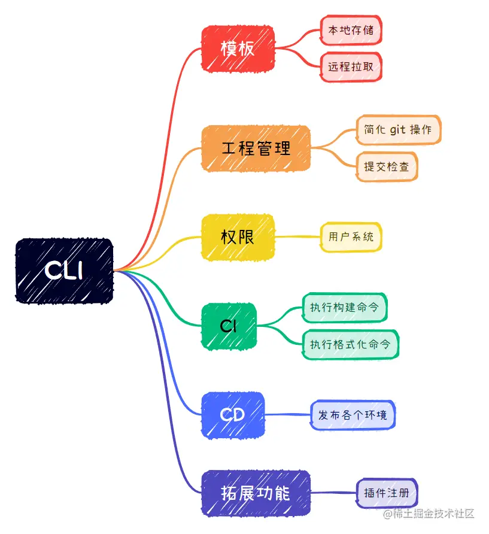
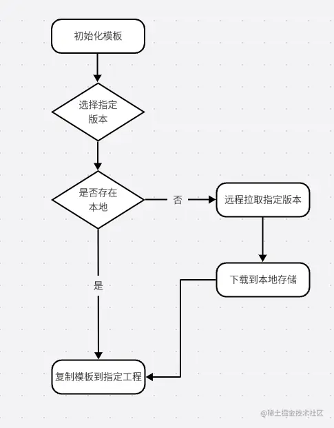
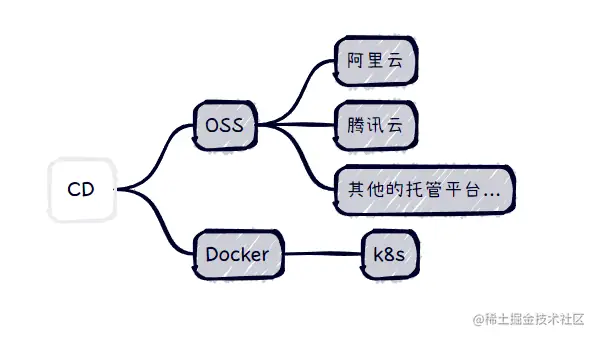
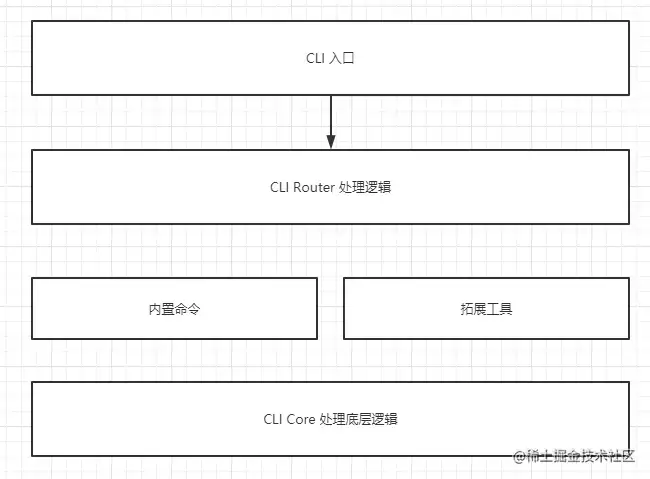
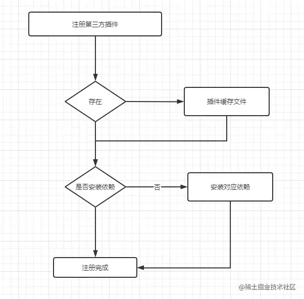

# 9.架构：CLI 设计

通常大部分的程序员会更加习惯使用 **CLI**（**Command-Line Interface** 命令行界面）来辅助开发业务，包括初始化、更新、构建、发布等功能，可以获得沉浸式一站的开发体验。

在之前有一篇[企业级 CLI 开发实战](https://juejin.cn/post/6982215543017193502)介绍过如何开发一款适用团队的 **CLI** 工具，基于团队规范可以将项目脚手架与 **CLI** 强制绑定在一起，约束开发者使用的开发语言以及开发规范，但是对于一款通用性的低代码产品，基于业务类型的物料开发经常会存在个性化的需求，强行将构建与 **CLI** 绑定则会使得 **CLI** 本身的逻辑变得更加复杂。

所以本次 **CLI** 的设计会更加较为通用，不再与单纯的业务开发耦合过多。




## 初始化工程/管理

由于物料会根据业务的不同存在不同的配置属性，每一次开发物料都需要拉取对应的业务模板，所以我们会面对种类非常以及多个版本的情况，以下是拉取模板的流程图：



**nodegit**、**download-git-repo** 和 **git-clone** 都是用于在 **Node.js** 环境中从远程 **Git** 仓库中下载代码的库，它们之间的主要区别如下：
- 功能：**nodegit** 是一个完整的 **Git** 库，提供了一套完整的 **Git API**，可以用于管理 **Git** 仓库、提交代码等操作。**download-git-repo** 和 **git-clone** 则是专门用于下载 **Git** 仓库中的代码的库。
- 依赖：**nodegit** 和 git-clone 都依赖于 **libgit2** 库，而 **download-git-repo** 则不依赖于任何第三方库。
- 使用方式：**nodegit** 和 **git-clone** 都是使用 **Git** 命令行工具来下载代码，而 **download-git-repo** 则是直接调用 **Git** 仓库的 **API** 来下载代码。


除了拉取模板之外，我们还会借助封装的 **CLI** 来管理工程，所以最终会选择 **nodegit** 进行二次封装，简化使用过程中 **Git** 操作的命令。

## 权限

使用 **Open Api** 与用户系统进行交互，通常情况下只有登录与鉴权两个模块。

#### 登录
- 一般都是登录之后将 **token** 缓存在本地，过期之后再重新授权。
- 如果嫌麻烦，也可以直接加密缓存用户名与密码，再过期之后自动调用登录接口维持登录态，这样可以让用户后期无感知使用。

#### 权限

为了保证项目使用的安全性，一般在每一次执行部署操作之前都需要进行权限判断，权限判断的方式也有如下两种：

- 每一次都直接调用接用户中心的权限接口判断，当然如果碰到网络延时的话，每一步的操作都很艰难。
- 为了减少网络延时可以在每个工程创建之后就预先缓存对应过程的权限信息，当权限不足进行权限申请，当审批通过后可以手动刷新权限数据或者设定缓存过期时间来定时拉取权限数据。

## 构建


由于新的 **CLI** 设计将不再与脚手架耦合，所以构建的具体配置将内置在脚手架中，例如：**Rollup**、**Webpack**、**Vite** 等。

**CLI** 将只接受**构建前、构建、构建后三种构建命令并执行**，通常情况下可以与脚手架约定俗成比如：
- `npm run pre` 构建前执行脚本
- `npm run build` 构建脚本
- `npm run did` 构建完成之后执行脚本

或者使用配置文件自定义其他的运行命令：

```json
{
    "pre-build":"npm run pre",
    "build":"npm run build",
    "build-did":"npm run did"
}
```

> 除此之外，构建过程还需要区分各个环境并注入对应的环境变量，让实际工程构建的过程中根据环境变量选择不同的配置。


## 部署

一般前端服务的部署有如下几种：

1. **静态文件部署**：将前端应用程序打包成静态文件，并将这些文件上传到 **Web** 服务器或 **CDN** 上。用户在访问网站时，直接从 **Web** 服务器或 **CDN** 上获取静态文件，然后在浏览器中渲染。
2. **容器化部署**：使用容器技术，如 **Docker**，将前端应用程序打包成容器镜像，并在生产环境中部署这些镜像。这种方式可以提高部署的可重复性和可移植性，并且可以更方便地进行版本管理。
3. **云平台部署**：将前端应用程序部署到云平台上，如阿里云、**AWS**等。这种方式可以提供更好的可扩展性和可靠性，并且可以根据需要自动扩展服务器资源。
4. **私有部署**：将前端应用程序的代码发布到生产环境[**私有服务器**]中，然后在生产环境中使用类似 **Nginx** 或 **Apache** 的 **Web** 服务器来运行和管理应用程序。

一般来说，纯前端的项目直接使用静态文件部署即可，所以我们的 **CLI** 需要内置一些 **OSS** 的工具函数，方便将资源上传到对应的 **OSS** 服务。

非纯前端的项目建议走 **Docker** 发布，配合 **k8s** 的可以更方便的伸缩扩容，同时配合启动环境变量注入，使得多环境中代码可以保持一致，减少错误。

> 无论是哪种模式都需要针对不同的平台进行适配，比如不同服务商的 **OSS** 工具以及不同 **k8s** 平台等，虽然一般的小团队不会有很多的选择性，直接内置在 CLI 中也问题不大，但作为通用性的工具，我们在开发过程这一会设计成拓展插件，减少用户的接入成本。



## 自定义插件

除了上述一些基础服务之外，**CLI** 还应该具备拓展插件的能力，使之功能更加完善，例如上一步骤中部署到各个环境的工具类就可以以对应的拓展插件提供。

**CLI** 需要先对命令进行分析判断是基础命令还是拓展服务，所以需要一个类似 **Router** 的主入口，包含内置与第三方插件的命令，在用户输入命令之后，调用不同的插件，流程图如下所示：



对于主 **CLI** 来说，很难接受规范不一致的三方插件注册，这样会影响 **CLI** 的结构，所以我们需要对 **CLI** 插件的模板做一个约束，除了输出的格式与上述内置插件格式保持一致之外，我们还需要对插件名称、依赖等等做一个约束，并且提供各种 **Hook** 方便插件开发，可以参考 **Webpack** 的 **tapable** 实现。

对于 `@Ignition/cli` 来说，将只接受 `@Ignition/cli-plugin-***` 命名格式的插件进来。这种规则可以根据团队的命名规范来约定，并不是唯一规范。

所以在添加插件的时候需要做两次校验，第一层校验是通过校验名字，第二层是安装依赖，如果依赖安装失败也不会添加成功。



> 在之前工程化里面有对自定义插件有一些实战的介绍，有想先试试的同学可以先参考[前端工程化实战 - 自定义 CLI 插件开发](https://juejin.cn/post/7004967490790883365)玩起来，后期出实战篇的时候，会比之前的更加详细。

## 注意

以上 **CLI** 所有的操作都是基于开发者的本地环境进行操作，与云上 **CI/CD** 不同，在开发者本地进行构建部署是依赖本地的环境，大部分的时候都存在分支管理、依赖不同步的问题。

为了避免构建代码遗失以及环境不一致的问题，我们需要根据下述流程来约束：


> 当然 **CLI** 可以不做本地构建，而是触发远程构建命令直接走云上构建，将结果实时反馈到本地，虽然会更加可靠，但是开发工作量也就相对增加了，如果有能力我建议选择云上构建。

## 额外拓展

避免有些同学对文章开头所说的 **CLI** 与脚手架剥离有误会，这里对这两者进行一些简单的介绍。

首先 **CLI** 和脚手架都是**可以**用于快速生成项目代码的工具，但它们的作用和功能略有不同：

- **CLI** 是一个命令行界面工具，可以用来执行一系列命令，完成各种操作，如代码构建、打包、测试等，也可以用来管理项目依赖、配置文件等。同时 **CLI** 可以非常灵活地适应不同的项目需求，可以通过编写插件和扩展来实现更多的功能。
- 脚手架（**Scaffolding**）是一个用于生成项目代码的工具，通常包含了项目的基本结构、依赖、配置等信息，可以帮助开发者快速创建一个新项目，并提供一些基础设施和工具，如构建工具、测试框架、代码风格检查等。减少开发者的重复工作，提高开发效率，同时也可以保证项目的一致性和可维护性。

综上所述，虽然 **CLI** 和脚手架都具备快速初始化项目的能力，但 **CLI** 更加灵活，可以根据具体需求来执行各种任务，而脚手架则更加专注于项目结构和基础设施的搭建。

> 将脚手架的能力从 **CLI** 分离之后，为了拓展性更好、更规范的话，通常会创建一个基础的脚手架，以此脚手架再拓展各个业务模板，但想节约工作量或者各个业务需求的差异化更大的话，可以直接根据不同的模板定制脚手架就好。

## 写在最后

如果你有什么疑问或者更好的建议，欢迎在评论区提出或者加群沟通。 👏
