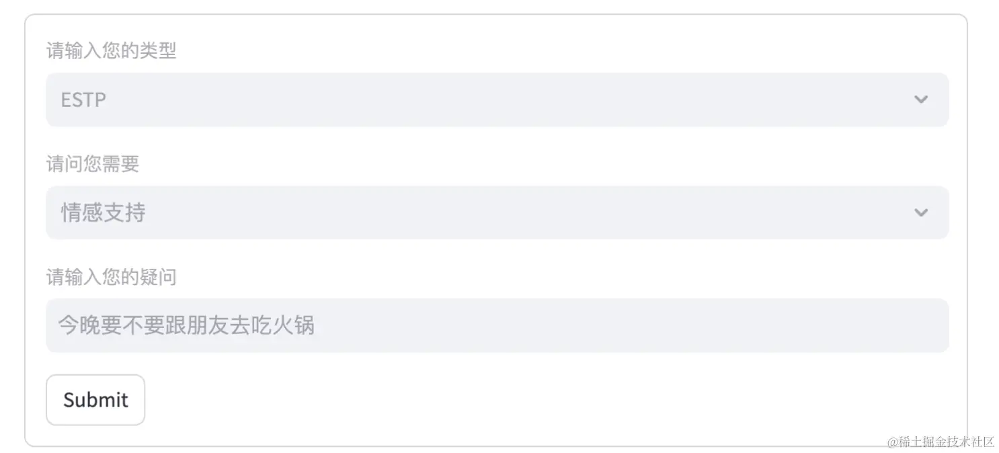

# 22-新交互范式：用 LLM_UI 实现 MBTI chat bot

> 本章对应源代码：https://github.com/RealKai42/langchainjs-juejin/tree/main/node/mbti

从这一章开始，我们进入实战模块。

其实，从前面模块的 RAG 中，我们已经介绍了一个 RAG chat bot，如何构建并本地存储向量数据库、如何本地存储聊天记录、如何部署成 stream API。在 Agents 模块，我们也讲解了如何使用 tools 进行数据标签和信息提取，如何使用 RunnableBranch 构建复杂 chain，如何将 agents 应用在工程中 等等。  
非常实战的应用，这些也都是目前 LLM 常见的工程应用，掌握了这些知识，大家就可以尝试把自己一些关于 LLM 的想法去应用在实战中，去探索应用层的各种机会和场景。

所以，在实战模块，我本计划像正常的实战一样，带大家做几个类似于

- chat with Wikipedia （web loader + RAG， 可能是最常见的 llm app demo，常见程度不亚于前端届的 todo app）
- 如何对超长文本进行总结 （稍微复杂一点的 LCEL chain，认真学完基础知识的大家都能写出来）

但我会觉得，llm 是一个方兴未艾的领域，有太多的新东西、新想法值得去玩，与其他领域不同，对大多数人来说，我们都很难在 llm 的底层去做文章，这需要大量的知识和资源。

而对应用层工程师来说，基于目前强大的基础模型，我们有太多有趣的 idea 经过不复杂的 prompt + 少量的 LCEL 代码就可以实现，这是应用层的真正价值。基础模型一直在飞速发展，很多之前无法想象的任务，现在都可以非常容易实现，但看看我们身边的 app，大多依旧是传统的样子，我们有太多的机会去使用 llm 去做点新的时间，有太多的机会去改变一些固有的习惯。  
对用户来说，他并不关心你底层应用了多少复杂和高深的技术，他只关心这个 app 是否有用，以及能不能在下一秒就可以用到。

所以，实战篇，不如我们换一种思路，我带大家去实现一些有趣的东西，去探索一下在大模型时代，我们能做哪些之前想象不到的事情，希望能给大家一些启发，也期待大家会喜欢。

## 新交互范式

交互范式，即我们应该如何与计算机进行交互。在最初是 CLI，也就是通过命令行进行交互，后来有了 GUI，也就是图形化的交互页面。我们目前的交互方式，无论是 鼠标、键盘、触摸还是语音输入，本质上都是图形化交互页面。即使是语音输入，只是改变了我们输入的方式，我们依旧需要用 手指/鼠标 去点图形化的界面。

并且，我个人认为，之前的交互更底层的一个点，就是我们的交互都是“确定性的”。例如我们需要用户填写一个问卷，我们需要确定性的去设计流程，即使有分叉，也需要提前对每个分叉进行设计。

对产品设计来说，我们需要考虑用户使用产品的每个细节，就想象各种 edge case，保证用户整体流程的体验。但就像我们去 环球影城/迪士尼一样，普通票就是自己在里面瞎转，想吃什么需要去看地图，想玩什么要看地图。真正爽的体验是，我们雇一个管家，我们有任何需求直接告诉他，他会根据自己的知识、手上的地图、手机里最新的资料，回答我们的问题，或者给我们安排 专业人员/专业设备 去解决问题。也就是，这个管家自己可以解决一些基础问题，但更核心的是，作为理解用户需求的入口，用自然语言跟人类沟通，如果人类描述不清还可以慢慢引导人类说出自己的需求（事实上，大部分人都说不清自己的需求），多次对话收集到足够的信息后，再找到 专业人员/专业设备，把自己总结的人类需求告诉对应的人，解决人类的问题。

大家感受到了么，这就是我说的新交互范式，我们不再是用 鼠标/手指 点点点，而是通过自然语言告诉 llm 我们需求，他去理解并引导我们提供足够的信息，然后调用对应的 函数/借口 去解决问题。

我们接下来就去写一个基于此范式的 demo，我相信大家会被最后的效果演示所震撼到。

## MBTI chat bot

背景：  
MBTI 可是太火了，这种性格测试是非常多人相信的，除了追求共鸣，和对自己更深刻的认识外，也有很多人是想希望针对自己的性格提供一些解决方案。

那我们就可以做一个 MBTI 的 chatbot，让用户输入自己的 MBTI 类型和问题，然后由 LLM 根据这个性格去解答问题。  
但我们不是使用传统的 GUI，而是让 LLM 去询问用户的 MBTI 和问题，多次对话，直到 LLM 认为收集到了足够的参数后，再调用对应的函数去回答用户的问题。

那让我们先定义一个简单的，根据 MBTI 类型和问题回答用户的 chain：

```js
const prompt = ChatPromptTemplate.fromMessages([
  [
    "system",
    "你是一个共情能力非常强的心理医生，并且很了解MBTI（迈尔斯-布里格斯性格类型指标)的各种人格类型，你的任务是根据来访者的 MBTI 和问题，给出针对性的情感支持，你的回答要富有感情、有深度和充足的情感支持，引导来访者乐观积极面对问题",
  ],
  ["human", "用户的 MBTI 类型是{type}, 这个类型的特点是{info}, 他的问题是{question}"],
]);

const model = new ChatOpenAI();
const mbtiChain = RunnableSequence.from([prompt, model, new StringOutputParser()]);
```

这里就是非常简单的 chat chain，除了告诉 llm MBTI 相关的信息外，我还是给 llm 设定了 “引导来访者乐观积极面对问题” 这样的倾向性的 prompt，引导 prompt 的回答风格。

这个 chain 需要的参数是：

- `type`：用户的 MBTI 类型
- `info`：对应 MBTI 的类型的特点描述。对于这种由固定答案的信息，不要让 llm 自己生成，而且由我们提供确定性的信息。
- `question`：用户的问题

然后，我们根据此去定义一个自定义的 tool：

```js
const mbtiTool = new DynamicStructuredTool({
  name: "get-mbti-chat",
  schema: z.object({
    type: z.enum(mbtiList).describe("用户的 MBTI 类型"),
    question: z.string().describe("用户的问题"),
  }),
  func: async ({ type, question }) => {
    const info = mbtiInfo[type];

    const res = await mbtiChain.invoke({ type, question, info });
    return res;
  },
  description: "根据用户的问题和 MBTI 类型，回答用户的问题",
});
```

其中，`mbtiList` 就是穷举所有 MBTI 的类型。 `mbtiInfo` 是从外部 json 中加载出来的，以 mbti 类型为 key 对性格描述的 object。  
这里我们把 type 和 question 定义为我们函数 schema 的必填的参数，方便 llm 对我们函数的理解。

然后，我们根据此去创建一个 agents：

```js
const tools = [mbtiTool];

const agentPrompt = await ChatPromptTemplate.fromMessages([
  [
    "system",
    "你是一个用户接待的 agent，通过自然语言询问用户的 MBTI 类型和问题，直到你有足够的信息调用 get-mbti-chat 来回答用户的问题",
  ],
  new MessagesPlaceholder("history_message"),
  ["human", "{input}"],
  new MessagesPlaceholder("agent_scratchpad"),
]);

const llm = new ChatOpenAI({
  temperature: 0.4,
});
const agent = await createOpenAIToolsAgent({
  llm,
  tools,
  prompt: agentPrompt,
});

const agentExecutor = new AgentExecutor({
  agent,
  tools,
});
```

这里为了演示，我们只给 agents 添加了这一个 tool，并且在 system prompt 中强化了对 `get-mbti-chat` 的调用的指示。  
如果是在工程中，也不要加太多的 tool，可以采用我们前面介绍的 Route/RunnableBranch 等方案，由路由去引导用户到对应的专业 agents 去处理。

然后，我们给这个 agents 添加 history，这里为了演示使用了唯一的 history 和 内存 history。大家可以根据需求，参考我们前面的章节使用可以持久化在文件的 chat history 解决方案。

```js
const messageHistory = new ChatMessageHistory();

const agentWithChatHistory = new RunnableWithMessageHistory({
  runnable: agentExecutor,
  getMessageHistory: () => messageHistory,
  inputMessagesKey: "input",
  historyMessagesKey: "history_message",
});
```

然后，我们使用 nodejs 的 readline 内置库，迅速构建一个可以在 cli 中使用的 chat bot，方便我们进行测试：

```js
const rl = readline.createInterface({
  input: process.stdin,
  output: process.stdout,
});

function chat() {
  rl.question("User: ", async (input) => {
    if (input.toLowerCase() === "exit") {
      rl.close();
      return;
    }

    const response = await agentWithChatHistory.invoke(
      {
        input,
      },
      {
        configurable: {
          sessionId: "no-used",
        },
      }
    );

    console.log("Agent: ", response.output);

    chat();
  });
}

console.log("请输入问题。 输入 exit 退出聊天。");
chat();
```

目前这个 demo 用到的所有知识，都是我们前面章节中介绍过的。

我相信跟着写到现在的朋友，都会觉得这只是一个普通的 llm agents 罢了，下面我们去尝试使用一下，感受 llm 神奇的能力。

运行该脚本，然后会输出：

```
请输入问题。 输入 exit 退出聊天。
```

然后，我们作为极度顽皮的用户，我们故意输入不符合函数调用的内容，让 llm 去引导我们：

```
User: 我应该做点啥?
Agent:  当然，我很乐意帮助你。但是，我需要更多的信息才能给出最佳建议。你可以告诉我你的 MBTI 类型吗？这将帮助我更好地理解你的个性和偏好。
```

我们去模拟小白用户，不知道自己的 MBTI 类型

```
User: 我也不知道我的类型,我是偏内向和没有计划的
```

然后，llm 会根据自己对 MBTI 的理解和用户的信息，去一步步引导用户：

```
Agent:  了解了，你的描述可能对应于几种 MBTI 类型。你是否喜欢深入思考和理解事物，还是更倾向于实际操作和
直观理解？你在做决定时更依赖逻辑分析还是情感和价值观？这些信息可以帮助我更准确地确定你的 MBTI 类型。

User: 我希望深入思考和实际操作 逻辑分析

Agent:  根据你的描述，你可能是 INTJ 或者 INTP 类型。这两种类型的人都是内向、直观、思考型的人，但主要
的区别在于 J 类型的人通常更喜欢有计划和结构，而 P 类型的人更喜欢灵活和开放。你刚才提到你没有计划，所以
我猜你可能是 INTP 类型。你是否认同这个判断？

User: 我应该是更加有计划和结构的吧

Agent:  好的，那么你可能是 INTJ 类型的人。让我们继续你的问题，你想要做些什么？你可以提供一些具体的上下
文吗？例如，你是在寻找新的职业道路，还是想找一些业余爱好？
```

注意，这整个交互的流程，都不是我们预先定义，也不是我们在 prompt 定义的。完全是 llm 根据用户的情况生成的逐步引导的流程。

相信到这里，大家已经体会到一点什么是下一代 LLM_UI。UI 是 User Interface 的缩写，不只局限于交互界面，可以是任何 Interface。

对比，mbti chat 最初的设计：



我相信大家能感受到，迪士尼的那个例子的意义。  
GUI 对用户要求很高，而且复杂的功能学习成本也高，需要用户熟悉某个应用界面，也经常会出现 “UI 一改版，用户就不会用了”。而 LLM_UI 就是将 LLM 看做推理和理解用户需求的引擎，然后根据需求去调用由其他系统的接口，或者是更专业的 agnets 去帮助用户解决问题。

同时，llm 把对不确定性的处理能力引入到了 app 中。在传统的编程中，我们需要控制用户的输入方式、输入顺序和输入格式等，而在 llm 里，这些都不受限制。由 llm 支撑的基于语义理解推理引擎，可以用自然语言一步步引导用户说出需求，也可以通过自己对任务理解创造流程来引导用户，这给我们应用打开了新的一扇窗，让更多 idea 有实现的可能性，大家可以尝试一下把自己现有的项目尝试用 LLM_UI 重新思考和实现一下。
