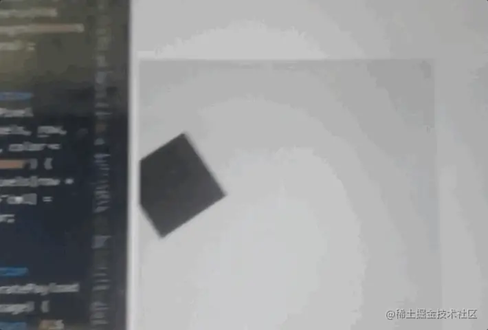
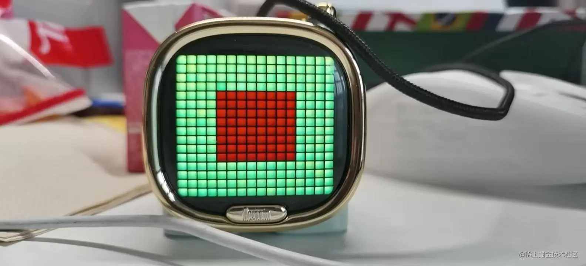

# 36 实战：使用第三方库及在 Node 下运行 .md

在前面的课程里，我们已经对 Divoom 设备进行了简单的封装，提供了关联的 Canvas 来进行绘图。

有同学可能会有疑问，为什么我们要这么设计，采用关联 Canvas 的方式，而不用其他的方式来设计我们的绘图对象，接下来我会给出解释。

但在解答疑问之前，同学们应该也会直观地感受到这么封装带来的便捷性，我们可以不必关心背后的数据逻辑，只需要专注于操作 Canvas 进行绘图即可。

这么做有许多好处，首先我们仅仅关联了 Canvas 对象，用函数装饰器重新改写了 Canvas 对象上下文的`fill、 stroke、fillRect、strokeRect、fillText、strokeText、drawImage、clearRect`一系列方法。这是一种函数式编程的思想，它不改变原始的方法，但是在返回结果之前做出额外的动作，异步执行 update 方法，再在 update 方法中发送 HTTP 请求，把数据指令发送给 HTTP 服务，再由 HTTP 服务把数据发送给蓝牙服务，让设备显示内容更新。

这样的设计，使得我们只需要专注于操作 Canvas 对象，而这个对象与其他的 Canvas 对象没有任何区别，这也就意味着我们可以比较方便地使用支持 Canvas 的第三方库来支持我们的内容展示。

例如，下面这段代码就是用[p5.js](https://p5js.org/)来绘制动画并上传到设备上：

```
const device = new Divoom();
device.setUpdateLatency(100);
const ctx = device.getContext();
​
let myContext;
function setup() {
  myContext = createCanvas(320, 320).drawingContext;
}
​
function draw() {
  background(220);
  let time = millis();
  translate(width / 2, height / 2);
  rotate(time / 1000);
  rect(50,50,80,80);
  fill(50);
  ctx.drawImage(myContext.canvas, 0, 0, 16, 16);
}
```

完整的代码示例[在这里](https://code.juejin.cn/pen/7220233350198329403)。

注意这里有个细节，因为动画执行需要频繁绘制并发送数据，为了保证性能，我们可以适当降低发送给设备的帧率，例如降低到 10 祯每秒，也就是 100 毫秒发送一次数据。这样我们修改一下具体的类，增加一个`setUpdateLatency`方法：

```
class Divoom {
  constructor() {
    this._canvas = new OffscreenCanvas(16, 16);
    this._updateDelay = 0;
  }
​
  setUpdateLatency(latency = 0) {
    this._updateDelay = latency;
  }
​
  getContext() {
    if(this._ctx) return this._ctx;
    const ctx = this._canvas.getContext('2d', {willReadFrequently: true});
    const {fill, stroke, fillRect, strokeRect, fillText, strokeText, drawImage, clearRect} = ctx;
    [fill, stroke, fillRect, strokeRect, fillText, strokeText, drawImage, clearRect].forEach((fn) => {
      ctx[fn.name] = async (...rest) => {
        fn.apply(ctx, rest);
        return await this.forceUpdate();
      };
    });
    return ctx;
  }
​
  forceUpdate() {
    this._needsUpdate = true;
    if(!this._updatePromise) {
      this._updatePromise = new Promise((resolve) => {
        if(this._updateDelay <= 0 && typeof requestAnimationFrame === 'function') {
          requestAnimationFrame(() => {
            this._updatePromise = null;
            this.update();
            resolve();
          });
        } else {
          setTimeout(() => {
            this._updatePromise = null;
            this.update();
            resolve();
          }, this._updateDelay);
        }
      });
    }
    return this._updatePromise;
  }
​
  transferCanvasData() {
    const ctx = this.getContext();
    const imageData = ctx.getImageData(0, 0, 16, 16);
    const data = imageData.data;
    const pixels = [];
​
    for(let i = 0; i < 256; i++) {
      const index = i * 4;
      pixels[i] = number2HexString(data[index])
        + number2HexString(data[index + 1])
        + number2HexString(data[index + 2]);
    }
    return pixels;
  }
​
  async update() {
    const pixels = this.transferCanvasData();
    await sendMessage(generateImageData(pixels));
  }
}
```

这里我们对 forceUpdate 方法进行修改，如果有`_updateDelay`参数，那么使用 setTimeout 降低更新的频率，否则使用 requestAnimationFrame。最终的效果如下：



其次，这个客户端也可以不运行在浏览器上，只要做一个非常简单的处理，我们就可以使用 Node.js 来运行这个客户端，从而快速检验以及自动化地测试我们的代码。

我们来看一下 Node.js 下怎么运行我们的客户端。

首先，我们可以安装 [node-canvas](https://github.com/Automattic/node-canvas) 或者 [node-canvas-webgl](https://github.com/akira-cn/node-canvas-webgl)。这里我们安装`node-canvas-webgl`这个库。

```
npm i node-canvas-webgl --save
```

然后我们封装一个 Node 版的 Divoom 对象。其实也很简单，首先我们适配一下 Canvas 对象，因为我们用的是 OffscreenCanvas，只需要两行代码：

```
import {Canvas} from 'node-canvas-webgl';
global.OffscreenCanvas = Canvas;
```

接着我们继承一个`Divoom`类，叫做`DivoomNode`。注意，在 Node 环境里运行，我们直接连蓝牙服务就可以了，不需要启动 HTTP 服务，因此我们重写 send 方法即可，完整代码如下：

```
import {Canvas} from 'node-canvas-webgl';
import {Divoom} from '../src/divoom/divoom.js';
import {TimeboxEvoMessage} from '../src/divoom/message.js';
​
global.OffscreenCanvas = Canvas;
​
export class DivoomNode extends Divoom {
  constructor({bluetooth, width = 16, height = 16} = {}) {
    super({width, height});
    this._bluetooth = bluetooth;
  }
​
  async send(message) {
    const payload = new TimeboxEvoMessage(message).message;
​
    // eslint-disable-next-line no-return-await
    return await this._bluetooth.writeMessage(payload);
  }
}
```

这样，我们就可以在 Node.js 环境里实现操作 Divoom 设备，示例代码如下：

```
import {DivoomNode} from './divoom-node.js';
import {Bluetooth} from '../server/bluetooth/bluetooth.js';
​
const config = {
  deviceMAC: '11:75:58:CE:DB:2F',
  maxConnectAttempts: 3,
  connectionAttemptDelay: 500,
  connectionTimeout: 10000,
};
​
(async function () {
  const bluetooth = new Bluetooth(config);
  await bluetooth.connect();
​
  const pixoo = new DivoomNode({bluetooth});
​
  const isConnected = await pixoo.isConnected();
​
  console.log(isConnected, pixoo.canvas);
  const ctx = pixoo.canvas.getContext('2d');
  ctx.fillStyle = 'yellow';
  ctx.fillRect(0, 0, 16, 16);
  ctx.fillStyle = 'red';
  ctx.fillRect(4, 4, 8, 8);
​
  await pixoo.forceUpdate();
​
  await bluetooth.disconnect();
​
  console.log('disconnected');
}());
```

最终在终端运行上面的 Node 代码，结果如下：



其实经过这么设计，我们的服务和客户端代码天然能够支持跨端的能力，它以 Canvas API 为基础，能够在 Web 和 Node.js 环境中运行，甚至如果我们愿意，简单适配一下就可以让它运行在小程序或者 Android 端的环境中。

最后，我们可以使用 Jest 框架或者其他单元测试框架，测试服务和客户端代码。因为无论是我们的辅助函数还是 Divoom 类的代码都非常简单，所以对它们进行测试并不是一件很困难的事情，大家可以参照第 26 章的内容自己动手试一试，这里只提供基本思路。

首先是对于`generatePayload`和它依赖的那些编码函数，都是单一功能的函数，直接用输入数据测试即可。注意，如果可以的话，适当保证测试集充分完整。

另外对于 Divoom 类，它的 API 多数和 Canvas 绘制有关系，因为直接通过函数装饰器进行改写，实际上几乎不用测试接口的功能，只需要测试数据更新能正常被 update，并被发送给 HTTP 以及蓝牙服务即可，这也非常简单。而对于图片生成正确性，由于依赖底层 Canvas 对象，我们几乎可以不用测试，但如果要谨慎一些，我们可以通过 Canvas 对象拿到图片的 DataURI（一串 base64 编码的图像数据），将正确的数据保存下来，这样我们后续修改代码时就可以运行测试集，把新的图片 DataURI 和原始保存的数据进行回归测试比较，从而保证新功能确实没有产生未知 Bug 导致绘图结果出错。

## 小结和课程总结

这一节的内容比较简单，我们讨论了蓝牙设备客户端使用第三方库以及在 Node.js 环境运行的可能性，由此发现借助我们的设计达到所期待的效果非常简单。最后，可以引入 Jest 框架来帮助我们执行单元测试。当然如果你愿意的话，也可以配置集成环境和引入代码品质管理，这样将使我们的项目变得更好。

实际上，这个实战项目是一个真实的项目，它的完整代码我放在[这个代码仓库](https://github.com/xitu/jcode-bluetooth)里。为了便于大家理解，我抽取了比较核心的部分，省略了一些细节，所以你们可能看到的具体代码和讲解中的例子有一定的出入，如果有任何问题，欢迎在留言区讨论，或者给这个项目提 issue。我个人非常欢迎大家一起参与开源项目，把项目变得更好，同时大家也能一起成长，这是一种有效的学习手段。

最后，感谢大家能够学习到这里，我们的课程已经来到了尾声，本来最后一部分我想和大家讨论些更复杂的项目，但是思考了很久以后，还是决定写一个比较综合的，涉及软硬件、多端和跨平台的，同时又不会太过复杂的例子，免得令大家迷失在细节中。我知道有人会觉得收获满满，也有人会觉得内容太浅，毕竟一本小册很难满足所有人的诉求，但我只希望通过这本小册循序渐进，让大家更多熟悉 Node.js，且进一步了解 JavaScript 的魅力。

回过头来，我想再聊聊这本小册。

在小册的第一部分，也就是前四节基础和后来的六节文章生成器，我想让大家通过一个趣味的例子来学习和理解 Node.js 的基本用法。这里面我没有介绍太多 API 的使用，因为我觉得那些具体用法大家去看文档就能很容易了解，**而且学习如何使用 API 从来不是我们的目的，记住 API 用法也不能让你的前端能力变得更强，真正有用的反而是在设计工具中的思想和算法**，比如实现随机但又能保证不会连续重复的算法，以及`createRandomPicker`这样的函数式编程思想。学会这些，才能够让你的 JavaScript 能力得到锻炼和提升。

在小册的第二部分，我们从 0 开始，一步步实现了一个完整的 HTTP 服务器，以及最终实现拦截器洋葱模型的框架，让你能够真正理解 HTTP 服务，以及为什么 Express 和 KOA 选择这样的架构。虽然，我们没有讲更多服务端的知识，比如处理高并发、操作数据库等等，但因为侧重的是前端的“全栈”，所以 HTTP 协议和服务架构更加重要，理解它们，能够让你更好地理解数据的传输和处理，更好地在项目中与后端工程师配合，而不是（也不可能）完全取代后端的工作。

在小册的第三部分，我们介绍工程化相关的工具，这块一直是前端发展比较快的领域，也是很多同学的焦虑点，但实际上，这些问题的本质是大型项目需要更强大的效率和管理工具，我们不必去担心学习这些工具会不会过时的问题，而应该更好地理解这些工具对应的是解决什么问题，去了解这些工具为什么有用，而不是纠结于该怎么使用。在未来，随着前端领域的扩大，这类工具还是会层出不穷，而且我们也将有机会成为一些工具的创造者，给前端领域带来更多有趣的新思想。

最后，在小册的第四部分，我们通过一个综合的服务端（蓝牙和 HTTP 服务）、前端（包括浏览器和硬件终端）实战项目，来给我们的学习做了一个收尾。这个项目并不是特别复杂，而且它也没有用到很多复杂的工程工具，它是一个工具库。一般来说工具库通常是中等复杂度的项目，要比大型平台更简单一些，但这个简单是相对于规模来说，而不是相对技术难度。作为工具库，虽然我们不需要考虑用户系统、登录验证、安全和数据格式校验、路由管理等等问题，但也需要考虑服务的层级、客户端的封装和设计等较复杂的问题。在这部分内容中，我希望你学习并掌握如何一个人完成这类中等复杂度的项目，我也期待你能将课程中学到的知识运用于你平时的工作实践中。

到这里，我们的课程就全部结束了。接下来，这本小册不会再有定期的更新，但我也希望大家能够就课程内容进一步讨论，有任何问题都可以随时提出。如果我认为有些点值得展开讨论，我会再通过“加餐”的方式给大家更多的帮助。

再次感谢大家，祝大家工作顺利，快乐成长！