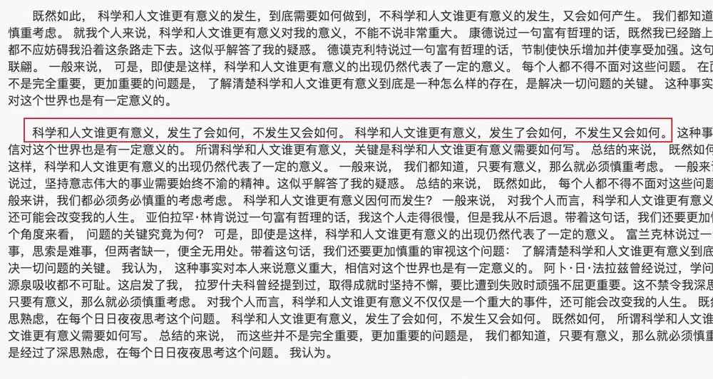

# 7 文章生成器：如何实现随机模块？

上一节课，我们介绍了如何使用 fs 模块读取语料库文件（corpus/data.json）。这一节课，我们将学习如何创建随机模块，从语料库文件中随机选择内容。

我们知道，语料库中的数据是基础语料内容。生成文章时，我们需要读取这些内容，从中随机选择一些句子进行拼接，所以我们需要实现一个能够**随机选取内容的模块**。

这个模块，我们命名为`random.js`。这个模块有两个方法：`randomInt`和`randomPick`。`randomInt`方法是返回一定范围内的整数，用来控制随机生成的文章和段落的长度范围。

实现`randomInt`原理很简单，我们只需要用`Math.random()`对 min 和 max 两个参数进行**线性插值**，然后将结果向下取整即可，所以这个函数的实现如下：

```js
// randomInt 函数返回一个大于等于 min，小于 max 的随机整数
export function randomInt(min, max) {
  const p = Math.random();
  return Math.floor(min * (1 - p) + max * p);
}
```

有了这个函数我们就能设置文章和段落的随机长度了，比如：

```js
const articleLength = randomInt(3000, 5000); //设置文章长度介于3000~5000字

const sectionLength = randomInt(200, 500); // 设置段落长度介于200到500字
```

<!-- 除了这个函数外，我们还要实现一个从数组中随机选择元素的函数，叫做`randomPick`。 -->
`randomPick`方法可以从数组中随机选择元素。

我们的`data.json`是如下格式：

```json
{
  "title": [
    "一天掉多少根头发",
    "中午吃什么",
    "学生会退会",
    "好好学习",
    "生活的意义",
    "科学和人文谁更有意义",
    "熬夜一时爽"
  ],
  "famous":[
    ...
```

`data.json`每个属性都是一个数组，我们需要从中选择合适的内容。比如：

```js
const corpus = JSON.parse(data);

const title = randomPick(corpus.title); // 随机选一个title

... 生成文章

const famous = randomPick(corpus.famous); //随机选一句名人名言

...
```

这个函数的基本实现也不难，我们随机一个数组下标，选出元素即可：

```js
export function randomInt(min, max) {
  ...
}

// 随机选出数组中的一个元素
export function randomPick(arr) {
  const index = randomInt(0, arr.length);
  return arr[index];
}
```

但是这么做会产生一个问题，如果我们用上面的随机选取算法，从语料库中选择句子组成文章，很有可能恰好两次选出来同一个句子。这样文章的文字就会重复，显得很奇怪，也是我们不希望看到的。



那为了避免产生这种情况，我们需要对算法进行改进。

我们很容易就能想到，**既然有可能两次恰好选到同一个元素，那就先判断一下，如果“不幸”选择了和上一次一样的内容，重新选一次不就行了**。

```js
let lastPicked = null;
function randomPick(arr) {
  let picked = null;
  do {
    const index = randomInt(0, arr.length);
    picked = arr[index];
  } while(picked === lastPicked);
  lastPicked = picked;
  return picked;
}
```

在上面的代码中，我们加了一个变量 lastPicked 来记录上一次选择的结果，然后通过 while 进行循环，每次获取之后，判断一下 picked 是否与 lastPicked 相同。如果相同，则循环继续，再次一获取内容，直到内容不重复为止。

这么做当然是可以的，不过还是会有两个问题：

- 我们要额外用一个变量 lastPicked 来保存上一次选过的状态；
- 如果选择重复，要重新选，等于变相增加了选取次数。

虽然说在语料样本很大的情况下，连续选择重复的概率很小，但这样实现还是感觉不够优雅。实际上我们可以改进一下这个算法，用一个小技巧来避免连续两次选择到同样的元素：

```js
export function randomPick(arr) {
  const len = arr.length - 1;
  const index = randomInt(0, len);
  [arr[index], arr[len]] = [arr[len], arr[index]];
  return arr[index];
}
```

在上面的代码中，我们将随机取数的范围从数组长度更改为数组长度减一，这样我们就不会取到数组最后一位的元素。然后我们把每次取到的元素都和数组最后一位的元素进行交换，这样每次取过的元素下一次就在数组最后一位了，下一次也就不能取到它了，而下一次取到的数又会将它换出来，那么再一次就又能取到它了。

这样我们就解决了上面说到的两个问题，但是现在这个版本又会产生两个新的问题：

- 初始在数组末位的那个元素，第一次肯定不会被取到，破坏了随机性；
- 每次取完内容有个交换数组元素的操作，改变了数组本身，如果我们要用这个数组做其他操作，就可能会影响到别的操作的结果。

要解决这两个问题也有很多方法，我们这里选择用**过程抽象的方法**把它改成一个高阶函数 `createRandomPicker`。

```js
export function createRandomPicker(arr) {
  arr = [...arr]; // copy 数组，以免修改原始数据
  function randomPick() {
    const len = arr.length - 1;
    const index = randomInt(0, len);
    const picked = arr[index];
    [arr[index], arr[len]] = [arr[len], arr[index]];
    return picked;
  }
  randomPick(); // 抛弃第一次选择结果
  return randomPick;
}
```

如上面代码所示，createRandomPicker 根据传入的数组返回一个 randomPick 函数。在这里面，我们操作的是数组的副本而不是数组本身，这样就不会改变原数组。另外，我们取随机元素的时候，抛弃掉第一次选取的结果，这样就可以避免原本数组末位的那个元素在第一次随机取时永远取不到的问题。

用高阶函数的方式还有一个重要原因是，我们的语料库只需要在初始化时加载一次，而随机语料的获取操作要进行许多次。那么我们直接用高阶函数在 createRandomPicker 的时候，通过函数闭包将语料库的数组绑定到返回的 randomPick 过程里，就不用在每次随机获取的时候都传入数组参数了，使用上更方便。

举个例子，假设我们要取十段名人名言，用前面版本的方法，我们要在调用时每次都传 corpus.famous：

```js
for(let i = 0; i < 10; i++) {
  randomPick(corpus.famous);
}
```

如果用高阶函数，我们只需要对 corpus.famous 传入一次就可以了。这样使用上更方便，也更不容易出错。

```js
const randomPickFamous = createRandomPick(corpus.famous);

for(let i = 0; i < 10; i++) {
  randomPickFamous();
}
```

到上面为止，我们就实现了`random.js`模块，提供两个方法`randomInt`和`createRandomPick`。完整的代码如下：

```js
export function randomInt(min = 0, max = 100) {
  const p = Math.random();
  return Math.floor(min * (1 - p) + max * p);
}

export function createRandomPicker(arr) {
  arr = [...arr]; // copy 数组，以免修改原始数据
  function randomPick() {
    const len = arr.length - 1;
    const index = randomInt(0, len);
    const picked = arr[index];
    [arr[index], arr[len]] = [arr[len], arr[index]];
    return picked;
  }
  randomPick(); // 抛弃第一次选择结果
  return randomPick;
}
```

## 总结

这一节课，我们实现了随机模块`random.js`，我们要记住它的两个公共 API：

1. `randomInt`返回一定范围内的整数，用来控制随机生成的文章和段落的长度范围；

2. `randomPick`函数能够从语料库的数组中随机地选择元素，并返回。

下一节课，我们就使用这个随机模块生成我们的随机文章。
