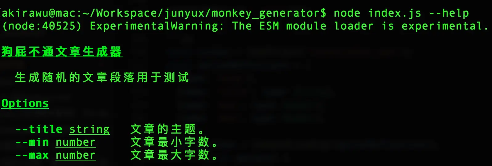

# 9 文章生成器：如何用 process 实现带参命令？

在上一节课，我们完成了文章生成和保存的功能，但是我们现在还不能自定义文章的标题，也不能配置文章的字数。那在这一节课，我们就来学习通过命令行交互配置标题和字数，自由生成我们想要的文章。

## 使用 process.argv 传参

在第 1 节课里，我们已经见过使用 process.argv 传参的例子。这里我们依然可以使用这个老办法，不过现在不只传一个参数，而是要传入多个参数，所以要比第 1 节课的使用复杂一些。我们先自定义几个参数：

```bash
--title 标题 ： 表示传入的主题
--min 最小字数： 表示文章最小字数，默认值6000
--max 最大字数： 表示文章最大字数，默认值10000
```

我们可以通过将 process.argv 数组遍历出来的方式获取参数：

```js
function parseOptions(options = {}) {
  const argv = process.argv;
  for(let i = 2; i < argv.length; i++) {
    const cmd = argv[i - 1];
    const value = argv[i];
    if(cmd === '--title') {
      options.title = value;
    } else if(cmd === '--min') {
      options.min = Number(value);
    } else if(cmd === '--max') {
      options.max = Number(value);
    }
  }
  return options;
}
```

上面的代码，依次判断`process.argv`的值，如果我们先读取到`--title`，那么它后面紧跟着的参数即是我们要的文章主题。同样，我们读取到`--min`和`--max`，那么将它们后面的参数作为最小字数/最大字数取出。

这样，我们就可以读取命令行中的参数了，然后稍微改一下调用方式：

```js
const corpus = loadCorpus('corpus/data.json');
const options = parseOptions();
const title = options.title || createRandomPicker(corpus.title)();
const article = generate(title, {corpus, ...options});
const output = saveToFile(title, article);

console.log(`生成成功！文章保存于：${output}`);
```

这样就可以选择标题、控制字数了。虽然我们完成了功能，却并不完美，因为这样做不能控制用户输入的错误。如果我们传入一个未定义的参数，或者参数重复，程序都不会报错。比如下面的命令行：

```bash
$ node index.js --min 100 --min 200 --foo bar --title
```

### 检查用户输入

因为 Node.js 内置的 process 模块无法方便地检查用户的输入，所以我们需要使用三方库 [command-line-args ](https://github.com/75lb/command-line-args) 替代 process.argv，它不仅能获得用户的输入，还能检测用户的输入是否正确。

首先，我们在项目中安装这个包：

```bash
$ npm install command-line-args --save
```

然后，通过如下操作引入这个模块。

```js
import commandLineArgs from 'command-line-args';
```

其中，`command-line-args`是基于配置的，我们可以配置要传的参数：

```js
// 配置我们的命令行参数
const optionDefinitions = [
  {name: 'title', alias: 't', type: String},
  {name: 'min', type: Number},
  {name: 'max', type: Number},
];
const options = commandLineArgs(optionDefinitions); // 获取命令行的输入
```

然后，将我们的`index.js`修改如下：

```js
const corpus = loadCorpus('corpus/data.json');
const optionDefinitions = [
  {name: 'title', type: String},
  {name: 'min', type: Number},
  {name: 'max', type: Number},
];
const options = commandLineArgs(optionDefinitions);
const title = options.title || createRandomPicker(corpus.title)();
const article = generate(title, {corpus, ...options});
const output = saveToFile(title, article);

console.log(`生成成功！文章保存于：${output}`);
```

这样，如果我们传入重复的参数或者传入错误的参数，命令行都会报错：

```bash
$ node index.js --foo bar

UNKNOWN_OPTION: Unknown option: --foo
    at commandLineArgs (/Users/akirawu/Workspace/junyux/monkey_generator/node_modules/command-line-args/dist/index.js:1347:21)
    at file:///Users/akirawu/Workspace/junyux/monkey_generator/index.js:38:17
    at ModuleJob.run (internal/modules/esm/module_job.js:110:37)
    at async Loader.import (internal/modules/esm/loader.js:167:24) {
  name: 'UNKNOWN_OPTION',
  optionName: '--foo'
```

如上面代码所示，因为 --foo 不是合法的参数，所以控制台报错。

为了让我们的应用更加友好，我们还可以添加一个`--help`参数，告知用户有哪些合法的参数以及每个参数的意义。这个功能可以通过第三方库 [command-line-usage](https://github.com/75lb/command-line-usage) 来完成。

同样，我们先安装 command-line-usage 包：

```bash
$ npm install command-line-usage --save
```

然后，我们使用它定义 help 输出的内容，这是一份 JSON 配置：

```js
import commandLineUsage from 'command-line-usage';

// 定义帮助的内容
const sections = [
  {
    header: '狗屁不通文章生成器',
    content: '生成随机的文章段落用于测试',
  },
  {
    header: 'Options',
    optionList: [
      {
        name: 'title',
        typeLabel: '{underline string}',
        description: '文章的主题。',
      },
      {
        name: 'min',
        typeLabel: '{underline number}',
        description: '文章最小字数。',
      },
      {
        name: 'max',
        typeLabel: '{underline number}',
        description: '文章最大字数。',
      },
    ],
  },
];
const usage = commandLineUsage(sections); // 生成帮助文本
```

然后，我们在`command-line-args`中添加一下`--help`命令的配置：

```js
const corpus = loadCorpus('corpus/data.json');
const optionDefinitions = [
  {name: 'help'}, // help命令配置
  {name: 'title', type: String},
  {name: 'min', type: Number},
  {name: 'max', type: Number},
];
const options = commandLineArgs(optionDefinitions);
if('help' in options) { // 如果输入的是help，就打印帮助文本
  console.log(usage);
} else {
  const title = options.title || createRandomPicker(corpus.title)();
  const article = generate(title, {corpus, ...options});
  const output = saveCorpus(title, article);

  console.log(`生成成功！文章保存于：${output}`);
}
```

我们判断命令中如果有`--help`那么就打印使用帮助，否则就输出文章。那么运行`node index.js --help`实际效果如下图所示：



现在，我们命令行交互就全部完成了。

## 规划模块

现在来看，index.js 文件的内容有点多，功能上也比较杂，有加载文件和保存文件，有命令行配置、接收和判断，有生成文章功能等等。这显然不符合良好的程序设计，所以我们打算按照功能，重新规划我们的模块。

第一步，将加载和保存文件功能（即：loadCorpus和saveCorpus）统一放置在`./lib/corpus.js`模块中：

```js
// lib/corpus.js
import {readFileSync, writeFileSync, existsSync, mkdirSync} from 'fs';
import {fileURLToPath} from 'url';
import {dirname, resolve} from 'path';
import moment from 'moment';

const __dirname = dirname(fileURLToPath(import.meta.url));

export function loadCorpus(src) {
  const path = resolve(__dirname, '..', src);
  const data = readFileSync(path, {encoding: 'utf-8'});
  return JSON.parse(data);
}

export function saveCorpus(title, article) {
  const outputDir = resolve(__dirname, '..', 'output');
  const time = moment().format('|YYYY-MM-DD|HH:mm:ss');
  const outputFile = resolve(outputDir, `${title}${time}.txt`);

  if(!existsSync(outputDir)) {
    mkdirSync(outputDir);
  }

  const text = `${title}\n\n    ${article.join('\n    ')}`;
  writeFileSync(outputFile, text);

  return outputFile;
}
```

注意，因为放到了 lib 目录下，path 与`corpus/data.json`的相对路径有了变换，所以 resolve 的时候要到父目录：`const path = resolve(__dirname, '..', src);`。

第二步，将与命令行相关的功能（即：commandLineArgs 和 commandLineUsage）归为`lib/cmd.js`模块。

```js
// lib/cmd.js
import commandLineArgs from 'command-line-args';
import commandLineUsage from 'command-line-usage';

const sections = [
  {
    header: '狗屁不通文章生成器',
    content: '生成随机的文章段落用于测试',
  },
  {
    header: 'Options',
    optionList: [
      {
        name: 'title',
        typeLabel: '{underline string}',
        description: '文章的主题。',
      },
      {
        name: 'min',
        typeLabel: '{underline number}',
        description: '文章最小字数。',
      },
      {
        name: 'max',
        typeLabel: '{underline number}',
        description: '文章最大字数。',
      },
    ],
  },
];

const usage = commandLineUsage(sections); 

const optionDefinitions = [
  {name: 'help'},
  {name: 'title', type: String},
  {name: 'min', type: Number},
  {name: 'max', type: Number},
];

const options = commandLineArgs(optionDefinitions);

if('help' in options) {
  console.log(usage);
  process.exit();
}

export {options};
```

注意，我们之前在`index.js`中通过 if 语句判断是否包含`--help`参数，如果包含，则输出帮助信息，否则生成文章。现在我们把这部分代码移到`cmd.js`模块中之后，就不需要在`index.js`中用 if 判断，可以在`cmd.js`模块中判断，如果存在`--help`参数，那么输出帮助信息后直接结束命令。

`process.exit()`表示终止程序。当用户输入 --help 后，为了阻止后续生成文章的代码运行，我们需要在这里手动的终止程序。在 Node.js 中结束命令行的运行，可以直接调用 process 模块的 exit 方法。

```js
process.exit();
```

最后，index.js 文件就变得简单清晰多了！

```js
import {options} from './lib/cmd.js';
import {loadCorpus, saveCorpus} from './lib/corpus.js';
import {generate} from './lib/generator.js';
import {createRandomPicker} from './lib/random.js';

const corpus = loadCorpus('corpus/data.json');
const title = options.title || createRandomPicker(corpus.title)();
const article = generate(title, {corpus, ...options});
const output = saveCorpus(title, article);

console.log(`生成成功！文章保存于：${output}`);
```

## 总结

这一节课，我们学习了如何使用 process 模块实现带参数的命令行交互。为了让程序能检查、控制用户输入是否正确，以及打印命令行帮助文本，我们还学习了两个第三方库 command-line-args 和 command-line-usage。

此外，我们还可以进一步改进代码：当我们不传任何命令参数的时候，让程序以用户互动的方式运行。下一节课，我们将介绍如何用 process.stdin 实现互动式交互。