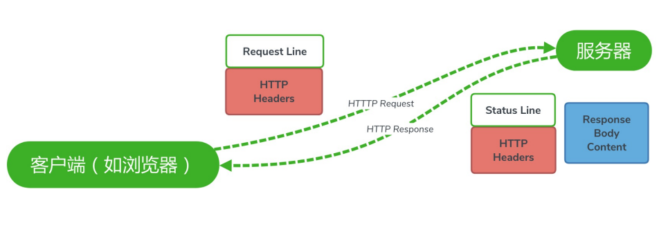
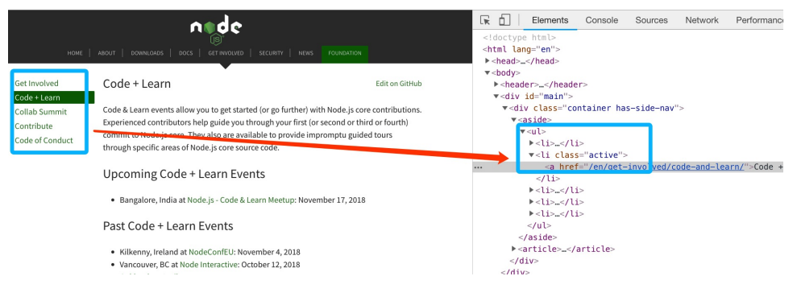
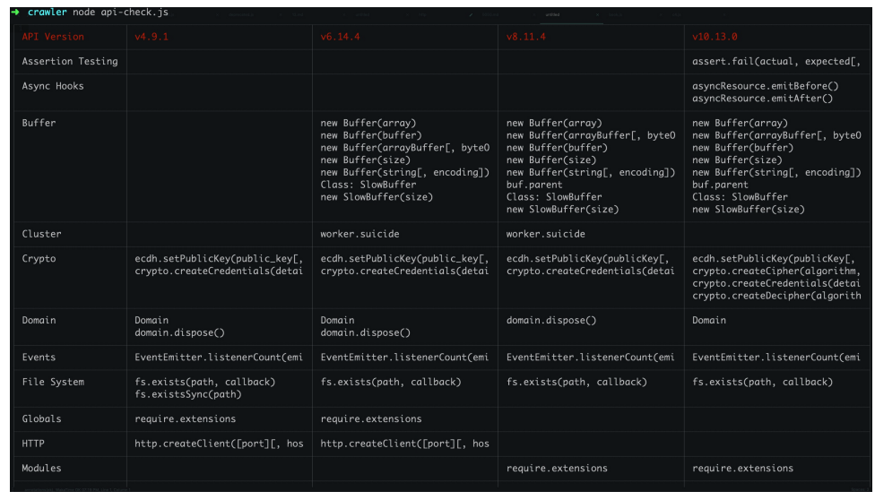

### 
# 10案例九： [实现 N 个 API[网页爬虫] Node 的 HTTP 处理 - 请求与响应

```!
本节目标：[各种手段请求爬取网页内容] 你请求，我应答，网络两头乐开花，Node 之所以成为服务器方案，离不开 HTTP 模块的能力之帆。
```



在 Node 里面，起一个 HTTP Server 非常简单，如官网示例：

```javascript
// 加载 http 模块
const http = require('http')
// 定义服务运行的主机名和端口号
const hostname = '127.0.0.1'
const port = 3000

// 通过 http.createServer 方法创建一个服务实例
// 同时传入回调函数，以接管后面进来的请求
// 后面请求进来时，这个回调函数会被调用执行，同时会拿到两个参数，分别是 req 和 res
// req 是可读流（通过 data 事件接收数据），res 是可写流（通过 write 写数据，end 结束输出）
const server = http.createServer((req, res) => {
  // 设置返回的状态码 200 表示成功
  res.statusCode = 200
  // 设置返回的请求头类型 text/plain 表示普通文本
  res.setHeader('Content-Type', 'text/plain')
  // 对响应写入内容后，关闭可写流
  res.end('Hello World\n')
})
// 调用实例的 listen 方法把服务正式启动
server.listen(port, hostname, () => {
  console.log(`Server running at http://${hostname}:${port}/`)
})
```

HTTP 作为整个互联网数据通信中几乎最主流的协议，它本身就是巨大的知识库，无论是工作 1 年还是 10 年的工程师，每一次重温 HTTP 的整体知识相信都会有很多收获，从 HTTP/1.1 到 HTTP/2，从 HTTP 到 HTTPS，从 TCP 的握手到 cookie/session 的状态保持...，我们在接触和 HTTP 的时候，一开始很容易被吓唬到，扎进去学习的时候也确实枯燥乏味，比较好的办法，就是在工作中不断的使用它，不断的练习，随着使用中的一点点深入，我们会对 HTTP 越来越熟悉。

那么这一节，我们就挑 HTTP 模块在 Node 中的几个应用知识来学习，以代码练习为主，主要学习 HTTP 模块在 Node 中的使用。

### 简单的 HTTP 头常识

一个请求，通常会建立在两个角色之间，一个是客户端，一个是服务端，而且两者的身份可以互换的，比如一台服务器 A 向 服务器 B 发请求，那么 A 就是客户端，B 是服务端，反过来身份就变了，甚至如果 A 这台服务器自己向自己发一个请求，那么 A 里面发请求的程序就是客户端，响应请求的程序就是服务端了，所以大家可以打开思路，不用局限在端的形态上面。

我们简单的看下一个请求从浏览器发出，以及服务器返回，它们的头信息，我们去实现爬虫的时候，有时候需要构造假的请求头，或者解析响应头，这在特定场景下会有一定的参考作用，比如打开掘金的首页，我们针对这个网页 HTML 的 GET 请求，简单学习它里面的头信息知识：


```
// 请求由 A 请求行、B 请求头组成
// A 请求行由 3 端组成，HTTP Verb/URL Path/HTTP Version
// 1. 标明请求方法是 GET，往往用作获取资源（图片、视频、文档等等）
// 2. /timeline 是请求的资源路径，由服务器来决定如何响应该地址
// 3. HTTP 协议版本是 1.1
GET /timeline HTTP/1.1
// B 如下都是请求头
// 去往哪个域名（服务器）去获取资源
Host: juejin.im
// 保持连接，避免连接重新建立，减少通信开销提高效率
Connection: keep-alive
// HTTP 1.0 时代产物，no-cache 禁用缓存
Pragma: no-cache
// HTTP 1.1 时代产物，与 Pragma 一样控制缓存行为
Cache-Control: no-cache
// 浏览器自动升级请求，告诉服务器后续会使用 HTTPS 协议请求
Upgrade-Insecure-Requests: 1
// 上报用户代理的版本信息
User-Agent: Mozilla/5.0 (Macintosh; Intel Mac OS X 10_14_1) AppleWebKit/537.36 (KHTML, like Gecko) Chrome/70.0.3538.102 Safari/537.36
// 声明接收哪种格式的数据内容
Accept: text/html,application/xhtml+xml,application/xml;q=0.9,image/webp,image/apng,*/*;q=0.8
// 声明所接受编码压缩的格式
Accept-Encoding: gzip, deflate, br
// 声明所接受的地区语言
Accept-Language: en-US,en;q=0.9,zh-CN;q=0.8,zh;q=0.7
// 捎带过去用户之前访问时候存储在客户端的 Cookie 信息，方便服务器识别记录
Cookie: gr_user_id=1fa5e8a7b7c90; _ga=GA1.2.787252639.1488193773; ab={}; _gat=1; gr_session_id_89669d96c88aefbc_a009fcc=true
...
```

当然还有 POST，HEAD, PUT, DELETE 等这些请求方法，他们甚至可以多传一些数据包，比如 POST 会多一个请求体，我们继续看下上面的这个请求头给到服务端，服务器返回的头是如何的：

```
// 整体上， response header 跟 request header 格式都是类似的
// 响应由 3 部分组成，A 响应行； B 响应头；C 响应体
// A 响应行依然是 HTTP 协议与响应状态码，200 是响应成功
HTTP/1.1 200 OK
// 响应的服务器类型
Server: nginx
// 当前响应的时间
Date: Wed, 21 Nov 2018 05:45:21 GMT
// 返回的数据类型，字符编码集
Content-Type: text/html; charset=utf-8
// 数据传输模式
Transfer-Encoding: chunked
// 保持连接
Connection: keep-alive
// HTTP 协议的内容协商，比如如何响应缓存
Vary: Accept-Encoding
// 内容安全策略，检测和削弱恶意共计，学问很深
Content-Security-Policy: default-src * blob: data:;script-src 'self' 'unsafe-eval' *.xitu.io *.juejin.im *.baidu.com *.google-analytics.com *.meiqia.com dn-growing.qbox.me *.growingio.com *.guard.qcloud.com *.gtimg.com;style-src 'self' 'unsafe-inline' *.xitu.io *.juejin.im  *.growingio.com *.guard.qcloud.com *.gtimg.com;
// 设置各种 Cookie 以及何时失效，这些 cookie 会存储在发出请求的客户端本地
Set-Cookie: ab={}; path=/; expires=Thu, 21 Nov 2019 05:45:21 GMT; secure; httponly
Set-Cookie: auth=eyJ0b2tlbiI6...; path=/; expires=Wed, 28 Nov 2018 05:45:21 GMT; secure; httponly
Set-Cookie: QINGCLOUDELB=165e4274d60907...; path=/; HttpOnly
// 控制该网页在浏览器的 frame 中展示，如果是 DENY 则同域名页面中也不允许嵌套
X-Frame-Options: SAMEORIGIN
// 控制预检请求的结果缓存时长
Access-Control-Max-Age: 86400
// 在规定时间内，网站请求都会重定向走 HTTPS 协议，也属于安全策略
Strict-Transport-Security: max-age=31536000
// 编码压缩格式的约定，gzip 是一种比较节省资源的压缩格式
Content-Encoding: gzip
// 告诉所有的缓存机制是否可以缓存及哪种类型
Cache-control: private
// 服务器输出的标识，不同服务器不同，可以从服务器上关闭不输出
X-Powered-By-Defense:  from pon-wyxm-tel-qs-qssec-kd55
```

关于头还有很多的知识大家可以自行学习，具体场景中我们甚至会定义自己特定业务域的请求头和响应头，我们继续回到 Node 的 HTTP 模块中。


### 向别的服务器请求数据 - http.get

我们在 Node 里面，向另外一台服务器发请求，这个请求可能是域名/IP，请求的内容也可能五花八门，那这个请求该怎么构造呢？

这时候可以使用简单 http.get/https.get 方法，比如我们去请求一个 [Node LTS JSON 文件](https://nodejs.org/dist/index.json)，从浏览器里直接打开就可以自动下载，在 Node 里面就可以这样做：

```javascript
// 加载 https 模块，https 的底层依然是 http
const https = require('https')
// 请求的目标资源
const url = 'https://nodejs.org/dist/index.json'
// 发起 GET 请求，回调函数中会拿到一个来自服务器的响应可读流 res
https.get(url, (res) => {
  // 声明一个 字符串
  let data = ''
  // 每次可读流数据搬运过来，都是一个 buffer 数据块，每次通过 data 事件触发
  res.on('data', (chunk) => {
    // 把所有的 buffer 都拼一起
    data += chunk
  })
  res.on('end', () => {
    // 等待可读流接收完毕，就拿到了完整的 buffer
    // 通过 toString 把 buffer 转成字符串打印出来
    console.log(data.toString())
  })
}).on('error', (e) => {
  console.log(e)
})
```

会拿到这样的一坨 JSON 字符串：

```
[{"version":"v11.2.0","date":"2018-11-15","files":..},...]
```

### 通过 Promise 包装一个 http.get 请求

上面的这个请求，比较简单也比较硬，是通过回调和事件的形式来完成数据的接收，一旦有多个存在依赖关系的异步请求，就会写着难受一点，如果想让这个代码更友好一些，我们可以这样做：

```javascript
const https = require('https')
const url = 'https://nodejs.org/dist/index.json'

// 声明一个普通函数，它接收 url 参数，执行后返回一个 Promise 实例
const request = (url) => {
  return new Promise((resolve, reject) => {
    https.get(url, (res) => {
      let data = ''
      res.on('data', (chunk) => {
        data += chunk
      })
      res.on('end', () => {
        // 通过 Promise 的 resolve 来回调结果
        resolve(data.toString())
      })
    }).on('error', (e) => {
      reject(e)
    })
  })
}
// 在执行时候，可以使用 .then() 方法来链式调用，避免回调嵌套
request(url)
  .then(data => {
    console.log(data)
  })
```

### 通过 async function 来替代请求的链式传递


上面有了 Promise 的封装后，我们可以直接用 async function 继续完善下这个 Promise，进一步避免 then 的回调包裹，比如改成这样子：

```javascript
const https = require('https')
const url = 'https://nodejs.org/dist/index.json'

// 改成一个 async 异步函数
const request = async (url) => {
  return new Promise((resolve, reject) => {
    https.get(url, (res) => {
      let data = ''
      res.on('data', (chunk) => {
        data += chunk
      })
      res.on('end', () => {
        resolve(data.toString())
      })
    }).on('error', (e) => {
      reject(e)
    })
  })
}

// 声明一个异步函数，await 和 async 要配对使用
async function run () {
  // 以同步的方式来写异步逻辑
  const data = await request(url)
  console.log(data)
}

// run 方法执行后本身也是一个 Promise，可以通过 then 链式调用
run()
```

写法稍微改了一下，整个调用链就清晰了很多，而且 async function 的执行性能也要比 Promise 好的。

### 通过三方库 axios/request 来替代 http.get

以上都是用原生的 API 来直接实现，优点是不依赖三方库，拿到的响应就是天然的 Stream 流，那么一点点不方便的地方是，它回调中的响应 res 是 http.ClientRequest 流对象，需要自己监听 data 事件来手动组装 bufer 块，甚至还需要自己解析 JSON 数据格式，处理解析异常等，另外还不能原生支持 Promise，需要自己包装。在实际的工作场景中，我们为了开发效率，会考虑不深入这么底层的细节，直接采用三方库，比如 request/axios 等，我们通过 request 来实现一下：

```
// 首先 npm i request
const request = require('request')
const url = 'https://nodejs.org/dist/index.json'

// 直接通过 request 提供的 get 方法发起请求，从回调函数中拿到结果
request.get(url, (error, response, body) => {
  const json = JSON.parse(body)
  console.log(body)
})
```

request 库可以让整个请求变得更简单，只不过它只支持回调形式，不支持 Promise，会有一点不方便，当然也可以用基于它封装的其他三方库，比如 [request-promise](https://github.com/request/request-promise) 来实现 Promise，或者 [request-promise-native](https://github.com/request/request-promise-native) 这样的原生 Promise，我们同样可以选择另外一个也有流行的库 - [axios](https://github.com/axios/axios)，这个库的优点是浏览器和 Node 服务端都可以通用，另外也不需要关心 JSON 化的处理，它向下依赖的包也很少，同时支持 Promise：


```
const axios = require('axios')
const url = 'https://nodejs.org/dist/index.json'

const run = async url => {
  try {
    const res = await axios.get(url)
    console.log(res.data)
  } catch (error) {}
}

run(url)
```

拿到的结果是一个 JSON 化后的数据格式，更加易用友好，简单了解下 API 和三方库，我们来做一些稍微复杂点的练习，比如爬取网页源码。

### 结合 http.get 和 cheerio 来爬取分析网页源码

请求一个网页就是获取一个远程 HTML 文件内容，跟上面我们获取 JSON 没有本质区别，拿到网页源码后，可以通过 cheerio 来加载源码遍历 DOM 节点，选择目标的 HTML 元素，从而获得期望的内容，比如文本或者链接，我们拿 [Node 的 Code + Learn](https://nodejs.org/en/get-involved/code-and-learn/) 页面为例，分析页面的 DOM 节点，左侧的菜单都是 aside 元素里的 li，每个 li 是一个 a 标签，我们只需要获取 a 标签就行了，这个通过 cheerio 可以很轻松的做到：




我们拿到源码后，可以从 DOM 中拿到左侧的菜单内容，那么代码可以这样写：

```javascript
const https = require('https')
const $ = require('cheerio')
const url = 'https://nodejs.org/en/get-involved/code-and-learn/'

// 这里可以借助 request 三方库实现
const request = async (url) => {
  return new Promise((resolve, reject) => {
    https.get(url, (res) => {
      let html = ''
      res.on('data', (chunk) => {
        html += chunk
      })
      res.on('end', () => {
        resolve(html.toString())
      })
    }).on('error', (e) => {
      reject(e)
    })
  })
}

async function run () {
  // 拿到网页源码内容
  const html = await request(url)
  // 遍历查找出目标元素节点
  const items = $('aside a', html)
  const menus = []
  // 遍历节点对象，调用 text 方法取出文本内容
  items.each(function() {
    menus.push($(this).text())
  })
  console.log(menus)
}

run()
```

打印结果应该就是一个数组了：

```
[ 'Get Involved',
  'Code + Learn',
  'Collab Summit',
  'Contribute',
  'Code of Conduct' ]
```


### 编程练习 1 - 实现 Node API 对比工具

有了上面的准备工作，我们可以挑战下难一点的任务，Node 版本之间有差异这个我们是知道的，即便是对于同一个模块的同一个 API，也会随着版本而发生变化，甚至有的 API 是逐渐废弃掉不再使用，我们实现一个爬虫，来指定某些 Node 版本，爬取它们里面会逐步废弃的 API 都有哪些，先来看下效果：




代码我们可以这样实现：

```javascript
const https = require('https')
const Table = require('cli-table')
const cheerio = require('cheerio')
const link = (v, p) => `https://nodejs.org/dist/${v}/docs/api/${p}`

async function crawlPage (version, path = '') {
  const url = link(version, path) 
  return new Promise(function(resolve, reject) {
    https.get(url, (res) => {
      let buffer = ''

      res.on('data', (chunk) => {
        buffer += chunk
      })
      res.on('end', () => {
        resolve(buffer.toString())
      })
    }).on('error', function(e) {
      reject(e)
    })
  })
}

function findApiList (html) {
  const $ = cheerio.load(html)
  const items = $('#column2 ul').eq(1).find('a')
  const list = []

  items.each(function(item) {
    list.push({
      api: $(this).text(),
      path: $(this).attr('href')
    })
  })

  return list
}

function findDeprecatedList (html) {
  const $ = cheerio.load(html)
  const items = $('.stability_0')
  const list = []

  items.each(function(item) {
    list.push($(this).text().slice(0, 30))
  })

  return list
}

async function crawlNode (version) {
  const homePage = await crawlPage(version)
  const apiList = findApiList(homePage)
  let deprecatedMap = {
    // 'Command Line Options': ['']
  }
  const promises = apiList.map(async item => {
    const apiPage = await crawlPage(version, item.path)
    const list = findDeprecatedList(apiPage)

    return { api: item.api, list: list }
  })

  const deprecatedList = await Promise.all(promises)

  deprecatedList.forEach(item => {
    deprecatedMap[item.api] = item.list
  })

  return deprecatedMap
}

async function runTask (v1, v2, v3, v4) {
  const results = await Promise.all([
    crawlNode(v1),
    crawlNode(v2),
    crawlNode(v3),
    crawlNode(v4)
  ])

  const table = new Table({
    head: ['API Version', v1, v2, v3, v4]
  })
  const v1Map = results[0]
  const v2Map = results[1]
  const v3Map = results[2]
  const v4Map = results[3]
  const keys = Object.keys(v4Map)

  keys.forEach(key => {
    if ((v1Map[key] && v1Map[key].length)
      || (v2Map[key] && v2Map[key].length)
      || (v3Map[key] && v3Map[key].length)
      || (v4Map[key] && v4Map[key].length)) {
      table.push([
        key,
        (v1Map[key] || []).join('\n'),
        (v2Map[key] || []).join('\n'),
        (v3Map[key] || []).join('\n'),
        (v4Map[key] || []).join('\n')
      ])
    }
  })

  console.log(table.toString())
}

runTask('v4.9.1', 'v6.14.4', 'v8.11.4', 'v10.13.0')
```

给大家布置个作业，可以把代码再升级一下，看如何一次性拿到所有的 Node LTS 版本，同时把它们的 API 废弃清单都打印出来。

### 借助 puppeteer 来爬取有状态或者异步数据页面

有了上面的训练，我们知道了一些信心，只要我想要爬取的内容，都可以写一个工具快速拿过来分析，然而有时候会事与愿违，有的目标网站会有异步的内容，甚至会有反爬策略，我们甚至拿不到正确的 HTML 源码，甚至更高级的策略中，我们即便拿到正确的 HTML，却未必能正确解析出来，比如用雪碧图错位来表示数字等等，这个要具体问题具体分析，我们打开掘金的小册页面，试下爬取这个页面内容，然后统计下一共现在上架了多少本册子，线上销售额有多少，掘金小册开创了知识分享的一种新形势，在技术圈非常流行，通过爬取这些数据，我们应该能更感同身受，大家也可以多帮掘金来宣传小册子，帮助掘金团队和平台越做越好。

那我们可以写这样一段代码：

```javascript
// juejin-book.js
// 在 node juejin-book.js 执行代码之前
// 先 npm i cheerio request-promise 安装依赖模块
const $ = require('cheerio')
const rp = require('request-promise')
const url = 'https://juejin.im/books'

// 通过 request-promise 来爬取网页
rp(url)
  .then(function(html) {
    // 利用 cheerio 来分析网页内容，拿到所有小册子的描述
    const books = $('.info', html)
    let totalSold = 0
    let totalSale = 0
    let totalBooks = books.length
    // 遍历册子节点，分别统计它的购买人数，和销售额总和
    books.each(function() {
      const book = $(this )
      const price = $(book.find('.price-text')).text().replace('￥', '')
      const count = book.find('.message').last().find('span').text().split('人')[0]
      totalSale += Number(price) * Number(count)
      totalSold += Number(count)
    })

    // 最后打印出来
    console.log(
      `共 ${totalBooks} 本小册子`, 
      `共 ${totalSold} 人次购买`,
      `约 ${Math.round(totalSale / 10000)} 万`
    )
  })
```

最后打印的结果是：`共 0 本小册子  共 0 人次购买  约 0 万`，What? 小册子怎么可能数据都是 0 呢，一定是我爬的姿势不对，我们是可以通过分析请求头和响应头来模拟一次真实的网页访问，我们也可以通过网页爬取神器 - puppeteer 来获取网页内容，puppeteer 是谷歌开源的，可以通过命令行来启动一个 chrome 实例，从而真实访问网页，并且具备与网页的交互的能力，包括不限于点击，滚动，截屏等操作。

我们来写一个小例子，来截取下掘金的首页头部，在执行之前，首先安装 puppeteer：

```bash
npm i puppeteer -S
> puppeteer@1.10.0 install /Users/black/Downloads/node_modules/puppeteer
> node install.js
Downloading Chromium r599821 - 82.9 Mb [                    ] 1% 1287.3s
# 安装可能会比较耗时，大家可以多尝试几次
```

```javascript
// 把之前安装到 node_modules 下的 puppeteer 模块加载进来
const puppeteer = require('puppeteer')

// 在 getHomePage 函数里面，定制一系列任务，让他们顺序执行
async function getHomePage (link) {
  // 启动一个 Chrome 引擎实例，加上 await 会一直等待它启动完成
  // 加上 headless: false 会打开一个浏览器，可以眼睁睁看这一切发生，如果是 true 则静默执行
  // const browser = await puppeteer.launch({headless: false})
  const browser = await puppeteer.launch()
  // 启动成功后，打开一个新页面
  const page = await browser.newPage()
  // 新页面里面输入目标网址，跳到这个网页，一直等待页面加载完成
  await page.goto(link)
  // 设置网页视窗的宽高
  await page.setViewport({width: 1080, height: 250})
  // 告诉 puppeteer 开始截图，直到截图完成，存储图片到当前目录
  await page.screenshot({path: Date.now() + '.png'})
  // 最后关闭浏览器，销毁所有变量
  await browser.close()

  return 'done!'
}

// 调用这个异步函数 getHomePage，传入待截图网站，任务开始执行
getHomePage('https://juejin.im/books').then(v => {})
```

会得到这样的一个截图：


### 编程练习 2 - 实现掘金小册的统计工具

了解 puppeteer 后，我们就可以借助它来获取小册子页面内容了，代码可以这样写：

```javascript
const $ = require('cheerio')
const puppeteer = require('puppeteer')
const url = 'https://juejin.im/books'

async function run () {
  const browser = await puppeteer.launch()
  const page = await browser.newPage()
  await page.goto(url, {waitUntil: 'networkidle2'})
  const html = await page.content()
  const books = $('.info', html)
  let totalSold = 0
  let totalSale = 0
  let totalBooks = books.length
  books.each(function() {
    const book = $(this)
    const price = $(book.find('.price-text')).text().replace('￥', '')
    const count = book.find('.message').last().find('span').text().split('人')[0]
    totalSale += Number(price) * Number(count)
    totalSold += Number(count)
  })

  console.log(
    `共 ${totalBooks} 本小册子`, 
    `共 ${totalSold} 人次购买`,
    `约 ${Math.round(totalSale / 10000)} 万`
  )

  await browser.close()
}

run()
```

打印的结果是：`共 20 本小册子 共 60800 人次购买 约 101 万`，哇！截止 11 月下旬，小册的总销量已经破 100 万了，恭喜掘金，恭喜各位开发者，同时我们也期待掘金继续加油，销售额早日破千万，早日把知识传递给更多更多的开发者。

