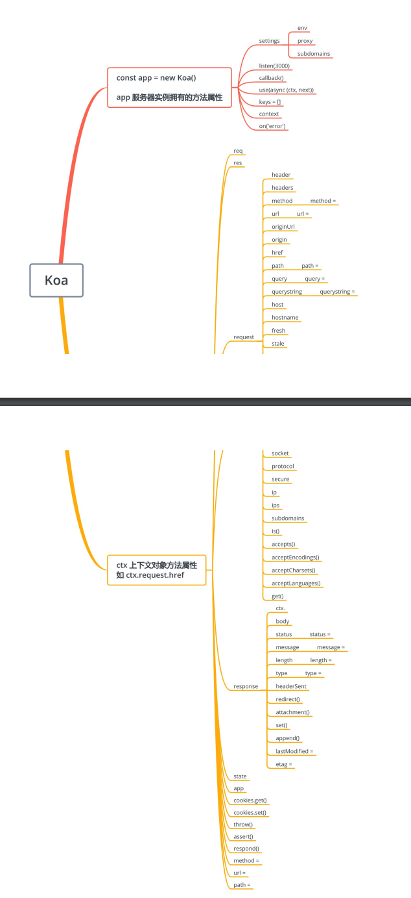

### 
# 12案例十一：[埋点搜集服务器] - 总结： Koa 服务端框架用到了哪些能力

```!
本节目标: 「实现一个简单的埋点服务器」 站在巨人的肩膀上，不仅登高望远，可以低头俯瞰，Node 有很多优秀框架，赋予我们极大的工程效率，那么前面章节学习到的 Node 基础能力在 Koa 这个框架里到底用到了哪些呢？我们拨开云雾看一看。
```

对于 Node 的框架部分，我们本册只针对 Koa 简单学习一下，因为它的源码更精简，结构更清晰，学习的难度相对较小，Koa 的历史就不多说了，也是 TJ 开创，从 GeneratorFunction 时代到现在的 Async/Await 异步时代，经历了一个较大的版本变化，大家可以翻开 [Koa 5 年前的代码](https://github.com/koajs/koa/tree/8ee8abcc3268189c3f44abfb64d42903a87c4d5e/) 看一看，早期的 Koa 就分离了 Application 和 Context，代码风格和流程的设计就比较精简，对于进化到今天的 Koa ，在它里面像  cookies koa-compose delegates 都尽量抽象出去了，所以剩下的部分，特别的纯粹，只有：

* application 整个 Koa 应用服务类
* context Koa 的应用服务上下文
* request Koa 的请求对象
* response Koa 的响应对象

这四个也分别对应到 Koa 的四个模块文件： [application.js](https://github.com/koajs/koa/blob/master/lib/application.js)、[context.js](https://github.com/koajs/koa/blob/master/lib/context.js)、[request.js](https://github.com/koajs/koa/blob/master/lib/request.js)、[response.js](https://github.com/koajs/koa/blob/master/lib/response.js)，整个 HTTP 的门面就是靠它们扛起来的，代码量加一起也就一两千行，简约而强大，整个 Koa 的设计哲学就是小而美的，比如 Koa 启动一个 HTTP Server 也非常简单：

```javascript
const Koa = require('koa')
const app = new Koa()

app.use(ctx => {
  ctx.body = 'Hello Koa'
}).listen(3000)
```

在 new 这个 Koa 实例的时候，实际上是基于这个 Application 类创建的实例，而这个类集成了 Emitter 也就是我们前文学习到的事件类，一旦继承了事件，就可以非常方便基于各种条件来监听和触发事件了。

```javascript
module.exports = class Application extends Emitter {
  constructor() {
    super()
    this.proxy = false
    this.middleware = []
    this.subdomainOffset = 2
    this.env = process.env.NODE_ENV || 'development'
    this.context = Object.create(context)
    this.request = Object.create(request)
    this.response = Object.create(response)
```

在创建这个实例的时候，对实例上面也挂载了通过 Object.create 所创建出来的上下文对象 context、请求对象 request 和 响应对象 response，所以一开始，这几个核心的对象都有了，后面无非就是基于这些对象做更多的扩展和封装罢了。

为帮助大家读源码，我把 application.js 删减到了 100 行代码，单独拎出来给大家看一下：

```javascript
const onFinished = require('on-finished')
const response = require('./response')
const compose = require('koa-compose')
const context = require('./context')
const request = require('./request')
const Emitter = require('events')
const util = require('util')
const Stream = require('stream')
const http = require('http')
const only = require('only')

// 继承 Emitter，暴露一个 Application 类
module.exports = class Application extends Emitter {
  constructor() {
    super()
    this.proxy = false
    this.middleware = []
    this.subdomainOffset = 2
    this.env = process.env.NODE_ENV || 'development'
    this.context = Object.create(context)
    this.request = Object.create(request)
    this.response = Object.create(response)
    if (util.inspect.custom) {
      this[util.inspect.custom] = this.inspect
    }
  }

  // 等同于 http.createServer(app.callback()).listen(...)
  listen(...args) {
    const server = http.createServer(this.callback())
    return server.listen(...args)
  }

  // 返回 JSON 格式数据
  toJSON() {
    return only(this, ['subdomainOffset', 'proxy', 'env'])
  }

  // 把当前实例 JSON 格式化返回
  inspect() { return this.toJSON() }

  // 把中间件压入数组
  use(fn) {
    this.middleware.push(fn)
    return this
  }

  // 返回 Node 原生的 Server request 回调
  callback() {
    const fn = compose(this.middleware)
    const handleRequest = (req, res) => {
      const ctx = this.createContext(req, res)
      return this.handleRequest(ctx, fn)
    }

    return handleRequest
  }

  // 在回调中处理 request 请求对象
  handleRequest(ctx, fnMiddleware) {
    const res = ctx.res
    // 先设置一个 404 的响应码，等后面来覆盖它
    res.statusCode = 404
    const onerror = err => ctx.onerror(err)
    const handleResponse = () => respond(ctx)
    onFinished(res, onerror)
    return fnMiddleware(ctx).then(handleResponse).catch(onerror)
  }

  // 初始化一个上下文，为 req/res 建立各种引用关系，方便使用
  createContext(req, res) {
    const context = Object.create(this.context)
    const request = context.request = Object.create(this.request)
    const response = context.response = Object.create(this.response)
    context.app = request.app = response.app = this
    context.req = request.req = response.req = req
    context.res = request.res = response.res = res
    request.ctx = response.ctx = context
    request.response = response
    response.request = request
    context.originalUrl = request.originalUrl = req.url
    context.state = {}
    return context
  }
}

// 响应处理的辅助函数
function respond(ctx) {
  const res = ctx.res
  let body = ctx.body
  // 此处删减了代码，如 head/空 body 等问题的处理策略等
  // 基于 Buffer/string 和 流，分别给予响应
  if (Buffer.isBuffer(body)) return res.end(body)
  if ('string' == typeof body) return res.end(body)
  if (body instanceof Stream) return body.pipe(res)

  // 最后则是以 JSON 的格式返回
  body = JSON.stringify(body)
  res.end(body)
}
```

这个里面，我们关注到这几个点就可以了：

* new Koa() 的 app 只有在 listen 的时候才创建 HTTP Server
* use fn 的时候，传入的一个函数会被压入到中间件队列，像洋葱的一层层皮一样逐级进入逐级穿出
* Koa 支持对 Buffer/String/JSON/Stream 数据类型的响应
* 上下文 context 是在 Node 原生的 request 进入也就是异步回调执行的时候才创建，不是一开始创建好的，所以每个请求都有独立的上下文，自然不会互相污染
* 创建好的上下文，Koa 会把它们跟原生，以及请求和响应之间，建立各种引用关系，方便在业务代码和中间件中使用，也就是 createContext 里面所干的事情

看到这里，Koa 这个服务框架对我们就没那么神秘了，索性再把 context.js 代码删减到 50 行，大家再浏览下：

```javascript
const util = require('util')
const delegate = require('delegates')
const Cookies = require('cookies')

// 上下文 prototype 的原型
const proto = module.exports = {
  // 挑选上下文的内容，JSON 格式化处理后返回
  toJSON() {
    return {
      request: this.request.toJSON(),
      response: this.response.toJSON(),
      app: this.app.toJSON(),
      originalUrl: this.originalUrl,
      req: '<original node req>',
      res: '<original node res>',
      socket: '<original node socket>'
    }
  },

  // 错误捕获处理
  onerror(err) {},
  // 拿到 cookies
  get cookies() {},
  // 设置 cookies
  set cookies(_cookies) { }
}

// 对新版 Node 增加自定义 inspect 的支持
if (util.inspect.custom) {
  module.exports[util.inspect.custom] = module.exports.inspect
}

// 为响应对象绑定原型方法
delegate(proto, 'response')
  .method('attachment').method('redirect').method('remove').method('vary')
  .method('set').method('append').method('flushHeaders')
  .access('status').access('message').access('body').access('length').access('type')
  .access('lastModified').access('etag')
  .getter('headerSent').getter('writable')


// 为请求对象绑定原型方法
delegate(proto, 'request')
  .method('acceptsLanguages').method('acceptsEncodings').method('acceptsCharsets')
  .method('accepts').method('get').method('is')
  .access('querystring').access('idempotent').access('socket').access('search')
  .access('method').access('query').access('path').access('url').access('accept')
  .getter('origin').getter('href').getter('subdomains').getter('protocol').getter('host')
  .getter('hostname').getter('URL').getter('header').getter('headers').getter('secure')
  .getter('stale').getter('fresh').getter('ips').getter('ip')
```

可以发现，之所以 Koa 的请求/响应上下文上有那么多方法和属性可以用，或者可以设置，其实就是这里的 delegate 搞的鬼，它对 context 施加了许多能力，剩下的 request.js 和 response.js 就留给大家自行消化了，都是一些属性方法的特定封装，没有太多的门槛，或者大家可以参考这张图：



其中本册子所讲的几个知识点，在 Koa 中也有大量的使用，比如 path/util/stream/fs/http 等等，不过建议大家学习 Koa 时候重点关注它的网络进出模型，不需要过多关注底层细节。

### 编程练习 - 开发一个埋点服务器

我们可以用 Koa 开发一个简易的埋点收集服务器，客户端每请求一次，就把埋点的数据往数据库里更新一下，为了演示，我们使用 JSON 结构存储的 lowdb 来模拟数据库，大家可以在本地自行替换为 MongoDB 或者 MySQL，同时我们会用到 Koa 的一个路由中间件，首先我们把依赖的模块安装一下：

```bash
npm i koa koa-router lowdb -S
```

然后创建一个 server.js，代码如下：

```javascript
const Koa = require('koa')
const path = require('path')
const Router = require('koa-router')
const low = require('lowdb')
const FileSync = require('lowdb/adapters/FileSync')

// 创建一个 Koa 服务实例
const app = new Koa()
// 创建一个路由的实例
const router = new Router()
// 创建一个数据库实例，这里用 lowdb 的 JSON 存储来模拟数据库而已
const adapter = new FileSync(path.resolve(__dirname, './db.json'))
const db = low(adapter)

// 初始化数据库，可以看做是数据库的字段定义
db.defaults({visits: [], count: 0}).write()

// 当有请求进来，路由中间件的异步回调会被执行
router.get('/', async (ctx, next) => {
  const ip = ctx.header['x-real-ip'] || ''
  const { user, page, action } = ctx.query

  // 更新数据库
  db.get('visits').push({ip, user, page, action}).write()
  db.update('count', n => n + 1).write()

  // 返回更新后的数据库字段
  ctx.body = {success: 1, visits: db.get('count')}
})

// 把中间件压入队列，等待执行
app
  .use(router.routes())
  .use(router.allowedMethods())
  .listen(7000)
```

在命令行 `node server.js` 把服务开起来后，可以从浏览器通过： `[http://localhost:7000/?user=a&page=1&action=click](http://localhost:7000/?user=a&page=1&action=click)` 来访问，或者从命令里面 `curl [http://localhost:7000/?user=a&page=1&action=click](http://localhost:7000/?user=a&page=1&action=click)`，多请求几次，就会发现数据都存进去了，在 server.js 的同目录，有一个 db.json，里面的数据大概如下：

```json
{
  "visits": [
    {
      "ip": "",
      "user": "a",
      "page": "1",
      "action": "click"
    },
    {
      "ip": "",
      "user": "a",
      "page": "1",
      "action": "click"
    }
  ],
  "count": 2
}
```

那么本节给大家布置一个小作业，如果把上一节的 cluster 跟这一节的埋点服务器做结合，来提升服务器的负载能力，代码可以怎么写呢？
