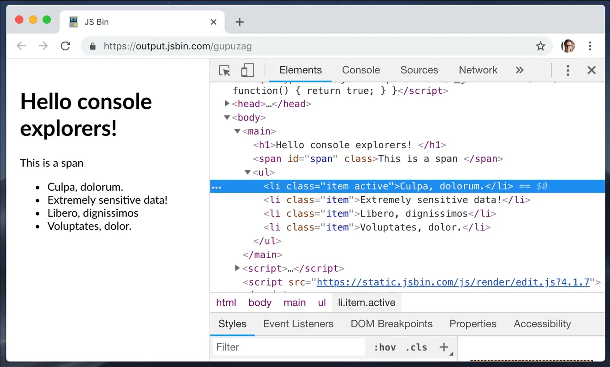
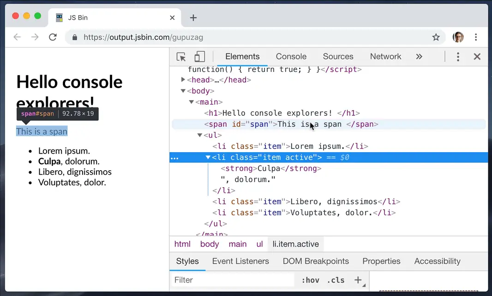
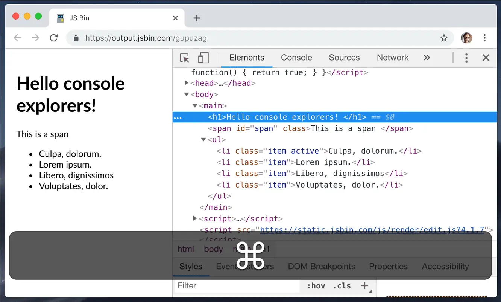
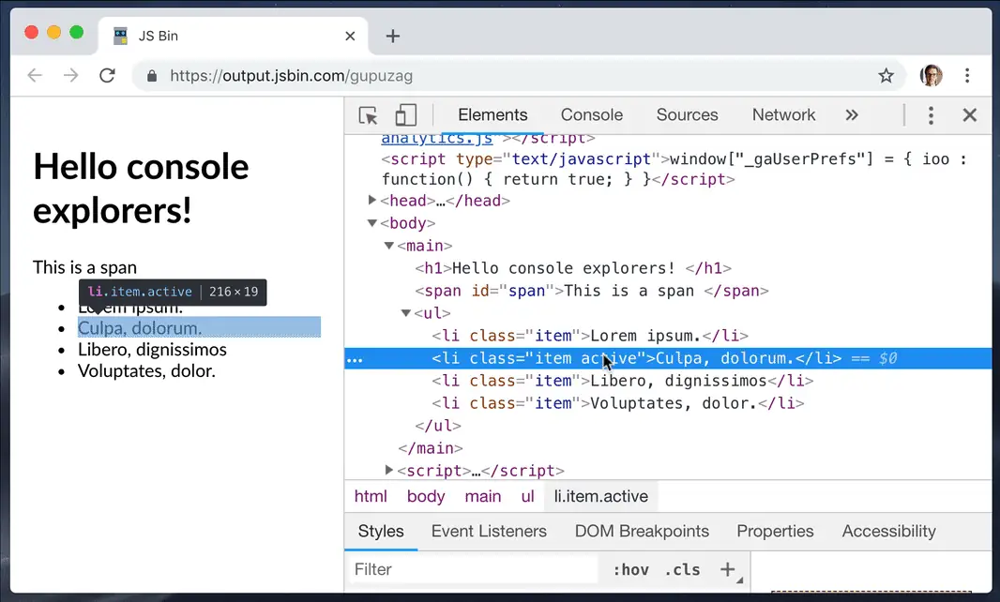
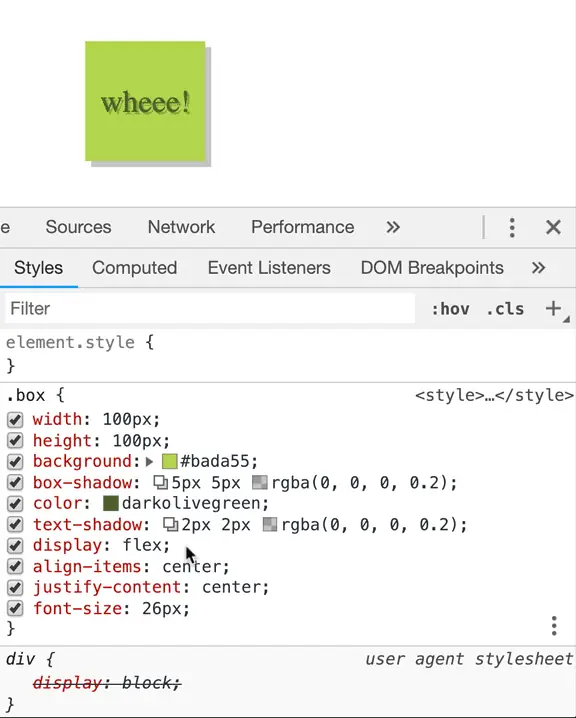
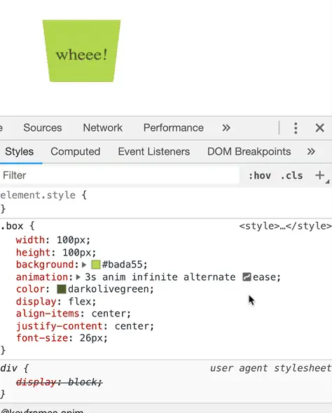
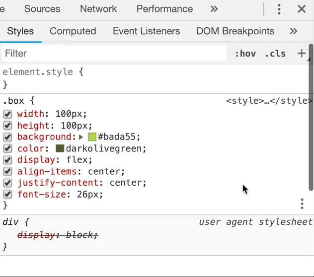
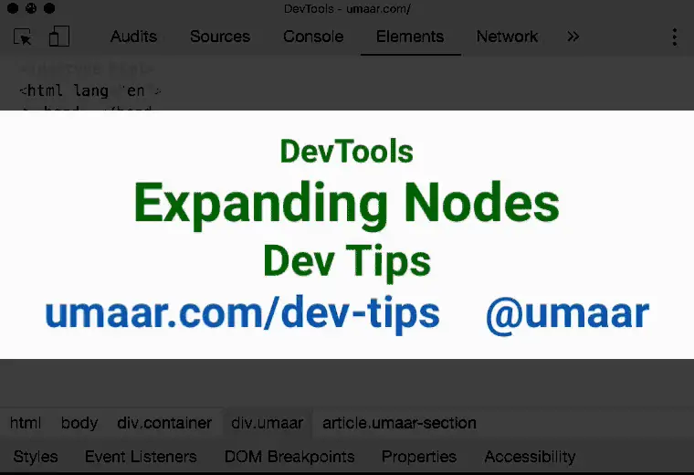
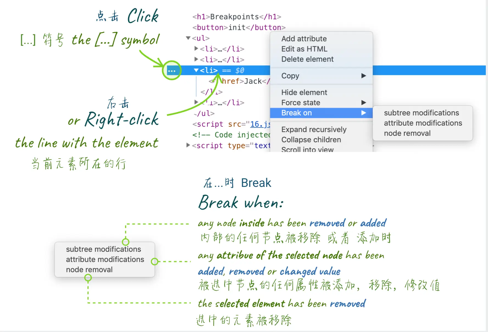
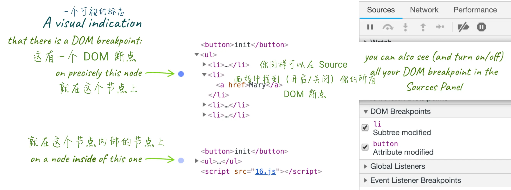

# 14.元素面板篇 - 技巧集合

## 1. 通过 `'h'` 来隐藏元素

按一下 `'h'` 就可以隐藏你在元素面板中选择的元素。再次按下 '`h`' 可以使它出现。某些的时候这很有用：例如你想截图，但你想去掉里面的敏感信息。

## 2. 拖动 & 放置 元素

当你想看看页面的某一部分在 `DOM` 树的不同位置的显示效果时，只需要拖动放置它(到指定的位置)，就像在机器上的其他任何地方一样 :-)

## 3. 使用 `control` (按钮) 来移动元素!

如果你只是想移动你当前选中的元素，在 `DOM` 结构中往上挪一点或者往下挪一点，而不是拖动和放置，你同样可以使用`[ctrl]` + `[⬆]` / `[ctrl] ` +  `[⬇]` (`[⌘] ` + `[⬆]` / `[⌘]` + `[⬇]` on Mac).

## 4. 元素面板中类似于基础编辑器的操作

从某一点来看，我们可以拖动，放置，编辑，复制(当然，以及使用 `[ctrl]` + `[v]` 来粘贴)， 所以我们可以在元素面板里把 `HTML` 结构搞得一团糟。在任意一个编辑器中都有一个标准，那么如何撤回你的操作呢？

使用`[ctrl]` + `[z]` (`[⌘]` + `[z]` on Mac)撤销我们的任何改动。
使用 `[ctrl]` + `[shift]` + `[z]`重新编辑我们的任何修改。

## 5. `Shadow editor` 阴影编辑器

听起来很不吉利(译者注：阴影哪里不吉利了！)，但是它也只是一个小部件而已。你可以通过在 `Style` 面板中点击靠近 `box-shadow` 属性或者 `text-shadow` 属性的 `阴影方形符号` 来打开它：

## 6. Timing function editor 定时函数编辑器

也称为 `Cubic bezier(贝塞尔)` 编辑器。贝塞尔曲线是一串用来定义 `CSS` 的动画速度在整个动画过程中如何变化的 `魔法数值` 。我们将其定义为 `transition-timing-function` 或者 `animation-timing-function` CSS 属性。

像之前说的 `Color picker` 和 `Shadow editor` 一样，直接点击我们刚刚提到的属性(或者他们的简写形式：`trasition`， `animation` - 请注意：如果`timing` 函数的值没有设置在这个简写的形式中，这个符号不会显示出来)边上的曲线符号：

> 顺带说一句，如果你没有试过 `3D` 动画，也很简单：直接在容器元素中设置一个 `perspective` 属性。例如：在 `body` 元素中设置 `perspective: 200px;`

## 7. 插入样式规则的按钮

当你把鼠标放在样式选择器的选择区域的最后时，你会看到几个让你可以快速的使用 `Color` 和 `Shadow` 编辑器添加 `CSS` 属性的按钮：

- `text-shadow`
- `box-shadow`
- `color`
- `background-color`

...打开相应的编辑器：

## 8. 在元素面板中展开所有的子节点

一个一个的去点击级联的 `▶` 按钮太慢了，不如使用右击节点后的 `expand recursively` 命令：

## 9. DOM 断点

有时脚本修改了 `DOM` ，但修改的是哪部分？什么时候修改的呢？

这样的情况下，你就可以添加一个 `DOM` 断点：监听节点被添加或者移除 / 属性被改变。

- 点击"..." 符号或者右击你想添加监听的元素

- 选择 `subtree modifications` :监听任何它内部的节点被 `移除` 或者 `添加`的事件
   
- 选择 `attribute modifications` :监听任何当前选中的节点被 `添加`，`移除` 或者 `被修改值`的事件
   
- 选择 `node removal` :监听被选中的元素被 `移除` 的事件
   

页面重新加载时会记住断点。当你设置了一个或多个断点的时候，可能都忘了它们所标记的位置了。怎么找它们呢？：在 `Elements` 视图中有视觉提示，`Sources` 中也有专用列表。

有时你添加了断点的元素被隐藏在一些折叠起来的父级元素中，不要担心 - 他们会在 `Element` 中用高亮展示出来。

