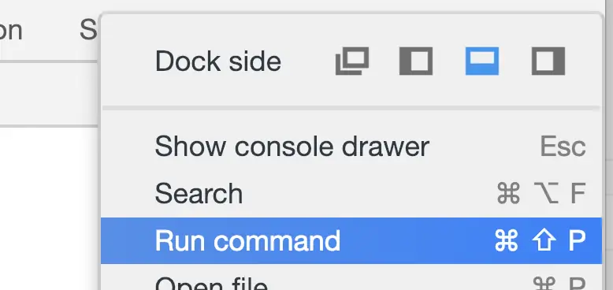
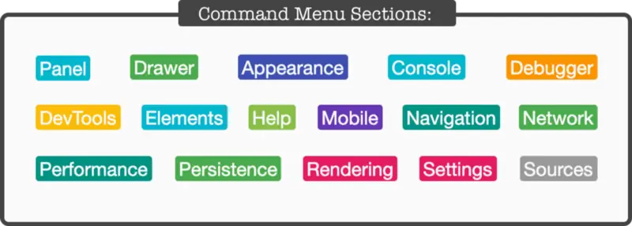
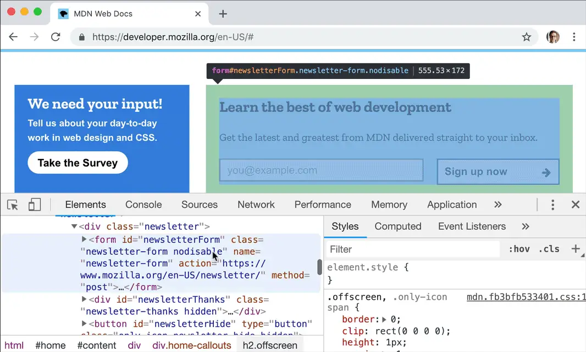
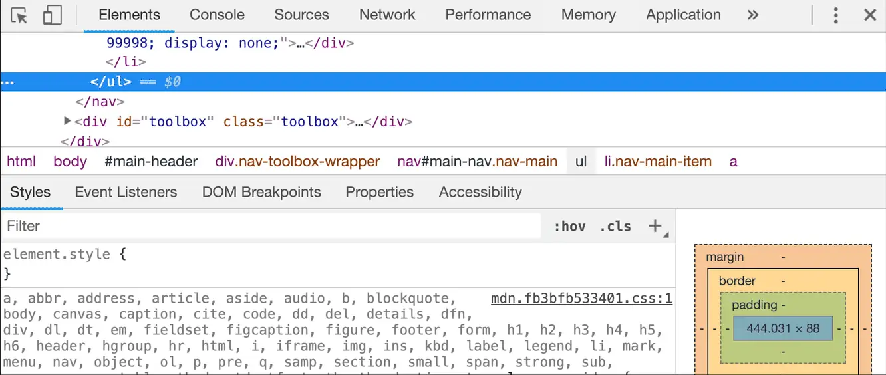
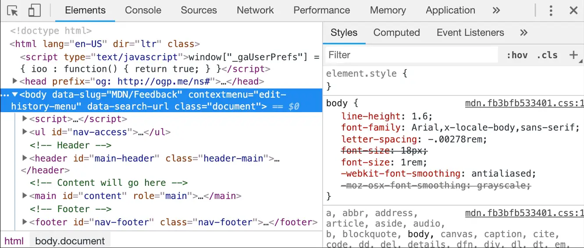

# 4.通用篇 - 使用 Command

## 前言

我们直接可以直接看到的 `DevTools` 的功能，其实只是有限的一部分，怎么去探索更多的功能呢？

`Command`  菜单可以帮助我们快速找到那些被隐藏起来的功能，这也是它本身必不可少的原因。

如果你使用过 `WebStorm` 中的 `Find Action` (查找动作) 或者 `Visual Studio Code` 中的 `Command Palette` 的话，那么在 `DevTools` 中的 `Command` 菜单也与之类似：

- 在 `Chrome` 的调试打开的情况下 按下 [ `Ctrl]` + `[Shift]` + `[P]` (Mac： `[⌘]` + `[Shift]`+ `[P]` )
- 或者使用 `DevTools` 的 `dropdown` 按钮下的这个选项:

下图中，我整理了可供选择的命令列表，归为几个部分：

> 上面这张图同时也证明了 `DevTools` 有多么强力!

## 1.截屏的新姿势

当你只想对一个特别的 `DOM` 节点进行截图时，你可能需要使用其他工具弄半天，但现在你直接选中那个节点，打开 `Command` 菜单并且使用 **节点截图** 的就可以了。

不只是这样，你同样可以用这种方式 **全屏截图**  - 通过 `Capture full size screenshot` 命令。请注意，这里说的是全屏，并不是嵌入页面的一部分。一般来说这可是得使用浏览器插件才能做到的事情！

> 注：**`节点截图有时会失效`**，全屏截图暂时没有遇到问题，建议大家使用后者。

## 2.快速切换面板

`DevTools` 使用双面板布局，形式一般是：`元素面板` + `资源面板` ，它根据屏幕可用的部分，经常将不同面板横向或者纵向的排列，以适合阅读的方式展示出来。但有时候我们并不喜欢默认的布局。

你是否想过要重置 `DevTools` 呢？将 `样式面板` 从 `html预览` 的底部移动到右边或者周围其他的位置呢？是的，这就是下面要介绍的 😉

打开 `Commands` 菜单并且输入 `layout` ，你会看到 `2` 到 `3` 个可供选择的项(这里不再显示你已经激活的选项)：

- 使用横向面板布局
- 使用纵向面板布局
- 使用自动面板布局

试试看：

## 3.快速切换主题

经常在电脑前一坐就是一天，所以我不能忍受一直看着白闪闪的屏幕。而且突然出现的强光也让人讨厌：我们一直都在黑暗的空间中工作，突然太阳出来了，照在你的 `DevTools` 上，导致你什么都看不到！

这个时候 `主题` 就派上了用场了：在 `Commands` 菜单中寻找与 `theme` 相关的选项，实现 `明亮` & `暗黑` 两种主题之间的切换：

