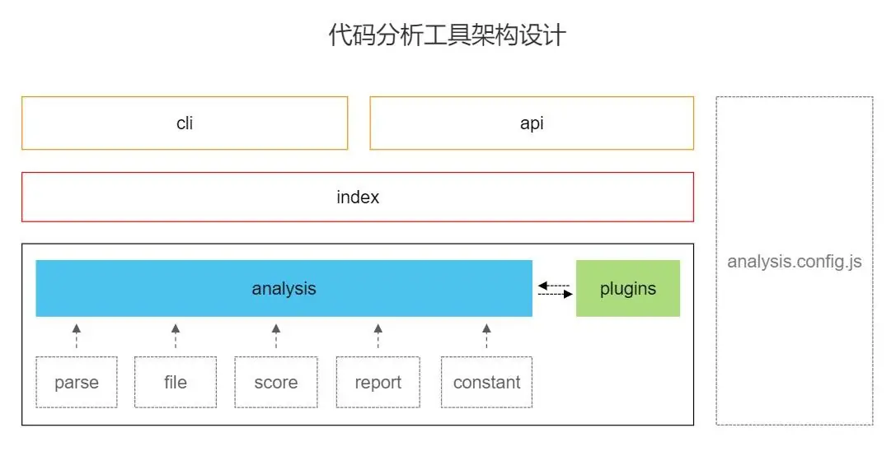

# 12.具体实现：整理分析数据

经过前面章节的学习，我们已经掌握了分析范式中 `step2-6` 的实现原理，这一小节主要讲解 `step7` 的具体实现，我们将学习如何标记黑名单 API，如何对代码调用进行评分，以及如何打包最终分析结果。


  


## codeAnalysis 实例

codeAnalysis 实例作为代码分析流程的抽象表述，会贯穿 step2-7 整个执行生命周期，代码分析过程中涉及的配置信息、内部状态、原始分析数据等都以属性的形式挂载在上面。这些属性大致可分为三类：

第一类是**私有属性**，是代码分析过程中需要用到的配置信息等私有属性；

第二类是**公共属性**，是分析结束后可用于对外提供原始分析数据的属性；

第三类是**插件属性**，是安装插件时挂载，用于记录 API 调用数据的属性。

```typescript
class CodeAnalysis {
    constructor(options) {
        // 私有属性
        this._scanSource = options.scanSource;                 // 扫描源配置信息       
        this._analysisTarget = options.analysisTarget;         // 要分析的目标依赖配置           
        this._blackList = options.blackList || [];             // 需要标记的黑名单API配置        
        this._browserApis = options.browserApis || [];         // 需要分析的BrowserApi配置         
        this._isScanVue = options.isScanVue || false;          // 是否扫描Vue配置    
        this._scorePlugin = options.scorePlugin || null;       // 代码评分插件配置
        this._analysisPlugins = options.analysisPlugins || []; // 代码分析插件配置
        // 公共属性
        this.pluginsQueue = [];                         // Targer分析插件队列
        this.browserQueue = [];                         // Browser分析插件队列
        this.importItemMap = {};                        // importItem统计Map    
        this.parseErrorInfos = [];                      // 解析异常信息
        this.diagnosisInfos = [];                       // 诊断日志信息           
        this.scoreMap = {};                             // 评分及建议Map         
        // 插件属性
        this.apiMap = {};                            // 未分类API统计Map            
        this.typeMap = {};                           // 类型API统计Map
        this.methodMap = {};                         // 方法API统计Map               
        this.browserMap = {};                        // BrowserAPI统计Map
    }
}
```

  


代码分析的目的是让依赖双方开发者了解依赖关系并加以管控，分析结束后，`codeAnalysis` 实例的公共属性及插件属性返回的大多是统计型数据，这些数据能够帮助开发者了解 API 的调用及分布信息，但想要实现代码评分、代码告警、脏调用检测等分析目的，我们还需要对原始数据进行二次处理。

  


## 脏调用“检测”

“脏调用”检测就是在原始统计结果中找到黑名单 API 并标记，目的是为了在最终的分析结果中将它们与其它 API 区分开来，当然标记是一个很宽泛的概念，使用者可以根据自己的用途去处理被标记的 API，并不只限于检测“脏调用”。


`codeAnalysis`实例上通过分析插件记录的原始统计数据都是以 API 为 key 的 Map 结构，我们可以实现一个名叫 `_blackTag` 的函数，它会遍历检测相关 Map 中的 key 是否命中 `blackList` 配置项中的 API，命中则为 Map 结构中的 API 添加 `isBlack` 属性表示已标记。

简化代码如下，完整代码实现请参考 [lib/analysis.js](https://github.com/liangxin199045/code-analysis-ts/blob/main/lib/analysis.js) ：

```typescript
class CodeAnalysis {
    constructor(options) {
        ......
        // 私有属性         
        this._blackList = options.blackList || [];   // 需要标记的API配置        
        // 公共属性
        this.pluginsQueue = [];                      // Targer分析插件队列
        this.browserQueue = [];                      // Browser分析插件队列
        // 插件属性
        this.apiMap = {};                            // 未分类API统计Map            
        this.typeMap = {};                           // 类型API统计Map
        this.methodMap = {};                         // 方法API统计Map               
        this.browserMap = {};                        // BrowserAPI统计Map
        ......
    }
    
    // API黑名单标记
    _blackTag(queue) {
        if(queue.length>0){
          queue.forEach((item)=>{
            Object.keys(this[item.mapName]).forEach((apiName)=>{  // 遍历相关插件属性Map
              if(this._blackList.length>0 && this._blackList.includes(apiName)){
                this[item.mapName][apiName].isBlack = true;       // 标记
              }
            })
          })
        }
    }
    
    // 入口函数
    analysis() {
        ......
        // 黑名单标记
        this._blackTag(this.pluginsQueue);
        this._blackTag(this.browserQueue);
        ......
    }  
}
```

  


## 代码评分& 优化建议


  


实现原理：将扣分规则及逻辑抽象成一个 f(x) 函数，该函数会以 codeAnalysis 实例做为入参，对原始统计数据进行遍历分析，如果有 API 命中了扣分规则，就执行扣分逻辑并记录对应的优化建议，遍历结束后返回代码评分及优化建议结果。


函数式方案的优点就在于，使用者可以通过实现 f(x) 达到自定义评分规则的目的。

分析工具有一个默认兜底的评分函数，相关源码在 [lib/score.js](https://github.com/liangxin199045/code-analysis-ts/blob/main/lib/score.js) ：

```typescript
// 默认评分插件
exports.defaultScorePlugin = function (analysisContext){
    // console.log(analysisContext);
    const { pluginsQueue, browserQueue, importItemMap, parseErrorInfos } = analysisContext;
    const mapNames = pluginsQueue.map(item=>item.mapName).concat(browserQueue.map(item=>item.mapName));
    
    let score = 100;            // 初始分数
    let message =[];            // 代码建议

    // 黑名单API扣分处理
    if(mapNames.length>0){
        mapNames.forEach((item)=>{
            Object.keys(analysisContext[item]).forEach((sitem)=>{
                if(analysisContext[item][sitem].isBlack){
                    score = score - 5;
                    message.push(sitem + ' 属于黑名单api，请勿使用');
                }
            })
        })
    }
    // ImportItem扣分处理
    Object.keys(importItemMap).forEach((item)=>{
        if(importItemMap[item].callOrigin =='*'){
            score = score - 2;
            message.push('import * as ' + item + ' 属于非建议导入方式，建议修改');
        }
    })
    // BrowserAPI扣分处理
    if(mapNames.includes('browserMap')){
        // browserapi使用建议
        Object.keys(analysisContext['browserMap']).forEach((item)=>{
            let keyName = '';
            if(item.split('.').length>0){
                keyName = item.split('.')[0];
            }else{
                keyName = item;
            }
            if(keyName ==='window'){
                message.push(item + ' 属于全局类型api，建议请评估影响慎重使用');
            }
            if(keyName ==='document'){
                message.push(item + ' 属于Dom类型操作api，建议评估影响慎重使用');
            }
            if(keyName ==='history'){
                score = score - 2;
                message.push(item + ' 属于路由类操作，请使用框架提供的Router API代替');
            }
            if(keyName ==='location'){
                score = score - 2;
                message.push(item + ' 属于路由类操作，请使用框架提供的Router API代替');
            }
        })
    }
    // 解析AST失败或执行分析触发异常的扣分处理
    if(parseErrorInfos.length >0){
        score = score - 3*parseErrorInfos.length;
        let tempMessage ='';
        tempMessage = parseErrorInfos.length + ' 个文件解析&分析AST时发生错误，请修复';
        message.push(tempMessage);
    }

    // 最低0分
    if(score <0)score =0;

    return {
        score: score,
        message: message
    }
}
```

  
代码评分函数的具体实现并没有任何限制，只需要返回一个包含 `score`，`message` 属性的 JS 对象即可（score 是 number 类型，message 是一个 string 类型的数组）。


codeAnalysis 基础类中关于代码评分 & 优化建议的简化版实现如下：

```typescript
const { defaultScorePlugin } = require(path.join(__dirname, './score'));   // 评分模块

class CodeAnalysis {
    constructor(options) {
        ......
        // 私有属性         
        this._scorePlugin = options.scorePlugin || null;  // 代码评分插件配置       
        // 公共属性
        this.scoreMap = {};                          // 评分及建议Map
        ......
    }
    
    // 入口函数
    analysis() {
        ......
        // 代码评分
        if(this._scorePlugin){
          if(typeof(this._scorePlugin) ==='function'){
            this.scoreMap = this._scorePlugin(this);
          }
          if(this._scorePlugin ==='default'){
            this.scoreMap = defaultScorePlugin(this);
          }
        }else{
          this.scoreMap = null;
        }
        ......
    }  
}
```

开发者可以在配置文件中通过 `scorePlugin` 配置项来配置自定义评分函数，代码评分及优化建议相关的数据会记录在 `codeAnalysis` 实例的 `scoreMap` 属性中，有关自定义评分函数的配置与使用，大家可以参考 [code-demo](https://github.com/liangxin199045/code-demo) 项目中的示例。

  


## 打包分析结果



`codeAnalysis` 实例是代码分析流程的抽象表述，但分析结果并不需要返回整个 codeAnalysis 实例，通常只需要提取其中部分数据并加以打包即可。

  


在 `CLI / API` 与 `codeAnalysis` 基础类中间我们设计了 `index` 这一层，目的在于 `链接` 使用入口与基础抽象类，`index` 模块封装了实例化 codeAnalysis，执行代码分析、打包分析结果等相关逻辑，保证使用者不管使用哪个入口，都可以返回相同的分析结果。

  


具体实现代码在 [lib/index.js](https://github.com/liangxin199045/code-analysis-ts/blob/main/lib/index.js) 中：

```typescript
const path = require('path');                                                       // 路径管理
const moment = require('moment');                                                   // 时间格式化
const ora = require('ora');                                                         // 命令行状态
const chalk = require('chalk');                                                     // 美化输出
const { REPORTTITLE, TIMEFORMAT } = require(path.join(__dirname, './constant'));    // 常量模块
const CodeAnalysis = require(path.join(__dirname, './analysis'));                   // 核心分析类

const codeAnalysis = function (config) {
  return new Promise((resolve, reject)=>{
    var spinner = ora(chalk.green('analysis start')).start();
    try {
      // 新建分析实例
      const coderTask = new CodeAnalysis(config);
      // 执行代码分析
      coderTask.analysis();
      // 打包分析结果
      const mapNames = coderTask.pluginsQueue.map(item=>item.mapName).concat(coderTask.browserQueue.map(item=>item.mapName));
      const report = {
        importItemMap: coderTask.importItemMap,
        parseErrorInfos: coderTask.parseErrorInfos,            // 解析异常信息
        scoreMap: coderTask.scoreMap,                          // 代码评分及建议信息
        reportTitle: config.reportTitle || REPORTTITLE,
        analysisTime: moment(Date.now()).format(TIMEFORMAT),
        mapNames: mapNames
      };
      if(mapNames.length>0){
        mapNames.forEach(item => {
          report[item] = coderTask[item];
        });
      }
      // 返回分析结果
      resolve({                                                
        report: report,                                        // 分析报告内容
        diagnosisInfos: coderTask.diagnosisInfos               // 诊断报告内容
      });
      spinner.succeed(chalk.green('analysis success'));
    } catch (e) {
      reject(e);
      spinner.fail(chalk.red('analysis fail'));
    }
  })
};

module.exports = codeAnalysis;
```

上述代码中使用到了 [moment](https://www.npmjs.com/package/moment) 这个工具包来处理时间格式，还用到了 [ora](https://www.npmjs.com/package/ora)、[chalk](https://www.npmjs.com/package/chalk) 这两个工具包来美化输出。

打包后最终的分析结果包含 2 部分：

1. 代码分析报告 `report`，用于帮助开发者了解并管控依赖关系。
2. 工具诊断报告 `diagnosisInfos`，用于辅助插件开发者开发/调试分析插件。


代码分析报告内容示例：

```json
{
    "importItemMap": {
        "domain": {
            "callOrigin": null,
            "callFiles": [
                "Order&src/api/index.ts"
            ]
        },
        "api": {
            "callOrigin": null,
            "callFiles": [
                "Order&src/api/index.ts",
                "Order&code/test/coding.ts"
            ]
        },
        "responseType": {
            "callOrigin": null,
            "callFiles": [
                "Order&src/api/people.ts"
            ]
        }
    },
    "parseErrorInfos": [
        {
            "projectName": "Order",
            "httpRepo": "",
            "file": "src/pages/setting.vue",
            "stack": "SyntaxError: Element is missing end tag.\n    at createCompilerError (/Users/xinliang/code/github/code-analysis-ts/node_modules/@vue/compiler-core/dist/compiler-core.cjs.js:16:19)\n    at emitError (/Users/xinliang/code/github/code-analysis-ts/node_modules/@vue/compiler-core/dist/compiler-core.cjs.js:1187:29)\n    at parseElement (/Users/xinliang/code/github/code-analysis-ts/node_modules/@vue/compiler-core/dist/compiler-core.cjs.js:824:9)\n    at parseChildren (/Users/xinliang/code/github/code-analysis-ts/node_modules/@vue/compiler-core/dist/compiler-core.cjs.js:650:28)\n    at parseElement (/Users/xinliang/code/github/code-analysis-ts/node_modules/@vue/compiler-core/dist/compiler-core.cjs.js:816:22)\n    at parseChildren (/Users/xinliang/code/github/code-analysis-ts/node_modules/@vue/compiler-core/dist/compiler-core.cjs.js:650:28)\n    at Object.baseParse (/Users/xinliang/code/github/code-analysis-ts/node_modules/@vue/compiler-core/dist/compiler-core.cjs.js:570:23)\n    at Object.parse (/Users/xinliang/code/github/code-analysis-ts/node_modules/@vue/compiler-dom/dist/compiler-dom.cjs.js:3049:25)\n    at exports.parseVue (/Users/xinliang/code/github/code-analysis-ts/lib/parse.js:13:32)\n    at parseFiles.forEach (/Users/xinliang/code/github/code-analysis-ts/lib/analysis.js:306:50)"
        }
    ],
    "reportTitle": "Order代码分析报告",
    "analysisTime": "2023.01.25 11:29:15",
    "mapNames": [
        "methodMap",
        "typeMap",
        "apiMap",
        "browserMap"
    ],
    "methodMap": {
        "api.thirdRequest.get": {
            "callNum": 2,
            "callOrigin": null,
            "callFiles": {
                "Order&src/api/index.ts": {
                    "projectName": "Order",
                    "httpRepo": "",
                    "lines": [
                        6,
                        10
                    ]
                }
            }
        }
    },
    "typeMap": {
        "responseType": {
            "callNum": 1,
            "callOrigin": null,
            "callFiles": {
                "Order&src/api/people.ts": {
                    "projectName": "Order",
                    "httpRepo": "",
                    "lines": [
                        23
                    ]
                }
            }
        }
    },
    "apiMap": {
        "domain.getDate": {
            "callNum": 1,
            "callOrigin": null,
            "callFiles": {
                "Order&src/api/index.ts": {
                    "projectName": "Order",
                    "httpRepo": "",
                    "lines": [
                        13
                    ]
                }
            }
        }
    },
    "browserMap": {
        "document.getElementById": {
            "callNum": 1,
            "callOrigin": null,
            "callFiles": {
                "Order&src/components/scrollBar/index.vue": {
                    "projectName": "Order",
                    "httpRepo": "",
                    "lines": [
                        32
                    ]
                }
            }
        }
    }
}
```

  


工具诊断报告内容示例：

```json
[
    {
            "projectName": "xxx",
            "matchImportItem": {
                "origin": null,
                "symbolPos": 73,
                "symbolEnd": 77,
                "identifierPos": 73,
                "identifierEnd": 77
            },
            "apiName": "app.localStorage.set",
            "httpRepo": "",
            "file": "src/pages/BasicSettings.vue",
            "line": 129,
            "stack": "TypeError: Cannot read property 'name' of null\n    at isMethodCheck (/Users/xinliang/code/github/code-analysis-ts/plugins/methodPlugin.js:13:87)\n    at CodeAnalysis._runAnalysisPlugins (/Users/xinliang/code/github/code-analysis-ts/lib/analysis.js:87:12)\n    at walk (/Users/xinliang/code/github/code-analysis-ts/lib/analysis.js:231:22)\n    at visitNode (/Users/xinliang/code/github/code-analysis-ts/node_modules/typescript/lib/typescript.js:30663:24)\n    at Object.forEachChild (/Users/xinliang/code/github/code-analysis-ts/node_modules/typescript/lib/typescript.js:30890:24)\n    at walk (/Users/xinliang/code/github/code-analysis-ts/lib/analysis.js:216:18)\n    at visitNode (/Users/xinliang/code/github/code-analysis-ts/node_modules/typescript/lib/typescript.js:30663:24)\n    at Object.forEachChild (/Users/xinliang/code/github/code-analysis-ts/node_modules/typescript/lib/typescript.js:30890:24)\n    at walk (/Users/xinliang/code/github/code-analysis-ts/lib/analysis.js:216:18)\n    at visitNode (/Users/xinliang/code/github/code-analysis-ts/node_modules/typescript/lib/typescript.js:30663:24)"
    }
]
```

至此，分析范式中 `step2-7` 相关的知识及实现原理就都讲完了。

  


## 小结

这一小节我们学习了如何整理分析数据，需要大家掌握以下知识点：

  


1.  `codeAnalysis` 实例作为代码分析流程的抽象表述，共有三种类型的属性。公共属性及插件属性返回的大多是统计型数据，我们需要对原始数据进行二次处理。
1.  `API 标记`是一个很宽泛的概念，目的是为了将某些 API 与其它 API 区分开来，使用者可以按自己的用途去处理被标记的 API，并不只限于检测“脏调用”。
1.  代码评分函数的优点就在于使用者可以通过实现 f(x) 达到自定义评分规则的目的。
1.  `index` 这一层设计目的在于 `链接` 使用入口与基础抽象类，它封装了实例化 codeAnalysis，执行代码分析、打包分析结果等相关逻辑，保证不同的使用入口可以返回相同的分析结果。