代码分析工具的应用场景有很多，这一节课我们主要从 `依赖调用方` 角度出发，学习如何实现 **“脏调用”拦截** 和 **CI自动化分析，** 本节课讲解的的代码示例都在 [code-demo](https://github.com/liangxin199045/code-demo) 下，建议 clone 到本地对照学习。

  


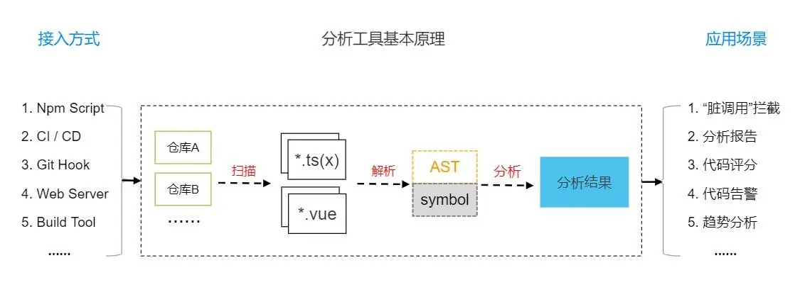

  


## “脏调用”拦截

第 1 节课程中我们定义了“脏调用”，即 `依赖调用方` 代码中有问题的 API 调用，分析工具可以帮助开发者对“脏调用”进行管控，阻止有问题的代码被提交 / 合入，既然要拦截，让我们先来了解下 `依赖调用方` 业务开发的 Workflow。

  


### Workflow

工作流并不只是前端开发需要掌握的技能，而是程序员的必备技能，它是从项目管理角度根据项目实际情况而制定的开发流程。明确的标准可以避免代码在开发/合并时出现问题，将事故风险降到最低，在迭代过程中，也容易对之前的代码进行回溯。

  


以下图简化版的 Workflow 为例：

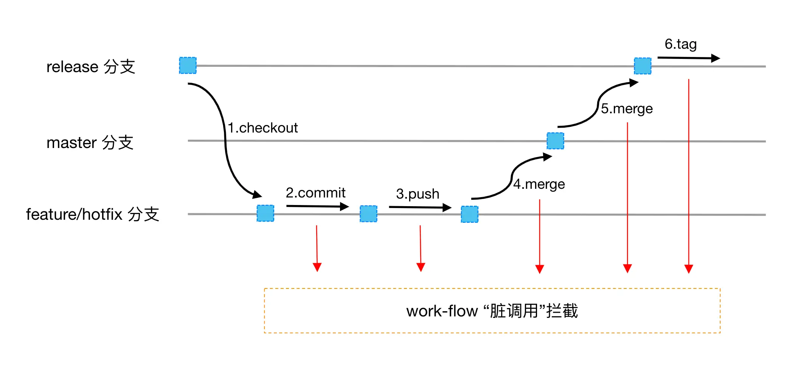

`release 分支`：项目的发布版本代码，该分支只接受 meger request，通过打 tag 触发 web hook 的方式通知部署平台部署 live 环境，每个 tag 可以理解成 live 发布过的代码版本。

`master 分支`：是项目的主干代码，代码合并以它为基准，只接受 merge request，禁止直接 push 操作，该分支是 feature 分支合并以及进行集成测试的基准分支。

`feature 分支`：需求的开发分支，一般从 release 分支拉出，开发测试通过以后，提交 MR 请求合入 master 分支。

`hotfix 分支`：修复线上 Bug 的临时分支，一般从 release 分支拉出，开发测试通过以后，提交 MR 请求合入 master 分支。

  


上面的 Workflow 展示了 `feature/hotfix` 分支上的代码是如何一步步集成并部署到 live 的。试想一下，如果某个 `feature` 分支中存在“脏调用”代码，`commit` 操作会影响自己，`push` 操作会影响远端分支，后续的 `merge` 操作则会影响到 `master`、`release` 等重要分支，`tag` 操作更是会影响到 live 生产环境部署。

  


可见越往后影响便越大，我们应该在 `2-5` 阶段对`“脏调研”`进行拦截，尽可能将有问题的代码拦截在早期阶段。那么如何在这些阶段通过代码分析工具检测脏调用并进行拦截呢？

  


### git hook

git hook 是 git 在执行特定事件如 `commit`、 `push`时触发运行的脚本，类似“钩子函数”，在项目`.git/hooks` 目录中，有一些以 `.sample` 结尾的钩子示例脚本，如果想启用对应钩子，只需手动删除后缀即可，默认是不启用的，举个例子：代码分析工具可以结合 `pre-commit hook` 检查“脏”调用，没有通过检测则不允许提交。

  


我们一般不会手动去改 `.git/hooks` 里面的文件，可以通过工具来完成这些操作，比如 [pre-commit](https://www.npmjs.com/package/pre-commit)、 [husky](https://www.npmjs.com/package/husky)、 [git-scripts](https://www.npmjs.com/package/git-scripts) 等工具都可以帮助开发者添加 git hook，这里我们以 pre-commit 为例：

```json
{
  "name": "code-analysis-code-demo",
  "version": "0.1.0",
  "scripts": {
    "analysis": "ca analysis",
    "analysis:api": "node ./apiMode.js"
  },
  "pre-commit": [
    "analysis"
  ],
  "devDependencies": {
    "code-analysis-ts": "^1.3.8"
  },
  "license": "MIT",
  "engines": {
    "node": ">= 14.0.0",
    "npm": ">= 4.0.0"
  },
  "dependencies": {
    "pre-commit": "^1.2.2"
  }
}
```

上面的 package.json 信息来自 [code-demo](https://github.com/liangxin199045/code-demo) 项目，执行 npm install 就会安装相应的 `git hook`，然后提交更改会触发下图的 `hook` 拦截效果：

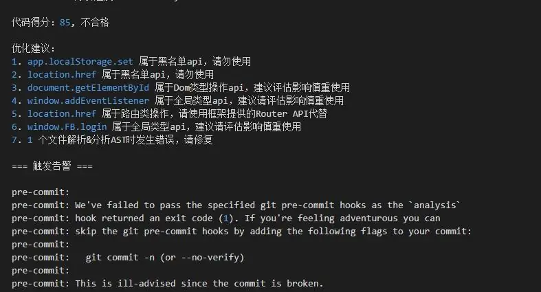

  


PS：如果执行 `git commit` 后没有触发检查，要检查下是否正常安装了 hook，可以到`.git/hooks` 目录下查看是否有类似 `pre-commit` 的脚本文件，没有的话可以尝试重新安装 pre-commit。如果有脚本文件但是没执行，可以尝试删除 hooks 文件夹后重新安装，注意如果有提前设置好的其他钩子，请谨慎删除 `hooks`。

  


仅仅通过 `pre-commit` 这样的 hook 来拦截代码有一个问题：开发者可以在 git commit 时添加 `--no-verify` 来跳过 hook 从而躲避检查。

```
// 跳过hook
git commit -m 'feat: add commit' --no-verify
```

也就是说，虽然在 `commit` 时拦截是最佳的阶段，但存在被绕过的可能性，这样就导致`“脏调用”`代码流入了下一阶段，所以 Workflow `2-5` 阶段也应该做拦截检查，不能漏过任意环节。但是本地分支代码在 push 到远端后，后续集成都发生在 GitLab Server 了，如何进行后续拦截呢？

  


### GitLab CI

`持续集成（Continuous Integration）`， 即在源代码变更后可以自动触发检测、单元测试、构建等任务的自动化过程，目标是快速确保开发人员新提交的代码是好的（少 Bug）。

  


很多公司部署了 `GitLab` 来管理代码仓库，而 `GitLab` 本身便集成了 CI 能力，当 `push` 代码或者发起 `PR` 时，`GitLab` 会扫描仓库根目录查看是否存在 **.gitlab-ci.yml** 文件，并对其进行语法分析，将文件中用户自定义的脚本提取出来，发送到 `GitLab-runner` 服务器进行执行，之后将执行的结果反馈到 `GitLab` 网页端，这样一个自动触发执行脚本的机制被称为流水线 `pipeline`。

  


对于 GitLab CI 还不熟悉的同学推荐先看下这篇文章： [GitLab-CI 使用教程](https://juejin.cn/post/6844904045581172744)

**.gitlab-ci.yml：**

```
# 15.应用场景：“脏调用”拦截 & CI 自动化分析
image: node:14
               
# 流水线有1个阶段，名叫analysis
stages:
  - analysis

# 在每个任务开始之前需要执行的命令
before_script:
  - npm install

# 执行代码分析
work:                                # job name
  stage: analysis                    # 归属于analysis阶段
  only:                              
    - master                         # master分支发生变化时触发Pipeline
    - release                        # release分支发生变化时触发Pipeline
    - tags                           # 打tag时触发Pipeline
  script:
    - npm run analysis               # 执行代码分析脚本
```

上面的 **.gitlab-ci.yml** 文件表示在 `master`、`release` 分支代码发生变化或者打 `tag` 时，会触发一个流水线 `pipeline`，流水线会经历 1 个名叫 `analysis` 的阶段，而 `analysis` 阶段包含 1 个名叫 `work` 的 job，每个任务在执行前，需要先执行脚本命令 `npm install`，在执行 `work` 这个任务时，会执行脚本 `npm run analysis`。

  


下图是触发 `pipeline` 后 web 页面的截图：

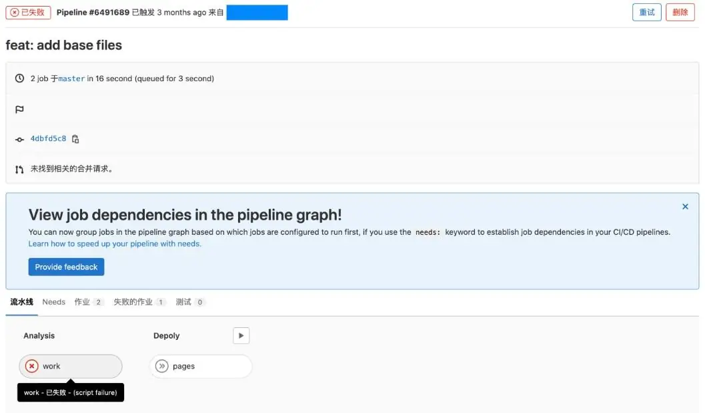

从 CI 流水线任务执行的结果来看，`work` 任务失败了，可以点击下面的 `work` 任务查看任务流水日志：

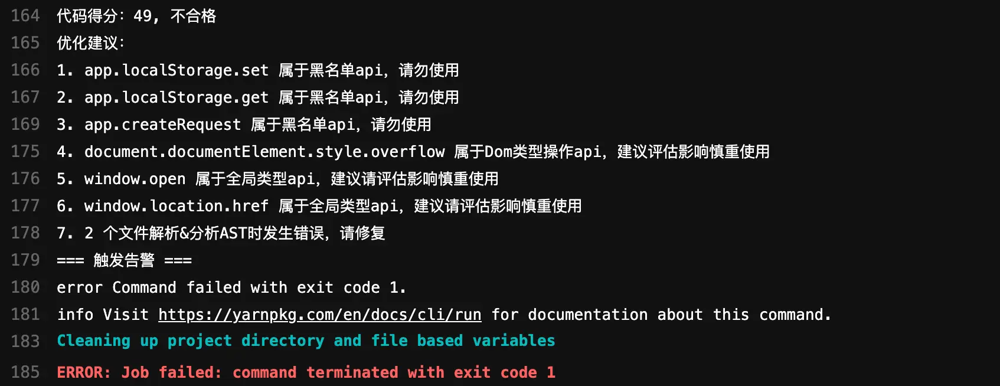

从执行日志可以看到，因为代码中存在黑名单调用，导致代码评分低于配置阈值，分析进程主动抛出异常，阻止了代码合入操作，成功拦截了`“脏调用”`合入。

  


## 自动化分析

下图展示的是 `GitLab CI` 触发 `Pipeline` 的几种方式，除了代码变更、手动执行等方式，我们还可以通过创建定时任务来触发 `pipeline`，进而实现自动化分析。

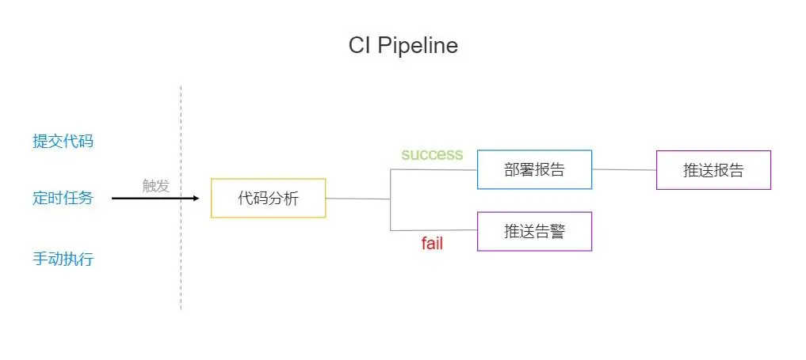

### GitLab Pages

`GitLab` 本身提供了搭建静态站点的功能 `GitLab Pages`，通过它可以部署指定目录下的静态资源，比如我们的代码分析报告 html。

需要注意的一点是，`GitLab` 配置 Pages 时的 `job` 名称必须为 `pages`，放置静态资源的目录名必须为 `public`，不然不会生效，下面是 **.gitlab-ci.yml** 的配置 demo：

```
# 任务指定镜像
image: node:14

# 流水线有2个阶段，先执行analysis阶段的任务，然后执行depoly阶段的任务
stages:
  - analysis
  - deploy

# 在每个任务开始之前需要执行的命令
before_script:
  - npm install

# 执行代码分析
work:                            # job name
  stage: analysis                # 归属于analysis阶段
  only:
    - master                     # master分支发生变化时触发Pipeline
  script:
    - npm run analysis           # 任务执行脚本
  artifacts:                     
    paths:                       # 缓存文件夹，可以在CI流水线任务 UI 界面中下载
      - docs                     # 代码分析报告生成目录，与analysis.config.js配置保持一致

# 部署pages
pages:                           # job name
  stage: deploy                  # 归属于deploy阶段
  only:
    - master                     # master分支发生变化时触发Pipeline
  when: on_success               # 前一阶段所有任务成功时才执行
  script:
    - mkdir -p public            # 执行脚本创建public目录
    - mv docs/* public           # 执行脚本将docs目录下的代码分析报告相关静态文件复制到public目录
  dependencies:                 
    - work                       # 依赖work job
  artifacts:            
    paths:
      - public                   # 声明gitlab Pages静态资源目录
```

Pages 的查看方式可以在 `Settings >> Pages` 中，蓝色网址就是部署后代码分析报告的 URL 地址。

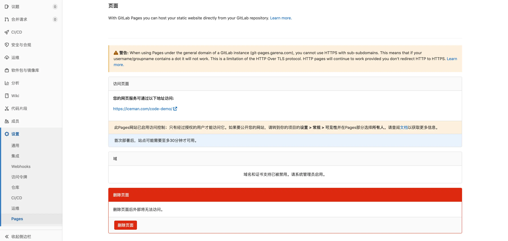

（ps：图上所示网址只是一个例子，code-demo 的分析报告可以看 [这里](https://liangxin199045.github.io/code-demo/)）

  


### 推送报告 / 告警

代码分析任务结束后，如果发现`“脏调用”`，我们希望可以向开发者推送告警消息，如果分析结果没问题，则向开发者推送查阅分析报告的 URL 地址。那么如何实现消息推送呢？

  


企业内部的即时通讯软件（如：企业微信、飞书、钉钉，或者其它自研）基本都支持 Bot 机器人功能，即暴露一个 API 接口给应用，开发者只需按照固定参数调用这个 API 接口，即可让机器人给群，或者个人发消息，我们可以把消息推送的操作封装成 shell 脚本。

  


推送报告的 shell 脚本示例，[notification.sh](https://github.com/liangxin199045/code-demo/blob/main/notification.sh) ：

```
#!/bin/bash

curl 'https://iceman.com/webhook/group/xxxxxxxxxx1nWVtDQ' \
     -H 'Content-Type: application/json' \                        
     -d '                        
     {                                        
         "tag": "text",                                        
         "text": {                                                        
              "content": "\n分析项目: Code-Demo\n分析报告: https://iceman.com/code-demo/",
              "at_all": true                                        
         }                        
     }'
```

代码告警的 shell 脚本示例，[alert.sh](https://github.com/liangxin199045/code-demo/blob/main/alert.sh) ：

```
#!/bin/bash

curl 'https://iceman.com/webhook/group/xxxxxxxxxx1nWVtDQ' \
     -H 'Content-Type: application/json' \                        
     -d '                        
     {                                        
         "tag": "text",                                        
         "text": {                                                        
              "content": "\n代码告警: Code-Demo\n流水日志: https://iceman.com/code-demo/-/jobs/20051072",
              "at_all": true                                        
         }                        
     }'
```

  


然后我们完善一下 [.gitlab-ci.yml](https://github.com/liangxin199045/code-demo/blob/main/.gitlab-ci.yml) 文件：

```
# 任务指定镜像
image: node:14

# 流水线有2个阶段，先执行analysis阶段的任务，然后执行depoly阶段的任务
stages:
  - analysis
  - deploy

# 在每个任务开始之前需要执行的命令
before_script:
  - npm install

# 执行代码分析
work:                            # job name
  stage: analysis                # 归属于analysis阶段
  only:
    - master                     # master分支发生变化时触发Pipeline
  script:
    - npm run analysis           # 任务执行脚本
  artifacts:                     
    paths:                       # 缓存文件夹，可以在CI流水线任务 UI 界面中下载
      - docs                     # 代码分析报告生成目录，与analysis.config.js配置保持一致

# 部署pages
pages:                           # job name
  stage: deploy                  # 归属于deploy阶段
  only:
    - master                     # master分支发生变化时触发Pipeline
  when: on_success               # 前一阶段所有任务成功时才执行
  script:
    - mkdir -p public            # 执行脚本创建public目录
    - mv docs/* public           # 执行脚本将docs目录下的代码分析报告相关静态文件复制到public目录
    - bash ./notification.sh     # 推送代码分析报告消息
  dependencies:                 
    - work                       # 依赖work job
  artifacts:            
    paths:
      - public                   # 声明gitlab Pages静态资源目录

# 代码告警
alert:
  stage: deploy                  # 归属于deploy阶段
  only:
    - master                     # master分支发生变化时触发Pipeline
  when: on_fail                  # 前一阶段所有任务成功时才执行
  script:
    - bash ./alert.sh            # 推送代码分析报告消息
  dependencies:                 
    - work                       # 依赖work job
```

完成文件配置后，我们在项目中创建一个 CI 定时任务：


  


定时任务触发后的任务页面演示（示例）：

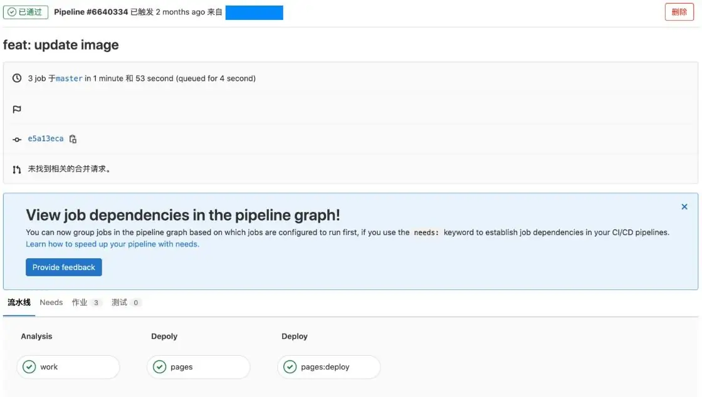

  


分析任务顺利完成，会推送包含报告URL的消息，点击地址就可以查看 [在线报告](https://liangxin199045.github.io/code-demo/) 了（示例）：

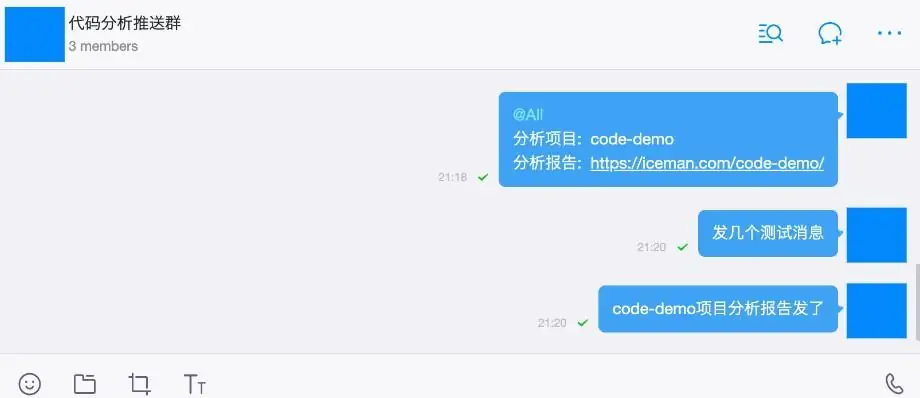

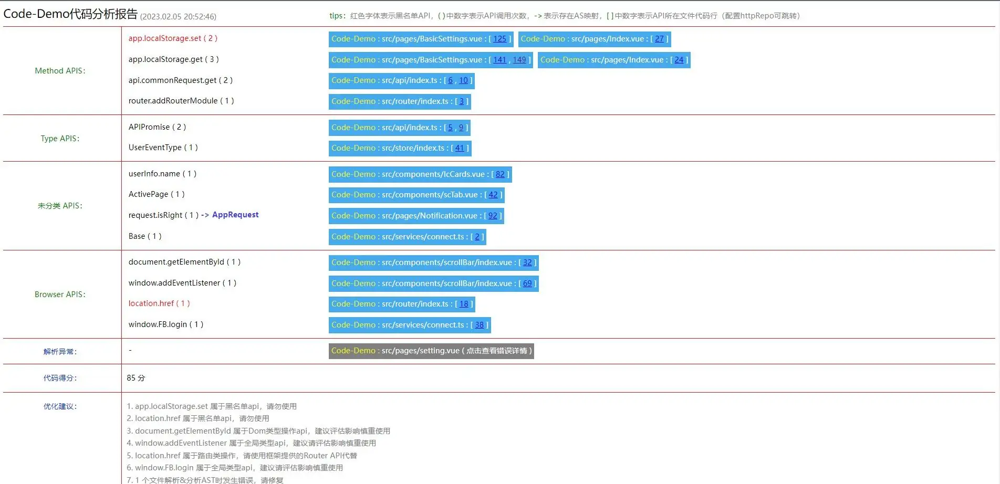

  


如果分析时触发代码告警，则推送告警消息，开发者点击URL可以打开任务流水日志定位问题（示例）：

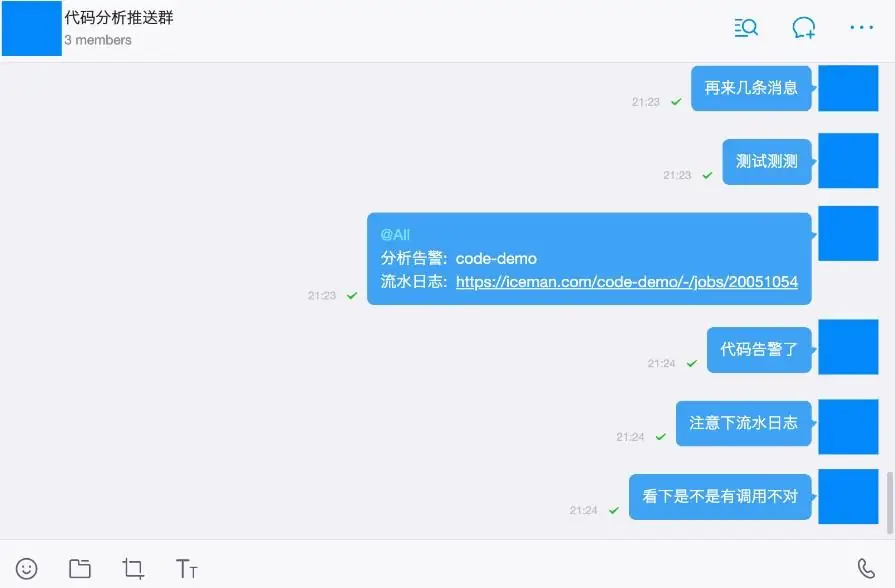

  


## 小结

这一小节我们学习了如何通过代码分析工具实现“脏调用”拦截 & CI 自动化分析，需要大家掌握以下知识点：

  


1.  可以通过 `git hook` 在 `commit` 阶段对存在`“脏调用”`的代码进行拦截，防止其提交，但这种方式可以被绕过，因此我们需要在 Workflow 各个阶段都进行拦截。
1.  `gitLab Pages` 功能可以部署指定目录下的静态资源，这样代码分析报告 html 就能以域名 URL 的方式被访问了。
1.  通过创建定时任务来触发 `gitLab CI` 的 `pipeline`，可以实现 CI 自动化分析。
1.  需要熟练掌握配置 **.gitlab-ci.yml** 文件，它是驱动 `gitLab CI` 工作的基础。