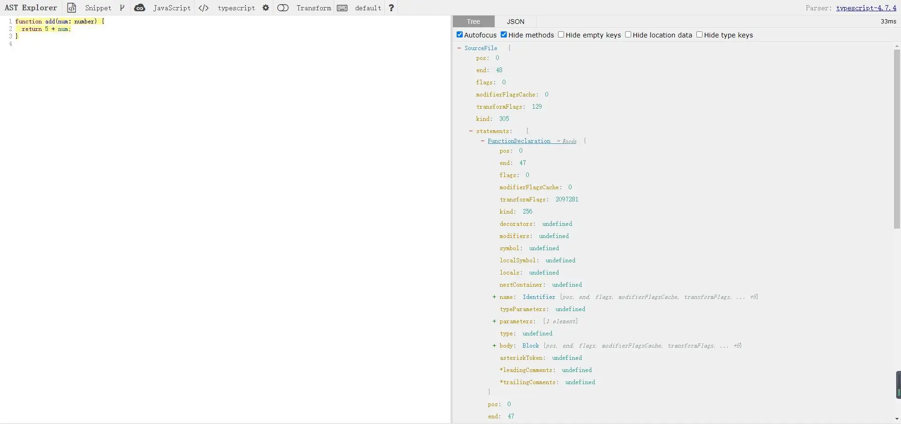
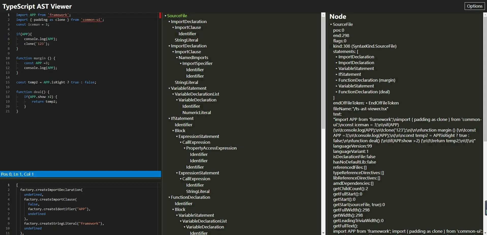
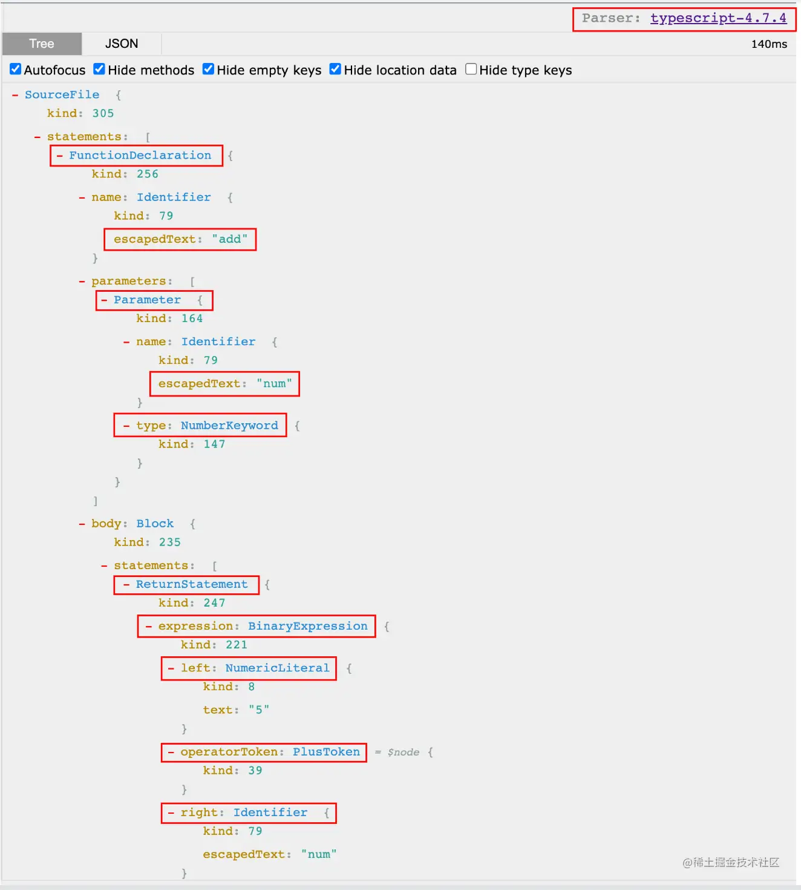

# 2.基础知识：一次搞懂 AST 抽象语法树

理解 AST 抽象语法树是开发代码分析工具的前提，这一节我们将学习 AST 相关的基础知识，主要内容包括 AST 是什么？常见节点有哪些？AST 可视化工具有什么用？AST 有哪些具体用途？以及如何生成 AST。通过这一小节的学习，大家可以一次性搞懂抽象语法树的所有知识，为后续开发分析工具打下坚实基础。


## AST 是什么？

  


> 抽象语法树 (Abstract Syntax Tree)，简称 AST，它是源代码语法结构的一种抽象表示。它以树状的形式表现编程语言的语法结构，树上的每个节点都表示源代码中的一种结构。

  


代码中常见的字面量、标识符、表达式、语句、模块语法、class 语法等语句都有各自对应的 AST 节点类型，下面我们简单介绍下常见的节点类型。


### 常见节点类型

  

1.  literal(字面量) : 本身语义代表了一个值。

```typescript
  let name = 'iceman';       // iceman ---> StringLiteral 字符串字面量
  let age = 30;              // 30     ---> NumberLiteral 数字字面量
  const isMan = true;        // true   ---> BooleanLiteral 布林字面量
  const reg = /\d/;          // /\d/   ---> RegExpLiteral 正则字面量
```

  


2.  Identifier(标识符) : 变量名、属性名、参数名等等一系列声明和引用的名字。

```typescript
  import { request } form 'framework';   // request              ---> Identifier
  let name = 'iceman';                   // name                 ---> Identifier
  const age = 30;                        // age                  ---> Identifier
  function talk(name) {                  // talk, name           ---> Identifier
      console.log(name);                 // console, log, name   ---> Identifier
  }
 const obj = {                          // obj                  ---> Identifier
      name: 'guang'                      // name                 ---> Identifier
  }
```

  


3.  Statement(语句) : 代码执行的最小单位。

```typescript
  return 'iceman';                    // ReturnStatement
  if (age > 35) {}                    // IfStatement
  throw new Error('error')            // ThrowStatement
  try {} catch(e) {}                  // TryStatement
  for (let i = 0; i < 5; i++) {}      // ForStatement
```

  


4.  Declaration(声明) : 声明语句是一种特殊的 Statement。

```typescript
  const listlen = 1;            // VariableDeclaration
  let listName = 'user';        // VariableDeclaration
  function getInfo(info) {      // FunctionDeclaration
      if(info.isRun){
          return info.name;
      }
      return '';
  }         
  class Car {                   // ClassDeclaration
      constructor() {}
      method() {}
  }
```

  


5.  Expression(表达式) : expression的特点是执行完成后会有返回值，这也是它和语句的区别

```typescript
  [1,2,3];                          // ArrayExpression 数组表达式
  age = 1;                          // AssignmentExpression 赋值表达式
  1 + 2;                            // BinaryExpression二元表达式
  var obj = {                       // ObjectExpression对象表达式
      foo: 'foo',     
      bar: function() {}    
  }
  let getName = function (){}       // FunctionExpression函数表达式
  const getAge = (age) => {         // ArrowFunctionExpression箭头函数表达式
      return age;
  };             
```

  


6.  Import : 导入模块，属于一种特殊的声明语句，有三种类型 ImportSpecifier | ImportDefaultSpecifier | ImportNamespaceSpecifier。

```typescript
  import { environment } from 'framework';        // named import
  import { request as req } from 'framework';     // namespaced import
  import api from 'framework';                    // default import
  import * as APP from 'framework';               // namespaced imort
```

  


7.  Export : 导出模块，也属于一种特殊的声明，有三种类型 ExportAllDeclaration | ExportDefaultDeclaration | ExportNamedDeclaration。

```typescript
export * from './iceman';
export default 'iceman';
export const ice = 'iceman';
```

  


每个 AST 节点都有自己的属性，但是它们也有一些公共的属性：

  


- `pos`，AST 节点在代码字符串中索引的起始位置，配合 end 确定节点在代码字符串中的位置（用于唯一性判定）。

- `end`，AST 节点在代码字符串中索引的结束位置，配合 pos 确定节点在代码字符串中的位置（用于唯一性判定）。

- `kind`，用来标记当前 AST 节点的类型，上面列举的节点类型都可以通过 [ts.SyntaxKind](https://github.com/microsoft/TypeScript/blob/v4.7.4/lib/typescript.d.ts#L105) 的定义来查看。

  


这么多节点类型，肯定不可能都记住，我们可以通过一些可视化工具来帮助我们查看 AST 节点信息。

  


### 可视化工具

  


[AST explorer](https://astexplorer.net/) 是一个 AST 可视化工具，通过它可以查看各种编程语言代码解析后的 AST 结构，帮助开发者更直观地观察代码与 AST 节点树具体节点的对应关系，它支持切换各种 parser，可以修改 parse options。



如果想把代码片段对应的 AST 结构分享给别人查看，可以点击 save 按钮保存下来，把 url 分享出去，比如https://astexplorer.net/#/gist/0beb6bb16461e59baf96be02c82df9a0/c92e363f8f037df97a2434d71a5e28c55c4cc1e4


  


[TypeScript AST Viewer](https://ts-ast-viewer.com/) 与 AST explorer 不同，它只用于 TypeScript AST 对象的可视化，除了展示 AST 节点信息外，还会关联节点 TS 编译过程中的 `type`、`symbol` 等信息，后续章节会很频繁的用到这个可视化工具。



上图对应的 [TypeScript AST Viewer URL](https://ts-ast-viewer.com/#code/JYWwDg9gTgLgBAQQApLgMyhEcDkGCGIApgO7QDWOA3AFCiSxwDecY+AJu8AHYDmc+AM5wAxgBsI3InAC+6TNhwisISQFoArsGo1l3QfGAiiIfNzgBeOAGZadNAApkSAJRMaASD2CIYogDoJXicUF1ovCSkHHABGACZrHDCaGRoaNA1uERhgSThTKF4eOAcXZk9veGdLWwrJHz9AiGDnZNTdevgYEzA4y0QUf2BBACVgXgALeAB+OBgoDWkALnR8MUEiOwysnLz2IjXS8o9gR2d-QQmIEjgAPjiy9w8PKCIYDShzbvA48NSZIA)。举个例子：

```typescript
// 示例代码
function add(num: number) {
  return 5 + num;
}
```

  


上面是一段 TS 代码，内容是声明了一个名为 add 的函数，代码对应的 [AST explorer URL](https://astexplorer.net/#/gist/0beb6bb16461e59baf96be02c82df9a0/c92e363f8f037df97a2434d71a5e28c55c4cc1e4)，使用 TypeScript 编译器转化为 AST 对象以后，右侧的 AST 树信息如下图（图中简化隐藏了非关键节点，方便讲解重要节点）：

  




AST 对象简化为 JSON 对象的话：

```json
{
    kind: 305,
    statements: [{
        kind: 256,
        name: {
            kind: 79,                                // Identifier
            escapedText: 'add'
        },
        parameters: [{
            kind: 164,                               // Identifier
            name: {
                kind: 79,                            // Identifier
                escapedText: 'num'
            },
            type: {
                kind: 147                            // NumberKeyword
            }
        }],
        body: {
            kind: 235,
            statements: [{
                kind: 247,
                expression: {
                    kind: 221,
                    left: {
                        kind: 8,
                        text: '5'
                    },
                    operatorToken: {
                        kind: 39
                    },
                    right: {
                        kind: 79,                    // Identifier
                        escapedText: 'num'
                    }
                }
            }]
        }
    }]
}
```

SourceFile 可以理解成 AST Root 节点，如果把它命名为 ast，我们可以获取如下信息：

```typescript
ast.statements[0].kind                                // 节点类型为函数声明
ast.statements[0].name.escapedText                    // 函数名称
ast.statements[0].parameters[0].name                  // 函数的首个参数名
ast.statements[0].parameters[0].type.kind             // 函数的首个参数类型为Number
ast.statements[0].body.statements[0].kind             // 函数体内第一行是return语句
ast.statements[0].body.statements[0].expression.kind  // 函数返回值为二元运算符表达式结果
```

  


既然代码的含义可以通过 AST 来表述，而 AST 又可以理解为一个 JS 对象，那我们是不是可以通过程序代码对其进行处理，从而实现分析代码的目的呢？答案是肯定的，那么 AST 具体有哪些用途呢？

  


## AST 有什么用？

  


### 代码编译

- `Babel`，将 ES6 JavaScript 转化为 ES5 JavaScript。

- `TypeScript`，将 TypeScript 转化为 JavaScript。

- `Sass`，将 Sass 转化为 CSS。

  


### 代码加工

- `Prettier`，代码美化，风格格式化。

- `ESLint`, 修复语法错误。

- `uglifyJS`，代码压缩，混淆。

- `@vue/compiler-dom`，可以将 Vue 文件代码拆分成 template、script、style 三种代码类型片段。

  


### 代码分析

- `ESLint`，代码语法检查。

- `Webpack`，代码模块打包分析。

  


基于 AST 的代码处理工具工作流程一般可以概括为 4 个阶段：


1.  **Parsing（解析）** ：这个过程由编译器实现，会经过词法分析和语法分析两个过程，生成 `AST` 。

2. **Traversing（遍历）：** 深度优先遍历 `AST` ，访问树上各个节点的信息（Node）。

3. **Transforming（修改）：** 在遍历的过程中可对节点信息进行修改/转化，生成新的 `AST` 。

4. **Printing（输出）：** 将转化后新的 `AST` 输出成新的代码块。

  


代码编译，代码加工一般会经历 1，2，3，4 四个阶段，而代码分析因为不会去改变源代码，所以一般只经历 1，2 两个阶段。比如 ESLint 仅检查语法错误时，只需要对 AST 各级节点进行遍历，定位违反语法规则的节点信息并标记，返回修复建议即可，不需要对代码作出修改和再输出。

  


我们要开发的分析工具也属于代码分析类，核心工作也是对 AST 各级节点进行遍历分析并返回分析结果，那么如何生成 AST 呢？

  


## AST 如何生成?


生成 AST 包含两个步骤：

-   词法分析：将整个代码字符串分割成最小语法单元数组。
-   语法分析：在分词基础上建立分析语法单元之间的关系。

  


### 词法分析

> 将输入的源代码字符串，生成一系列词法单元 (Tokens)，这些词法单元包括数字，标点符号，运算符等，这些词法单元之间都是独立的。

  


词法分析的过程就像是我们刚开始学习汉语造句时，通常会先将一个句子拆分成很多独立的单词，然后先记住每一个单词的类型和含义，并不关心单词之间的具体联系。

  


### 语法分析

> 将词法分析出来的 Token 按照不同的语法结构如声明语句、赋值表达式等转化成有语法含义的抽象语法树结构。

  


举个例子：

```typescript
const iceman = 'good boy';
```

  


`const iceman = 'good boy';` 上面这一段源代码字符串，先把它按照单词的构成规则分成一个个不能再细分的单词（Token），也就是 `const`、`iceman`、`=`、 `'good boy'`，这个过程是词法分析。之后把 Tokens 按照声明语句、赋值表达式的语法结构如进行递归组装，生成 AST 对象，这个过程是语法分析。

  


  


### 编译器 Parser

[AST explorer](https://astexplorer.net/) 可视化工具的实现原理是通过调用对应开发语言 Parser 的 CompilerAPI，将代码解析为 AST 对象再进而遍历展示。也就是说，这些 Parser 的 API 可以帮助我们完成代码的词法分析与语法分析，并返回对应的 AST 对象，下面是常用的 JS Parser 与 TS Parser。

  


- JS Parser： [esprima](https://link.juejin.cn/?target=https%3A%2F%2Fgithub.com%2Fjquery%2Fesprima)、 [acorn](https://link.juejin.cn/?target=https%3A%2F%2Fgithub.com%2Facornjs%2Facorn)、 [espree](https://link.juejin.cn/?target=https%3A%2F%2Fgithub.com%2Feslint%2Fespree)、[@babel/parser](https://link.juejin.cn/?target=https%3A%2F%2Fgithub.com%2Fbabel%2Fbabel%2Ftree%2Fmaster%2Fpackages%2Fbabel-parser)。

  

- TS Parser：[typescript](https://github.com/microsoft/TypeScript/#readme)

  


TS Parser 可以同时解析 JS(X) 和 TS(X) 代码文件，所以我们代码分析工具选择的 Parser 是 [typescript](https://github.com/microsoft/TypeScript/#readme)，后续的课程我们会对用到的 Typescript CompilerAPI 进行详细讲解，这里先介绍生成 AST 的几个 API：

  


1. `createSourceFile`：根据 TypeScript 代码字符串生成 AST 对象，[AST explorer](https://astexplorer.net/) 的底层原理就是通过这个方法将代码片段字符串转化为 AST 做可视化处理。

```typescript
// TS编译器
const tsCompiler = require('typescript');

// 待分析代码片段字符串
const tsCode = `import { app } from 'framework';                                

const dataLen = 3;
let name = 'iceman';

if(app){
    console.log(name);
}

function getInfos (info: string) {
    const result = app.get(info);
    return result;
}`;
 
// 第一个参数为命名，可以随意填，
// 第二个参数是需要生成AST的源代码字符串
// 第三个参数表示TS编译器版本
// 第四个参数表示是否添加parent节点信息
const ast = tsCompiler.createSourceFile('xxx', tsCode, tsCompiler.ScriptTarget.Latest, true);
console.log(ast);
```

  


2. `createProgram`，`getSourceFile`：先创建 program 编译上下文，然后获取指定代码文件的 AST 对象，program 可以抽象成一次完整的 TS 编译过程，通过它可以获取编译过程的上下文信息。

```typescript
// TS编译器
const tsCompiler = require('typescript');

// 创建Program
// fileNames参数表示文件路径列表，是一个数组
// options参数是编译选项，可以理解成tsconfig
const program = tsCompiler.createProgram(fileNames, options);

// 从 Program 中获取某个文件的 SourceFile
// fileName表示某一个文件路径
const ast = program.getSourceFile(fileName);
console.log(ast);
```

  


上面两种方式都可以生成 AST，区别在于前者仅仅是将一段 TS 代码字符串解析成 AST，因为不存在 program，所以无法获取编译上下文信息，只能通过遍历 AST 实现一些简单分析场景。而后者通过 program 获取更多编译上下文信息，可以实现更细致的分析场景，代码分析工具采用后者来获取 AST。

  


## 小结

这一小节我们学习了 AST 相关的知识，需要大家掌握以下知识点：

  


1.  了解 AST 及常见节点类型，学会使用 [AST explorer](https://astexplorer.net/)、[TypeScript AST Viewer](https://ts-ast-viewer.com/) 两个可视化工具观察 AST。
1.  代码的含义可以通过 AST 对象来表述，所以通过程序代码对其进行处理，就可以实现代码分析的目的。
1.  AST 是开发各种代码处理工具的前提，代码分析类工具一般只需要经历 **Parsing** **和** **Traversing** 两个阶段。
1.  获取 AST 对象需要学习对应语言的编译器 Parser，可以通过 TS parser 的 CompilerAPI 来获取 TS/JS 代码的 AST。

  


> 如果大家对 AST 及相关概念还想有进一步的学习，可以参考以下延伸阅读：
>
> https://juejin.cn/post/6844903798347939853#heading-58
>
> https://jkchao.github.io/typescript-book-chinese/compiler/program.html