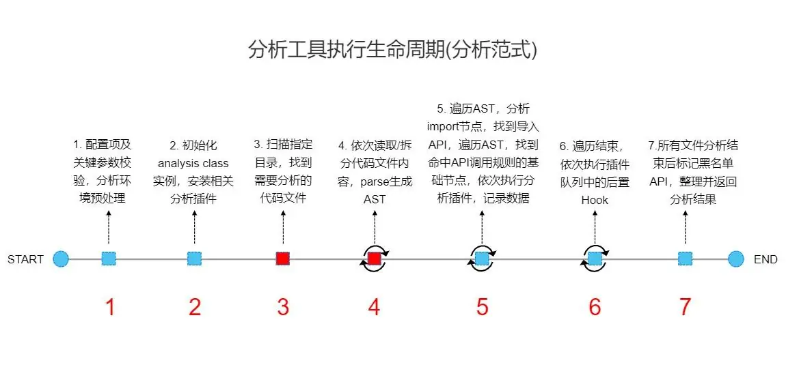
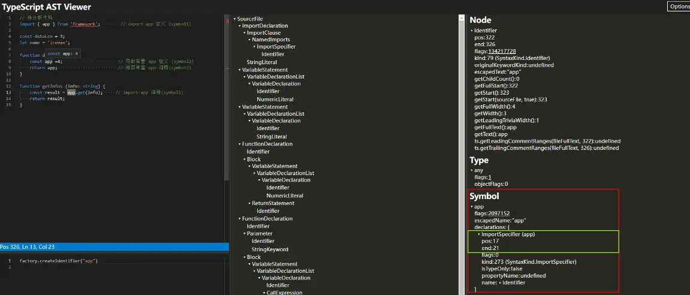
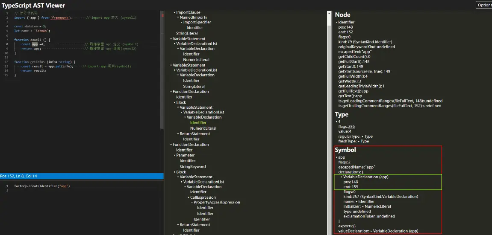
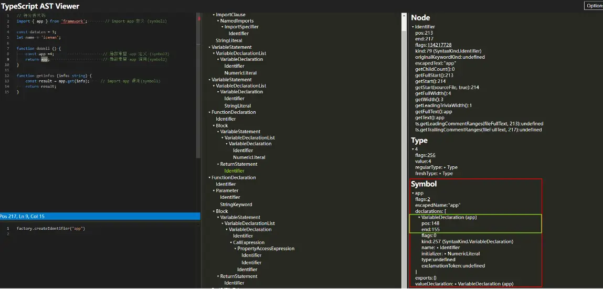

# 5.具体实现：扫描 & 解析 TS 文件



上一节课我们学习了代码分析工具的基础架构 & 分析范式，并基于此捋顺了后续课程的讲解顺序。这一节我们主要来讲解分析范式中 `step3`、`step4` 的实现细节，大家可以结合 [analysis](https://github.com/liangxin199045/code-analysis-ts/blob/main/lib/analysis.js) 模块中的 `_scanCode`，`_scanFiles` 方法以及 [file](https://github.com/liangxin199045/code-analysis-ts/blob/main/lib/file.js) 与 [parse](https://github.com/liangxin199045/code-analysis-ts/blob/main/lib/parse.js) 这两个模块来理解本节内容。

根据配置扫描所有需要分析的 TS 文件是代码分析的前提，这个很好理解，如果连要分析的代码文件在哪都不知道，又何谈去分析呢？

  


## 扫描 TS 文件

扫描代码文件就是遍历指定目录，找出目录及其子目录下所有特定类型的文件（如：TS 文件、Vue 文件），并返回这些文件的目录路径信息。

### glob
这里介绍一个实现文件目录扫描常用的 node 工具库 [glob](https://www.npmjs.com/package/glob)，它支持配置通配符规则的方式来扫描文件目录，像在 shell 里执行命令一样，获取匹配对应规则的文件。

举个例子：

```typescript
const tsFiles = glob.sync(path.join(process.cwd(), `src/**/*.ts`));
```

上述代码演示了如何寻找 src 目录及子目录下所有的 TS 文件，要注意的一点是，这里的 src 目录指的是执行上述脚本代码时所在的工作目录，很多初学者会混淆在 node 环境中获取路径的两种方式：

  


`__dirname` 表示当前被执行脚本文件所在的目录的绝对路径 ——脚本文件所在目录

`process.cwd()` 返回运行当前脚本的工作目录的路径 —— 脚本文件执行目录

  


分析工具是以 npm 包的形式对外提供，在被安装后通常是在项目的 node_modules 目录（`脚本文件所在目录`）下，但是需要分析的代码文件往往在项目的其他目录中，所以执行分析工具脚本的工作目录与安装目录并不一致。

  


举个例子：对于 d:\dir\index.js

```typescript
console.log(`cwd: ${process.cwd()}`);
console.log(`dirname: ${__dirname}`);
```

|                   | process.cwd() | __dirname |
| ----------------- | ------------- | ---------- |
| node index.js     | d:\dir        | d:\dir     |
| node dir\index.js | d:            | d:\dir     |

  


### File 模块

搞清楚实现原理后，我们把扫描 TS 代码文件的方法封装成函数放在 `file` 模块中：

```typescript
// 扫描TS文件
exports.scanFileTs = function(scanPath) {
    const tsFiles = glob.sync(path.join(process.cwd(), `${scanPath}/**/*.ts`));
    const tsxFiles = glob.sync(path.join(process.cwd(), `${scanPath}/**/*.tsx`));
    // console.log(tsFiles);
    // console.log(tsxFiles);
    return tsFiles.concat(tsxFiles);
}
```

`scanFileTs` 函数以 scanPath 作为入参，用于扫描 scanPath 目录及其子目录下所有的 TS、TSX 文件，并返回它们的文件路径信息。

  


扫描文件是一种基础通用能力，它的实现方式也多种多样，封装在独立的 file 模块中，codeAnalysis 在需要扫描文件的时候只需要引入 file 模块并调用其相关方法就可以了，不需要了解其具体实现细节，单独修改它也不会影响到 codeAnalysis 的分析逻辑。

  


## 解析 TS 文件

  


在扫描找到所有需要分析的 TS 代码文件后，接下来我们要将代码文件中的 TS 代码解析为 AST 对象，在第 2 节课程中，我们学习了如何通过 TypeScript Parser 的 Compiler API 来生成 AST，不过在此之前，我们有必要先了解下 TypeScript 的编译原理。

  


### TypeScript 编译原理

TS 编译器相关源码位于 [src/compiler](https://github.com/Microsoft/TypeScript/tree/main/src/compiler) ，主要包含 `scanner` 扫描器（scanner.ts），`parser` 解析器（parser.ts），`binder` 绑定器（binder.ts），`checker` 检查器（checker.ts），`emitter` 发射器（emitter.ts）这 5 部分。

  


编译流程可以简化为下图：


相关概念：

  


1.  **Program :** 在编译开始时创建为一个名为 Program 编译上下文对象，通过 `编译选项` 和 `输入文件`（<mark>1个或多个，我们进行单文件分析时通常只传 1 个</mark>）这两部分配置，加载所有输入文件以及输入文件中 imports 导入的文件（ps : 加载很多文件是因为在编译过程中会进行类型检查，而类型信息可能需要结合多个文件得出）。
1.  **Tsconfig :** TypeScript 编译配置信息，其实就是 TS 项目中的 `tsconfig.json` 配置文件。
1.  **Tokens :** `Scanner` 扫描源代码进行词法分析后生成的 `Token` 流。
1.  **AST :** `Parser` 将 `Token` 流进行语法分析，生成 `AST` 对象。
1.  **Symbol :** `Binder` 会创建一个用来存储每个 `AST` 节点和对应符号 `Symbol` 的映射表，当初次定义或者从 import 导入一个变量、函数或类时，会为其创建一个符号（唯一标识符），当在其他地方使用相同名称时，就查表找出这个名称所代表的符号, 通过 symbol 可以判定 AST 节点的语义上下文。
1.  **Checker :** `Checker` 用来检查代码中变量的类型信息，提供了一些 API 获取节点类型及关联信息。
1.  **Emitter :** 处理 Node 节点，将 AST 转化为 js、d.ts、map等编译产物，代码分析不会涉及此阶段，可暂时忽略它。

  


上面的流程也可以概括为以下四个阶段：

```
// 1.解析代码生成AST对象
SourceCode（源码）~~ 扫描器 ~~> Token 流 ~~ 解析器 ~~> AST

// 2.为AST节点绑定符号
AST ~~ 绑定器 ~~> Symbols

// 3.语义检查，类型检查
AST + Symbols ~~ 检查器 ~~> 类型验证，语义上下文判断

// 4.代码生成阶段（代码分析不需要关注这个阶段）
AST + 检查器 ~~ 发射器 ~~> JavaScript 代码 （无需关注）
```

  


第一阶段我们只需要掌握如何通过 Parser 的 Compiler API 生成 `AST` 即可，第二、第三阶段会涉及 `Symbol` 这个概念，它会贯穿第 `5`、`6`、`7` 这 3 节课程，是 API 调用分析的基础，接下来我们详细了解下 `Symbol` 的作用。

  


### Symbol

`Symbol` 正如其名就是一个标志。同一个文件中，两个不同的函数里面定义了名称相同的变量，它们属于不同的 `Symbol`，如果有两个文件， a.ts 导出的变量 app 在 b.ts 里使用，那这个 app 在两个文件中对应的是同一个 `Symbol`。

  


我们在实现简易分析脚本的时候，没法判断下面示例代码中 getInfos 函数中的 `app` 与 doWell 函数中的 `app` 有什么区别，有了 Symbol 就可以区分它们了。示例代码：

```typescript
// 待分析代码
import { app } from 'framework';        // import app 定义 (symbol1)

const dataLen = 3;
let name = 'iceman';

function doWell () {
    const app =4;                      // 局部常量 app 定义 (symbol2)
    return app;                        // 局部常量 app 调用(symbol2)
}

function getInfos (info: string) {
    const result = app.get(info);     // import app 调用(symbol1)
    return result;
}
```

在 `Symbol Table` 中，每个 AST 节点都有唯一对应的符号 Symbol，相同语义上下文的 AST 节点拥有相同 Symbol，并且该 Symbol 指向第一次声明该变量的 AST 节点。

  


什么意思呢？我们把上面的示例代码放入 [TypeScript AST Viewer](https://ts-ast-viewer.com/#code/PTAElD9QwJUBPNGO5RADwFAEsC2AHA9gJwC6gG9QBDddUAX1ADNtNVQByW41AUwHccBrRgblCChgkKDRY8JMqEBZ2oEk5UAAoAzgE9UAI0wAbAIwBKRIgDGmAHbL8AE2K5iAGTZnQAXlABmPom1t8Z1myuTMjGbKjEZvxG1ACuZsa4yOagVpgA6mza2kr6hIjCphb4pOQuACwCwlXV1aKAAjqAFwmAHHqA84lS5PJKapo6AEyGwti+MdjOJZU1kzX1zW0loIDAMYAUrirqWtr9iBTRcQlJzgDmvgCSZtSYykrIZ5gAXKCW2NcHuQT5QoWWoEPKMdr4bhKADojrhFNdzvoJiIwOIcMVpMtVj09AMhENcCNnD8-rgvBQgA)，可以在右下角看到 AST 节点对应的 Symbol 信息，Symbol 对象的 declarations 属性中第一个元素指向的就是当前节点的声明节点。

  


（1）第 2 行中 app 节点的 Symbol 信息：


（2）第 13 行中 app 节点的 Symbol 信息：



（3）第 8 行中 app 节点的 Symbol 信息：



（4）第 9 行中 app 节点的 Symbol 信息：



  


我们可以发现第 2 行中的 app 与 第 13 行中的 app 拥有相同 `Symbol1`，且 `Symbol1` 指向在第 `2` 行中由 import 语句引入的 app 声明节点。而第 8 行，第 9 行中的 app 拥有相同 `Symbol2`，且 `Symbol2` 指向第 `8` 行中的 app 声明节点，所以由此证明 doWell 中的 app 并非从 framework 中引入，属于局部常量，应该排除。

(上图绿框内的 `pos`，`end` 属性值可作为`声明节点`的唯一性表述信息)

  


既然 Symbol 如此重要，那么如何获取 AST 节点对应的 Symbol 呢？可以通过 Compiler API 。在 第 2 节课程介绍 AST 相关知识的时候，我们学习了 `createProgram`、`getSourceFiles` 这 2 个 API：

  


1.  `ts.createProgram`，创建 Program 编译上下文，是 TS 代码分析的基础；
1.  `program.getSourceFiles`，通过 Program 获取代码文件对应的 SourceFile 对象，也就是 AST。

  


想获取 Symbol，需要通过 program 获取 Checker 对象，再由 Checker获取 Symbol ，需要学习 2 个新 API：

  


1.  `program.getTypeChecker`，用于通过 program 获取 Checker 控制器，该控制器用来类型检查、语义检查等；
1.  `typeChecker.getSymbolAtLocation`，用于查询 Symbol table，获取指定 AST 节点相关联的 Symbol 信息。

  


获取 Symbol 的代码示例：

```typescript
// TS编译器
const tsCompiler = require('typescript');
// 创建Program
// fileNames参数表示文件路径列表，是一个数组，可以只传1个文件
// options参数是编译选项，可以理解成tsconfig
const program = tsCompiler.createProgram(fileNames, options);
// 从 Program 中获取 SourceFile 即 AST对象
// fileName表示某一个文件路径
const ast = program.getSourceFile(fileName);
// 获取 TypeChecker控制器
const checker = program.getTypeChecker();
// 获取 AST node节点对应的symbol
const symbol = checker.getSymbolAtLocation(node);
```

  


可见想要进行代码分析，仅仅获取 AST 是不够的，还需要一些编译上下文信息，控制器对象等。

  


### Parse 模块

基于以上所学的编译知识，我们封装一个名为 `parseTs` 用于解析指定 TS 文件并返回 ast、checker 控制器（ 用于获取 Symbol ）的函数，并把它放在 [parse](https://github.com/liangxin199045/code-analysis-ts/blob/main/lib/parse.js) 模块中。

```typescript
// 解析ts文件代码，获取ast，checker
exports.parseTs = function(fileName) {
    // 将ts代码转化为AST
    const program = tsCompiler.createProgram([fileName], {})
    const ast = program.getSourceFile(fileName);
    const checker = program.getTypeChecker();
    // console.log(ast);
    return { ast, checker };
}
```

  


## codeAnalysis 相关逻辑

上面我们学习了扫描 TS 文件，解析 TS 文件相关的知识，并将实现逻辑封装到了 `file` 模块和 `parse` 模块中，接下来我们看下 codeAnalysis 是如何使用它们的。

  


### 扫描文件

`_scanFiles` 函数是 codeAnalysis 基础类扫描代码文件的核心方法，它根据配置文件中的 `scanSource` 配置项扫描指定目录下的代码文件，返回满足条件的代码文件路径信息，下面是简化后的演示片段：

```typescript
const { scanFileTs } = require(path.join(__dirname, './file'));  // 文件操作

// 扫描文件
_scanFiles(scanSource, type) {
    let entrys = [];
    scanSource.forEach((item)=>{
      ......
      const entryObj = {
        name: item.name,
        httpRepo: item.httpRepo
      }
      let parse = [];
      const scanPath = item.path;
      scanPath.forEach((sitem)=>{
        ......
        let tempEntry = [];
        tempEntry = scanFileTs(sitem);
        parse = parse.concat(tempEntry);
        ......
      })
      entryObj.parse = parse;
      entrys.push(entryObj);
      ......
    })
    // console.log(entrys);
    return entrys;
}
```

用演示片段来讲述是想让大家只关注当前章节的内容即可，它与完整的源码肯定会有差异。上述片段完整源码实现请参考 [lib/analysis.js](https://github.com/liangxin199045/code-analysis-ts/blob/main/lib/analysis.js)。

  


### 解析文件

`_scanCode` 是 codeAnalysis 驱动扫描文件，分析代码相关逻辑的核心方法，它还会关联 `step5` 中的几个重要方法 `_findImportItems`，`_dealAST`，下面是简化后的演示片段：

```typescript
const { parseTs } = require(path.join(__dirname, './parse')); // 解析模块

// 扫描文件，分析代码
_scanCode(scanSource, type) {
    let entrys = this._scanFiles(scanSource, type);
    // console.log(entrys);
    entrys.forEach((item)=>{
        const parseFiles = item.parse;
        if(parseFiles.length>0){
            parseFiles.forEach((element, eIndex) => {
                ......
                const { ast, checker } = parseTs(element);  // 解析ts文件代码,将其转化为AST                                                                                                  
                this._findImportItems();                    // 遍历AST分析import节点
                if(Object.keys(importItems).length >0){
                      this._dealAST(importItems, ast, ...)  // 遍历 AST 分析 API 调用
                  }
                ......
            });
        }
    })
}
```

上述片段完整源码实现请参考 [lib/analysis.js](https://github.com/liangxin199045/code-analysis-ts/blob/main/lib/analysis.js)。

  


## 小结

这一小节我们学习了如何扫描 & 解析 TS 文件，也就是分析范式中 `step3` 和 `step4` 的实现原理，需要大家掌握以下知识点：

  


1.  掌握 `__dirname` 与 `process.cwd()` 在node环境中获取路径时的区别，后续很多代码会涉及获取文件路径的逻辑，弄清楚才可以更好的阅读源码。
1.  基于 `glob` 我们实现了用于扫描 TS（TSX）代码文件的 `scanFileTs` 函数，并将其放在了 file 模块中。
1.  理解 Typescript 编译原理及相关控制器的用途，学会获取 `Symbol`， 因为它可以帮助我们判定 AST 节点的语义上下文，这一点很重要。
1.  掌握 codeAnalysis 中 `_scanFiles` 函数的实现，结合 `_scanCode` 理解 `step3` 和 `step4` 在分析流程中的重要性。

  


接下来的 3 节我们会针对 `step5` 的实现原理展开学习，主要讲解 API 调用分析最核心的逻辑实现，也就是上面提到的 `_findImportItems` 和 `_dealAST` 等函数的具体实现原理。