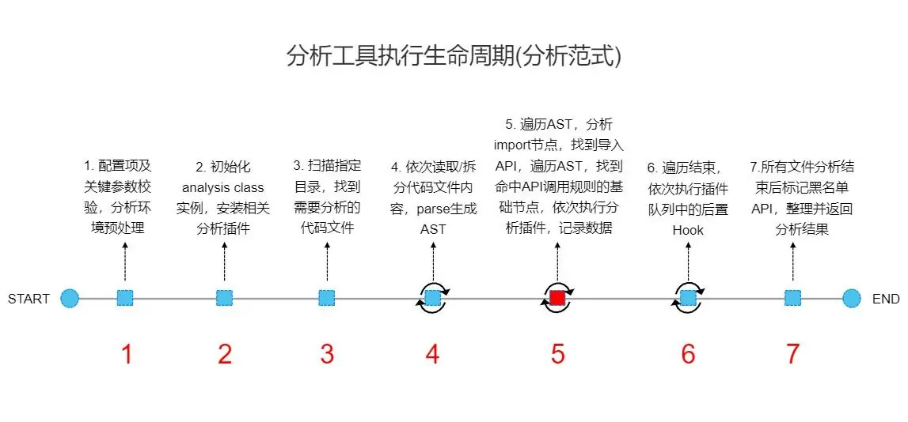
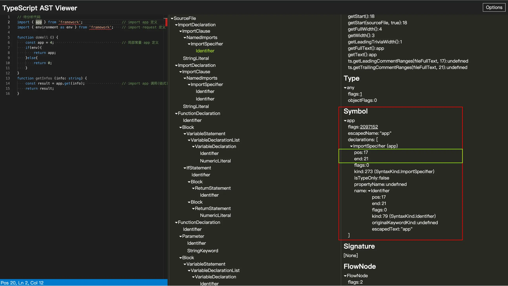
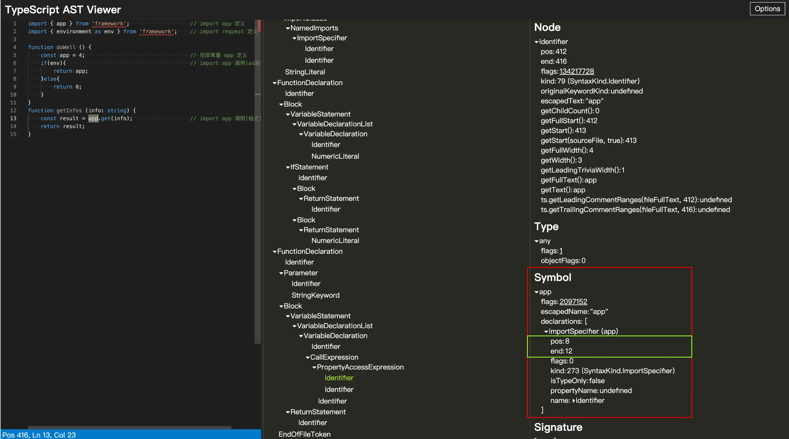
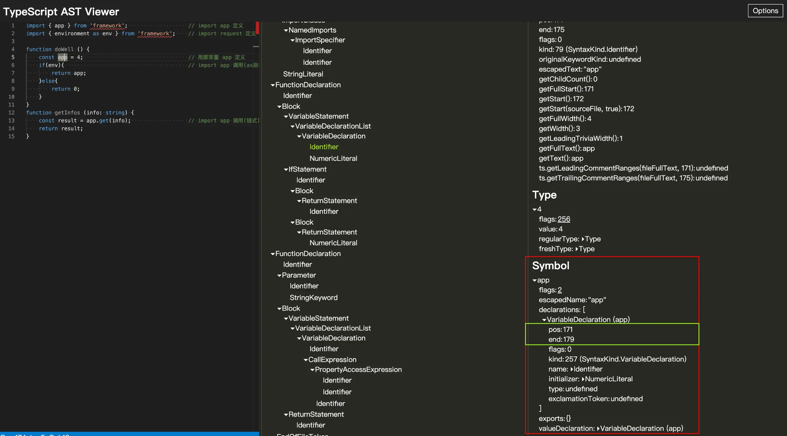
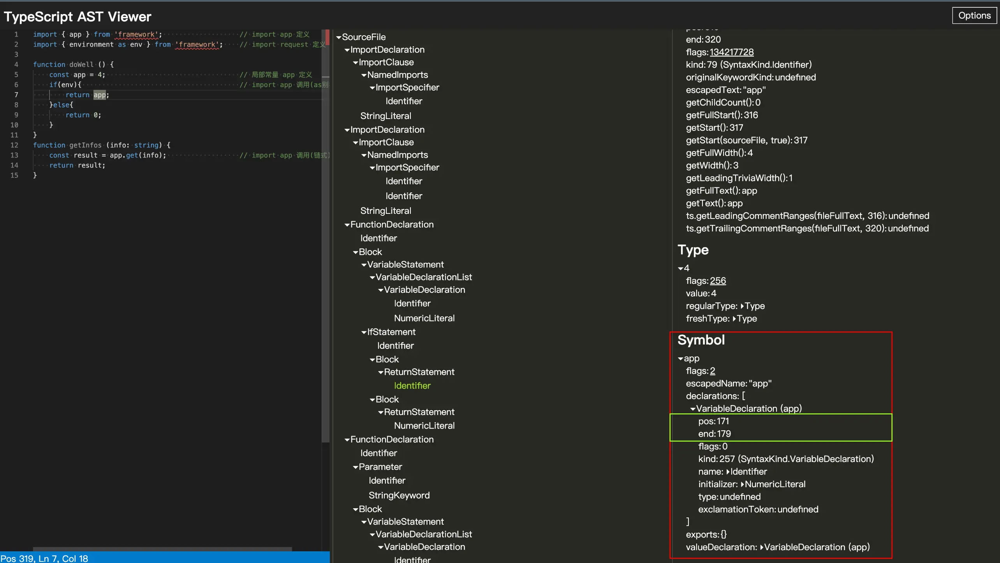
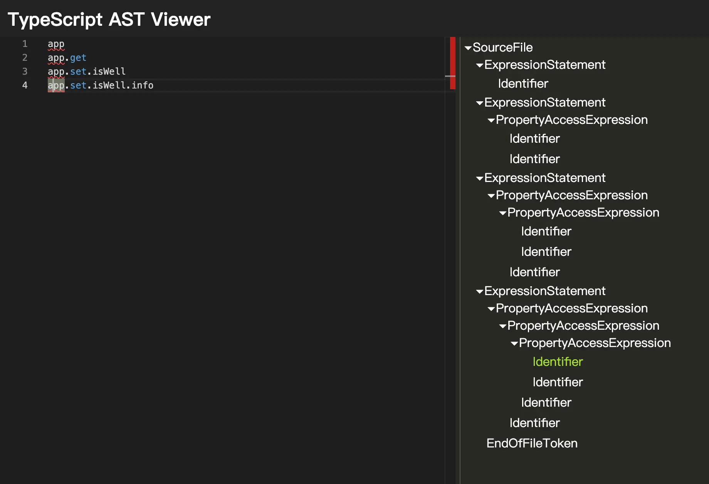
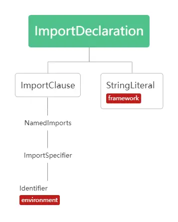
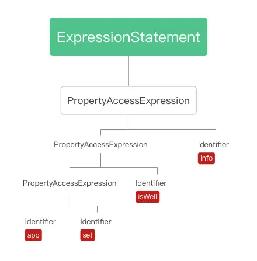
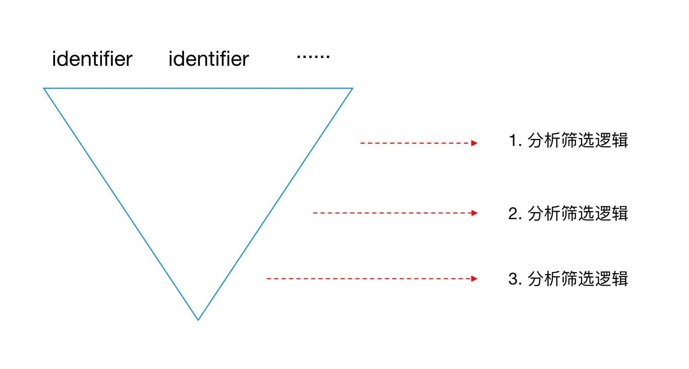

# 7.具体实现：判定 API 调用

依赖调用分析需要对代码文件 AST 进行两轮遍历分析，上一节我们主要讲解了如何分析 Import 节点，也就是第一轮遍历， 分析 Import 节点是为了搞清楚有哪些 API 被导入，同时收集这些导入 API 的相关信息。



这节课我们来讲解 `step 5` 中的第二个小步骤，即如何判定代码中存在 API 调用，这一步会用到上节课收集的 API 信息，课程内容涉及 codeAnalysis 中 `_dealAST` 函数的实现原理，完整源码可参考 [lib/analysis.js](https://github.com/liangxin199045/code-analysis-ts/blob/main/lib/analysis.js) 。

  


在学习第 3 节课时，我们实现了一个分析 TS 代码中 API 调用的分析脚本，虽然存在一些缺陷，但通过遍历所有 `identifier` 类型节点名称与 Import API 名称进行相等判断这个逻辑是成立的，我们这一节要讲的内容可以理解为对那个分析脚本的进一步完善。

  


## 遍历 Identifier 节点

首先，基于原先简易的分析脚本搭建 `_dealAST` 函数的雏形，`_dealAST` 函数是 AST 分析的核心函数，完整的代码会涉及很多其它课程内容，同样建议大家在学完全部课程后再去阅读完整源码，下面的简化版剔除了不相干的代码，让大家更专注于当前小节的内容，相关代码如下：

```typescript
const tsCompiler = require('typescript');         // TS编译器

// ImportItems 是上一节课程中Import节点分析的结果Map
// ast 表示代码文件解析后的ast
// checker 编译代码文件时创建的checker
_dealAST(ImportItems, ast, checker, baseLine = 0) {
    const ImportItemNames = Object.keys(ImportItems);    // 获取所有导入API信息的名称
    
    // 遍历AST
    function walk(node) {
      // console.log(node);
      tsCompiler.forEachChild(node, walk);

      // 判定当前遍历的节点是否为isIdentifier类型节点，
      // 判断从Import导入的API中是否存在与当前遍历节点名称相同的API
      if(tsCompiler.isIdentifier(node) 
          && node.escapedText 
          && ImportItemNames.length>0 
          && ImportItemNames.includes(node.escapedText)) {        
          // 过滤掉不相干的 Identifier 节点后
      }
    }

    walk(ast);
}
```

当前的判定条件只能说明，代码文件从 Import 导入的 API 中包含与遍历的 Identifier 节点名称相同的 API。也就是说，目前的判断条件找到的是所有与导入 API 同名的 Identifier 节点，这只能用于过滤一些不相干的节点，不能证明满足条件的节点都属于 API 调用。

  


与第 3 节课中的简易分析脚步一样，目前的 `_dealAST` 函数存在 3 个问题：

  


1.  无法排除 Import 中同名节点的干扰。
1.  无法排除局部声明的同名节点的干扰。
1.  无法检测 API 属于链式调用还是直接调用。

  


举个例子：

```typescript
// 待分析代码
Import { app } from 'framework';                   // Import app 定义
Import { environment as env } from 'framework';    // Import request 定义

function doWell () {
    const app = 4;                                 // 局部常量 app 定义
    if(env){                                       // Import app 调用(as别名)
        return app;
    }else{
        return 0;
    }
}
function getInfos (info: string) {
    const result = app.get(info);                  // Import app 调用(链式) 
    return result;
}
```

目前 `_dealAST` 函数的 API 调用判定逻辑找到的 `app` 调用会有 4 处（第 2、6、8、14 行 ），它无法排除上述示例代码中第 `2` 行即 Import 节点中 `app` 的干扰，也无法排除 doWell 函数中定义的局部常量 `app` 的干扰，同时无法检测 `14` 行中 app 调用方式是直接调用还是链式调用。

  


接下来我们想办法解决这些问题，让 `_dealAST` 判定逻辑更健壮、更准确。

  


## 排除 Import 中同名节点干扰

我们在之前的课程中提到过，每个 AST 节点都具备的公共属性有 `pos`、`end`、`kind`，其中 `pos` 表示该节点在代码字符串流中索引的起始位置，`end` 表示该节点在代码字符串流中索引的结束位置，`pos` 与 `end` 属性可以用来做节点的唯一性判定。

  


举个例子：

```typescript
Import { app } from 'framework';                   // Import app 定义
```

上述代码放入 [AST explorer](https://astexplorer.net/?spm=taofed.bloginfo.blog.3.3ba15ac8enL4hJ#/gist/f0f498345c3f04ceb8c45d37b0068f2c/684e85493fa9401b2d2ee5a8a3651b37d7bdbb28)，可以看到 `app` 这个 Identifier 类型节点的 pos 属性值为 8，end 属性值为 12，表明 `app` 在上述代码字符串中索引的起始位置是 8，结束位置是 12。因为 AST 节点在代码字符串中的索引位置是唯一且固定的，所以 8，12 就可以用来标识这个 `app` 在代码中的唯一性。

  


那想要排除 Import 语句中同名节点的干扰就变得非常容易了，在遍历所有 Identifier 类型节点时，如果发现当前节点的 `pos` 和 `end` 属性值与 Import 节点分析后得到的 API 信息中的 `identifierPos` 和 `identifierEnd` 属性值一致，则说明遍历到了 Import 中的同名节点，跳过即可，相关逻辑如下：

  


```typescript
const tsCompiler = require('typescript');         // TS编译器

// ImportItems 是上一节课程中Import节点分析的结果Map
// ast 表示代码文件解析后的ast
// checker 编译代码文件时创建的checker
_dealAST(ImportItems, ast, checker, baseLine = 0) {
    const ImportItemNames = Object.keys(ImportItems);    // 获取所有导入API信息的名称
    
    // 遍历AST
    function walk(node) {
      // console.log(node);
      tsCompiler.forEachChild(node, walk);

      // 判定当前遍历的节点是否为isIdentifier类型节点，
      // 判断从Import导入的API中是否存在与当前遍历节点名称相同的API
      if(tsCompiler.isIdentifier(node) 
          && node.escapedText 
          && ImportItemNames.length>0 
          && ImportItemNames.includes(node.escapedText)) {        
            // 过滤掉不相干的 Identifier 节点后
            const matchImportItem = ImportItems[node.escapedText];
            // console.log(matchImportItem);
            if(node.pos !=matchImportItem.identifierPos 
                && node.end !=matchImportItem.identifierEnd){     
                // 排除 Import 语句中同名节点干扰后
            }
      }
    }

    walk(ast);
}
```

  


## 排除局部声明的同名节点干扰

那局部同名节点的干扰又该如何排除呢？这里需要用到 Import 节点分析后所收集的 API 信息中的 `symbolPos` 和 `symbolEnd` 这两个属性。Symbol 的概念在前面几节课程中反复提及，简单来讲，通过 Symbol 我们可以判定当前遍历的 AST 节点是否是由 Import 导入的 API 节点声明的。

  


为了更直观地理解上面这段话的含义，我们把示例代码放入 [TypeScript AST Viewer](https://ts-ast-viewer.com/#code/JYWwDg9gTgLgBAbzgQzGOBfOAzKERwDkuyIApgO7QDWhA3HI08y8wPRtyiSwppyAs7UCScgChu0eEjIA7AG7A808tPjIAznBmzMOPAWJRSlGvXadxvKGQCOAVzJr4wkSOy3pAYxjAI0uABMIAHUyABtQuAAKAEpEEWYPX0c+dABeOAAWBlYc3LzGDjhAAR1AC4TADj1AecSUwVFmYGxIrWikfNa2lkKLVX5AYBjACldI9UBqJUBYFWj4nKsYWyg-VDA6CcYMMLUyBCWWKZm-AAZF5gwRI7dPb184AHMyGABJaWwIDUjgB4gALjhHKFfL2I2Ekl4FY1LZQvB0vMAHTXGAvN7RbLtJidcASar9SKAP5TAPD6sU221mcBBYJgiwwQA) ，在右下角也就是 Symbol 区域中可以看到相关节点对应的 Symbol 信息：

  


（1）代码第 1 行 `app` 节点的 Symbol 信息：



（2）代码第 13 行 `app` 节点的 Symbol 信息：



（3）代码第 5 行 `app` 节点的 Symbol 信息：



（4）代码第 7 行 `app` 节点的 Symbol 信息：



  


根据前面几个章节的学习，我们可以从上面 4 张图的 `Symbol` 信息中判定第 `13` 行中的 `app` 由第 `1` 行 import 语句中的 `app` 声明，而第 `7` 行中的 `app` 是由第 `5` 行中的 `app` 节点声明的局部变量。


因为 pos 与 end 可用来标识节点唯一性，所以在判定当前节点是否由 Import 导入的 API 声明时，我们只需要判断 Symbol 指向的声明节点 pos，end 属性值与同名 API 的 `symbolPos` 和 `symbolEnd` 属性值是否一致即可。

AST 节点对应的 Symbol 对象可以通过 `checker.getSymbolAtLocation(node)` 方法获取，完善一下判断代码：

```typescript
const tsCompiler = require('typescript');         // TS编译器

// ImportItems 是上一节课程中Import节点分析的结果Map
// ast 表示代码文件解析后的ast
// checker 编译代码文件时创建的checker
_dealAST(ImportItems, ast, checker, baseLine = 0) {
    const ImportItemNames = Object.keys(ImportItems);    // 获取所有导入API信息的名称
    
    // 遍历AST
    function walk(node) {
      // console.log(node);
      tsCompiler.forEachChild(node, walk);

      // 判定当前遍历的节点是否为isIdentifier类型节点，
      // 判断从Import导入的API中是否存在与当前遍历节点名称相同的API
      if(tsCompiler.isIdentifier(node) 
          && node.escapedText 
          && ImportItemNames.length>0 
          && ImportItemNames.includes(node.escapedText)) {        
            // 过滤掉不相干的 Identifier 节点后
            const matchImportItem = ImportItems[node.escapedText];
            // console.log(matchImportItem);
            if(node.pos !=matchImportItem.identifierPos 
                && node.end !=matchImportItem.identifierEnd){     
                // 排除 Import 语句中同名节点干扰后
                const symbol = checker.getSymbolAtLocation(node);
                // console.log(symbol);
                if(symbol && symbol.declarations && symbol.declarations.length>0){//存在声明
                    const nodeSymbol = symbol.declarations[0];
                    if(matchImportItem.symbolPos == nodeSymbol.pos 
                        && matchImportItem.symbolEnd == nodeSymbol.end){
                        // 语义上下文声明与从Import导入的API一致, 属于导入API声明
                    }else{
                        // 同名Identifier干扰节点
                    }
                }
            }
      }
    }

    walk(ast);
}
```

  


## 检测链式调用

经过三轮过滤条件筛选，排除了两种干扰节点以后，我们找到了真正符合 API 调用特征的 `Identifier` 类型节点，但我们无法判断它们属于链式调用还是直接调用，我们先来看一下链式调用场景下 AST的节点结构：

```typescript
// 链式调用示例代码
app
app.get
app.set.isWell
app.set.isWell.info
```



结合 [TypeScript AST Viewer](https://ts-ast-viewer.com/#code/IYBxChRA6BzBTALpM0DOToEs0HV4A2BKMGi2ehB2AdgGYD2QA)，我们发现链式调用会在一个 PropertyAccessExpression 结构下，且每增加一级链式就多一层 PropertyAccessExpression 结构，转化为树状图，可以更直观地看出这个规律：


我们可以通过判断当前 `Identifier` 节点的父级节点是否为 `PropertyAccessExpression` 类型来判断它是否存在链式调用，如果存在，则继续递归其父级节点，持续检查到最外层 `PropertyAccessExpression` 就可以搞清楚链式调用的具体情况了，函数 `_checkPropertyAccess` 来实现链式调用检查，它会返回链路顶层 node 节点：

```typescript
const tsCompiler = require('typescript');         // TS编译器

// 链式调用检查，找出链路顶点node
  _checkPropertyAccess(node, index =0, apiName='') {
    if(index>0){
      apiName = apiName + '.' + node.name.escapedText;
    }else{
      apiName = apiName + node.escapedText;
    }
    if(tsCompiler.isPropertyAccessExpression(node.parent)){
      index++;
      return this._checkPropertyAccess(node.parent, index, apiName);
    }else{                                                                                                                         
      return {
        baseNode :node, 
        depth: index,
        apiName: apiName
      };                                                                                                
    }
}

// AST分析
// ImportItems 是上一节课程中Import节点分析的结果Map
// ast 表示代码文件解析后的ast，在这里可以理解成上面待分析demo代码的ast
// checker 编译代码文件时创建的checker
_dealAST(ImportItems, ast, checker, baseLine = 0) {
    const that = this;
    const ImportItemNames = Object.keys(ImportItems);
    
    // 遍历AST
    function walk(node) {
      // console.log(node);
      tsCompiler.forEachChild(node, walk);
      const line = ast.getLineAndCharacterOfPosition(node.getStart()).line + baseLine + 1;

      // 判定是否命中Target Api Name
      if(tsCompiler.isIdentifier(node) && node.escapedText && ImportItemNames.length>0 && ImportItemNames.includes(node.escapedText)) {
        const matchImportItem = ImportItems[node.escapedText];
        // console.log(matchImportItem);
        if(node.pos !=matchImportItem.identifierPos && node.end !=matchImportItem.identifierEnd){
          // 排除ImportItem Node自身后
          const symbol = checker.getSymbolAtLocation(node);
          // console.log(symbol);
          if(symbol && symbol.declarations && symbol.declarations.length>0){    // 存在上下文声明
            const nodeSymbol = symbol.declarations[0];
            if(matchImportItem.symbolPos == nodeSymbol.pos && matchImportItem.symbolEnd == nodeSymbol.end){
              // 语义上下文声明与Import item匹配, 符合API调用
              if(node.parent){
                // 获取基础分析节点信息
                const { baseNode, depth, apiName } = that._checkPropertyAccess(node);                                                           
                // 分析 API 用途（下一节讲解）
                // isApiCheck(baseNode, depth, apiName, ...)
                // isMethodCheck(baseNode, depth, apiName, ...)
                // isTypeCheck(baseNode, depth, apiName, ...)
                // ......
              }else{
                // Identifier节点如果没有parent属性，说明AST节点语义异常，不存在分析意义
              }
            }else{
              // 同名Identifier干扰节点
            }
          }
        }  
      }
    }

    walk(ast);
}
```

如果是链式调用，`baseNode` 表示的是最顶层节点，如果不存在链式调用，`baseNode` 则表示 `Identifier` 节点自身，`apiName` 为完整的 API 调用名，`depth` 表示链式调用深度，我们把 baseNode 称为基准节点，它是后续 API 用途分析的入口节点。

  


## 自上而下 vs 自下而上

我们在做 Import 节点分析的时候，采用是`自上而下的分析模式`：



即先找到所有的 `Import` 节点，然后通过观察不同导入方式下 AST 及其子节点结构特征，总结出了各种导入方式的唯一性判断条件，然后根据这些判定条件完成了分析逻辑。

这样做的好处是聚焦，因为分析目标是 API 导入情况，把 `ImportDeclaration` 类型节点作为基准节点来分析自然是最好的切入点。另外，导入相关的语义特征可以通过它及它的子节点来体现，那么我们自然会以自上而下的分析思路来实现分析逻辑。

  


但在判定 API 调用的分析场景中，我们是以 identifier 这种处于 AST 末端的节点作为切入点来实现判定逻辑，采用的是`自下而上的分析模式`：



因为 AST 是树状结构，从最末端的叶子结点着手遍历，可以覆盖到全部 `identifier` 结点，防止遗漏。自下而上分析像是一种倒向漏斗的筛选模式，在经过一轮一轮的分析筛选后，就能全面且准确地定位到目标节点。



总之，采用自上而下还是自下而上，完全取决于我们的分析目的，因地制宜才是最好的策略。

  


## 小结

这一小节我们学习了如何判定 API 调用，也就是分析范式中 `step5` 的第二步，需要大家掌握以下知识点：

  


1.  通过遍历所有 `identifier` 类型节点名称来与 Import API 名称进行相等判断这个逻辑是成立的，但这种判定只能用于过滤一些不相干的节点，不能证明满足条件的节点都属于 API 调用，需要进一步过滤处理。
1.  如果节点的 `pos` 和 `end` 属性值与 Import 节点分析后得到的 API 信息的 `identifierPos` 和 `identifierEnd` 属性值一致，就说明当前遍历的节点是 Import 中的同名节点，需要过滤掉它，排除干扰。
1.  判断节点 Symbol 对象指向的声明节点的 pos 与 end 属性值与同名 API 信息中的 `symbolPos` 、`symbolEnd` 属性值是否一致，可以判定当前遍历的节点是否是由 Import 导入的 API 声明，而非局部同名节点。
1.  API 链式调用具有特定的 AST结构，通过递归父级节点持续检查 `PropertyAccessExpression` 结构的方式，可以找到调用链路顶端的 node 节点，摸清完整调用链路。
1.  `自上而下的分析模式`适合于分析特征集中于子节点中的分析场景，而`自下而上的分析模式`适合需要层层过滤，准确地定位目标结点的分析场景，因地制宜即可。

  


判定 API 调用是为了证明代码中的确在调用导入的 API，但导入的 API 具体是哪种类型我们是不清楚的，它可能是一个方法，也可能是一个类型、属性。下一节课，我们将学习如何对 API 的具体用途进行分析、统计。