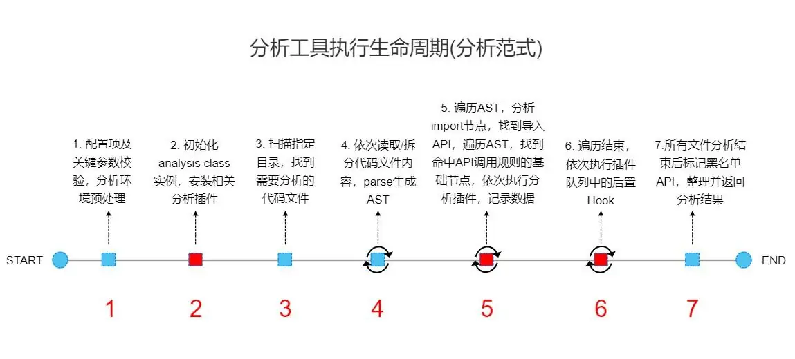
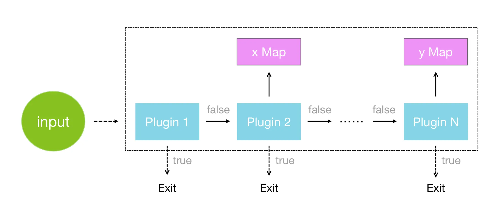

# 9.具体实现：分析插件方案设计

上一节课我们学习了如何对 API 调用进行用途分析，但通过在 `_dealAST` 中新增判定函数这样的拓展方式却带来了代码结构上的问题，导致 analysis 模块越来越臃肿，可维护性变差。因此，我们需要一种方案来优化代码结构，提升程序的稳定性。



Webpack、ESLint 这种成熟的代码分析工具，都采用了插件模式来管理可拓展能力，那么到底什么是插件，它能否解决我们的问题呢？

  


## 什么是插件？

软件系统往往是要面向持续性迭代的，在开发之初很难把所有需要支持的功能都想清楚，有时候还需要借助社区的力量去持续生产新的功能点，或者优化已有的功能。所以需要我们的软件系统具备一定的可扩展性，插件模式就是一种常选的方法。

  


> 插件，是一种可以把某些能力或特性添加到某个已有主体程序的程序，它遵循一定的编写规范，只能运行在特定的主体程序中。没有插件体系的工具新增能力时只能不断升级，这很容易引入不稳定因素。插件一般是可独立完成某个或一系列功能的模块，是否引入一定不会影响系统原本的正常运行（除非它和另一个插件存在依赖关系）。插件在运行时被引入，由系统控制调度，可以存在复数个插件，这些插件通过系统预定的方式进行组合。

  


插件模式的优点：

1. 易于扩展，借助社区开发者扩展新能力，保持主体程序稳定。

2. 逻辑解耦，主程序和插件代码保持独立，降低主程序复杂度。

4. 动态插拔，用户可以按需引入指定插件，提升工具灵活性。

  


## 为什么引入插件？

  


我们的代码分析工具有固定的分析范式，也就是代码分析的主程序，在此基础上需要拓展的是各种 API 调用分析指标，引入插件体系可以将处理分析指标的逻辑从主程序中剥离出来，主要目的：

  


1.  使得插件代码与主程序代码在工程上解耦，对插件开发者隔离主程序逻辑复杂度，便于其独立开发。
1.  不论是系统开发者，还是社区第三方开发者，都可以参与拓展新的分析指标，提升分析工具生命力。

  


那么如何设计插件方案呢？

  


## 插件方案设计

  


-   **注册、配置、初始化插件（`step2`）**

通过数组的形式在配置文件中注册插件，数组中元素的次序表示插件的执行次序，主程序通过读取配置信息来初始化插件，挂载副作用（Map 结构），并将插件对象放入一个队列来管理调度。

-   **主程序管理调度插件队列（`step5`、`step6`）**

`_dealAST` 函数在完成 API 调用判定后，以基准节点等信息为入参，依次执行插件队列中插件对象上的检测函数，AST 遍历结束后，依次执行插件队列中插件对象的后置 hook 函数。

-   **多个插件之间的关系如何，输入输出如何影响系统（`step5`）**

插件执行过程中可自行决定是否更新副作用 Map，可通过队列中前一个插件的执行结果来决定是否执行后续插件，这种模式可用来实现插件间的互斥性 / 串联性，多个插件间的关系可用下图来表述：



  


**分析插件的特点：**

1.  函数，被安装（即执行）后可以在 `codeAnalysis` 上挂载副作用 xxxMap，返回一个带判定函数的插件对象；
1.  `checkFun` 为分析指标判定函数，入参为 `baseNode` 节点及分析上下文信息，执行后可以更新副作用 xxxMap；
1.  `afterHook` 为后置钩子函数，在 AST 全部节点遍历分析后被主程序调用，用于 xxxMap 分析数据的后置处理；
1.  `checkFun` 判定函数执行返回 `false` 表示继续执行队列后续分析插件，返回 `true` 则停止执行并退出插件队列。

  


按照上面的思路，将上一节 `方法 API` 的检测函数改造为插件形式，完整代码可参考 [plugins/methodPlugin.js](https://github.com/liangxin199045/code-analysis-ts/blob/main/plugins/methodPlugin.js) ：

```typescript
exports.methodPlugin = function (analysisContext) {
    const mapName = 'methodMap';
    // 在分析实例上下文挂载副作用
    analysisContext[mapName] = {};

    function isMethodCheck (context, tsCompiler, node, depth, apiName, matchImportItem, filePath, projectName, httpRepo, line) {
        if(node.parent && tsCompiler.isCallExpression(node.parent)){                                    // 存在于函数调用表达式中
            if(node.parent.expression.pos == node.pos && node.parent.expression.end == node.end){       // 命中函数名method检测
                if (!context[mapName][apiName]) {
                    context[mapName][apiName] = {};
                    context[mapName][apiName].callNum = 1;
                    context[mapName][apiName].callOrigin = matchImportItem.origin;
                    context[mapName][apiName].callFiles = {};
                    context[mapName][apiName].callFiles[filePath] = {};
                    context[mapName][apiName].callFiles[filePath].projectName = projectName;
                    context[mapName][apiName].callFiles[filePath].httpRepo = httpRepo;
                    context[mapName][apiName].callFiles[filePath].lines = [];
                    context[mapName][apiName].callFiles[filePath].lines.push(line);
                } else {
                    context[mapName][apiName].callNum++;
                    if (!Object.keys(context[mapName][apiName].callFiles).includes(filePath)) {
                        context[mapName][apiName].callFiles[filePath] = {};
                        context[mapName][apiName].callFiles[filePath].projectName = projectName;
                        context[mapName][apiName].callFiles[filePath].httpRepo = httpRepo;
                        context[mapName][apiName].callFiles[filePath].lines = [];
                        context[mapName][apiName].callFiles[filePath].lines.push(line);
                    }else{
                        context[mapName][apiName].callFiles[filePath].lines.push(line);
                    }
                }
                return true;           // true: 命中规则, 终止执行后序插件
            }           
        }
        return false;      // false: 未命中检测逻辑, 继续执行后序插件
    }

    // 返回分析Node节点的函数
    return {
        mapName : mapName,
        checkFun: isMethodCheck,
        afterHook: null
    };
}
```

  


codeAnalysis 基础类中关于插件的安装、管理、执行的相关逻辑如下，完整代码可以参考 [lib/analysis.js](https://github.com/liangxin199045/code-analysis-ts/blob/main/lib/analysis.js)：

```typescript
class CodeAnalysis {
    constructor(options) {
        // 私有属性
        this._scanSource = options.scanSource;                      // 扫描源配置信息       
        this._analysisTarget = options.analysisTarget;              // 要分析的目标依赖配置           
        this._analysisPlugins = options.analysisPlugins || [];      // 代码分析插件配置
        // 公共属性
        this.pluginsQueue = [];                                     // Targer分析插件队列       
    }
    // 注册插件
    _installPlugins(plugins) {
        if(plugins.length>0){
          plugins.forEach((item)=>{                                   // install 自定义Plugin
            this.pluginsQueue.push(item(this));
          })
        }
        this.pluginsQueue.push(methodPlugin(this));                  // install methodPlugin
        this.pluginsQueue.push(typePlugin(this));                    // install typePlugin
        this.pluginsQueue.push(defaultPlugin(this));                 // install defaultPlugin
    }
    // 执行Target分析插件队列中的checkFun函数
    _runAnalysisPlugins(tsCompiler, baseNode, depth, apiName, matchImportItem, filePath, projectName, httpRepo, line) {
        if(this.pluginsQueue.length>0){
          for(let i=0; i<this.pluginsQueue.length; i++){
            const checkFun = this.pluginsQueue[i].checkFun;
            if(checkFun(this, tsCompiler, baseNode, depth, apiName, matchImportItem, filePath, projectName, httpRepo, line)){
              break;
            }
          }
        }
    }
    // 执行Target分析插件队列中的afterHook函数
    _runAnalysisPluginsHook(importItems, ast, checker, filePath, projectName, httpRepo, baseLine) {
        if(this.pluginsQueue.length>0){
          for(let i=0; i<this.pluginsQueue.length; i++){
            const afterHook = this.pluginsQueue[i].afterHook;
            if(afterHook && typeof afterHook ==='function'){
              afterHook(this, this.pluginsQueue[i].mapName, importItems, ast, checker, filePath, projectName, httpRepo, baseLine);
            }
          }
        }
    }
    // AST分析
    _dealAST(ast, ...) {
        ......
        const that = this;
        // 遍历AST
        function walk(node) {
            ......
            tsCompiler.forEachChild(node, walk);
            // 获取基础分析节点信息
            const { baseNode, depth, apiName } = that._checkPropertyAccess(node);
            // 执行分析插件                                                            
            that._runAnalysisPlugins(tsCompiler, baseNode, depth, apiName, matchImportItem, filePath, projectName, httpRepo, line);         
            ......
        }
    
        walk(ast);
        // AST遍历结束，执行afterhook
        this._runAnalysisPluginsHook(importItems, ast, checker, filePath, projectName, httpRepo, baseLine);
        ......
    }
    // 扫描文件，分析代码
    _scanCode() {
        ......
        this._dealAST();
        ......
    }
    // 入口函数
    analysis() {
        ......
        // 注册插件
        this._installPlugins();
        // 扫描分析TS
        this._scanCode();
        ......
    }
}
```

  


分析插件与 codeAnalysis 执行生命周期的关系：


插件相关的函数主要在 `step2`、`step5`、`step6` 三个步骤中执行，通过插件方案，我们将主程序代码与分析插件代码进行了分离，后续新增或者更新分析指标，只需要修改插件代码即可，提升了主程序的稳定性。

  


分析数据是否准确一定程度上取决于对应分析插件的逻辑完整性，但开发一个完善的分析插件并非易事，需要观察 AST 结构，根据调用场景特征不断的调试、测试插件代码。既然是代码，出现 Bug 是很正常的事情，那有没有什么办法帮助插件开发者更快定位代码缺陷呢？

  


## 插件诊断日志

`checkFun` 函数作为分析插件的判定函数，在开发过程中最容易出现 Bug，所以我们加一个 try catch 结构来捕获执行判定函数时出现的错误，错误日志可以帮助插件开发者调试分析插件，快速定位问题。

举个例子，下面是 methodPlugin 插件代码 (`存在问题`)

```typescript
exports.methodPlugin = function (analysisContext) {
    const mapName = 'methodMap';
    // 在分析实例上下文挂载副作用
    analysisContext[mapName] = {};

    function isMethodCheck (context, tsCompiler, node, depth, apiName, matchImportItem, filePath, projectName, httpRepo, line) {
        try{
            if(node.parent && tsCompiler.isCallExpression(node.parent)){                                    // 存在于函数调用表达式中
                if(node.parent.expression.pos == node.pos && node.parent.expression.end == node.end){       // 命中函数名method检测
                    if (!context[mapName][apiName]) {
                        context[mapName][apiName] = {};
                        context[mapName][apiName].callNum = 1;
                        context[mapName][apiName].callOrigin = matchImportItem.origin.name; // 不存在name
                        context[mapName][apiName].callFiles = {};
                        context[mapName][apiName].callFiles[filePath] = {};
                        context[mapName][apiName].callFiles[filePath].projectName = projectName;
                        context[mapName][apiName].callFiles[filePath].httpRepo = httpRepo;
                        context[mapName][apiName].callFiles[filePath].lines = [];
                        context[mapName][apiName].callFiles[filePath].lines.push(line);
                    } else {
                        context[mapName][apiName].callNum++;
                        if (!Object.keys(context[mapName][apiName].callFiles).includes(filePath)) {
                            context[mapName][apiName].callFiles[filePath] = {};
                            context[mapName][apiName].callFiles[filePath].projectName = projectName;
                            context[mapName][apiName].callFiles[filePath].httpRepo = httpRepo;
                            context[mapName][apiName].callFiles[filePath].lines = [];
                            context[mapName][apiName].callFiles[filePath].lines.push(line);
                        }else{
                            context[mapName][apiName].callFiles[filePath].lines.push(line);
                        }
                    }
                    return true;                                                                          // true: 命中规则, 终止执行后序插件
                }           
            }
            return false;                                                                                 // false: 未命中检测逻辑, 继续执行后序插件
        }catch(e){
            // console.log(e);
            const info = {
                projectName: projectName,
                matchImportItem: matchImportItem,
                apiName: apiName,
                httpRepo: httpRepo + filePath.split('&')[1] + '#L' + line,
                file: filePath.split('&')[1],
                line: line,
                stack: e.stack
            };
            context.addDiagnosisInfo(info);
            return false;                                                                                 // false: 插件执行报错, 继续执行后序插件
        }
    }

    // 返回分析Node节点的函数
    return {
        mapName : mapName,
        checkFun: isMethodCheck,
        afterHook: null
    };
}
```
该插件代码在执行后会报错，catch 捕获错误后写入诊断日志

```json
{
        "projectName": "xxx",
        "matchImportItem": {
            "origin": null,
            "symbolPos": 73,
            "symbolEnd": 77,
            "identifierPos": 73,
            "identifierEnd": 77
        },
        "apiName": "app.localStorage.set",
        "httpRepo": "",
        "file": "src/pages/BasicSettings.vue",
        "line": 129,
        "stack": "TypeError: Cannot read property 'name' of null\n    at isMethodCheck (/Users/xinliang/code/github/code-analysis-ts/plugins/methodPlugin.js:13:87)\n    at CodeAnalysis._runAnalysisPlugins (/Users/xinliang/code/github/code-analysis-ts/lib/analysis.js:87:12)\n    at walk (/Users/xinliang/code/github/code-analysis-ts/lib/analysis.js:231:22)\n    at visitNode (/Users/xinliang/code/github/code-analysis-ts/node_modules/typescript/lib/typescript.js:30663:24)\n    at Object.forEachChild (/Users/xinliang/code/github/code-analysis-ts/node_modules/typescript/lib/typescript.js:30890:24)\n    at walk (/Users/xinliang/code/github/code-analysis-ts/lib/analysis.js:216:18)\n    at visitNode (/Users/xinliang/code/github/code-analysis-ts/node_modules/typescript/lib/typescript.js:30663:24)\n    at Object.forEachChild (/Users/xinliang/code/github/code-analysis-ts/node_modules/typescript/lib/typescript.js:30890:24)\n    at walk (/Users/xinliang/code/github/code-analysis-ts/lib/analysis.js:216:18)\n    at visitNode (/Users/xinliang/code/github/code-analysis-ts/node_modules/typescript/lib/typescript.js:30663:24)"
}
```

通过诊断日志，我们了解到在分析 `app.localStorage.set` 方法调用时，当程序执行到 `methodPlugin` 插件第 `13` 行代码时报错，报错原因是 origin 不存在 name 属性。


修改以后 `methodPlugin` 分析插件完整的代码应该是：

```typescript
exports.methodPlugin = function (analysisContext) {
    const mapName = 'methodMap';
    // 在分析实例上下文挂载副作用
    analysisContext[mapName] = {};

    function isMethodCheck (context, tsCompiler, node, depth, apiName, matchImportItem, filePath, projectName, httpRepo, line) {
        try{
            if(node.parent && tsCompiler.isCallExpression(node.parent)){                                    // 存在于函数调用表达式中
                if(node.parent.expression.pos == node.pos && node.parent.expression.end == node.end){       // 命中函数名method检测
                    if (!context[mapName][apiName]) {
                        context[mapName][apiName] = {};
                        context[mapName][apiName].callNum = 1;
                        context[mapName][apiName].callOrigin = matchImportItem.origin;
                        context[mapName][apiName].callFiles = {};
                        context[mapName][apiName].callFiles[filePath] = {};
                        context[mapName][apiName].callFiles[filePath].projectName = projectName;
                        context[mapName][apiName].callFiles[filePath].httpRepo = httpRepo;
                        context[mapName][apiName].callFiles[filePath].lines = [];
                        context[mapName][apiName].callFiles[filePath].lines.push(line);
                    } else {
                        context[mapName][apiName].callNum++;
                        if (!Object.keys(context[mapName][apiName].callFiles).includes(filePath)) {
                            context[mapName][apiName].callFiles[filePath] = {};
                            context[mapName][apiName].callFiles[filePath].projectName = projectName;
                            context[mapName][apiName].callFiles[filePath].httpRepo = httpRepo;
                            context[mapName][apiName].callFiles[filePath].lines = [];
                            context[mapName][apiName].callFiles[filePath].lines.push(line);
                        }else{
                            context[mapName][apiName].callFiles[filePath].lines.push(line);
                        }
                    }
                    return true;                                                                          // true: 命中规则, 终止执行后序插件
                }           
            }
            return false;                                                                                 // false: 未命中检测逻辑, 继续执行后序插件
        }catch(e){
            // console.log(e);
            const info = {
                projectName: projectName,
                matchImportItem: matchImportItem,
                apiName: apiName,
                httpRepo: httpRepo + filePath.split('&')[1] + '#L' + line,
                file: filePath.split('&')[1],
                line: line,
                stack: e.stack
            };
            context.addDiagnosisInfo(info);
            return false;                                                                                 // false: 插件执行报错, 继续执行后序插件
        }
    }

    // 返回分析Node节点的函数
    return {
        mapName : mapName,
        checkFun: isMethodCheck,
        afterHook: null
    };
}
```

codeAnalysis 实例上的 `addDiagnosisInfo` 方法用于收集插件执行过程中的报错信息，为了不影响其它插件以及主程序的正常执行，插件代码不要直接抛出错误，静态分析层面的诊断通常需要配合完整的执行上下文来判断，将错误信息收集起来分析才是最正确的插件诊断方式。插件开发是一个不断迭代完善的过程，诊断日志可以帮助插件开发者发现插件缺陷，对于使用者，也可以通过将诊断日志提交issue的方式来为插件开发者提供改进建议。

  

## 内置插件

我们将上一节课中讲过的三个判定函数进行插件改造后，就得到了 `defaultPlugin`、`typePlugin`、`methodPlugin` 这三个内置插件，内置插件是指不需要在配置中显示注册，且固定在插件队列末尾的分析插件，它们作为内置插件是因为前端业务导出的 API 绝大部分是 `属性`、`方法`、`类型`。

`defaultPlugin` 是插件队列中最后一个用于兜底的分析插件，因为分析工具最基础的分析指标是统计 API 调用信息，

（内置插件完整的代码位于 [plugins/defaultPlugin.js](https://github.com/liangxin199045/code-analysis-ts/blob/main/plugins/defaultPlugin.js), [plugins/methodPlugin.js](https://github.com/liangxin199045/code-analysis-ts/blob/main/plugins/methodPlugin.js), [plugins/typePlugin.js](https://github.com/liangxin199045/code-analysis-ts/blob/main/plugins/typePlugin.js)）

  


## 自定义插件

代码分析工具如果只支持`属性`、`方法`、`类型`等用途类的分析指标，那么工具是毫无生命力的。自定义插件是工具提供给使用者用于拓展分析指标的解决方案，与内置插件最大的区别在于它需要在配置文件中显示注册，且只能放在插件队列前面的位置，我们会在第 14 节课程中详细介绍如何 `开发/调试/贡献` 自定义分析插件。

  


## 小结

这一小节我们学习了如何通过插件方案来解决代码结构问题，需要大家掌握以下知识点：


1.  插件是一种可以把某些能力或特性添加到已有主体程序的程序，遵循一定的编写规范，只能运行在特定的主体程序中，没有插件体系的工具新增能力时只能不断升级，这很容易引入不稳定因素。
1.  分析工具引入插件体系是为了将处理分析指标的逻辑从主程序中剥离出来，提升主程序稳定性。
1.  分析插件是一种函数，被安装（即执行）后可以在 `codeAnalysis` 上挂载副作用，`checkFun` 为插件对象的判定函数，执行后可以更新副作用Map，`afterHook` 为后置钩子函数，可用于对副作用的后置处理，`checkFun` 判定函数执行返回 `false` 表示继续执行队列中的后续插件，返回 `true` 则停止执行并退出插件队列。
1.  `defaultPlugin`、`typePlugin`、`methodPlugin` 作为内置插件是因为前端业务导出的 API 绝大部分是属性、方法、类型 ，`defaultPlugin` 插件用于完成最基础的分析指标，即统计 API 调用信息。

  


插件是一种设计思想，并没有一成不变的实现，随着分析工具的迭代，分析指标会越来越多，插件方案肯定需要相应调整，但脱离需求去设计插件方案也没有必要，过度的设计往往会让使用者无所适从。本章节讲的插件方案是一种入门级方案，后续会根据新的分析诉求来逐步完善插件体系，如增加同步/异步调用模式等等。

  


接下来要学习的第 `10`、`11` 小节属于比较独立的章节，它们都属于可选分析流程，是否执行可以通过配置文件中的可选配置项来控制。