# 8.第八日：玩转动画

## 第一个故事：匀速圆周运动

动画是网页中常见的效果元素。我们在前面的故事中，也已经见过了一些动画，比如“让CSS做更多的事情”这一故事中，我们使用了CSS关键帧动画。

现代浏览器支持很多种动画方式，比如：CSS过渡动画、CSS关键帧动画、SVG动画、Web Animation API，我们还可以用JS自己实现动画。另外还有许多使用方便和功能强大的第三方动画库可以供我们使用。

今天的故事，我们将讲述两种最常用的动画模式：
- 固定轨迹的动画
- 连续的动画

### 圆周运动

第一个故事，我们先来看看固定轨迹动画的实现思路。这个动画效果是模拟地球围绕太阳做圆周运动：

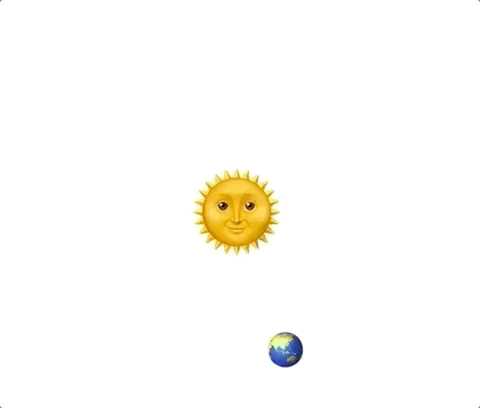

实现上图的动画的方式有很多，比较直接的是采用JS来实现，我们先来看一下JS实现的方案。

首先，我们用HTML元素展示动画元素：

```html
<!DOCTYPE html>
<html lang="en">
<head>
  <meta charset="UTF-8">
  <meta name="viewport" content="width=device-width, initial-scale=1.0">
  <meta http-equiv="X-UA-Compatible" content="ie=edge">
  <title>Document</title>
</head>
<body>
  <div class="main">
    <div id="sun">🌞</div>
    <div id="earth">🌏</div>
  </div>
</body>
</html>
```
如上代码所示，我们用两个`div`元素分别代表太阳和地球两个对象。

这是对应的CSS，设置了太阳和地球的初始位置和状态：

```css
.main {
  width: 512px;
  height: 512px;
  position: relative;
}
#sun, #earth {
  position: absolute;
  transform: translate(-50%, -50%);
}
#sun {
  font-size: 5rem;
  left: 50%;
  top: 50%;
}
#earth {
  font-size: 2rem;
}
```

在没有添加动画的时候，显示出来的界面是这样的：

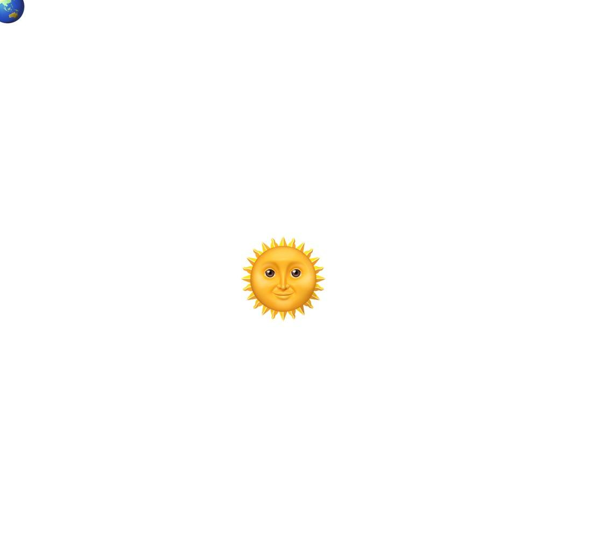

太阳位于`div.main`元素正中间，因为我们用了一个经典的绝对定位实现水平垂直居中的方法：

```css
#sun, #earth {
  position: absolute;
  transform: translate(-50%, -50%);
}
#sun {
  font-size: 5rem;
  left: 50%;
  top: 50%;
}
```

我们将`#sun`元素的`position`设为`absolute`，`top`和`left`设为50%，此时它的左上角是位于`div.main`元素的中心点的。然后我们再通过`transform: translate(-50%, -50%)`将它左移、上移自身宽高的一半，这样它的中心点就位于`div.main`元素的中心了。

接下来，我们要实现的效果是让地球的轨迹沿着围绕着太阳的环形运动，那么这个怎么实现呢？

这里我们复习一下高中数学知识：

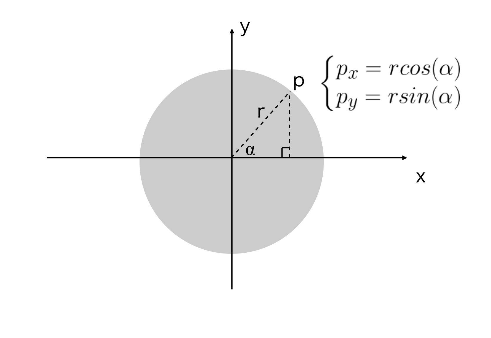

如图所示，在直角坐标系中，点p围绕半径r，圆心在原点的圆周运动，它任意时刻的坐标`px`，`py`满足：

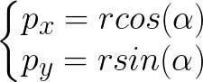

⍺是原点到p点的线段与x轴的夹角。

这是**圆的参数方程**。

所以，我们要做的就是按照参数方程更新地球的位置就可以了。

如果我们的动画让地球围绕太阳旋转一周的周期是T，那么，地球的角速度`⍵ = 2 * Math.PI / T`，所以，⍺角是：

```js
⍺ = ⍵t = 2 * Math.PI * t / T
```

所以，我们就可以通过JS更新地球元素的`left`和`top`属性，让地球运动起来：

[在线演示](https://junyux.github.io/FE-Advance/day08/index1-v1.html)

```js
const earth = document.getElementById('earth');
const x0 = 256;
const y0 = 256;
const radius = 128;
const T = 5000; // 周期

function update(t) {
  const alpha = 2 * Math.PI * t / T;
  const x = x0 + radius * Math.cos(alpha);
  const y = y0 + radius * Math.sin(alpha);
  earth.style.left = `${x}px`;
  earth.style.top = `${y}px`;
  requestAnimationFrame(update);
}
update(0);
```

上面的代码里，x0、y0是圆心，因为太阳不在坐标原点，所以最终的公式是：

```js
const x = x0 + radius * Math.cos(alpha);
const y = y0 + radius * Math.sin(alpha);
```

然后我们通过`requestAnimationFrame`，计算x和y，不断更新`#earth`元素的`top、left`值：

```js
earth.style.left = `${x}px`;
earth.style.top = `${y}px`;
```

`requestAnimationFrame`是浏览器的API，它的参数是一个回调函数。这个API告诉浏览器有一个动画需要执行执行，并且会在浏览器下次重绘之前调用指定的回调函数更新动画。

现在我们来总结一下这种动画实现的思路：

1. 设计轨迹方程，找出动画变量和时间的关系
1. 确定动画周期和与动画变量对应的CSS属性
1. 通过`requestAnimationFrame`API，在浏览器重绘周期中更新动画变量，以实现我们需要的动画效果

使用JS是实现固定轨迹动画的一种方法，我们还可以使用CSS动画来是实现这种类型的动画。这个故事的实例中，我们使用到了圆的参数方程，而CSS动画不太好实现正余弦计算。所以，为了使用CSS实现动画，我们需要调整我们的动画计算方式，那么要如何调整呢？

<!-- 这个版本里，我们使用了JavaScript根据圆的参数方程来修改`#earth`的CSS属性的方式来实现地球绕太阳旋转的效果。这个版本的计算并不复杂，只要理解了圆的参数方程就很容易写出来。 -->
<!-- 不过除了使用圆的参数方程外，还有没有其他解决方法呢？尤其是能否不用JS，只用CSS实现？ -->

## 第二个故事：匀速圆周运动 2.0

使用CSS动画实现圆周运动，我们不能使用圆的参数方程，而需要使用圆的极坐标方程来实现。然后再通过CSS的transform和rotate，就能比较简单的实现圆周运动了。

<!-- s但是，我们不要忘记了，圆除了参数方程之外，还有极坐标方程，而恰好，CSS的transform是支持rotate的，所以我们当然可以有比较简单的用CSS动画实现圆周运动的办法。 -->
首先，我们需要调整一下我们的CSS样式，设置`transform-origin`属性改变元素旋转的参考点：

```css
.main {
  width: 512px;
  height: 512px;
  position: relative;
}
#sun, #earth {
  position: absolute;
}
#sun {
  transform: translate(-50%, -50%);
  font-size: 5rem;
  left: 50%;
  top: 50%;
}
#earth {
  left: 50%;
  top: calc(50% - 128px);
  transform-origin: 50% calc(50% + 128px);
  font-size: 2rem;
}
```
如上代码所示，我们调整了地球元素的初始位置和旋转参考点，使用了两个计算属性值: `top: calc(50% - 128px)` 和 `transform-origin: 50% calc(50% + 128px);`。

👉🏻 CSS中，`calc`可以用来在CSS属性值中执行一些计算，特别有用的是，`calc`计算可以自动转换单位，所以我们可以将百分比单位的数值和px单位的值进行加减计算。

`top: calc(50% - 128px)`表示将`#earth`元素的`top`值设在父容器50%高度，并向上偏移128px的位置。于是地球出现在太阳的正上方，距离太阳中心点的距离是128px。

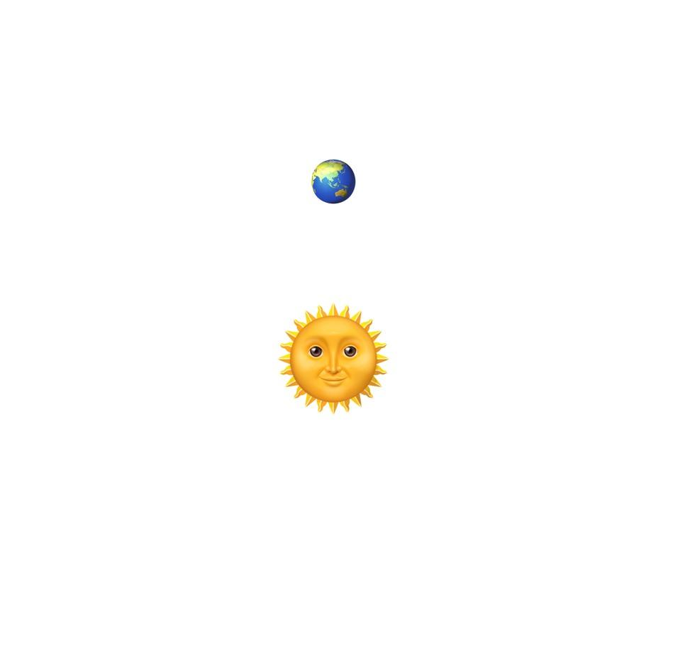

默认情况下，`transform`属性是以元素自身盒子的左上角作为参考点的。而在我们的例子中，我们需要让地球元素以太阳的中心点作为旋转的参考点。所以我们需要使用`transform-origin`属性改变地球元素的参点。如下图所示：

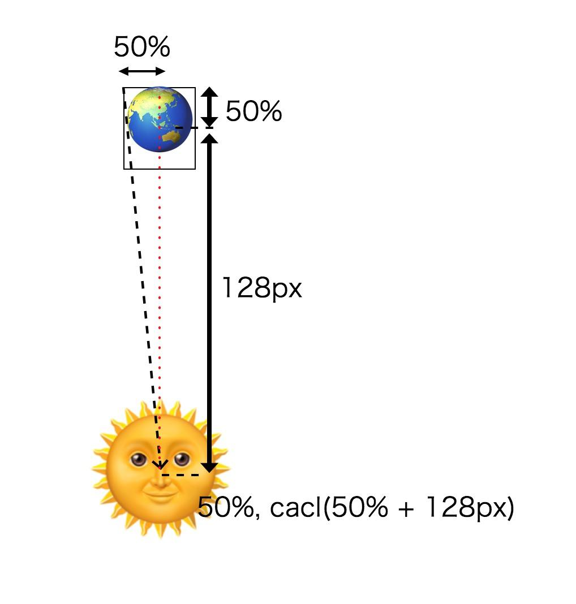

<!-- 如上图所示，我们将`transform-origin`设为太阳的中心点，要使用的`transform-origin`属性值为`50% calc(50% + 128px)`。 -->
从上图我们可以看出，以太阳中心作为旋转的参考点的位置位于`50% calc(50% + 128px)`。所以，`transform-origin: 50% calc(50% + 128px)`表示将地球的旋转参考点修改到太阳的中心点。这样执行地球的`transform`属性就能让地球围着太阳转了。

然后，我们可以使用CSS关键帧动画，改变`tranform`的值：

```css
@keyframes rotate {
  to {transform: translate(-50%, -50%) rotate(1turn)}
}
```

然后我们给`#earth`元素增加动画：

```css
#earth {
  left: 50%;
  top: calc(50% - 128px);
  transform-origin: 50% calc(50% + 128px);
  font-size: 2rem;

  transform: translate(-50%, -50%) rotate(.0turn);
  animation: rotate 5s linear infinite;
}
```

最后，完整的CSS如下：

[在线演示](https://junyux.github.io/FE-Advance/day08/index1-v2.html)

```css
.main {
  width: 512px;
  height: 512px;
  position: relative;
}
#sun, #earth {
  position: absolute;
}
#sun {
  transform: translate(-50%, -50%);
  font-size: 5rem;
  left: 50%;
  top: 50%;
}
#earth {
  left: 50%;
  top: calc(50% - 128px);
  transform-origin: 50% calc(50% + 128px);
  font-size: 2rem;

  transform: translate(-50%, -50%) rotate(.0turn);
  animation: rotate 5s linear infinite;
}

@keyframes rotate {
  to {transform: translate(-50%, -50%) rotate(1turn)}
}
```

这样我们就实现了纯CSS版本的地球环绕太阳旋转的动画。

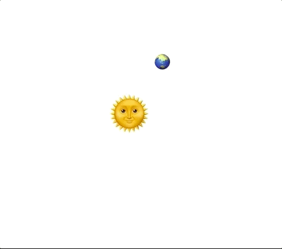

比较上图和第一个故事中的效果图，你可能会发现它们之间存在细微的差别。第一版是通过参数方程计算地球相对坐标位置，动态修改坐标位置来实现，所以地球本身，除了位置相对太阳旋转，其他的状态都保持不变。而这个版本是通过旋转来实现的，地球的旋转参考点始终是对着太阳的中心点的，所以看起来好像地球自身也在旋转。这就是效果上的细微差异。
<!-- 注意，细节上，这一版和上一版略有不同，因为上一版是通过参数方程计算地球相对坐标位置，动态修改坐标位置来实现，而这一版是通过旋转来实现，所以上一版的地球本身保持不变，只是位置相对太阳旋转，而这一版，地球整体围绕太阳中心点旋转，所以看起来好像地球自身也在旋转，这是效果上的细微差异。 -->

当然，这一版我们同样也可以不用CSS关键帧动画，改用JS来控制，我们只要将CSS动画去掉，添加以下JS代码：

```js
  const earth = document.getElementById('earth');
  const T = 5000; // 5秒

  function update(t) {
    earth.style.transform = `translate(-50%, -50%) rotate(${t / T}turn)`;
    requestAnimationFrame(update);
  }
  update(0);
```

如果你这么做，你会发现在一些浏览器（包括最新的chrome浏览器）上出现奇怪的现象：

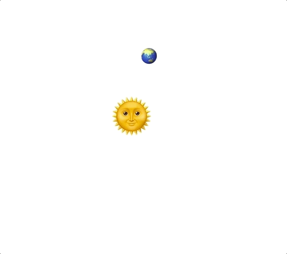

如图所示，似乎地球在运动到某些位置的时候会突然抖动一下。不过这个不是我们代码的问题，而是chrome浏览器在处理emoji文字的`transform`属性时产生的bug。要解决这个问题，我们可以将`rotate`换成`rotate3d`:

```js
  const earth = document.getElementById('earth');
  const T = 5000; // 5秒

  function update(t) {
    earth.style.transform = `translate(-50%, -50%) rotate3d(0, 0, 1, ${t / T}turn)`;
    requestAnimationFrame(update);
  }
  update(0);
```

这里我们用`rotate3d`来代替`rotate`。`rotate3d`接受4个参数，前三个参数定义一个三维向量，第四个参数表示围绕该向量旋转，我们是在平面上旋转，要围绕z轴，所以前三个参数是`0,0,1`。

用`rotate3d`替代`rotate`之后，问题就消失了，这样我们依然可以用JS来控制动画。

第一个和第二个故事阐述了固定轨迹动画的实现思路。规定轨迹动画不仅仅是圆周运动，它还包括了渐变动画，椭圆，贝塞尔曲线等等。这些动画既可以使用JS来实现，也可以采用CSS来实现。当然，如果采用CSS动画实现，你设计的动画变量需要被CSS支持，否则是无法实现用CSS来实现的。

用JS或CSS来控制动画，各有各的好处，CSS动画更简单，能够保持WEB开发各司其职的原则，使得代码更加易于维护。而JS动画，在组合复杂的动画过程时，会更加灵活和方便。

接下来，我们就来看看更加复杂的动画应该如何实现——连续动画。

## 第三个故事：自由落体和弹跳小球

在一般情况下，简单的动画使用CSS实现会比较方便，但是一些比较复杂的动画，还是需要使用JS来实现。

比如我们实现一个模拟小球自由落体后弹跳的动画效果：

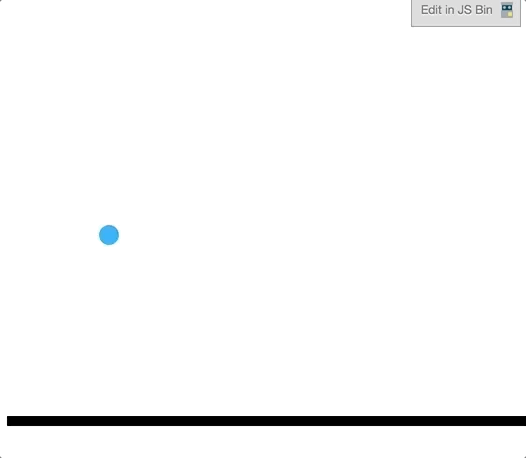

这是相关的HTML与CSS：

```html
<div id="sphere"></div>
<div id="ground"><div>
```

```css
#sphere {
  position: absolute;
  left: 100px;
  top: 100px;
  width: 20px;
  height: 20px;
  border-radius: 50%;
  background-color: #0af;
}

#ground {
  position: absolute;
  top: 420px;
  width: 600px;
  height: 10px;
  background: black;
}
```

这是一个连续的动画，连续的动画实际是由几个不同的阶段的轨迹动画组合而成。比如上面的例子，就是由若干个自由落体动画和匀减速动画组合而成。像这样的动画，使用CSS动画几乎没法实现，还是应该考虑使用JS动画。

第一步，我们先实现一个自由落地动画。

我们知道自由落体运动是一个初速度为0的匀加速运动，假设小球离地面高度为S，落地的时间为T，那么根据自由落体运动的公式，我们可以计算出小球的加速度为：

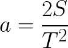

那么经过t时间（t <= T），小球运动的位移为：


所以，我们可以这样定义自由落体动画：

```js
const S = 400; // 小球离地的初始高度
const T = 1000; // 落地时间

const target = document.getElementById('sphere')

let startTime = Date.now();

function update() {
  const t = Date.now() - startTime;
  const p = Math.min(t / T, 1);
  const top = S * p ** 2;
  target.style.top = `${top}px`; // 更新动画变量——top属性
  if(p < 1) {
    requestAnimationFrame(update);
  }
}

update();
```

一个自由落体的动画就实现了：

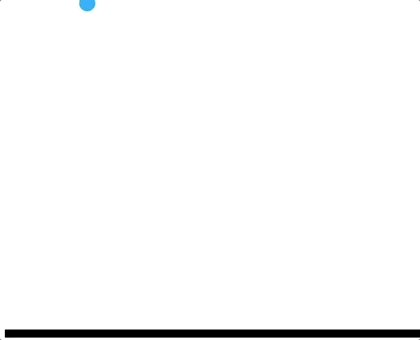

以上是动画的第一阶段，现在我们需要执行动画的第二个阶段——弹起。

<!-- 接下来，我们要面对一个问题，那就是我们要在一段动画执行完成之后，执行下一段动画。这是一个异步的过程。 -->
因为弹起动画是在自由落体动画结束之后，所以弹起动画必须等待自由落体动画执行结束后才能开始执行。这就涉及到一个异步的过程。我们需要对动画过程进行一下简单的封装，让它实现一个`asyn/await`的过程。

首先，利用我们之前学过的数据抽象和过程抽象，重构一下上面的代码：

```js
/*
  @target 目标动画元素
  @duration 动画经历的时间
  @progress 动画执行回调函数
*/
function animate(target, duration, progress) {
  const startTime = Date.now();
  return new Promise((resolve) => {
    function update() {
      const t = Date.now() - startTime;
      const p = Math.min(t / duration, 1);
      progress(target, p);
      if(p < 1) {
        requestAnimationFrame(update);
      } else {
        resolve(p);
      }
    }
    update();
  });
}
```

这样，自由落体的动画就可以变成：

```js
const sphere = document.getElementById('sphere');

animate(sphere, 1000, (target, p) => {
  const top = 400 * p ** 2;
  target.style.top = `${top}px`;
});
```

注意，我们在`animate`方法里返回了一个`Promise`对象，这样的话，我们就可以通过异步的`async/await`来连续执行动画。现在，我们就来实现弹起的动画。

与自由落体运动相反，弹起的动画是一个“匀减速”运动，最终将初速度降为0。

在这一阶段，小球的初速度与加速度分别是:

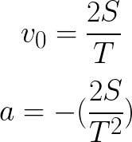

那么经过t时间（t <= T），小球运动的位移为：

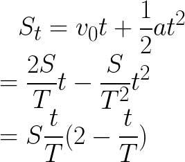

所以，弹跳阶段的JS，我们可以这样写：

```js
animate(sphere, 1000, (target, p) => {
  // 起点是400，反向运动，所以要用400减
  const top = 400 - 400 * p * (2 - p);
  target.style.top = `${top}px`;
});
```

然后，我们把两个动画连起来：

```js
(async function () {
  while(1) {
    await animate(sphere, 1000, (target, p) => {
      const top = 400 * p ** 2;
      target.style.top = `${top}px`;
    });
    await animate(sphere, 1000, (target, p) => {
      // 起点是400，反向运动，所以要用400减
      const top = 400 - 400 * p * (2 - p);
      target.style.top = `${top}px`;
    });
  }
}());
```

最终实现的效果如下图：

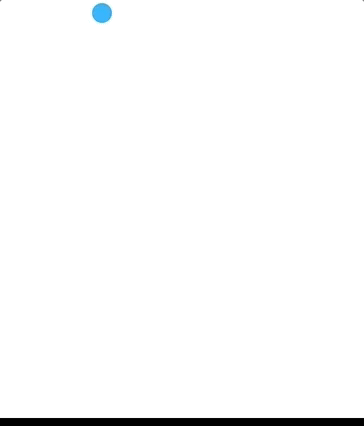

这个效果不是我们最终想要的，因为小球不停地弹跳而不会停止，所以我们需要给小球增加一个能量损耗。

假设小球每次与地面碰撞后，它的动能损耗30%，那么根据能量守恒，它弹起的高度将变为之前的0.7，而它弹起的时间将变为之前的根号0.7：

所以最后我们将动画修改为：

```js
(async function () {
  let height = 400;
  let duration = 1000;

  while(1) {
    await animate(sphere, duration, (target, p) => {
      const top = (400 - height) + height * p ** 2;
      target.style.top = `${top}px`;
    });

    // 能量损耗后的动画执行高度和时间
    height *= 0.7;
    duration *= Math.sqrt(0.7);

    await animate(sphere, duration, (target, p) => {
      // 起点是400，反向运动，所以要用400减
      const top = 400 - height * p * (2 - p);
      target.style.top = `${top}px`;
    });
  }
}());
```

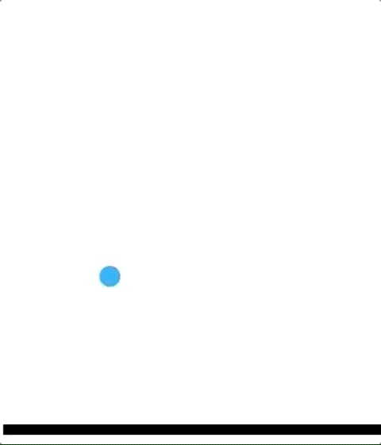

所以最终就实现了我们所期望的效果。[在线演示](https://junyux.github.io/FE-Advance/day08/index2-v1.html)

现在我们来总结一下连续动画的思路：

1. 将连续的动画分解为若干个固定轨迹的动画
1. 为每个阶段的动画设计轨迹方程，找出动画变量和时间的关系
1. 确定每个阶段的动画周期（duration）和与动画变量对应的CSS属性
1. 利用异步的方式（Promise）连接每个阶段的动画，形成一个连续的动画效果

<!-- 现在我们来总结一下JS动画的要素：

JS动画的关键因素是动画的周期duration、动画便量（在这里是小球的位移）与时间的关系。实际上JS动画就是根据时间和周期来改变元素的某个CSS属性值。无论多复杂的动画，本质上都是属性关于时间的函数。实际上，不仅仅是JS动画，CSS动画也是如此，缓动（easing）函数本身就是对运动的抽象，例如自由落体运动近似等于`ease-in`，弹起的匀减速运动近似等于`ease-out`。

任何元素样式动画都能够用上述基本原理来实现，不过在某些情况下，一些特殊的效果还是需要一定的技巧和借助某些特殊CSS规则来实现。 -->

## 第四个故事：常用动画实现技巧

通过前面的三个故事，我们学习了两种非常常见的动画模式：固定轨迹动画和连续动画。

连续动画实际上是由多段固定轨迹动画组合而成的。在第三个故事里，我们使用Promise来处理连续动画，这是一种最方便的异步处理方式，在第八日的故事中，我们会有更详细的讨论。

而固定轨迹动画可以抽象为一个由**动画周期(T)**、**动画执行时间(t)**，以及**时间与属性值的映射函数(progress)** 共同决定的模型。

### 插值

在固定轨迹动画模型里，知道T、t以及progress，我们就能唯一确定动画元素target在t时刻的属性值。其中比较复杂的是progress，我们可以对它进行规范：

- progress可以由起始值（start）、结束值（end）、以及插值函数（interpolate）确定。

我们用这个规范，重构一下上一个故事中的`animate`函数：

```js
/*
  @target 目标元素
  @prop CSS属性
  @duration 动画周期
  @start 动画开始时，CSS属性的值
  @end 动画结束时，CSS属性值
  @interpolate 插值函数
*/
function animate({target, prop, duration, start, end, interpolate} = {}) {
  const startTime = Date.now();

  return new Promise((resolve) => {
    function update() {
      const t = Date.now() - startTime;
      const p = Math.min(t / duration, 1);
      target.style[prop] = interpolate(start, end, p);
      if(p < 1) {
        requestAnimationFrame(update);
      } else {
        resolve(p);
      }
    }
    update();
  });
}
```

如上代码所示，`interpolate(start, end, p)`这个函数的返回值就是根据`p`对应的比例落在`start`到`end`之间的值，也叫做**插值**。而`p`的值是在[t/duration, 1]之间 （也就是[0,1]之间)，所以这里的插值简单来说，表示根据动画的起始值（start）和动画的结束值（end)，在当前时间下计算出的位于start和end之间的值。

下面，我们来看看这个插值是如何被计算出来的：
<!-- 这样我们就可以用下面的代码来实现上一个故事中小球的自由落体动画了。 -->

```js
animate({
  target: sphere,
  prop: 'top',
  duration: 1000,
  start: 100,
  end: 400,
  interpolate(start, end, p) {
    p **= 2; //匀加速
    return `${start * (1 - p) + end * p}px`;
  }
});
```

上面的代码实现了第三个故事中自由落体的动画。其中，`start * (1 - p) + end * p`是一个最简单的插值公式，它的返回值是一个**线性插值**。如果我们不加`p **= 2`，那么返回的插值是线性的，这样的话小球就是匀速运动。
<!-- 我们来分析一下`interpolate`函数。其中，`start * (1 - p) + end * p`叫做**线性插值**，也是最简单的插值。它表示让返回的值，根据`p`对应的比例落在`start`到`end`之间，如果我们不加`p **= 2`那么用的就是线性插值，这样的话小球就是匀速运动。 -->

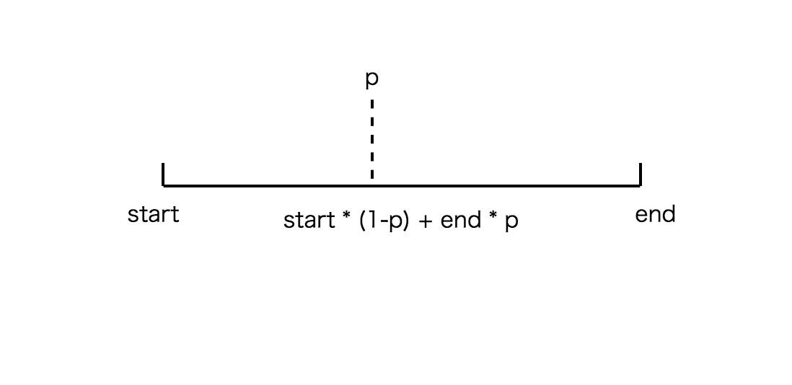

如果需要小球做匀加速运动，根据前面的公式：

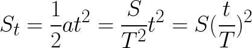

这里`t/T`就是`p`，当`p`等于`p ** 2`即`p`的平方，动画就变成匀加速了。

同样的，如果我们要做弹起的动画，可以：

```js
animate({
  target: sphere,
  prop: 'top',
  duration: 1000,
  start: 400,
  end: 100,
  interpolate(start, end, p) {
    p *= (2 - p); //匀减速
    return `${start * (1 - p) + end * p}px`;
  }
});
```

插值不仅可以改变像`top`、`left`或者`width`、`height`这样的属性值，还可以处理更复杂的属性值，比如颜色：

```js
function lerp(start, end, p) {
  return start * (1 - p) + end * p;
}

animate({
  target: sphere,
  prop: 'background',
  duration: 1000,
  start: [0, 170, 255],
  end: [255, 170, 0],
  interpolate(start, end, p) {
    const color = start.map((s, i) => {
      return lerp(s, end[i], p);
    });
    return `rgb(${color})`
  }
});
```

上面的代码给小球增加一个改变颜色的动画，这样我们会看到小球在弹起的同时，颜色也会发生改变。

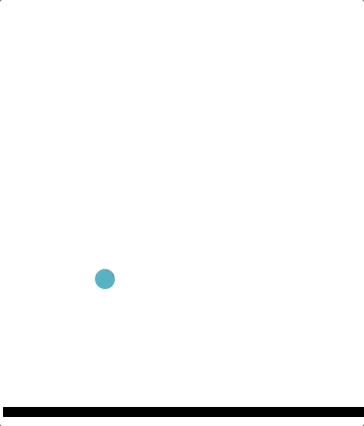

### 缓动

我们看到，匀速运动使用线性插值`lerp`函数，匀加速运动在线性插值前将`p`改变为`p`平方，而匀减速运动在线性插值前将`p`改变为`p*(2-p)`，实际上其他的运动形式也可以用这个模型处理，所以我们可以将改变`p`的过程抽象出来，叫做**缓动函数(easing)**。

```js
function animate({target, prop, duration, start, end, easing, interpolate} = {}) {
  const startTime = Date.now();

  return new Promise((resolve) => {
    function update() {
      const t = Date.now() - startTime;
      const p = Math.min(t / duration, 1);

      target.style[prop] = interpolate(start, end, easing ? easing(p) : p);
      if(p < 1) {
        requestAnimationFrame(update);
      } else {
        resolve(p);
      }
    }
    update();
  });
}
```

这样，匀减速的小球弹起就改写为：

```js
animate({
  target: sphere,
  prop: 'top',
  duration: 1000,
  start: 400,
  end: 100,
  easing(p) {
    return p * (2 - p);
  },
  interpolate(start, end, p) {
    return `${start * (1 - p) + end * p}px`;
  }
});
```

除了匀加速、匀减速外，我们还可以实现其他的缓动函数，比如周期运动：

```js
animate({
  target: sphere,
  prop: 'background',
  duration: 100000,
  start: [0, 170, 255],
  end: [255, 170, 0],
  easing(p) {
    return 100 * p % 1;
  },
  interpolate(start, end, p) {
    const color = start.map((s, i) => {
      return lerp(s, end[i], p);
    });
    return `rgb(${color})`
  }
});
```

如上代码所示，这是个执行100秒的动画，但是分为100个周期，每个周期背景色都是从`rgb(0, 170, 255)`线性渐变到`rgb(255, 170, 0)`。

```js
animate({
  target: sphere,
  prop: 'top',
  duration: 100000,
  start: 250,
  end: 100,
  easing(p) {
    return Math.sin(100 * Math.PI * p);
  },
  interpolate(start, end, p) {
    return `${start * (1 - p) + end * p}px`;
  }
});
```

上面的代码是执行100秒的动画，分为50个周期，让小球以250点为起点，做幅度半径为150的简谐振动。

我们可以将上面两个动画合起来，它的效果如下所示：

[在线演示](https://junyux.github.io/FE-Advance/day08/index2-ex.html)

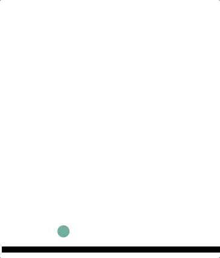

如果你熟悉CSS动画，你一定知道CSS动画中也是有缓动函数的概念的，而大多数缓动效果可以使用三阶贝塞尔曲线描述。

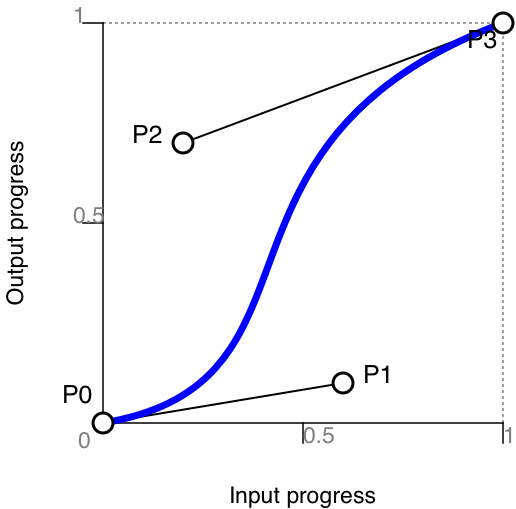

三阶贝塞尔曲线是由P0、P3两个固定点和P2、P1两个动点表述的连续曲线，满足如下线性方程。

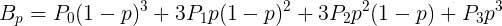

在CSS动画中内置了贝塞尔曲线的缓动函数，比如我们可以写这样的动画：

```html
<div id="block"></div>
```

```css
#block {
  position: absolute;
  width: 50px;
  height: 50px;
  left: 100px;
  background: red;
  animation: move 3s cubic-bezier(0.68, -0.55, 0.265, 1.55);
}

@keyframes move {
  from {left: 100px}
  to {left: 400px}
}
```

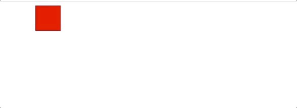

有许多缓动函数都可以通过三阶贝塞尔曲线来实现：

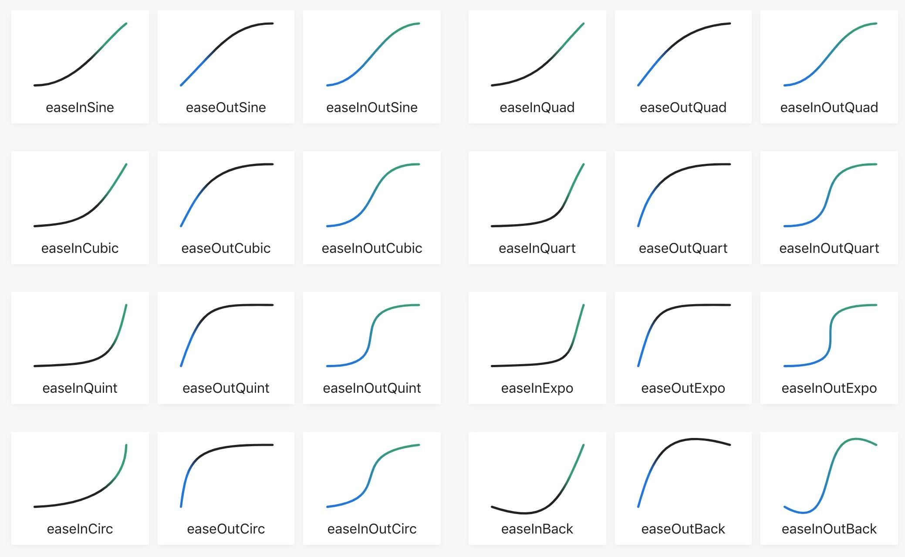

在JS中，我们也可以构造三阶贝塞尔曲线缓动函数，我们可以直接使用[bezier-easing](https://github.com/gre/bezier-easing)这个开源库。

```html
<script src="https://s5.ssl.qhres.com/!8cf7bfcd/bezier-easing.js"></script>
```

```js
animate({
  target: sphere,
  prop: 'top',
  duration: 2000,
  start: 400,
  end: 100,
  easing: BezierEasing(0.68, -0.55, 0.265, 1.55),
  interpolate(start, end, p) {
    return `${start * (1 - p) + end * p}px`;
  }
});
```

上面的代码产生的小球动画效果如下：[在线演示](https://junyux.github.io/FE-Advance/day08/index2-ex2.html)

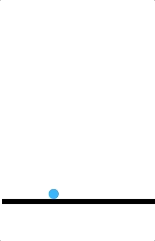

实际上，在较新的浏览器环境中，提供了JavaScript原生的动画API，叫做[Web Animation API](https://developer.mozilla.org/en-US/docs/Web/API/Web_Animations_API)。这是一个目前还处在草案阶段的新特性，仅被部分较新的浏览器所支持。

Web Animation API 为DOM元素提供了原生的animate方法，它接受keyframes和options两个参数，能够用JS实现和CSS基本上一致的关键帧动画：

```js
sphere.animate([
  {top: '400px'},
  {top: '100px'},
], {
  duration: 2000,
  easing: 'cubic-bezier(0.68, -0.55, 0.265, 1.55)',
  fill: 'forwards',
});
```

上面的代码和前一个例子实现的效果一致，但是不需要依赖我们自己实现的动画方法，直接用原生的`.animate`方法即可。

💡因为现在Web Animation API仍然处于ED(Editor Draft)阶段，所以支持的浏览器有限，而且未来API可能还会有所变化，所以现在不建议直接使用。

好在，通过前面的例子我们也看到，自己实现一个简单的JS动画函数，也不是什么困难的事情，有了通用灵活的动画机制，我们就可以实现各种有趣的动画效果。不过，有些特殊的动画效果，除了使用动画函数外，可能还需要运用一些特殊的CSS属性。

## 第五个故事：特殊的动画效果

前面说了动画的基本思路，基本上所有的动画都可以用前面思路来实现。这个故事，我将带你看一些用特殊的元素属性，实现比较神奇的动画效果。

### 元素渐显

最简单的渐显元素的方式是改变元素的透明度，通过操作CSS的opacity属性就能实现。

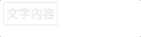

```html
<div id="content">文字内容</div>
```

```css
#content {
  display: inline-block;
  padding: 5px;
  border: solid 1px;
  font-size: 1.5rem;
  opacity: 0;
  animation: fade-in 5s infinite;
}

@keyframes fade-in {
  to {opacity: 1};
}
```

那么，如果我们要让元素从上往下，或者从左往右渐显出来，要如何实现呢：

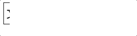

我们可以用伪元素遮盖住元素内容，然后用动画改变伪元素的宽或高：

[在线演示](https://junyux.github.io/FE-Advance/day08/index3-v2.html)

```css
#content {
  position: relative;
  display: inline-block;
  padding: 5px;
  border: solid 1px;
  font-size: 1.5rem;
}

#content::after {
  position: absolute;
  top: -1px;
  right: -1px;
  width: calc(100% + 2px);
  height: calc(100% + 2px);
  content: ' ';
  background: white;
  animation: slide 2s ease-in forwards;
}

@keyframes slide {
  to {width: 0};
}
```

上面的代码需要注意的细节是：

- 如果元素有border，伪元素的宽高要设为100%加上border，对应的`top`和`right`要设置为负的border宽度。
- 因为动画中，文字元素是从左往右显现，所以伪元素的宽度需要从左往右缩小，所以我们需要将伪元素的固定点设置在右上角或者右下角，即：设置`top`/`bottom`和`right`属性；如果动画要从右往左显现，则需要设置`top`/`bottom`和`left`属性；同样，如果从上往下显现，那么就设置`left`/`right`和`bottom`属性。

#### clip-path属性

上面这个方法有点不够完美，主要是我们给`after`伪元素设置了一个白色的背景，如果父元素的背景不是白色，或者改变了，我们就需要修改对应的属性值。实际上，这个问题有个更简单的解决方案，使用CSS的`clip-path`属性：

[在线演示](https://junyux.github.io/FE-Advance/day08/index3-v3.html)

```css
#content {
  position: relative;
  display: inline-block;
  padding: 5px;
  border: solid 1px;
  font-size: 1.5rem;
  clip-path: polygon(0% 0%, 0% 0%, 0% 100%, 0% 100%);
  animation: slide 2s forwards;
}

@keyframes slide {
  to {clip-path: polygon(0% 0%, 100% 0%, 100% 100%, 0% 100%)};
}
```

`clip-path` 属性可以创建一个只有元素的部分区域可以显示的剪切区域。区域内的部分显示，区域外的隐藏。剪切区域是被引用内嵌的URL定义的路径或者外部svg的路径，或者作为一个形状例如`polygon()`。而且，重要的是，`clip-path`支持CSS动画。

上面的代码中，我们采用`polygon`方法剪切可视区域。这个方法接受8个参数，每两个分别表示一个点的坐标。所以，`polygon(0% 0%, 0% 0%, 0% 100%, 0% 100%)`分别表示前2个点在元素的左上角，后两个点在元素的左下角。`polygon(0% 0%, 100% 0%, 100% 100%, 0% 100%)}`这个是动画结束的状态，4个点分别位于元素的左上角、右上角、右下角和左下角。所以，这段CSS规则表示的是从左到右的渐显动画。

稍微修改一下`clip-path`的初始值，我们还可以做斜向或者其他形式的渐显动画：

[在线演示](https://junyux.github.io/FE-Advance/day08/index3-v4.html)

```css
#content {
  position: relative;
  display: inline-block;
  padding: 5px;
  border: solid 1px;
  font-size: 1.5rem;
  clip-path: polygon(0% 0%, 0% 0%, 0% 0%, 0% 100%);
  animation: slide 2s forwards;
}

@keyframes slide {
  to {clip-path: polygon(0% 0%, 100% 0%, 100% 100%, 0% 100%)};
}
```

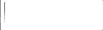

或者：

[在线演示](https://junyux.github.io/FE-Advance/day08/index3-v5.html)

```css
#content {
  position: relative;
  display: inline-block;
  padding: 5px;
  border: solid 1px;
  font-size: 1.5rem;
  clip-path: polygon(50% 50%, 50% 50%, 50% 50%, 50% 50%);
  animation: slide 2s forwards;
}

@keyframes slide {
  to {clip-path: polygon(0% 0%, 100% 0%, 100% 100%, 0% 100%)};
}
```

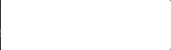


#### mask属性

更复杂的渐显动画可以使用CSS遮罩：`mask`属性，不过这是一个非标准属性，目前需要加-webkit前缀，只有Chorme和Safari等少数浏览器的新版本支持。

`mask`属性可以指定图片作为元素的遮罩，遮罩外的内容隐藏，而且我们可以把遮罩设置为渐变，所以我们就可以使用渐变遮罩来实现更复杂的渐显效果。

```css
#logo {
  display: inline-block;
  width: 150px;
  height: 164px;
  background-image: url(https://p1.ssl.qhimg.com/t01d64366d00102132a.png);
  background-size: 100%;
  -webkit-mask: linear-gradient(to right, #000 0%, transparent 0) 0/20px;
}
```

如上代码所示，`-webkit-mask`可以设置一张图片作为遮罩图片，这个图片可以是SVG图片、PNG图片、线性渐变或者其他渐变，我们这里使用线性渐变。除了设置遮罩图片，还可以设置遮罩位置/宽高，`0/20px`表示遮罩位置为`0,0`，遮罩宽为20px（这里省略了y轴的100%）。

不过因为`linear-gradient`不支持CSS动画，所以我们还需要使用JS：

```js
function animate({target, prop, duration, start, end, easing, interpolate} = {}) {
  const startTime = Date.now();

  return new Promise((resolve) => {
    function update() {
      const t = Date.now() - startTime;
      const p = Math.min(t / duration, 1);

      target.style[prop] = interpolate(start, end, easing ? easing(p) : p);
      if(p < 1) {
        requestAnimationFrame(update);
      } else {
        resolve(p);
      }
    }
    update();
  });
}

animate({
  target: logo,
  prop: 'webkitMask',
  duration: 1000,
  start: 0,
  end: 100,
  interpolate(start, end, p) {
    const v = start * (1 - p) + end * p;
    return `linear-gradient(to right, #000 ${v}%, transparent 0) 0/20px`;
  }
});
```

最终实现的效果如下：[在线演示](https://junyux.github.io/FE-Advance/day08/index3-v6.html)


### 描边动画

描边动画是指演示描绘某个图形的动画，比如实现下面的描绘五角星动画。

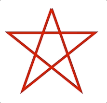

这样的描边动画可以通过改变SVG元素的`stroke-dasharray`和`stroke-dashoffset`两个属性来实现。

[在线演示](https://junyux.github.io/FE-Advance/day08/index4.html)

```html
<svg xmlns="http://www.w3.org/2000/svg" version="1.1" width="500" height="500">
  <g fill="none">
    <polygon points="100,10 40,180 190,60 10,60 160,180">
  </g>
</svg>
```

```css
svg polygon {
  stroke: red;
  stroke-dasharray: 1000;
  stroke-dashoffset: 1000;
  stroke-width: 5;
  animation: stroke-path 5s linear infinite;
}

@keyframes stroke-path {
  to {
    stroke-dashoffset: 0;
  }
}
```

`stroke-dasharray`表示将图形以虚线描绘，`stroke-dasharray:1000`表示虚线实线每一个线段长度都是`1000px`，一开始第一条线段是实线，第二条线段是虚线，第三条线段是实线...这样依次交替。

`stroke-dashoffset`表示虚线的偏移，将它也设置为`1000`，那么第一条线就被移出了可见区域，从虚线（即第二条线）开始展示，所以此时的五角星并没有显示出来，然后我们以动画的方式改小虚线的偏移量，这样的话，第一条线（实线）就被慢慢移回可视区域，于是图形的线条就逐步展示出来了。

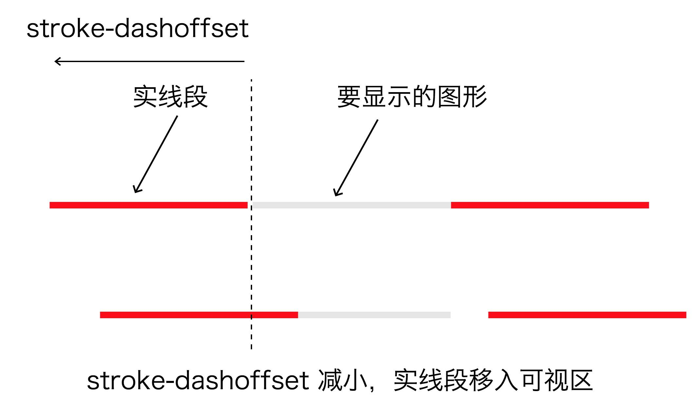

SVG元素除了使用CSS、JS动画，还可以使用SVG支持的SMIL动画，SMIL是Synchronized Multimedia Integration Language的简称。关于SVG的SMIL动画，超过了本课程讨论的范畴，在这里不做进一步讨论，在后续专门讨论SVG的课程中，会有深入的讨论。