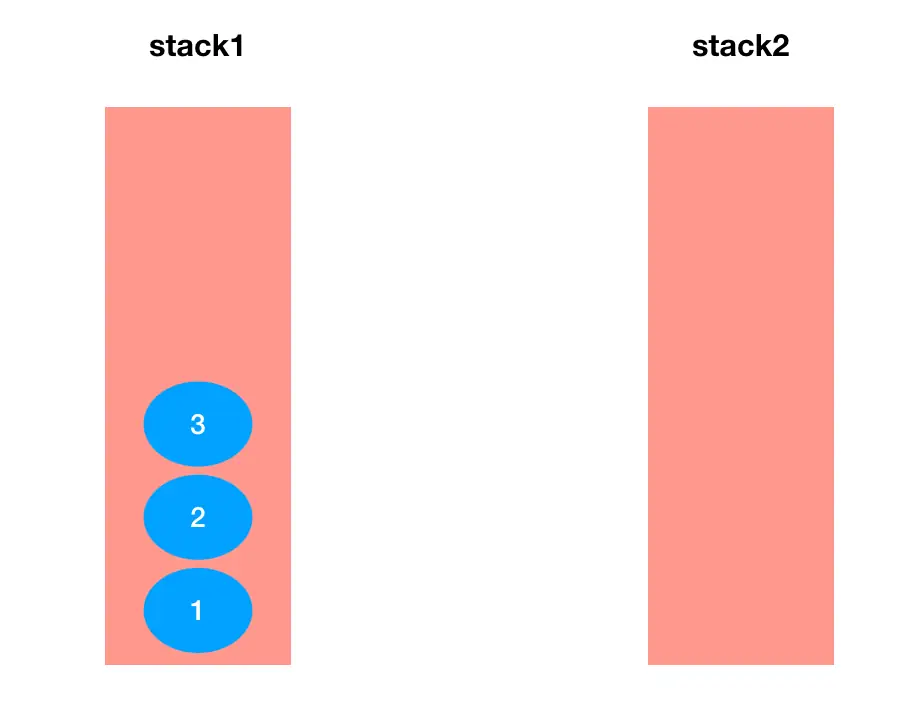
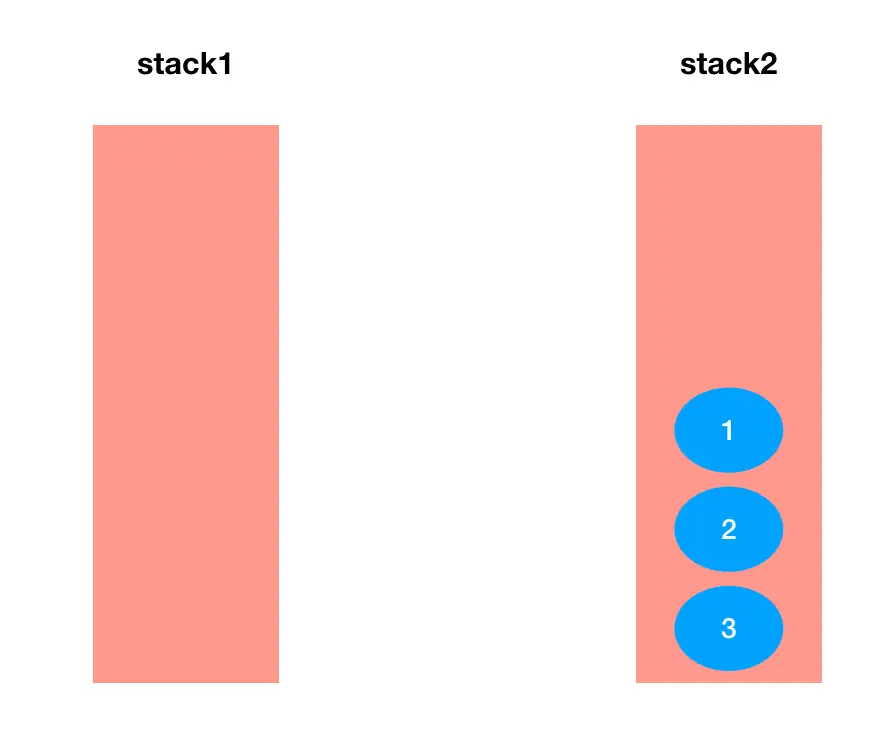
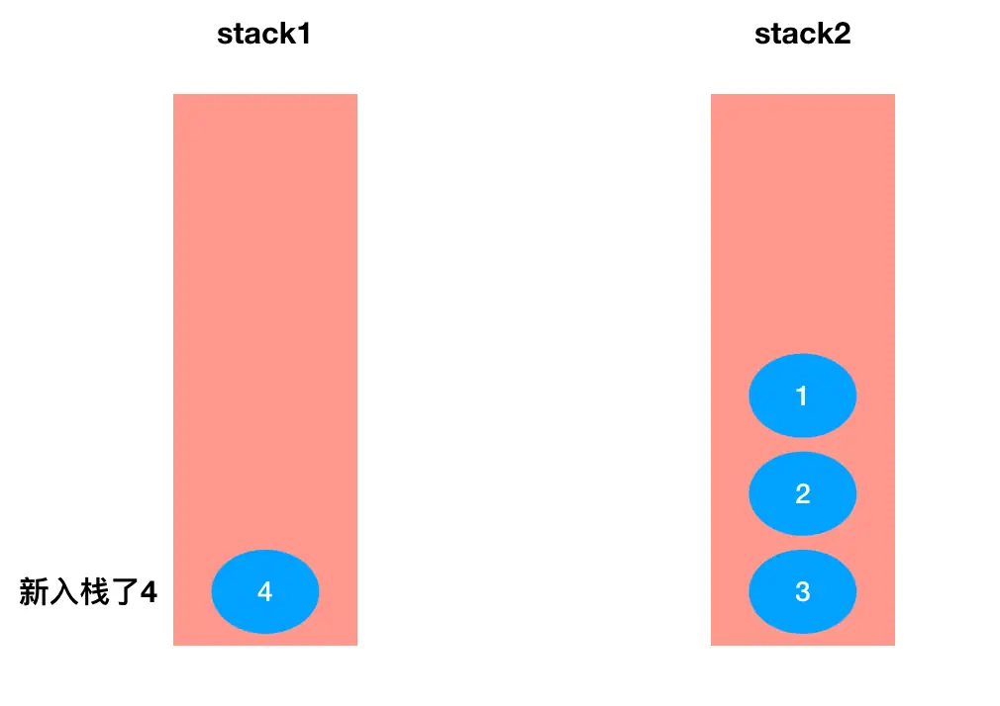
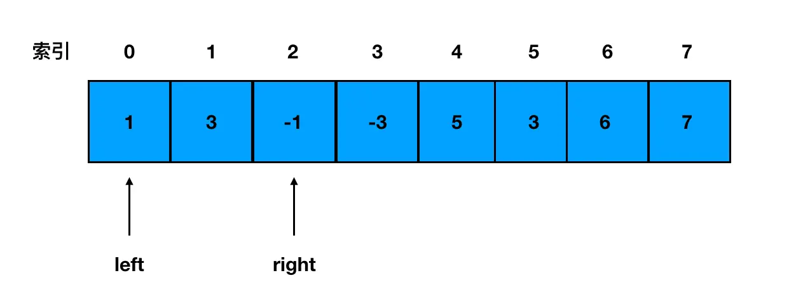
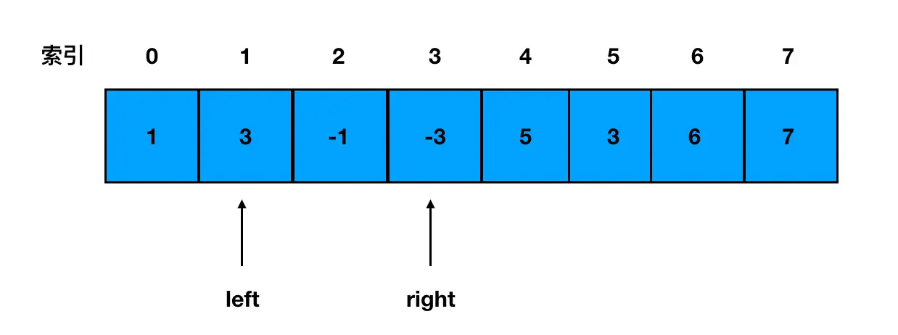
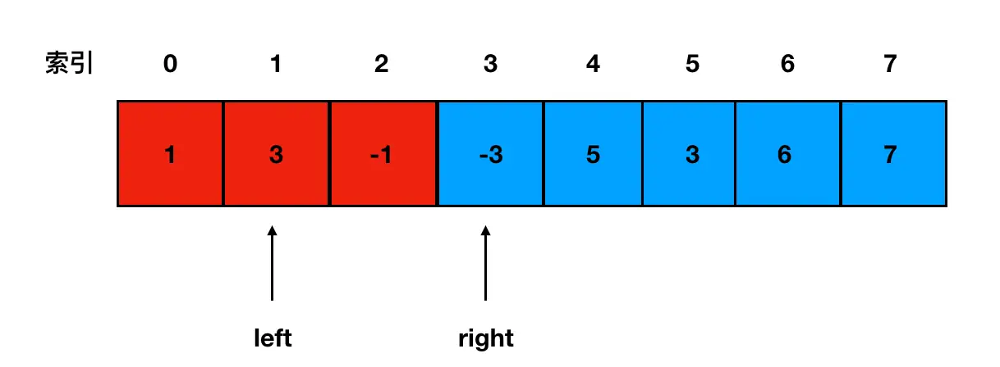
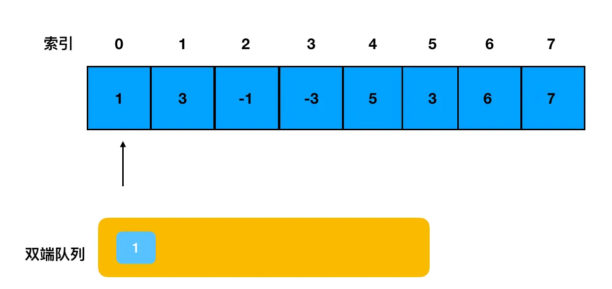
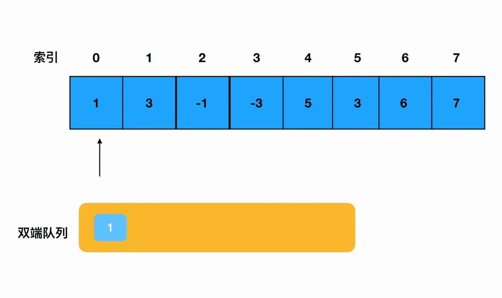
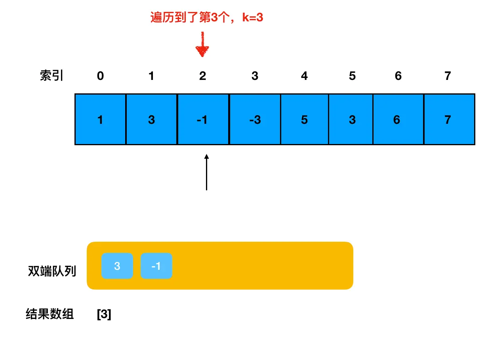
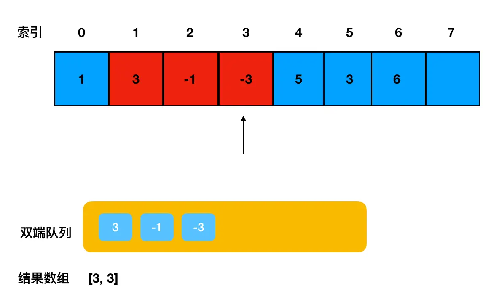

# 13.栈与队列怎么玩（下）

结束了针对栈结构的定点轰炸，我们现在开始要缓缓过渡到队列的世界了。     
 
关于队列，在算法面试中大家需要掌握以下重点：  
1. 栈向队列的转化
2. 双端队列 
3. 优先队列
  
以上考点中，1 属于基础难度， 2 对一部分同学来说已经有点吃力，3 的区分度最高——优先队列属于高级数据结构，其本质是二叉堆结构，考虑到相关题目具有较强的综合性，我们把它放在小册二叉树和堆相关的专题来展开。在本节，我们集中火力向前两个命题点开炮。   


## 为什么一道题可以成为高频面试题
如何用栈实现队列？这个问题在近几年的算法面试中热度非常高。      
   
所谓“热度”从何而来？这里就引出了一个非常有趣的话题：（在前端算法面试中）**什么样的题目是好题**？     

首先，不能剑走偏锋：好的面试题，它考察的大多是算法/数据结构中最经典、最关键的一部分内容，这样才能体现公平；其次，它的知识点要尽可能密集、题目本身要尽可能具备综合性，这样才能一箭双雕甚至一箭N雕，进而体现区分度、最大化面试过程的效率。           
 
能够同时在这两个方面占尽优势的考题其实并不是很多，“**用栈实现队列**”这样的问题算是其中的佼佼者：一方面，它考察的确实是数据结构中的经典内容；另一方面，它又覆盖了两个大的知识点、足以检验出候选人编码基本功的扎实程度。唯一的 BUG 可能就是深度和复杂度不够，换句话说就是不够难。   
  
这个特点，在普通算法面试中可能是 BUG，但在前端算法面试中，实在未必。大家要知道，你是前端，你的面试官也是前端，前端行业普遍的算法水平是啥样他心里还没个数吗...... 实际上大多数前端算法面试题的风格都是非常务实的，需要你炫技的实属特殊情况。     
  

 
## 如何用栈实现一个队列？      
> 题目描述：使用栈实现队列的下列操作：   
push(x) -- 将一个元素放入队列的尾部。   
pop() -- 从队列首部移除元素。   
peek() -- 返回队列首部的元素。   
empty() -- 返回队列是否为空。   
   
> 示例:
MyQueue queue = new MyQueue();   
queue.push(1);     
queue.push(2);   
queue.peek();  // 返回 1   
queue.pop();   // 返回 1   
queue.empty(); // 返回 false

> 说明: 
> - 你只能使用标准的栈操作 -- 也就是只有 push to top, peek/pop from top, size, 和 is empty 操作是合法的。
> - 你所使用的语言也许不支持栈。你可以使用 list 或者 deque（双端队列）来模拟一个栈，只要是标准的栈操作即可。
> - 假设所有操作都是有效的 （例如，一个空的队列不会调用 pop 或者 peek 操作）。   

### 思路分析 
做这道题大家首先要在心里清楚一个事情：栈和队列的区别在哪里？   
仔细想想，栈，后进先出；队列，先进先出。也就是说两者的进出顺序其实是反过来的。用栈实现队列，说白了就是用栈实现先进先出的效果，再说直接点，就是想办法**让栈底的元素首先被取出**，也就是让出栈序列被**逆序**。   
乍一看有点头大：栈结构决定了栈底元素只能被死死地压在最底下，如何使它首先被取出呢？    
一个栈做不到的事情，我们用两个栈来做：    
- 首先，准备两个栈：


- 现在问题是，怎么把第一个栈底下的那个 1 给撬出来。仔细想想，阻碍我们接触到 1 的是啥？是不是它头上的 3 和 2？那么如何让 3 和 2 给 1 让路呢？实际上咱们完全可以把这三个元素按顺序从 stack1 中出栈、然后入栈到 stack 2 里去：   

  



- 此时 1 变得触手可及。不仅如此，下一次我们试图出队 2 的时候，可以继续直接对 stack2 执行出栈操作——因为转移 2 和 3 的时候已经做过一次逆序了，此时 stack2 的出栈序列刚好就对应队列的出队序列。
- 有同学会问，那如果 stack1 里入栈新元素怎么办？比如这样：  
   

你会发现这个4按照顺序应该在 1、2、3 后出栈。当 4 需要被出栈时，`stack2` 一定已经空掉了。当 `stack2` 为空、而 `stack1` 不为空时，我们需要继续把 `stack1` 中的元素转移到 `stack2` 中去，然后再从 `stack2` 里取元素。也就是说，所有的出队操作都只能依赖 `stack2` 来完成——只要我们坚持这个原则，就可以确保 `stack1` 里的元素都能够按照正确的顺序（逆序）出栈。   
  
我们按照这个思路来写代码：   

### 编码实现  

```js
/**
 * 初始化构造函数
 */
const MyQueue = function () {
  // 初始化两个栈
  this.stack1 = [];
  this.stack2 = [];
};

/**
* Push element x to the back of queue.
* @param {number} x
* @return {void}
*/
MyQueue.prototype.push = function (x) {
  // 直接调度数组的 push 方法
  this.stack1.push(x);
};

/**
* Removes the element from in front of queue and returns that element.
* @return {number}
*/
MyQueue.prototype.pop = function () {
  // 假如 stack2 为空，需要将 stack1 的元素转移进来
  if (this.stack2.length <= 0) {
    // 当 stack1 不为空时，出栈
    while (this.stack1.length !== 0) {
      // 将 stack1 出栈的元素推入 stack2
      this.stack2.push(this.stack1.pop());
    }
  }
  // 为了达到逆序的目的，我们只从 stack2 里出栈元素
  return this.stack2.pop();
};

/**
* Get the front element.
* @return {number}
* 这个方法和 pop 唯一的区别就是没有将定位到的值出栈
*/
MyQueue.prototype.peek = function () {
  if (this.stack2.length <= 0) {
    // 当 stack1 不为空时，出栈
    while (this.stack1.length != 0) {
      // 将 stack1 出栈的元素推入 stack2
      this.stack2.push(this.stack1.pop());
    }
  }
  // 缓存 stack2 的长度
  const stack2Len = this.stack2.length;
  return stack2Len && this.stack2[stack2Len - 1];
};

/**
* Returns whether the queue is empty.
* @return {boolean}
*/
MyQueue.prototype.empty = function () {
  // 若 stack1 和 stack2 均为空，那么队列空
  return !this.stack1.length && !this.stack2.length;
};
```


## 认识双端队列   
双端队列衍生出的滑动窗口问题，是一个经久不衰的命题热点。关于双端队列，各种各样的解释五花八门，这里大家不要纠结，就记住一句话：   

**双端队列就是允许在队列的两端进行插入和删除的队列**。    

体现在编码上，最常见的载体是既允许使用 pop、push 同时又允许使用 shift、unshift 的数组：  
```js 
const queue = [1,2,3,4] // 定义一个双端队列   
queue.push(1) // 双端队列尾部入队 
queue.pop() // 双端队列尾部出队   
queue.shift() // 双端队列头部出队 
queue.unshift(1) // 双端队列头部入队
```
  
现在相信你对双端队列已经形成了一个感性的认知，咱们紧接着就开始做题，在题里去认知这种结构的特征和效用。   
  
  
## 滑动窗口问题
> 题目描述：给定一个数组 nums 和滑动窗口的大小 k，请找出所有滑动窗口里的最大值。

> 示例:
输入: nums = [1,3,-1,-3,5,3,6,7], 和 k = 3
输出: [3,3,5,5,6,7]      

> 解释:  滑动窗口的位置     
\---------------                
> [1  3  -1] -3  5  3  6  7         
 1 [3  -1  -3] 5  3  6  7           
 1  3 [-1  -3  5] 3  6  7           
 1  3  -1 [-3  5  3] 6  7           
 1  3  -1  -3 [5  3  6] 7           
 1  3  -1  -3  5 [3  6  7]          
 
> 最大值分别对应：  
 3 
 3 
 5 
 5 
 6 
 7 

> 提示：你可以假设 k 总是有效的，在输入数组不为空的情况下，1 ≤ k ≤ 输入数组的大小。

### 思路分析：双指针+遍历法  
这道题如果只是为了做对，那么思路其实不难想，我们直接模拟题中描述的这个过程就行。   
按照题意，它要求我们在遍历数组的过程当中，约束一个窗口——窗口的本质其实就是一个范围，像这样：  
```
[1  3  -1] -3  5  3  6  7 
```    
范围就被圈定在了前三个元素。   
我们前面学过，约束范围，可以用双指针。因此我这里定义一个 `left` 左指针、定义一个 `right` 右指针，分别指向窗口的两端即可：   


接下来我们可以把这个窗口里的数字取出来，直接遍历一遍、求出最大值，然后把最大值存进结果数组。这样第一个窗口的最大值就有了。      
  
接着按照题意，窗口每次前进一步（左右指针每次一起往前走一步），此时的范围变成了这样：   
  

我们要做的仍然是取出当前范围的所有元素、遍历一遍求出最大值，然后将最大值存进结果数组。   

反复执行上面这个过程，直到数组完全被滑动窗口遍历完毕，我们也就得到了问题的答案。  
  
基于这个淳朴的思路，我们来写一波代码：


### 编码实现：双指针+遍历法  

```js
/**
 * @param {number[]} nums
 * @param {number} k
 * @return {number[]}
 */
const maxSlidingWindow = function (nums, k) {
  // 缓存数组的长度
  const len = nums.length;
  // 定义结果数组
  const res = [];
  // 初始化左指针
  let left = 0;
  // 初始化右指针
  let right = k - 1;
  // 当数组没有被遍历完时，执行循环体内的逻辑
  while (right < len) {
    // 计算当前窗口内的最大值
    const max = calMax(nums, left, right);
    // 将最大值推入结果数组
    res.push(max);
    // 左指针前进一步
    left++;
    // 右指针前进一步
    right++;
  }
  // 返回结果数组
  return res;
};

// 这个函数用来计算最大值
function calMax(arr, left, right) {
  // 处理数组为空的边界情况
  if (!arr || !arr.length) {
    return;
  }
  // 初始化 maxNum 的值为窗口内第一个元素
  let maxNum = arr[left];
  // 遍历窗口内所有元素，更新 maxNum 的值
  for (let i = left; i <= right; i++) {
    if (arr[i] > maxNum) {
      maxNum = arr[i];
    }
  }
  // 返回最大值
  return maxNum;
}
```

### 解法复盘  
上面这个解法，你在面试的时候写上去，完全没有问题，也不用担心超时。   
有的同学可能会觉得 `calMax` 这个函数多余了，认为可以直接用 `Math.max` 这个 JS 原生方法。其实就算是`Math.max`，也不可避免地需要对你传入的多个数字做最小值查找，`calMax` 和`Math.max`做的工作可以说是一样的辛苦。我这里手动实现一个 `calMax`， 大家会对查找过程造成的时间开销有更直观的感知。   
  
现在我们来思考一下，上面这一波操作下来，时间复杂度是多少？  
这波操作里其实涉及了两层循环，外层循环是 `while`，它和滑动窗口前进的次数有关。滑动窗口前进了多少次，`while` 就执行了多少次。  
  
假设数组的规模是 `n`，那么从起始位置开始，滑动窗口每次走一步，一共可以走 `n - k ` 次。注意别忘了初始位置也算作一步的，因此一共走了 `n - k + 1`次。然后每个窗口内部我们又会固定执行 `k` 次遍历。注意 `k` 可不是个常数，它和 `n` 一样是个变量。因此这个时间复杂度简化后用大 O 表示法可以记为 `O(kn)`。   
  
`O(kn)` 虽然不差，但对这道题来说，还不是最好。因此在面试过程中，如果你采用了上面这套解法做出了这个题，面试官有 99% 的可能性会追问你：这个题可以优化吗？如何优化？（或者直接问你，你能在线性时间复杂度内解决此题吗？）  
  
答案当然是能，然后面试官就会搬个小板凳坐你旁边，看看你怎么妙手回春，变 `O(kn)` 为 `O(n)`。     
  
接下来你需要表演的，正是面试官期待已久的双端队列解法啊！     
   
### 思路分析：双端队列法   
要想变 `O(kn)` 为 `O(n)`，我们就要想怎么做才能丢掉这个 `k`。   
`k` 之所以会产生，是因为我们现在只能通过遍历来更新最大值。那么更新最大值，有没有更高效的方法呢？   
大家仔细想想，当滑动窗口往后前进一步的时候，比如我从初始位置前进到第二个位置：  


（图中红色的范围是初始位置时，滑动窗口覆盖到的元素）  

此时滑动窗口内的元素少了一个 1，增加了一个 -3——减少的数不是当前最大值，增加的数也没有超越当前最大值，因此最大值仍然是 3。此时我们不禁要想：如果我们能**在窗口发生移动时，只根据发生变化的元素对最大值进行更新**，那复杂度是不是就低很多了？       
  
双端队列可以完美地帮助我们达到这个目的。  

使用双端队列法，核心的思路是维护一个**有效的递减队列**。   

在遍历数组的前期，我们尝试将遍历到的每一个元素都推入队列内部（下图是第一个元素入队的示意图）：  
 


每尝试推入一个元素前，都把这个元素与队列尾部的元素作对比。根据对比结果的不同，采取不同的措施：    
- 如果试图推入的元素（当前元素）大于队尾元素，则意味着队列的递减趋势被打破了。此时我们需要将队列尾部的元素依次出队（注意由于是双端队列，所以队尾出队是没有问题的）、直到队尾元素大于等于当前元素为止，此时再将当前元素入队。    
- 如果试图推入的元素小于队列尾部的元素，那么就不需要额外的操作，直接把当前元素入队即可。    

我用动画来表达一下这个过程：  

   
  
（注：动画大小已经极致压缩，如果仍然存在加载失败问题，可能与网络环境有关。如果你遇到了这个问题，建议 PC 端点击[这里](./images/3722a7a92466cf249b95b67cce644ea3.webp )直接访问动图试试看）  

维持递减队列的目的，就在于**确保队头元素始终是当前窗口的最大值**。  
当遍历到的元素个数达到了 `k` 个时，意味着滑动窗口的第一个最大值已经产生了，我们把它 push 进结果数组里：  



然后继续前进，我们发现数组索引 0 处的元素（`1`）已经被踢出滑动窗口了（图中红色方块对应的是当前滑动窗口覆盖到的元素们）：   



为了确保**队列的有效性**，需要及时地去队列检查下 `1` 这个元素在不在队列里（在的话要及时地踢出去，因为队列本身只维护当前滑动窗口内的元素）。      

这里大家思考一下，我在查找 `1` 的时候，需不需要遍历整个队列？答案是不需要，因为 `1` 是最靠前的一个元素，如果它在，那么它一定是队头元素。这里我们只需要检查队头元素是不是 `1` 就行了。 此时我们检查队头，发现是 `3`：   


  
没错，`1`早就因为不符合递减趋势被从队头干掉了。此时我们可以断定，当前双端队列里的元素都是滑动窗口已经覆盖的有效元素——没毛病，继续往下走就行了。    
  
接下来，每往前遍历一个元素，都需要重复以上的几个步骤。这里我总结一下每一步都做了什么：      

1. 检查队尾元素，看是不是都满足大于等于当前元素的条件。如果是的话，直接将当前元素入队。否则，将队尾元素逐个出队、直到队尾元素大于等于当前元素为止。   
2. 将当前元素入队  
3. 检查队头元素，看队头元素是否已经被排除在滑动窗口的范围之外了。如果是，则将队头元素出队。   
4. 判断滑动窗口的状态：看当前遍历过的元素个数是否小于 `k`。如果元素个数小于`k`，这意味着第一个滑动窗口内的元素都还没遍历完、第一个最大值还没出现，此时我们还不能动结果数组，只能继续更新队列；如果元素个数大于等于`k`，这意味着滑动窗口的最大值已经出现了，此时每遍历到一个新元素（也就是滑动窗口每往前走一步）都要及时地往结果数组里添加当前滑动窗口对应的最大值（最大值就是此时此刻双端队列的队头元素）。       
   
这四个步骤分别有以下的目的：  
1. 维持队列的**递减性**：确保队头元素是当前滑动窗口的最大值。这样我们每次取最大值时，直接取队头元素即可。  
2. 这一步没啥好说的，就是在维持队列递减性的基础上、更新队列的内容。  
3. 维持队列的**有效性**：确保队列里所有的元素都在滑动窗口圈定的范围以内。 
4. 排除掉滑动窗口还没有初始化完成、第一个最大值还没有出现的特殊情况。
  
结合以上的分析，我们来写代码：  
  
### 编码实现   

```js
/**
 * @param {number[]} nums
 * @param {number} k
 * @return {number[]}
 */
const maxSlidingWindow = function (nums, k) {
  // 缓存数组的长度
  const len = nums.length;
  // 初始化结果数组
  const res = [];
  // 初始化双端队列
  const deque = [];
  // 开始遍历数组
  for (let i = 0; i < len; i++) {
    // 当队尾元素小于当前元素时
    while (deque.length && nums[deque[deque.length - 1]] < nums[i]) {
      // 将队尾元素（索引）不断出队，直至队尾元素大于等于当前元素
      deque.pop();
    }
    // 入队当前元素索引（注意是索引）
    deque.push(i);
    // 当队头元素的索引已经被排除在滑动窗口之外时
    while (deque.length && deque[0] <= i - k) {
      // 将队头元素索引出队
      deque.shift();
    }
    // 判断滑动窗口的状态，只有在被遍历的元素个数大于 k 的时候，才更新结果数组
    if (i >= k - 1) {
      res.push(nums[deque[0]]);
    }
  }
  // 返回结果数组
  return res;
};
```

   
 
  
  
（阅读过程中有任何想法或疑问，或者单纯希望和笔者交个朋友啥的，欢迎大家添加我的微信xyalinode与我交流哈~）


