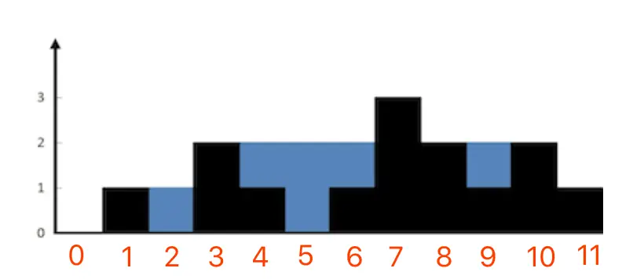
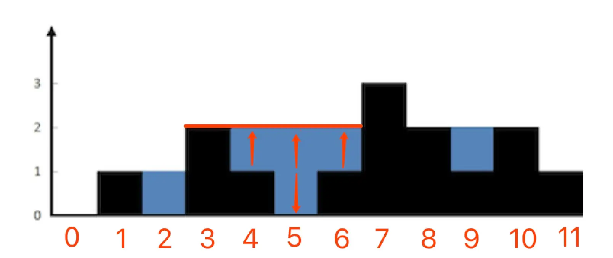
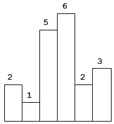
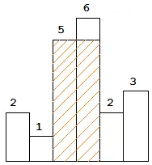
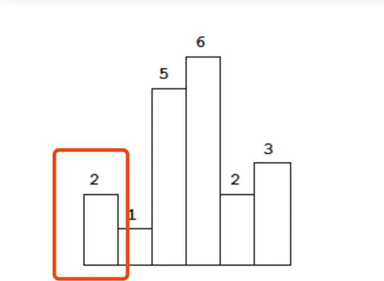
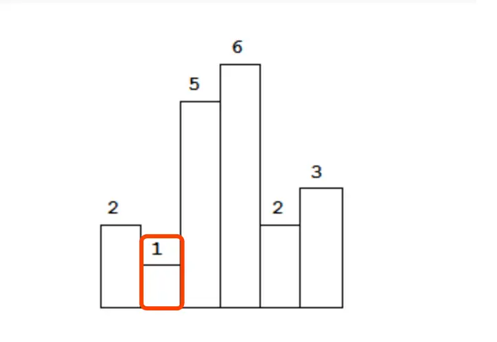
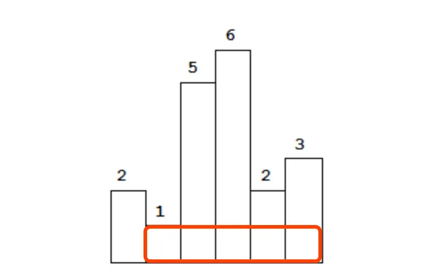
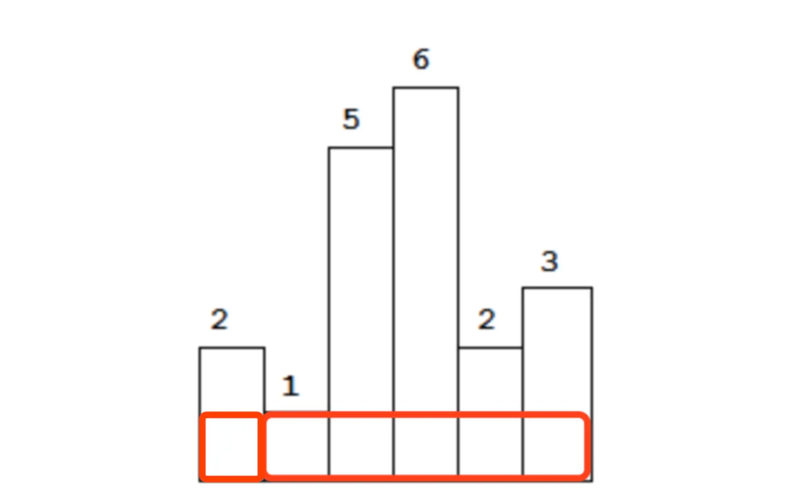
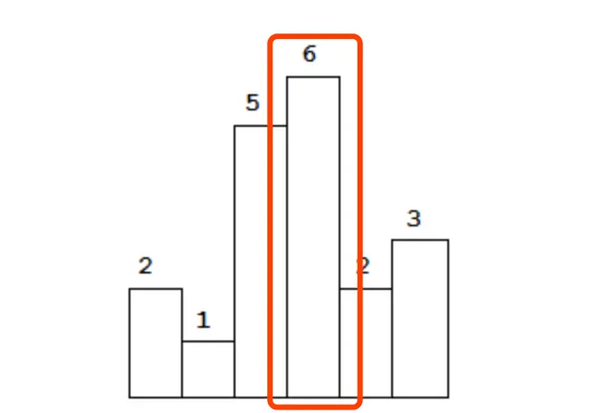

# 27.大厂真题训练与解读——头条真题

延续综合性训练小节的一贯风格，本节所涉及题目仍然存在较大的知识点跨度。这些题目之间，要真说有什么共性，大概就是它们的难度评级都是 Hard 吧。。。（逃。。。。       
  
   
不过没关系，能坚持到宇宙条这一节的你想必也是个狠人。难者不会，会者不难，让我们一起来~~挨打~~做题吧~！^_^       

```!
本节题目不要求所有同学挑战。
如果你急于面试，时间有限，本节可以选择性跳过。策略要灵活，切勿死磕。
```
  
## “接雨水”问题  
> 题目描述：给定 n 个非负整数表示每个宽度为 1 的柱子的高度图，计算按此排列的柱子，下雨之后能接多少雨水。


上面是由数组 [0,1,0,2,1,0,1,3,2,1,2,1] 表示的高度图，在这种情况下，可以接 6 个单位的雨水（蓝色部分表示雨水）。

> 示例：      
输入: [0,1,0,2,1,0,1,3,2,1,2,1]      
输出: 6      

**命题关键字：双指针法、数组、模拟**   
  
### 思路分析    
这道题的解法有很多，这里我为大家介绍接受度相对比较高的双指针法。  
 
对于这道题来说，想明白为什么用双指针法，比用双指针法把它做出来，要难得多得多。所以我们第一个要解决的问题是：这道题凭什么用双指针？     
 
鲁迅说过：**没有认真分析过题意的人，是不配讨论解题方向的**。本题是一道与现实生活结合得比较紧密的应用题，大家拿到手要做的第一件事就是要**结合题意/题中示例抽离解题模型**。

开局一张图，剩下全靠猜——这道题的题干很短，我们分析的主要素材是图片和示例。   
示例比较简单，它给到我们的一个关键信息是：这道题的入参是一个数组。     

你想啊，这题想让你分析数组，同时又没提logN级别的复杂度（要提这个就得往二分上想了），那么遍历肯定是跑不了的吧？所以说这个时候，你心里就应该默默地种下了一个遍历数组的指针了。   

接着看图：  
  
  
图中黑色的部分是柱子，蓝色的部分是接到的雨水。这个图给到我们的一个最直观的体验是：雨水是由柱子“围起来”的——每坨雨水的两侧都有两根柱子，雨水能不能接住、能接多少，涉及到对两根柱子的综合分析。这时候你就应该产生这样的预感——这题估计一个指针搞不定，得往双指针上靠靠！   
  
看到没同学们？对于数组问题来说，双指针未必总是作为单指针解法的改进技巧存在，人家也是有对口解题场景的。所以说，在解决数组问题（尤其是比较复杂的数组问题）时，双指针法必须在你的备选大招列表里拥有姓名~    

对于这道题来说，双指针的作用就是帮助我们更加直接地处理【柱子高度和雨水量】之间的关系，实现对现实问题的**模拟**。所以说要想捋清楚双指针怎么用，首先得捋清楚【柱子高度和雨水量】之间的关系是啥。   
  
找关系的这个过程很关键，它考验的是你的观察能力和归纳总结能力。     
  
如果你对“【柱子高度和雨水量】之间的关系”这个大问题感到懵逼，那么不妨把它拆解成更加具体的小问题。我们的终极目标是统计雨水量，要想做到这点，有两个前提：  
 1. 要能接到雨水 
 2. 要知道接到了多少雨水 

拆解出来的问题就可以是这样的两个：  
1. 什么情况下能接到雨水 ？ 
2. 接到的雨水的量的多少是由谁来决定的？  
 
带着这两个问题，我们重新审视一下题给的图片。不必做特别细致的分析，仅凭直观感受和生活经验，我相信各位不难得出这样的结论： 
1. 两个柱子之间有“凹槽”时，可以接到雨水 
2. 雨水的量由左右两边较矮的柱子的高度决定，类似大家以前做数学题常常见到的“木桶原理”   
 
那么现在问题就具体到了这种程度：  
我应该如何结合双指针法，判断出“凹槽”的存在，并且完成雨水总量的累加计算？  
 
此时你需要做的，就是带上你脑内的双指针，尝试去走一遍这个数组的遍历，看看这个过程中能不能发现点什么有趣的东西。  
 
这里问题又来了：我该用快慢指针、还是对撞指针呢？   
答案是对撞指针，因为“凹槽”是在对撞的过程中“夹”出来的——这个决策没有用到我们前面专题文章总结过的任何快慢指针和对撞指针的选型规律，它完全依靠你自身对题目的感知和分析。   
  
能想到对撞指针，这道题已经做对了一半。下面我们结合图中的两种情况，一起来寻思一下这个对撞指针应该怎么用：  


  
首先讨论下索引[1,3]区间和索引[8,10]区间覆盖到的这种情况：两个柱子中间有一个凹槽，这个凹槽比较简单，它的宽度是1，高度就是由两个柱子中较矮的那一个决定的（第二个区间左右柱子的高度是相等的，所以取其中一个，和凹陷处的柱子高度做减法就可以了）。   
 
接着再看索引[3,7]区间覆盖到的这种情况：索引为3的柱子和索引为7的柱子之间有一个凹槽，这个凹槽比较复杂，它左右两边高度为1，中间的高度为2。可以看出，对于左右两边来说，凹槽的高度就是相邻两根柱子之间的高度差。但是对于中间那个高度为2的凹槽来说，它的高度是【当前柱子和它左侧最高的那个柱子】之间的高度差：   

   


喔，原来凹槽的深度不是由与它相邻的柱子来决定的，而是**由某一侧的最高的柱子决定的**。  

那么为什么是左侧最高的柱子，而不是右侧最高的柱子？  
因为左侧最高的柱子，比右侧最高的柱子要矮。在蓄水量这个问题上，矮的柱子说了算。   
 
由此我们可以得到一个这样的结论：对于凹槽来说，决定它高度的不是与它相邻的那个柱子，而是**左侧最高柱子和右侧最高柱子中，较矮的那个柱子**。   
  

因此我们在指针对撞的过程中，主要任务有两个：
1. 维护一对`leftCur`（左指针）和`rightCur`（右指针，以对撞的形式从两边向中间遍历所有的柱子
2. 在遍历的过程中，维护一对 `leftMax` 和 `rightMax`，时刻记录当前两侧柱子高度的最大值。以便在遇到“凹槽”时，结合`leftCur`与`rightCur`各自指向的柱子高度，完成凹槽深度（也就是蓄水量）的计算。   
  
将以上两个任务以编码的语言表达出来，就可以得到这道题的答案了。   

### 谈谈“真题训练”
讲到这里，不知道大家的思路现在是否清晰一些了。如果仍然对其中的一些点想不明白，我建议你也先别急着撤退。写算法小册这段日子，我个人最深刻的一种感觉就是，读者对【讲解】这个事情的依赖性是越来越强的。但其实到了真题训练这个环节，每位同学都不应该再只关注题目本身，而应该关注自己**对题目的思考**。     

拿这道题来说，以笔者的脑回路来看，我会坚定地认为它就是一个应该用对撞指针求解的数组问题。这份“坚定”来源于笔者与海量真题搏斗过后，沉淀下来的一种叫做【题感】的东西。我相信大部分同学跟着上面的题解，一步一步走下来，也能够把这道题的解法理解个大概。但这就是学习的全部吗？当然不是！你还需要想：**如果这道题是交给我来做，我会怎么搞**？     
  
有的同学会问了：答案都在上面了，你都“坚定认为这题就用对撞指针”了，我还能怎么搞？   

别说，不同的熟手玩家来做这个题，就是会坚定不同的解法。比如很多同学在分析完示例之后就会坚定地认为，这道题必须用【栈】来做，其它解法都靠边站。   
  
巧了，这道题就算用栈来做，也完全不超纲——用到的都是我们在第12、13节讲过的知识，就看你怎么把知识和题目建立关联。   
  
  
现在，仔细想想，如果回过头重做这道题，你是否也会一开始就给自己定下【对撞指针】的基调？还是说你更喜欢先逐个分析题给示例中柱子和雨水之间的种种关系、最后再敲定你的解法？   
  
如果你跟着笔者给出的思路往下走，觉得别扭，那么能不能把阅读顺序反转一下，先从分析示例做起，逐步推导出双指针的存在，或者干脆另辟蹊径？   
别忘了，你的目的是【靠自己搞懂这道题】，而不是【完全复刻某人的思路】。在真题训练环节，舞台属于你自己，题解只是个辅助。 


  


  


  


  
### 编码实现   

```js
/**
 * @param {number[]} height
 * @return {number}
 */
const trap = function(height) {
    // 初始化左指针
    let leftCur = 0  
    // 初始化右指针
    let rightCur = height.length - 1  
    // 初始化最终结果
    let res = 0  
    // 初始化左侧最高的柱子
    let leftMax = 0    
    // 初始化右侧最高的柱子
    let rightMax = 0  
    
    // 对撞指针开始走路
    while(leftCur < rightCur) {
        // 缓存左指针所指的柱子的高度
        const left = height[leftCur]  
        // 缓存右指针所指的柱子的高度
        const right = height[rightCur]  
        // 以左右两边较矮的柱子为准，选定计算目标
        if(left < right) {
            // 更新leftMax
            leftMax = Math.max(left, leftMax)  
            // 累加蓄水量
            res += leftMax - left
            // 移动左指针
            leftCur++
        } else {
            // 更新rightMax
            rightMax = Math.max(right, rightMax)
            // 累加蓄水量
            res += rightMax - right  
            // 移动右指针
            rightCur-- 
        }
    }
    // 返回计算结果
    return res
};
```

### 思路拓展 
我们前面说过，数组问题往往可以转化为栈问题或队列问题。 
这道题就可以用栈的思路来解。   
想一想，为什么？怎么做？

## K个一组翻转链表 
> 题目描述：给你一个链表，每 k 个节点一组进行翻转，请你返回翻转后的链表。  
k 是一个正整数，它的值小于或等于链表的长度。   
如果节点总数不是 k 的整数倍，那么请将最后剩余的节点保持原有顺序。

> 示例：
给你这个链表：1->2->3->4->5   
当 k = 2 时，应当返回: 2->1->4->3->5   
当 k = 3 时，应当返回: 3->2->1->4->5

**命题关键字：链表、链表的翻转、复杂数据处理**   


### 思路分析 
同学们，这道题摆在这里，是为了兑现我在第10节留给大家的一个承诺。说真的，对现在的你来说，这个题真不能算是 `hard` 题，它最多是个`medium`。  
经过第10节的洗礼，现在的你已经掌握了局部翻转指定范围链表结点的能力。这道题要你做的，就是记一个`count` 变量，每次累加到`k`个结点，就表演一次“局部链表翻转”这个节目。    
  
这道题的难点在第10节其实已经拆完了，现在就是看各位对学过的知识有没有真正地吃透嚼烂。   
屏幕前的你，不要再往下翻了，赶紧去打开[这道题的力扣链接](https://leetcode-cn.com/problems/reverse-nodes-in-k-group/)，验证一下自己对链表翻转类题目的掌握程度。如果你能靠自己的力量做对，那么你完全可以直接跳过下面的题解；如果不能，请你带着愉悦的心情复习一下第10节，然后再次向它发起挑战。   
 
如果还是不能，也没关系。毕竟，我还是会给你写注释的orz：  
  
### 编码实现    

```js
/**
 * @param {ListNode} head
 * @param {number} k
 * @return {ListNode}
 */
const reverseKGroup = function(head, k) {
  // 这个方法专门用来翻转指定范围（以head为起点）内的k个结点
  function reverse(head) {
      // 初始化 pre、cur、next三剑客
      let pre = null, cur = head, next = null  
      // 遍历当前范围结点
      while(cur) {
          // 缓存next
          next = cur.next  
          // 翻转当前结点的next指针
          cur.next = pre  
          // pre、cur各前进一步，为下一个指针的翻转做准备
          pre = cur  
          cur = next  
      }
      // 翻转到最后，pre会指向最末尾的结点，也就是翻转后的第一个结点
      return pre
  }
  // 有dummy指针好办事
  let dummy = new ListNode()  
  dummy.next = head 
  // pre用来缓存当前这一截k个结点的链表前驱的那个结点（不丢头）
  let pre = dummy
  // start指向k个一组的局部链表中的第一个
  let start = head
  // end指向k个一组的局部链表中的最后一个
  let end = head
  // next用来缓存当前这一截k个结点的链表后继的那个结点（不丢尾）
  let next = head  
  // 当后继结点存在时，持续遍历
  while(next) {
      // 找到k个结点中的最后一个
      for(let i=1;i<k&&end;i++) {
          end = end.next
      }
      // 如果不满k个，直接返回
      if(!end) {
         break
      } 
      // 缓存这k个结点的后继结点
      next = end.next  
      // 这一步把end.next置为null，是为了配合reverse方法
      end.next = null  
      // 手动把end指向start（因为下面reverse完start就会改变）
      end = start 
      // 以start为起点翻转k个结点
      start = reverse(start) 
      // 接上尾巴
      end.next = next  
      // 接上头
      pre.next = start 
      // pre、start、end一起前进，为下一次翻转做准备 
      pre = end
      start = next  
      end = start
  }
  // dummy.next指向的永远是链表的第一个结点
  return dummy.next
};
```
 
### 思路拓展 
这道题还可以用递归来做。 
想一想，怎么实现？  


## 柱状图中的最大矩形 
> 题目描述：给定 n 个非负整数，用来表示柱状图中各个柱子的高度。每个柱子彼此相邻，且宽度为 1 。    
求在该柱状图中，能够勾勒出来的矩形的最大面积。   


以上是柱状图的示例，其中每个柱子的宽度为 1，给定的高度为 [2,1,5,6,2,3]。   

图中阴影部分为所能勾勒出的最大矩形面积，其面积为 10 个单位。

> 示例:   
输入: [2,1,5,6,2,3]    
输出: 10   

**命题关键字：数学问题、模拟、单调栈**   

### 思路分析 
  
首先，矩形面积如何计算？长X宽，对吧？这道题给到我们的是一个高度数组，对于每个高度来说，以它为高度的矩形的宽度是未知的。因此我们最直观的一个思路，就是固定一个高度，去探索宽度的上限。举个例子，假如说我固定的是图中的第一个柱子的高度：  

  
  
从第一个柱子出发，往前遍历，发现下一个柱子的高度是1。1<2，很明显以第一个柱子为高的矩形宽度没办法再扩散了，它的宽度只能是1。      
  
再看第二个柱子：  

  
  
这个柱子高度是1，我们往下遍历，发现它后面的所有柱子
都比它高，这就意味着以1为高度的矩形面积是可以向下扩散的：  
   
扩散到不能再扩散为止时，已经跨越了5个柱子。现在再回头看，发现它左边的柱子也比自己高，那么矩形的宽度还可以再向左扩散：  



如此一来，以第二个柱子为高的矩形，最大面积可以达到1X6=6。       
  
由此我们也可以总结出矩形宽度最大值的计算规则：若下一个柱子比当前柱子高，则持续扩散以当前柱子为高度的矩形宽度（扩展矩形的右边界）；否则停止扩散，“回头看”寻找左边界，进而计算总宽度。

秉持上述的计算规则，对每一个柱子都重复此操作，我们就能得到每一个柱子所支撑的最大矩形的面积。从这些面积中对比出一个最大值，就算是把这道题做出来了。   
  
基于这个思路，我们来写代码：  


### 编码实现
```js
/**
 * @param {number[]} heights
 * @return {number}
 */
const largestRectangleArea = function(heights) {
  // 判断边界条件
  if(!heights || !heights.length) return 0 
  // 初始化最大值
  let max = -1  
  // 缓存柱子长度
  const len = heights.length
  // 遍历每根柱子
  for(let i=0;i<len;i++) {
      // 如果遍历完了所有柱子，或者遇到了比前一个矮的柱子，则停止遍历，开始回头计算
      if(i == len-1 || heights[i]>heights[i+1]) {
          // 初始化前i个柱子中最矮的柱子
          let minHeight = heights[i]  
          // “回头看”
          for(let j=i;j>=0;j--) {
              // 若遇到比当前柱子更矮的柱子，则以更矮的柱子为高进行计算
              minHeight = Math.min(minHeight, heights[j])  
              //  计算当前柱子对应的最大宽度的矩形面积，并及时更新最大值
              max = Math.max(max, minHeight*(i-j+1))
          }
      }
  }
  // 返回结果
  return max
};
```   
  
### 思路拓展   
这道题还可以用栈来做，但是解法相对比较难推导，这里我先给大家做一遍。

   
站在高度为6的柱子这里，向后遍历，发现2比6小，矩形宽度不能再扩散了。此时我们回头看，首先计算出来的是高度为6的矩形的面积，然后才计算出来高度为5的矩形的面积——后面的柱子比前面的柱子先出结果。这叫啥？这叫后进先出！后进先出的数据结构是啥？是栈！由此，这道题的大方向就有了个脉络——借助栈来模拟矩形宽度的探索过程。   
  
具体需要一个什么样的栈呢？回到上一个解法中去看，当柱子高度递增时，我们不做特殊处理（此时只需要入栈）。只有当发现柱子的高度回落时，才会开始“弹出”前面柱子对应的结果（出栈）。所以我们在编码层面的一个基本思路，就是去维护一个单调递增栈。   
多说无益，都在注释里了：  

### 编码实现  

```js
/**
 * @param {number[]} heights
 * @return {number}
 */
const largestRectangleArea = function(heights) {
  // 判断边界条件
  if(!heights || !heights.length) return 0  
  // 初始化最大值
  let max = -1  
  // 初始化栈
  const stack = [] 
  // 缓存柱子高度的数量
  const len = heights.length
  // 开始遍历
  for(let i=0;i<len;i++) {
     // 如果栈已经为空或当前柱子大于等于前一个柱子的高度
     if(!stack.length || heights[i] >= heights[stack[stack.length-1]]) {
         // 执行入栈操作
         stack.push(i)
     } else {
         // 矩形的右边界
         let right = i  
         // pop出作为计算目标存在的那个柱子
         let target = stack.pop()  
         // 处理柱子高度相等的特殊情况
         while(stack.length&&heights[target]===heights[stack[stack.length-1]]) {
             // 若柱子高度相等，则反复pop
             target = stack.pop()
         }
         // 矩形的左边界
         let left = (!stack.length)? -1: stack[stack.length-1]  
         // 左右边界定宽，柱子定高，计算矩形面积
         max = Math.max(max, (right-left-1)*heights[target]) 
         // 这一步保证下一次循环从当前柱子往下走（因为当前柱子还没作为计算目标计算出结果）
         i--
     }
  }
  // rightAdd是我们针对右边界为空这种情况，补上的一个假的右边界
  let rightAdd = stack[stack.length-1]+1  
  // 此时栈里是高度单调递增（不减）的柱子索引，这些柱子还没有参与计算，需要针对它们计算一遍
  while(stack.length) {
      // 取出栈顶元素作为计算目标
      let target = stack.pop()  
      // 找到左边界
      let left = (!stack.length)? -1 : stack[stack.length-1]  
      // 注意这里的右边界一定是rightAdd，想一想，为什么？
      max = Math.max(max, (rightAdd-left-1)*heights[target])
  }
  // 返回计算出的最大值
  return max
};
```
  

 
 
 